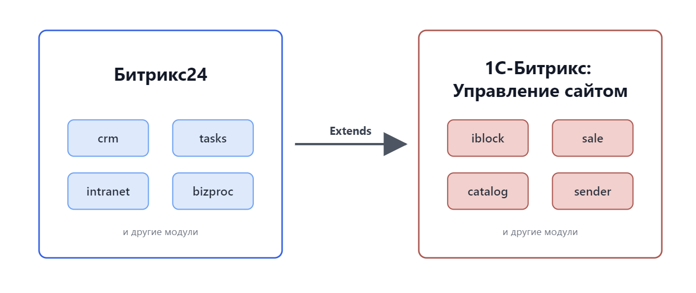
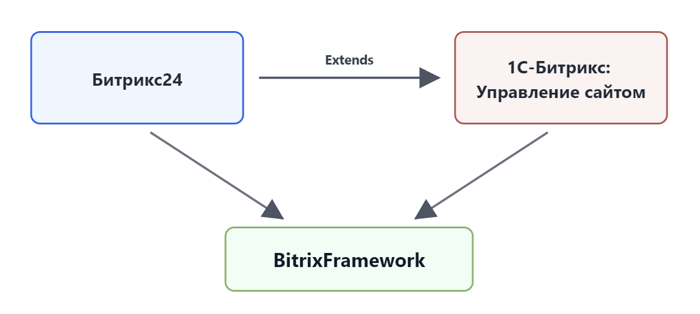
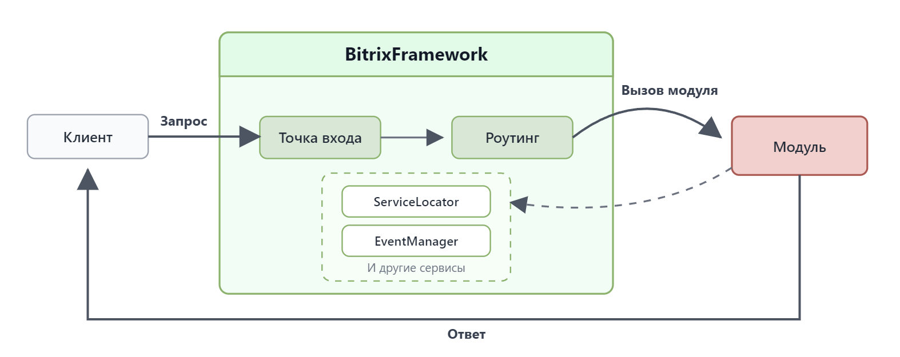

Bitrix Framework — PHP-платформа для разработки веб-приложений. Она служит основой для двух продуктов: 1C-Битрикс: Управление сайтом и Битрикс24.

1C-Битрикс: Управление сайтом — это система управления контентом (CMS). В ней создают сайты и управляют их содержимым. Система помогает публиковать новости и страницы, настраивать интернет-магазин, рассылки, рекламу и аналитику. За эти сценарии отвечают модули продукта: информационные блоки `iblock`, торговый каталог `catalog`, интернет-магазин `sale`, рассылки `sender` и другие. Продукт устанавливают на собственный сервер.

Битрикс24 — это корпоративный портал для управления бизнесом и совместной работы. В нем ведут клиентов в CRM, выполняют задачи, автоматизируют процессы и общаются в чатах. За эти сценарии отвечают модули продукта: CRM `crm`, задачи `tasks`, мессенджер `im`, интранет `intranet`, бизнес-процессы `bizproc` и другие. Битрикс24 поставляется в двух версиях:

- Облачная — онлайн-сервис, который работает сразу, без установки.

- Коробочная — продукт, который можно установить на свой сервер и адаптировать под нужды компании.

## Как связаны CMS и Битрикс24

1C-Битрикс: Управление сайтом и Битрикс24 входят в одну продуктовую экосистему. Bitrix Framework обеспечивает общую платформу для этих продуктов: подключает модули, предоставляет базовые сервисы и управляет взаимодействием между частями системы. За базовую работу ядра отвечает главный модуль `main`, а за общие интерфейсные компоненты — библиотека `ui`.

1C-Битрикс: Управление сайтом содержит модули для создания публичных сайтов: информационные блоки `iblock`, управление структурой `fileman`, торговый каталог, интернет-магазин и другие возможности.

Битрикс24 использует ту же платформу и добавляет модули для бизнеса: CRM `crm`, задачи `tasks`, мессенджер `im`, бизнес-процессы и другие инструменты.

## Как устроен модульный монолит

Продукты экосистемы работают как модульный монолит. Система состоит из самостоятельных модулей, но выполняется как единое приложение. Каждый модуль отвечает за отдельную область: контент, торговый каталог, CRM, задачи, сообщения или интерфейс.

Взаимодействие между модулями обеспечивает Bitrix Framework. Основные механизмы платформы находятся в главном модуле `main`: загрузка модулей, события, права доступа, кеширование, работа с базой данных и другие базовые сервисы.

## Как обрабатывается запрос

Порядок обработки зависит от типа страницы и настроек проекта. В общем виде запрос проходит несколько этапов.

1. Запрос приходит в точку входа: физическую страницу сайта или файл `routing_index.php`, если проект использует роутинг.

2. Bitrix Framework подключает ядро и модули, которые нужны для обработки.

3. Система передает обработку нужному коду: компоненту, контроллеру, странице или обработчику модуля.

4. Код формирует результат, а система возвращает ответ пользователю.

## Что дальше

Чтобы изучить связанные темы, перейдите к статьям:
- [Архитектура](../framework/architecture.md),
- [Жизненный цикл запроса](../framework/request-lifecycle.md),
- [Роутинг](../framework/routing.md). 

Если нужно сравнить платформу с другими решениями, используйте статьи:
- [Отличия от других CMS](./cms-comparison.md),
- [Отличия от других фреймворков](./framework-comparison.md).
