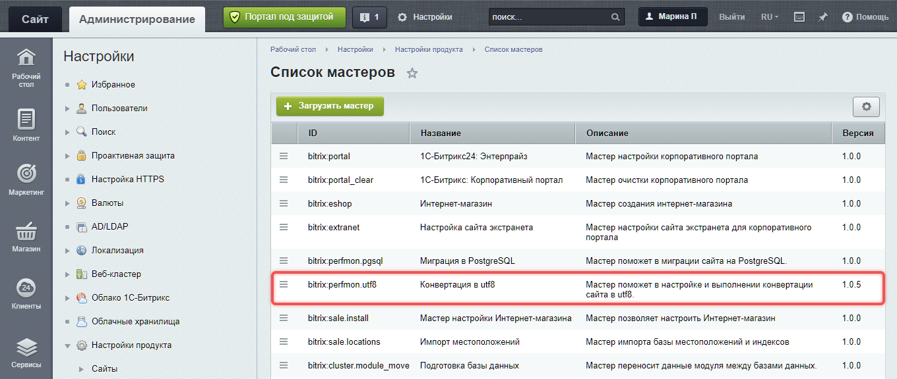

Кодировка определяет, как система хранит и передает текстовые данные: содержимое страниц, языковые файлы, значения из базы данных, письма, файлы обмена и ответы API.

Продукты Bitrix Framework работают в кодировке UTF-8.

Ранее продукты могли работать с однобайтовыми кодировками, например `cp1251`. В актуальных версиях такие кодировки не поддерживаются: проект должен использовать UTF-8. Старые проекты нужно [перевести в UTF-8 перед обновлением](#conversion-wizard).

## Как связаны настройки кодировки

В Bitrix Framework за кодировку отвечают несколько уровней настроек. Они не заменяют друг друга, а проверяются и используются системой в разные моменты загрузки ядра.

Кодировка проекта складывается из настроек PHP, конфигурации ядра, региональных настроек и соединения с базой данных. Если один из уровней использует другую кодировку, текст может повредиться при обработке, сохранении или выводе.

#|
|| **Уровень** | **Что задает** | **Где используется** ||
|| PHP-окружение | `default_charset`, `mb_internal_encoding()` и расширение `mbstring`. | Должно соответствовать UTF-8, чтобы PHP корректно обрабатывал строки до и после загрузки ядра. ||
|| Конфигурация ядра | Параметр `utf_mode` в `/bitrix/.settings.php`. | Мастер конвертации в UTF-8 проверяет, что `Configuration::getValue('utf_mode') === true`. Параметр не записывает значение в константу `SITE_CHARSET`. Кодировку текущего контекста ядро получает из региональных настроек. ||
|| Региональные настройки | Объект `Culture` текущего контекста. Он хранит параметры языка или сайта, включая кодировку. | После инициализации контекста ядро получает кодировку из объекта `Culture` и определяет константы совместимости `SITE_CHARSET` и `LANG_CHARSET`. ||
|| Константы совместимости | `BX_UTF`, `SITE_CHARSET`, `LANG_CHARSET`. | Нужны старому коду и внутренним проверкам. Для нового кода используйте `Application::getInstance()->getContext()->getCulture()`. ||
|| Соединение с БД | `charset` в `connections.default`, команды в `after_connect_d7.php`, кодировка базы, таблиц и полей. | Должно совпадать с UTF-8-режимом приложения, чтобы данные не повреждались при чтении и записи. ||
|#


Порядок загрузки:

1. Ядро подключает `/bitrix/php_interface/dbconn.php`. В этом файле могут быть ранние настройки PHP и константы совместимости.

2. Затем ядро подключает `modules/main/include/constants.php`. Если `BX_UTF` еще не определена, ядро определяет ее со значением `true`.

3. Контекст запроса определяет текущий сайт, язык и объект `Culture`. Для публичной части объект `Culture` берется из настроек сайта, для административного раздела — из языка интерфейса.

4. После инициализации объекта `Culture` ядро определяет константы совместимости `SITE_CHARSET` и `LANG_CHARSET`, которые получают значение `$culture->getCharset()`.

5. Если опция Главного модуля `include_charset` равна `Y`, ядро отправляет HTML-заголовок `Content-Type` с `LANG_CHARSET`.

### Как получить кодировку текущего контекста

Получить объект `Culture` текущего контекста можно методом `getCulture()`.

```php
<?php
use Bitrix\Main\Application;

$culture = Application::getInstance()->getContext()->getCulture();
$charset = $culture->getCharset();
```

`Culture` хранит параметры языка и сайта текущего запроса. Подробнее в статье [Локализация](./localization.md).

Константы `SITE_CHARSET`, `LANG_CHARSET` и `BX_UTF` остаются механизмом совместимости для старого кода. В новом коде используйте объект `Culture` из текущего контекста. Не используйте константу `BX_UTF` как источник конкретного значения кодировки: она показывает режим совместимости, а charset текущего контекста хранит `Culture`.

Для обычной HTML-страницы HTTP-заголовок отправляется автоматически. Ядро читает опцию Главного модуля `include_charset` со значением по умолчанию — `Y`.

```html
Content-Type: text/html; charset=UTF-8
```

## Как настроить UTF-8 в проекте

Для корректной работы проекта используйте UTF-8 в окружении, конфигурации, базе данных, файлах и обмене с внешними системами.



Параметр `utf_mode` в `.settings.php` должен быть включен для проекта в UTF-8:

```php
'utf_mode' => [
    'value' => true,
    'readonly' => true,
],
```

Этот параметр проверяет мастер конвертации в UTF-8. Он не подменяет региональные настройки сайта и языка: после загрузки ядра кодировка текущего контекста все равно берется из объекта `Culture`.



Не проверяйте кодировку проекта по одному признаку: настройки PHP, конфигурация ядра, региональные настройки и подключение к базе данных должны быть согласованы между собой.



-  Подробнее о параметрах ядра в статье [Конфигурация ядра](./../framework/settings.md).

-  Подробнее о региональных настройках в статье [Локализация](./localization.md).



### PHP

-  В файле `php.ini` задано `default_charset = "UTF-8"`.

-  Внутренняя кодировка `mb_internal_encoding()` равна `UTF-8`.

### Конфигурация ядра

-  В `/bitrix/.settings.php` включена секция `'utf_mode' => ['value' => true, 'readonly' => true]`.

-  В текущем контексте `Application::getInstance()->getContext()->getCulture()->getCharset()` возвращает `UTF-8`.

-  В `/bitrix/php_interface/dbconn.php` не должно быть настроек для однобайтовых кодировок, например, `setlocale(LC_ALL, 'ru_RU.CP1251')` или `mb_internal_encoding('Windows-1251')` для `cp1251`.

### База данных

-  Кодировка соединения с БД соответствует UTF-8.

-  Для MySQL значения `character_set_connection`, `character_set_results` должны быть `utf8`, `utf8mb3` или `utf8mb4`, а правила сравнения строк (collation) — соответствовать выбранной UTF-8-кодировке.

-  Кодировка базы, таблиц и текстовых полей совпадает с кодировкой соединения.

-  В `/bitrix/php_interface/after_connect.php` и `/bitrix/php_interface/after_connect_d7.php` нет команд, которые переключают соединение в однобайтовую кодировку.

### Файлы проекта

PHP, HTML, JavaScript, CSS, YAML, JSON, языковые файлы и шаблоны сохранены в UTF-8 без BOM.

### Почта и экспорт

В заголовках писем, CSV, XML и других файлов указан `charset=UTF-8`, если формат требует явного указания кодировки.

## Как работать с файлами

Сохраняйте исходники проекта в UTF-8 без BOM. Особенно проверяйте файлы, которые выполняются или подключаются как часть проекта:

-  PHP-файлы модулей, компонентов и обработчиков,

-  языковые файлы `/lang/<код языка>/`,

-  шаблоны сайта и шаблоны компонентов,

-  файлы JavaScript, CSS, YAML и JSON.

Символ BOM в начале PHP-файла может вывести скрытые байты до HTTP-заголовков и нарушить редиректы, авторизацию, скачивание файлов или AJAX-ответы.

Для файлов обмена, CSV и XML проверяйте не только BOM, но и фактическую кодировку входных данных. Если внешний файл приходит не в UTF-8, конвертируйте данные.

```php
<?php
use Bitrix\Main\Text\Encoding;

$source = file_get_contents($_SERVER['DOCUMENT_ROOT'] . '/upload/import.csv');
$content = Encoding::convertEncoding($source, 'windows-1251', 'UTF-8');
```

Метод `Encoding::convertEncoding()` возвращает данные в целевой кодировке. Принимает строку или массив. Если кодировки совпадают, метод вернет исходные данные без изменений.

## Как работать с базой данных

Кодировка приложения и кодировка соединения с базой данных должны совпадать. Если PHP работает в UTF-8, а соединение с БД использует другую кодировку, текст может повредиться при чтении или записи.

Проверяйте настройки БД в двух местах: в параметрах подключения и в файлах, которые выполняются после подключения.

### Параметры подключения

В `/bitrix/.settings.php` секция `connections.default` описывает подключение к базе данных. Для `\Bitrix\Main\DB\MysqliConnection` можно указать ключ `charset`. При подключении ядро передаст значение этого ключа в `mysqli::set_charset()`.

Для UTF-8-соединения MySQL используйте `utf8`, `utf8mb3` или `utf8mb4`. В новых установках обычно используется `utf8mb4`.

```php
'connections' => [
    'value' => [
        'default' => [
            'className' => \Bitrix\Main\DB\MysqliConnection::class,
            'host' => 'localhost',
            'database' => 'bx',
            'login' => 'db_user',
            'password' => '***',
            'charset' => 'utf8mb4',
        ],
    ],
],
```

Подробнее о параметрах подключения читайте в статье [Конфигурация БД](./../database/configuration.md).

### Команды после подключения

После установки соединения по умолчанию D7 ядро подключает файл `/bitrix/php_interface/after_connect_d7.php`, если в параметрах соединения не указан другой файл `include_after_connected`.

В этом файле могут быть SQL-команды, которые меняют кодировку соединения. Например, новая установка MySQL добавляет команду `SET NAMES` для `utf8mb4`:

```php
<?php
$this->queryExecute("SET NAMES 'utf8mb4' COLLATE 'utf8mb4_unicode_ci'");
```

Если в проекте есть `/bitrix/php_interface/after_connect.php` или `/bitrix/php_interface/after_connect_d7.php`, проверьте, что команды в них не переключают соединение в однобайтовую кодировку.

Встроенная проверка системы сравнивает кодировку соединения, кодировку результатов, правило сравнения строк соединения (collation), кодировку базы, таблиц и текстовых полей. Для MySQL значения `character_set_connection` и `character_set_results` должны быть `utf8`, `utf8mb3` или `utf8mb4`. Значение collation должно соответствовать выбранной UTF-8-кодировке.

Для PostgreSQL проверяйте `client_encoding`: для UTF-8-соединения значение должно быть `UTF8`.



Не меняйте кодировку базы данных прямым запросом `ALTER TABLE` без проверки сериализованных данных. В сериализованных строках PHP хранит длину строки в байтах. После некорректной конвертации такие значения перестают читаться.



## Как обновить сайт с однобайтовой кодировкой {#conversion-wizard}

Проекты с однобайтовой кодировкой нужно перевести в UTF-8, чтобы обновить Главный модуль `main` до версии 24.0.0 и выше.

Для конвертации используйте мастер *Конвертация в utf8*. Он доступен с версии Главного модуля 23.200.0 на странице *Настройки > Настройки продукта > Список мастеров*.

{width=1360px height=576px}

Перед конвертацией выполните подготовительные шаги.

1. Создайте резервную копию файлов и базы данных. Подробнее в статье [Резервное копирование](./backup.md).

2. Подготовьте тестовую копию сайта.

3. Выполните конвертацию на тестовой копии сайта.

4. Проверьте результат: публичную часть, административный раздел, почту, поиск, импорт, экспорт и интеграции.

5. После успешной проверки выполните изменения на боевом сайте.



Не запускайте массовую конвертацию файлов и базы данных на боевом сайте без проверки на тестовой копии. Ошибки в кодировке сложно исправить. Повреждение может затронуть контент, настройки, кеш и сериализованные данные.

