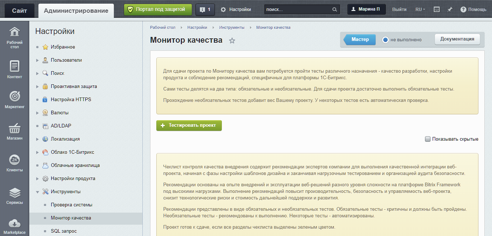
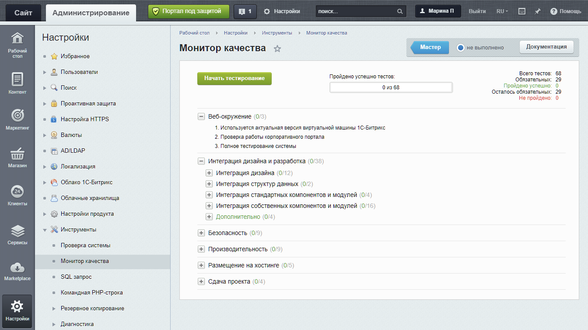
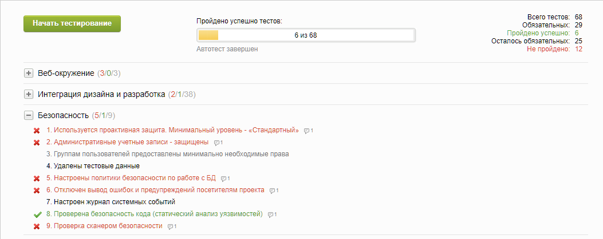
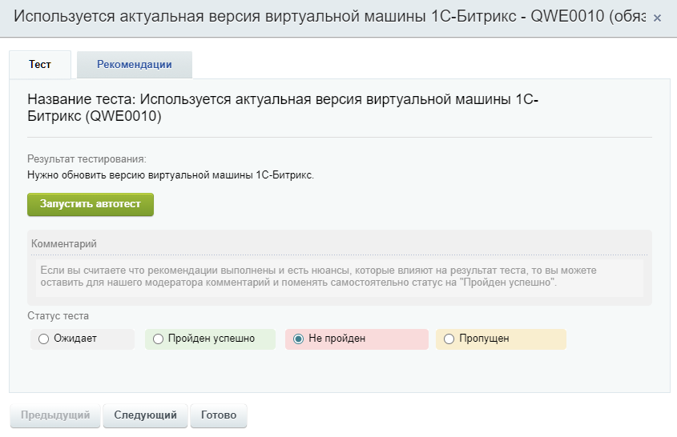
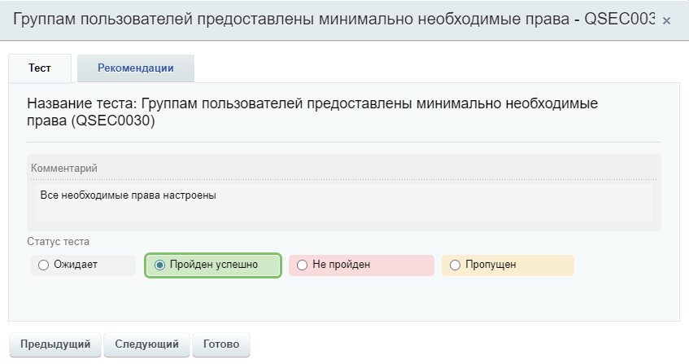
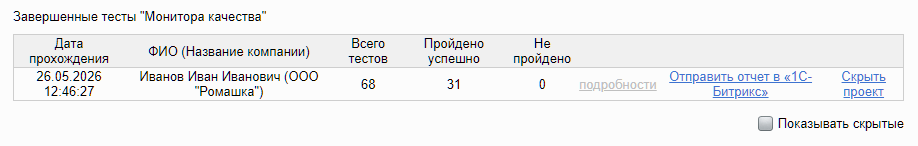

Монитор качества помогает проверить проект на Битрикс перед сдачей заказчику или запуском в работу. Инструмент содержит чек-лист автоматизированных и ручных тестов для проверки веб-окружения, интеграции дизайна, безопасности, производительности и размещения на хостинге.

Используйте Монитор качества, когда нужно формализовать приемку проекта, найти проблемы до запуска и сохранить результат проверки в отчете.

## Сценарии использования

Монитор качества можно использовать в нескольких рабочих сценариях.

**Перед запуском проекта.** Разработчик проходит обязательные тесты, исправляет найденные проблемы и показывает заказчику отчет в административном разделе.

**После доработок.** Команда снова проходит чек-лист и сохраняет отчет. Архив показывает, какие проверки выполнялись перед каждым этапом развития проекта.

**При внутренней приемке.** Команда тестирования проверяет результат и передает отчет менеджеру проекта или внутреннему заказчику.

**Для сложных проектов.** Команда проходит обязательные, необязательные и собственные тесты. Такой сценарий подходит для нагруженных или крупных проектов.

**После обновлений продукта.** Разработчик повторно запускает тесты после установки обновлений, чтобы проверить целостность ядра, настройки безопасности и производительности. Отчет помогает найти конфликты обновленных модулей с кастомным кодом и подтвердить стабильность проекта после изменений.

## Открыть инструмент

Инструмент находится в административном разделе продукта на странице *Настройки > Инструменты > Монитор качества*. При первом открытии система показывает вводную информацию об инструменте.

{width=1344px height=646px}

Нажмите *Тестировать проект*, чтобы открыть список тестов и запустить тестирование.

{width=1344px height=754px}

## Как устроены тесты

Тесты сгруппированы в дерево по этапам внедрения. Для успешной сдачи проекта нужно пройти все обязательные тесты или явно пропустить обязательный тест с комментарием.

По роли в проверке тесты бывают обязательными и необязательными.

-  Обязательные тесты проверяют критичные условия качества проекта.

-  Необязательные тесты помогают дополнительно проверить сложные, нагруженные или крупные проекты.

По способу выполнения тесты бывают автоматизированными и ручными.

-  Автоматизированные тесты собирают данные средствами системы, но итоговое решение по результату принимает разработчик.

-  Ручные тесты выполняет разработчик. Он проверяет условие теста и сам выбирает статус.

{width=1053px height=419px}

## Проверить проект

1. Откройте страницу *Настройки > Инструменты > Монитор качества*.

2. Запустите проверку кнопкой *Начать тестирование*. Система соберет данные и выполнит автоматизированные тесты.

3. Исправьте найденные проблемы в не пройденных автоматизированных тестах.

4. Повторно запустите автоматизированный тест или вручную измените статус теста.

5. Добавьте комментарий, если обязательный тест нужно перевести в статус *Пропущен* или *Пройден успешно*.

Автоматизированная проверка не завершает сдачу проекта. После успешного прохождения всех обязательных тестов проверьте ручные тесты, опишите результаты в комментариях и закройте обязательные пункты чек-листа.

### Исправить не пройденный тест

Если тест не пройден, система выделит его красным цветом. Чтобы открыть подробный отчет, нажмите на  название теста. В отчете указаны причины, из-за которых система не засчитала проверку.

-  На вкладке *Рекомендации* посмотрите, какие условия проверяет тест и какие параметры нужно исправить.

-  После исправления ошибки запустите автоматизированный тест повторно кнопкой *Запустить автотест*.

Статус теста можно изменить вручную, если вы уверены, что рекомендации выполнены. Чтобы сменить статус, обязательно укажите комментарий с описанием причины смены статуса.

{width=845px height=546px}

### Выполнить ручной тест

В ручном тесте разработчик сам проверяет условие теста и выбирает статус.

1. Откройте тест.

2. Посмотрите на вкладке *Рекомендации*, что нужно проверить .

3. Проверьте условие теста в административном разделе, публичной части сайта или настройках окружения.

4. Добавьте комментарий с результатом проверки.

5. Выберите статус теста.

{width=847px height=447px}

## Сохранить отчет

После успешного прохождения проверки, система сохраняет отчет в архив. В архиве можно посмотреть итоговый статус проверки, дату отчета и подробности по каждому тесту, включая системные сообщения автоматизированных тестов.



## Дополнить чек-лист своими тестами

Разработчик может добавить собственные разделы или тесты через событие главного модуля `OnCheckListGet`. Собственные тесты используют, когда в штатном чек-листе не хватает проверок для конкретного проекта. Например, можно проверить SEO-настройки, стиль проекта или работу бизнес-сценария под нагрузкой.

Для автоматического теста разработчик создает класс с методом проверки и указывает их в описании теста: имя класса — в `CLASS_NAME`, имя метода — в `METHOD_NAME`.

Монитор качества вызовет этот метод при запуске автотеста. Метод должен возвращать результат, сообщение для краткого отчета и, при необходимости, подробное описание. Если тест выполняется в несколько шагов, метод может возвращать промежуточный прогресс.

**Пример.** Код добавляет раздел `PROJECT_QC`, автоматизированный тест на наличие файла `/favicon.ico` и ручной тест для проверки доступа к тестовому окружению.

```php
<?php

AddEventHandler('main', 'OnCheckListGet', ['ProjectQualityTests', 'onCheckListGet']);

class ProjectQualityTests
{
    public static function onCheckListGet($arCheckList)
    {
        $checkList = [
            'CATEGORIES' => [],
            'POINTS' => [],
        ];

        $checkList['CATEGORIES']['PROJECT_QC'] = [
            'NAME' => 'Проверки проекта',
            'LINKS' => '',
        ];

        $checkList['POINTS']['PROJECT_QC_FAVICON'] = [
            'PARENT' => 'PROJECT_QC',
            'REQUIRE' => 'Y',
            'AUTO' => 'Y',
            'CLASS_NAME' => __CLASS__,
            'METHOD_NAME' => 'checkFavicon',
            'NAME' => 'Наличие favicon',
            'DESC' => 'Проверка файла /favicon.ico в корне сайта',
            'HOWTO' => 'Убедитесь, что файл /favicon.ico существует в корне сайта.',
        ];

        $checkList['POINTS']['PROJECT_QC_DEV_ACCESS'] = [
            'PARENT' => 'PROJECT_QC',
            'REQUIRE' => 'N',
            'AUTO' => 'N',
            'NAME' => 'Закрытие тестового окружения',
            'DESC' => 'Проверка ограничения доступа к тестовому окружению',
            'HOWTO' => 'Проверьте, что тестовое окружение закрыто от внешних посетителей.',
        ];

        return $checkList;
    }

    public static function checkFavicon($params)
    {
        $path = $_SERVER['DOCUMENT_ROOT'] . '/favicon.ico';

        if (file_exists($path))
        {
            return [
                'STATUS' => true,
                'MESSAGE' => [
                    'PREVIEW' => 'Файл /favicon.ico найден',
                ],
            ];
        }

        return [
            'STATUS' => false,
            'MESSAGE' => [
                'PREVIEW' => 'Файл /favicon.ico не найден',
                'DETAIL' => 'Добавьте файл favicon.ico в корень сайта.',
            ],
        ];
    }
}
```



Добавляйте свои проверки как отдельные тесты с уникальными идентификаторами, чтобы они не пересекались со штатным чек-листом при обновлениях продукта.


