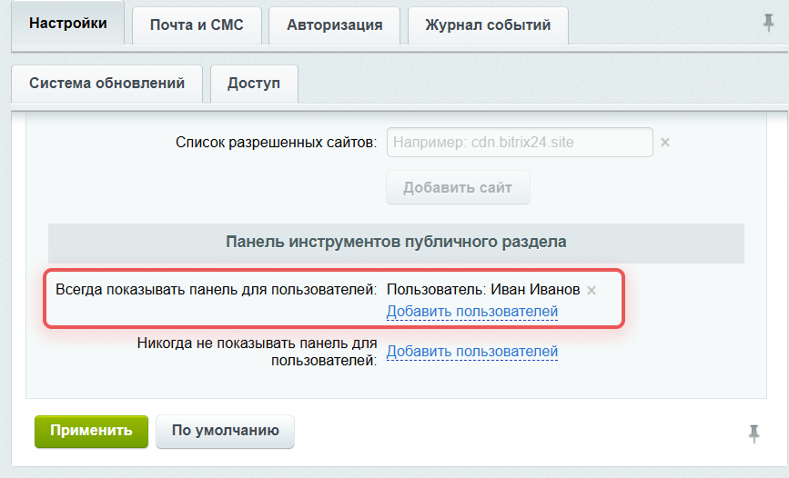
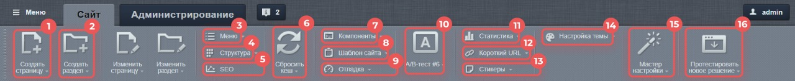
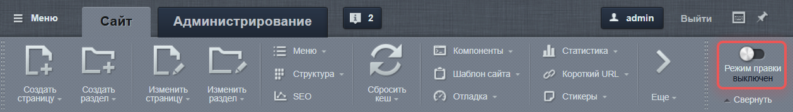
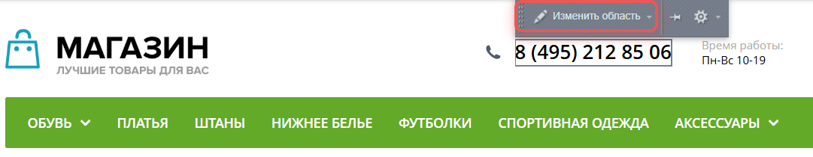
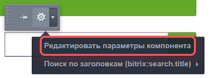
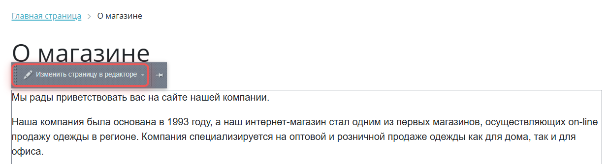
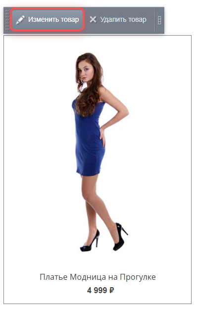
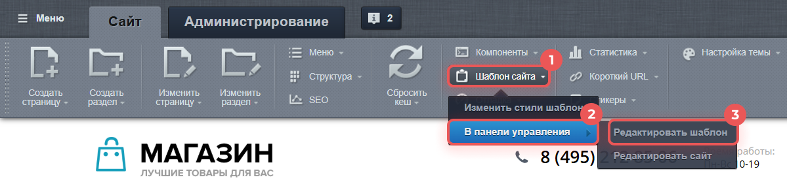

Панель администрирования -- инструмент для работы с содержимым сайта, отображается в верхней части страницы после авторизации. Набор инструментов зависит от страницы и прав пользователя.

С помощью панели администрирования можно:

-  управлять параметрами текущего раздела,

-  редактировать текущую страницу и включаемые области,

-  добавлять и изменять меню раздела,

-  настраивать параметры компонентов,

-  переходить в административный раздел.

### Как включить панель администрирования

В 1С-Битрикс: Управление сайтом панель администрирования доступна для пользователей с правами на редактирование сайта.

В коробочной версии Битрикс24 панель скрыта по умолчанию для всех пользователей, независимо от их прав. Чтобы включить панель администрирования:

1. Авторизуйтесь как администратор и перейдите по ссылке `http://адрес_вашего_портала/bitrix/`.

2. Откройте настройки главного модуля: *Настройки > Настройки продукта > Настройки модулей > Главный модуль*.

3. Выберите, кому показывать панель.

   -  В параметре *Всегда показывать панель для пользователей* укажите нужных пользователей или группы.

      {width=750px height=441px}

   -  По умолчанию есть группа *Работает в панели управления* -- добавьте в нее пользователей, и они увидят панель.

4. Сохраните изменения с помощью кнопки *Применить*.

#### Добавить пользователя в группу

1. Откройте профиль пользователя: *Настройки* *\>* *Пользователи* *\>* *Список пользователей*.

2. Перейдите во вкладку *Группы* и отметьте *Работает в панели управления*.

После этого панель администрирования будет доступна выбранным пользователям.

### Основные части панели

{width=1258px height=179px}

1. Меню -- выпадающее меню позволяет быстро перейти в любую часть административного раздела.

2. Сайт -- работа с публичной частью. Можно вносить изменения и сразу видеть результат.

3. Администрирование -- полный доступ ко всем функциям системы.

4. Окно уведомлений -- системные сообщения и оповещения. Цифра рядом обозначает количество новых уведомлений.

5. Настройка горячих клавиш -- окно [настроек горячих клавиш](./admin-panel#горячие-клавиши), где можно назначить нужную комбинацию.

### Описание элементов интерфейса

{width=1280px height=133px}

1. Создать страницу -- добавляет новые страницы.

2. Создать раздел  -- добавляет новый раздел.

3. Меню -- управляет навигацией.

4. Структура -- открывает инструменты для работы со структурой сайта.

5. SEO -- настраивает поисковую оптимизацию: ключевые слова, заголовки, рекомендации.

6. Сбросить кэш -- очищает кэш.

7. Компоненты -- переходит к редактированию компонентов.

8. Шаблон сайта -- позволяет редактировать шаблон сайта.

9. Отладка -- инструменты для обнаружения проблем в работе сайта: суммарная статистика, статистика SQL-запросов, детальная статистика кэша, статистика включаемых областей, время исполнения страницы.

10. A/B-тест -- переключает режимы тестирования. Появляется при запуске A/B-теста.

11. Статистика -- показывает данные веб-аналитики.

12. Короткий URL -- создает короткие ссылки для текущей страницы.

13. Стикеры -- добавляет заметки на страницу.

14. Настройка темы -- меняет цветовую тему, если предусмотрено шаблоном сайта.

15. Мастер настройки -- возвращает к мастеру установки решения.

16. Протестировать новое решение -- переходит к установке другого решения.

## Режим правки

{width=1258px height=179px}

Режим правки -- быстрый способ отредактировать элементы в публичном разделе сайта. Включите режим с помощью кнопки *Режим правки* и наведите курсор на нужную область, чтобы изменить элемент.

### Типы редактируемых областей

#### Включаемые области

Используйте, чтобы отредактировать простой текст, например контакты или описание:

1. Наведите курсор на включаемую область и нажмите *Изменить область*.

2. Отредактируйте текст и нажмите *Сохранить*.

{width=1081px height=210px}

Если во включаемой области размещен файл с компонентом, например строка поиска или ссылки на социальные сети:

1. Нажмите {width=31px height=34px} > *Редактировать параметры компонента*.

2. Внесите изменения и нажмите *Сохранить*.

{width=417px height=155px}

#### Рабочая область страницы

1. Наведите курсор на текст и нажмите *Изменить страницу в редакторе*.

2. Внесите изменения и нажмите *Сохранить*.

{width=1237px height=334px}

#### Область компонента

Вид панели будет зависеть от типа компонента. Например, чтобы изменить товар каталога:

1. Наведите курсор на товар и нажмите *Изменить товар*.

2. Внесите изменения  и нажмите *Сохранить*.

{width=398px height=624px}

### Редактирование шаблона

Чтобы отредактировать шаблон сайта выберите *Шаблон сайта > В панели управления > Редактировать шаблон.*

{width=1199px height=279px}

Доступные опции:

-  Изменить стили шаблона -- правка CSS стилей.

-  Редактировать сайт -- изменить настройки сайта.

-  Редактировать шаблон -- изменить внешний вид сайта.

## Горячие клавиши

Используйте горячие клавиши для ускорения работы. Вы можете настроить комбинации на свое усмотрение. Для этого нажмите кнопку *Горячие клавиши* на панели управления.

## Управление панелью администрирования

### Подключить панель

Код для подключения административной панели задается в служебной области шаблона дизайна сайта сразу после тега `<body>`.

```php
<?
$APPLICATION->ShowPanel();
?>
```

Панель можно принудительно отображать для группы или отдельных пользователей. Для этого используйте опцию *Всегда показывать панель для пользователей* в настройках главного модуля. В результате набор кнопок на панели будет зависеть от прав пользователя.

### Добавить кнопки

Чтобы создать кнопки на панели управления, используйте код:

```php
<?php
$APPLICATION->AddPanelButton(
    [
        "ID" => "button_id", // Уникальный идентификатор кнопки
        "TEXT" => "Название кнопки",
        "TYPE" => "BIG", // BIG — большая кнопка, SMALL — маленькая
        "MAIN_SORT" => 100, // Сортировка среди групп кнопок
        "SORT" => 10, // Позиция в группе
        "HREF" => "url", // URL или Javascript:myFunction()
        "ICON" => "btn-icon", // CSS-класс иконки
        "SRC" => "/path/to/icon", // Путь к иконке
        "HINT" => [ // Всплывающая подсказка
            "TITLE" => "Заголовок подсказки", // Жирный заголовок
            "TEXT" => "Описание <b>с HTML-разметкой</b>" // Основной текст
        ],
        "HINT_MENU" => [ // Подсказка для контекстного меню
            "TITLE" => "Заголовок",
            "TEXT" => "Текст подсказки" // Поддерживается HTML
        ],
        "MENU" => [
            [ // Описание первого пункта меню
                "TEXT" => "Название пункта 1",
                "TITLE" => "Подсказка для пункта",
                "SORT" => 10, // Порядок сортировки
                "ICON" => "", // Иконка пункта
                "ACTION" => "javascript:code", // Javascript-код
                "DEFAULT" => true, // Пункт по умолчанию
                "MENU" => [] // Подменю
            ],
            [
                "SEPARATOR" => true, // Линия-разделитель между пунктами, не может иметь название
            ],
            [ // Описание второго пункта меню
                "TEXT" => "Название пункта 2",
                "TITLE" => "Подсказка для пункта 2",
                "SORT" => 20, // Порядок сортировки
                "ICON" => "bx-popup-item-wizard-icon", // Иконка пункта
                "ACTION" => "alert('Hello, World!')", // Javascript-код
            ],
        ]
    ],
    $bReplace = false // Заменить кнопку, если ID совпадает
);
?>
```

Кнопку можно добавить:

-  в компоненте,

-  на странице,

-  в шаблоне сайта,

-  через событие `OnBeforeProlog`.

### Добавить контекстное меню

Чтобы добавить пункты контекстного меню к любой кнопке, используйте код:

```php
$APPLICATION -> AddPanelButtonMenu($btnId, $arMenuItem)
```

-  `$btnId` – идентификатор кнопки,

-  `$arMenuItem` – массив пунктов.

Пересортировку пунктов согласно индексу сортировки можно выполнить с помощью кода:

```php
"RESORT_MENU" => true
```

### Тулбар компонента

Тулбар -- это панель кнопок над компонентом. Здесь размещают:

-  основные действия на панели администрирования, например редактировать, добавить, удалить,

-  функции, которые часто используются.

Остальные действия помещают в контекстное меню.

Чтобы вывести тулбар компонента  в `component.php`, используйте код:

```php
$this->AddIncludeAreaIcons(
    [ // Массив кнопок панели инструментов
        [
            "ID" => "button_id", // Уникальный идентификатор кнопки
            "TITLE" => "Действие", // Текст на кнопке
            "URL" => "/path/to/action/", // Ссылка или javascript:function()
            "ICON" => "menu-icon", // CSS-класс иконки
            "MENU" => [ // Контекстное меню
                // Пункты меню
            ],
            "HINT" => [ // Всплывающая подсказка
                "TITLE" => "Заголовок", // Основной текст
                "TEXT" => "Описание действия" // Подробное пояснение
            ],
            "HINT_MENU" => array ( // Тип кнопки контекстного меню
                "TITLE" => "Заголовок",
                "TEXT" => "Описание действия" // HTML допускается
            ),
            "IN_PARAMS_MENU" => true, // Показать в контекстном меню
            "IN_MENU" => true // Показывать в подменю компонента
        ]
    ]
);
```

Чтобы проверить, активен ли режим редактирования, используйте код:

```php
// Проверка режима редактирования
if ($APPLICATION->GetShowIncludeAreas()) {
    $this->AddIncludeAreaIcons([
        // Массив кнопок для панели
    ]);
}
```

Если режим активен, вызывается `AddIncludeAreaIcons()` для добавления кнопок.

### Работа со списком элементов

В Bitrix Framework в модуле `main` доступны два класса для работы со списками элементов:

-  `CAdminList` -- базовый класс для вывода списков элементов в интерфейсе административного раздела. Например, для отображения таблиц, сортировки, фильтрации, действий с элементами.

-  `CAdminUiList` -- наследник `CAdminList`, добавляет поддержку современного интерфейса в административном разделе: AJAX-загрузка, улучшенные фильтры, гибкая настройка колонок. Используется в новых модулях и интерфейсах.

#### Режимы работы грида

Грид -- это компонент для вывода данных в виде таблицы с поддержкой сортировки, фильтрации, редактирования и других действий без перезагрузки страницы. Поддерживает несколько режимов работы:

-  простой вывод списка элементов (открытие страницы),

-  обработка быстрого редактирования элементов,

-  обновление грида без перезагрузки страницы, например сортировка,

-  выгрузка в формат для Excel,

-  показ формы настроек грида.

Метод объекта грида:

```php
public function getCurrentMode(): string // Получение текущего режима работы
{
    // Здесь будет логика определения текущего режима
    return $this->currentMode;
}
```

Метод вернет вернет одну из констант класса:

-  `public const MODE_PAGE = 'normal';` -- обычный вывод страницы,

-  `public const MODE_LIST = 'list';` -- обновление грида без полной перезагрузки,

-  `public const MODE_ACTION = 'frame';` -- обработка результатов быстрого редактирования,

-  `public const MODE_EXPORT = 'excel';` -- выгрузка в Excel,

-  `public const MODE_CONFIG = 'settings';` -- показ формы настроек.

Режим определяется в момент инициализации объекта грида:

```php
$sTableID = 'tbl_user'; // Идентификатор таблицы для списка
$lAdmin = new CAdminUiList($sTableID); // Создаем экземпляр списка
$excelMode = $lAdmin->getCurrentMode() === CAdminList::MODE_EXPORT; // Проверяем, включен ли режим экспорта в Excel
```

#### Вспомогательные методы

Чтобы не писать большой объем кода для сравнения с константой, используйте вспомогательные методы:

-  `public function isPageMode(): bool` -- вернет `true`, если страница с гридом открывается в браузере,

-  `public function isExportMode(): bool` -- режим выгрузки в Excel,

-  `public function isAjaxMode(): bool` -- работа в режиме `ajax`: обновление грида и обработка быстрого редактирования,

-  `public function isConfigMode(): bool` -- показ окна настроек,

-  `public function isActionMode(): bool` -- результаты inline-редактирования,

-  `public function isListMode(): bool` -- обновления блока грида без обновления страницы.

#### Обработка inline-редактирования элементов

Позволяет пользователям изменять данные прямо в таблице без перезагрузки страницы.

Пример обработки:

```php
// Проверить, было ли отправлено inline-редактирование
if ($lAdmin->EditAction()) {
    // Добавить загруженные файлы в список изменяемых полей
    $lAdmin->convertFilesToEditFields();
    
    // Обработать каждое измененное поле
    foreach ($lAdmin->getEditFields() as $id => $fields) {
        // Сохранить изменения для записи с ID $id
        // $fields содержит новые значения полей
    }
}
```

Методы:

-  `public function getEditFields(): array` -- возвращает массив записей, которые были изменены, с предварительной проверкой, что ключи непустые,

-  `public function convertFilesToEditFields(): void` -- добавить загруженные файлы в общий массив полей.

#### Групповые операции

Групповые операции позволяют:

-  выполнять действия с несколькими элементами сразу,

-  обрабатывать данные списком,

-  упрощать массовые изменения.

Пример обработки:

```php
// Проверить наличие группового действия
if ($itemIds = $lAdmin->GroupAction()) {
    // Получить выбранное действие
    $actionId = $lAdmin->getAction();
    
    // Пропустить если действие не выбрано
    if ($actionId === null) {
        continue;
    }

    // Проверить действие Для всех
    if ($lAdmin->isGroupActionToAll()) {
        // В $itemIds теперь все идентификаторы списка
    }

    // Обработать каждый элемент
    foreach ($itemIds as $itemId) {
        switch ($actionId) {  // Выполнить выбранное действие
            case 'delete':
                // Удалить элемент
                break;
            case 'update':
                // Обновить элемент
                break;
            default:
                // Другое действие
        }
    }
}
```

Методы:

-  `public function getAction(): ?string` -- вернет идентификатор группового действия или `null`, если ничего не передано,

-  `public function isGroupActionToAll(): bool` -- вернет `true`, если в гриде для действий был выбран пункт *Для всех*.

### Контекстное меню элементов списка

#### Настроить HTML-атрибут

Добавьте `id` для блока, чтобы привязать контекстное меню:

```php
<div id="<?= $this->GetEditAreaId('edit_area_1') ?>">
    <!-- Содержимое редактируемого блока -->
</div>
```

#### Определить кнопки контекстного меню

В `component_epilog.php` можно настроить кнопки контекстного меню с помощью метода `SetEditArea`:

```php
// Установить контекстное меню для области редактирования
$APPLICATION->SetEditArea(
    $areaId,    // Идентификатор области
    $icons      // Массив иконок для меню, например
                /*  [
                        ['ICON' => 'edit-icon', 'TITLE' => 'Редактировать'],
                        ['ICON' => 'delete-icon', 'TITLE' => 'Удалить']
                    ] 
                */
);
```

-  `$areaId` – идентификатор области с контекстным меню,

-  `$arIcons` – массив иконок контекстного меню.

#### Работа с кнопками

**Добавить кнопку**

Добавить кнопку, которая открывает указанный URL в всплывающем окне:

```php
// Добавить кнопку редактирования с popup-окном
$this->AddEditAction(
    'edit_area_1',                       // Идентификатор области
    '/path/to/edit/page/',               // URL для открытия в popup
    'Редактировать элемент',             // Текст кнопки
    [                                    // Параметры:
        'WINDOW' => ['width' => 780, 'height' => 500],  // Размеры окна
        'ICON' => 'bx-context-toolbar-edit-icon',       // CSS-класс иконки
        'SRC' => '/bitrix/images/edit-icon.gif'         // Путь к иконке
    ]
);
```

**Добавить кнопку удаления элемента**

```php
// Добавить кнопку удаления с подтверждением
$this->AddDeleteAction(
    'delete_area_1',                     // Идентификатор области
    '/path/to/delete/action/',           // URL обработчика удаления
    'Удалить элемент',                   // Текст кнопки
    [
        'CONFIRM' => 'Вы действительно хотите удалить элемент?'  // Сообщение подтверждения
    ]
);
```

**Указать название кнопки**

Чтобы задать название кнопки, используйте метод `GetArrayByID`:

```php
// Получить локализованные названия для кнопок редактирования
$buttonTitles = CIBlock::GetArrayByID(
    $params['IBLOCK_ID'],  // ID инфоблока
    'ELEMENT_EDIT'         // Тип действия: редактирование элемента
);

CIBlock::GetArrayByID($params["IBLOCK_ID"], "ELEMENT_EDIT")
```

Варианты второго параметра:

-  `ELEMENT_EDIT` -- редактировать,

-  `ELEMENT_ADD` -- добавить,

-  `ELEMENT_DELETE` -- удалить.

### Административные страницы в публичной части

Административные страницы позволяют редактировать контент в публичной части сайта без перехода в административный раздел. Например, формы редактирования элементов инфоблоков.

#### Открыть страницу в popup-окне

Метод `GetPopupLink` генерирует `Javascript`, чтобы открыть страницу во всплывающем окне:

```php
// Создать JavaScript для открытия popup-окна
$popupScript = $APPLICATION->GetPopupLink([
    "URL" => "/path/to/page/",  // URL страницы для открытия
    "PARAMS" => [               // Параметры окна:
        "width" => 780,        // - ширина окна (пиксели)
        "height" => 570,       // - высота окна (пиксели)
        "resizable" => true,   // - разрешить изменять размер
        "min_width" => 780,    // - минимальная ширина
        "min_height" => 400    // - минимальная высота
    ]
]);
```

#### Кнопки управления для инфоблоков

Метод `GetPanelButtons` генерирует кнопки для работы с элементами и разделами инфоблока.

```php
// Получить HTML-код кнопок управления для инфоблока
$buttons = CIBlock::GetPanelButtons(
    $iblockId = 5,       // ID инфоблока (0 - если не требуется)
    $elementId = 12,     // ID элемента (0 - если не требуется)
    $sectionId = 3,      // ID раздела (0 - если не требуется)
    [
        'SECTION_BUTTONS' => true,  // Показывать кнопки разделов
        'SESSID' => false,          // Не добавлять токен сессии
        'RETURN_URL' => '/return/', // URL для возврата
        'LABELS' => [               // Кастомные названия кнопок
            'edit' => 'Изменить',
            'delete' => 'Удалить'
        ]
    ]
);
```