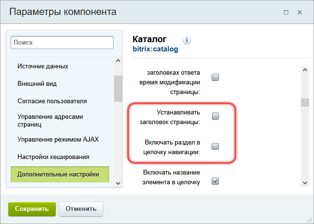
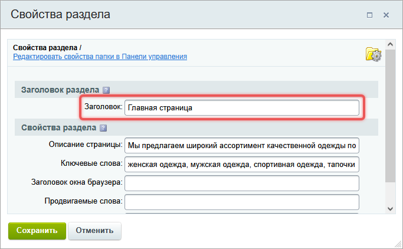
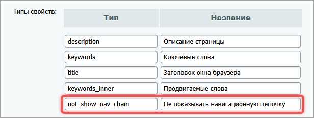
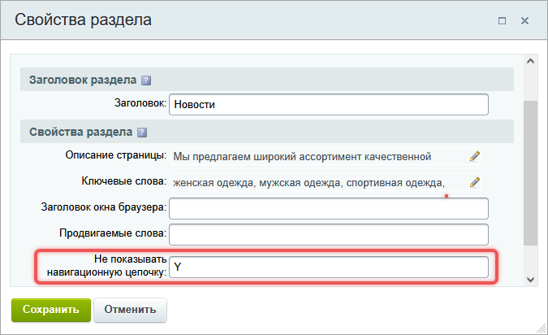

Хлебные крошки или цепочка навигации -- это список ссылок, который показывает путь от главной страницы до текущей. Например, `Главная / Статьи / Статья о Bitrix Framework`. Крошки помогают пользователям ориентироваться в структуре сайта и позволяют перемещаться между разделами.

## Как работает цепочка навигации

Названия пунктов цепочки -- это значения из полей:

-  Заголовок -- для раздела сайта,

-  Название -- для информационных блоков, форумов, блогов.

### Компонент Навигационная цепочка

Навигационную цепочку можно добавить на сайт с помощью компонента `bitrix:breadcrumb`. Чтобы крошки были видны на всех страницах, компонент подключают в шаблоне сайта.



О том, как подключить компонент, читайте в статье [Компоненты](./../framework/components#%D0%BA%D0%B0%D0%BA-%D0%BF%D0%BE%D0%B4%D0%BA%D0%BB%D1%8E%D1%87%D0%B8%D1%82%D1%8C-%D0%BA%D0%BE%D0%BC%D0%BF%D0%BE%D0%BD%D0%B5%D0%BD%D1%82).



### Как компоненты влияют на навигационную цепочку

Некоторые компоненты автоматически добавляют свои заголовки в цепочку. Например, компоненты `bitrix:news` и `bitrix:catalog` добавляют названия элементов:

-  `Главная / Новости / Как выбрать CMS` -- цепочка на странице просмотра новости «Как выбрать CMS»,

-  `Главная / Каталог / Смартфоны / Смартфон XYZ` -- на странице товара с названием «Смартфон XYZ».

Чтобы отключить добавление заголовков:

1. откройте настройки компонента,

2. уберите отметку в параметрах *Устанавливать заголовок страницы* и *Включать раздел в цепочку навигации*.

{width=647px height=462px}

## Как управлять навигационной цепочкой

Цепочку можно настраивать вручную -- добавлять, убирать, менять названия.

### Изменить название пункта

Чтобы изменить название пункта, нужно отредактировать заголовок раздела.

1. Откройте свойства раздела одним из двух способов.

   -  В публичной части сайта на административной панели нажмите *Изменить раздел*.

   -  В административной части сайта в меню раздела нажмите *Свойства папки*.

2. В поле Заголовок введите новое название и сохраните его.

{width=683px height=422px}



Чтобы скрыть раздел в цепочке, удалите значение из поля Заголовок .



### Cкрыть цепочку на странице или в разделе

1. В административном разделе сайта откройте страницу *Настройки > Настройки продукта > Настройки модулей > Управление структурой*.

2. В секции *Настройки для сайтов* добавьте тип свойства:

   -  Тип -- `not_show_nav_chain`,

   -  Название -- *Не показывать навигационную цепочку*.

   {width=616px height=233px}

3. Откройте свойства раздела или страницы и установите значение `Y` .

   {width=675px height=412px}

### Добавить свой пункт в цепочку

Чтобы вручную добавить пункт в цепочку, в коде страницы вызовите метод `AddChainItem`.

```php
<?
$APPLICATION->AddChainItem("Отзывы", "/ru/forum/list.php?FID=3");
?>
```

В конец цепочки будет добавлена ссылка с текстом Отзывы и адресом `/ru/forum/list.php?FID=3`.

## Внешний вид цепочки

Внешний вид определяется шаблоном компонента `bitrix:breadcrumb`. Системные шаблоны расположены в папке `/bitrix/components/bitrix/breadcrumb/templates`.

Вы можете:

-  выбрать готовый шаблон в настройках компонента,

-  создать свой вариант,

-  скопировать и отредактировать существующий шаблон.



Подробно о работе с шаблонами компонента читайте в статье [Компоненты](./../framework/components#%D1%88%D0%B0%D0%B1%D0%BB%D0%BE%D0%BD%D1%8B-%D0%BA%D0%BE%D0%BC%D0%BF%D0%BE%D0%BD%D0%B5%D0%BD%D1%82%D0%B0).



## Частые проблемы

Чтобы хлебные крошки отображались корректно, нужно следить за дублированием пунктов и проверять настройки компонентов.

### Не отображаются заголовки страниц

В цепочке навигации отображаются только названия инфоблоков. Главная страница и заголовки других страниц не отображаются.

**Решение**

-  Откройте свойства главной страницы. В поле *Не показывать навигационную цепочку* установите значение `N`.

-  Для остальных страниц проверьте, заполнено ли поле Заголовок в свойствах раздела. Из него берется текст для цепочки.

Дополнительно главная страница может не отображаться, если в параметрах компонента `bitrix:breadcrumb` неправильно задан параметр *Номер пункта, начиная с которого будет построена навигационная цепочка*.

-  Значение `0` означает, что цепочка строится от корня сайта.

-  Если заполнено поле *Путь, для которого будет построена навигационная цепочка*, номер пункта считается по этому пути.

### Повторяются пункты в цепочке

В хлебных крошках название торгового каталога отображается дважды: `Главная / Магазин / Видеонаблюдение / Видеонаблюдение`.

-  Первая ссылка -- `/catalog/video/`.

-  Вторая ссылка -- `/catalog/video/section.php?SECTION_ID=0`.

**Решение**

Первое название взято из свойств раздела `video`. Второе -- от компонента, который находится на странице `section.php`.

Дублирование происходит по двум причинам:

-  Компонент добавляет свое значение в цепочку.

-  На странице несколько компонентов, которые добавляют свои пункты.

Чтобы исправить проблему, в настройках компонента отключите опции *Включать инфоблок в цепочку навигации* и *Включать раздел в цепочку навигации*.

### Лишнее название инфоблока в цепочке

Разделы инфоблока опубликованы с помощью комплексного компонента Новости `bitrix:news`. В цепочке навигации отображается название инфоблока без ссылки, но его быть не должно. В настройках раздел и инфоблок не включены в цепочку.

**Решение**

Добавьте в параметры компонента строку:

```php
"ADD_SECTIONS_CHAIN" => $arParams["ADD_SECTIONS_CHAIN"],
```

Это предотвратит лишние записи в цепочке и покажет только нужные уровни.