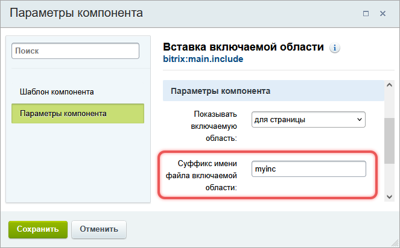
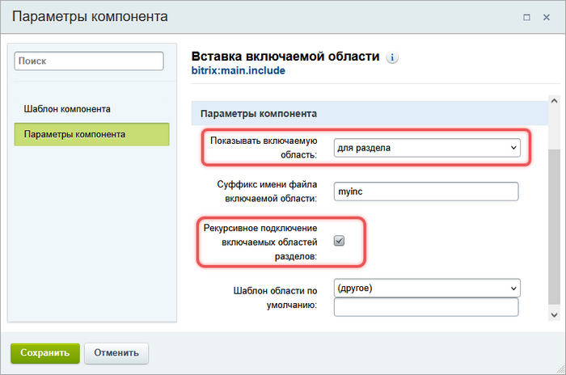
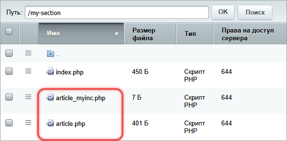
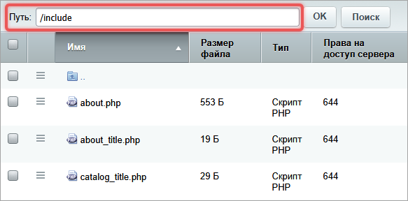
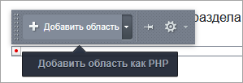
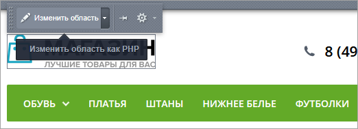
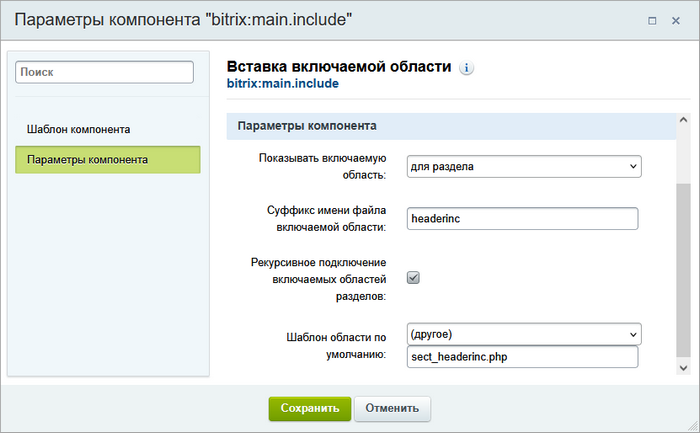

Включаемая область -- это отдельный фрагмент страницы, который можно редактировать независимо от основного контента. С ее помощью можно добавить текст, изображения или компоненты в шаблон сайта.

## Как работают включаемые области

Часть элементов сайта требует регулярного обновления, например, номер телефона в шапке, баннер, информация об авторских правах. Они не являются основным контентом страницы, но часто меняются.

Чтобы упростить процесс обновления, для элементов выделяют отдельные зоны в шаблоне сайта. Эти зоны настраивают как включаемые области.

1. Разработчик подключает компонент Вставка включаемой области `bitrix:main.include` в нужное место шаблона.

2. Контент-менеджер или разработчик создает файл с HTML или PHP-кодом. В файл можно добавить текст, изображения, компоненты и другие элементы.

3. Компонент `bitrix:main.include` подключает файл и выводит его содержимое на сайте.

4. Контент-менеджер редактирует содержимое через визуальный редактор.

### Особенности включаемых областей

-  Показ включаемых областей можно ограничить с помощью дополнительных условий в коде. Например, область можно вывести только на главной странице или только для авторизованных посетителей.

-  Включаемые области ограничены размером контейнера, в котором размещен компонент `bitrix:main.include`. Большое изображение или длинный текст могут исказить дизайн.

## Компонент Вставка включаемой области

Компонент Вставка включаемой области `bitrix:main.include` можно разместить:

-  в шаблоне сайта -- область будет доступна на всех страницах сайта,

-  на конкретной странице -- область отобразится только на ней.



О том, как подключить компонент, читайте в статье [Компоненты](./../framework/components#как-подключить-компонент).



### Где показывать область

Параметр компонента *Показывать включаемую область* задает вариант отображения области.

-  `sect` -- для раздела. Область отображается на всех страницах раздела. Если в компоненте включить опцию *Рекурсивное подключение включаемых областей разделов*, область отобразится и на страницах подразделов.

-  `page` -- для страницы. Область видна только на одной странице.

-  `file` -- из файла. Область подключается из файла. Указать путь нужно в параметре *Путь к файлу области.* Область отображается на всех страницах сайта.



В одном компоненте можно настроить только один вариант отображения.



### Суффикс имени файла

Имя файла области для раздела или страницы содержит суффикс. Его задают в параметре компонента *Суффикс имени файла включаемой области*. Например, это может быть `myinc`. В таком случае имя файла раздела будет `sect_myinc.php`, а страницы `mypage.php` -- `mypage_myinc.php`.



Для каждого размещенного компонента `bitrix:main.include` нужно задавать свой суффикс имени файла.



{width=663px height=412px}

### Рекурсивное подключение файлов раздела

Показ включаемых областей раздела зависит от опции *Рекурсивное подключение включаемых областей разделов*.

-  Рекурсивный режим -- опция включена. Если в текущем разделе нет файла области, система будет искать его в родительских разделах вплоть до корня сайта. Система покажет первый найденный файл.

-  Нерекурсивный режим -- опция отключена. Система выполняет поиск файла только в текущем разделе.

{width=700px height=464px}

### Шаблон области

Внешний вид области определяется шаблонами страниц, которые созданы в системе. Они располагаются в папке `/bitrix/templates/.default/page_templates/`.

Можно указать свой шаблон. Для этого задайте путь к файлу-шаблону в параметре *Шаблон области по умолчанию*.

## Размещение файла включаемой области

Файл включаемой области для раздела размещают в этом же разделе сайта. Для страницы -- в той же директории, где расположена страница. Например, страница `article.php` находится в папке `/my-section/`, значит файл включаемой области `article_myinc.php` создаем тоже в `/my-section/`.

{width=588px height=290px}

Файл области, которая настроена на показ из файла, рекомендуется размещать в папке сайта `/include/`. Имя файла может быть произвольным.

{width=583px height=288px}

### Как создать файл области

После подключения компонента `bitrix:main.include`, нужно создать файл с содержимым области.

#### Добавить область в публичной части

1. Включите режим правки и наведите курсор на место, где должна отображаться область.

2. Нажмите *Добавить область* или *Добавить область как PHP*.

   {width=299px height=103px}

3. Добавьте контент области с помощью визуального редактора или в режиме PHP-кода.

Система создаст файл включаемой области и подставит суффикс автоматически.

#### Создать файл в административной части

1. Перейдите в раздел *Контент > Структура сайта > Файлы и папки*.

2. В менеджере файлов откройте подходящую директорию.

3. Нажмите Добавить файл.

4. Укажите имя файла и суффикс из настроек компонента, если создаете файл для раздела или страницы. Для включаемой области из файла суффикс не нужен.

5. Добавьте содержимое включаемой области.

## Как отредактировать контент области

Содержимое области можно отредактировать в публичной и административной частях сайта.

### Публичная часть

1. Включите режим правки и наведите курсор на нужное место.

2. Нажмите *Изменить область* или *Изменить область как PHP*.

   {width=522px height=189px}

3. Отредактируйте контент области в визуальном редакторе или в режиме PHP.

### Административная часть

1. Перейдите в раздел *Контент > Структура сайта > Файлы и папки*.

2. В менеджере файлов найдите файл включаемой области и отредактируйте его.

## Как скрыть или удалить область

Включаемую область можно скрыть одним из трех вариантов.

-  Очистить содержимое файла или удалить файл области.

-  В настройках компонента изменить значения параметров *Показывать включаемую область* или *Суффикс имени файла включаемой области*. Новый файл не создавать.

-  Отключить компонент.

Чтобы полностью удалить включаемую область, удалите компонент из шаблона сайта

## Пример включаемой области

**Задача.** На сайте есть несколько разделов. Каждый раздел должен иметь свою верхнюю часть -- шапку сайта.

**Решение.** Чтобы верхняя часть изменялась при переходе по разделам, внесите изменения в шаблон сайта.

1. Выделите место под включаемую область.

2. Разместите компонент Вставка включаемой области `bitrix:main.include`.

3. Настройте его параметры.

   -  Показывать включаемую область -- выберите `для раздела`.

   -  Суффикс имени файла включаемой области -- укажите суффикс, который будет добавляться к именам файлов включаемых областей. Например, `headerinc`.

   -  Рекурсивное подключение включаемых областей разделов -- отметьте опцию, чтобы область отображалась в подразделах.

   -  Шаблон области по умолчанию -- выберите значение `другое` и укажите файл с шаблоном `sect_headerinc.php`.

      {width=700px height=433px}

4. В каждом разделе создайте файлы `sect_headerinc.php` и напишите в них код верхних частей.

Часть шаблона c компонентом имеет следующий код:

```php
<div id="header">
    <?$APPLICATION->IncludeComponent(
        "bitrix:main.include",
        ".default",
        array(
            "AREA_FILE_SHOW" => "sect", // Показывать включаемую область
            "AREA_FILE_SUFFIX" => "headerinc", // Суффикс имени файла включаемой области
            "AREA_FILE_RECURSIVE" => "Y", // Рекурсивное подключение включаемых областей разделов
            "EDIT_TEMPLATE" => "sect_headerinc.php" // Шаблон области по умолчанию
        ),
        false
    );?>
</div>
```
