В Bitrix Framework меню может быть статическим, динамическим или смешанным. Выбор меню зависит от частоты изменений структуры сайта и вида информации.

## Статическое меню

В статическое меню пункты добавляют вручную. Каждый пункт связан с конкретной страницей или разделом. Такое меню используют, когда структура сайта меняется редко.

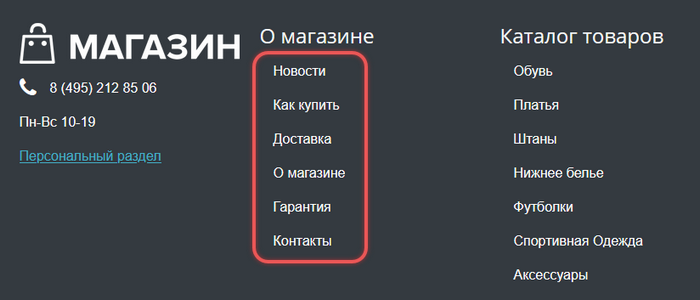{width=700px height=300px}

При добавлении или удалении страниц статическое меню нужно обновлять вручную. Если меню не помещается на странице, измените шаблон сайта.

## Динамическое меню

Динамическое меню формируется на основе данных из информационных блоков. Система автоматически обновляет меню при добавлении новых разделов и элементов в инфоблок. Например, в инфоблок добавили раздел «Домашняя одежда», в меню сразу появился новый пункт. Динамическое меню применяют, когда структура сайта меняется часто.

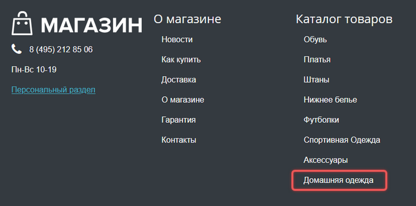{width=700px height=347px}

## Смешанное меню

Смешанное меню используют, когда нужно объединить разные виды информации. Часть пунктов формируется из инфоблока, часть добавляют вручную. Например, меню может состоять:

-  из перечня услуг компании -- это динамическое меню,

-  ссылок на страницы с контактной информацией -- это статическое меню.

## Типы меню

На сайте могут быть разные типы меню. Тип -- это идентификатор меню. По нему система определяет, какое меню отображать. Тип не связан с расположением на странице. Один и тот же тип можно использовать в любом месте.

В демонстрационном интернет-магазине из дистрибутива 1С-Битрикс: Управление сайтом есть три типа:

-  `top` -- верхнее,

-  `left` -- левое,

-  `bottom` -- нижнее.

Можно добавлять свои типы: `footer`, `mobile` и другие.

### Как задать тип меню

1. В административном разделе откройте страницу *Настройки > Настройки продукта > Настройки модулей > Управление структурой*.

2. В секции *Настройки для сайтов* выберите сайт, для которого нужно задать тип меню.

3. Укажите параметры.

   -  Тип -- задайте на латинице, например, `mymenu`,

   -  Название -- *Мое меню*.

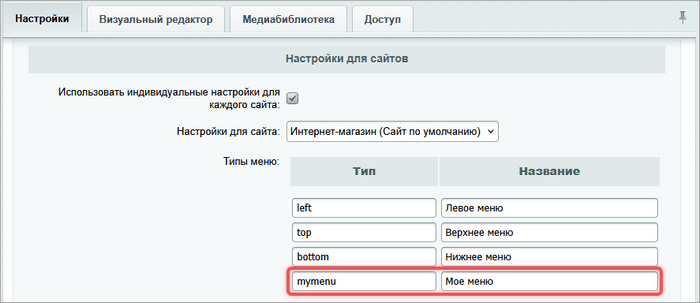{width=700px height=303px}

## Структура меню

Меню в Bitrix Framework состоит из двух основных частей.

1. Файлов меню с информацией о пунктах: `.тип.menu.php` и `.тип.menu_ext.php`. Префикс `тип` -- это тип меню, например, `top`, `left`.

2. Шаблона, который определяет внешний вид меню. Шаблон хранится в папке `/templates/` компонента меню или в файле `тип.menu_template.php`.

## Файлы меню

Файл размещают в разделе, на страницах которого нужно показать меню. Если в разделе нет своего файла, система выведет меню из раздела выше.



Подробнее о поиске файла меню читайте в разделе [Наследование меню](./menu#%D0%BD%D0%B0%D1%81%D0%BB%D0%B5%D0%B4%D0%BE%D0%B2%D0%B0%D0%BD%D0%B8%D0%B5-%D0%BC%D0%B5%D0%BD%D1%8E).



### Файл статического меню

Пункты статического меню описывают в файле `.тип.menu.php`. В нем можно использовать стандартные переменные.

-  `$aMenuLinks` -- [массив с данными](./menu#%D0%BC%D0%B0%D1%81%D1%81%D0%B8%D0%B2-$amenulinks) о каждом пункте меню. Массивом можно управлять через административный интерфейс.

-  `$sMenuTemplate` -- абсолютный путь к файлу с шаблоном меню `тип.menu_template.php`.  Переменная используется редко, если шаблон нужно подключить через API, а не компонент.



```php
<?
$aMenuLinks = Array(
    Array(
        "Новости", 
        "news/", 
        Array(), 
        Array(), 
        "" 
    ),
    Array(
        "Как купить", 
        "about/howto/", 
        Array(), 
        Array(), 
        "" 
    ),
    Array(
        "Доставка", 
        "about/delivery/", 
        Array(), 
        Array(), 
        "" 
    ),
    Array(
        "О магазине", 
        "about/", 
        Array(), 
        Array(), 
        "" 
    ),
    Array(
        "Гарантия", 
        "about/guaranty/", 
        Array(), 
        Array(), 
        "" 
    ),
    Array(
        "Контакты", 
        "about/contacts/", 
        Array(), 
        Array(), 
        "" 
    ),
    Array(
        "Книги", 
        "/books/", 
        Array(), 
        Array(), 
        "" 
    )
);
?>
```



### Файл динамического меню

Файл `.тип.menu_ext.php` содержит PHP-код, который расширяет массив `$aMenuLinks` на основе данных из информационных блоков или других источников. Например, в файле `.тип.menu_ext.php` используют компонент `bitrix:menu.sections`, чтобы получить названия разделов информационного блока.



```php
<?
if(!defined("B_PROLOG_INCLUDED") || B_PROLOG_INCLUDED!==true)die();
global $APPLICATION;
// Подготовим массив для дополнительных пунктов меню
$aMenuLinksExt = array();
if(CModule::IncludeModule('iblock'))
{
    // Фильтр для выборки инфоблоков типа catalog и привязанных к текущему сайту
    $arFilter = array(
        "TYPE" => "catalog",
        "SITE_ID" => SITE_ID,
    );
    // Получаем список инфоблоков, сортируем по полю SORT, затем по ID
    $dbIBlock = CIBlock::GetList(array('SORT' => 'ASC', 'ID' => 'ASC'), $arFilter);
    $dbIBlock = new CIBlockResult($dbIBlock);
    if ($arIBlock = $dbIBlock->GetNext())
    {
        if(defined("BX_COMP_MANAGED_CACHE"))
            $GLOBALS["CACHE_MANAGER"]->RegisterTag("iblock_id_".$arIBlock["ID"]);
        // Если инфоблок активен, подключаем компонент для генерации меню из его разделов
        if($arIBlock["ACTIVE"] == "Y")
        {
            // Подключаем компонент menu.sections
            $aMenuLinksExt = $APPLICATION->IncludeComponent("bitrix:menu.sections", "bootstrap_v4", array(
                "IS_SEF" => "Y",
                "SEF_BASE_URL" => "",
                "SECTION_PAGE_URL" => $arIBlock['SECTION_PAGE_URL'],
                "DETAIL_PAGE_URL" => $arIBlock['DETAIL_PAGE_URL'],
                "IBLOCK_TYPE" => $arIBlock['IBLOCK_TYPE_ID'],
                "IBLOCK_ID" => $arIBlock['ID'],
                "DEPTH_LEVEL" => "3",
                "CACHE_TYPE" => "N",
            ), false, Array('HIDE_ICONS' => 'Y'));
        }
    }
    if(defined("BX_COMP_MANAGED_CACHE"))
        $GLOBALS["CACHE_MANAGER"]->RegisterTag("iblock_id_new");
}
// Объединяем основное меню с динамическими пунктами
$aMenuLinks = array_merge($aMenuLinks, $aMenuLinksExt);
?>
```



### Массив \$aMenuLinks

Массив `$aMenuLinks` хранит пункты меню. Каждый пункт -- это массив с пятью элементами.

1. Название пункта.

2. Ссылка на пункт.

3. Массив дополнительных ссылок, которые влияют на подсветку пункта.

4. Массив дополнительных параметров для шаблона.

5. Условие отображения -- PHP-выражение, которое должно вернуть `true`.

```php
<?
$aMenuLinks = Array(
    Array(
        "Новости", 
        "news/", 
        Array(), 
        Array(), 
        "CSite::InDir('/index.php')" 
    ),
    Array(
        "Как купить", 
        "about/howto/", 
        Array(), 
        Array(), 
        "" 
    ),
    Array(
        "Доставка", 
        "about/delivery/", 
        Array(), 
        Array(), 
        "CSite::InDir('/personal/')" 
    ),
    Array(
        "Гарантия", 
        "about/guaranty/", 
        Array(), 
        Array(), 
        "CSite::InGroup(array(1,6))" 
    ),
);
?>
```

### Наследование меню

В Bitrix Framework меню наследуемое. Если в разделе нет своего меню, отобразится меню из вышестоящего раздела.

Например, на главной странице сайта есть меню. Оно автоматически отображается во всех подразделах сайта: `/news/`, `/about/`, `/services/`. Если в `/about/` добавить свое меню, оно заменит наследуемое меню с главной страницы.

#### Как работает замена меню

-  Статическое меню заменяет статическое.

-  Динамическое меню заменяет только другое динамическое.

-  Пустой файл `.тип.menu.php` переопределяет меню как пустое. Это приводит к отсутствию меню в разделе.

#### Как работает поиск файла меню

Система ищет файл меню в следующем порядке:

1. в текущем разделе, например, `/about/delivery/`,

2. родительском разделе `/about/`,

3. главном разделе сайта.

Поиск останавливается при первом найденном файле, независимо от содержимого.

## Управление меню в интерфейсе

Статическое меню можно создавать и редактировать через интерфейс системы.

### Как создать меню

1. В административном разделе сайта откройте *Контент > Структура сайта > Файлы и папки*.

2. Перейдите в нужную папку.

3. Нажмите *Добавить > Добавить меню*.

4. Выберите тип меню, например, `[bottom] Нижнее меню`.

5. Укажите названия и ссылки пунктов меню.

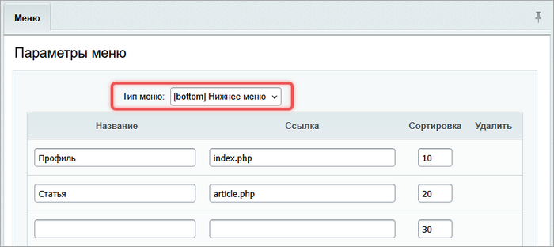{width=700px height=312px}

Система создаст файл `.bottom.menu.php`. В структуре сайта он отобразится как *Меню типа «bottom»*.

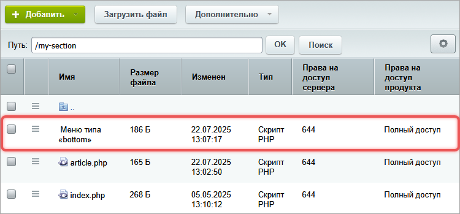{width=750px height=349px}

### Как отредактировать меню

Открыть меню для редактирования пунктов можно двумя способами.

-  **Через административный раздел**. В менеджере файлов откройте раздел с меню и нажмите Редактировать меню.

   {width=630px height=398px}

-  **Через публичный раздел**. На административной панели нажмите *Меню > Редактировать…* и выберите тип меню.

   {width=659px height=295px}

### Режимы редактирования

В системе доступно два режима редактирования меню. Изменить режим можно на странице редактирования меню с помощью кнопки-переключателя Упрощенный режим или Расширенный режим.

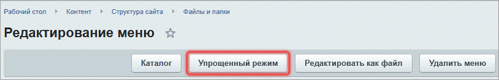{width=700px height=113px}

#### Упрощенный режим

Режим позволяет выполнить базовые настройки меню:

-  выбрать тип меню,

-  указать название пункта,

-  задать ссылку для перехода,

-  установить порядок отображения.

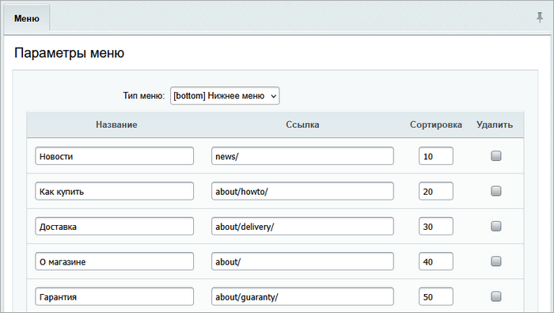{width=700px height=395px}

#### Расширенный режим

Расширенный режим содержит настройки упрощенного режима и имеет детальные настройки.

-  Тип меню -- выберите тип меню.

-  Шаблон для меню -- укажите путь к файлу `тип.menu_template.php` с шаблоном внешнего вида.

-  Название -- введите текст, который отображается в меню в публичной части.

-  Ссылка -- задайте адрес раздела или страницы, на которую ведет пункт.

-  Сортировка -- введите число, которое определяет порядок отображения пунктов.

-  Доп. ссылки для подсветки -- укажите список разделов и страниц, при переходе по которым будет подсвечен этот пункт меню.

-  Тип условия -- укажите тип условия, при выполнении которого пункт меню будет показан посетителям.

-  Условие -- задайте правило, по которому пункт отображается. Например, только пользователям с правами администратора.

-  Параметры -- укажите дополнительные настройки, которые можно использовать в шаблоне меню.

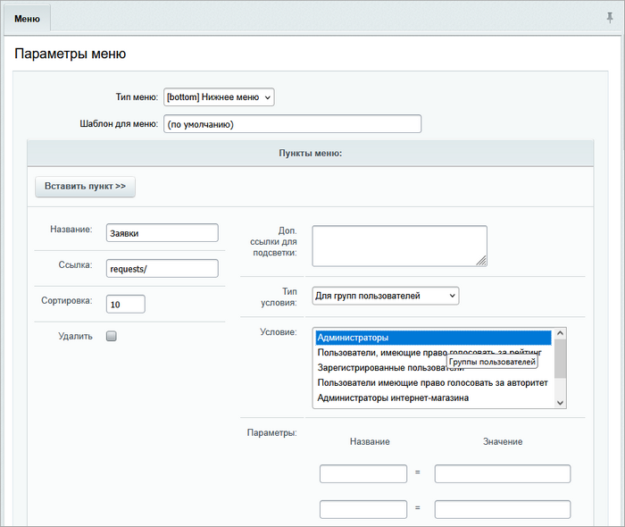{width=700px height=590px}

Дополнительные параметры передаются в шаблон с помощью массива `$PARAMS` в виде пар `имя => значение`. Например:

```php
if ($PARAMS["SEPARATOR"]=="Y") {
    // выводим разделитель
}
```

Количество дополнительных параметров в форме можно увеличить.

1. В административном разделе откройте страницу *Настройки > Настройки продукта > Настройки модулей > Управление структурой*.

2. В параметре *Количество дополнительных параметров меню* укажите нужное число.

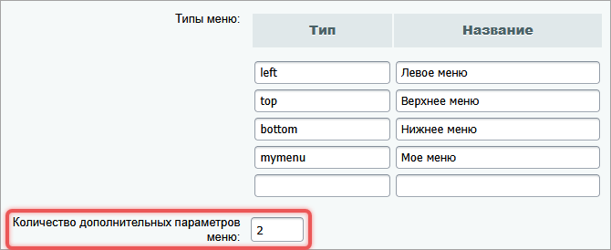{width=670px height=274px}

## Компоненты

Чтобы отобразить меню на сайте, нужно подключить компоненты Меню `bitrix:menu` и Пункты меню `bitrix:menu.sections`.



О том, как подключить компоненты, читайте в статье [Компоненты](./../framework/components#%D0%BA%D0%B0%D0%BA-%D0%BF%D0%BE%D0%B4%D0%BA%D0%BB%D1%8E%D1%87%D0%B8%D1%82%D1%8C-%D0%BA%D0%BE%D0%BC%D0%BF%D0%BE%D0%BD%D0%B5%D0%BD%D1%82).



### Меню bitrix:menu

Компонент Меню `bitrix:menu` можно разместить в шаблоне сайта или во включаемой области. Компонент получает данные для пунктов из файлов:

-  `.тип.menu.php` -- для статического меню,

-  `.тип.menu_ext.php` -- для динамического меню.

В настройках компонента указывают уровень вложенности и тип меню для первого и последующих уровней.

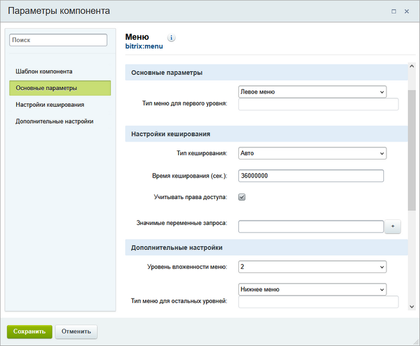{width=700px height=577px}

Стандартные шаблоны компонента `bitrix:menu` поддерживают до четырех уровней вложенности. Чтобы создать меню с большим количеством уровней, скопируйте и отредактируйте компонент.

Чтобы вывести пункты динамического меню, в настройках компонента отметьте опцию *Подключать файлы с именами вида .тип\_меню.menu_ext.php*.



Если в меню используются разделы каталога без ЧПУ, необходимо указать переменные в параметре *Значимые переменные запроса*.



### Пункты меню bitrix:menu.sections

Компонент Пункты меню `bitrix:menu.sections` подключают к инфоблоку и используют для динамических меню. Компонент генерирует пункты автоматически.

Вызов компонента можно разместить в файле `.тип.menu_ext.php`.

## Шаблоны меню

Шаблон меню -- это шаблон компонента `bitrix:menu`. Системные шаблоны расположены в папке `/bitrix/components/bitrix/menu/templates`.

Вы можете:

-  выбрать готовый шаблон в настройках компонента,

-  создать свой вариант,

-  скопировать и отредактировать существующий шаблон.



Подробно о работе с шаблонами компонента читайте в статье [Компоненты](./../framework/components#%D1%88%D0%B0%D0%B1%D0%BB%D0%BE%D0%BD%D1%8B-%D0%BA%D0%BE%D0%BC%D0%BF%D0%BE%D0%BD%D0%B5%D0%BD%D1%82%D0%B0).



### Примеры системных шаблонов

-  `.default` -- вертикальный шаблон. Подходит для главного меню. Все уровни вложенности отображаются на одном уровне.

-  `tree` -- древовидный вертикальный шаблон. Передает структуру сайта.

-  `vertical_multilevel` -- вертикальное выпадающее меню. Подменю появляется при наведении. Подходит для глубоких разделов.

-  `grey_tabs`, `blue_tabs` -- горизонтальные шаблоны. Серое и голубое меню в виде вкладок.

-  `horizontal_multilevel` -- горизонтальное выпадающее меню. Подменю раскрывается вниз.

### Как создать шаблон меню

1. Определите структуру HTML -- решите, будет ли меню списком, таблицей или блоками.

2. Создайте файл `template.php`-- используйте массив `$arResult` компонента `bitrix:menu`.

3. Добавьте CSS-файлы -- сделайте активные пункты заметными, настройте поведение при наведении.

### Структура шаблона меню

Каждый шаблон состоит из трех частей.

-  Пролог -- проверка доступа.

-  Тело -- цикл по пунктам меню.

-  Эпилог -- закрытие тегов.

Пример шаблона `.default`:

```php
<?if (!defined("B_PROLOG_INCLUDED") || B_PROLOG_INCLUDED!==true)die();?>
<?if (!empty($arResult)):?>
<ul class="left-menu">
<?
foreach($arResult as $arItem):
    if($arParams["MAX_LEVEL"] == 1 && $arItem["DEPTH_LEVEL"] > 1) 
        continue;
?>
    <?if($arItem["SELECTED"]):?>
        <li><a href="<?=$arItem["LINK"]?>" class="selected"><?=$arItem["TEXT"]?></a></li>
    <?else:?>
        <li><a href="<?=$arItem["LINK"]?>"><?=$arItem["TEXT"]?></a></li>
    <?endif?>
    
<?endforeach?>
</ul>
<?endif?>
```

### Как работает массив \$arResult

Компонент `bitrix:menu` преобразует массив `$aMenuLinks` в `$arResult`. Каждый пункт меню -- это массив с параметрами.

-  `TEXT` -- название пункта.

-  `LINK` -- ссылка.

-  `SELECTED` -- принимает `true`, если пользователь на этой странице, иначе -- `false`.

-  `PERMISSION` -- уровень доступа на страницу по ссылке. Возможные значения:

   -  `D` -- доступ запрещен,

   -  `R` -- чтение,

   -  `U` -- документооборот,

   -  `W` -- запись,

   -  `X` -- полный доступ.

-  `ITEM_TYPE` -- тип ссылки: `D` -- раздел, `P` -- страница, `U` -- страница с параметрами.

-  `ITEM_INDEX` -- порядковый номер пункта.

-  `PARAMS` -- дополнительные параметры.

### Стили шаблона

Для текстового меню можно указать цвета обычных и активных пунктов, стили для подменю или подразделов. CSS-стили задают в файле `style.css`. Файл размещают в папке шаблона меню.

Чтобы выделить заголовки разделов, можно использовать графические или текстовые элементы. Например, добавить иконки или изменить стиль текста.

## Права доступа

Проверка прав доступа влияет на отображение меню и его элементов.

### Показ пунктов

В расширенном режиме редактирования меню можно задать условия видимости.

1. Тип условия -- `Для групп пользователей`,

2. Условие -- выберите нужную группу, например, `Администраторы`.

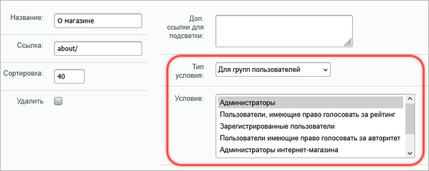{width=700px height=279px}

### Шаблон меню

Права доступа могут влиять на внешний вид меню. В шаблоне можно скрывать элементы, менять стили или добавлять изображения в зависимости от пользователя.

```php
<?if (!defined("B_PROLOG_INCLUDED") || B_PROLOG_INCLUDED!==true)die();?>
<?if (!empty($arResult)):?>
<!-- Если есть пункты меню, выводим блок -->
<div class="blue-tabs-menu">
    <ul>
<?foreach($arResult as $arItem):?>
    <?if ($arItem["PERMISSION"] > "D"):?>
        <!-- Показываем пункты, к которым у пользователя есть доступ -->
        <li><a href="<?=$arItem["LINK"]?>"><nobr><?=$arItem["TEXT"]?></nobr></a></li>
    <?endif?>
<?endforeach?>
    </ul>
</div>
<div class="menu-clear-left"></div>
<?endif?>
```



Проверка значения `$arItem["PERMISSION"]` используется только для меню сайта. Она не применяется к другим компонентам или частям системы.



## Примеры создания меню

Примеры составлены на основе демонстрационного интернет-магазина и меню в нижней его части.

{width=611px height=346px}

### Предварительные операции

1. В корне сайта создайте раздел `test-menu`.

2. Отметьте опцию *добавить пункт меню*.

   {width=597px height=377px}

3. Укажите имя пункта и выберите тип `Левое меню`.

   {width=597px height=377px}

Система создаст раздел и добавит пункт в Левое меню.

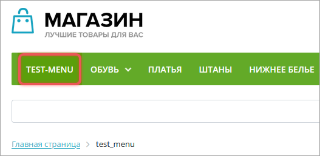{width=527px height=258px}

### Древовидное меню

Древовидное меню можно настроить с разным количеством уровней.

#### Двухуровневое древовидное меню

1. В настройках модуля Управление структурой добавьте новый тип меню -- `submenu` Подменю.

2. В нижней области раздела `test-menu` откройте параметры компонента Меню `bitrix:menu`

3. В параметрах укажите следующие значения:

   -  Шаблон компонента -- `tree`,

   -  Тип меню для первого уровня -- `Левое меню`,

   -  Уровень вложенности меню -- `2`,

   -  Тип меню для остальных уровней -- `Подменю`.

4. В разделе `test_menu` создайте две страницы `new-page-1.php` и `new-page-2.php`. В форме создания отметьте опцию *Добавить пункт меню* и укажите тип `Подменю`.

В результате появится дерево с двумя уровнями.

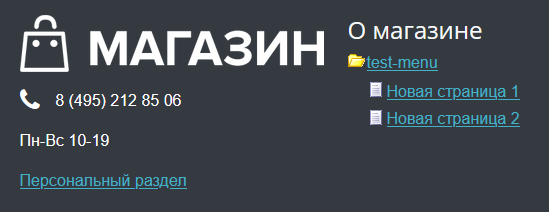{width=549px height=212px}

Файл `.submenu.menu.php` содержит массив из двух пунктов.

```php
<?
$aMenuLinks = Array(
    Array(
        "Новая страница 1", 
        "/test-menu/new-page-1.php", 
        Array(), 
        Array(), 
        "" 
    ),
    Array(
        "Новая страница 2", 
        "/test-menu/new-page-2.php", 
        Array(), 
        Array(), 
        "" 
    )
);
?>
```

#### Многоуровневое древовидное меню

Создайте статическое четырехуровневое меню на основе [двухуровневого меню](./menu#%D0%B4%D0%B2%D1%83%D1%85%D1%83%D1%80%D0%BE%D0%B2%D0%BD%D0%B5%D0%B2%D0%BE%D0%B5-%D0%B4%D1%80%D0%B5%D0%B2%D0%BE%D0%B2%D0%B8%D0%B4%D0%BD%D0%BE%D0%B5-%D0%BC%D0%B5%D0%BD%D1%8E) с шаблоном `tree`.

1. В административном разделе откройте страницу *Контент > Структура сайта > Файлы и папки > test-menu*.

2. В разделе `test-menu` создайте папку `test-1` и добавьте ее в меню типа `[submenu] Подменю`. Дополнительно можно создать индексную страницу раздела.

   {width=675px height=485px}

3. Внутри `test-1` создайте папку `test-2` и добавьте ее в меню типа `[submenu] Подменю`.

   {width=673px height=485px}

4. Файл с меню будет создан автоматически в `test-1` вместе с папкой `test-2`. Это происходит за счет того, что для папки `test-2` была отмечена опция Создать пункт меню.

   {width=616px height=304px}

5. В папке `test-2` создайте меню типа `[submenu] Подменю` и добавьте пункт со ссылкой, например, на индексную страницу.

   Если в последнем разделе иерархии не создать меню, он будет отображен как страница, а не папка.

   {width=681px height=307px}

В результате меню будет отображено как дерево из четырех уровней.

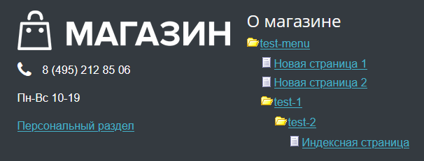{width=606px height=231px}



При удалении разделов и страниц необходимо отредактировать меню вручную.



### Выпадающее меню

Выпадающее меню показывает подпункты при наведении. Правила создания [аналогичны древовидному меню](./menu#%D0%B4%D1%80%D0%B5%D0%B2%D0%BE%D0%B2%D0%B8%D0%B4%D0%BD%D0%BE%D0%B5-%D0%BC%D0%B5%D0%BD%D1%8E).

1. Убедитесь, что в системе создано два типа меню. Например, `left` и `submenu`. Первый тип -- основное меню раздела, второй тип -- источник для выпадающего меню.

2. В компоненте Меню `bitrix:menu` выберите один из шаблонов: `catalog_vertical`, `catalog_horizontal`, `horizontal_multilevel`, `vertical_multilevel` или `bootstrap_v4`.

3. Настройте параметры компонента:

   -  Тип меню для первого уровня -- выберите в списке `left`,

   -  Тип меню для остальных уровней -- укажите `submenu`.

   -  Уровень вложенности меню -- укажите подходящее значение от одного до четырех.

4. В каждом статическом подразделе создайте меню типа `submenu`.

5. Ссылки на подразделы должны вести на папку, а не на страницу `index.php`.

6. В меню можно комбинировать статические и динамические пункты.

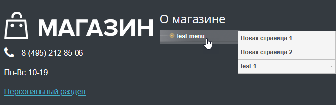{width=689px height=217px}

### Выпадающее меню из разделов инфоблока

Для разделов инфоблока можно создать динамическое меню и добавить его к [выпадающему меню](./menu#%D0%B2%D1%8B%D0%BF%D0%B0%D0%B4%D0%B0%D1%8E%D1%89%D0%B5%D0%B5-%D0%BC%D0%B5%D0%BD%D1%8E). Получится смешанное меню.

1. В административном разделе сайта перейдите на страницу *Контент > Инфоблоки > Типы инфоблоков  > Каталоги*.

2. Создайте информационный блок, например, Книги.

   {width=700px height=272px}

3. Добавьте несколько разделов и элементов. Например, разделы Научная литература и Фантастика. Внутри создайте подразделы.

   {width=690px height=346px}

4. Откройте страницу *Контент > Структура сайта > Файлы и папки > test-menu*.

5. В разделе `test-menu` создайте файл `.submenu.menu_ext.php`. Имя типа `submenu` должно совпадать с типом меню в разделе.

   {width=700px height=424px}

6. Разместите компонент Пункты меню `bitrix:menu.sections`.

7. Настройте параметры компонента.

   -  Тип информационного блока -- выберите `Каталоги`.

   -  Код информационного блока -- `Книги`.

   -  URL, ведущий на страницу с содержимым раздела -- например, `/books/#SECTION_ID#/`.

   -  Сколько уровней вложенности выводить -- укажите число, которое больше `1`. Например, `2`.

8. Откройте на редактирование файл `.submenu.menu_ext.php` в режиме PHP.

9. Допишите проверку включения кода из ядра:

   ```php
   <? 
   if(!defined("B_PROLOG_INCLUDED") || B_PROLOG_INCLUDED!==true)die();
   global $APPLICATION; 
   $aMenuLinksExt = $APPLICATION->IncludeComponent(…
   ```

10. После вызова компонента допишите код подключения к меню:

    ```php
    $aMenuLinks = array_merge($aMenuLinks, $aMenuLinksExt);
    ```

    В результате код в файле должен быть следующим:

    ```php
    <? 
    if(!defined("B_PROLOG_INCLUDED") || B_PROLOG_INCLUDED!==true)die();
    global $APPLICATION; 
    $aMenuLinksExt = $APPLICATION->IncludeComponent(
        "bitrix:menu.sections",
        "",
        Array(
            "CACHE_TIME" => "36000000",
            "CACHE_TYPE" => "A",
            "DEPTH_LEVEL" => "2",
            "DETAIL_PAGE_URL" => "#SECTION_ID#/#ELEMENT_ID#",
            "IBLOCK_ID" => "4",
            "IBLOCK_TYPE" => "catalog",
            "ID" => $_REQUEST["ID"],
            "IS_SEF" => "N",
            "SECTION_PAGE_URL" => "#SECTION_ID#/",
            "SECTION_URL" => "/books/#SECTION_ID#/",
            "SEF_BASE_URL" => "/books/"
        )
    );
    $aMenuLinks = array_merge($aMenuLinks, $aMenuLinksExt);
    ?>
    ```

11. В публичной части сайта откройте раздел `test-menu`.

12. В нижней части раздела откройте параметры компонента Меню `bitrix:menu`.

    {width=657px height=211px}

13. Отметьте опцию *Подключать файлы с именами вида .тип\_меню.menu_ext.php*.

    {width=733px height=485px}

В результате меню отображает разделы инфоблока.

1. Массив `$aMenuLinks`возвращает пункты `Подменю`.

2. Массив `$aMenuLinksExt` содержит результат работы компонента `bitrix:menu.sections`.

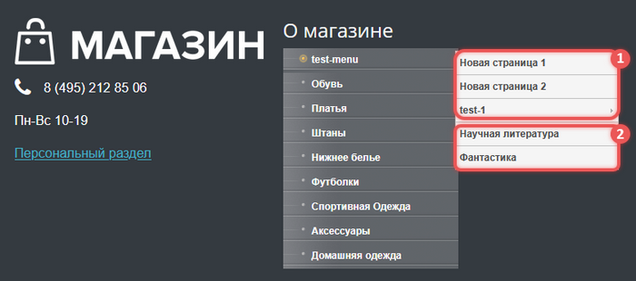{width=700px height=310px}

### Графическое меню

Можно создать меню, где каждый пункт -- это изображение. Активный пункт будет отображаться с одной картинкой, неактивный -- с другой. Если изображение не задано, будет использоваться изображение по умолчанию.

1. Подготовьте три изображения.

   -  Одно изображение по умолчанию на случай, если изображение для пункта не задано.

   -  По два изображения на каждый пункт: для активного и неактивного состояния.

   В примере будут использованы схематичные изображения.

   {width=700px height=76px}

2. В административном разделе откройте страницу *Контент > Структура сайта > Файлы и папки  > images*.

3. Создайте папку `menu` и загрузите в нее картинки.

   {width=567px height=278px}

4. Перейдите на страницу *Контент > Структура сайта > Файлы и папки  > test-menu.*

5. Откройте на редактирование меню типа `submenu` в расширенном режиме.

6. Для пунктов меню добавьте параметры:

   -  `ACT` -- укажите в значении путь к изображению активного состояния `/images/menu/active.png`.

   -  `NOACT`  -- укажите в значении путь `/images/menu/noactive.png`.

   

   Для одного из пунктов не добавляйте параметры, чтобы проверить работу кода.

   

   {width=700px height=470px}

7. В публичной части сайта откройте раздел `test-menu`.

8. В нижней части раздела откройте параметры компонента Меню `bitrix:menu`.

9. Измените шаблон компонента на `.default`.

10. Скопируйте шаблон компонента и откройте его на редактирование.

    {width=650px height=197px}

11. В шаблоне найдите следующий участок кода:

    ```php
    <?if($arItem["SELECTED"]):?>
        <li><a href="<?=$arItem["LINK"]?>" class="selected"><?=$arItem["TEXT"]?></a></li>
    <?else:?>
        <li><a href="<?=$arItem["LINK"]?>"><?=$arItem["TEXT"]?></a></li>
    <?endif?>
    ```

12. Замените его на код:

    ```php
    <?if($arItem["SELECTED"]):?>
        <li>
            <a href="<?=$arItem["LINK"]?>">
                " />
            </a>
        </li>
    <?else:?>
        <li>
            <a href="<?=$arItem["LINK"]?>">
                " />
            </a>
        </li>
    <?endif?>
    ```

13. Сохраните шаблон.

В результате пункты меню отображаются как изображения, с разными картинками для активного и неактивного состояния.

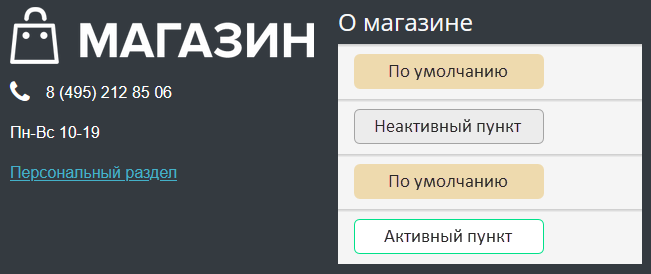{width=651px height=274px}

## Примеры настроек меню

В Bitrix Framework меню можно настроить подсветку, добавить подсказки и изображения, указать права доступа.

### Подсветить ссылки

1. В расширенном режиме редактирования меню заполните поле *Доп. ссылки для подсветки*.

2. Укажите путь к странице относительно корня сайта, например: `/about/mypage.php`.

3. При переходе на эту страницу пункт меню подсветится.

### Открыть пункт меню в новом окне

1. В расширенном режиме редактирования меню добавьте параметр:

   ```Plain text
   Название: target
   Значение: target="_blank"
   ```

2. В шаблоне меню замените

   ```php
   <a href="<?=$arItem["LINK"]?>"><?=$arItem["TEXT"]?></a>
   ```

   на строку

   ```php
   <a href="<?=$arItem["LINK"]?>" <?=$arItem["PARAMS"]["target"]?>><?=$arItem["TEXT"]?></a>
   ```

### Показать пункт для неавторизованных пользователей

В расширенном режиме редактирования настройте условие.

1. Тип условия -- `Выражение PHP`.

2. Условие -- `!$USER->IsAuthorized()`.

### Показать пункт меню в разделе сайта

В расширенном режиме редактирования настройте условие.

1. Тип условия -- `Для папки и файла`.

2. Условие -- задайте путь к разделу.



Работает для статических страниц или страниц с ЧПУ. Для динамических URL необходимо использовать условие *Параметр в URL*.



### Показать пункт меню на главной странице и в одном разделе

В расширенном режиме редактирования настройте условие.

1. Тип условия -- `Выражение PHP`.

2. Условие -- `CSite::InDir('/index.php') or CSite::InDir('about/')`, где `about/` -- это пример раздела.

### Добавить подсказку для пунктов меню

1. В расширенном режиме редактирования меню добавьте параметр:

   ```Plain text
   Название: A_TITLE
   Значение: текст подсказки
   ```

2. В шаблоне меню

   ```php
   <?if($arItem["SELECTED"]):?>
   	    <li><a href="<?=$arItem["LINK"]?>" class="selected"><?=$arItem["TEXT"]?></a></li>
   <?else:?>
   	    <li><a href="<?=$arItem["LINK"]?>"><?=$arItem["TEXT"]?></a></li>
   <?endif?>
   ```

   замените первую ссылку в коде на строку

   ```php
   <a href="<?=$arItem["LINK"]?>" class="selected" title="<?=$arItem["PARAMS"]["A_TITLE"]?>"><?=$arItem["TEXT"]?></a>
   ```

3. Вторую строку замените на следующую строку

   ```php
   <a href="<?=$arItem["LINK"]?>" title="<?=$arItem["PARAMS"]["A_TITLE"]?>"><?=$arItem["TEXT"]?></a>
   ```

### Добавить изображения рядом с пунктами меню

1. В расширенном режиме редактирования меню добавьте параметр:

   ```Plain text
   Название: IMG
   Значение: путь к изображению
   ```

2. В шаблоне меню после строки

   ```php
   <a href="<?=$arItem["LINK"]?>">
   ```

   добавьте строку с изображением

   ```php
   " border="0" />
   ```

### Разные изображения для языков сайта

1. Если сайт двуязычный, в шаблоне меню добавьте класс языка.

   ```php
   <body class="lang-<?=LANG?>">
   ```

2. В CSS-файле укажите правила для смены изображений по языку.

   ```css
   .menu li.item1 {
      background-image: url(title-en.gif);
   }
   .lang-ru .menu li.item1 {
      background-image: url(title-ru.gif);
   }
   ```

### Отдельное меню для разделов сайта

Чтобы меню главной страницы и разделов сайтов отличались, настройте смену шаблонов.

1. В административном разделе откройте страницу *Настройки > Настройки продукта > Сайты > Список сайтов*.

2. В настройках сайта в секции Шаблон выберите нужный шаблон и задайте условие «для папки или файла».

Если шаблон сайта простой, можно добавить в код проверку с помощью строк:

```php
if($APPLICATION->GetCurPage() == "/index.php") {
     // вывод меню для главной страницы
} else {
     // вывод другого меню
}
```

### Меню tree в постоянно открытом состоянии

1. Скопируйте стандартный шаблон меню tree в шаблон сайта.

2. В файле `template.php` замените `<li class="close">` на `<li>`.



Развернутые пункты будут сворачиваться при клике на изображение.



### Меню tree, которое не сворачивается при переходе

Если уровень вложенности меню меньше двух, выполните следующие действия:

1. Скопируйте стандартный шаблон меню tree в шаблон сайта.

2. В файле `template.php` замените `<li class="close">` на

   `<li <?if (!$arItem["SELECTED"]):?>class="close"<?endif?>>`.

Для более глубокой вложенности добавьте следующий код в шаблон:

```php
<?if (!empty($arResult)):?>
<?
// Определяем, какие пункты меню должны быть открыты для дерева
$lastLevel = 0;
$selected = false;
// Проходим по меню в обратном порядке, чтобы найти выбранный пункт и подсветить его родителей
foreach(array_reverse($arResult) as $arItem){
    if ($arItem["SELECTED"]) {
        $lastLevel = $arItem["DEPTH_LEVEL"]; // Запоминаем уровень выбранного пункта
        $selected = true;
    }
    // Если уже нашли выбранный пункт и поднимаемся выше по дереву
    if ($selected and $arItem["DEPTH_LEVEL"] < $lastLevel){ 
        $arResult[ $arItem["ITEM_INDEX"] ]["SELECTED"] = true; // Подсвечиваем родителя
        $lastLevel--; // Переходим на уровень выше
    }
}
?>
<div class="menu-sitemap-tree">
<ul>
<?$previousLevel = 0;foreach($arResult as $arItem):?>
```

### Скрыть боковое меню по свойству страницы

1. В верхнюю часть шаблона `header.php` добавьте код:

   ```php
   $APPLICATION->ShowProperty('menu');
   ```

2. Если для страницы нужно скрыть меню, в ее свойствах укажите:

   ```php
   $APPLICATION->SetPageProperty('hide_menu', 'Y');
   ```

3. В нижнюю часть сайта `footer.php` добавьте код:

   ```php
   if( 'Y' != $APPLICATION->GetPageProperty('hide_menu') ){
       ob_start();
       echo 'проверка отложенного меню!';
       // здесь выводим меню компонентом или другим способом
       $APPLICATION->SetPageProperty('menu', ob_get_clean() );
   }
   ```



Меню выводится в футере, если свойство `hide_menu` не равно `Y`. Если оно установлено, то меню не отображается.



### Кеш меню

Кеш меню зависит от адреса страницы. Если страниц много, размер кеша будет большим. В этом случае рекомендуется отключить кеш в компоненте меню.

1. Включите на сайте режим правки и откройте параметры компонента.

2. В параметре Тип кеширования выберите Не кешировать.

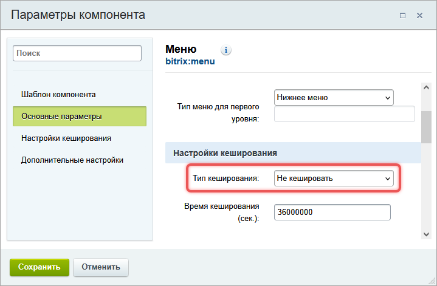{width=719px height=471px}

## Ошибки и советы

| Ошибка | Совет |
| ------ | ----- |
| Меню не обновилось после изменений | Очистите кеш или отключите его временно |
| Пункт не отображается | Проверьте условие отображения и права доступа |
| Появилось лишнее меню | Удалите или переименуйте файл `.тип.menu.php`в подразделе |
| Динамическое меню не работает | Убедитесь, что создали файл `.тип.menu_ext.php` и в параметрах компонента `bitrix:menu` отметили опцию *Подключать файлы с именами вида .тип\_меню.menu_ext.php* |

