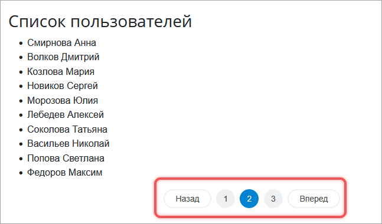

Постраничная навигация позволяет не загружать все записи сразу, а показывать их частями — по 10, 20 или 50 на странице.

{width=647px height=380px}

Под списком компонент навигации выводит номера страниц и кнопки «Назад» и «Вперед». Текущая страница выделена цветом.

Чтобы добавить навигацию к записям, выполните четыре действия.

1. Создайте объект навигации и настройте его.

2. Прочитайте номер страницы из адреса методом `initFromUri()`.

3. Выполните запрос к базе данных с учетом смещения и ограничения.

4. Передайте объект навигации компоненту для вывода ссылок.

## Классы навигации

В ядре есть три класса навигации. Выберите класс до того, как начнете настраивать объект: от него зависят расчет границ выборки и набор аргументов конструктора.

-  [`\Bitrix\Main\UI\PageNavigation`](./page-navigation-class.md) — считает границы выборки от начала списка,

-  [`\Bitrix\Main\UI\ReversePageNavigation`](./reverse-page-navigation.md) — отсчитывает страницы от конца выборки,

-  [`\Bitrix\Main\UI\AdminPageNavigation`](./page-navigation-class.md#класс-adminpagenavigation) — создает навигацию в административном разделе.

Дальше в статье описан базовый класс `PageNavigation`.

## Как настроить объект навигации через API

Объект навигации не обращается к базе данных и не выводит разметку. Он хранит настройки списка и считает по ним смещение и ограничение для запроса. Поэтому настройка идет в три шага: создать объект, прочитать номер страницы из адреса и выполнить запрос с полученными числами.

### Создать и сконфигурировать объект

Создайте объект постраничной навигации и настройте его методами `allowAllRecords()`, `setPageSizes()`, `setPageSize()` и `setRecordCount()`.

Общее число записей объект не вычисляет — получите его отдельным запросом. Метод `getCount()` выполняет запрос с `COUNT` и возвращает число.

```php
use Bitrix\Main\UI\PageNavigation;
use Bitrix\Main\UserTable;

$totalCount = UserTable::getCount();

$pagination = new PageNavigation('nav-name');
$pagination
    // разрешить показ всех записей
    ->allowAllRecords(true)

    // задать варианты выбора страниц
    ->setPageSizes([
        5,
        10,
        20,
        50,
        100,
    ])

    // задать размер страницы по умолчанию
    ->setPageSize(20)

    // задать общее число записей
    ->setRecordCount($totalCount)
;
```



Идентификатор навигации, например `nav-name`, должен быть уникальным на странице. Он используется в URL: `?nav-name=page-3`.





Задавайте настройки до вызова `initFromUri()`. Метод учитывает только настройки, сделанные до его вызова: список размеров страницы из `setPageSizes()` и разрешение из `allowAllRecords()`. Подробнее — в статье [Класс PageNavigation](./page-navigation-class.md#задать-порядок-вызовов).



### Инициализировать навигацию из URL

Метод `initFromUri()` прочитает из адреса номер текущей страницы и размер страницы.

```php
$pagination->initFromUri();
```

Поддерживаются два формата:

-  GET-параметры — `/items/?nav-name=page-3-size-20`,

-  ЧПУ, человекопонятный адрес — `/items/nav-name/page-3/size-20/`.

### Выполнить запрос к базе данных

В запросе передайте данные с помощью методов:

-  `getLimit()` — максимальное количество записей,

-  `getOffset()` — позицию записи, с которой начинать выборку.

```php
$records = UserTable::query()
    ->setLimit($pagination->getLimit())
    ->setOffset($pagination->getOffset())
    ->fetchCollection()
;
```

Если нужны фильтры, добавьте их в запрос и в подсчет записей. Иначе число страниц не совпадет с выборкой.

```php
$totalCount = UserTable::getCount(['>ID' => 10]);

// ... настройка объекта навигации и вызов initFromUri()

$records = UserTable::query()
    ->setFilter(['>ID' => 10])
    ->setLimit($pagination->getLimit())
    ->setOffset($pagination->getOffset())
    ->fetchCollection()
;
```

Подсчет записей — это отдельный запрос. Он сканирует таблицу целиком и на больших таблицах нагружает базу. Если общее число не нужно, используйте [навигацию без COUNT](#как-работает-навигация-без-count).

## Как отобразить навигацию

Чтобы вывести ссылки на страницы, передайте объект навигации в компонент.

### Компонент main.pagenavigation

Подключите компонент `main.pagenavigation` и передайте объект навигации через `NAV_OBJECT`. Компонент выведет ссылки.

```php
$APPLICATION->IncludeComponent('bitrix:main.pagenavigation', '.default', [
    'NAV_OBJECT' => $pagination,
    'SEF_MODE' => 'Y',    // включить ЧПУ
    'PAGE_WINDOW' => 5,   // сколько номеров страниц показать, например, … 2 3 4 5 6 …
    'SHOW_ALWAYS' => 'N', // если страница одна: Y — показать навигацию, N — скрыть
    'SHOW_COUNT' => 'Y',  // показывать информацию о количестве записей, например, 1–10 из 123
]);
```

В компоненте доступно четыре системных шаблона:

-  `.default` — обычный вид,

-  `admin` — для административной части,

-  `grid` — компактный, для таблиц,

-  `modern` — современный стиль.

Только шаблон `admin` выводит счетчик записей и переключатель размера страницы. В остальных шаблонах параметр `SHOW_COUNT` на разметку не влияет, а список из `setPageSizes()` не выводится.



Компонент сравнивает значения параметров строго. Параметры `SEF_MODE` и `SHOW_ALWAYS` включаются только строкой `Y` или значением `true`: варианты `y` и `1` компонент считает выключенными. Параметр `SHOW_COUNT` включен по умолчанию, и выключить его можно только строкой `N` или значением `false`.



### Компонент main.ui.grid

Компонент `main.ui.grid` выводит интерактивную таблицу и принимает объект навигации в параметре `NAV_OBJECT`. Исходные данные он не ограничивает, поэтому примените `getLimit()` и `getOffset()` к запросу так же, как при выводе через `main.pagenavigation`.

Вызов компонента, описание колонок и остальные параметры пагинации разобраны в статье [Таблица main.ui.grid](../ui/main-ui-grid.md#добавить-пагинацию).

### Как кастомизировать шаблон

Чтобы создать собственный шаблон навигации, используйте методы объекта `PageNavigation`. Каждый из них возвращает:

-  `getRecordCount()` — число записей,

-  `getPageCount()` — число страниц,

-  `getCurrentPage()` — номер текущей страницы,

-  `getPageSize()` — количество записей на странице,

-  `allRecordsShown()` — `true`, если показаны все записи на одной странице,

-  `getPageSizes()` — разрешенные размеры страниц `[5, 10, 20, ...]`,

-  `allRecordsAllowed()` — `true`, если показ всех записей разрешен,

-  `getId()` — идентификатор навигации,

-  `getOffset()` — смещение, то есть номер первой записи текущей страницы с отсчетом от нуля,

-  `getLimit()` — размер страницы.

На последней неполной странице `getLimit()` вернет размер страницы, а не фактическое число оставшихся записей. Полный список методов с параметрами и ограничениями — в статье [Класс PageNavigation](./page-navigation-class.md#контракты-методов).

### Как сформировать URL с параметрами навигации

Метод `addParams()` собирает ссылку на нужную страницу вручную.

```php
use Bitrix\Main\UI\PageNavigation;
use Bitrix\Main\Web\Uri;

/**
 * Ссылка на текущую страницу с параметрами навигации
 * Оба формата поддерживает метод PageNavigation::initFromUri()
 */
$uri = new Uri('https://example.com/items/');
$pagination = new PageNavigation('my-items');

// ЧПУ-формат
$isHumanUrl = true;
echo (string)$pagination->addParams(clone $uri, $isHumanUrl, 3);
// https://example.com/items/my-items/page-3/

// GET-формат
$isHumanUrl = false;
echo (string)$pagination->addParams(clone $uri, $isHumanUrl, 3);
// https://example.com/items/?my-items=page-3
```

Метод `addParams()` изменяет переданный объект адреса, а не его копию. Поэтому для каждой ссылки передавайте копию через `clone`.

## Большие таблицы

На больших таблицах запрос с `COUNT` сканирует таблицу целиком. Чтобы не выполнять его на каждой странице, используйте навигацию без точного подсчета.

### Как работает навигация без COUNT

1. Запрашивайте на одну запись больше, чем нужно на странице.

2. Если пришла «лишняя» запись, следующая страница существует.

3. Установите в навигацию приблизительное общее число записей: `позиция выборки + количество полученных записей`.

    ```php
    use Bitrix\Main\UI\PageNavigation;
    use Bitrix\Main\UserTable;

    $pagination = new PageNavigation('users');
    $pagination
        ->allowAllRecords(false)
        ->setPageSize(20)
        ->initFromUri()
    ;

    $users = [];

    $queryResult = UserTable::query()
        ->setOffset($pagination->getOffset())
        ->setLimit(
            $pagination->getLimit() + 1
        )
        ->exec()
    ;
    foreach ($queryResult as $i => $user)
    {
        if ($i === $pagination->getLimit())
        {
            break;
        }

        $users[] = $user;
    }

    $pagination->setRecordCount(
        $pagination->getOffset() + $queryResult->getSelectedRowsCount()
    );
    ```

4. Подключите компонент, но скройте общее число.

    ```php
    $APPLICATION->IncludeComponent('bitrix:main.pagenavigation', '', [
        'NAV_OBJECT' => $pagination,
        'SHOW_COUNT' => 'N', // не показывать общее количество
        'SEF_MODE' => 'Y',
    ]);
    ```



Для навигации без `COUNT` не включайте `allowAllRecords(true)`. Иначе посетитель сможет запросить полную выборку через адрес: при `page-all` метод `getOffset()` вернет `0`, а `getLimit()` — общее число записей. Пока оно не задано, `getLimit()` вернет `null`, ограничение не применится и запрос выберет всю таблицу.



Оба сценария опираются на один и тот же объект: он считает смещение и ограничение, а запрос и вывод остаются за разработчиком. Точные контракты методов, порядок вызовов и значения по умолчанию описаны в статье [Класс PageNavigation](./page-navigation-class.md). Если страницы должны отсчитываться от конца списка, используйте [класс ReversePageNavigation](./reverse-page-navigation.md).
