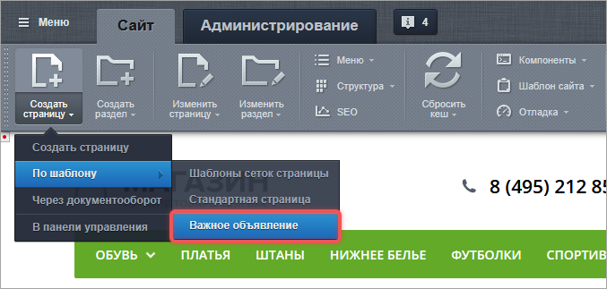
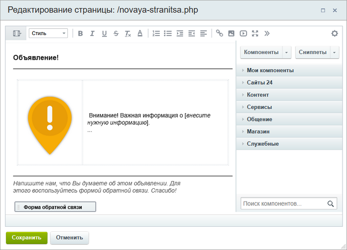
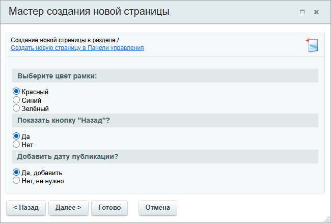
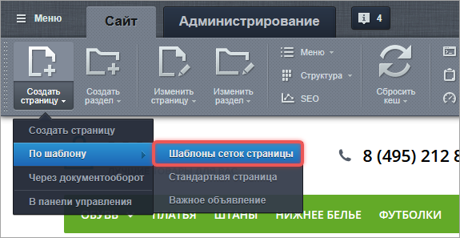
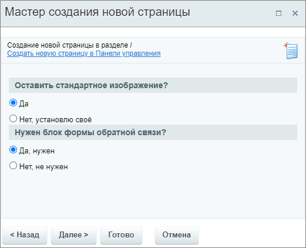

В Bitrix Framework страница -- это PHP-файл, который состоит из трех частей.

1. Header или шапка сайта -- общие элементы сайта.

2. Основная рабочая область -- уникальный контент страницы, который может быть:

   -  статическим -- обычный HTML-контент: текст, изображения, таблицы,

   -  динамическим -- контент создан с помощью компонентов.

3. Footer или подвал -- завершающие элементы сайта.

Страницы формируются динамически на основе шаблона сайта, компонентов и статических элементов.

## Свойства страниц

На отображение и поведение страницы влияют ее свойства: заголовок, ключевые слова, описание. Свойства можно задать:

-  на странице в рабочей области или между служебной и визуальной частью шапки сайта,

-  в файле `.section.php` раздела -- это общие настройки для всех страниц внутри раздела.

## Шаблоны страниц

Шаблон страницы -- это PHP-файл, который содержит структуру страницы и соответствует правилам оформления.

Шаблоны хранятся в следующих папках:

-  `/bitrix/templates/.default/page_templates` -- для всех шаблонов сайта,

-  `/bitrix/templates/[идентификатор_шаблона]/page_templates` -- для конкретного шаблона сайта.

Каждая папка может содержать:

-  файлы шаблонов страниц,

-  служебный файл `.content.php` -- он хранит названия шаблонов и порядок их вывода.

## Разработка шаблонов страниц

Существует два типа шаблонов страниц.

-  Пассивный шаблон -- это простой PHP-файл, который содержит HTML-разметку и не включает в себя динамических компонентов или логики. Шаблон используют для статического контента.

-  Активный шаблон -- может получать данные из базы, взаимодействовать с пользователями и подключать компоненты. Шаблон используют для динамического контента.

### Пассивный шаблон

Пассивный шаблон -- это шаблон с заготовленным контентом для новой страницы.

#### Как создать пассивный шаблон

**Первый способ**. Скопировать штатный шаблон `/bitrix/templates/.default/page_templates/standard.php` и отредактировать его.

**Второй способ**. Создать шаблон с нуля.

1. Продумайте структуру страницы. Это может быть HTML, текст, изображения, таблицы, компоненты и PHP-код.

2. В папке `/bitrix/templates/[идентификатор_шаблона]/page_templates` создайте файл, например `new.php`.

3. В файле разместите код шаблона.

4. Убедитесь, что в начале и конце файла есть вызовы `header.php` и `footer.php`. Они обязательны.

```php
<?
require($_SERVER["DOCUMENT_ROOT"]."/bitrix/header.php");
$APPLICATION->SetTitle("Title");
?>

<p>Добавьте контент на страницу</p>

<?require($_SERVER["DOCUMENT_ROOT"]."/bitrix/footer.php");?>
```

#### Как подключить пассивный шаблон

Чтобы шаблон появился в меню создания страницы, в файл `/bitrix/templates/[идентификатор_шаблона]/page_templates/.content.php` добавьте строку:

```php
TEMPLATE["new.php"] = Array("name"=>"Новый шаблон", "sort"=>4);
```

-  `"new.php"` -- имя файла шаблона,

-  `"Новый шаблон"` -- название, которое увидит контент-менеджер,

-  `"sort"=>4` -- порядок отображения.

Пример содержимого файла:

```php
<?
if(!defined("B_PROLOG_INCLUDED") || B_PROLOG_INCLUDED!==true)die();
$TEMPLATE["standard.php"] = Array("name"=>"Стандартная страница", "sort"=>1);
$TEMPLATE["page_inc.php"] = Array("name"=>"Включаемая область страницы", "sort"=>2);
$TEMPLATE["sect_inc.php"] = Array("name"=>"Включаемая область раздела", "sort"=>3);
$TEMPLATE["new.php"] = Array("name"=>"Новый шаблон", "sort"=>4);
?>
```

#### Языковые файлы

Используйте языковые файлы для шаблонов, если сайт использует несколько языков. В этом случае в файле `.content.php` вместо названия шаблона будет использоваться метод `GetMessage("new")`:

```php
$TEMPLATE["new.php"] = Array("name"=>GetMessage("new"), "sort"=>4);
```

По имени `new` будет выполнен поиск названия шаблона в языковом файле.

Файлы с языковыми сообщениями хранятся в папке `/bitrix/templates/[идентификатор_шаблона]/lang`. Папка содержит подпапки с названиями языков .

Например, языковые сообщения для русского языка расположены в файле `/bitrix/templates/[идентификатор_шаблона]/lang/ru/page_templates/.content.php`. Чтобы добавить название шаблона на русском языке, создайте в файле запись `$MESS['new'] = "Новый шаблон";`.

```php
<?
$MESS['standart'] = "Стандартная страница";
$MESS['new'] = "Новый шаблон";
$MESS['page_inc'] = "Включаемая область для страницы";
$MESS['sect_inc'] = "Включаемая область для раздела";
?>
```

Аналогично добавляется строка для английского языка в файле `/bitrix/templates/.default/lang/en/page_templates/.content.php` с английским названием `$MESS['new'] = "New template";`.

#### Пример создания пассивного шаблона

Будет создан общий шаблон страницы объявления, который доступен для всех шаблонов сайта.

1. В папке `/bitrix/templates/.default/page_templates` создайте файл `announcement.php`.

2. Добавьте код шаблона и проверьте наличие подключенных `header.php` и `footer.php`.

   ```php
   <?
   require($_SERVER["DOCUMENT_ROOT"]."/bitrix/header.php");
   $APPLICATION->SetTitle("Title");
   ?>
   <h3>Объявление!</h3>
   <hr>
   <br>
   <table cellpadding="10" cellspacing="1" align="center" style="width: 500px;">
   <tbody>
   <tr>
       <td>
              
       </td>
       <td>
            Внимание! Важная информация о [<i>внесите нужную информацию</i>].<br>
            ...
       </td>
   </tr>
   </tbody>
   </table>
    <br>
   <hr>
    <span style="color: #555555;"><i>Напишите нам, что Вы думаете об этом объявлении. Для этого воспользуйтесь формой обратной связи. Спасибо!</i></span><br>
    <br>
   <?$APPLICATION->IncludeComponent(
       "bitrix:main.feedback",
       "",
       Array(
           "EMAIL_TO" => "sale@example.ru",
           "EVENT_MESSAGE_ID" => array("7"),
           "OK_TEXT" => "Спасибо за Ваше мнение!",
           "REQUIRED_FIELDS" => array("NAME","EMAIL"),
           "USE_CAPTCHA" => "Y"
       )
   );?>
   <?require($_SERVER["DOCUMENT_ROOT"]."/bitrix/footer.php");?>
   ```

3. Откройте файл `.content.php` и добавьте строку:

   ```php
   $TEMPLATE["announcement.php"] = Array("name"=>GetMessage("announcement"), "sort"=>2);
   ```

4. Настройте языковые файлы:

   -  для русского языка в файле `/bitrix/templates/.default/lang/ru/page_templates/.content.php`,

   ```php
   $MESS['announcement'] = "Важное объявление";
   ```

   -  для английского языка в файле `/bitrix/templates/.default/lang/en/page_templates/.content.php`.

   ```php
   $MESS ['announcement'] = "Important announcement";
   ```

В результате шаблон будет доступен при создании страницы.

{width=677px height=323px}

При создании новой страницы по этому шаблону контент-менеджер увидит визуальный редактор с заполненными элементами.

{width=700px height=506px}

### Активный шаблон

Активный шаблон -- это шаблон, который при создании страницы запрашивает дополнительные данные у контент-менеджера. Эти данные можно использовать для настройки структуры или содержимого страницы.

{width=650px height=438px}

#### Примеры шаблонов

Свой активный шаблон можно создать на основе штатных примеров.

-  В дистрибутиве 1С-Битрикс24 есть пример активного шаблона: `/bitrix/templates/.default/page_templates/forum`.

-  В 1С-Битрикс: Управление сайтом дополнительно есть второй пример: `/bitrix/templates/eshop_bootstrap_v4/page_templates/bootstrap`.



```php
<?
if(!defined("B_PROLOG_INCLUDED") || B_PROLOG_INCLUDED !== true)
    die();

CPageTemplate::IncludeLangFile(__FILE__);

class CBootstrapPageTemplate
{
    function GetDescription()
    {
        return array(
            "name" => GetMessage("bt_wizard_name"),
            "description" => GetMessage("bt_wizard_title"),
            "modules" => array("bitrix.eshop"),
        );
    }

    function GetFormHtml()
    {
        $s = '
<tr class="section">
    <td colspan="4">'.GetMessage("BT_TYPE").'</td>
</tr>
';
        $s .= '
<tr>
    <td style="vertical-align: top; padding-top:10px">
        <input type="radio" name="BT_COL" value="1" id="BT_COL_1" checked>
        <label for="BT_COL_1">'.GetMessage("BT_COL_1").'</label><br>
        <br>
    </td>
    <td style="padding-top:10px">
        <input type="radio" name="BT_COL" value="2_1" id="BT_COL_2_1">
        <label for="BT_COL_2_1">'.GetMessage("BT_COL_2_1").'</label><br>
        <br>
    </td>
    <td style="padding-top:10px">
        <input type="radio" name="BT_COL" value="1_2" id="BT_COL_1_2">
        <label for="BT_COL_1_2">'.GetMessage("BT_COL_1_2").'</label><br>
        <br>
    </td>
    <td style="padding-top:10px">
        <input type="radio" name="BT_COL" value="1_2_1" id="BT_COL_1_2_1">
        <label for="BT_COL_1_2_1">'.GetMessage("BT_COL_1_2_1").'</label><br>
        <br>
    </td>
</tr>
<tr>
    <td style="padding-top:20px">
        <input type="radio" name="BT_COL" value="1_1" id="BT_COL_1_1">
        <label for="BT_COL_1_1">'.GetMessage("BT_COL_1_1").'</label><br>
        <br>
    </td>
    <td style="padding-top:20px">
        <input type="radio" name="BT_COL" value="1_1_1" id="BT_COL_1_1_1">
        <label for="BT_COL_1_1_1">'.GetMessage("BT_COL_1_1_1").'</label><br>
        <br>
    </td>
    <td style="padding-top:20px">
        <input type="radio" name="BT_COL" value="5" id="BT_COL_5">
        <label for="BT_COL_5">'.GetMessage("BT_COL_5").'</label><br>
        <br>
    </td>
    <td style="padding-top:20px">
        <input type="radio" name="BT_COL" value="4" id="BT_COL_4">
        <label for="BT_COL_4">'.GetMessage("BT_COL_4").'</label><br>
        
    </td>
</tr>
';
        return $s;
    }

    function GetContent($arParams)
    {
        $gridHtml = '
<div class="row">';

        if (isset($_POST['BT_COL']))
        {
            switch ($_POST['BT_COL'])
            {
                case '1':
                {
                    $gridHtml.= '
    <div class="col-xs-12"></div>';
                    break;
                }
                case '2_1':
                {
                    $gridHtml.= '
    <div class="col-sm-8"></div>
    <div class="col-sm-4"></div>';
                    break;
                }
                case '1_2':
                {
                    $gridHtml.= '
    <div class="col-sm-4"></div>
    <div class="col-sm-8"></div>';
                    break;
                }
                case '1_2_1':
                {
                    $gridHtml.= '
    <div class="col-sm-3"></div>
    <div class="col-sm-6"></div>
    <div class="col-sm-3"></div>';
                    break;
                }
                case '1_1':
                {
                    $gridHtml.= '
    <div class="col-sm-6"></div>
    <div class="col-sm-6"></div>';
                    break;
                }
                case '1_1_1':
                {
                    $gridHtml.= '
    <div class="col-sm-4"></div>
    <div class="col-sm-4"></div>
    <div class="col-sm-4"></div>';
                    break;
                }
                case '5':
                {
                    $gridHtml.= '
    <div class="col-sm-8"></div>
    <div class="col-sm-4"></div>
</div>
<div class="row">
    <div class="col-xs-12"></div>
</div>
<div class="row">
    <div class="col-sm-8"></div>
    <div class="col-sm-4"></div>';
                    break;
                }
                case '4':
                {
                    $gridHtml.= '
    <div class="col-sm-8"></div>
    <div class="col-sm-4"></div>
</div>
<div class="row">
    <div class="col-xs-4"></div>
    <div class="col-xs-8"></div>';
                    break;
                }
            }
        }
        $gridHtml.= '
</div>
';

        $s = '<?require($_SERVER["DOCUMENT_ROOT"]."/bitrix/header.php");?>';
        $s.= $gridHtml;
        $s.= '<?require($_SERVER["DOCUMENT_ROOT"]."/bitrix/footer.php");?>';
        return $s;
    }
}

$pageTemplate = new CBootstrapPageTemplate;
?>
```



Шаблон `bootstrap` имеет название Шаблоны сеток страницы. Он предлагает выбрать вариант сетки страницы.

{width=575px height=297px}

Чтобы создать страницу по шаблону `bootstrap`, выполните следующие действия:

1. На панели управления нажмите *Создать страницу > По шаблону > Шаблоны сеток страницы*.

2. В мастере создания заполните параметры страницы и нажмите Далее.

3. Выберите вариант сетки страницы и нажмите Готово.

   {width=576px height=461px}

#### Структура шаблона

В папке шаблона обязательно должен быть файл `template.php`. Он содержит логику шаблона.

Дополнительно могут быть другие файлы и папки:

-  папка `/lang` -- языковые файлы,

-  папка `/images` -- изображения для шаблона.

#### Как подключить активный шаблон

Чтобы добавить шаблон в меню, достаточно создать папку и файл шаблона. Редактировать вспомогательные файлы  не нужно.

#### Как подключить языковые файлы

Названия и подписи шаблона рекомендуется задавать через языковые файлы, а не указывать напрямую в файле шаблона `template.php`.

Пример файла с русскими языковыми фразами для шаблона `bootstrap`: `/bitrix/templates/eshop_bootstrap_v4/page_templates/bootstrap/lang/ru/template.php`.

```php
<?
$MESS ['bt_wizard_name'] = "Шаблоны сеток страницы";
$MESS ['bt_wizard_title'] = "Раздел с шаблоном сетки";
$MESS ['BT_TYPE'] = "Выберите вариант шаблона сетки страницы";
$MESS ['BT_COL_1'] = "Одна колонка";
$MESS ['BT_COL_2_1'] = "Правое меню";
$MESS ['BT_COL_1_2'] = "Левое меню";
$MESS ['BT_COL_1_2_1'] = "Два меню";
$MESS ['BT_COL_1_1'] = "Две колонки";
$MESS ['BT_COL_1_1_1'] = "Три колонки";
$MESS ['BT_COL_5'] = "Главная";
$MESS ['BT_COL_4'] = "Мозаика";
?>
```

#### Пример создания активного шаблона

Активный шаблон будет создан на основе штатного шаблона `bootstrap` и [пассивного шаблона](./page-templates#пример-создания-пассивного-шаблона)  `announcement.php`. В форме создания страницы новый шаблон будет выводить два вопроса.

{width=521px height=422px}

1. В `/bitrix/templates/eshop_bootstrap_v4/page_templates/` создайте копию папки `bootstrap` и переименуйте ее в `new_template`.

2. Откройте файл `template.php` и внесите изменения в код.

   ```php
   <?
   if(!defined("B_PROLOG_INCLUDED") || B_PROLOG_INCLUDED !== true)
       die();
   
   CPageTemplate::IncludeLangFile(__FILE__);
   
   class CMyNewPageTemplate
   {
       function GetDescription()
       {
           return array(
               "name" => GetMessage("bt_wizard_name"),
               "description" => GetMessage("bt_wizard_title"),
           );
       }
   
   // Описываем новый шаг мастера создания страницы
       function GetFormHtml()
       {
   
   // Первый вопрос
           $s = '
   <tr class="section">
       <td>'.GetMessage("BT_TYPE_1").'</td>
   </tr>
   ';
   
   // Варианты ответа на первый вопрос
           $s .= '
   <tr>
       <td style="vertical-align: top; padding-top:10px">
           <input type="radio" name="BT_COL_1" value="1_1" id="BT_COL_1_1" checked>
           <label for="BT_COL_1_1">'.GetMessage("BT_COL_1_1").'</label><br>
       </td>
   </tr>
   <tr>
       <td style="padding-top:10px">
           <input type="radio" name="BT_COL_1" value="1_2" id="BT_COL_1_2">
           <label for="BT_COL_1_2">'.GetMessage("BT_COL_1_2").'</label><br>
       </td>
   </tr>
   ';
   
   // Второй вопрос
           $s .= '
   <tr class="section">
       <td>'.GetMessage("BT_TYPE_2").'</td>
   </tr>
   ';
   
   // Варианты ответа на второй вопрос
           $s .= '
   <tr>
       <td style="vertical-align: top; padding-top:10px">
           <input type="radio" name="BT_COL_2" value="2_1" id="BT_COL_2_1" checked>
           <label for="BT_COL_2_1">'.GetMessage("BT_COL_2_1").'</label><br>
       </td>
   </tr>
   <tr>
       <td style="padding-top:10px">
           <input type="radio" name="BT_COL_2" value="2_2" id="BT_COL_2_2">
           <label for="BT_COL_2_2">'.GetMessage("BT_COL_2_2").'</label><br>
       </td>
   </tr>
   ';
   
           return $s;
       }
   
   // Описываем шаблон в зависимости от выбранных вариантов
       function GetContent($arParams)
       {
   
   // Начало шаблона Объявление
           $myNewHtml = '
   <h3>Объявление!</h3>
   <hr>
   <br>
   <table cellpadding="10" cellspacing="1" align="center" style="width: 500px;">
   <tbody>
   <tr>
       <td>';
   
   // Изменение шаблона в зависимости от ответа на первой вопрос об изображении
           if (isset($_POST['BT_COL_1']))
           {
               switch ($_POST['BT_COL_1'])
               {
                   case '1_1':
                   {
                       $myNewHtml.= '
             ';
                       break;
                   }
                   case '1_2':
                   {
                       $myNewHtml.= '
   ';
                       break;
                   }
               }
           }
   
   
   // Продолжение шаблона
           $myNewHtml .= '
       </td>
       <td>
            Внимание! Важная информация о [<i>внесите нужную информацию</i>].<br>
            ...
       </td>
   </tr>
   </tbody>
   </table>
    <br>';
   
   // Изменение шаблона в зависимости от ответа на второй вопрос об обратной связи
           if (isset($_POST['BT_COL_2']))
           {
               switch ($_POST['BT_COL_2'])
               {
                   case '2_1':
                   {
                       $myNewHtml.= '
   <hr>
    <span style="color: #555555;"><i>Напишите нам, что Вы думаете об этом объявлении. Для этого воспользуйтесь формой обратной связи. Спасибо!</i></span><br>
    <br>
   <?$APPLICATION->IncludeComponent(
       "bitrix:main.feedback",
       "",
       Array(
           "EMAIL_TO" => "sale@192.168.100.177",
           "EVENT_MESSAGE_ID" => array("7"),
           "OK_TEXT" => "Спасибо за Ваше мнение!",
           "REQUIRED_FIELDS" => array("NAME","EMAIL"),
           "USE_CAPTCHA" => "Y"
       )
   );?>';
                       break;
                   }
                   case '2_2':
                   {
                       $myNewHtml.= '
   ';
                       break;
                   }
               }
           }
           $myNewHtml.= '
   </div>
   ';
   
   // Формируем готовый шаблон
           $s = '<?require($_SERVER["DOCUMENT_ROOT"]."/bitrix/header.php");?>';
           $s.= $myNewHtml;
           $s.= '<?require($_SERVER["DOCUMENT_ROOT"]."/bitrix/footer.php");?>';
           return $s;
       }
   }
   
   $pageTemplate = new CMyNewPageTemplate;
   ?>
   ```

3. Отредактируйте файл с языковыми сообщениями `/new_template/lang/ru/template.php`.

   ```php
   <?
   $MESS ['bt_wizard_name'] = "Объявление";
   $MESS ['bt_wizard_title'] = "Уточнение по шаблону";
   $MESS ['BT_TYPE_1'] = "Оставить стандартное изображение?";
   $MESS ['BT_COL_1_1'] = "Да";
   $MESS ['BT_COL_1_2'] = "Нет, установлю своё";
   $MESS ['BT_TYPE_2'] = "Нужен блок формы обратной связи?";
   $MESS ['BT_COL_2_1'] = "Да, нужен";
   $MESS ['BT_COL_2_2'] = "Нет, не нужен";
   ?>
   ```

В результате в мастере создания страницы появится новый шаг с выбором параметров.
