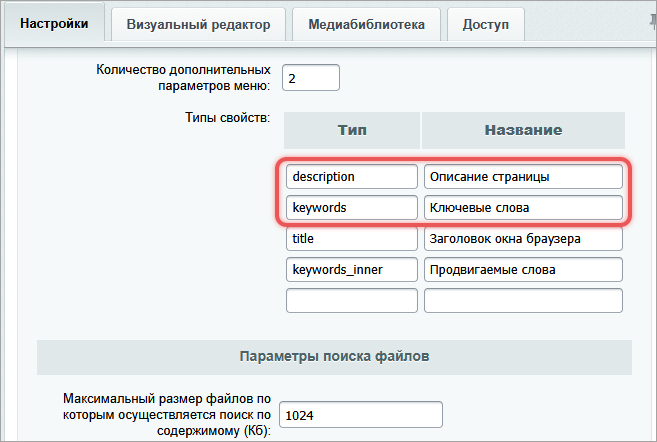
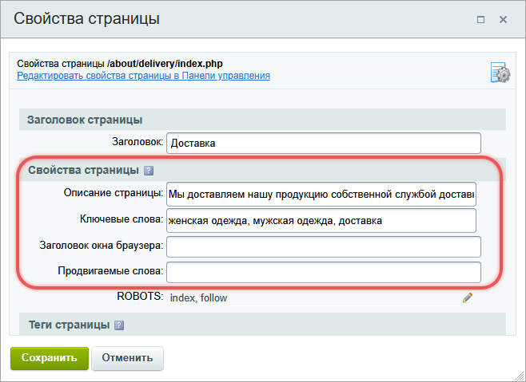
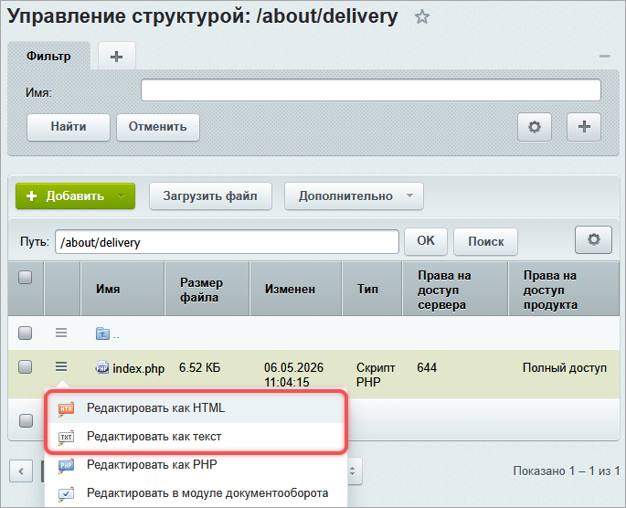
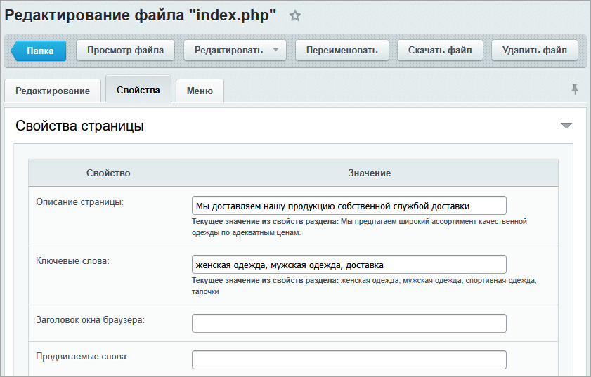
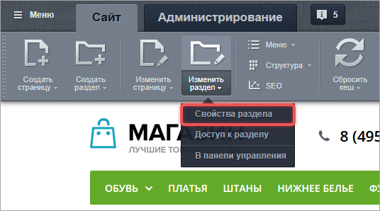
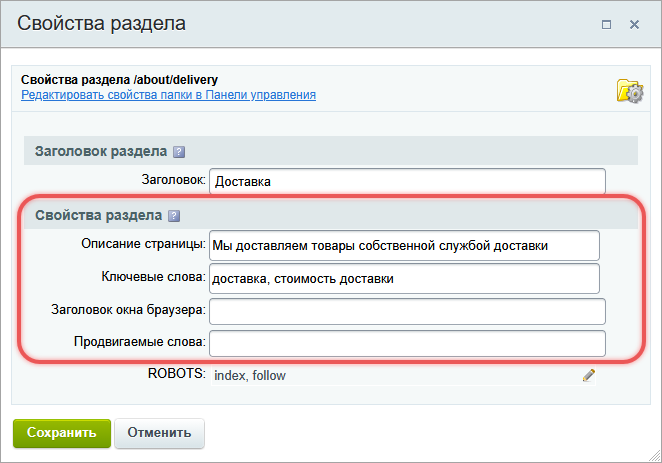
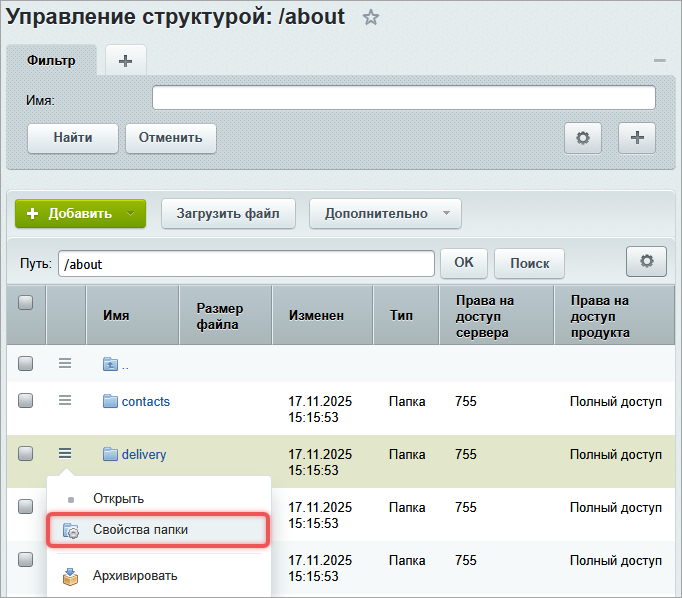
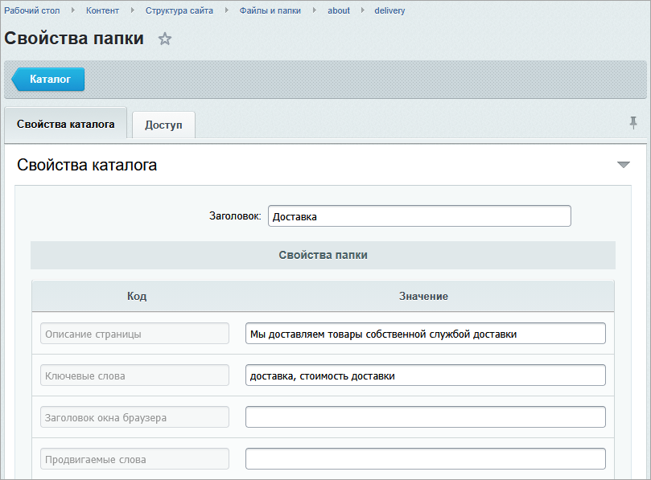

Свойства страницы и раздела хранят служебные значения для шаблона сайта, компонентов и кода страницы. Через свойства задают SEO-метаданные, заголовок окна браузера и другие значения, которые отличаются на страницах и в разделах сайта.

Свойства страницы действуют только на текущей странице. Свойства раздела задают значения для папки сайта и наследуются вложенными страницами и подразделами, если у них нет собственных значений.

## Как устроены свойства

**Свойство страницы.** Относится к одному файлу страницы. Например, страница каталога хранит значение свойства `description`, которое шаблон выводит в HTML-метатег.

**Свойство раздела.** Относится к папке сайта и хранится в файле `.section.php` этой папки. Если вложенная страница не задает собственное значение, система берет значение из ближайшего раздела выше.

**Тип свойства**. Это код, по которому система записывает, читает и выводит значение. Администратор настраивает набор типов свойств отдельно для каждого сайта.

### Добавить тип свойства

Чтобы редакторы могли заполнять свойства через интерфейс, добавьте нужные типы свойств в настройках модуля Управление структурой.

1. В административном разделе откройте страницу *Настройки > Настройки продукта > Настройки модулей > Управление структурой*.

2. На вкладке Настройки перейдите к параметру Типы свойств.

3. В колонке Тип введите код свойства латинскими буквами. В колонке Название укажите понятное название. Например, для SEO добавьте `keywords` — Ключевые слова и `description` — Описание страницы.

   {width=657px height=442px}



Для SEO-метаданных тип свойства должен совпадать с именем HTML-метатега:

-  `keywords` для тега `<meta name="keywords">`,

-  `description` для тега `<meta name="description">`.



### Чем свойства отличаются от заголовка страницы

Основной заголовок страницы хранится отдельно от свойств страницы и раздела. Его задают методом `SetTitle()` и получают методом `GetTitle()`.

Свойство `title` — зарезервированное свойство страницы. Обычно его используют для заголовка окна браузера, который выводится в теге `<title>` шаблона сайта. Это не второй самостоятельный заголовок, а обычное свойство страницы с особым назначением.



Подробнее о разнице между основным заголовком и свойством `title` читайте в статье [Заголовки страницы: на сайте и в браузере](./titles.md).



## Задать свойства страницы

Свойства страницы задают через интерфейс или в коде. Значение страницы имеет приоритет над значением раздела с таким же типом свойства.

### Свойства страницы через публичную часть

1. Откройте страницу на просмотр в публичном разделе сайта.

2. Нажмите *Изменить страницу > Заголовок и свойства страницы* на административной панели.

   {width=662px height=429px}

3. Заполните свойства и сохраните страницу.

   {width=658px height=479px}

### Свойства страницы через административную часть

1. Откройте *Контент > Структура сайта > Файлы и папки*.

2. Перейдите в папку, в которой размещена страница.

3. Нажмите *Редактировать как HTML* или *Редактировать как текст* в меню нужной страницы.

   {width=685px height=556px}

4. Заполните свойства и сохраните страницу.

   {width=841px height=537px}

### Свойства страницы через API

Чтобы задать свойство текущей страницы, вызовите `SetPageProperty(property_id, property_value, Options)` в коде страницы или компонента.

-  `property_id` — код свойства.

-  `property_value` — значение свойства.

-  `Options` — массив с дополнительными настройками свойства, необязательный параметр.

```php
<?php
$APPLICATION->SetPageProperty('keywords', 'Ключевые слова');
$APPLICATION->SetPageProperty('description', 'SEO описание');
$APPLICATION->SetPageProperty('title', 'Заголовок окна браузера');
?>
```

Свойства страницы можно задавать динамически. Например, компонент получает описание элемента инфоблока и передает его в свойство `description`.

```php
<?php
$APPLICATION->SetPageProperty(
    'description',
    $arIBlockElement['PROPERTIES'][$META_DESCRIPTION]['VALUE']
);
?>
```

В примере значение свойства `description` берется из свойства элемента инфоблока с кодом `META_DESCRIPTION`.

## Задать свойства раздела

Свойства раздела задают значения по умолчанию для страниц и подразделов внутри папки. Если на странице нет собственного свойства, система использует значение ближайшего вышестоящего раздела.

### Свойства раздела через публичную часть

1. Откройте раздел в публичной части сайта.

2. Нажмите *Изменить раздел > Заголовок и свойства страницы* на административной панели.

   {width=536px height=298px}

3. Заполните свойства и сохраните изменения.

   {width=662px height=463px}

### Свойства раздела через административную часть

1. Откройте *Контент > Структура сайта > Файлы и папки* в административном разделе.

2. Перейдите к папке, которая содержит ваш раздел.

3. Нажмите *Свойства папки* в меню раздела.

   {width=682px height=598px}

4. Заполните свойства и сохраните изменения.

   {width=809px height=597px}

### Свойства раздела через API

Свойства раздела хранятся в файле `.section.php` соответствующей папки. Чтобы задать значение из кода, используйте `SetDirProperty(property_id, property_value, path)`.

-  `property_id` — код свойства.

-  `property_value` — значение свойства.

-  `path` — путь к разделу. Если путь не передан, метод использует текущий раздел.

```php
<?php
$APPLICATION->SetDirProperty('keywords', 'Ключевые слова для всего раздела', '/products/');
$APPLICATION->SetDirProperty('description', 'SEO описание для всего раздела', '/products/');
$APPLICATION->SetDirProperty('title', 'Заголовок окна браузера для всего раздела', '/products/');
?>
```

В файле `.section.php` за свойства раздела отвечает массив `$arDirProperties`.

```php
<?php
$arDirProperties = [
    'description' => 'SEO описание для всего раздела',
    'keywords' => 'Ключевые слова для всего раздела',
    'title' => 'Заголовок окна браузера для всего раздела',
];
?>
```

## Получить свойства в коде

Если значение используется в логике страницы или компонента, получите его одним из методов чтения.

### GetPageProperty()

Метод `GetPageProperty(property_id, default_value)` возвращает свойство страницы.

-  `property_id` — код свойства.

-  `default_value` — значение по умолчанию. Метод возвращает его, если свойство страницы не найдено.

```php
<?php
$keywords = $APPLICATION->GetPageProperty('keywords');
$description = $APPLICATION->GetPageProperty('description', 'Значение по умолчанию');
$title = $APPLICATION->GetPageProperty('title');
?>
```

### GetDirProperty()

Метод `GetDirProperty(property_id, path, default_value)` возвращает свойство раздела.

-  `property_id` — код свойства.

-  `path` — путь к разделу. Если путь не передан, метод использует текущий раздел.

-  `default_value` — значение по умолчанию.

```php
<?php
$keywords = $APPLICATION->GetDirProperty('keywords');
$description = $APPLICATION->GetDirProperty('description', false, 'Значение по умолчанию');
$title = $APPLICATION->GetDirProperty('title');
?>
```

### GetProperty()

Метод `GetProperty(property_id, default_value)` сначала проверяет свойство текущей страницы. Если свойство не найдено, метод ищет свойство раздела с учетом наследования.

-  `property_id` — код свойства.

-  `default_value` — значение по умолчанию. Метод возвращает его, если свойство не найдено ни на странице, ни в разделе.

```php
<?php
$keywords = $APPLICATION->GetProperty('keywords');
$description = $APPLICATION->GetProperty('description', 'Значение по умолчанию');
$title = $APPLICATION->GetProperty('title');
?>
```

## Вывести свойства в шаблоне сайта

### Вывод значения свойства

Чтобы вывести свойство, используйте `ShowProperty(property_id, default_value)`. Метод отображает значение свойства страницы с учетом свойств раздела.

-  `property_id` — код свойства.

-  `default_value` — значение по умолчанию. Система выведет его, если свойство не найдено.

```php
<?php $APPLICATION->ShowProperty('description', 'Описание по умолчанию'); ?>
```

Отдельных методов вывода только свойства страницы или только свойства раздела нет. Метод `ShowProperty()` работает с общим результатом: сначала учитывает свойство страницы, затем свойство раздела и значение по умолчанию.

### Вывод свойства в виде метатега

Для SEO-метаданных используйте `ShowMeta(id, meta_name, bXhtmlStyle)`.

-  `id` — код свойства. По умолчанию метод использует код как значение атрибута `name` в HTML-метатеге.

-  `meta_name` — другое значение для атрибута `name`.

-  `bXhtmlStyle` — признак использования XHTML-формата для тега.

Разместите вызовы метода внутри тега `<head>` в файле шаблона `header.php`.

```php
<head>
    <?php $APPLICATION->ShowMeta('keywords'); ?>
    <?php $APPLICATION->ShowMeta('description'); ?>
</head>
```

Система сформирует HTML-метатеги:

```html
<meta name="keywords" content="женская одежда, мужская одежда, доставка" />
<meta name="description" content="Мы доставляем нашу продукцию собственной службой доставки" />
```

Если значение свойства не задано или пустое, `ShowMeta()` не выведет метатег.

## Учесть отложенный вывод

Методы `GetPageProperty()`, `GetDirProperty()` и `GetProperty()` сразу возвращают значение свойства в момент вызова. Если компонент установит свойство позже через `SetPageProperty()`, ранний вызов `GetPageProperty()` это значение не увидит.

Методы `ShowProperty()` и `ShowMeta()` работают через отложенный вывод. Они добавляют в буфер отложенную функцию, а значение свойства система получает позже при формировании страницы. Поэтому эти методы размещают в шаблоне сайта, например в `header.php`, даже если компонент задает свойство ниже по коду страницы.

```php
<head>
    <?php $APPLICATION->ShowMeta('description'); ?>
</head>

<?php
$APPLICATION->SetPageProperty('description', 'SEO описание из компонента');
?>
```

В этом примере `ShowMeta('description')` выведет значение, которое установлено через `SetPageProperty()` ниже по коду. Если вместо `ShowMeta()` вызвать `GetPageProperty()` до `SetPageProperty()`, метод вернет значение по умолчанию или `false`.

## Учесть приоритет значений

Для одного типа свойства система использует самое близкое значение к текущей странице.

-  Если значение задано на странице, оно имеет наивысший приоритет.

-  Если на странице значения нет, система проверяет свойства текущего раздела.

-  Если в текущем разделе значения нет, система проверяет вышестоящие разделы до корня сайта.

-  Если значение не найдено, система использует значение по умолчанию, которое передают в метод.

-  Если значение по умолчанию не передали, свойство остается незаданным.

Такой порядок позволяет задать общие свойства для раздела и переопределить их на отдельных страницах.
