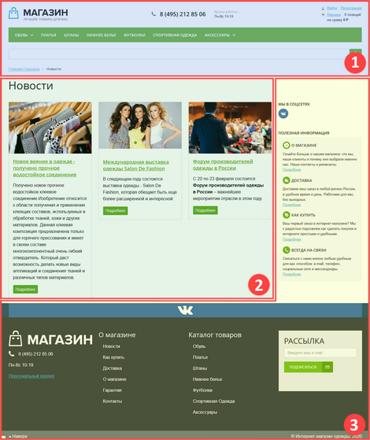
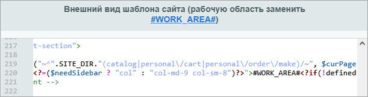
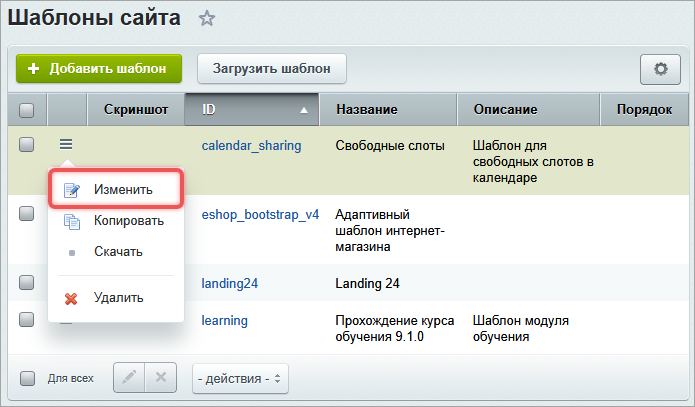
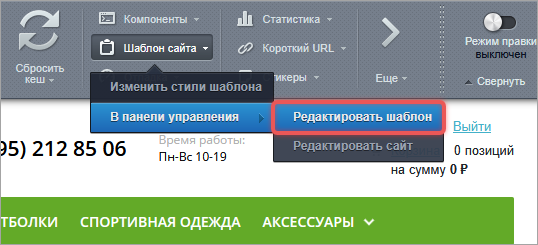
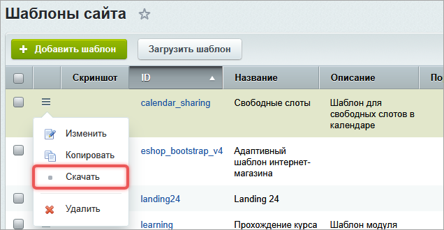
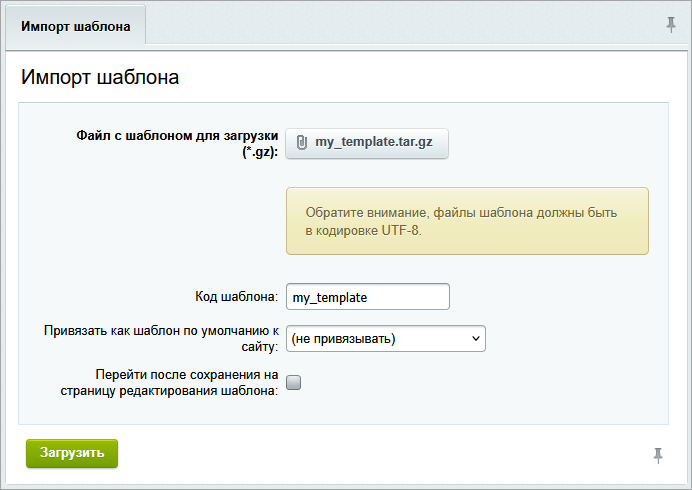
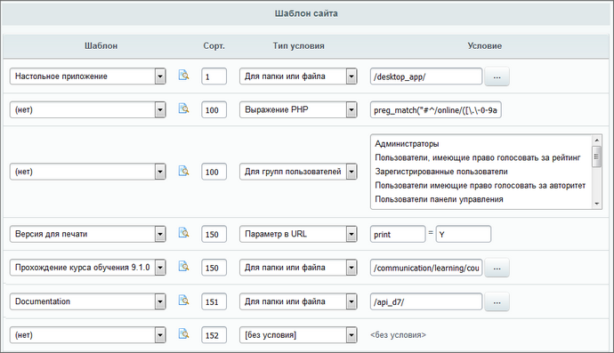

Шаблон -- это макет сайта. Он задает внешний вид страниц, расположение меню, логотипа, рекламы, формы авторизации и других элементов.

Шаблон состоит:

-  из HTML-разметки,

-  CSS-стилей,

-  графических элементов,

-  шаблонов компонентов и страниц,

-  сниппетов -- готовых блоков кода.

Продукты компании 1С-Битрикс поставляются с демонстрационными шаблонами. Это позволяет изучить структуру шаблонов и их подключение к сайту. Если требуется уникальное оформление, можно подготовить и применить собственный шаблон.

## Файловая структура шаблона

Каждый шаблон содержит стандартные файлы и папки.

Файлы:

-  `header.php` -- верхняя часть, шапка сайта,

-  `footer.php` -- нижняя часть, подвал сайта,

-  `description.php` -- название и описание шаблона,

-  `.styles.php` -- стили для визуального редактора,

-  `template_styles.css` -- стили шаблона,

-  `styles.css` -- стили сайта.

Папки:

-  `/components/` -- шаблоны компонентов,

-  `/lang/` -- языковые файлы для локализации,

-  `/page_templates/` -- шаблоны страницы.

Могут присутствовать дополнительные папки, например, `/images/` -- для изображений шаблона.

## Основные части шаблона

Шаблон делится на три основные части.

1. Header или шапка сайта -- верхняя часть сайта, хранится в файле `<идентификатор_шаблона>/header.php`. Содержит логотип, название сайта, меню.

2. Рабочая область -- место для контента страницы. Отмечается разделителем `#WORK_AREA#`. Без разделителя шаблон работать не будет.

3. Footer или подвал -- нижняя часть сайта, хранится в файле `<идентификатор_шаблона>/footer.php`. Содержит контактную информацию, дополнительное меню, информацию об авторских правах.



Header, рабочая область и footer должны всегда следовать в указанном порядке независимо от их размера и формы.



{width=470px height=559px}

### Как собирается страница

Чтобы собрать страницу сайта, необходимо в начале файла подключить `header.php`, добавить контент и в конце файла подключить `footer.php`.

```php
<?
require($_SERVER["DOCUMENT_ROOT"]."/bitrix/header.php");
$APPLICATION->SetTitle("Заголовок страницы");
?>

Контент страницы

<?
require($_SERVER["DOCUMENT_ROOT"]."/bitrix/footer.php");
?>
```

## Где хранятся шаблоны

Шаблоны хранятся в двух папках:

-  системные шаблоны размещены в `/bitrix/templates`,

-  пользовательские шаблоны следует хранить в `/local/templates`.



Шаблон Битрикс24 `/bitrix/templates/bitrix24` изменять нельзя.



## Управление шаблонами

Список всех шаблонов расположен в административном разделе на странице *Настройки > Настройки продукта > Сайты > Шаблоны сайтов*.

### Как создать шаблон

Шаблон можно создать через административный интерфейс системы.



На время создания шаблона рекомендуется отключить кеширование, чтобы сразу видеть изменения. Откройте страницу *Настройки > Настройки продукта > Автокеширование* и нажмите Выключить автокеширование.



1. На странице со списком шаблонов нажмите кнопку Добавить шаблон.

2. На вкладке Шаблон заполните параметры .

   -  ID -- идентификатор шаблона. Задается латинскими символами. Обязательное поле.

   -  Название -- название шаблона.

   -  Описание -- описание шаблона. Используется для пояснения назначения или особенностей шаблона.

   -  Порядок -- число, которое определяет положение шаблона в общем списке шаблонов. Чем меньше число, тем выше шаблон в списке.

   -  Тип -- тип шаблона. Укажите, что данный шаблон -- это шаблон сайта, а не почтовый.

   {width=691px height=357px}

3. В поле «Внешний вид шаблона сайта» напишите код шаблона. Чтобы обозначить границу между верхней и нижней частью, используйте разделитель `#WORK_AREA#`.

   {width=611px height=161px}

4. На вкладке «Стили сайта» заполните файл `styles.css`.

5. На вкладке «Стили шаблона» заполните файл `template_styles.css`.

6. Нажмите Сохранить. Система сохранит шаблон в папке `/bitrix/templates/<идентификатор_шаблона>`.

Скриншот шаблона можно сохранить в `/bitrix/templates/<идентификатор_шаблона>/screen.gif`. Он будет виден в списке.

### Как отредактировать шаблон

Открыть шаблон для редактирования можно двумя способами.

-  **Через административный раздел**. Откройте список шаблонов и в меню шаблона нажмите пункт Изменить.

   {width=695px height=407px}

-  **Через публичный раздел**. На административной панели нажмите *Шаблон сайта > В панели управления > Редактировать шаблон*.

   {width=538px height=245px}

### Экспорт и импорт

Шаблон можно экспортировать в файл `<идентификатор_шаблона>.tar.gz`. Для этого в меню шаблона нажмите Скачать .

{width=636px height=330px}

Готовый шаблон можно загрузить в систему с помощью менеджера файлов или через специальный интерфейс.

1. На странице со списком шаблонов нажмите Загрузить шаблон.

2. Выберите файл шаблона с помощью кнопки Добавить файл.

   

   Файлы шаблона должны быть в кодировке UTF-8.

   

3. В поле Код шаблона введите идентификатор шаблона . Если поле оставить пустым, шаблон будет распакован и помещен в папку с именем файла.

4. Укажите сайт, если к нему нужно привязать загруженный шаблон как шаблон по умолчанию.

   {width=692px height=490px}

## Условия применения шаблона

Количество шаблонов на сайте не ограничено. Для каждого шаблона можно задать условие, при котором он будет применяться. Доступны следующие типы:

-  для папки или файла,

-  для групп пользователей,

-  период времени,

-  параметр в URL,

-  пользователь не имеет доступ,

-  выражение PHP.

### Порядок работы

1. При обработке запроса система перебирает шаблоны по возрастанию значения сортировки.

2. Для каждого шаблона проверяется его условие применения.

3. Применяется первый шаблон, условие которого выполняется. Остальные шаблоны игнорируются.

### Настройка условий

Условия применения шаблонов настраиваются отдельно для каждого сайта.

1. Перейдите на страницу *Настройки > Настройки продукта > Сайты > Список сайтов*.

2. Выберите сайт и откройте его на редактирование.

3. Настройте условия в разделе «Шаблон сайта». Например, для сайта создан шаблон «Версия для печати». Он должен быть применен, если в URL есть параметр `print=Y`.

   -  В колонке Шаблон выберите «Версия для печати».

   -  Обязательно задайте индекс сортировки. Он влияет на порядок применения шаблонов. Если индекс не указан, может примениться неправильный шаблон.

   -  В колонке Тип условия выберите «Параметр в URL».

   -  В колонке Условие укажите `print=Y`.

   {width=690px height=397px}

### Примеры

Таблица показывает, как можно задавать условия в зависимости от выбранного типа и когда будет применен шаблон.

| Тип условия | Пример условия | Когда применяется шаблон |
| ----------- | -------------- | ------------------------ |
| Для папки или файла | `/index.php` | При открытии главной страницы сайта |
| Для папки или файла | `/news/` | При открытии новостного раздела |
| Выражение PHP | `$USER->IsAuthorized()` | Если пользователь авторизован на сайте |
| Выражение PHP | `$USER->IsAdmin()` | Для администратора сайта |
| Выражение PHP | `in_array('5', $USER->GetUserGroupArray())` | Если пользователь принадлежит группе с идентификатором `5` |


## Разработка шаблона

Процесс разработки шаблона состоит из двух основных этапов:

-  создание прототипа -- HTML-шаблона, с основными элементами дизайна: заголовком, меню, формой авторизации, поиском и другими элементами.

-  создание шаблона с учетом рекомендаций.

### Рекомендации по созданию шаблона

-  Разделяйте графический дизайн на верхнюю `header.php` и нижнюю `footer.php` части заранее. Это позволяет повторно использовать части шаблона и улучшает структуру сайта.

-  Настраивайте стили заранее. Задавайте цвета, шрифты и размеры до подключения к системе.

-  Выделяйте повторяющиеся элементы для меню разных уровней. Это упрощает создание шаблона и управление меню.

-  Для многоязычных сайтов используйте текстовые элементы вместо графических.

-  Планируйте место для компонентов. Заранее определите места для  меню, рекламных блоков, дополнительных форм. Верстайте их отдельно от основного дизайна.

-  Отключите сжатие и объединение CSS и JS-файлов. Это упростит отладку.

-  Храните изображения шаблона в папке `/bitrix/templates/<идентификатор_шаблона>/images`. Вы избежите путаницы с изображениями других шаблонов и компонентов.

-  Разделяйте каскадные стили на два файла:

   -  `styles.css` -- для отображения содержимого страницы,

   -  `template_styles.css` -- для стилей самого шаблона.

-  Дополнительные стилевые файлы можно подключить в `<head>`. Для этого используйте теги  `<link>`.  Разместите их перед закрытием тега `</head>`. Дополнительные стили можно хранить в любой папке.



Комплексные компоненты рекомендуется размещать в рабочей области шаблона сайта, потому что они могут использовать свои правила обработки ЧПУ. Если комплексный компонент подключить в верхней или нижней части шаблона, это может нарушить работу маршрутизации, привести к ошибкам 404, сделать сайт непредсказуемым при переходах между страницами.



### Как развернуть шаблон

Создайте шаблон на локальной версии продукта. Готовый шаблон экспортируйте в виде архива `tar.gz` или распакуйте из архива в папке `/local/templates/`.

### Несколько шаблонов для сайта

Для сайта можно создать несколько шаблонов: для главной страницы, разделов и детальной страницы. Если различия между шаблонами незначительные, лучше использовать один шаблон. Внутри него можно проверить, какая страница открыта, и подключить нужные включаемые области. Это упрощает поддержку и уменьшает риск ошибок.
