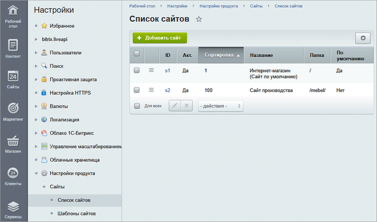

Каждый сайт в рамках Bitrix Framework состоит из трех ключевых элементов.

1. Регистрационная запись в таблице `b_lang`.

2. Файловая структура:

   -  публичные файлы сайта,

   -  шаблон сайта,

   -  пользовательские доработки в `/bitrix/php_interface/site_<LID>/`.

3. Конфигурация:

   -  параметры сайта в `b_option_site,` `b_site_template` и других таблицах,

   -  параметры модулей с привязкой к сайту, таблица `b_option`.

Эти элементы работают вместе, чтобы обеспечить пользователям доступ к контенту и функциям сайта.



В Bitrix Framework можно создавать несколько сайтов на одном экземпляре продукта. Подробнее читайте в статье [Многосайтовость](./../rasshirennye-znaniya/mnogosaytovost).



## Работа с сайтами

Для управления сайтами в административном разделе предназначена страница  *Настройки > Настройки продукта > Сайты > Список сайтов*. Каждый сайт представлен отдельной записью.

{width=750px height=441px}

### Как создать новый сайт

1. На странице со списком сайтов нажмите Добавить сайт.

2. Заполните параметры сайта:

   -  ID -- уникальный идентификатор сайта. Это двузначный код из латинских букв и цифр.

   -  Активен -- отметьте опцию, чтобы сайт был доступен к просмотру.

   -  Название -- укажите название сайта для административного раздела. Можно на русском языке.

   -  По умолчанию --  отметьте опцию, если сайт не единственный и должен открываться по умолчанию.

   -  Доменное имя -- введите доменное имя сайта. Рекомендуется заполнять только в случае многосайтовости на одном ядре.

   -  Папка сайта -- укажите путь к папке сайта. Папка должна существовать.

   -  Сортировка -- задайте число, которое определяет положение сайта в списке.

      

      Значение сортировки сайтов на поддоменах должно быть меньше, чем значение сортировки сайта на основном домене.

      Для разных доменов ограничений нет.

      

   -  Путь к корневой папке веб-сервера для этого сайта -- укажите путь к корневой папке сервера для сайта. Если все сайты работают на одном сервере, поле следует оставить пустым.

   -  Название веб-сайта -- задайте название, которое увидят пользователи.

   -  URL сервера (без http://) -- введите адрес сайта без протокола.

   -  E-Mail адрес по умолчанию -- укажите адрес отправителя сообщений сайта.

   -  Язык -- выберите язык для страниц сайта.

   -  Региональные настройки -- выберите настройку с форматом даты, времени, кодировки и другими региональными параметрами.

   -  Создать почтовые шаблоны -- шаблоны почтовых сообщений можно привязать к шаблонам  сайтов или скопировать из шаблонов других сайтов.

   -  Шаблон сайта -- задайте шаблон с помощью мастера или выберите из списка доступных. Шаблон определяет дизайн страниц, меню, навигацию, расположение рекламных блоков и включаемых областей.

### Как изменить домен сайта

1. Приобретите новый домен.

2. Привяжите домен к хостингу:

   -  если хостинг и домен у одного провайдера, привязка происходит автоматически или по инструкциям от провайдера,

   -  если хостинг и домен у разных провайдеров, добавьте домен в настройки хостинга и укажите DNS-серверы хостинга у регистратора домена.

   

   Привязка доменного имени к хостингу может занять несколько дней.

   

3. Укажите новое доменное имя в настройках сайта *Настройки > Настройки продукта > Сайты >  Список сайтов > \[ваш\_сайт\]*.

{width=750px height=440px}



Если в [проактивной защите](./../security/proactive-security#хосты/домены) настроено ограничение доступа или перенаправление запросов, укажите новый домен на странице *Настройки > Проактивная защита > Хосты/домены*.


