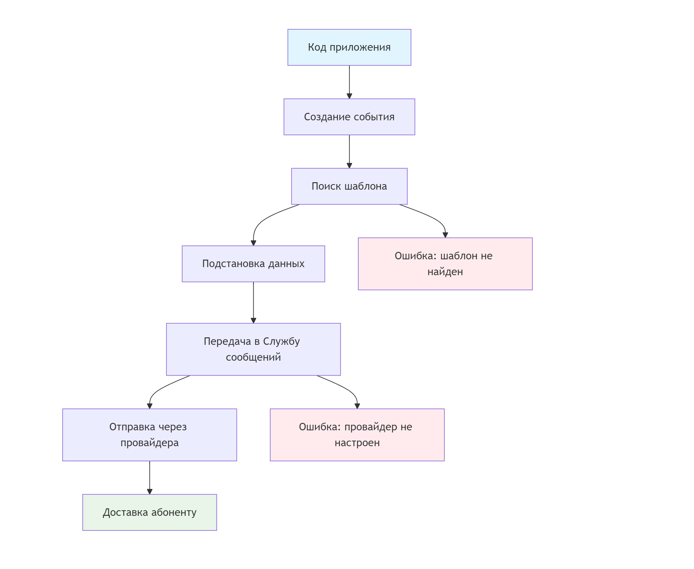
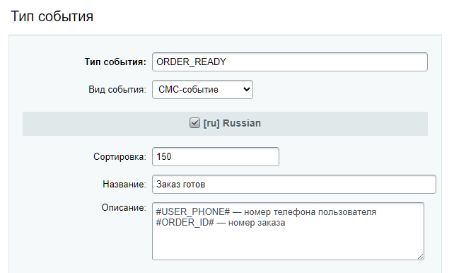
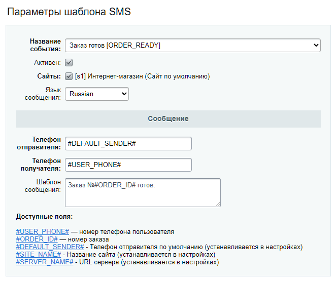
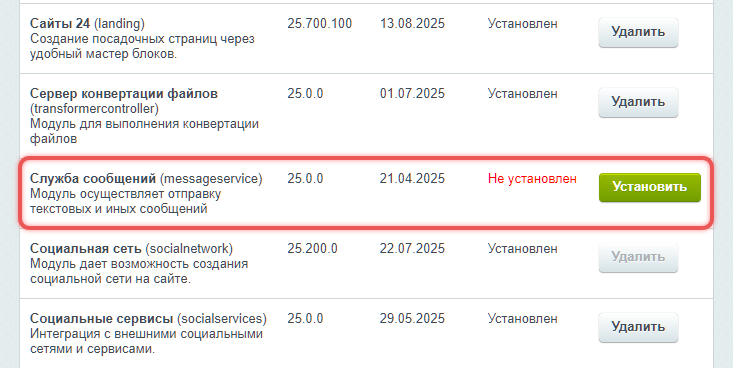
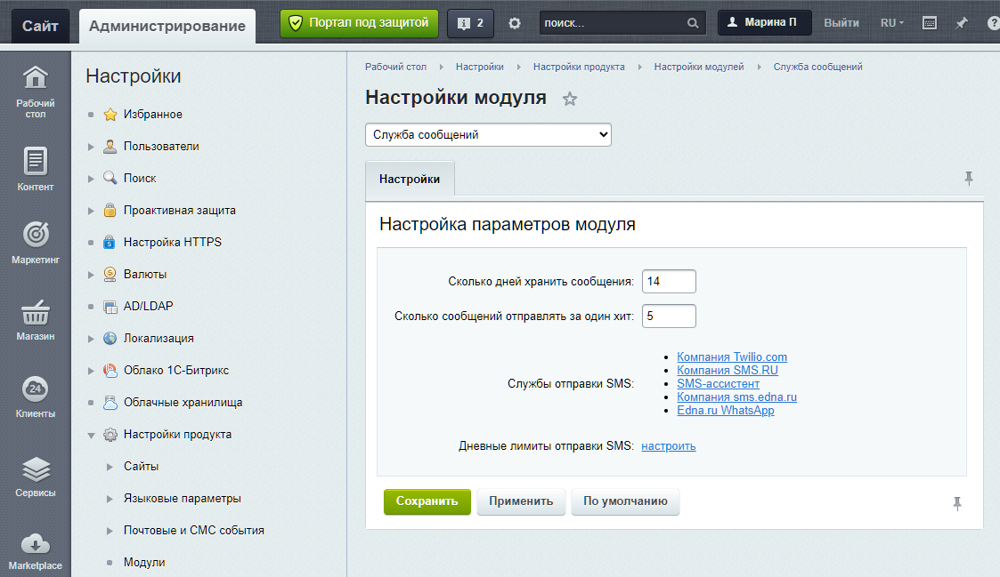

Bitrix Framework использует СМС, чтобы уведомлять пользователей. Отправляет СМС модуль Служба сообщений. Он соединяет систему с разными СМС-провайдерами.

## Как работает отправка СМС

1. Код приложения создает СМС-событие с данными для подстановки.

2. Система находит активный СМС-шаблон по имени события, сайту и языку.

3. Данные подставляются в шаблон вместо специальных меток вида `#CODE#`.

4. Готовое сообщение передается выбранному СМС-провайдеру.

5. Провайдер доставляет СМС до абонента.

Метки в шаблонах -- это специальные пометки в тексте, которые система заменяет реальными данными. Например, метка `#USER_NAME#` заменится на имя пользователя, а `#ORDER_ID#` -- на номер заказа.

{width=2227px height=1830px}

## События и шаблоны сообщений

Чтобы отправить СМС, нужно создать тип события и связать с ним шаблон. Тип события определяет, когда отправлять сообщение, а шаблон -- какой текст использовать. В шаблоне укажите метки, которые система заменит на реальные данные.

### Создать тип события

Тип события -- это идентификатор, который связывает код с шаблонами СМС.

Чтобы создать новый тип события, откройте страницу *Настройки > Почтовые и СМС события > Типы событий* и нажмите Добавить тип.

{width=642px height=386px}

-  Тип события -- укажите уникальное имя, например, `ORDER_READY`.

-  Вид события -- выберите СМС-событие.

-  Название -- напишите понятное название для каждого языка.

-  Описание -- добавьте описание события, например, доступные метки.

### Создать шаблон

Шаблон задает текст сообщения для системных уведомлений.

{width=662px height=555px}

-  Название события -- выберите тип события, который свяжет код и шаблон.

-  Активен -- отметка, что система может использовать шаблон.

-  Сайты -- сайт для которого действует шаблон.

-  Язык -- конкретный  язык, например, `ru` или `en`.

-  Телефон отправителя -- номер, с которого система отправит СМС.

-  Телефон получателя -- номер получателя сообщения.

-  Шаблон сообщения -- текст сообщения с метками, которые заменяются реальными данными.

В доступных полях система показывает системные метки и те, которые вы указали в типе события. Их можно использовать для полей сообщения.

## Класс \\Bitrix\\Main\\Sms\\Event

Класс `\Bitrix\Main\Sms\Event` управляет отправкой СМС: ищет подходящий шаблон, подставляет данные и передает сообщение модулю Служба сообщений `messageservice`.

### Конструктор

```php
__construct(string $eventName, array $fields = [])
```

-  `$eventName` -- имя СМС-события, совпадает с полем `EVENT_NAME` в шаблоне.

-  `$fields` -- массив данных для подстановки.

Пример:

```php
$event = new \Bitrix\Main\Sms\Event('ORDER_READY', [
    'ORDER_ID' => 42,
    'USER_PHONE' => '89991234567',
]);
```

### Методы

#### Найти шаблон

Метод `setSite($siteId)` задает сайт для поиска шаблона.

-  `$siteId` -- идентификатор сайта.

```php
$event->setSite('s1');
```

По умолчанию система использует текущий сайт.

#### Задать язык для выбора шаблона

Метод `setLanguage($languageId)` задает язык для выбора шаблона.

-  `$languageId` -- идентификатор языка.

```php
$event->setLanguage('ru'); // может быть 'ru', 'en', 'de' и так далее
```

По умолчанию система использует текущий язык.

#### Выбрать шаблон по идентификатору

Метод `setTemplate($templateId)` выбирает конкретный шаблон по `ID`.

-  `$templateId` -- числовой идентификатор шаблона.

```php
$event->setTemplate(105);
```

Если указать шаблон по `ID`, система не будет искать его по событию и языку.

#### Отправить СМС

Метод `send($directly)` отправляет СМС.

-  `$directly` -- по умолчанию имеет значение `false`, то есть сообщение попадает в очередь. Если установить `true` , сообщение отправится без очереди.

```php
$result = $event->send(false);
```

Метод возвращает объект `\Bitrix\Main\Result`. Получить список ошибок можно кодом:

```php
if (!$result->isSuccess()) {
    foreach ($result->getErrorMessages() as $msg) {
        echo $msg;
    }
}
```

#### Получить список сообщений

Метод `createMessageList()` получает список сообщений на основе шаблонов.

```php
$result = $event->createMessageList();

if ($result->isSuccess()) {
    $messages = $result->getData();
}
```

Метод возвращает объект `\Bitrix\Main\Result`. Поле `data` содержит массив объектов `\Bitrix\Main\Sms\Message`.

### Примеры

#### Отправить СМС через очередь

Сообщение отправится через систему очередей после завершения текущего запроса.

```php
use Bitrix\Main\Sms\Event;

// Создаем событие с данными для подстановки в шаблон
$event = new Event('USER_CONFIRM_PHONE', [
    'CODE' => '123456',    // Подставится вместо #CODE# в шаблоне
    'USER_ID' => 42,       // Подставится вместо #USER_ID# в шаблоне
]);

// Настраиваем и отправляем сообщение
$result = $event
    ->setSite('s1')        // Указываем сайт для поиска шаблона
    ->setLanguage('ru')    // Указываем язык шаблона
    ->send(false);         // false — отправка через очередь

// Проверяем результат отправки
if (!$result->isSuccess()) {
    foreach ($result->getErrorMessages() as $msg) {
        echo $msg;
    }
}
```

#### Отправить сообщение без очереди

Сообщение отправится сразу, без помещения в очередь.

```php
// Создаем и отправляем событие в одной строке
$result = (new Event('PASSWORD_RESTORE', $fields)) // $fields — массив данных для шаблона
    ->setSite('s1')    // Указываем сайт
    ->send(true);      // true — немедленная отправка без очереди
```

#### Отправить сообщение по ID шаблона

Пример использует конкретный шаблон по  `ID`. Система не ищет шаблон по имени события.

```php
// Используем конкретный шаблон, минуя поиск по имени события
$result = (new Event('IGNORED_EVENT', $fields)) // Имя события игнорируется
    ->setSite('s1')
    ->setTemplate(105) // Используем шаблон с ID 105
    ->send();          // Отправляем сообщение
```

### Событие onBeforeSendSms

Перед отправкой сообщения система вызывает событие `main:onBeforeSendSms`. Обработчик получает объект сообщения. Он может проверить данные или изменить текст. Если обработчик вернет ошибку, система не отправит сообщение.

```php
use Bitrix\Main\EventManager;
use Bitrix\Main\EventResult;

// Регистрируем обработчик для проверки СМС перед отправкой
EventManager::getInstance()->addEventHandler(
    'main',
    'onBeforeSendSms',
    function(\Bitrix\Main\Event $event) {
        // Получаем объект сообщения
        $msg = $event->getParameter('message');
        
        // Проверяем формат номера телефона
        if (!preg_match('/^\+?[1-9]\d{7,14}$/', $msg->getTo())) {
            // Если номер невалидный — отменяем отправку
            return new EventResult(EventResult::ERROR);
        }
        
        // Если все проверки пройдены, сообщение будет отправлено
    }
);
```

## Модуль Служба сообщений

Чтобы отправить СМС, система использует внешних провайдеров -- специальные сервисы, которые доставляют сообщения до абонентов. Модуль Служба сообщений `messageservice` управляет подключением к провайдерам и настройками отправки.

### Установить модуль

Чтобы установить модуль Служба сообщений, откройте страницу *Настройки > Настройки продукта > Модули* в административном разделе. В списке найдите модуль и нажмите кнопку Установить.

{width=733px height=368px}

### Настроить модуль

Настроить модуль можно на странице *Настройки > Настройки продукта > Настройки модулей > Служба сообщений*.

-  Сколько дней хранить сообщения -- задает срок хранения истории СМС. Система автоматически удаляет старые сообщения.

-  Сколько сообщений отправлять за один хит -- ограничивает количество СМС за один запрос. Это предотвращает перегрузку сервера.

-  Службы отправки SMS -- отображает список доступных СМС-провайдеров. Для подключения сервиса кликните по его названию и заполните форму.

-  Дневные лимиты отправки SMS -- ограничивает количество СМС в сутки.

{width=1123px height=649px}

## Класс SmsManager

Класс `\Bitrix\MessageService\Sender\SmsManager` предоставляет единый интерфейс для работы с СМС-провайдерами. Он автоматически определяет доступные сервисы отправки и управляет процессом отправки сообщений.

### Провайдеры

Каждый сервис отправки СМС -- это класс в пространстве имен `\Bitrix\MessageService\Sender\Sms\`. Класс содержит константы для идентификации провайдера.

```php
\Bitrix\MessageService\Sender\Sms\SmsRu::ID      // идентификатор SMS.RU
\Bitrix\MessageService\Sender\Sms\EdnaRu::ID     // идентификатор Edna
```



Полный список провайдеров можно получить методом `getSenders()`. Система включает только те провайдеры, которые поддерживаются текущей конфигурацией.



#### Методы

Подключите модуль `messageservice`, чтобы использовать методы.

```php
CModule::IncludeModule('messageservice');
```

-  `getSenders` -- получает список всех доступных провайдеров.

```php
$senders = \Bitrix\MessageService\Sender\SmsManager::getSenders();
```

-  `getDefaultSender`  -- получает провайдера по умолчанию для региона.

```php
$defaultSender = \Bitrix\MessageService\Sender\SmsManager::getDefaultSender();
```

-  `getUsableSender` -- получает первого доступного провайдера.

```php
$usableSender = \Bitrix\MessageService\Sender\SmsManager::getUsableSender();
```

-  `getSenderById` -- получает информацию о провайдере по идентификатору `ID`.

```php
$sender = \Bitrix\MessageService\Sender\SmsManager::getSenderById(
    \Bitrix\MessageService\Sender\Sms\SmsRu::ID
);
```

#### Зарегистрировать провайдера

Чтобы добавить провайдера:

-  создайте класс провайдера -- наследник `\Bitrix\MessageService\Sender\Base`,

-  зарегистрируйте класс через событие.

```php
$eventManager = \Bitrix\Main\EventManager::getInstance(); 
$eventManager->registerEventHandler(
    'messageservice',
    'onGetSmsSenders',
    'messageservice',
    'Bitrix\MessageService\Sender\Sms\Dummy',
    'onGetSmsSenders'
);
```

### Отправка сообщений

Класс `SmsManager` предоставляет несколько способов отправки СМС. Вы можете отправлять сообщения напрямую, работать с объектами сообщений для тонкой настройки или создавать сообщения на основе шаблонов.

#### Отправить сообщение

Метод `sendMessage()` отправляет сообщение через указанного провайдера. Сообщение добавляется в очередь отправки.

```php
\Bitrix\MessageService\Sender\SmsManager::sendMessage([
    'SENDER_ID' => \Bitrix\MessageService\Sender\Sms\Ednaru::ID, // Идентификатор провайдера
    'AUTHOR_ID' => $authorId, // Пользователь — отправитель сообщения
    'MESSAGE_TO' => $phoneNumber, // Номер получателя в международном формате
    'MESSAGE_FROM' => $chanelId, // Канал отправителя
    'MESSAGE_BODY' => 'Здравствуйте, ваш заказ уже в пути.', // Текст сообщения
]);
```

#### Отправить сообщение с расширенной настройкой

Метод `createMessage()` дает больше контроля над отправкой СМС. Используйте его, чтобы задать дополнительные параметры или заголовки.

С помощью метода можно:

-  настроить дополнительные параметры через `MESSAGE_HEADERS`,

-  выбрать момент отправки -- через очередь или сразу,

-  проверить данные перед отправкой.

```php
$message = \Bitrix\MessageService\Sender\SmsManager::createMessage([
    'SENDER_ID' => \Bitrix\MessageService\Sender\Sms\Ednaru::ID,
    'MESSAGE_TO' => $phoneNumber,
    'MESSAGE_FROM' => $chanelId,
    'MESSAGE_BODY' => $text,
    'MESSAGE_HEADERS' => [
        'module_id' => 'crm', // Привязка к модулю, например, CRM
        'bindings' => [ // Связи с CRM-объектами
            [
                'OWNER_TYPE_ID' => 1, // Тип объекта, например, лид
                'OWNER_ID' => 57, // Идентификатор объекта
            ],
        ],
    ],
]);

// Отправить через очередь
$result = $message->send();

// Отправить немедленно
$result = $message->sendDirectly();
```

#### Отправить сообщение без очереди

Метод `sendMessageDirectly()` отправляет сообщение немедленно, без помещения в очередь. Используйте этот метод для срочных сообщений.

```php
$result = \Bitrix\MessageService\Sender\SmsManager::sendMessageDirectly([
    'SENDER_ID' => \Bitrix\MessageService\Sender\Sms\SmsRu::ID,
    'MESSAGE_TO' => '+79161234567',
    'MESSAGE_BODY' => 'Срочное сообщение',
]);
```

#### Создать сообщение по шаблону

Метод `createMessageListByTemplate()` создает список сообщений на основе СМС-шаблонов. Система автоматически находит шаблоны по имени события и подставляет переданные данные.

```php
// Данные для подстановки в шаблон. Могут быть разными для каждого получателя
$templateData = [
    'CODE' => $confirmationCode,    // Данные для подстановки в плейсхолдер #CODE#
    'USER_ID' => $userId,           // Данные для подстановки в плейсхолдер #USER_ID#
    'SENDER_ID' => \Bitrix\MessageService\Sender\Sms\SmsRu::ID, // Опциональный провайдер
    'DEFAULT_FROM' => 'MyCompany'   // Опциональный отправитель
];

// Создаем сообщения на основе шаблона 'USER_CONFIRM_PHONE'
$messages = \Bitrix\MessageService\Sender\SmsManager::createMessageListByTemplate(
    'USER_CONFIRM_PHONE', // имя события, указанное в шаблоне
    $templateData
);

// Отправляем все созданные сообщения
foreach ($messages as $message) {
    $message->send();
}
```

#### Проверить статус сообщения

Метод `getMessageStatus()` позволяет получить текущий статус отправленного сообщения. Статус помогает отслеживать доставку и обрабатывать ошибки.

```php
// Получаем статус сообщения по его ID
$status = \Bitrix\MessageService\Sender\SmsManager::getMessageStatus($messageId);

if ($status->isSuccess()) {
    // Сообщение успешно обработано
    $statusCode = $status->getExternalStatus();  // Код статуса от провайдера
    $statusText = $status->getStatusText();      // Текстовое описание статуса
} else {
    // Произошла ошибка
    $errors = $status->getErrorMessages();       // Массив ошибок
}
```

### Автоматическая нормализация номеров

Система автоматически приводит номера телефонов к международному формату.

```php
// 1. Вход: 89161234567 → Выход: +79161234567
// 2. Вход: +7 (916) 123-45-67 → Выход: +79161234567
```

### Обработка ошибок

Методы отправки возвращают объект `Bitrix\Main\Result`. Используйте этот объект для проверки результата операции. Если отправка не удалась, получите список ошибок.

```php
$result = \Bitrix\MessageService\Sender\SmsManager::sendMessage($messageFields);
if (!$result->isSuccess()) {
    foreach ($result->getErrorMessages() as $error) {
        // Обработка ошибки
    }
}
```

### События

Событие `OnMessageSuccessfullySent` позволяет выполнить код после успешной отправки СМС. Например, можно залогировать отправку или обновить данные в CRM.

```php
use Bitrix\Main\EventManager;
use Bitrix\Main\Event;

// Логируем отправку СМС
EventManager::getInstance()->addEventHandler(
    'messageservice',
    'OnMessageSuccessfullySent',
    function(Event $event) {
        $messageId = $event->getParameter('ID');
        
        // Запишем успешную отправку сообщения
        AddMessage2Log("СМС отправлено. ID: {$messageId}", 'messageservice');
    }
);
```
