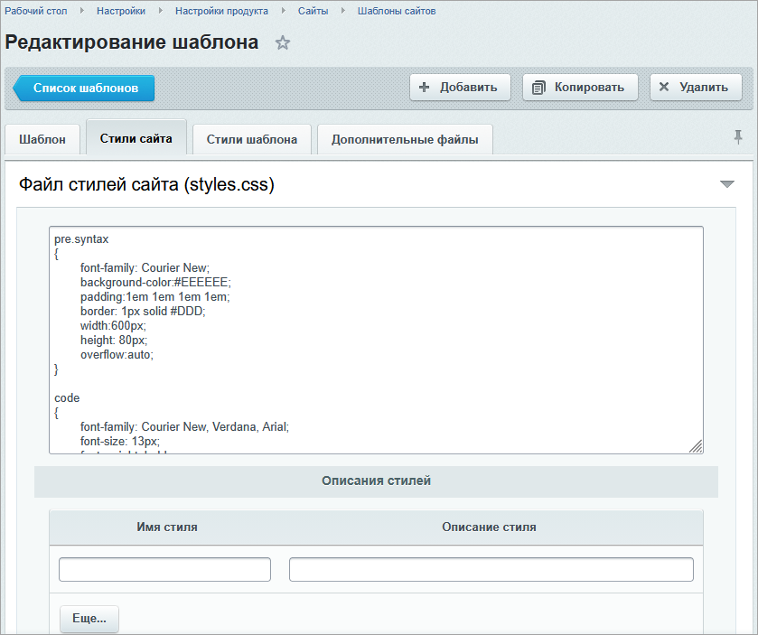
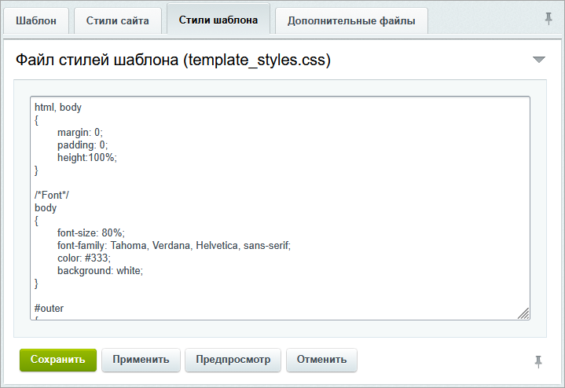
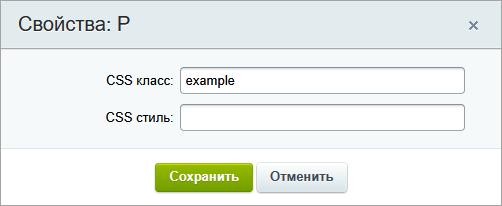
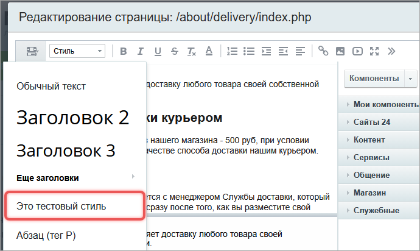
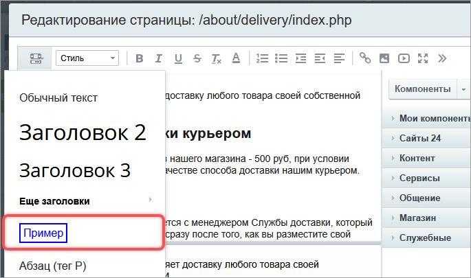
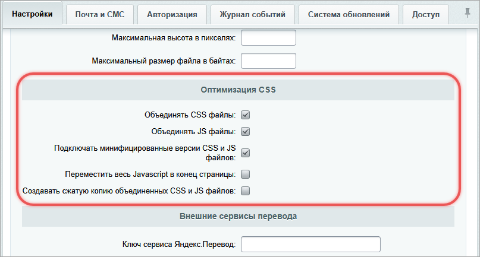

Стили отвечают за внешний вид элементов сайта: шрифты, цвета, отступы, рамки, меню, таблицы и другие блоки. В Bitrix Framework стили хранятся рядом с элементом, который они оформляют. Шаблоны сайта содержат каркас, шаблоны компонентов отвечают за блоки данных, а JS-расширения управляют клиентским интерфейсом.

Этот подход подсказывает, какой файл менять и как подключать ресурсы через API. Когда стили лежат в своих папках, правила не пересекаются.

## Где хранить CSS

#|
|| **Где хранится** | **Что оформляет** | **Основные файлы** ||
|| Шаблон сайта | Общий каркас сайта: шапку, подвал, сетку, фон, базовую типографику, стили визуального редактора | `template_styles.css`, `styles.css`, `.styles.php`, `description.php` ||
|| Шаблон компонента | HTML, который выводит конкретный компонент: список, меню, форму, карточку товара, блок новостей | `template.php`, `style.css`, `script.js` ||
|| JS-расширение | Клиентский интерфейс, который подключается как модуль: попап, меню, поле ввода, виджет на JavaScript | `src`, `dist`, `bundle.config.js`, `config.php` ||
|| Отдельный файл страницы | CSS, который нужен только на одной странице и не принадлежит компоненту или расширению | файл, подключенный через `SetAdditionalCSS()` или `Asset::addCss()` ||
|#

Выбирайте место по владельцу разметки.

-  Если CSS описывает HTML из `header.php` или `footer.php`, он относится к шаблону сайта.

-  Если CSS описывает HTML из `template.php` компонента, он относится к шаблону компонента.

-  Если CSS нужен коду, который загружается через `Extension::load()`, он относится к JS-расширению.

## Настроить стили шаблона сайта

Шаблон сайта задает общий макет страниц: HTML-разметку, рабочую область, меню, логотип, подвал, изображения и базовые CSS-файлы.

Шаблоны сайта хранятся в папках:

-  `/local/templates/<идентификатор_шаблона>/` — для пользовательских шаблонов,

-  `/bitrix/templates/<идентификатор_шаблона>/` — для шаблонов продукта.

Для разработки используйте `/local/templates/`. Файлы в `/bitrix/` могут измениться при обновлении продукта.



Структура папки шаблона сайта, назначение `header.php`, `footer.php`, `description.php`, `styles.css` и `template_styles.css` описаны в статье [Шаблоны сайтов](./site-templates.md).



### Разделить styles.css и template_styles.css

Файл `template_styles.css` хранит стили самого шаблона: шапки, подвала, колонок, сетки, фона и других элементов вне рабочей области.

Файл `styles.css` хранит стили содержимого страницы. Эти правила система использует в визуальном редакторе, поэтому не добавляйте оформление каркаса сайта в этот файл.

Разделение нужно из-за визуального редактора. Редактор показывает содержимое в `iframe` и подключает в область `<head>` стили из `styles.css` через тег `<style>`. Если добавить в `styles.css` оформление каркаса сайта, эти правила могут попасть в редактор и исказить вид редактируемого текста.

Пример распределения:

```css
/* template_styles.css */
.site-header {
    background: #f5f7fa;
}

.site-footer {
    border-top: 1px solid #dfe3e8;
}
```

```css
/* styles.css */
.content-title {
    font-size: 32px;
    line-height: 1.25;
}

.content-table {
    border-collapse: collapse;
}
```

Если правило должно работать только в шапке, подвале или сетке сайта, добавьте его в файл `template_styles.css`. Если правило должно быть доступно редактору контента, добавьте его в `styles.css`.

Если в шаблоне пока нет `styles.css` или `template_styles.css`, создайте нужный файл в папке шаблона перед добавлением правил. Административный раздел сохраняет содержимое этих полей в одноименные файлы шаблона.



Используйте `!important` в исключительных случаях. Такие правила сложнее переопределять и поддерживать.



### Изменить стили через административный раздел

Стили шаблона можно редактировать из административного раздела.

1. Откройте страницу *Настройки > Настройки продукта > Сайты > Шаблоны сайтов*.

2. В меню нужного шаблона выберите пункт Изменить.

3. На вкладке Стили сайта отредактируйте `styles.css`.

   {width=839px height=703px}

4. На вкладке Стили шаблона отредактируйте `template_styles.css`.

   {width=719px height=494px}

5. Сохраните шаблон и проверьте страницу в публичной части сайта.

Если страница показывает старые стили, очистите кеш на странице *Настройки > Настройки продукта > Автокеширование*, вкладка Очистка файлов кеша.

### Добавить стиль в визуальный редактор

Визуальный редактор использует стили из `styles.css` и описания из `.styles.php`. CSS-правило задает внешний вид, а `.styles.php` добавляет пункт в список стилей редактора.

Создайте правило в `styles.css`:

```css
.example {
	border: 2px solid blue;
	color: blue;
	padding: 20px;
}
```

Добавьте описание в `.styles.php`:

```php
<?php
return [
	'example' => [
		'tag' => 'p', // в какой тег будет помещен текст в данном стиле
		'title' => 'Это тестовый стиль', // название стиля
	],
];
```

Поле `tag` определяет HTML-тег, в который редактор поместит текст. Поле `title` задает название пункта в интерфейсе.

После настройки пользователь сможет выделить текст и выбрать стиль в свойствах элемента.

{width=502px height=206px}

Если в списке нужно показать оформленный пример, добавьте параметр `html`.

```php
<?php
return [
	'example' => [
		'tag' => 'p',
		'title' => 'Это тестовый стиль',
		'html' => '<span style="border: 2px solid blue; color: #0000ff; padding: 4px;">Пример</span>',
	],
];
```

{width=690px height=412px}

### Подключить CSS только для визуального редактора

Если редактору нужны дополнительные CSS-файлы, добавьте параметр `EDITOR_STYLES` в `description.php` шаблона сайта.

```php
<?php
return [
    'EDITOR_STYLES' => [
        '/bitrix/css/main/bootstrap.css',
        '/bitrix/css/main/font-awesome.css',
    ],
];
```

Эти файлы система подключит в визуальном редакторе. Если те же стили нужны в публичной части сайта, подключите их отдельно в шаблоне сайта или через `Asset`.

{width=685px height=405px}

## Оформить шаблон компонента

Компонент получает данные и передает их в шаблон. Шаблон компонента преобразует данные в HTML и хранит ресурсы, которые нужны именно этой разметке.

Шаблон компонента обычно содержит:

-  `template.php` — основной файл разметки,

-  `style.css` — стили шаблона компонента,

-  `script.js` — JavaScript шаблона компонента,

-  `result_modifier.php` и `component_epilog.php` — дополнительные PHP-файлы обработки данных.



Подробнее о структуре компонента, шаблонах компонентов и параметрах `IncludeComponent()` читайте в статье [Компоненты](./../framework/components.md).



Системные компоненты находятся в `/bitrix/components/bitrix/`. Не меняйте их напрямую. Чтобы изменить внешний вид системного компонента, скопируйте его шаблон в шаблон сайта и отредактируйте копию.

Путь к шаблону компонента строится по формуле:

```text
/local/templates/<шаблон_сайта>/components/<вендор>/<имя_компонента>/<шаблон_компонента>/
```

Пример расположения шаблона компонента:

```text
/local/templates/demo/components/bitrix/news.list/cards/
```

Пример структуры:

```text
cards/
  template.php
  style.css
  script.js
```

Имя папки шаблона связано со вторым параметром `IncludeComponent()`. Если компонент подключен с шаблоном `cards`, система использует папку `cards/`.

```php
<?php
$APPLICATION->IncludeComponent(
    'bitrix:news.list',
    'cards',
    [
        'IBLOCK_ID' => 5,
    ]
);
```

Если второй параметр пустой, компонент использует шаблон по умолчанию `.default`. В этом случае CSS нужно менять в папке `.default/`.

В `template.php` задайте классы для разметки:

```php
<?php
if (!defined('B_PROLOG_INCLUDED') || B_PROLOG_INCLUDED !== true)
{
    die();
}
?>

<div class="news-card">
    <h2 class="news-card__title"><?= htmlspecialcharsbx($arResult['NAME']) ?></h2>
    <div class="news-card__text"><?= htmlspecialcharsbx($arResult['PREVIEW_TEXT']) ?></div>
</div>
```

В `style.css` опишите только этот блок:

```css
.news-card {
    padding: 16px;
    border: 1px solid #dfe3e8;
}

.news-card__title {
    margin: 0 0 8px;
    font-size: 20px;
}
```

Не переносите эти правила в `template_styles.css`: карточка принадлежит компоненту, а не каркасу сайта.

Используйте уникальный класс для корневого блока компонента. Для вложенных элементов задавайте классы по методологии БЭМ или добавляйте к ним префикс проекта. Так CSS компонента меньше зависит от глобальных правил шаблона сайта и не переопределяет стили других компонентов.

## Добавить стили в JS-расширения

Расширение объединяет JavaScript и CSS в клиентский модуль. Используйте расширения для интерфейсов, которые живут в браузере и подключаются как самостоятельный ресурс: попапов, меню, полей ввода, подсказок, иконок, виджетов.

Клиентские расширения обычно размещают в `/local/js/<модуль>/<расширение>/`. Готовые расширения продукта находятся в `/bitrix/js/<модуль>/<расширение>/`.



Структура `src`, `dist`, `bundle.config.js`, `config.php`, импорт CSS и подключение через `Extension::load()` подробно описаны в статье [Расширения](./../framework/extensions.md).



Пример структуры:

```text
/local/js/demo/product-card/
  src/
    index.js
    style.css
  dist/
    product-card.bundle.js
    product-card.bundle.css
  bundle.config.js
  config.php
```

Укажите точку входа и файл результата в `bundle.config.js`.

```javascript
module.exports = {
    input: './src/index.js',
    output: './dist/product-card.bundle.js',
};
```

Импортируйте CSS из JavaScript-файла, который указан как точка входа сборки.

```javascript
import './style.css';
```

Сборщик обрабатывает точку входа из `bundle.config.js`, находит импорт CSS и создает файлы в `dist`: JavaScript-бандл и CSS-бандл. Файл `config.php` указывает, какие CSS- и JS-файлы нужно подключить на странице.

```php
<?php
return [
    'css' => './dist/product-card.bundle.css',
    'js' => './dist/product-card.bundle.js',
    'rel' => [
        'main.core',
    ],
];
```

Подключайте расширение из PHP через `\Bitrix\Main\UI\Extension::load()`.

```php
<?php
\Bitrix\Main\UI\Extension::load('demo.product-card');
```

После вызова `Extension::load()` система читает `config.php` расширения, загружает указанные зависимости и добавляет на страницу JavaScript- и CSS-файлы. Поэтому CSS, который оформляет клиентский интерфейс расширения, храните внутри этого расширения. Не подключайте его отдельным файлом на странице.

## Подключить CSS вручную

Ручное подключение используют, когда CSS-файл не принадлежит шаблону компонента или JS-расширению, но требуется на конкретной странице.

Классические методы `$APPLICATION->ShowCSS()` и `$APPLICATION->SetAdditionalCSS()` используют в классических шаблонах сайта. Для нового кода используйте `Asset::getInstance()->addCss()`, если нужно подключить отдельный CSS-файл, или `\Bitrix\Main\UI\Extension::load()`, если CSS относится к JS-расширению.

В классическом шаблоне сайта CSS обычно подключают в `header.php` внутри секции `<head>`. Как выглядит `header.php` и как он участвует в сборке страницы, смотрите в статье [Шаблоны сайтов](./site-templates.md).

```php
<?php
$APPLICATION->ShowCSS();
```

Метод подключает стили текущего шаблона и дополнительные CSS-файлы, которые страница добавила через `SetAdditionalCSS()`.

```php
<?php
$APPLICATION->SetAdditionalCSS('/local/templates/demo/additional.css');
```

Для D7 используйте класс `\Bitrix\Main\Page\Asset`.

```php
<?php
use Bitrix\Main\Page\Asset;

Asset::getInstance()->addCss(SITE_TEMPLATE_PATH . '/styles/page.css');
```

Метод `addCss()` добавляет CSS-файл в набор ресурсов страницы. Если передать вторым параметром `true`, файл попадет в набор шаблона после стиля шаблона.

### API подключения CSS

#|
|| **API** | **Где и когда использовать** | **Что подключает** ||
|| `$APPLICATION->ShowCSS()` | В `header.php` классического шаблона сайта внутри `<head>`, когда нужно вывести CSS, зарегистрированный на странице и в шаблоне сайта | CSS-набор страницы и шаблона сайта ||
|| `$APPLICATION->SetAdditionalCSS($path)` | На странице или в коде, который готовит страницу к выводу в классическом шаблоне, когда нужно добавить файл к CSS, который выведет `ShowCSS()` | Дополнительный CSS-файл по пути `$path` ||
|| `Asset::getInstance()->addCss($path)` | В PHP-коде страницы, шаблона или компонента, когда нужен D7-подход или точечное подключение файла | CSS-файл по пути `$path` в набор ресурсов страницы ||
|| `Asset::getInstance()->addCss($path, true)` | В PHP-коде страницы, шаблона или компонента, когда файл должен попасть в набор шаблона, а не в обычный набор страницы | CSS-файл в набор шаблона после `styles.css` и `template_styles.css` ||
|| `\Bitrix\Main\UI\Extension::load($name)` | В PHP-коде страницы, шаблона или компонента, когда CSS принадлежит клиентскому модулю или UI-компоненту | JS-расширение и CSS, указанный в `config.php` расширения ||
|#


У `Asset::getInstance()->addCss()` два параметра:

-  `$path` — строка с путем к CSS-файлу. Если путь пустой, метод возвращает `false`.

-  `$additional` — признак добавления файла в набор шаблона. По умолчанию `false`. Если передать `true`, система пометит файл как дополнительный и добавит его в CSS-набор шаблона после `styles.css` и `template_styles.css`.

При успешном добавлении CSS-файла метод возвращает `true`.

## Выбрать способ подключения

Выберите способ по сценарию.

#|
|| **Сценарий** | **Где хранить или подключать CSS** ||
|| Нужно изменить шапку, подвал, сетку или фон сайта | В `template_styles.css` шаблона сайта ||
|| Нужно добавить стиль текста, который должен быть доступен в визуальном редакторе | В `styles.css` и `.styles.php` шаблона сайта ||
|| Нужно изменить карточку товара, список новостей, меню или форму, которые выводит компонент | В `style.css` шаблона компонента ||
|| Нужно оформить попап, виджет или другой интерфейс, который создает JavaScript | В CSS-файле JS-расширения, подключенного через `Extension::load()` ||
|| Нужно подключить CSS только на одной странице | Через `Asset::getInstance()->addCss()` или, в классическом шаблоне, через `SetAdditionalCSS()` ||
|#


## Учесть нюансы Bitrix Framework

**Не смешивайте владельцев CSS.** Если один и тот же блок оформлен и в `template_styles.css`, и в `style.css` компонента, сложнее понять источник правила и порядок переопределения. Для повторяемого блока предпочтительнее CSS в шаблоне компонента.

**Проверяйте итоговый каскад.** На результат влияют специфичность селектора и порядок вывода CSS на странице. В классическом шаблоне `ShowCSS()` выводит зарегистрированный CSS-набор в той точке `<head>`, где вызван метод, а `SetAdditionalCSS()` добавляет файл в этот набор через `Asset`. Если правила конфликтуют, проверьте в инструментах разработчика, какой файл подключен позже и не попал ли CSS в объединенный файл из `/bitrix/cache/css/`.

## Оптимизировать CSS

Bitrix Framework может объединять и сжимать CSS-файлы, чтобы уменьшить количество запросов к серверу. Настройки находятся на странице *Настройки > Настройки продукта > Настройки модулей > Главный модуль*.

{width=807px height=433px}

В разделе оптимизации можно включить:

-  объединение CSS-файлов,

-  подключение минифицированных версий CSS и JS, если файлы с суффиксом `.min` уже есть на сайте,

-  создание сжатой gzip-копии объединенных CSS и JS.

Оптимизация не заменяет правильную структуру хранения. Сначала распределите CSS по шаблону сайта, компонентам и расширениям, а затем включайте объединение и сжатие.

### Когда работает оптимизация

Система применяет объединение и сжатие к CSS-файлам, которые подключены через механизм `Asset`. Оптимизация работает, если выполнены условия:

-  модуль `main` использует опцию `optimize_css_files`,

-  страница открыта не в административном разделе,

-  запрос не находится в Ajax-режиме,

-  метод `disableOptimizeCss()` не отключил оптимизацию.

### Как система собирает файлы

Если условия выполнены, Bitrix Framework выбирает подходящие CSS-файлы и собирает их в общий файл. Система сохраняет:

-  результат в папке `/bitrix/cache/css/<SITE_ID>/<идентификатор_шаблона>/`,

-  служебную информацию об исходных файлах, чтобы использовать ее при следующих запросах.

У оптимизации есть два типа сборки.

-  Накапливаемая сборка постепенно добавляет файлы в общий набор. Например, сборка шаблона может получать разные CSS-файлы на разных страницах и сохранять их в одном наборе шаблона.

-  Обычная сборка создается для конкретного набора файлов. Если страница снова открывается с таким же набором CSS, система отдает уже собранный файл.

После объединения на странице обычно остаются три CSS-файла:

1. `/bitrix/cache/css/<SITE_ID>/<идентификатор_шаблона>/kernel/styles.css` — стили ядра из `/bitrix/js`. Набор зависит от шаблона сайта и накапливает нужные файлы по мере открытия разных страниц.

2. `/bitrix/cache/css/<SITE_ID>/<идентификатор_шаблона>/template_<хеш>/styles_<хеш>.css` — стили шаблона и файлы, которые подключают в `header.php` и `footer.php`.

3. `/bitrix/cache/css/<SITE_ID>/<идентификатор_шаблона>/page_<хеш>/styles_<хеш>.css` — стили рабочей области страницы. Такой набор зависит от файлов, которые участвуют в конкретной странице.

Если файл нельзя объединить, система подключит его отдельным тегом `<link>`. Например, отдельно могут подключаться внешние CSS-ссылки или файлы, которые не подходят для объединения.

Для CSS с относительными путями к изображениям и импортам система корректирует пути при объединении. Метод `fixCssIncludes()` обрабатывает `url(...)` и `@import`, чтобы пути к ресурсам остались рабочими.

### Как работает gzip-сжатие

Gzip-сжатие работает отдельно от объединения. Метод `gzipEnabled()` возвращает `true`, если выполнены три условия:

-  модуль `main` использует опцию `compres_css_js_files`,

-  PHP загрузил расширение `zlib`,

-  функция `gzopen()` доступна.

Если условия выполнены, система создает gzip-версию оптимизированного файла.

### Что проверить при старых стилях

Если исходный CSS изменился, а страница показывает старое оформление, временно отключите объединение CSS-файлов в настройках Главного модуля. Так в инструментах разработчика браузера будет проще проверить, какой исходный файл подключен к странице.

После изменения CSS очистите кеш Bitrix Framework и кеш браузера. При включенной оптимизации браузер может получать объединенный файл из `/bitrix/cache/css/`, а не исходный CSS-файл напрямую. После проверки включите оптимизацию обратно, если она нужна на рабочем сайте.

## Проверить результат

После изменения CSS проверьте:

-  публичную страницу, где используется шаблон сайта,

-  страницу с компонентом, шаблон которого вы изменили,

-  визуальный редактор, если меняли `styles.css`, `.styles.php` или `EDITOR_STYLES`,

-  страницу, где подключается JS-расширение,

-  результат после очистки кеша, если сайт продолжает показывать старую версию файла.

## Разобрать типовые ошибки

**Стиль шаблона сайта не применился.** Проверьте, что правило добавлено в файл того шаблона сайта, который выбран для текущей страницы. Если правило находится в `styles.css`, убедитесь, что оно относится к рабочей области, а не к шапке или подвалу.

**Стиль компонента не применился.** Проверьте, какой шаблон компонента указан во втором параметре `IncludeComponent()`. CSS нужно менять в `style.css` именно этого шаблона, а не в шаблоне по умолчанию.

**Стиль виден на сайте, но не виден в визуальном редакторе.** Проверьте `styles.css`, `.styles.php` и `EDITOR_STYLES`. Визуальный редактор не обязан видеть правила из `template_styles.css`.

**CSS из расширения не загрузился.** Проверьте, что расширение подключено через `\Bitrix\Main\UI\Extension::load()`, а файл `config.php` содержит путь к CSS-бандлу или CSS-файлу.
