Bitrix Framework позволяет задать заголовок страницы. Пользователь видит его на странице сайта. Без дополнительных настроек этот текст отображается во вкладке браузера.

Чтобы адаптировать страницу для поисковых систем, можно задать отдельный заголовок окна браузера. Значение сохраняется в свойстве страницы `title`.

Например, на странице покажите краткий заголовок `О магазине`. Во вкладке браузера укажите более информативное значение —  `Магазин одежды Твой стиль`.

## Как устроены заголовки

**Основной заголовок страницы.** Хранится в переменной отдельно от свойств страницы и раздела. Разработчик размещает код вывода заголовка в шаблоне сайта, обычно в теге `<h1>`. Чтобы задать основной заголовок, используйте метод `SetTitle()` или настройки страницы в интерфейсе.

**Заголовок окна браузера.** Это значение зарезервированного свойства `title`. В шаблоне сайта код вывода добавляют в HTML-тег `<title>`. Поисковые системы используют значение `title` при формировании результата выдачи.



Подробнее о свойствах страницы и раздела читайте в статье [Свойства страницы и раздела](./properties.md).



Значение свойства `title` можно установить тремя способами.

-  При редактировании страницы в публичном или административном разделе.

-  С помощью метода `$APPLICATION->SetPageProperty('title', 'Заголовок окна браузера')`.

-  Через компоненты или другой код страницы, если в них есть вызов `SetPageProperty()`.

### Поле для свойства title

В интерфейсе поле для свойства `title` может называться *Заголовок окна браузера* или *Дополнительный заголовок*.

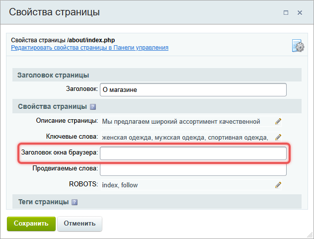{width=632px height=481px}

Если поле отсутствует, добавьте свойство в настройках модуля Управление структурой.

1. В административном разделе откройте страницу *Настройки > Настройки продукта > Настройки модулей > Управление структурой*.

2. На вкладке Настройки перейдите к параметру Типы свойств.

3. В поле Тип введите `title`, а в поле Название — понятное название, например, Заголовок окна браузера.

   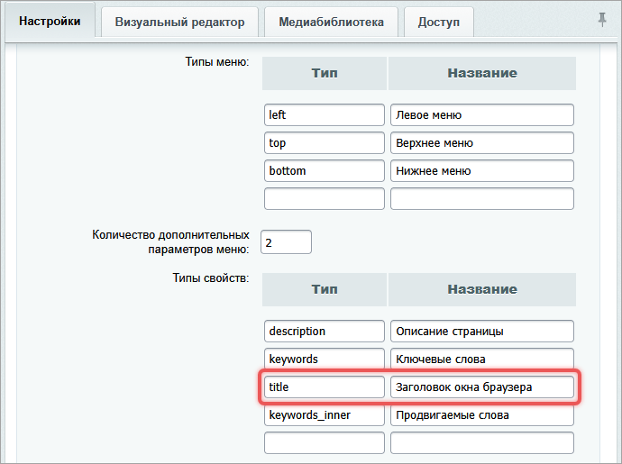{width=690px height=515px}

## Краткий справочник по методам

Методы `SetTitle()` и `SetPageProperty()` только задают значения. За вывод заголовков отвечает шаблон сайта — разработчик размещает `ShowTitle()` в нужных местах.

#|
|| **Что нужно сделать** | **Что использовать** | **Где выводится** ||
|| Установить или изменить основной заголовок страницы | `SetTitle()` | В `<h1>`, если шаблон выводит `ShowTitle(false)` ||
|| Установить или изменить заголовок окна браузера | `SetPageProperty('title', ...)` или свойство `title` в интерфейсе | В `<title>`, если шаблон выводит `ShowTitle()` ||
|| Получить основной заголовок в коде | `GetTitle()` | В коде страницы или компонента ||
|| Получить заголовок с учетом свойства `title` | `GetTitle('title')` | В коде страницы или компонента ||
|| Вывести заголовок с учетом свойства `title` | `ShowTitle()` или `ShowTitle('title')` | Обычно в `<title>` ||
|| Вывести только основной заголовок | `ShowTitle(false)` | Обычно в `<h1>` ||
|#

## Задать основной заголовок страницы

Основной заголовок можно задать через интерфейс или в коде страницы.



В некоторых компонентах, например, в `bitrix:news` или `bitrix:catalog` есть параметр *Устанавливать заголовок страницы*. Если флаг установлен, система заменит заголовок на название элемента или раздела.



### Указать заголовок через публичный интерфейс

1. Откройте страницу на просмотр в публичном разделе сайта.

2. Нажмите *Изменить страницу > Заголовок и свойства страницы* на административной панели.

   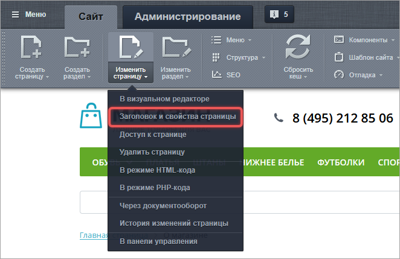{width=662px height=429px}

3. Заполните поле Заголовок и сохраните страницу.

   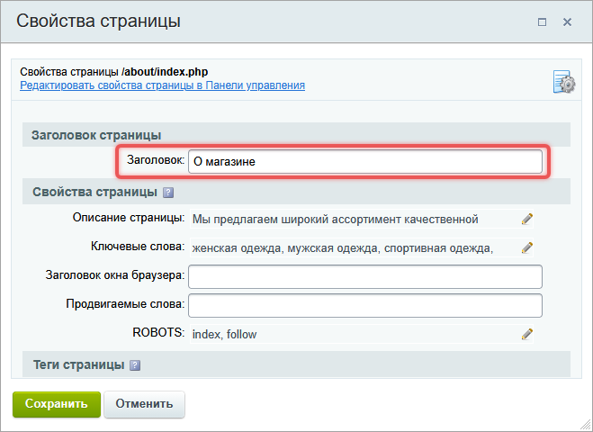{width=659px height=480px}

### Указать заголовок через административный интерфейс

1. Откройте *Контент > Структура сайта > Файлы и папки*.

2. Перейдите в папку, в которой размещена страница.

3. Нажмите *Редактировать как HTML* или *Редактировать как текст* в меню нужной страницы.

   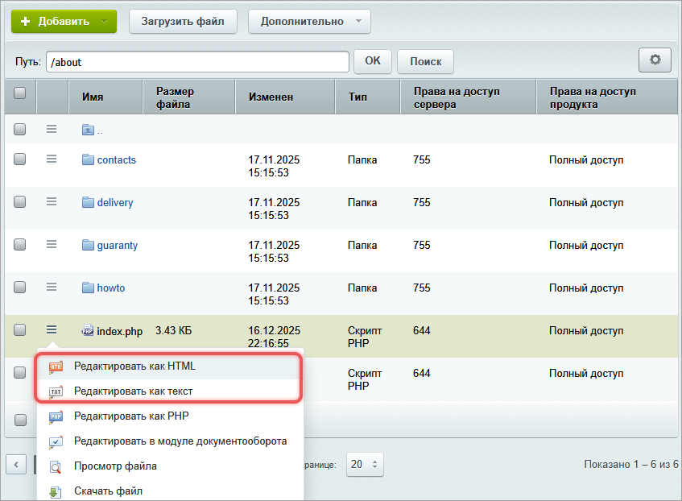{width=847px height=622px}

4. Заполните поле Заголовок страницы и сохраните изменения.

   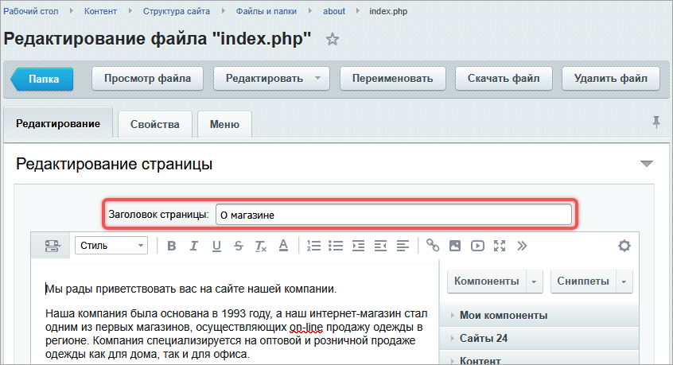{width=846px height=459px}

### Установить заголовок через API

Чтобы установить основной заголовок, вызовите метод `SetTitle()` в самом начале кода страницы.

```php
<?php
require($_SERVER["DOCUMENT_ROOT"] . "/bitrix/header.php");
$APPLICATION->SetTitle("О магазине");
?>
```

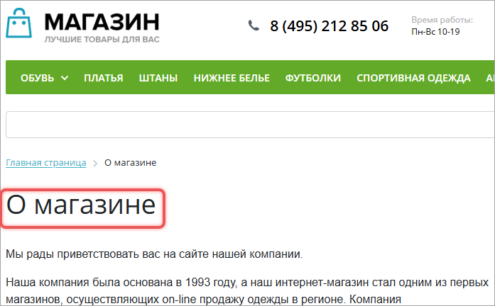{width=697px height=432px}

## Задать отдельный заголовок для окна браузера

По умолчанию текст вкладки браузера совпадает с основным заголовком. Чтобы они различались, задайте свойство `title` — Заголовок окна браузера.

### Заполнить свойство через публичный интерфейс

1. Откройте страницу на просмотр в публичном разделе сайта.

2. Нажмите *Изменить страницу > Заголовок и свойства страницы* на административной панели.

3. Заполните свойство *Заголовок окна браузера* и сохраните страницу.

   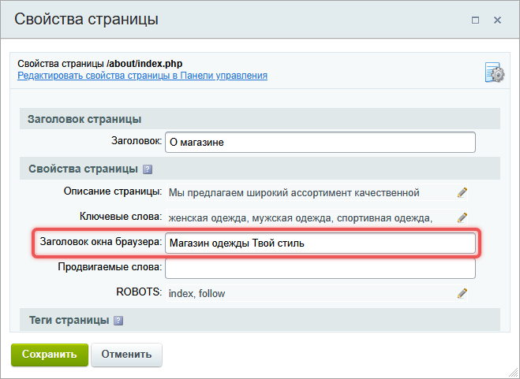{width=659px height=481px}

### Заполнить свойство через административный интерфейс

1. Откройте *Контент > Структура сайта > Файлы и папки*.

2. Перейдите в папку, в которой размещена страница.

3. Нажмите *Редактировать как HTML* или *Редактировать как текст* в меню нужной страницы.

4. Заполните свойство *Заголовок окна браузера* и сохраните страницу.

   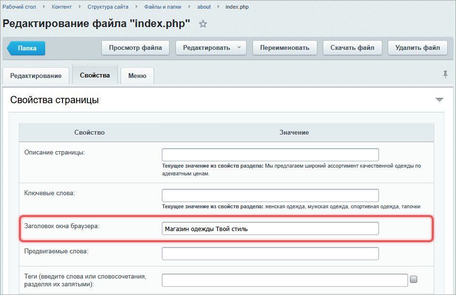{width=941px height=609px}

### Установить через API

Добавьте вызов метода `SetPageProperty` в код страницы.

```php
<?php
require($_SERVER["DOCUMENT_ROOT"] . "/bitrix/header.php");
$APPLICATION->SetTitle("О магазине");
$APPLICATION->SetPageProperty("title", "Магазин одежды Твой стиль");
?>
```

В этом примере на странице останется заголовок `О магазине`, а браузер покажет `Магазин одежды Твой стиль`.

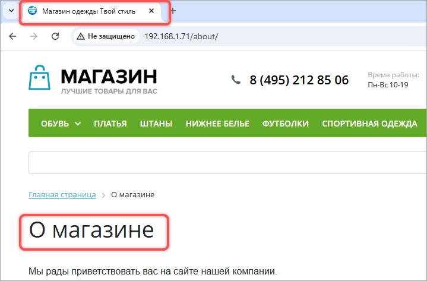{width=719px height=473px}

## Получить основной заголовок через API

Чтобы получить основной заголовок страницы в коде, используйте `GetTitle()` без аргументов. Такой вызов эквивалентен `GetTitle(false)` и возвращает значение, которое установлено через `SetTitle()`.

```php
<?php
$title = $APPLICATION->GetTitle();
?>
```

В `GetTitle()` можно передать имя свойства. Метод использует значение этого свойства как заголовок, когда оно заполнено. Например, `GetTitle('title')` вернет значение свойства `title`.

```php
<?php
$titleProperty = $APPLICATION->GetTitle('title');
?>
```

Если свойство `title` задано, вызов `GetTitle('title')` вернет то же значение, что и `GetProperty('title')`.

```php
<?php
$titleProperty = $APPLICATION->GetProperty('title');
?>
```

Второй аргумент `GetTitle()` управляет HTML-тегами в результате. Если передать `true`, метод удалит HTML-теги из заголовка.

```php
<?php
$title = $APPLICATION->GetTitle(false, true);
?>
```

## Вывести заголовки в шаблоне сайта

Шаблон сайта определяет, где показать основной заголовок и где вывести свойство `title`. Разместите код вывода в файле шаблона `header.php`. Например, в `bitrix/templates/.default/header.php` или в шаблоне, который подключен к текущему сайту.



Подробнее про структуру шаблона сайта читайте в статье [Шаблоны сайтов](./site-templates.md).



### Основной заголовок в теге H1

Для основного заголовка страницы используйте `ShowTitle(false)`.

```php
<h1><?php $APPLICATION->ShowTitle(false); ?></h1>
```

Параметр `false` исключает обращение к свойству `title`. В HTML-теге `<h1>` всегда будет выводиться основной заголовок страницы, который задан через `SetTitle()`.

Разницу показывает пример:

```php
<?php
$APPLICATION->SetTitle("Заголовок страницы");
$APPLICATION->SetPageProperty("title", "Альтернативный заголовок");
?>

<?php $APPLICATION->ShowTitle(); ?>   <br>
<?php $APPLICATION->ShowTitle(false); ?>
```

Первый вызов `ShowTitle()` выведет `Альтернативный заголовок`, а второй — `Заголовок страницы`.

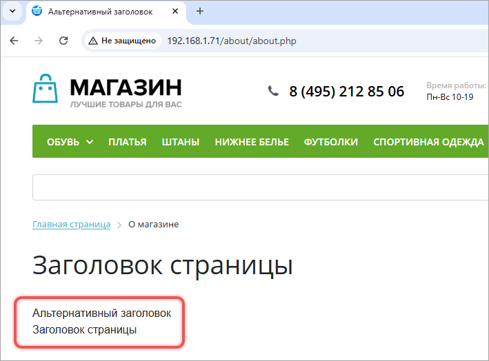{width=709px height=524px}

### Заголовок окна браузера в теге title

Для заголовка окна браузера разместите `ShowTitle()` внутри тега `<title>` в области `<head>`.

```php
<head>
    <title><?php $APPLICATION->ShowTitle(); ?></title>
</head>
```

Метод сначала проверяет свойство `title`. Если свойство заполнено, в `<title>` попадает его значение. Если свойство не задано, выводится основной заголовок из `SetTitle()`.

Вызов `ShowTitle('title')` работает так же, как `ShowTitle()` без аргументов. Сначала учитывает свойство `title`, затем основной заголовок страницы. Вызов `ShowTitle(false)` использует только основной заголовок.

## Учесть приоритет заголовков

Если на странице несколько методов или компонентов устанавливают заголовок, система использует значение из последнего вызова. Последнее значение всегда перезаписывает предыдущее.

При этом важно различать основной заголовок и свойство страницы `title`:

-  последний `SetTitle()` меняет основной заголовок страницы,

-  последний `SetPageProperty('title', ...)` меняет заголовок окна браузера,

-  если в шаблоне для `<h1>` используется `ShowTitle(false)`, свойство `title` не влияет на основной заголовок страницы,

-  если в шаблоне для `<h1>` используется `ShowTitle()` без параметра, значение свойства `title` может заменить основной заголовок.

Пример:

```php
<?php
require($_SERVER["DOCUMENT_ROOT"] . "/bitrix/header.php");

$APPLICATION->SetTitle("Заголовок страницы 1");

// Свойство title не переопределит заголовок в <h1>, если в шаблоне ShowTitle(false)
$APPLICATION->SetPageProperty("title", "Альтернативный заголовок 1");

// Изменит основной заголовок
$APPLICATION->SetTitle("Заголовок страницы 2");

// Заменит заголовок окна браузера
$APPLICATION->SetPageProperty("title", "Альтернативный заголовок 2");

require($_SERVER["DOCUMENT_ROOT"] . "/bitrix/footer.php");
?>
```

При стандартной настройке шаблона в `<h1>` отобразится `Заголовок страницы 2`, а во вкладке браузера — `Альтернативный заголовок 2`.

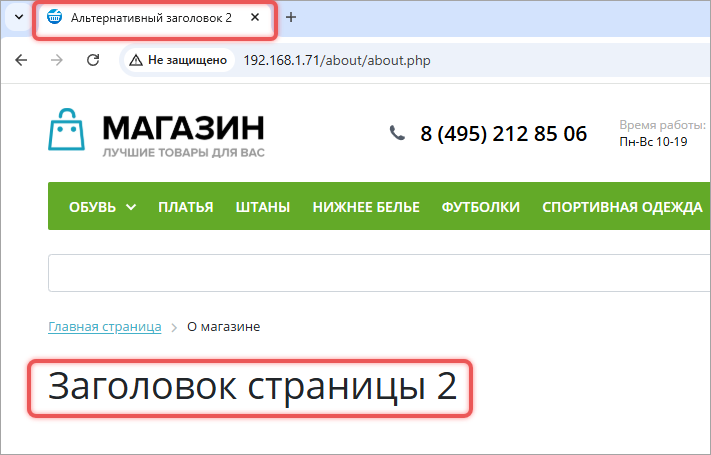{width=711px height=455px}
