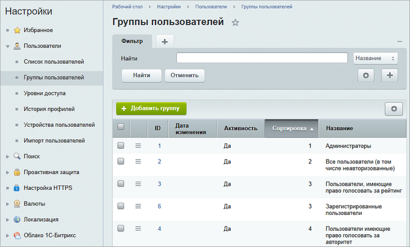
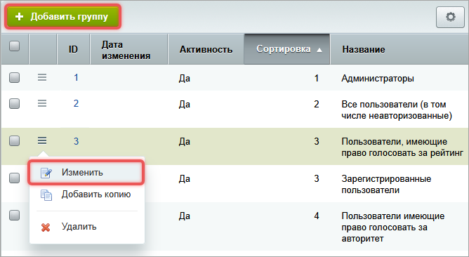
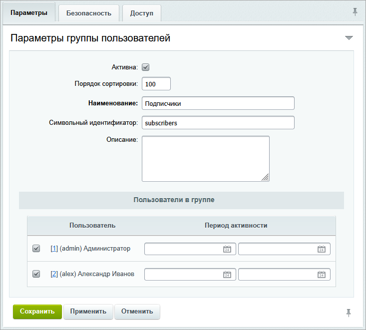
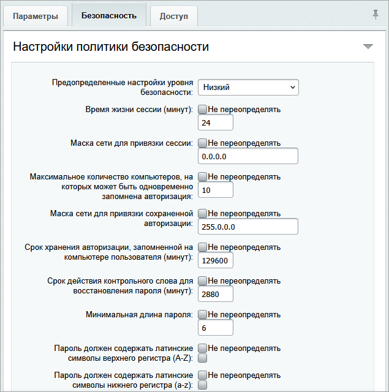
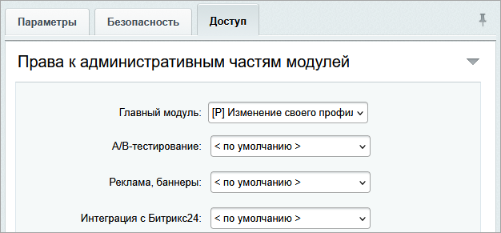
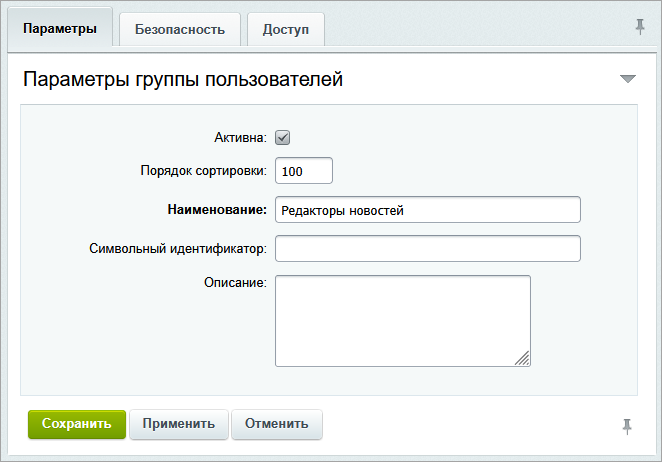
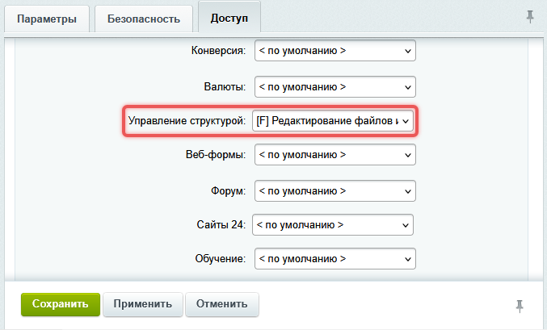
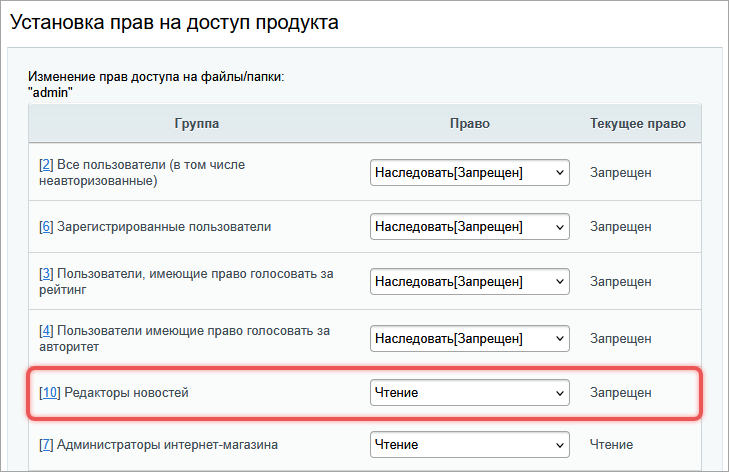
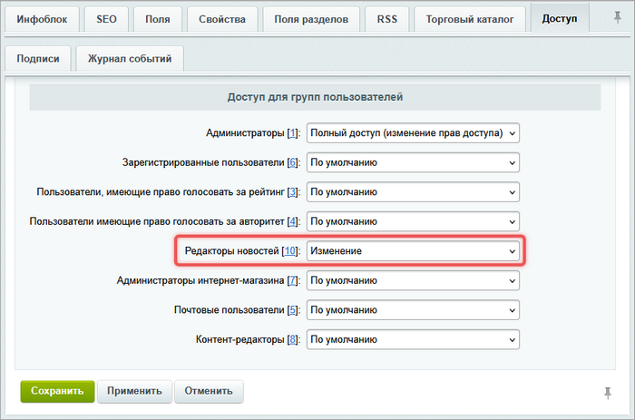
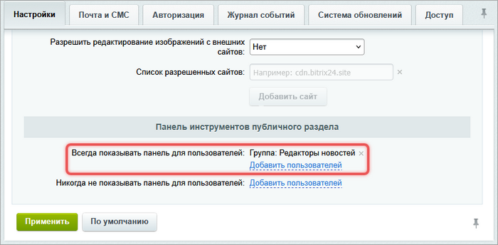

Группы объединяют учетные записи по правам доступа и настройкам безопасности. Пользователь может входить в одну или несколько групп.

Список групп пользователей расположен в административном разделе на странице *Настройки > Пользователи > Группы пользователей*. Адрес страницы -- `/bitrix/admin/group_admin.php`.

{width=700px height=423px}

## Системные группы

В системе есть две группы по умолчанию. Их нельзя удалить.

1. Все пользователи (в том числе неавторизованные) -- в группу входят все посетители сайта.

2. Администраторы -- участники этой группы получают полный доступ к управлению сайтом.



При установке коробочной версии Битрикс24 создается группа Сотрудники. Она обеспечивает всех пользователей портала минимальными правами. Не удаляйте группу, это нарушит работу портала.



## Как создать или изменить группу

1. Откройте страницу *Настройки > Пользователи > Группы пользователей.*

2. Выберите действие:

   -  создать новую группу -- нажмите Добавить группу,

   -  изменить существующую -- выберите группу и нажмите Изменить или дважды кликните по строке.

   {width=668px height=366px}

3. Заполните форму редактирования. Она состоит из трех вкладок: Параметры, Безопасность, Доступ.

### Вкладка Параметры

На вкладке Параметры задайте основные настройки группы.

-  Активна -- отметьте опцию, чтобы группа работала. Если группа неактивна, все ее пользователи будут заблокированы.

-  Порядок сортировки -- введите число, которое определяет положение группы в общем списке. Чем меньше число, тем выше группа в списке.

-  Наименование -- укажите название группы, например `Подписчики`. Обязательный параметр.

-  Символьный идентификатор -- задайте уникальный код группы латинскими буквами.

-  Описание -- опишите назначение группы.

-  Пользователи в группе -- отметьте участников группы. Можно указать период активности: даты начала и окончания участия. По истечении срока пользователь будет автоматически исключен, но его учетная запись останется в системе.

   

   Секция *Пользователи в группе* доступна, если на сервере зарегистрировано не более 25 пользователей. Если пользователей больше, добавляйте их в группы на странице *Настройки > Пользователи > Список пользователей* или в форме редактирования пользователя.

   

{width=733px height=661px}

### Вкладка Безопасность

На вкладке настройте параметры безопасности для пользователей группы.

-  Предопределенные настройки уровня безопасности -- выберите один из уровней безопасности. Система автоматически заполнит поля значениями для выбранного уровня. Доступны уровни:

   -  Не переопределять -- администратор настраивает безопасность вручную. Чтобы изменить отдельный параметр, снимите флаг *Не переопределять* рядом с нужным полем. Для администраторов применяется повышенный уровень.

   -  Низкий -- уровень с минимальными ограничениями: длительный срок сессии, слабые требования к паролю.

   -  Обычный -- умеренные требования: средняя сложность пароля, разумный срок сессии.

   -  Повышенный -- максимальная защита: сложный пароль, короткий срок сессии.

   

   Уровни безопасности изменить нельзя.

   

-  Время жизни сессии (минут) -- укажите длительность сессии в минутах.

-  Маска сети для привязки сессии -- ограничьте доступ к данным сессии по IP.

-  Максимальное количество компьютеров, на которых может быть одновременно запомнена авторизация -- укажите, на сколько устройств можно сохранить авторизацию. Для администраторов рекомендуется `1`.

-  Маска сети для привязки сохраненной авторизации -- установите маску сети, чтобы предотвратить использование файлов хеша.

-  Срок хранения авторизации, запомненной на компьютере пользователя (минут) -- введите количество минут, на которое сохранять авторизацию.

-  Срок действия контрольного слова для восстановления пароля (минут) -- настройте правило хранения контрольного слова. Чтобы уменьшить риски взлома, рекомендуется использовать меньше суток, для администраторов -- несколько часов.

-  Минимальная длина пароля -- укажите минимальное количество символов в пароле.

-  Пароль должен содержать --  отметьте нужные условия:

   -  латинские символы верхнего регистра (A-Z),

   -  латинские символы нижнего регистра (a-z),

   -  цифры (0–9),

   -  специальные символы (,.\<>/?;:'"\[\]\{}\\|\`\~!@#\$%^&\*()-\_+=).

-  Проверять пароль по базе слабых паролей -- отметьте опцию, чтобы включить защиту от слабых паролей.

-  Требовать смены пароля при несоответствии текущей политике -- отметьте опцию, чтобы система запрашивала смену слабого пароля.

-  Требовать смены пароля через указанное количество дней -- укажите количество дней, через которое нужно сменить пароль. Значение `0` -- не запрашивать смену пароля. Параметр используется для одноразовых паролей при двухэтапной авторизации.

-  Минимальное количество дней до смены пароля -- ограничьте частую смену пароля. Возможные значения:

   -  `0` -- ограничение отключено,

   -  больше `0` -- минимальный интервал между сменами.

-  Проверять на совпадение указанное количество последних паролей -- отметьте опцию, чтобы предотвратить повторное использование старых паролей. Параметр используется для одноразовых паролей при двухэтапной авторизации.

-  Количество попыток ввода пароля до показа CAPTCHA -- укажите, через сколько попыток показывать CAPTCHA. Параметр затрудняет попытку взлома пароля через перебор. Показ CAPTCHA отключен, если указано значение `0` или установлен флаг *Не переопределять*.

-  Количество попыток ввода пароля до временной блокировки пользователя -- задайте количество попыток авторизации, которое может сделать пользователь до его блокировки.

-  Период блокировки пользователя -- укажите количество минут, на которое заблокировать пользователя после неудачных попыток входа.

{width=635px height=640px}

### Вкладка Доступ

Настройте уровни прав доступа к модулям системы.

{width=626px height=291px}



Подробнее читайте в статье [Права доступа](./../security/access-control).



## Пример создания группы

Создайте группу Редакторы новостей, чтобы ее участники добавляли, редактировали и удаляли новости.

1. Откройте страницу *Настройки > Пользователи > Группы пользователей.*

2. Нажмите Добавить группу.

3. На вкладке Параметры укажите наименование Редакторы новостей.

   {width=662px height=462px}

4. На вкладке *Доступ* для модуля Управление структурой установите уровень доступа *Редактирование файлов и папок*.

   {width=677px height=409px}

5. Добавьте пользователей в группу.

6. Откройте страницу *Контент > Структура сайта > Файлы и папки > bitrix*.

7. В меню папки `admin` выберите Права на доступ продукта.

8. Для группы Редакторы новостей установите право Чтение.

   {width=729px height=472px}

9. Откройте форму редактирования инфоблока Новости.

10. На вкладке Доступ для группы Редакторы новостей установите право Изменение.

    {width=700px height=463px}

11. Откройте страницу *Настройки > Настройки продукта > Настройки модулей > Главный модуль.*

12. В список *Всегда показывать панель для пользователей* добавьте группу Редакторы новостей.

    {width=700px height=344px}

В результате пользователи группы Редакторы новостей могут работать с новостями из административного и публичного разделов сайта.

## API групп пользователей

Для работы с группами пользователей предназначены:

-  класс `CGroup`  -- для базовых операций: создать, изменить или удалить группу,

-  классы `\Bitrix\Main\GroupTable` и `\Bitrix\Main\UserGroupTable`-- для выборки данных,

-  метод `CUser::getPolicy` и класс `Bitrix\Main\Authentication\Policy\RulesCollection` -- для работы с настройками безопасности группы.

### Создать группу

```php
$group = new CGroup();
$newGroupId = $group->Add([
    'ACTIVE'      => 'Y',
    'NAME'        => 'Имя группы',
    'DESCRIPTION' => 'Описание группы',
    'STRING_ID'   => 'GROUP_1',
    'USER_ID'     => [128, 134], // Опционально: добавить пользователей при создании
]);

if ($newGroupId > 0)
{
    echo "Группа добавлена, ID: " . $newGroupId;
}
else
{
    echo "Ошибка: " . $group->LAST_ERROR;
}
```

### Обновить группу

```php
$group = new CGroup();
$group->Update($groupId, [
    'ACTIVE'       => 'N',
    'NAME'         => 'Новое имя группы',
    'DESCRIPTION'  => 'Новое Описание группы',
    'USER_ID'      => [1, 2],
]);
if ($group->LAST_ERROR)
{
    echo "Ошибка: " . $group->LAST_ERROR;
}
```

### Удалить группу

```php
/**
 * @var \CMain $APPLICATION
 */

$isDeleted = CGroup::Delete($groupId);
if (!$isDeleted)
{
    $error = (string)$APPLICATION->GetException();
    if (empty($error))
    {
        $error = "Не пытайтесь удалить группы 1 или 2, они служебные";
    }
}
```