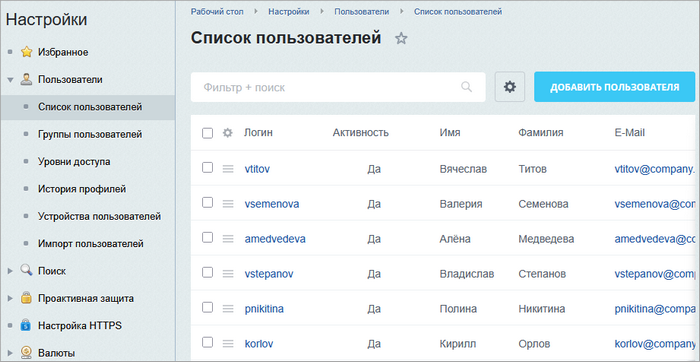
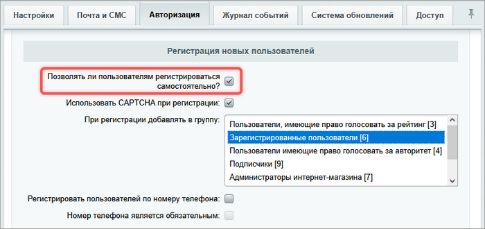
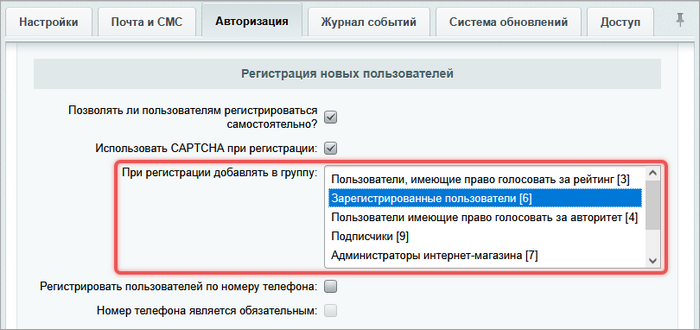
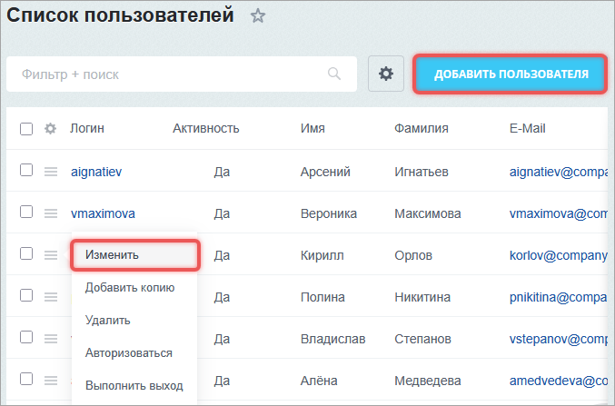
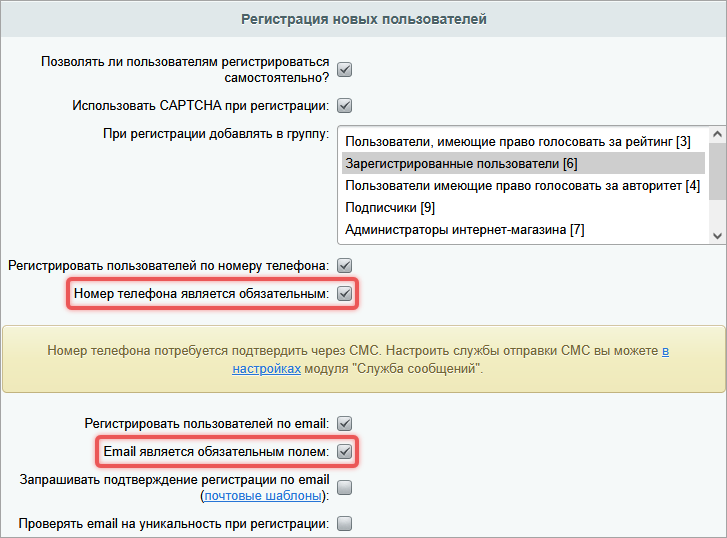
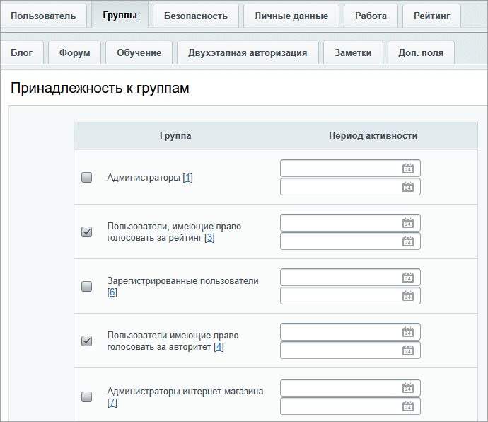

Пользователь -- это учетная запись с логином, паролем и определенными правами доступа.

Список всех пользователей находится в административном разделе на странице *Настройки > Пользователи > Список пользователей*. Адрес страницы -- `/bitrix/admin/user_admin.php`.

{width=700px height=362px}

## Самостоятельная регистрация пользователей

В системе можно разрешить самостоятельную регистрацию пользователей.

1. Откройте настройки Главного модуля -- *Настройки > Настройки продукта > Настройки модулей Главный модуль*.

2. На вкладке Авторизация установите флаг *Позволять ли пользователям регистрироваться самостоятельно*.

{width=700px height=330px}

При регистрации пользователь получит логин и пароль. Система автоматически добавит пользователя в группу, которая указана в параметре *При регистрации добавлять в группу*. Позже администратор может изменить список групп для пользователя вручную.

{width=700px height=330px}

## Как добавить или изменить пользователя

1. Откройте страницу *Настройки > Пользователи > Список пользователей.*

2. Выберите действие:

   -  создать нового пользователя -- нажмите Добавить пользователя,

   -  изменить существующего -- найдите пользователя и нажмите Изменить или дважды кликните по строке.

   {width=677px height=447px}

3. Заполните форму редактирования.

#### Вкладки формы редактирования

Каждая вкладка отвечает за определенный блок настроек учетной записи.

**Пользователь.** Настройка общих параметров пользователя: имени, логина, пароля, адреса электронной почты. Обязательные поля: Логин, Новый пароль, Подтверждение нового пароля.

Номер телефона и email можно сделать обязательными для регистрации, если в настройках Главного модуля отметить опции *Номер телефона является обязательным* и *Email является обязательным полем*.

{width=727px height=538px}

**Группы.** Выбор групп для привязки. Отметьте группы и укажите период времени, на который осуществляется привязка.



Подробнее о группах читайте в статье [Группы пользователей](./user-groups).



{width=690px height=596px}

**Безопасность.** Информация по настройкам безопасности для пользователя.



Если пользователь входит в несколько групп, для каждого параметра безопасности применяется самое строгое значение из всех его групп.



**Личные данные.** Дополнительная информация о пользователе.

**Работа.** Данные о компании, должности, контактах.

**Рейтинг.** Установка начального значения рейтинга.

**Блог.** Настройки профиля пользователя в блогах: псевдоним, интересы, аватар.

**Форум.** Параметры профиля пользователя для форума: подпись, аватар.

**Обучение.** Настройка отображения профиля в модуле Обучение.

**Двухэтапная авторизация.** Подключение мобильного приложения или брелка одноразовых паролей, если в системе включен механизм двухэтапной авторизации.



Подробнее читайте в статье [Двухэтапная авторизация](./../security/two-factor-auth).



**Заметки.** Поле для комментария.

**Доп. поля.** Пользовательские поля для объекта `USER`. Новое поле можно создать по ссылке *Добавить пользовательское поле*.



Подробнее читайте в статье [Пользовательские поля](./userfields).



## Как настроить права доступа

Права доступа к разделам и инструментам сайта настраиваются [на уровне группы](./user-groups). Пользователь может состоять в нескольких группах. Если права различаются, пользователь получает наиболее высокий уровень прав.

**Пример.** Пользователь состоит в группах Сотрудники и Маркетинг.

-  Сотрудники -- разрешен просмотр портала, кроме раздела Документы.

-  Маркетинг -- полный доступ к разделу Документы.

В результате пользователь имеет доступ к порталу и к разделу Документы.



Подробнее читайте в статье [Права доступа](./../security/access-control).



## API пользователей

Для работы с пользователями используйте классы:

-  `\Bitrix\Main\UserTable` --для выборки данных,

-  `CUser` -- для базовых операций: создать, изменить или удалить пользователя,

-  `\Bitrix\Main\Engine\CurrentUser` -- для доступа к данным текущего пользователя из действий контроллера.

Когда работаете с классом `CUser`, при запуске страницы автоматически создается объект `$USER`. Он содержит данные о текущем пользователе.

```php
global $USER;

/**
 * @var \CUser $USER
 */

$userId = $USER->GetID();
```

### Добавить нового пользователя

```php
$user = new CUser();
$id = $user->Add([
    "NAME" => "Иван",
    "LAST_NAME" => "Петров",
    "EMAIL" => "ipetrov@example.ru",
    "LOGIN" => "ipetrov",
    "LID" => "s1",
    "ACTIVE" => "Y",
    "GROUP_ID" => [2, 3],
    "PASSWORD" => "strong_password_123",
    "CONFIRM_PASSWORD" => "strong_password_123",
]);

if ($id > 0)
{
    echo "Пользователь добавлен, ID: " . $id;
}
else
{
    echo "Ошибка: " . $user->LAST_ERROR;
}
```

### Изменить данные пользователя

```php
$user = new CUser();
$user->Update($ID, [
    "EMAIL" => "ivan.petrov@example.ru",
    "GROUP_ID" => [2, 3, 5],
]);

if ($user->LAST_ERROR) {
    echo "Ошибка: " . $user->LAST_ERROR;
}
```

### Выполнить авторизацию пользователя

```php
global $USER;

/**
 * @var \CUser $USER
 */

$authResult = $USER->Login($login, $password, "Y");
if ($authResult === true)
{
    // Пользователь успешно авторизовался
    LocalRedirect("/personal/");
}
else {
    // Вывести ошибку
    ShowMessage($authResult['MESSAGE']);
}
```

Код выполняет проверку пароля и возможность входа.

```php
global $USER;

/**
 * @var \CUser $USER
 */

$USER->Authorize($userId);
```

Код выполняет авторизацию под пользователем с идентификатором `$userId`.

### Проверить авторизацию

```php
// пример с контроллером
class Example extends Controller
{
    public function saveAction(CurrentUser $user)
   {
       $isAuthorized = $user->getId() > 0;
   }
}
```

```php
global $USER;

/**
 * @var \CUser $USER
 */

if ($USER->IsAuthorized())
{
    echo "Пользователь авторизован";
}
else
{
    echo "Пользователь не авторизован";
}
```

### Получить данные текущего пользователя

```php
class Example extends Controller
{
    #[Authentication]
    public function saveAction(CurrentUser $user)
   {
        $login = $user->getLogin();
        $name  = $user->getName();

        // ...
    }
}
```

### Выбрать пользователей по фильтру

Код выводит всех пользователей с именем `Иван` и фамилией `Петров`.

```php
use Bitrix\Main\UserTable;

$users = UserTable::query()
    ->setSelect(['ID', 'NAME', 'LAST_NAME', 'EMAIL'])
    ->where('ACTIVE')
    ->where('NAME', 'Иван')
    ->whereLike('LAST_NAME', 'Петров%')
    ->setOrder(['LAST_LOGIN' => 'DESC'])
    ->fetchCollection()
;
/**
 * @var \Bitrix\Main\EO_User $user
 */
foreach ($users as $user)
{
    $user->getName();
    $user->getEmail();
}
```

### Выбрать пользователей группы по фильтру

Код выводит список активных пользователей администраторов (группу с `ID=1`).

```php
$users = \Bitrix\Main\UserTable::query()
    ->setSelect(['ID', 'NAME', 'EMAIL'])
    ->setFilter([
        'GROUPS.GROUP_ID' => 1,
        '=ACTIVE' => 'Y'
    ])
    ->fetchCollection()
;
/**
 * @var \Bitrix\Main\EO_User $user
 */
foreach ($users as $user)
{
    # code...
}
```

### Выбрать группы пользователя

```php
$users = \Bitrix\Main\UserTable::query()
    ->setSelect(['ID', 'GROUPS.GROUP'])
    ->setLimit(1)
    ->fetchCollection()
;
/**
 * @var \Bitrix\Main\EO_User $user
 */
foreach ($users as $user)
{
    foreach ($user->getGroups() as $userGroup)
    {
        $activeTo = $userGroup->getDateActiveTo();
        $activeFrom = $userGroup->getDateActiveFrom();

        $group = $userGroup->getGroup();
        $groupName = $group->getName();

        # code...
    }
}
```

### Состоит ли пользователь в группе

В примере проверяется, состоит ли текущий пользователь в группе с `ID=3`.

```php
global $USER;

/**
 * @var \CUser $USER
 */

$groupId = 1;
if (in_array($groupId, $USER->GetUserGroupArray()))
{
    # code...
}
```

### Удалить пользователя

```php
/**
 * @var \CMain $APPLICATION
 */

$isDeleted = CUser::Delete($userId);
if (!$isDeleted)
{
    $error = (string)$APPLICATION->GetException();
    if (empty($error))
    {
        $error = "Пользователь не найден";
    }
}
```