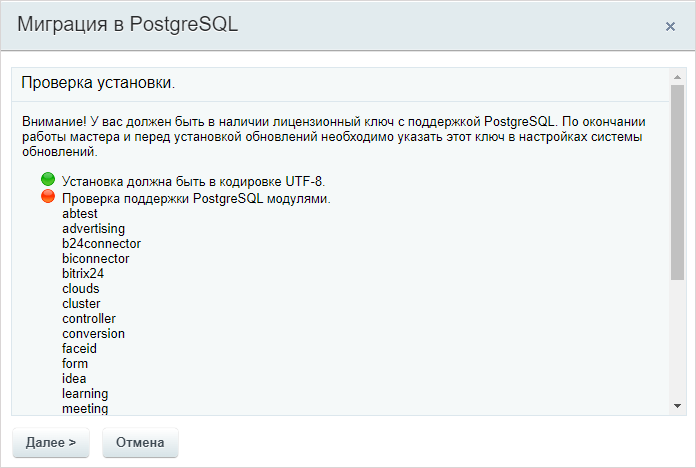
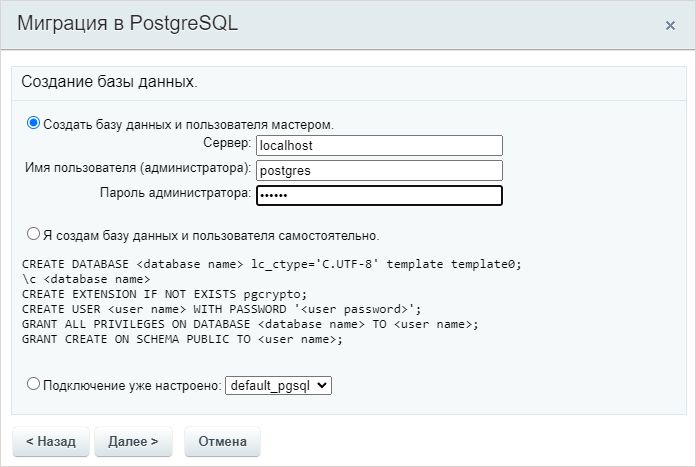
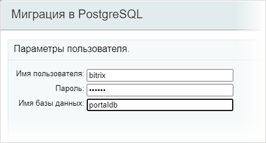
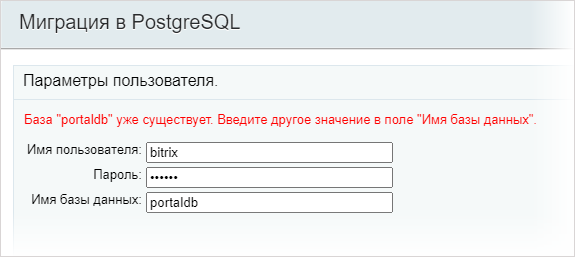
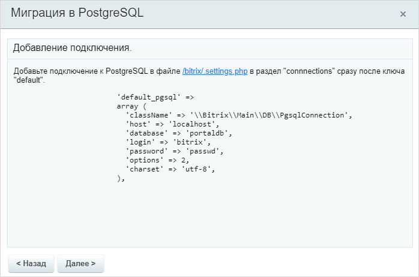
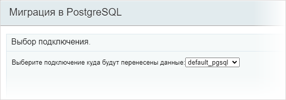
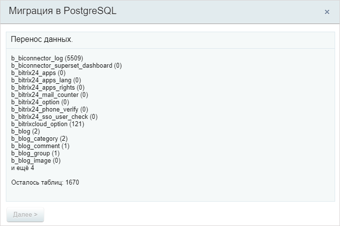
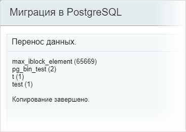
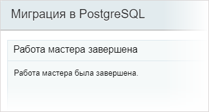

Перед переносом данных из MySQL в [PostgreSQL](https://postgrespro.ru) подготовьте окружение, проверьте ограничения и выберите способ миграции: через мастер или командную строку.

PostgreSQL поддерживается в лицензии Битрикс24 [Энтерпрайз для Постгрес](https://www.1c-bitrix.ru/buy/products/b24.php) и в лицензии *1С-Битрикс: Управление сайтом* [Энтерпрайз для Постгрес](https://www.1c-bitrix.ru/buy/products/cms.php).

## Подготовить окружение

Перед миграцией установите и настройте PostgreSQL. Используйте BitrixVM или инструкцию по настройке окружения для вашей операционной системы. Для локального окружения на macOS используйте статью [Установка PostgreSQL на macOS](./installation-macos.md).

### BitrixVM

BitrixVM версии 9.0.8 и выше включает PostgreSQL 13.x по умолчанию. Обновите PostgreSQL до версии 15.x или 16.x через [меню виртуальной машины](https://dev.1c-bitrix.ru/learning/course/index.php?COURSE_ID=37&LESSON_ID=29266).

### macOS

Установите PostgreSQL [по официальной инструкции](https://www.postgresql.org/download/macosx/).

### Другие операционные системы

Инструкции по установке и настройке PostgreSQL для Debian, Альт СП, Альт и РОСА доступны в главе [Установка БУС/КП на другие окружения](https://dev.1c-bitrix.ru/learning/course/index.php?COURSE_ID=135&CHAPTER_ID=020866).

## Как выполнить миграцию

- Перейдите на лицензию «Энтерпрайз для Постгрес». После приобретения перехода вы получите:
  - купон для перехода на лицензию «Энтерпрайз для Постгрес». Активируйте купон после тестирования миграции,
  - ключ для тестирования миграции работающего сайта на отдельной установке продукта. Максимальный срок тестирования — 6 месяцев с момента приобретения лицензии.
- Перед миграцией установите и обновите модуль *Монитор производительности* до версии 24.0.0.
- Проект должен использовать кодировку UTF-8. Подробнее в статье [Кодировка](../../advanced/encoding.md#conversion-wizard).
- На время миграции закройте доступ к сайту для посетителей, чтобы избежать изменений в данных в процессе копирования.

### Важно учитывать

- Вернуться на MySQL после миграции, тестирования и запуска PostgreSQL в рабочем контуре можно только вручную.
- Если на проекте используются модули из маркетплейса, [проверьте их совместимость](./compatible-code.md) с новой СУБД или обратитесь к разработчикам модуля.
- Кастомизированный проект может потребовать доработок для новой СУБД. Перед миграцией проверьте измененный код.

### Выбрать способ миграции

1. Вручную с консоли сервера.
2. С помощью мастера, встроенного в продукт.

Не все модули поддерживают PostgreSQL. После миграции функции таких модулей будут отключены. Список отключаемых модулей отображается на первом шаге мастера конвертации.

При ручной миграции получите список из командной строки.

```bash
for mysql in `ls bitrix/modules/*/install/mysql/install.sql bitrix/modules/*/install/db/mysql/install.sql`;
do
pgsql=`echo $mysql|sed 's#/mysql/#/pgsql/#'`;
test -e $pgsql || echo $pgsql
done
```

### Порядок действий для миграции

1. Проверьте перенос на тестовом контуре:
   - сделайте [резервную копию](../../advanced/backup.md) проекта,
   - [разверните](https://dev.1c-bitrix.ru/learning/course/index.php?COURSE_ID=135&CHAPTER_ID=02014) резервную копию на тестовом контуре,
   - обновите тестовую версию проекта до последних версий продукта,
   - [проверьте кастомизированный сайт](./compatible-code.md) на совместимость доработок с СУБД PostgreSQL,
   - поменяйте лицензионный ключ на ключ для тестирования миграции, предоставленный после приобретения перехода на лицензию «Энтерпрайз для Постгрес»,
   - выполните тестовую миграцию выбранным способом,
   - проверьте проект.
2. Обновите рабочую версию проекта до последних версий продукта.
3. Активируйте купон перехода на новую версию продукта в продуктивном контуре.
4. Выполните миграцию.
5. Проверьте проект.

## Миграция через мастер

Перейдите в административный раздел *Рабочий стол > Настройки > Настройки продукта > Список мастеров* и запустите мастер *Миграция в PostgreSQL* `bitrix:perfon.pgsql`. Начнется пошаговый процесс миграции.

1. Сначала мастер проверяет минимальные требования. Модули, не поддерживающие PostgreSQL, нужно деинсталлировать на странице «Управление модулями» в разделе *Рабочий стол > Настройки > Настройки продукта > Модули*.

   

2. На втором шаге выберите уже созданную базу или создайте новую базу с помощью мастера. Укажите логин и пароль администратора, чтобы создать пользователя и базу данных.

   

3. Задайте имя пользователя, пароль и базу данных для миграции.

   

   Если возникнет ошибка, система ее отобразит. Исправьте ошибку и нажмите «Далее».

   

4. После создания базы данных и проверки подключения добавьте подключение в файл [`/bitrix/.settings.php`](../../framework/settings.md). Откройте ссылку в окне мастера, чтобы отредактировать файл в новой вкладке. В файле должен появиться блок подключения:

   

   ```php
    'connections' => 
    array (
        'value' => 
        array (
            'default' => 
            array (
            'className' => '\\Bitrix\\Main\\DB\\MysqliConnection',
            'host' => 'localhost',
            'database' => 'cp',
            'login' => 'cp',
            'password' => 'cp',
            'options' => 2,
            'charset' => 'utf8',
            'include_after_connected' => '',
        ),
        'default_pgsql' =>
        array (
            'className' => '\\Bitrix\\Main\\DB\\PgsqlConnection',
            'host' => 'localhost',
            'database' => 'portal',
            'login' => 'bitrix',
            'password' => 'passwd',
            'options' => 2,
            'charset' => 'utf-8',
            'include_after_connected' => '',
        ),
    ),
    'readonly' => true,
    ),
   ```
5. На следующем шаге мастера выберите добавленное подключение.

   

   На время копирования таблиц из MySQL сайт будет закрыт от посетителей. Данные не должны изменяться во время копирования, иначе целостность базы данных может быть нарушена.

   

   После этого начнется процесс копирования данных.

   

6. Дождитесь сообщения об окончании копирования. Время выполнения процесса зависит от объема данных, мощности сервера и настроек базы данных.

   

7. Отредактируйте `.settings.php`: переименуйте подключения в разделе `connections`.
   - `default` в `default_mysql`.
   - `default_pgsql` в `default`.

Миграция через мастер завершена.





Сайт для доступа откроется автоматически после завершения миграции.



## Миграция через командную строку

1. Создайте пользователя и базу PostgreSQL.

   ```bash
   root@cp:/var/www/html# sudo -u postgres createuser bitrix 
   root@cp:/var/www/html# sudo -u postgres psql -c 'grant create on schema public to "bitrix"' 
   GRANT 
   root@cp:/var/www/html# sudo -u postgres createdb portaldb --owner bitrix --lc-ctype C.UTF-8 --template=template0 
   root@cp:/var/www/html# sudo -u postgres psql -d portaldb -c 'CREATE EXTENSION IF NOT EXISTS pgcrypto' 
   CREATE EXTENSION 
   root@cp:/var/www/html# sudo -u postgres psql -d portaldb -c 'ALTER USER "bitrix" WITH PASSWORD '\''passwd'\'''  
   ALTER ROLE
   ```
2. Остановите cron и веб-сервер, чтобы данные не изменялись во время переноса.

   ```bash
   root@cp:/var/www/html# systemctl stop cron 
   root@cp:/var/www/html# systemctl stop apache2 
   root@cp:/var/www/html# systemctl stop php-fpm 
   root@cp:/var/www/html# systemctl stop nginx
   ```
3. Сделайте дамп базы данных MySQL.

   ```bash
   root@cp:/var/www/html# mysqldump --opt --skip-extended-insert --hex-blob -u root portaldb > /tmp/mysql_dump.sql
   ```
4. Сконвертируйте его в PostgreSQL.

   ```bash
   root@cp:/var/www/html# php -f bitrix/modules/perfmon/tools/mysql_to_pgsql.php -- --mysqldump=/tmp/mysql_dump.sql > /tmp/pgsql_dump.sql
   ```
5. Убедитесь, что все получилось.

   ```bash
   root@cp:/var/www/html# less /tmp/pgsql_dump.sql
   ```
6. Добавьте дамп в PostgreSQL.

   ```bash
   root@cp:/var/www/html# sudo -u www-data psql -b -q --user bitrix -d portaldb -f /tmp/pgsql_dump.sql
   ```
7. Добавьте дополнительные функции в PostgreSQL.

   ```bash
   root@cp:/var/www/html# grep -v 'ALTER TABLE b_group' bitrix/modules/main/install/pgsql/install_add.sql | sudo -u www-data psql -b -q --user bitrix -d portaldb
   ```
8. Отредактируйте файл [.settings.php](../../framework/settings.md).

   ```text
   root@cp:/var/www/html# vi bitrix/.settings.php
   'connections' =>
    array (
        'value' => 
        array (
            'default' =>
            array (
                'className' => '\\Bitrix\\Main\\DB\\PgsqlConnection',
                'host' => 'localhost',
                'database' => 'portaldb',
                'login' => 'bitrix',
                'password' => 'passwd',
                'options' => 2,
                'charset' => 'utf-8',
                'include_after_connected' => '',
            ),
        ),
   ```
9. Удалите модули без поддержки PostgreSQL.

   ```text
   root@cp:/home/max/sites/php74cp1251.cp/html# for mysql in `ls bitrix/modules/*/install/mysql/install.sql bitrix/modules/*/install/db/mysql/install.sql`; 
   do 
   pgsql=`echo $mysql|sed 's#/mysql/#/pgsql/#'`; 
   test -e $pgsql || sudo -u postgres psql -d portaldb -a -c "delete from b_module where id='`echo $pgsql|cut -d '/' -f 3`'"; 
   done 
    
   delete from b_module where id='abtest'
   DELETE 0
   delete from b_module where id='advertising'
   DELETE 0
   delete from b_module where id='b24connector'
   DELETE 0
   delete from b_module where id='biconnector'
   DELETE 0
   ........
   ```
10. Запустите сервисы.

    ```bash
    root@cp:/var/www/html# systemctl start cron
    root@cp:/var/www/html# systemctl start apache2
    root@cp:/var/www/html# systemctl start php-fpm
    root@cp:/var/www/html# systemctl start nginx
    ```
