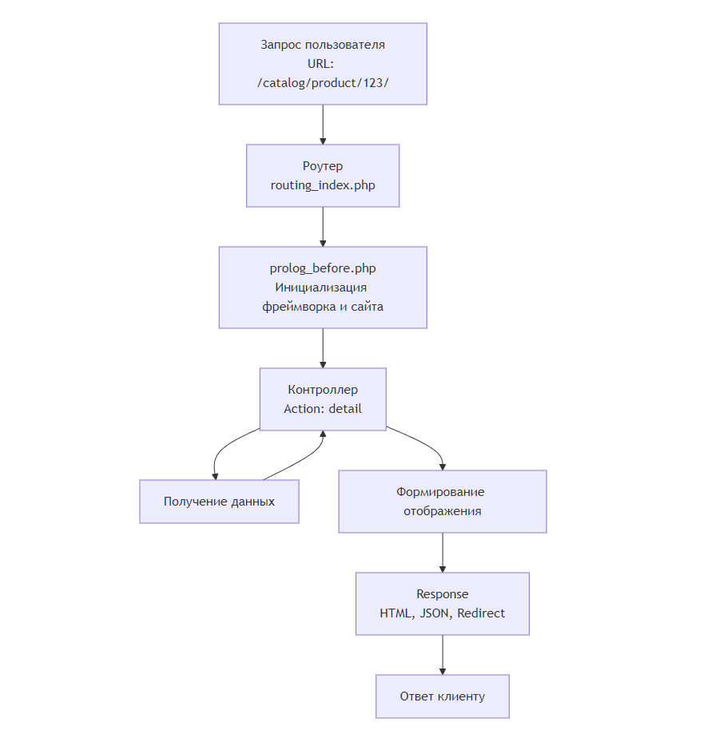
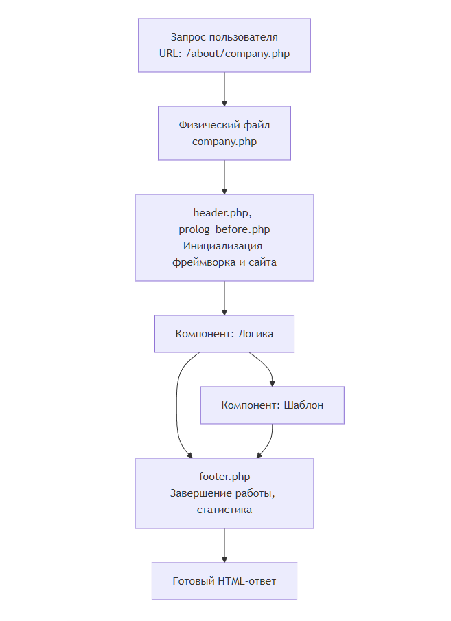

Bitrix Framework состоит из независимых модулей, которые работают друг с другом как единое приложение. Такая архитектура называется модульным монолитом.

## Основные принципы архитектуры

**Преемственность**. Новые версии поддерживают совместимость с предыдущими решениями и технологиями. Это позволяет обновлять сайты, созданные на предыдущих версиях.

**Единый подход работы**. Все продукты и версии продуктов работают по одним принципам.

**Безопасность**. Система обеспечивает защиту для сайтов любой сложности.

**Масштабируемость**. Нет ограничений на развитие проектов по мере роста контента, сервисов и числа пользователей.

**Производительность**. Скорость работы зависит от настроек системы и возможностей хостинга.

**Развитие системы.**  Разработчики могут создавать свои модули, компоненты и решения.

## MVC в Bitrix Framework

Проекты строятся по схеме MVC:

-  M (Model) -- данные и бизнес-логика,

-  V (View) -- шаблоны сайтов, страниц и компонентов,

-  C (Controller) -- контроллеры, то есть обработка запросов.

### Дополнительные элементы системы

-  Компоненты -- виджеты с логикой на PHP и шаблонами.

-  Расширения -- виджеты для фронтенда на JavaScript.

-  Агенты -- задачи, которые выполняются по расписанию.

-  Префильтры и постфильтры -- обработчики до и после действий контроллера.

-  События и обработчики -- связь бизнес-логики внутри модулей и между ними.

-  Сервисы -- классы для сложной бизнес-логики по шаблону проектирования Сервисный слой.

## Схема структуры и связей модулей

<iframe src="/pages/framework/architecture.svg" width="100%" height="341px" style="border:none;"></iframe>

## Обработка запроса

Bitrix Framework поддерживает два подхода к обработке запросов.

1. Контроллеры -- современный подход, который следует принципам MVC. Подход разделяет логику, шаблоны и данные, что упрощает разработку и поддержку. Рекомендуется для новых проектов.

2. Физические страницы -- устаревший подход. Логика, верстка и работа с данными часто находятся в одном файле, что усложняет развитие проекта. Используйте его только для поддержки старых решений.

### Контроллеры

Запрос пользователя поступает на единую точку входа -- роутер. Система сама определяет, какой контроллер его обработает.

Порядок обработки запроса:

1. **Роутинг**. Запрос попадает в файл `/bitrix/routing_index.php`. Он анализирует URL и находит подходящий контроллер по правилам маршрутизации.

2. **Подготовка**. Система подключает `prolog_before.php` для инициализации фреймворка и сайта. Например, запускает автозагрузку классов, задает базовые константы, определяет язык.

3. **Действие контроллера**. Запускается нужный метод `action` контроллера. Он работает с моделью, получает данные и готовит результат.

4. **Формирование ответа**. Контроллер возвращает объект `Response`, например, HTML, JSON или редирект. Система отправляет ответ клиенту.

{width=885px height=919px}

### Физические страницы

Запрос пользователя поступает на PHP-файл в структуре сайта, например, `/about/company.php`.

Порядок обработки запроса:

1. **Запуск страницы.** Сервер выполняет код файла `/about/company.php`.

2. **Подключение заголовка**. Файл `/about/company.php` содержит `/bitrix/header.php`, который подключает:

   -  `prolog_before.php` для инициализации фреймворка и сайта,

   -  шаблон сайта, если он настроен в системе.

3. **Генерация контента**. Код страницы вызывает компоненты через `$APPLICATION->IncludeComponent()`. Компонент выполняет логику, затем подключает шаблон с HTML-разметкой и логикой отображения.

4. **Подключение подвала**. В конце файл `/about/company.php` подключает `/bitrix/footer.php`. Внутри он завершает работу и выполняет общие действия, например, подсчет статистики.

{width=657px height=904px}
