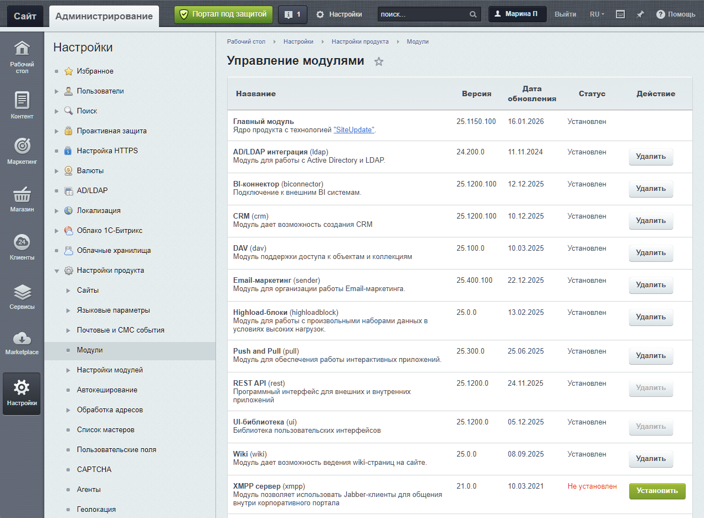
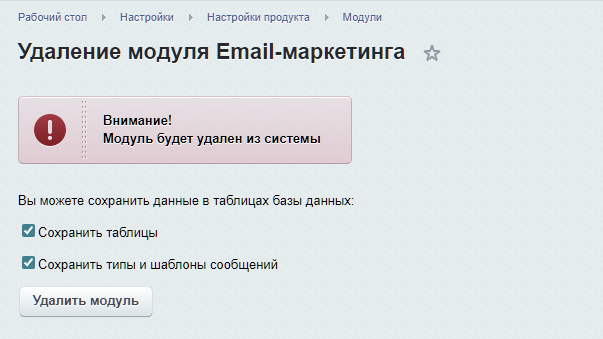
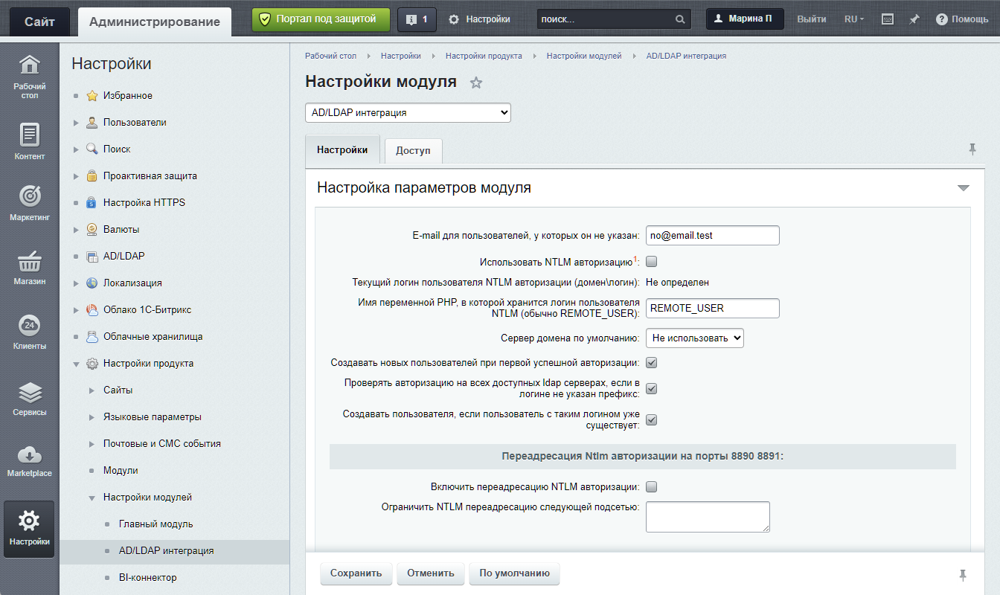
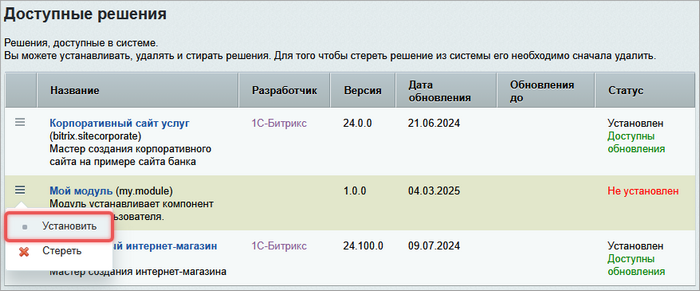
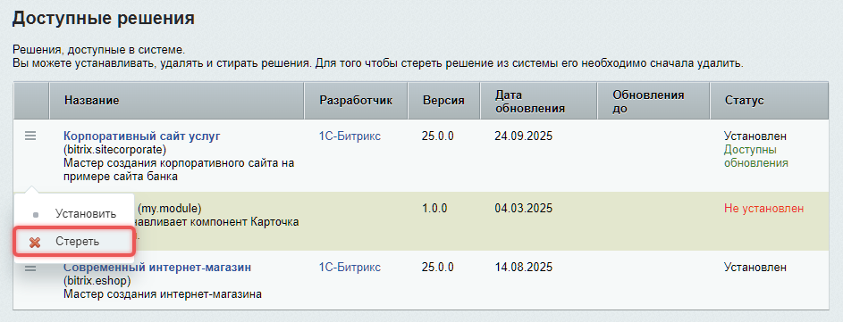
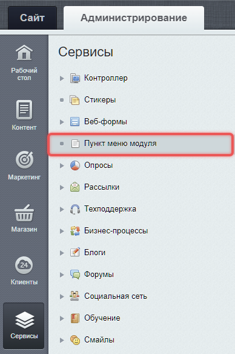

Bitrix Framework состоит из модулей. Модуль — это автономный компонент системы, который реализует определенную функциональность.

Модуль включает в себя:

-  бизнес-логику,

-  административный интерфейс,

-  компоненты для публичной части,

-  обработчики событий

-  другие элементы, необходимые для работы отдельной части сайта.

Некоторые модули расширяют функционал уже установленных модулей. Например, модуль *Торговый каталог* добавляет функции работы с товарами к модулю *Информационные блоки*.



[Пример создания модуля](./../get-started/create-module.md)



## Управление модулями в системе

Все модули отображаются в административной части на странице *Настройки > Настройки продукта > Модули*.

{width=1271px height=936px}

Неиспользуемый модуль можно удалить. Для некоторых модулей перед удалением система может предложить сохранить таблицы базы данных и другие данные модуля.

{width=603px height=339px}

### Настройки модуля

У модуля может быть собственная страница настроек в административном разделе *Настройки > Настройки продукта > Настройки модулей > \[Название конкретного модуля\]*. Наличие страницы настроек зависит от файла `options.php` в структуре модуля.

{width=1344px height=800px}

## Подключить модуль

Чтобы использовать функции модуля, подключите его методом `Loader::includeModule()`. Метод возвращает `true`, если модуль подключен, и `false`, если модуль не установлен или его не удалось подключить.

```php
<?php
use Bitrix\Main\Loader;

if (Loader::includeModule('module_name'))
{
    // В этой области доступны классы и функции модуля
}
```

Если без модуля нельзя продолжать выполнение сценария, используйте `Loader::requireModule()`. Метод выбрасывает исключение `Bitrix\Main\LoaderException`, если модуль не подключен. Если исключение не обработано, выполнение сценария прерывается.

```php
<?php
use Bitrix\Main\Loader;

Loader::requireModule('module_name');

// После успешного подключения доступны классы и функции модуля
```

## Структура файлов модуля

Стандартные модули располагаются в `/bitrix/modules/ID_модуля/`. Пользовательские модули обязательно размещать в `/local/modules/`.



Подробнее о папке Local в статье [Структура директорий](./../get-started/directory-structure.md)



-  `/admin/` — файлы для административного раздела.

   -  `menu.php` — пункты меню для административного раздела.

-  `/install/` — файлы для установки и удаления.

   -  `/admin/` — вспомогательные скрипты для установки.

   -  `/js/` — JavaScript файлы модуля.

   -  `/db/` — SQL-скрипты для создания таблиц для разных баз данных, например, `/mysql/` или `/pgsql/`.

   -  `/images/` — изображения модуля.

   -  `/components/` — компоненты.

   -  `/panel/` — стили для административной панели.

   -  `index.php` — главный файл с описанием модуля.

   -  `version.php` — файл с версией модуля.

-  `/lang/код_языка/` — языковые файлы.

-  `/lib/` — классы ядра D7 ORM.

-  `.settings.php` — настройки модуля.

-  `include.php` — подключение основных классов и функций модуля.

-  `default_option.php` — настройки модуля по умолчанию.

-  `options.php` — страница настроек модуля.

-  `prolog.php` — подключается в начале всех админских скриптов модуля.

В Bitrix Framework существуют две архитектуры ядра: классическое ядро и ядро D7. В старых модулях, которые используют классы API классического ядра может быть папка `/classes/`.

-  `/general/` — классы для любой базы данных.

-  `/mysql/`, `/mssql/`, `/oracle/`, `/pgsql/` — классы для конкретных СУБД.



Модуль может содержать классы классического ядра и D7 одновременно, но в новом коде рекомендуется использовать только D7.



### Классы модуля

Система подключает классы ядра автоматически при соблюдении правил.

1. **Имена файлов и классов**. Имя файла должно точно соответствовать имени класса. Например, файл `/lib/MyService.php` содержит класс `MyService`.

2. **Пространства имен**. Класс должен находиться в пространстве имен, которое соответствует идентификатору модуля. Для модуля `company.module` пространство имен будет `Company\Module`.

   ```php
   <?php
   // Файл: /local/modules/company.module/lib/myservice.php
   namespace Company\Module;
   
   class MyService
   {
       // Логика класса
   }
   ```

3. **Подключение модуля**. Перед использованием классов модуль нужно подключить.

   ```php
   <?php
   use Bitrix\Main\Loader;
   
   if (Loader::includeModule('company.module'))
   {
       // Теперь можно использовать классы модуля
       $service = new \Company\Module\MyService();
   }
   ```

   Если код не должен работать без модуля, подключите модуль методом `Loader::requireModule()`.

   ```php
   <?php
   use Bitrix\Main\Loader;

   Loader::requireModule('company.module');

   $service = new \Company\Module\MyService();
   ```

## Описание модуля

Чтобы зарегистрировать модуль в системе, создайте файл описания `index.php` в папке `/local/modules/ID_модуля/install/`. Файл должен содержать класс — наследник базового класса `CModule` из Главного модуля. Имя класса должно совпадать с `ID` модуля с заменой точки на нижнее подчеркивание.

**Пример.** Для модуля `company.module` имя класса будет `company_module`.

В классе нужно задать обязательные свойства.

-  `MODULE_ID` — идентификатор модуля.

-  `MODULE_VERSION` — версия модуля в формате `XX.XX.XX`.

-  `MODULE_VERSION_DATE` — дата выпуска версии в формате `ГГГГ-ММ-ДД ЧЧ:МИ:СС`.

-  `MODULE_NAME` — название модуля.

-  `MODULE_DESCRIPTION` — описание модуля.

-  `MODULE_GROUP_RIGHTS` — значение `Y` указывает, что модуль использует собственные права доступа.

А также описать логику для двух обязательных методов.

-  `DoInstall()` — устанавливает модуль.

-  `DoUninstall()` — удаляет модуль.

Пример файла `/install/index.php`.

```php
<?php

use Bitrix\Main\Localization\Loc;

Loc::loadMessages(__FILE__);

/**
 * Класс для модуля `vendor.modulename`, вместо точки `.` используется прочерк `_`
 */
class vendor_modulename extends CModule
{
    public $MODULE_ID = 'vendor.modulename';

    public function __construct()
    {
        $this->MODULE_NAME = Loc::getMessage('VENDOR_MODULENAME_MODULE_NAME');
        $this->MODULE_DESCRIPTION = Loc::getMessage('VENDOR_MODULENAME_MODULE_DESC');

        include(__DIR__ . '/version.php');

        if (isset($arModuleVersion['VERSION']))
        {
            $this->MODULE_VERSION = $arModuleVersion['VERSION'];
            $this->MODULE_VERSION_DATE = $arModuleVersion['VERSION_DATE'] ?? null;
        }
    }

    public function DoInstall()
    {
        $this->InstallDB();
        $this->InstallFiles();

        RegisterModule($this->MODULE_ID);
    }

    public function DoUninstall()
    {
        $this->UnInstallDB();
        $this->UnInstallFiles();

        UnRegisterModule($this->MODULE_ID);
    }

    /**
     * Выполнение SQL-скрипта для создания таблиц модуля
     *
     * @return void
     */
    public function InstallDB()
    {
        global $APPLICATION;

        $db = \Bitrix\Main\Application::getConnection();
        $errors = $db->executeSqlBatch(
            __DIR__ . '/' . $db->getType() . '/install.sql'
        );
        if (!empty($errors))
        {
            $APPLICATION->ThrowException(
                join(',', $errors)
            );
        }
    }

    /**
     * Выполнение SQL-скрипта для удаления таблицы модуля
     *
     * @return void
     */
    public function UnInstallDB()
    {
        $db = \Bitrix\Main\Application::getConnection();
        $errors = $db->executeSqlBatch(
            __DIR__ . '/' . $db->getType() . '/uninstall.sql'
        );
        if (!empty($errors))
        {
            $APPLICATION->ThrowException(
                join(',', $errors)
            );
        }
    }

    /**
     * Копирование файлов из папки модуля, в папку /local/ для корректной работы
     * Это необходимо из-за того что сама директория модуля недоступна для веб-сервера, а файлы должны быть доступны для корректной работы
     *
     * @return void
     */
    public function InstallFiles()
    {
        CopyDirFiles(__DIR__ . '/js', $_SERVER['DOCUMENT_ROOT'] . '/local/js', true);
        CopyDirFiles(__DIR__ . '/admin', $_SERVER['DOCUMENT_ROOT'] . '/local/admin', true);
        CopyDirFiles(__DIR__ . '/themes', $_SERVER['DOCUMENT_ROOT'] . '/local/themes', true, true);
        CopyDirFiles(__DIR__ . '/components', $_SERVER['DOCUMENT_ROOT'] . '/local/components', true, true);
    }

    /**
     * Удаление файлов модуля из папки /local
     *
     * @return void
     */
    public function UnInstallFiles()
    {
        DeleteDirFiles(__DIR__ . '/js', $_SERVER['DOCUMENT_ROOT'] . '/local/js');
        DeleteDirFiles(__DIR__ . '/admin', $_SERVER['DOCUMENT_ROOT'] . '/local/admin');
        DeleteDirFiles(__DIR__ . '/themes', $_SERVER['DOCUMENT_ROOT'] . '/local/themes');
        DeleteDirFiles(__DIR__ . '/components', $_SERVER['DOCUMENT_ROOT'] . '/local/components');
    }
}
```

### Информация о версии

Файл `install/version.php` содержит информацию о версии модуля. Он подключается в конструкторе класса модуля.

```php
<?php
$arModuleVersion = [
    'VERSION' => '1.0.0',
    'VERSION_DATE' => '2023-12-01 12:00:00',
];
```

## Установить модуль

Перед установкой разместите файлы модуля в папке `/local/modules/ваш.модуль/`. Затем перейдите в раздел *Marketplace > Установленные решения* и нажмите *Установить* для нужного модуля.

{width=700px height=291px}

Во время установки система запускает метод `DoInstall()` из класса модуля. Метод выполняет действия, описанные в классе модуля. Например в классе модуля можно описать:

-  регистрацию модуля в системе с помощью `RegisterModule()`,

-  создание необходимых таблиц в базе данных,

-  регистрацию обработчиков событий.

## Удалить модуль

Чтобы удалить модуль, нажмите *Стереть* на странице *Установленные решения* и подтвердите действие.

{width=943px height=361px}

При удалении система запускает метод `DoUninstall()`. Метод выполняет действия, описанные в классе модуля. Например в классе модуля можно описать:

-  снятие регистрации модуля через `UnRegisterModule()`,

-  удаление таблиц модуля из базы данных, если нет подтверждения о сохранении данных.



Из системы нельзя удалить:

-  главный модуль `main`,

-  управление структурой `fileman`,

-  UI-библиотеку `ui`,

-  проактивную защиту `security`.



## Параметры модуля

Параметры модулей система хранит в базе данных. Параметры можно задавать через административный интерфейс или в коде.

### Файлы параметров

-  `default_option.php` — содержит значения параметров по умолчанию. Система использует эти значения, если параметр еще не сохранен в базе данных.

```php
<?php
// Файл: /local/modules/company.module/default_option.php
$company_module_default_option = [
    'API_KEY' => '',
    'CACHE_TIME' => 3600,
    'ENABLE_LOG' => 'Y'
];
```

-  `options.php` — создает интерфейс для редактирования параметров в административной части. В этом файле размещают HTML-форму и логику сохранения настроек.

### Работа с параметрами через код

Для работы с параметрами модуля используют класс `\Bitrix\Main\Config\Option`.

#### Получить параметр

Метод `get($moduleId, $name, $default = "", $siteId = false)` получает значение параметра.

```php
$apiKey = \Bitrix\Main\Config\Option::get('my.module', 'api_key', 'default_value');
```

-  `$moduleId` — идентификатор модуля.

-  `$name` — имя параметра.

-  `$default` — значение по умолчанию, возвращается если параметр не найден.

-  `$siteId` — идентификатор сайта. Если `false`, используется текущий сайт. Не обязательный параметр.

#### Установить значение параметра

Метод `set($moduleId, $name, $value = "", $siteId = "")` устанавливает значение параметра `$value`. Если параметр существует — обновляет его, иначе создает новый.

```php
\Bitrix\Main\Config\Option::set('my.module', 'api_key', 'new_secret_key');
\Bitrix\Main\Config\Option::set('my.module', 'cache_time', 3600, 's1'); // Для конкретного сайта
```

После сохранения вызываются события `OnAfterSetOption` и `OnAfterSetOption_[имя_параметра]`. Если `$siteId` не указан, параметр считается общим для всех сайтов.

#### Удалить параметр

Метод `delete($moduleId, array $filter = [])` удаляет параметр по фильтру. Фильтр может содержать ключи:

-  `name` — имя параметра для удаления.

-  `site_id` — идентификатор сайта. Если не указан, удаляются параметры для всех сайтов.

```php
// Удалить конкретный параметр для всех сайтов
\Bitrix\Main\Config\Option::delete('my.module', ['name' => 'api_key']);

// Удалить параметр только для конкретного сайта
\Bitrix\Main\Config\Option::delete('my.module', [
    'name' => 'api_key', 
    'site_id' => 's1'
]);

// Удалить все параметры модуля
\Bitrix\Main\Config\Option::delete('my.module');
```

## Административные скрипты

Административные скрипты — это PHP-файлы, которые создают интерфейс управления модулем в административной панели. Эти файлы размещаются в папке `/bitrix/modules/ID_модуля/admin/`.

Файлы в папке `/admin/` недоступны для прямого вызова через браузер, поэтому для каждого административного скрипта нужно сделать скрипт-обертку в папке `/bitrix/admin/`.

-  Основной скрипт — `/bitrix/modules/company.module/admin/my_page.php`.

-  Обертка — `/bitrix/admin/company_module_my_page.php`.

```php
<?php
require_once($_SERVER['DOCUMENT_ROOT'] . '/bitrix/modules/company.module/admin/my_page.php');
```

При установке модуля обертки автоматически копируются из `/install/admin/` в `/bitrix/admin/`.

Для корректной работы административных скриптов в каждом из них необходимо определить константу `ADMIN_MODULE_NAME`, которая служит идентификатором модуля в административном интерфейсе. Константа связывает административные скрипты модуля с системой.

-  Определяет, какому модулю принадлежит административная страница.

-  Участвует в формировании ссылки на страницу настроек модуля по кнопке *Настройки* на административной панели.

-  Помогает в проверках прав доступа к разделам модуля.

Константа задается в файле `prolog.php` модуля.

```php
<?php
define('ADMIN_MODULE_NAME', 'mail');
```

Затем ее нужно подключать в начале каждого административного скрипта.

```php
<?php
require_once($_SERVER['DOCUMENT_ROOT'] . '/bitrix/modules/company.module/prolog.php');
```

## Языковые файлы

Языковые файлы хранят текстовые сообщения модуля для разных языков. Они располагаются в папке `/bitrix/modules/ID_модуля/lang/ID_языка/`, повторяя структуру основных файлов.

**Пример.** Структура языковых файлов для `/bitrix/modules/company.module/admin/my_page.php`.

```
/local/modules/company.module/
├── admin/
│   └── my_page.php
├── lang/
    ├── en/
    │   └── admin/
    │       └── my_page.php
    └── ru/
        └── admin/
            └── my_page.php
```

Содержимое языкового файла — это массив `$MESS`. Система автоматически ищет и загружает фразы из него.

```php
<?php
$MESS['COMPANY_MODULE_PAGE_TITLE'] = 'Управление модулем компании';
$MESS['COMPANY_MODULE_SAVE_BTN'] = 'Сохранить';
```

### Подключить языковые файлы

Подключить языковой файл можно функцией `Loc::loadMessages()`.

```php
<?php
// В файле: /local/modules/company.module/admin/my_page.php
use Bitrix\Main\Localization\Loc;

Loc::loadMessages(__FILE__);

echo Loc::getMessage('COMPANY_MODULE_PAGE_TITLE');
```

Параметр `__FILE__` передает путь к текущему файлу, что позволяет системе найти соответствующий языковой файл в папке `lang`.



Подробнее в статье [Локализация](./../rasshirennye-znaniya/regionalnye-nastroyki-culture.md).



## Административное меню

Модуль может добавлять пункты в административное меню. Для этого создайте файл `menu.php` в папке модуля с массивом пунктов меню.

```php
<?php
// Файл: /bitrix/modules/company.module/admin/menu.php

use Bitrix\Main\Localization\Loc;

Loc::loadMessages(__FILE__);

return [
    [
        'parent_menu' => 'global_menu_services',
        'sort' => 100,
        'text' => Loc::getMessage('COMPANY_MODULE_MENU_TITLE'),
        'title' => Loc::getMessage('COMPANY_MODULE_MENU_TOOLTIP'),
        'url' => 'company_module_my_page.php?lang=' . LANGUAGE_ID,
        'icon' => 'company_menu_icon',
        'items_id' => 'menu_company_module',
    ]
];
```

Система автоматически собирает пункты меню из всех установленных модулей.

{width=388px height=584px}

## Взаимодействие модулей

Модули могут взаимодействовать между собой несколькими способами.

1. **Прямое взаимодействие.** После подключения модуля функции и методы классов вызываются напрямую.

   ```php
   <?php
   if (\Bitrix\Main\Loader::includeModule('iblock'))
   {
       $iblockId = CIBlock::GetList([], ['CODE' => 'news'])->Fetch()['ID'];
       // Дальнейшая работа с инфоблоком
   }
   ```

   Если модуль обязателен для дальнейшей работы, используйте `Loader::requireModule()`.

   ```php
   <?php
   \Bitrix\Main\Loader::requireModule('iblock');

   $iblockId = CIBlock::GetList([], ['CODE' => 'news'])->Fetch()['ID'];
   // Дальнейшая работа с инфоблоком
   ```

2. **Взаимодействие через события.** Модуль генерирует событие в определенный момент. Другие модули могут подписаться на это событие и выполнить свой код.

   

   Подробнее в статье [События](./../framework/events.md).

   

3. **Взаимодействие через конфигурацию модулей.** Один модуль может читать настройки другого модуля через `\Bitrix\Main\Config\Option` и менять свое поведение на основе этих значений. Такой способ подходит для интеграций, где модуль не вызывает чужие классы напрямую, а использует сохраненные параметры: включение функции, идентификатор инфоблока, код сайта или другие настройки.

   ```php
   <?php
   $iblockId = \Bitrix\Main\Config\Option::get('company.module', 'news_iblock_id');

   if ($iblockId > 0 && \Bitrix\Main\Loader::includeModule('iblock'))
   {
       // Работа с инфоблоком, который выбран в настройках модуля
   }
   ```
