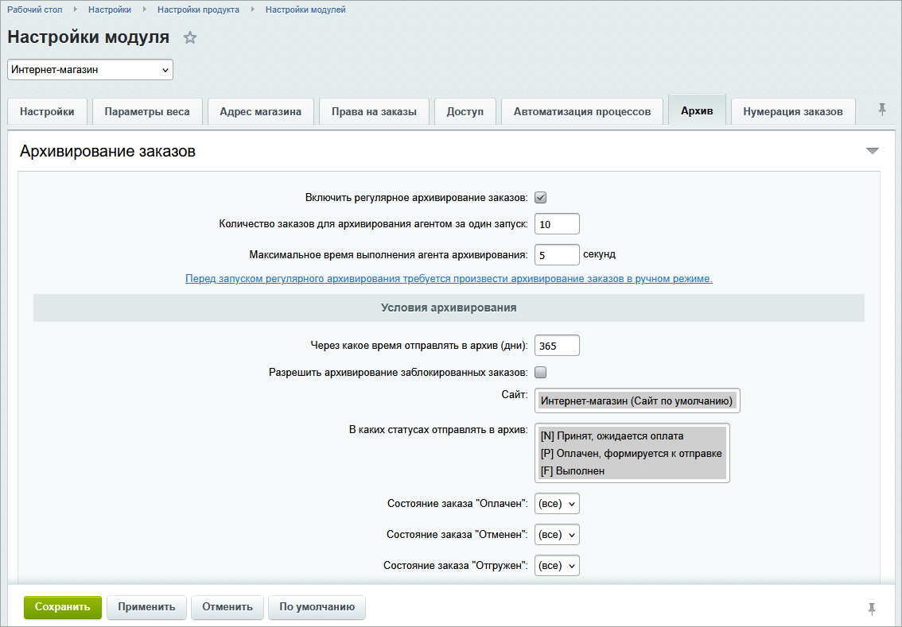

Архив заказов — отдельное хранилище для заказов, которые не нужны в ежедневной работе. Модуль переносит в архив корзину, свойства, оплаты и пользовательские отгрузки. После сохранения данных модуль удаляет активный заказ из основного хранилища.

В системе можно настроить автоматическое архивирование, перенести заказ и найти его в архиве. Сохраненные данные можно использовать в отчете или для создания нового активного заказа.

## Какие методы использовать

#|
|| **Задача** | **Метод** | **Результат** ||
|| Архивировать активные заказы | `Bitrix\Sale\Archive\Manager::archiveOrders()` | `Bitrix\Sale\Result` с количеством архивированных заказов ||
|| Архивировать по настройкам модуля | `Bitrix\Sale\Archive\Manager::archiveByOptions()` | `Bitrix\Sale\Result` ||
|| Получить список архивных заказов | `Bitrix\Sale\Archive\Manager::getList()` | ORM-результат со строками архива ||
|| Получить строку по идентификатору архива | `Bitrix\Sale\Archive\Manager::getById()` | ORM-результат для одного `ID` архива ||
|| Получить позиции корзины | `Bitrix\Sale\Archive\Manager::getBasketList()` | ORM-результат со строками архивной корзины ||
|| Восстановить полный объект в памяти | `Bitrix\Sale\Archive\Manager::returnArchivedOrder()` | `Bitrix\Sale\Archive\Order` или `null` ||
|| Удалить архивную запись | `Bitrix\Sale\Archive\Manager::delete()` | `Bitrix\Main\Entity\DeleteResult` ||
|#

## Как работает архивирование

Архивирование состоит из четырех этапов.

1. Модуль отбирает активные заказы по фильтру.

2. Для каждого заказа формирует строку архива и отдельные строки позиций корзины.

3. Запускает снятие резерва с отгрузок, если в заказе есть зарезервированные, но еще не отгруженные товары.

4. Удаляет активный заказ после успешного сохранения всех архивных данных.

Если модуль не смог сохранить заказ или одну из позиций корзины, он удаляет уже созданные архивные строки и оставляет активный заказ. Обработчик события `OnSaleOrderBeforeArchived` также может остановить архивирование конкретного заказа, если вернет ошибку.

### Какие данные сохраняются

Часть полей хранится в отдельных колонках. Используйте их для списков, отчетов и поиска без восстановления полного объекта.

#|
|| **Группа** | **Данные** ||
|| Заказ | Идентификатор, номер, покупатель, сумма, оплаченная сумма, валюта, статус, сайт, тип плательщика, даты, признаки оплаты, отгрузки и отмены, внешние идентификаторы, ответственный и компания ||
|| Архив | Идентификатор строки архива, дата архивирования и версия формата ||
|| Корзина | Товар, название, цена, количество, вес, валюта, единица измерения и дата добавления ||
|#

В упакованной части архива модуль сохраняет полные поля заказа, свойства заказа, оплаты, пользовательские отгрузки с позициями, данные скидок, позиции корзины, свойства позиций и штрихкоды отгрузки. Системная отгрузка в архив пользовательских отгрузок не входит.

### Чем отличаются идентификаторы

В архиве используются два идентификатора заказа:

-  `ID` — идентификатор строки в таблице архива. Его принимают методы `Bitrix\Sale\Archive\Manager::getById()`, `Bitrix\Sale\Archive\Manager::returnArchivedOrder()` и `Bitrix\Sale\Archive\Manager::delete()`.

-  `ORDER_ID` — идентификатор исходного активного заказа. По нему ищут архивную запись, если код проекта получил обычный идентификатор заказа.

Идентификатор архивной строки может не совпадать с идентификатором исходного заказа. Не передавайте `ORDER_ID` в методы, которые ожидают `ID`.

## Настроить автоматическое архивирование

Чтобы модуль автоматически переносил старые заказы в архив, задайте параметры архивирования в настройках модуля `sale`. По этим параметрам модуль формирует фильтр активных заказов и запускает агент `Bitrix\Sale\Archive\Manager::archiveOnAgent()`.

В настройках можно ограничить отбор:

-  периодом от даты создания заказа в днях,

-  сайтом,

-  статусом заказа,

-  признаками оплаты, отмены и отгрузки.

Отдельные параметры задают количество заказов за один запуск и максимальное время работы агента.

{width=1134px height=789px}

Перед включением проверьте фильтр на тестовой выборке. Архивирование удаляет активные заказы, а обработчики интеграций и отчетов могут работать только с основной таблицей.

### Запустить и проконтролировать один пакет

Чтобы обработать один пакет по настройкам модуля, вызовите `Bitrix\Sale\Archive\Manager::archiveByOptions()`. В примере переменная `$batchLimit` ограничивает размер пакета, а `$maxExecutionTime` — время выполнения в секундах. За один вызов фоновой задачи запустите один пакет. Сохраните количество обработанных заказов, предупреждения и ошибки в журнале проекта.

```php
use Bitrix\Main\Loader;

if (!Loader::includeModule('sale'))
{
    throw new \RuntimeException('Не удалось подключить модуль sale');
}

$batchLimit = 20;
$maxExecutionTime = 30;
$archiveResult = \Bitrix\Sale\Archive\Manager::archiveByOptions(
    $batchLimit,
    $maxExecutionTime
);

$archiveResultData = $archiveResult->getData();
$batchResult = [
    'COUNT' => (int)($archiveResultData['count'] ?? 0),
    'WARNINGS' => $archiveResult->getWarningMessages(),
    'ERRORS' => $archiveResult->getErrorMessages(),
];

if (!$archiveResult->isSuccess())
{
    throw new \RuntimeException(
        implode('; ', $batchResult['ERRORS'])
    );
}
```

Если параметр `archive_params` содержит пустую строку, метод выбрасывает исключение. Такое значение возвращает `Option::get()`, когда настройка не задана.

Значение `COUNT` может быть меньше лимита. Время выполнения закончилось, часть заказов не прошла обработку или подходящих заказов больше нет. Следующий запуск повторно отберет только активные заказы, поэтому уже архивированные записи не создадут дубли.

Системный агент вызывает `Bitrix\Sale\Archive\Manager::archiveOnAgent()`. Метод управляет периодичностью и возвращает строку следующего вызова. Не используйте его в коде проекта для обработки одного пакета. Для собственного планировщика вызывайте `Bitrix\Sale\Archive\Manager::archiveByOptions()`.

## Архивировать заказ

Чтобы перенести активные заказы в архив, вызовите `Bitrix\Sale\Archive\Manager::archiveOrders()`. Метод принимает три аргумента:

-  `$filter` — фильтр активных заказов,

-  `$limit` — максимальное количество заказов,

-  `$timeExecution` — максимальное время выполнения в секундах.

Метод возвращает `Bitrix\Sale\Result`. Ключ `count` содержит количество успешно архивированных заказов. Если фильтр не нашел заказы, результат содержит предупреждение.

Проверяйте права до вызова метода и формируйте фильтр на сервере. Пример проверки смотрите в подразделе [Ограничить доступ к запуску архивирования](#ограничить-доступ-к-запуску-архивирования).

Повторный вызов для уже архивированного `ID` не создает дубликат. Активный заказ больше не попадает в выборку, а результат содержит предупреждение об отсутствии заказов. Для широкого фильтра повторный запуск может обработать следующую группу подходящих заказов с учетом `limit`.

Не изменяйте заказ параллельно с архивированием. Метод последовательно сохраняет архивные данные, запускает снятие резерва и удаляет активный заказ, но не блокирует заказ на время всей операции. Запускайте архивирование в контролируемом фоновом процессе и обрабатывайте ошибки результата для каждого пакета.

### Проверить архивирование на тестовом заказе

Код архивирует существующий тестовый заказ, находит созданную архивную запись и сверяет ее с исходными данными. Результат включает позиции корзины и объект `Bitrix\Sale\Archive\Order` для чтения.

Перед запуском подготовьте:

-  идентификатор тестового заказа, который можно удалить из активных заказов,

-  резервную копию данных,

-  серверную точку входа с ограниченным доступом, например закрытую от HTTP-запросов команду проекта.

Не запускайте пример на рабочем заказе. Метод `Bitrix\Sale\Archive\Manager::archiveOrders()` удалит активный заказ после успешного сохранения архива.

Пример кода выполняет полный путь от проверки исходного заказа до чтения архивного объекта.

```php
use Bitrix\Main\Loader;
use Bitrix\Sale\Order;

if (!Loader::includeModule('sale'))
{
    throw new \RuntimeException('Не удалось подключить модуль sale');
}

$orderId = 123;
$sourceOrder = Order::load($orderId);

if (!$sourceOrder)
{
    throw new \RuntimeException(
        sprintf('Активный заказ %d не найден', $orderId)
    );
}

// Сохранить исходные данные для сверки с архивом
$controlData = [
    'ID' => $sourceOrder->getId(),
    'ACCOUNT_NUMBER' => (string)$sourceOrder->getField('ACCOUNT_NUMBER'),
    'PRICE' => $sourceOrder->getPrice(),
    'CURRENCY' => $sourceOrder->getCurrency(),
    'BASKET_COUNT' => $sourceOrder->getBasket()->count(),
];

// Архивировать тестовый заказ
$archiveResult = \Bitrix\Sale\Archive\Manager::archiveOrders(
    ['=ID' => $orderId],
    1
);

if (!$archiveResult->isSuccess())
{
    throw new \RuntimeException(
        implode('; ', $archiveResult->getErrorMessages())
    );
}

if ($archiveResult->hasWarnings())
{
    throw new \RuntimeException(
        implode('; ', $archiveResult->getWarningMessages())
    );
}

$archiveResultData = $archiveResult->getData();
$archivedCount = (int)($archiveResultData['count'] ?? 0);

if ($archivedCount !== 1)
{
    throw new \RuntimeException('Заказ не был архивирован');
}

// Проверить, что заказ удален из активного хранилища
if (Order::load($orderId))
{
    throw new \RuntimeException('Заказ остался в активном хранилище');
}

// Найти созданную архивную запись
$archiveRow = \Bitrix\Sale\Archive\Manager::getList([
    'select' => [
        'ID',
        'ORDER_ID',
        'ACCOUNT_NUMBER',
        'STATUS_ID',
        'PRICE',
        'CURRENCY',
        'DATE_INSERT',
        'DATE_ARCHIVED',
        'VERSION',
    ],
    'filter' => ['=ORDER_ID' => $orderId],
    'limit' => 1,
])->fetch();

if (!$archiveRow)
{
    throw new \RuntimeException('Архивная запись не найдена');
}

$archiveId = (int)$archiveRow['ID'];

// Получить позиции архивной корзины
$basketItems = \Bitrix\Sale\Archive\Manager::getBasketList([
    'select' => [
        'ID',
        'ARCHIVE_ID',
        'PRODUCT_ID',
        'NAME',
        'PRICE',
        'QUANTITY',
        'CURRENCY',
    ],
    'filter' => ['=ARCHIVE_ID' => $archiveId],
    'order' => ['ID' => 'ASC'],
])->fetchAll();

// Восстановить объект заказа в памяти
$archivedOrder = \Bitrix\Sale\Archive\Manager::returnArchivedOrder($archiveId);

if (!$archivedOrder)
{
    throw new \RuntimeException('Архивный объект не восстановлен');
}

// Сверить основные данные с исходным заказом
$archiveDataMatches =
    $archivedOrder->getId() === $controlData['ID']
    && (string)$archivedOrder->getField('ACCOUNT_NUMBER')
        === $controlData['ACCOUNT_NUMBER']
    && abs($archivedOrder->getPrice() - $controlData['PRICE']) < 0.00001
    && $archivedOrder->getCurrency() === $controlData['CURRENCY']
    && $archivedOrder->getBasket()->count()
        === $controlData['BASKET_COUNT']
;

if (!$archiveDataMatches)
{
    throw new \RuntimeException(
        'Контрольные данные заказа не совпали с архивом'
    );
}

$scenarioResult = [
    'ORDER_ID' => $orderId,
    'ARCHIVE_ID' => $archiveId,
    'DATE_ARCHIVED' => $archiveRow['DATE_ARCHIVED'],
    'BASKET_ITEMS' => $basketItems,
    'ARCHIVED_ORDER' => $archivedOrder,
];
```

После успешного выполнения:

-  `Order::load($orderId)` не находит активный заказ.

-  `$archiveRow['ID']` содержит идентификатор архивной строки.

-  `$basketItems` содержит позиции архивной корзины.

-  `$archivedOrder` предоставляет основные поля и восстановленные коллекции только для чтения.

-  `$scenarioResult` объединяет результаты для следующего шага кода проекта.

### Ограничить доступ к запуску архивирования

Методы архива не проверяют права пользователя. Поэтому запускайте архивирование только из служебного скрипта, доступ к которому ограничен средствами операционной системы. Значения фильтра задавайте в коде и не передавайте их напрямую из внешнего запроса.

Если архивирование запускает PHP-страница сайта, сначала проверьте авторизацию, права администратора и токен сессии. Разместите проверку после подключения пролога. Он создает глобальный объект `$USER` и подключает функцию `check_bitrix_sessid()`.

```php
global $USER;

if (!$USER instanceof \CUser || !$USER->IsAuthorized())
{
    throw new \RuntimeException('Требуется авторизация');
}

if (!$USER->IsAdmin())
{
    throw new \RuntimeException('Недостаточно прав');
}

if (!check_bitrix_sessid())
{
    throw new \RuntimeException('Сессия запроса недействительна');
}
```

Проверка администратора — минимальное ограничение для отдельного служебного сценария. Если запуск доступен не только администратору, проверьте право для нужной группы пользователей. После проверки прав сформируйте фильтр из разрешенных полей на сервере и задайте предельный `limit`.

### Исключить заказ из архивирования

Чтобы исключить отдельные заказы из архивирования, зарегистрируйте обработчик события `OnSaleOrderBeforeArchived`. Событие происходит для каждого отобранного заказа до записи архивных данных. Параметр `ENTITY` содержит активный объект `Bitrix\Sale\Order`. Верните ошибочный `EventResult`, чтобы оставить заказ в активном хранилище.

Разместите обработчик в `/local/php_interface/init.php` или в подключаемом из него файле. В массиве `$protectedOrderIds` перечислите заказы, которые нельзя архивировать.

```php
use Bitrix\Main\Event;
use Bitrix\Main\EventManager;
use Bitrix\Main\EventResult;
use Bitrix\Sale\Order;
use Bitrix\Sale\ResultError;

EventManager::getInstance()->addEventHandler(
    'sale',
    'OnSaleOrderBeforeArchived',
    static function (Event $event): ?EventResult
    {
        $order = $event->getParameter('ENTITY');

        if (!$order instanceof Order)
        {
            return null;
        }

        $protectedOrderIds = [123, 456];

        if (!in_array($order->getId(), $protectedOrderIds, true))
        {
            return null;
        }

        return new EventResult(
            EventResult::ERROR,
            new ResultError(
                'Заказ исключен из архивирования правилами проекта',
                'ORDER_ARCHIVING_BLOCKED'
            ),
            'sale'
        );
    }
);
```

Замените массив `$protectedOrderIds` проверкой признака из конфигурации проекта. Ошибка обработчика попадет в результат `Bitrix\Sale\Archive\Manager::archiveOrders()` или `Bitrix\Sale\Archive\Manager::archiveByOptions()`. Остальные заказы пакета продолжат обрабатываться, а счетчик `count` будет содержать только успешно архивированные заказы.

## Найти архивный заказ

Чтобы найти заказ по обычному идентификатору, выполните два запроса по порядку.

1. Вызовите `Order::load($orderId)`, чтобы найти активный заказ.

2. Если метод вернул `null`, вызовите `Bitrix\Sale\Archive\Manager::getList()` с фильтром по полю `ORDER_ID`.

```php
use Bitrix\Main\Loader;
use Bitrix\Sale\Order;

if (!Loader::includeModule('sale'))
{
    throw new \RuntimeException('Не удалось подключить модуль sale');
}

$orderId = 123;
$activeOrder = Order::load($orderId);
$archiveRow = null;

if (!$activeOrder)
{
    $archiveRow = \Bitrix\Sale\Archive\Manager::getList([
        'select' => ['ID', 'ORDER_ID', 'ACCOUNT_NUMBER', 'DATE_ARCHIVED'],
        'filter' => ['=ORDER_ID' => $orderId],
        'limit' => 1,
    ])->fetch();
}
```

Метод `Bitrix\Sale\Archive\Manager::getList()` передает параметры в ORM-таблицу архива и возвращает `Bitrix\Main\DB\Result`. Параметры `select`, `filter`, `order`, `limit` и `offset` задаются по правилам ORM.

Не считайте отсутствие активного заказа доказательством архивирования. Заказ мог быть удален, а идентификатор — указан неверно. Проверка архива обязательна.

## Получить данные архивного заказа

Для списка или отчета можно получить поля заказа и позиции корзины без восстановления полного объекта. Для этого используйте два метода:

-  `Bitrix\Sale\Archive\Manager::getById()` — возвращает поля заказа,

-  `Bitrix\Sale\Archive\Manager::getBasketList()` — возвращает позиции корзины.

Передайте `ID` строки архива в первый метод и этот же идентификатор в поле фильтра `ARCHIVE_ID` второго метода.

```php
use Bitrix\Main\Loader;

if (!Loader::includeModule('sale'))
{
    throw new \RuntimeException('Не удалось подключить модуль sale');
}

$archiveId = 789;
$archiveRow = \Bitrix\Sale\Archive\Manager::getById($archiveId)->fetch();

if (!$archiveRow)
{
    throw new \RuntimeException('Архивная запись не найдена');
}

$basketItems = \Bitrix\Sale\Archive\Manager::getBasketList([
    'select' => [
        'ID',
        'PRODUCT_ID',
        'NAME',
        'PRICE',
        'QUANTITY',
        'CURRENCY',
    ],
    'filter' => ['=ARCHIVE_ID' => $archiveId],
    'order' => ['ID' => 'ASC'],
])->fetchAll();
```

Для выборки нескольких архивных заказов используйте `Bitrix\Sale\Archive\Manager::getList()`: метод поддерживает параметры ORM `select`, `filter`, `order`, `limit` и `offset`. Отдельные колонки корзины подходят для отчета по товарам. Свойства позиций, штрихкоды и другие упакованные данные в эти колонки не входят.

### Восстановить полный объект в памяти

Чтобы получить свойства, оплаты, отгрузки и другие упакованные данные, восстановите объект заказа в памяти. Передайте `ID` строки архива в `Bitrix\Sale\Archive\Manager::returnArchivedOrder()`.

```php
use Bitrix\Main\Loader;

if (!Loader::includeModule('sale'))
{
    throw new \RuntimeException('Не удалось подключить модуль sale');
}

$archiveId = 789;
$archivedOrder = \Bitrix\Sale\Archive\Manager::returnArchivedOrder($archiveId);

if (!$archivedOrder)
{
    throw new \RuntimeException('Архивный объект не восстановлен');
}
```

Метод возвращает объект `Bitrix\Sale\Archive\Order` или `null`. Класс архивного заказа наследует `Bitrix\Sale\Order`, поэтому доступны основные поля и восстановленные коллекции.

Архивный объект предназначен для чтения. Метод `applyDiscount()` возвращает пустой `Bitrix\Sale\Result` и не пересчитывает скидки. Не вызывайте `save()` и не используйте объект как активный заказ.

Примеры свойств, оплат и отгрузок используют переменную `$archivedOrder` из этого примера.

### Получить свойства заказа

Архив хранит значения свойств заказа. При сборке объекта метод `Bitrix\Sale\Archive\Manager::returnArchivedOrder()` получает текущую коллекцию свойств и устанавливает сохраненное значение для каждого найденного `ORDER_PROPS_ID`. Метод `getPropertyCollection()` работает штатно и возвращает свойства, сохраненные в упакованной части архива.

Массив свойств содержит:

-  `PROPERTY_ID` — идентификатор определения свойства,

-  `NAME` — текущее название свойства,

-  `VALUE` — сохраненное в заказе значение. Тип значения зависит от типа свойства: строка или массив.

```php
$propertyValues = [];

foreach ($archivedOrder->getPropertyCollection() as $propertyValue)
{
    $propertyValues[] = [
        'PROPERTY_ID' => $propertyValue->getPropertyId(),
        'NAME' => $propertyValue->getName(),
        'VALUE' => $propertyValue->getValue(),
    ];
}
```

Если определение свойства удалили после архивирования, восстановленная коллекция не содержит это свойство. Упакованные данные архива при этом не меняются, но `getPropertyCollection()` возвращает только свойства, для которых модуль нашел актуальное определение.

### Получить оплаты

Чтобы получить оплаты заказа, переберите коллекцию `PaymentCollection`.

Для каждой оплаты сохраните идентификатор, сумму, признак оплаты и идентификатор платежной системы.

```php
$paymentValues = [];

foreach ($archivedOrder->getPaymentCollection() as $payment)
{
    $paymentValues[] = [
        'ID' => $payment->getId(),
        'SUM' => $payment->getSum(),
        'PAID' => $payment->isPaid(),
        'PAY_SYSTEM_ID' => $payment->getPaymentSystemId(),
    ];
}
```

Архивный объект показывает платежную систему и значения оплаты на момент архивирования. Перед повторной оплатой найдите актуальную платежную систему и проверьте ее доступность. Не запускайте обработчик платежной системы по архивным данным и не меняйте оплату в архивном объекте.

### Получить отгрузки

Чтобы получить пользовательские отгрузки, переберите коллекцию `ShipmentCollection`.

Для каждой отгрузки сохраните идентификатор, службу доставки, стоимость и количество позиций. Системная отгрузка не входит в архив пользовательских отгрузок, поэтому пропустите ее при переборе.

```php
$shipmentValues = [];

foreach ($archivedOrder->getShipmentCollection() as $shipment)
{
    if ($shipment->isSystem())
    {
        continue;
    }

    $shipmentValues[] = [
        'ID' => $shipment->getId(),
        'DELIVERY_ID' => $shipment->getDeliveryId(),
        'PRICE' => $shipment->getPrice(),
        'ITEM_COUNT' => $shipment
            ->getShipmentItemCollection()
            ->count(),
    ];
}
```

Служба доставки и товары могли измениться после архивирования. Используйте коллекцию для чтения сохраненного состояния, но заново проверяйте доступность службы и состав товаров перед созданием активного заказа.

### Обработать событие перед восстановлением

Чтобы записать начало восстановления архивного объекта в журнал, обработайте событие `OnSaleArchiveOrderBeforeRestored`. Оно происходит внутри `Bitrix\Sale\Archive\Manager::returnArchivedOrder()` до сборки объекта `Bitrix\Sale\Archive\Order`. Параметр `ENTITY` содержит объект `Bitrix\Sale\Archive\Recovery\Restorer`.

Разместите постоянную регистрацию в `/local/php_interface/init.php` или в подключаемом из него файле.

```php
use Bitrix\Main\Diag\Debug;
use Bitrix\Main\Event;
use Bitrix\Main\EventManager;
use Bitrix\Sale\Archive\Recovery\Restorer;

EventManager::getInstance()->addEventHandler(
    'sale',
    'OnSaleArchiveOrderBeforeRestored',
    static function (Event $event): void
    {
        $restorer = $event->getParameter('ENTITY');

        if (!$restorer instanceof Restorer)
        {
            return;
        }

        Debug::writeToFile(
            [
                'ARCHIVE_ID' => $restorer->getArchiveId(),
                'ARCHIVE_VERSION' => $restorer->getArchiveVersion(),
            ],
            'Archive order restoration started',
            '/local/var/log/archive-order-restoration.log'
        );
    }
);
```

Подготовьте каталог для журнала, например `/local/var/log`, и ограничьте доступ к нему средствами веб-сервера. Обработчик сработает при каждом вызове `Bitrix\Sale\Archive\Manager::returnArchivedOrder()`, но не при запросах `Bitrix\Sale\Archive\Manager::getList()` и `Bitrix\Sale\Archive\Manager::getBasketList()`.

Событие предназначено для действий перед сборкой объекта. Возвращаемое значение обработчика не отменяет восстановление, поэтому не используйте событие для проверки прав или запрета операции. Такие проверки выполняйте до вызова `Bitrix\Sale\Archive\Manager::returnArchivedOrder()`.

## Вернуть заказ в активную работу

Чтобы вернуть данные архивного заказа в активную работу, создайте новый заказ и перенесите в него нужные данные.

1. Получите архивный объект через `Bitrix\Sale\Archive\Manager::returnArchivedOrder()`.

2. Создайте новый заказ через `Order::create()`. Укажите актуальные сайт, пользователя, валюту и тип плательщика.

3. Создайте корзину заново. Проверьте, что товары доступны, и передайте корзину в новый заказ.

4. Сопоставьте свойства заказа с актуальными определениями. Затем создайте оплаты и пользовательские отгрузки с доступными платежными системами и службами доставки.

5. Сохраните новый заказ и проверьте результат `Order::save()`, состав корзины, итоговую сумму, оплаты и отгрузки.

6. Удалите исходную строку архива только после успешной проверки нового заказа и резервной копии.



О создании и сохранении нового заказа читайте в статье [Создание заказа](./order-create.md). Правила доступа к заказам собраны в статье [Права доступа и ограничения](./permissions.md).



## Учесть архив в отчетах и интеграциях

Чтобы добавить архивные заказы в отчет или интеграцию, объедините две выборки: активные заказы и строки архива. Методы `OrderTable::getList()` и `Order::getList()` возвращают только активные заказы. Архивные строки запрашивайте через `Bitrix\Sale\Archive\Manager::getList()`.

При объединении:

-  приведите поля активного заказа и архива к одной структуре,

-  добавьте признак источника `active` или `archive`,

-  используйте `ORDER_ID` как исходный идентификатор заказа, а `ID` — только как идентификатор строки архива,

-  отдельно обрабатывайте данные, которых нет в колонках архива,

-  не восстанавливайте полный объект для каждой строки, если отчету достаточно основных полей.

Внешняя система может хранить идентификатор заказа после его архивирования. Если основной запрос вернул пустой результат, выполните поиск по `ORDER_ID` в архиве. Для экспорта архивных заказов заранее определите, достаточно ли сохраненных данных. Актуальные настройки свойств, оплат, доставки и каталога могут отличаться от состояния на дату заказа.

## Удалить архивную запись

Чтобы удалить архивный заказ по регламенту хранения данных, вызовите `Bitrix\Sale\Archive\Manager::delete()`. Передайте в метод `ID` строки архива, а не `ORDER_ID` исходного заказа. Метод удалит строку заказа, упакованные данные и связанные строки архивной корзины.

Архивную запись удаляйте только после истечения установленного в проекте срока хранения. Для поиска, отчетов и создания нового активного заказа архивную запись удалять не нужно. После удаления восстановить ее можно из резервной копии.

```php
use Bitrix\Main\Loader;

if (!Loader::includeModule('sale'))
{
    throw new \RuntimeException('Не удалось подключить модуль sale');
}

$archiveId = 789;
$deleteResult = \Bitrix\Sale\Archive\Manager::delete($archiveId);

if (!$deleteResult->isSuccess())
{
    throw new \RuntimeException(
        implode('; ', $deleteResult->getErrorMessages())
    );
}

if (\Bitrix\Sale\Archive\Manager::getById($archiveId)->fetch())
{
    throw new \RuntimeException('Архивная запись не была удалена');
}
```

Если другим системам нужен факт удаления, отправьте уведомление из кода проекта после успешного `DeleteResult`.

## Ограничения и ошибки

#|
|| **Ситуация** | **Причина** | **Что делать** ||
|| `Order::load()` вернул `null` | Заказ архивирован, удален или идентификатор неверен | Выполнить поиск по `ORDER_ID` через `Bitrix\Sale\Archive\Manager::getList()` ||
|| `Bitrix\Sale\Archive\Manager::getById()` не нашел запись | Передан исходный `ORDER_ID` вместо `ID` архива | Сначала получить строку по фильтру `=ORDER_ID` ||
|| `Bitrix\Sale\Archive\Manager::returnArchivedOrder()` вернул `null` | Запись не найдена или версия архива не поддерживается | Проверить `ID`, поля `VERSION` и `DATE_ARCHIVED` ||
|| После `returnArchivedOrder()` заказ не появился среди активных | Метод восстанавливает объект только в памяти | Создать и сохранить новый активный заказ ||
|| В отчете не хватает старых заказов | Запрос обращается только к основной таблице | Добавить отдельную выборку архива ||
|| Архивирование остановилось на заказе | Обработчик события вернул ошибку или не сохранились архивные данные | Проверить ошибки `Bitrix\Sale\Result` и обработчики `OnSaleOrderBeforeArchived` ||
|| Пакет обработал меньше заказов, чем задано в `limit` | Закончилось время выполнения, часть заказов завершилась ошибкой или выборка исчерпана | Проверить `count`, предупреждения и ошибки результата; следующий пакет запускать отдельно ||
|| В архивном объекте нет ожидаемого свойства | Определение свойства удалили после архивирования или значения не было в исходном заказе | Проверить актуальные определения свойств и исходные данные; не сохранять архивный объект как активный ||
|#

## Продолжить изучение

-  [Создание заказа](./order-create.md)

-  [Изменение и чтение заказа](./order-update.md)

-  [Права доступа и ограничения](./permissions.md)

-  [Покупатели, профили и внутренние счета](./buyers-accounts.md)

-  [Отчеты и аналитика](./reports.md)

-  [Обмен, импорт и экспорт заказов](./exchange-import-export.md)