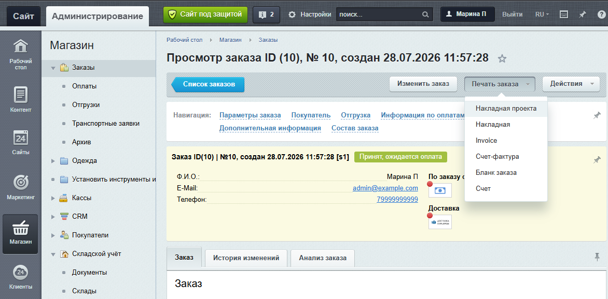

Печатная форма представляет данные заказа в виде счета, накладной, акта или другого документа для печати. Объектный API модуля `sale` предоставляет заказ и связанные коллекции. PHP-шаблон выводит текущие данные заказа. Если готовый документ нужно хранить, сохраните файл документа и метаданные отдельно.

Чтобы подготовить печатную форму, загрузите актуальный заказ, соберите данные, передайте их в PHP-шаблон и добавьте форму в меню «Печать заказа».

## Чем отличается печатная форма от связанных документов

Печатная форма не меняет заказ и при каждом открытии строится по доступным в этот момент данным. Другие документы модуля `sale` могут иметь собственное состояние и жизненный цикл.

#|
|| **Результат** | **Как формируется** | **Где изучить подробнее** ||
|| Печатная форма заказа | PHP-шаблон получает заказ или подготовленный массив и выводит HTML | [Собрать данные заказа](#собрать-данные-заказа), [Передать данные в HTML-шаблон](#передать-данные-в-html-шаблон) ||
|| Счет или платежная форма | Обработчик платежной системы использует данные оплаты и настройки способа оплаты | [Оплаты и платежные системы](./payments.md) ||
|| Кассовый чек | Подсистема касс связывает фискальный документ с оплатой или отгрузкой | [Кассы и чеки](./cashbox-checks.md) ||
|| Документ перевозчика | Служба доставки или транспортная заявка получает данные отгрузки | [Доставка и отгрузки](./delivery-shipments.md), [Транспортные заявки](./delivery-requests.md) ||
|| Выгрузка заказа | Механизм обмена передает структурированные данные во внешнюю систему | [Обмен, импорт и экспорт заказов](./exchange-import-export.md) ||
|#

Печатная форма не сохраняет HTML или PDF и не добавляет запись документа в заказ. Если проект должен хранить неизменяемые экземпляры, разработайте отдельный сценарий сохранения файла и метаданных.

## Данные печатной формы

Для печатной формы нужны данные заказа и связанных объектов. Сначала определите источники данных, затем подготовьте структуру массива для шаблона.

### Источники данных

Когда администратор выбирает форму в меню «Печать заказа», контроллер загружает заказ и подключает выбранный PHP-файл. Перед этим штатный маршрут проверяет сессию, доступ к модулю `sale` и операцию просмотра для статуса заказа. В шаблоне доступен объект `$order` типа `Bitrix\Sale\Order`.

Данные для печатной формы берите из объектов заказа и связанных коллекций:

#|
|| **Данные формы** | **Объект или коллекция** | **Роль в сценарии** ||
|| Номер, дата, статус, покупатель, сумма и валюта | `Bitrix\Sale\Order` | Основные реквизиты заказа ||
|| Товары, количество, цена, скидка и НДС | `Bitrix\Sale\Basket` | Табличная часть формы ||
|| Контактные данные и реквизиты покупателя | `Bitrix\Sale\PropertyValueCollection` | Значения свойств конкретного заказа ||
|| Сумма, статус, платежная система и компания | `Bitrix\Sale\PaymentCollection` | Данные одной или нескольких оплат ||
|| Служба доставки, стоимость, трек-номер и состав | `Bitrix\Sale\ShipmentCollection` | Данные пользовательских отгрузок ||
|| Поиск идентификаторов и отдельных полей заказов | `Bitrix\Sale\Internals\OrderTable` | Предварительная выборка без формирования документа ||
|#

Класс `OrderTable` подходит для поиска и списков. Чтобы получить корзину, свойства, оплаты и отгрузки для одной формы, загрузите объект `Order`. Общие способы чтения и поиска заказов описаны в статье [Изменение и чтение заказа](./order-update.md#загрузить-заказ).

### Структура данных для шаблона

Перед созданием шаблона определите, какие данные он должен получить. Для универсальной формы удобно разделить данные на пять групп.

#|
|| **Ключ** | **Содержимое** | **Если данных нет** ||
|| `ORDER` | Номер, дата, статус, покупатель, сумма и валюта заказа | Печатную форму нельзя сформировать без этого блока ||
|| `ITEMS` | Позиции корзины | Пустой массив ||
|| `PROPERTIES` | Значения свойств покупателя | Пустой массив ||
|| `PAYMENTS` | Оплаты заказа | Пустой массив ||
|| `SHIPMENTS` | Пользовательские отгрузки и их позиции | Пустой массив ||
|#

Набор реквизитов зависит от вида формы. Например, счету обычно нужны реквизиты покупателя и продавца, накладной — товары и количество, а акту — описание выполненных работ. Не включайте в массив поля только потому, что они доступны в заказе.

## Создать печатную форму

Создание формы состоит из загрузки заказа, подготовки данных, вывода HTML и подключения шаблона к административному меню.

### Загрузить актуальный заказ

Если код запускается не из административного механизма печати, подключите модуль `sale` и загрузите заказ непосредственно перед подготовкой формы.

```php
use Bitrix\Main\Loader;
use Bitrix\Sale\Order;

if (!Loader::includeModule('sale'))
{
    throw new \RuntimeException('Не удалось подключить модуль sale');
}

$orderId = 123;
if ($orderId <= 0)
{
    throw new \InvalidArgumentException(
        'Идентификатор заказа должен быть положительным числом'
    );
}

$order = Order::load($orderId);

if (!$order)
{
    throw new \RuntimeException("Заказ {$orderId} не найден");
}
```

Метод `Order::load()` возвращает объект заказа или `null`.

Штатный маршрут административной печати проверяет сессию, доступ к модулю и операцию просмотра для статуса заказа. Метод не проверяет право пользователя на просмотр. Эту проверку должен выполнить код, который загружает заказ.

В собственном сценарии проверьте ограничения проекта. Например, в личном кабинете убедитесь, что заказ принадлежит текущему пользователю. Подробнее модель доступа описана в статье [Права доступа и ограничения](./permissions.md).

### Собрать данные заказа

Вынесите функцию подготовки данных в отдельный файл проекта в `/local`. Она получает уже загруженный заказ, ничего не изменяет и не вызывает `Order::save()`.

```php
<?php

use Bitrix\Sale\Order;

function buildOrderPrintData(Order $order): array
{
    // Соберите основные данные заказа
    $dateInsert = $order->getDateInsert();
    $data = [
        'ORDER' => [
            'ID' => $order->getId(),
            'ACCOUNT_NUMBER' => (string) $order->getField(
                'ACCOUNT_NUMBER'
            ),
            'DATE_INSERT' => $dateInsert
                ? $dateInsert->format('Y-m-d H:i:s')
                : null,
            'STATUS_ID' => (string) $order->getField('STATUS_ID'),
            'USER_ID' => $order->getUserId(),
            'PRICE' => $order->getPrice(),
            'CURRENCY' => $order->getCurrency(),
            'PAID' => $order->isPaid(),
            'CANCELED' => $order->isCanceled(),
        ],
        'ITEMS' => [],
        'PROPERTIES' => [],
        'PAYMENTS' => [],
        'SHIPMENTS' => [],
    ];

    // Добавьте позиции корзины
    foreach ($order->getBasket() as $basketItem)
    {
        $data['ITEMS'][] = [
            'ID' => $basketItem->getId(),
            'PRODUCT_ID' => (int) $basketItem->getField('PRODUCT_ID'),
            'NAME' => (string) $basketItem->getField('NAME'),
            'QUANTITY' => $basketItem->getQuantity(),
            'BASE_PRICE' => $basketItem->getBasePrice(),
            'PRICE' => $basketItem->getPrice(),
            'DISCOUNT_PRICE' => $basketItem->getDiscountPrice(),
            'LINE_TOTAL' => $basketItem->getFinalPrice(),
            'CURRENCY' => (string) $basketItem->getField('CURRENCY'),
            'VAT_RATE' => $basketItem->getVatRate(),
            'VAT_INCLUDED' => $basketItem->isVatInPrice(),
        ];
    }

    // Добавьте свойства заказа
    foreach ($order->getPropertyCollection() as $propertyValue)
    {
        $property = $propertyValue->getProperty();

        $data['PROPERTIES'][] = [
            'ID' => $propertyValue->getPropertyId(),
            'CODE' => (string) ($property['CODE'] ?? ''),
            'NAME' => $propertyValue->getName(),
            'VALUE' => $propertyValue->getValue(),
        ];
    }

    // Добавьте оплаты
    foreach ($order->getPaymentCollection() as $payment)
    {
        $data['PAYMENTS'][] = [
            'ID' => $payment->getId(),
            'PAY_SYSTEM_ID' => $payment->getPaymentSystemId(),
            'PAY_SYSTEM_NAME' => $payment->getPaymentSystemName(),
            'SUM' => $payment->getSum(),
            'PAID' => $payment->isPaid(),
            'COMPANY_ID' => (int) $payment->getField('COMPANY_ID'),
        ];
    }

    // Добавьте пользовательские отгрузки и их позиции
    foreach ($order->getShipmentCollection() as $shipment)
    {
        if ($shipment->isSystem())
        {
            continue;
        }

        $shipmentData = [
            'ID' => $shipment->getId(),
            'DELIVERY_ID' => $shipment->getDeliveryId(),
            'DELIVERY_NAME' => $shipment->getDeliveryName(),
            'PRICE' => $shipment->getPrice(),
            'SHIPPED' => $shipment->isShipped(),
            'TRACKING_NUMBER' => (string) $shipment->getField(
                'TRACKING_NUMBER'
            ),
            'COMPANY_ID' => $shipment->getCompanyId(),
            'ITEMS' => [],
        ];

        foreach ($shipment->getShipmentItemCollection() as $shipmentItem)
        {
            $basketItem = $shipmentItem->getBasketItem();
            if (!$basketItem)
            {
                continue;
            }

            $shipmentData['ITEMS'][] = [
                'BASKET_ID' => $shipmentItem->getBasketId(),
                'NAME' => (string) $basketItem->getField('NAME'),
                'QUANTITY' => $shipmentItem->getQuantity(),
                'PRICE' => $basketItem->getPrice(),
                'CURRENCY' => (string) $basketItem->getField(
                    'CURRENCY'
                ),
            ];
        }

        $data['SHIPMENTS'][] = $shipmentData;
    }

    return $data;
}
```

### Выбрать оплату или отгрузку для документа

Если форма относится к одной оплате или отгрузке, найдите объект в коллекции загруженного заказа. Такой поиск одновременно проверяет связь объекта с заказом.

```php
$paymentId = 456;
$payment = $order
    ->getPaymentCollection()
    ->getItemById($paymentId)
;

if (!$payment)
{
    throw new \RuntimeException(
        sprintf(
            'Оплата %d не найдена в заказе %d',
            $paymentId,
            $order->getId()
        )
    );
}

$shipmentId = 789;
$shipment = $order
    ->getShipmentCollection()
    ->getItemById($shipmentId)
;

if (!$shipment || $shipment->isSystem())
{
    throw new \RuntimeException(
        sprintf(
            'Отгрузка %d не найдена в заказе %d',
            $shipmentId,
            $order->getId()
        )
    );
}
```

Работа с оплатами и отгрузками подробнее описана в статьях [Оплаты и платежные системы](./payments.md#работа-с-оплатой-в-заказе) и [Доставка и отгрузки](./delivery-shipments.md#коллекция-отгрузок).

### Передать данные в HTML-шаблон

В PHP-шаблоне административной печати доступен объект `$order`. До подключения шаблона подключите файл с функцией `buildOrderPrintData()`. Функция преобразует объект заказа в согласованный массив.

Метод `getValue()` возвращает сохраненное значение, которое не всегда готово для печати. Для местоположения, файла или пользовательского типа преобразуйте значение с учетом его типа до передачи в шаблон. Например, для файла извлеките имя из файловой структуры, для местоположения замените внутренний код на понятное название, а для пользовательского типа используйте правила его форматирования. Форматы значений и структура файлового свойства описаны в статье [Свойства заказа](./properties.md#выбрать-формат-значения).

```php
<?php

use Bitrix\Sale\Order;

// Проверьте входной объект заказа
/** @var Order $order */
if (!$order instanceof Order)
{
    throw new \RuntimeException('Заказ не загружен');
}

// Подготовьте данные для шаблона
$documentData = buildOrderPrintData($order);

// Подготовьте функции безопасного форматирования и вывода
$escape = static fn(mixed $value): string => htmlspecialchars(
    (string) $value,
    ENT_QUOTES | ENT_SUBSTITUTE,
    'UTF-8'
);

$formatMoney = static fn(float $value, string $currency): string =>
    number_format($value, 2, ',', ' ') . ' ' . $currency;

$formatPropertyValue = static function (mixed $value): string
{
    if (!is_array($value))
    {
        return (string) $value;
    }

    return implode(', ', array_map(
        static fn(mixed $item): string => (string) $item,
        $value
    ));
};
?>

<h1>
    Накладная к заказу №
    <?= $escape($documentData['ORDER']['ACCOUNT_NUMBER']) ?>
</h1>

<p>
    Дата заказа:
    <?= $escape($documentData['ORDER']['DATE_INSERT']) ?>
</p>

<table>
    <thead>
        <tr>
            <th>Товар</th>
            <th>Количество</th>
            <th>Сумма</th>
        </tr>
    </thead>
    <tbody>
        <?php foreach ($documentData['ITEMS'] as $item)
        { ?>
            <tr>
                <td><?= $escape($item['NAME']) ?></td>
                <td><?= $escape($item['QUANTITY']) ?></td>
                <td>
                    <?= $escape($formatMoney(
                        $item['LINE_TOTAL'],
                        $item['CURRENCY']
                    )) ?>
                </td>
            </tr>
        <?php } ?>
    </tbody>
</table>

<p>
    Итого:
    <?= $escape($formatMoney(
        $documentData['ORDER']['PRICE'],
        $documentData['ORDER']['CURRENCY']
    )) ?>
</p>

<h2>Данные покупателя</h2>

<dl>
    <?php foreach ($documentData['PROPERTIES'] as $property)
    { ?>
        <dt><?= $escape($property['NAME']) ?></dt>
        <dd>
            <?= $escape($formatPropertyValue($property['VALUE'])) ?>
        </dd>
    <?php } ?>
</dl>
```

Шаблон отвечает только за представление. Он не загружает связанные объекты заново, не выполняет запросы к внешним сервисам и не сохраняет заказ. Экранируйте названия товаров, свойства и другие текстовые значения непосредственно при выводе. Метод `getViewHtml()` может вернуть HTML, поэтому не выводите его без проверки и выбранной политики экранирования.

### Добавить форму в меню печати

Административный механизм ищет PHP-файлы сначала в `/bitrix/admin/reports/`, затем в `/bitrix/modules/sale/reports/`. Чтобы добавить форму в меню «Печать заказа», создайте файл `/bitrix/admin/reports/project_waybill.php`. В файле используйте код:

```php
<title>Накладная проекта</title>
<?php

require $_SERVER['DOCUMENT_ROOT']
    . '/local/templates/documents/project_waybill.php';
```

Тег `<title>` задает название пункта меню. Основную логику храните в `/local`, а в файле формы оставьте только название и подключение этой логики. Каталог `/bitrix/admin/reports/` может отсутствовать в новом окружении, поэтому добавьте создание каталога и копирование файла формы в процесс развертывания проекта.

{width=1172px height=578px}

После развертывания:

1. Откройте карточку заказа в административном разделе.

2. Нажмите *Печать заказа*.

3. Выберите новый пункт меню, например, *Накладная проекта*.

4. Сверьте номер заказа, товары, количество, свойства покупателя и итоговую сумму.

Форма откроется в новом окне. Механизм не сохранит HTML и не добавит запись документа в заказ.

### Как обеспечить актуальность данных

Загружайте заказ непосредственно перед формированием формы. Ранее собранный массив не изменится, если другой процесс обновит заказ, оплату или отгрузку.

Не вызывайте `Order::save()` из шаблона. Печать должна быть операцией чтения и не менять статус, корзину, свойства, оплаты или отгрузки.

Если документ должен воспроизводить состояние на определенный момент, одной повторной загрузки заказа недостаточно. Сохраните файл или снимок значимых данных, дату формирования и версию шаблона в отдельном сценарии хранения документов.

## Продолжить изучение

-  [Изменение и чтение заказа](./order-update.md)

-  [Свойства заказа](./properties.md)

-  [Оплаты и платежные системы](./payments.md)

-  [Доставка и отгрузки](./delivery-shipments.md)

-  [Кассы и чеки](./cashbox-checks.md)