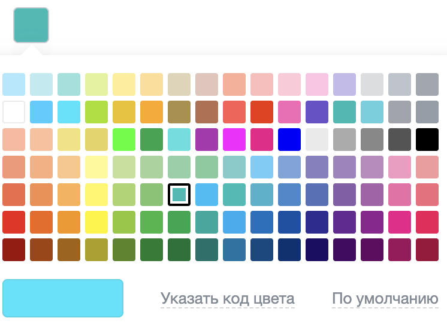
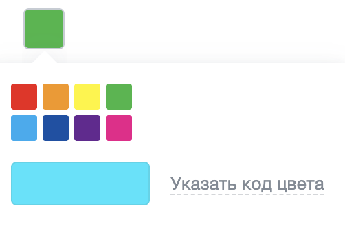
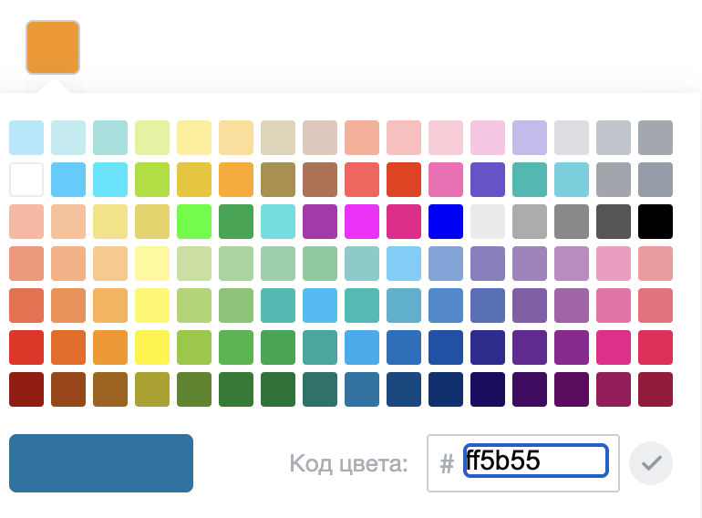
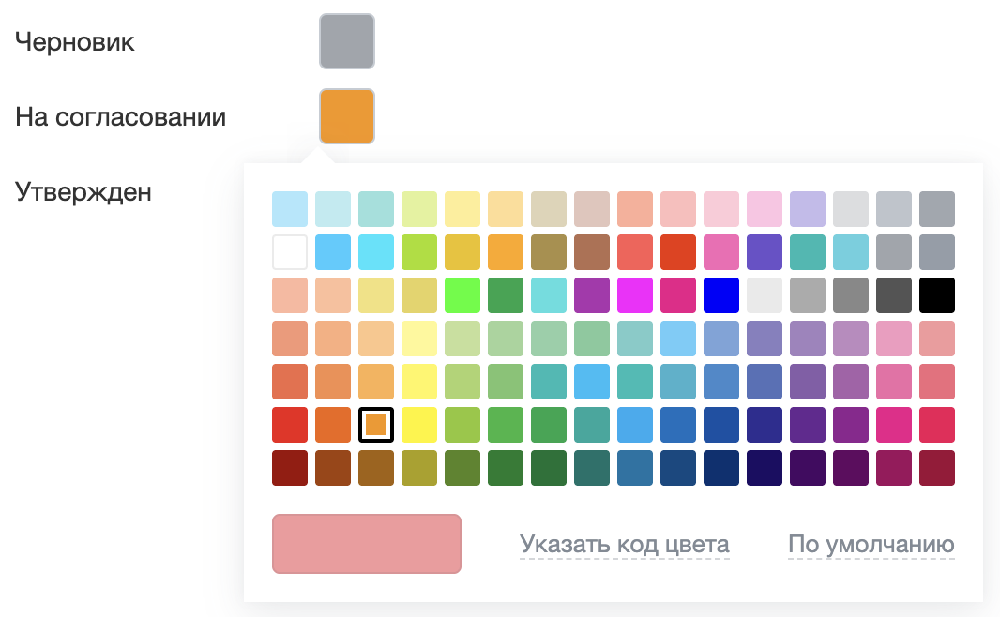

Диалог выбора цвета — всплывающее окно с палитрой. Пользователь кликает по образцу цвета, диалог закрывается, а код получает выбранный цвет строкой в формате HEX.

Диалог подходит для сценариев, где цвет выбирают из готового набора: цвет метки, статуса или элемента оформления.

Диалог не поле формы. Разработчик сам рисует элемент, к которому привязано окно, и сам сохраняет выбранный цвет.

В Bitrix Framework за выбор цвета отвечает расширение `color_picker` модуля main. Оно объявляет класс `BX.ColorPicker` и показывает палитру во всплывающем окне расширения [main.popup](./main-popup.md).

{width=746px height=556px}

## Подключить расширение

Загрузите расширение `color_picker` из PHP.

```php
\Bitrix\Main\UI\Extension::load('color_picker');
```

Расширение загружает зависимости само: всплывающие окна [main.popup](./main-popup.md), дизайн-токены `ui.design-tokens` и собственные стили. Подключать их отдельно не нужно.

Если диалог нужен внутри своего расширения, добавьте `color_picker` в список зависимостей `rel` файла `config.php`. Состав файла описан в статье [Расширения](../framework/extensions.md).



Расширение `color_picker` входит в ядро и не собрано как модуль JavaScript. Класс доступен только глобально как `BX.ColorPicker`, конструкция `import { ColorPicker } from 'color_picker'` не работает.



## Открыть диалог

Чтобы показать диалог на странице, выполните основные действия:

1. Создайте экземпляр `BX.ColorPicker` и передайте элемент привязки в параметре `bindElement`.

2. Передайте обработчик выбора в параметре `onColorSelected`.

3. Вызовите метод `open()`.

```js
const box = document.getElementById('status-color');

const picker = new BX.ColorPicker({
    bindElement: box,
    selectedColor: '#00bbb4',
    onColorSelected: (color) => {
        box.style.backgroundColor = color;
    },
});

box.addEventListener('click', () => {
    picker.open();
});
```

Метод `open()` собирает содержимое заново при каждом вызове и показывает окно рядом с элементом привязки.

Метод `close()` закрывает окно.

Метода `destroy()` у класса нет. Чтобы освободить ресурсы, очистите ссылку на экземпляр `BX.ColorPicker`, когда диалог больше не нужен.

## Передать параметры

Все параметры конструктора необязательны. Если параметр не передан, диалог использует значение по умолчанию.

#|
|| **Параметр** | **Тип** | **Описание** ||
|| `bindElement` | `Element` | Задает элемент, рядом с которым открывается окно. По умолчанию привязки нет ||
|| `selectedColor` | `string` | Задает цвет, подсвеченный в палитре при открытии. По умолчанию выбора нет ||
|| `defaultColor` | `string` | Задает цвет для ссылки «По умолчанию». По умолчанию ссылки нет ||
|| `allowCustomColor` | `boolean` | Показывает ссылку «Указать код цвета» для ручного ввода. По умолчанию `true` ||
|| `colorPreview` | `boolean` | Управляет показом квадрата предпросмотра. По умолчанию `true` ||
|| `colors` | `Array[]` | Задает свою палитру рядами образцов. По умолчанию диалог показывает палитру из семи рядов ||
|| `onColorSelected` | `function` | Задает обработчик выбора цвета. По умолчанию обработчика нет ||
|| `popupOptions` | `PopupOptions` | Переопределяет настройки всплывающего окна. Состав объекта описан в статье [Всплывающие окна и меню main.popup](./main-popup.md). По умолчанию пустой объект ||
|#

Метод `setOptions(options)` принимает тот же набор параметров и меняет их у готового экземпляра. Диалог вызывает его сам при каждом `open()`.

## Задать код цвета

Диалог принимает код цвета в двух форматах: шестизначном `#rrggbb` и трехзначном `#rgb`.

Перед использованием кода диалог разворачивает трехзначную запись в шестизначную и приводит буквы к нижнему регистру: `#ABC` превращается в `#aabbcc`.

Некорректный код в параметрах `selectedColor` и `defaultColor` диалог игнорирует и оставляет прежнее значение. Явное значение `null` сбрасывает параметр.

Два метода экземпляра помогают проверить код до передачи в диалог.

-  `isValidColor(color)` — проверяет формат кода цвета и возвращает истинное значение для подходящего кода.

-  `getFullColorCode(color)` — возвращает шестизначный код или `null`, если код не прошел проверку.

## Получить выбранный цвет

За выбор цвета отвечают обработчик и три метода.

-  `onColorSelected(color, picker)` — обработчик выбора. Диалог вызывает его при клике по образцу палитры, при клике по ссылке «По умолчанию» и при подтверждении кода цвета вручную. Первый аргумент — шестизначный код в нижнем регистре, второй — экземпляр диалога.

-  `getSelectedColor()` — возвращает выбранный цвет или `null`, если выбора не было.

-  `setSelectedColor(color)` — задает выбранный цвет. Обработчик при этом не вызывается, а открытое окно не перерисовывается.

-  `applyColor(color)` — применяет цвет из кода: сохраняет его, вызывает обработчик и закрывает окно.

Своей событийной шины у класса нет: подписаться на выбор цвета событием нельзя. Цвет приходит только в обработчик `onColorSelected`.

Окно закрывается после каждого вызова `applyColor(color)` — в том числе когда код не прошел проверку и обработчик не сработал.

## Задать свою палитру

Параметр `colors` принимает массив рядов, где каждый ряд — массив кодов цвета. Диалог рисует ряды в том порядке, в котором они переданы.

```js
const picker = new BX.ColorPicker({
    bindElement: document.getElementById('status-color'),
    onColorSelected: (color) => {
        saveStatusColor(color);
    },
    colors: [
        ['#f11716', '#f99500', '#fff300', '#2fb644'],
        ['#00adf2', '#0052a7', '#662793', '#f0008c'],
    ],
});
```

{width=502px height=330px}

Диалог проверяет каждый код перед показом и обрабатывает набор по трем правилам.

-  Коды, которые не прошли проверку формата, диалог отбрасывает.

-  Ряды без единого подходящего кода диалог не рисует.

-  Набор без подходящих кодов диалог заменяет палитрой по умолчанию.

Метод `setColors(colors)` меняет палитру у готового экземпляра.

Метод `getColors()` возвращает текущий набор рядов.



Метод `getDefaultColors()` возвращает семь рядов по 16 цветов.

```js
[
    ['#aae9fc', '#bbecf1', '#98e1dc', '#e3f299', '#ffee95', '#ffdd93', '#dfd3b6', '#e3c6bb',
     '#ffad97', '#ffbdbb', '#ffcbd8', '#ffc4e4', '#c4baed', '#dbdde0', '#bfc5cd', '#a2a8b0'],

    ['#ffffff', '#2eceff', '#10e5fc', '#a5de00', '#eec200', '#ffa801', '#ad8f47', '#b57051',
     '#ff5b55', '#ef3000', '#f968b6', '#6b52cc', '#06bab1', '#5cd1df', '#a1a6ac', '#949da9'],

    ['#ffb79f', '#ffbf99', '#f3e27c', '#e7d35d', '#00ff00', '#00a64c', '#48dfdf', '#b02fb0',
     '#ff00ff', '#ef008b', '#0000ff', '#ebebeb', '#acacac', '#898989', '#555555', '#000000'],

    ['#f89675', '#fdad7e', '#fec788', '#fff893', '#c5e099', '#a3d49b', '#8ed1a8', '#7ecb9c',
     '#78cdca', '#67cef9', '#7aa5da', '#887fc0', '#a284bf', '#bd8bc0', '#f69ac1', '#f6989c'],

    ['#f26b47', '#f78d4d', '#fdb051', '#fff55a', '#abd46c', '#7bc56f', '#00bbb4', '#00bef6',
     '#00bdb5', '#3fb2cd', '#3f8bcd', '#5471b9', '#865daa', '#a861ab', '#f16ca8', '#f26b7b'],

    ['#f11716', '#f36509', '#f99500', '#fff300', '#8ec82f', '#2fb644', '#00a74c', '#00a99d',
     '#00adf2', '#0070bf', '#0052a7', '#2e2d93', '#662793', '#922091', '#f0008c', '#f10057'],

    ['#9e0502', '#a34100', '#a46200', '#aba100', '#578520', '#107c2c', '#007333', '#00736a',
     '#0075a6', '#004982', '#003172', '#1c0d64', '#460663', '#630060', '#a0005c', '#9f0037'],
]
```



## Настроить нижнюю панель

Под палитрой диалог выводит панель с квадратом предпросмотра, ссылкой «Указать код цвета» и ссылкой «По умолчанию». Состав панели зависит от трех параметров конструктора.

### Показать предпросмотр цвета

Квадрат предпросмотра показывает цвет до выбора. Диалог закрашивает квадрат цветом образца, на который наведен курсор, и цветом, который вводят вручную.

Показом квадрата управляет параметр `colorPreview`.

### Разрешить ввод кода цвета

Параметр `allowCustomColor` показывает ссылку «Указать код цвета». Клик по ссылке открывает поле, куда пользователь вводит код вне палитры.

Поле работает по пяти правилам.

-  Символ `#` вводить не нужно, диалог подставляет его сам.

-  Поле принимает не больше шести символов: цифры и буквы от `A` до `F`.

-  Клавиша `Enter` применяет введенный код.

-  Вставка из буфера обмена срабатывает, только если в буфере лежит подходящий код цвета.

-  Код, который не прошел проверку формата, диалог подсвечивает как ошибку и окно не закрывает.

{width=770px height=568px}

### Добавить цвет по умолчанию

Параметр `defaultColor` показывает ссылку «По умолчанию». Клик по ссылке применяет заданный цвет через обработчик `onColorSelected`. Без параметра диалог не рисует ссылку.

### Скрыть панель целиком

Диалог показывает панель, пока выполнено хотя бы одно из трех условий:

-  включен параметр `colorPreview`,

-  включен параметр `allowCustomColor`,

-  задан параметр `defaultColor`.



Значение `colorPreview: false` само по себе панель не убирает: параметр `allowCustomColor` включен по умолчанию. Чтобы оставить в окне только палитру, передайте `colorPreview: false` и `allowCustomColor: false` и не задавайте `defaultColor`.



Вместе с панелью пропадает предпросмотр при наведении на образец.

## Настроить всплывающее окно

Параметр `popupOptions` принимает объект `PopupOptions` из расширения [main.popup](./main-popup.md). Диалог объединяет переданные значения со своими, поэтому передавайте только те настройки, которые нужно изменить.

Диалог задает окну четыре собственные настройки.

-  `angle: true` — стрелка к элементу привязки.

-  `autoHide: true` — закрытие по клику вне окна.

-  `closeByEsc: true` — закрытие по клавише `Esc`.

-  `noAllPaddings: true` — нулевые отступы окна и его содержимого.

Обработчики событий окна передают в ключе `events` — например, `onPopupShow` и `onPopupClose`. В примере поле получает CSS-класс на то время, пока окно открыто.

```js
const field = document.getElementById('status-color');

const picker = new BX.ColorPicker({
    bindElement: field,
    onColorSelected: (color) => {
        field.dataset.color = color;
    },
    popupOptions: {
        offsetTop: 4,
        className: 'my-status-color-popup',
        events: {
            onPopupShow: () => {
                field.classList.add('is-picking');
            },
            onPopupClose: () => {
                field.classList.remove('is-picking');
            },
        },
    },
});
```

Остальные ключи примера принадлежат всплывающему окну: параметр `offsetTop` сдвигает окно относительно рассчитанной позиции, а параметр `className` добавляет контейнеру окна свой CSS-класс.



Диалог читает параметр `popupOptions` только в конструкторе. Методы `setOptions()` и `open()` его пропускают, поэтому изменить настройки окна у готового экземпляра нельзя.



Метод `getPopupWindow()` возвращает всплывающее окно — объект `Popup` расширения `main.popup`.

Диалог создает окно при первом обращении и дальше переиспользует его.

## Использовать один диалог для нескольких элементов

Метод `open(options)` принимает те же параметры, что и конструктор, и применяет их перед показом окна. Один экземпляр обслуживает несколько элементов на странице.

```js
const picker = new BX.ColorPicker({
    defaultColor: '#a1a6ac',
});

document.querySelectorAll('.status-color').forEach((field) => {
    field.addEventListener('click', () => {
        picker.open({
            bindElement: field,
            selectedColor: field.dataset.color || null,
            onColorSelected: (color) => {
                field.dataset.color = color;
                field.style.backgroundColor = color;
            },
        });
    });
});
```

{width=1066px height=658px}

Метод `open(options)` обрабатывает пропущенные значения по двум правилам.

-  Пропущенный параметр сохраняет предыдущее значение, поэтому сбрасывайте выбранный цвет и цвет по умолчанию явным значением `null`.

-  Значение `bindElement: null` снимает привязку окна: диалог проверяет наличие ключа, а не его значение.

## Связанные материалы

-  [Всплывающие окна и меню main.popup](./main-popup.md) — параметры `PopupOptions` и методы окна, на котором построен диалог.

-  [Поля форм ui.forms](./ui-forms.md) — оформление поля, в которое записывают выбранный код цвета.

-  [Кнопки ui.buttons](./ui-buttons.md) — кнопка как элемент привязки диалога.

-  [Системный чип](./system-chip.md) — компактный элемент для показа выбранного цвета.

-  [Компоненты](../framework/components.md) — тип параметра `COLORPICKER` для выбора цвета в настройках компонента.

-  [Расширения](../framework/extensions.md) — подключение JavaScript-расширений Bitrix Framework.
