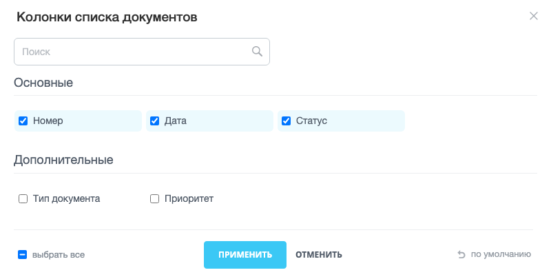
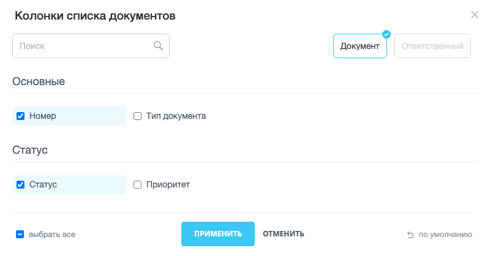
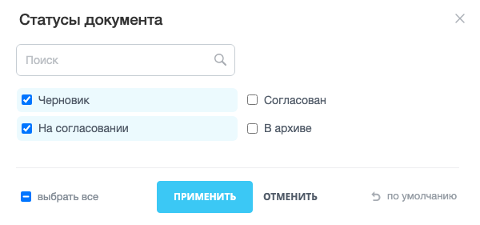
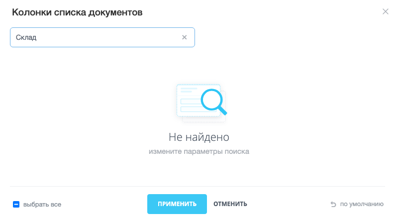
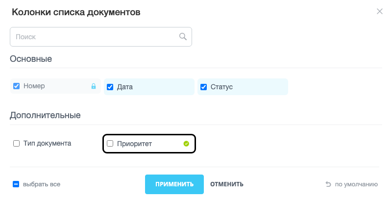
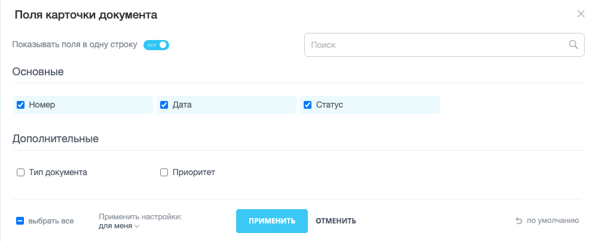

Диалог с флажками — модальное окно со списком вариантов, в котором пользователь отмечает нужные флажками и нажимает кнопку «Применить». Варианты можно сгруппировать по категориям, а категории — по разделам, которые пользователь включает и выключает в шапке окна.

В продукте в таком окне выбирают колонки [таблицы main.ui.grid](./main-ui-grid.md), поля [фильтра main.ui.filter](./main-ui-filter.md) и поля карточки канбана CRM.

Окно создает класс `CheckboxList` из расширения `ui.dialogs.checkbox-list`. Расширение показывает варианты, ведет поиск и сообщает, какие флажки отмечены. Сохраняет выбор разработчик — в обработчике события `onApply`.

## Подключить расширение

Если вы подключаете окно из PHP, загрузите расширение `ui.dialogs.checkbox-list`.

```php
\Bitrix\Main\UI\Extension::load('ui.dialogs.checkbox-list');
```

Вместе с расширением подключаются его зависимости. Загружать их отдельно не нужно.

-  `main.core` — базовые функции ядра JavaScript.

-  `main.core.events` — события `EventEmitter` и `BaseEvent`.

-  `main.popup` — окно, в котором расширение показывает список.

-  `ui.design-tokens` — переменные оформления.

-  `ui.forms` — стили поля поиска и флажков.

-  `ui.switcher` — переключатель компактного вида.

-  `ui.vue3` — Vue, на котором построено содержимое окна.



Кнопки «Применить» и «Отменить» оформлены стилями [кнопок ui.buttons](./ui-buttons.md), но это расширение не входит в зависимости `ui.dialogs.checkbox-list`. Если на странице `ui.buttons` еще не загружено, загрузите его вместе с окном, иначе кнопки останутся без оформления.



**Пример.** Код загружает окно вместе с расширением кнопок.

```php
\Bitrix\Main\UI\Extension::load(['ui.dialogs.checkbox-list', 'ui.buttons']);
```

Если вы работаете в модульном JavaScript, импортируйте класс `CheckboxList` из `ui.dialogs.checkbox-list`.

```js
import { CheckboxList } from 'ui.dialogs.checkbox-list';
```

Вне модульного JavaScript класс доступен как `BX.UI.CheckboxList`.

Метод `BX.Runtime.loadExtension()` загружает расширение в момент вызова и возвращает `Promise`, который выполнится после загрузки. Используйте его, если окно открывается только по действию пользователя. Подробнее о загрузке — в статье [Расширения](../framework/extensions.md).

**Пример.** Код загружает расширение по нажатию кнопки и после загрузки создает окно.

```js
BX.Runtime.loadExtension('ui.dialogs.checkbox-list').then(() => {
    const dialog = new BX.UI.CheckboxList({
        // параметры окна
    });

    dialog.show();
});
```

## Открыть окно

Метод `show()` открывает окно. Перед вызовом создайте экземпляр `CheckboxList` и передайте конструктору объект параметров. Обязательные параметры:

-  `categories` — массив категорий. Категория — группа вариантов с заголовком.

-  `options` — массив вариантов, то есть флажков в окне.

Обработчики событий передайте в параметре `events`. Конструктор создаст окно и без него, но без обработчика `onApply` выбор пользователя никуда не попадет.

Если `categories` или `options` не массив, конструктор выбрасывает исключение `Error`. Параметр `params.useSectioning: false` отключает эту проверку вместе с категориями — см. раздел [Показать варианты без категорий](#bez-kategorij).

**Пример.** Окно предлагает выбрать колонки списка документов. Варианты разбиты на две категории, три колонки отмечены сразу.

```js
import { CheckboxList } from 'ui.dialogs.checkbox-list';

const dialog = new CheckboxList({
    lang: {
        title: 'Колонки списка документов',
    },
    categories: [
        { key: 'main', title: 'Основные' },
        { key: 'extra', title: 'Дополнительные' },
    ],
    options: [
        { id: 'NUMBER', title: 'Номер', categoryKey: 'main', value: true, defaultValue: true },
        { id: 'DATE', title: 'Дата', categoryKey: 'main', value: true, defaultValue: true },
        { id: 'STATUS', title: 'Статус', categoryKey: 'main', value: true, defaultValue: true },
        { id: 'TYPE', title: 'Тип документа', categoryKey: 'extra', value: false, defaultValue: false },
        { id: 'PRIORITY', title: 'Приоритет', categoryKey: 'extra', value: false, defaultValue: false },
    ],
    events: {
        onApply: (event) => {
            console.log(event.getData().fields);
            // ['NUMBER', 'DATE', 'STATUS'], если пользователь ничего не менял
        },
    },
});

dialog.show();
```

Окно открывается поверх затемнения страницы. В шапке окна — заголовок из `lang.title` и поле поиска, ниже — варианты по категориям в четыре колонки. В нижней панели расположены флажок «выбрать все», ссылка «по умолчанию» и кнопки «Применить» и «Отменить».

{width=800px height=405px}

В примерах ниже `categories` и `options` — массивы из этого примера. Обработчики в них вызывают функции-заглушки. Это не методы `CheckboxList` и не API Bitrix Framework: их пишет разработчик модуля. Обычно такая функция отправляет выбор на сервер запросом к контроллеру, как в разделе [Получить выбор пользователя](#apply).

-  `saveSelectedColumns(columns, titles)` — сохраняет выбранные колонки. В `columns` приходит массив идентификаторов из `fields`. Необязательный `titles` — объект новых подписей вида `{ id: title }` из раздела [Разрешить переименовать варианты](#rename). Не путайте с методом `saveColumns()` самого окна из раздела [Управлять окном из кода](#methods).

-  `saveSelectedColumnsFor(columns, forAll)` — сохраняет колонки для текущего пользователя или для всех. Аргумент `forAll` равен `true`, если администратор выбрал «для всех» в нижней панели окна.

-  `applyStatusFilter(statuses)` — применяет фильтр по выбранным статусам. В `statuses` приходит массив идентификаторов из `fields`.

-  `saveCardSettings(fields, isCompact)` — сохраняет поля карточки и вид: `isCompact` равен `true`, если переключатель компактного вида включен.

### Открыть окно повторно

По умолчанию кнопки «Применить» и «Отменить» удаляют окно, а не закрывают его. Метод `show()` у того же экземпляра окно повторно уже не откроет.

Чтобы открывать окно несколько раз, выберите один из двух способов:

-  Создавайте новый экземпляр `CheckboxList` при каждом открытии.

-  Передайте `params.destroyPopupAfterClose: false`. Тогда кнопки закрывают окно, и метод `show()` открывает экземпляр снова.

**Пример.** Код создает окно один раз и открывает его по каждому нажатию кнопки.

```js
const dialog = new CheckboxList({
    categories,
    options,
    params: {
        destroyPopupAfterClose: false,
    },
    events: {
        onApply: (event) => saveSelectedColumns(event.getData().fields),
    },
});

document.getElementById('columns-button').addEventListener('click', () => {
    dialog.show();
});
```

Крестик в шапке, клавиша `Esc` и щелчок вне окна закрывают окно, а не удаляют его.

## Описать варианты

Содержимое окна задают три массива, связанные ключами:

-  `options` — варианты. Каждый вариант ссылается на категорию полем `categoryKey`.

-  `categories` — категории. Каждая категория может ссылаться на раздел полем `sectionKey`.

-  `sections` — разделы. Необязательный массив, верхний уровень группировки.

### Варианты

Вариант — один флажок в окне.

| Поле | Тип | Описание |
|---|---|---|
| `id` | `string` | Идентификатор варианта. Его окно возвращает в списке отмеченных. Обязательное поле |
| `title` | `string` | Подпись флажка. Если не задана, окно показывает `id` |
| `value` | `boolean` | Отмечен ли флажок при открытии окна |
| `defaultValue` | `boolean` | Состояние флажка после нажатия ссылки «по умолчанию» |
| `categoryKey` | `string` | Ключ категории, в которой окно показывает вариант. Вариант без подходящей категории в окне не появится, если категории включены |
| `locked` | `boolean` | Запрет на изменение. Флажок показан с иконкой замка, пользователь не может его снять или отметить. По умолчанию `false` |

Заблокированный вариант с `value: true` всегда входит в выбор: так показывают обязательную колонку, которую пользователь не может скрыть. Флажок «выбрать все» заблокированные варианты не меняет.

Кнопка «Применить» неактивна, пока в окне не отмечен ни один флажок.

### Категории

Категория — группа вариантов под общим заголовком.

| Поле | Тип | Описание |
|---|---|---|
| `key` | `string` | Ключ категории. На него ссылается поле `categoryKey` варианта |
| `title` | `string` | Заголовок группы в окне |
| `sectionKey` | `string` | Ключ раздела, к которому относится категория. Нужен, только если передан массив `sections` |

Окно выводит категории в порядке массива `categories`, а варианты внутри категории — в порядке массива `options`.

### Разделы

Раздел — переключатель в шапке окна, который показывает или скрывает свои категории. Например, один раздел объединяет поля самого документа, другой — поля связанных объектов.

| Поле | Тип | Описание |
|---|---|---|
| `key` | `string` | Ключ раздела. На него ссылается поле `sectionKey` категории |
| `title` | `string` | Подпись переключателя в шапке |
| `value` | `boolean` | Включен ли раздел при открытии окна. Категории выключенного раздела скрыты |

Если передан массив `sections`, у каждого варианта должен быть `categoryKey` существующей категории. Категорию без `sectionKey` существующего раздела окно не показывает.

**Пример.** Варианты разделены на поля документа и поля ответственного. Раздел ответственного при открытии выключен.

```js
const dialog = new CheckboxList({
    sections: [
        { key: 'document', title: 'Документ', value: true },
        { key: 'responsible', title: 'Ответственный', value: false },
    ],
    categories: [
        { key: 'main', title: 'Основные', sectionKey: 'document' },
        { key: 'status', title: 'Статус', sectionKey: 'document' },
        { key: 'responsibleMain', title: 'Ответственный', sectionKey: 'responsible' },
    ],
    options: [
        { id: 'NUMBER', title: 'Номер', categoryKey: 'main', value: true, defaultValue: true },
        { id: 'TYPE', title: 'Тип документа', categoryKey: 'main', value: false, defaultValue: false },
        { id: 'STATUS', title: 'Статус', categoryKey: 'status', value: true, defaultValue: true },
        { id: 'PRIORITY', title: 'Приоритет', categoryKey: 'status', value: false, defaultValue: false },
        { id: 'RESPONSIBLE_NAME', title: 'Имя', categoryKey: 'responsibleMain', value: false, defaultValue: false },
    ],
    events: {
        onApply: (event) => saveSelectedColumns(event.getData().fields),
    },
});
```

Окно показывает переключатели «Документ» и «Ответственный» справа от поиска. Раздел «Ответственный» выключен, поэтому видны только категории «Основные» и «Статус».

{width=800px height=418px}

Если пользователь выключит все разделы, поле поиска станет недоступным, а вместо списка окно покажет сообщение «Не найдено».

### Показать варианты без категорий {#bez-kategorij}

Чтобы показать варианты одним списком без заголовков групп, передайте `params.useSectioning: false`. Окно не читает `categoryKey` у вариантов и не показывает разделы в шапке. Массив `sections` в этом режиме не передавайте: окно продолжает проверять по нему, есть ли что показать, и без категорий выбросит ошибку.

**Пример.** Окно показывает статусы одним списком в две колонки.

```js
const dialog = new CheckboxList({
    columnCount: 2,
    options: [
        { id: 'DRAFT', title: 'Черновик', value: true, defaultValue: true },
        { id: 'APPROVAL', title: 'На согласовании', value: true, defaultValue: true },
        { id: 'APPROVED', title: 'Согласован', value: false, defaultValue: false },
        { id: 'ARCHIVED', title: 'В архиве', value: false, defaultValue: false },
    ],
    params: {
        useSectioning: false,
    },
    events: {
        onApply: (event) => applyStatusFilter(event.getData().fields),
    },
});

dialog.show();
```

Окно выводит статусы одним списком в две колонки, без заголовков групп.

{width=600px height=281px}

## Получить выбор пользователя {#apply}

Когда пользователь нажимает «Применить», окно вызывает событие `onApply`. Обработчик получает объект события `BaseEvent` из расширения `main.core.events`. Метод `getData()` этого объекта возвращает:

-  `fields` — массив идентификаторов отмеченных вариантов, включая заблокированные.

-  `switcher` — объект `compactField` с текущим значением переключателя компактного вида или `null`, если переключатель не задан. Подробнее — в разделе [Добавить переключатель компактного вида](#compact).

-  `data.titles` — объект, где ключ — идентификатор варианта, а значение — его подпись. Нужен, если пользователь может переименовывать варианты, см. раздел [Разрешить переименовать варианты](#rename).

После обработчика окно запоминает отмеченные флажки как текущее состояние и закрывается. Чтобы окно осталось открытым, передайте `params.closeAfterApply: false`. Метод `hide()` закроет окно, когда выбор будет сохранен.

**Пример.** Обработчик отправляет выбранные колонки на сервер и закрывает окно после ответа.

```js
const dialog = new CheckboxList({
    categories,
    options,
    params: {
        closeAfterApply: false,
        destroyPopupAfterClose: false,
    },
    events: {
        onApply: (event) => {
            const { fields } = event.getData();

            BX.ajax.runAction('my:module.columns.save', {
                data: {
                    columns: fields,
                },
            }).then(() => dialog.hide());
        },
    },
});
```

Кнопка «Отменить» вызывает событие `onCancel` без данных и закрывает окно. Крестик, клавиша `Esc` и щелчок вне окна событие `onCancel` не вызывают.

Отмена не возвращает флажки в состояние на момент открытия. Если тот же экземпляр открыть снова, флажки, которые пользователь изменил перед отменой, останутся измененными. Чтобы окно каждый раз показывало сохраненный выбор, создавайте новый экземпляр при каждом открытии и передавайте в `value` сохраненные значения.

## Вернуть настройки по умолчанию

Ссылка «по умолчанию» в нижней панели отмечает флажки по полю `defaultValue` каждого варианта, очищает поиск и возвращает переключатель компактного вида в `compactField.defaultValue`. Окно при этом не закрывается: чтобы сохранить результат, пользователь нажимает «Применить».

Перед сбросом окно вызывает событие `onDefault`. Метод `getData()` возвращает в нем `fields` — идентификаторы флажков, отмеченных до сброса, и `switcher` — объект `compactField`.

Метод `event.preventDefault()` в обработчике отменяет стандартный сброс: окно флажки не меняет, и сброс выполняет ваш код. Так поступает [таблица main.ui.grid](./main-ui-grid.md): она спрашивает подтверждение и сбрасывает настройки на сервере, а затем метод `selectOption()` отмечает варианты.



Окно подтверждения в примере создает расширение `ui.dialogs.messagebox`. Оно не входит в зависимости `ui.dialogs.checkbox-list`, поэтому загрузите его отдельно. Подключение описано в статье [Окно сообщения](./dialogs-messagebox.md).



**Пример.** Обработчик спрашивает подтверждение, прежде чем сбросить выбор.

```js
const dialog = new CheckboxList({
    categories,
    options,
    params: {
        destroyPopupAfterClose: false,
    },
    events: {
        onApply: (event) => saveSelectedColumns(event.getData().fields),
        onDefault: (event) => {
            event.preventDefault();

            BX.UI.Dialogs.MessageBox.confirm('Вернуть колонки по умолчанию?', () => {
                options.forEach((option) => {
                    dialog.selectOption(option.id, option.defaultValue);
                });

                return true;
            });
        },
    },
});
```

Чтобы скрыть ссылку «по умолчанию», передайте `params.showBackToDefaultSettings: false`.

## Настроить окно

Поведение окна задает объект `params`, вид — параметры `columnCount`, `popupOptions` и `lang`.

### Поведение

Все поля `params` необязательные.

| Поле | Тип | По умолчанию | Описание |
|---|---|---|---|
| `useSearch` | `boolean` | `true` | Поле поиска в шапке. Поиск оставляет варианты, в подписи которых есть введенная строка без учета регистра, и скрывает категории без найденных вариантов |
| `useSectioning` | `boolean` | `true` | Группировка по категориям и разделам. При `false` окно выводит варианты одним списком |
| `closeAfterApply` | `boolean` | `true` | Закрытие окна после нажатия «Применить» |
| `destroyPopupAfterClose` | `boolean` | `true` | Удаление окна при закрытии. Действует на кнопки «Применить», «Отменить» и метод `hide()`. При `false` окно только закрывается, и метод `show()` открывает экземпляр снова |
| `showBackToDefaultSettings` | `boolean` | `true` | Ссылка «по умолчанию» в нижней панели |
| `isEditableOptionsTitle` | `boolean` | `false` | Иконка карандаша у вариантов. По нажатию на нее пользователь переименовывает вариант |

Параметр `closeAfterApply` работает только внутри `params`. Одноименный параметр верхнего уровня конструктор принимает, но окно его не читает.

Если `useSearch` равен `false` и разделы не показаны, окно выводится без шапки.

### Размер и колонки

Параметр `columnCount` задает число колонок, в которые окно раскладывает варианты. По умолчанию `4`. На узком экране окно уменьшает число колонок само:

-  при ширине окна браузера до 480 пикселей включительно — одна колонка,

-  при ширине до 768 пикселей включительно — не больше двух колонок.

Параметр `popupOptions` передает настройки окну [main.popup](./main-popup.md). Его поля заменяют стандартные значения окна. Стандартные значения:

-  ширина `width` — 997 пикселей,

-  максимальная ширина `maxWidth` и высота `maxHeight` — 90% ширины и высоты окна браузера,

-  затемнение страницы `overlay`, закрытие по щелчку вне окна `autoHide` и по клавише `Esc` `closeByEsc` — включены.

Поле `popupOptions.events` окно не применяет: на событие закрытия оно ставит собственный обработчик.

**Пример.** Окно шире стандартного и не закрывается по щелчку вне него.

```js
const dialog = new CheckboxList({
    categories,
    options,
    columnCount: 3,
    popupOptions: {
        width: 1100,
        autoHide: false,
    },
    events: {
        onApply: (event) => saveSelectedColumns(event.getData().fields),
    },
});
```

### Подписи

Объект `lang` меняет подписи окна. Любое поле можно не передавать: окно покажет стандартную подпись на языке интерфейса.

| Поле | Что подписывает | Стандартная подпись |
|---|---|---|
| `title` | Заголовок окна | Нет, без поля окно открывается без заголовка |
| `placeholder` | Подсказка в поле поиска | «Поиск» |
| `switcher` | Подпись переключателя компактного вида | «Компактный вид полей» |
| `selectAllBtn` | Подпись флажка «выбрать все» | «выбрать все» |
| `defaultBtn` | Ссылка сброса к значениям по умолчанию | «по умолчанию» |
| `acceptBtn` | Кнопка применения | «Применить» |
| `cancelBtn` | Кнопка отмены | «Отменить» |
| `emptyStateTitle` | Заголовок сообщения, когда поиск ничего не нашел | «Не найдено» |
| `emptyStateDescription` | Текст под заголовком, когда поиск ничего не нашел | «измените параметры поиска» |
| `allSectionsDisabledTitle` | Заголовок сообщения, когда пользователь выключил все разделы | «Не найдено» |

Поле `deselectAllBtn` описано в типе `CheckboxListLang`, но окно его не читает.

Если поиск ничего не нашел, окно показывает вместо списка заголовок из `emptyStateTitle` и текст из `emptyStateDescription`.

{width=800px height=446px}

## Добавить переключатель компактного вида {#compact}

Параметр `compactField` добавляет в шапку окна переключатель «Компактный вид полей». Окно не меняет свой вид по переключателю: оно только передает его значение в событие `onApply`, а что считать компактным видом, решает разработчик.

Передайте объект с двумя полями:

-  `value` — положение переключателя при открытии окна,

-  `defaultValue` — положение после нажатия ссылки «по умолчанию».

Окно меняет поле `value` этого же объекта, когда пользователь нажимает на переключатель. Переключатель находится в шапке, поэтому при `params.useSearch: false` и без разделов он не показывается.

**Пример.** Окно передает положение переключателя вместе с выбранными полями.

```js
const dialog = new CheckboxList({
    categories,
    options,
    compactField: {
        value: false,
        defaultValue: false,
    },
    lang: {
        switcher: 'Показывать поля в одну строку',
    },
    events: {
        onApply: (event) => {
            const { fields, switcher } = event.getData();

            saveCardSettings(fields, switcher.value);
        },
    },
});
```

## Разрешить переименовать варианты {#rename}

Если передан `params.isEditableOptionsTitle: true`, у каждого незаблокированного варианта появляется иконка карандаша. По нажатию на нее подпись варианта становится редактируемой. Клавиша `Enter` перенос строки не добавляет, новая подпись сохраняется, когда поле теряет фокус.

На изображении вариант «Номер» заблокирован и отмечен иконкой замка, у остальных вариантов — иконка карандаша. Подпись «Приоритет» открыта для редактирования.

{width=800px height=412px}

Новые подписи окно передает в событие `onApply` в поле `data.titles`, а сохраняет их разработчик. Так [таблица main.ui.grid](./main-ui-grid.md) хранит пользовательские названия колонок.

**Пример.** Обработчик выбирает подписи, которые пользователь изменил.

```js
const initialTitles = Object.fromEntries(options.map((option) => [option.id, option.title]));

const dialog = new CheckboxList({
    categories,
    options,
    params: {
        isEditableOptionsTitle: true,
    },
    events: {
        onApply: (event) => {
            const { fields, data } = event.getData();
            const renamed = {};

            Object.entries(data.titles).forEach(([id, title]) => {
                if (title !== initialTitles[id])
                {
                    renamed[id] = title;
                }
            });

            saveSelectedColumns(fields, renamed);
        },
    },
});
```

## Добавить элементы в нижнюю панель

Параметр `customFooterElements` добавляет в левую часть нижней панели, после флажка «выбрать все», собственные элементы. Окно поддерживает два типа элементов, тип задает поле `type`.

Флажок `checkbox` — один флажок с подписью:

-  `type` — строка `'checkbox'`.

-  `id` — идентификатор элемента.

-  `title` — подпись.

-  `onClick` — обработчик нажатия. Получает `true`, если флажок отмечен, и `false`, если снят.

Переключатель значений `textToggle` — подпись и значение, которое меняется по кругу при каждом нажатии:

-  `type` — строка `'textToggle'`.

-  `id` — идентификатор элемента.

-  `title` — подпись перед значением.

-  `dataItems` — массив значений вида `{ value, label }`. При открытии окна выбрано первое значение.

-  `onClick` — обработчик нажатия. Получает поле `value` нового значения.

Состояние этих элементов окно в событие `onApply` не передает. Запомните его в обработчике `onClick`.

**Пример.** Администратор выбирает, для кого сохранить колонки: только для себя или для всех пользователей.

```js
let saveForAll = false;

const dialog = new CheckboxList({
    categories,
    options,
    customFooterElements: [
        {
            type: 'textToggle',
            id: 'columns-save-for',
            title: 'Применить настройки:',
            dataItems: [
                { value: 'forMe', label: 'для меня' },
                { value: 'forAll', label: 'для всех' },
            ],
            onClick: (value) => {
                saveForAll = (value === 'forAll');
            },
        },
    ],
    events: {
        onApply: (event) => saveSelectedColumnsFor(event.getData().fields, saveForAll),
    },
});
```

Переключатель значений стоит в нижней панели после флажка «выбрать все». На изображении в шапке окна также показан переключатель компактного вида из раздела [Добавить переключатель компактного вида](#compact).

{width=997px height=405px}

## Управлять окном из кода {#methods}

Методы экземпляра `CheckboxList` открывают и закрывают окно, отмечают флажки и возвращают выбор без участия пользователя.

| Метод | Описание |
|---|---|
| `show()` | Открывает окно и ставит фокус в поле поиска |
| `hide()` | Закрывает окно. Если `params.destroyPopupAfterClose` не равен `false`, удаляет его |
| `destroy()` | Закрывает окно и удаляет его содержимое. После него метод `show()` создает окно заново |
| `isShown()` | Возвращает `true`, если окно открыто |
| `getSelectedOptions()` | Возвращает массив идентификаторов отмеченных вариантов |
| `getOptions()` | Возвращает массив вариантов окна. Если в поле поиска введен текст, возвращает только варианты, подпись которых его содержит |
| `selectOption(id, value)` | Отмечает флажок варианта с идентификатором `id`. Чтобы снять флажок, передайте `false` вторым аргументом |
| `handleOptionToggled(id)` | Меняет состояние флажка на противоположное |
| `apply()` | Выполняет то же, что кнопка «Применить»: вызывает `onApply` и закрывает окно по правилам `params` |
| `saveColumns(ids)` | Отмечает флажки вариантов из массива `ids` и вызывает `apply()`. Остальные флажки не снимает. При пустом массиве ничего не делает |
| `handleSwitcherToggled()` | Меняет значение `compactField.value` на противоположное. Положение переключателя в окне не меняет |

Методы `selectOption()`, `getSelectedOptions()` и другие методы работы с флажками можно вызывать и до первого `show()`: они создают окно, но не показывают его.

**Пример.** Код отмечает колонку «Приоритет» и сохраняет выбор, не показывая окно.

```js
dialog.selectOption('PRIORITY');
dialog.apply();
```

Класс `CheckboxList` наследует `EventEmitter` из расширения `main.core.events`. Метод `subscribe()` подписывает обработчик на события `onApply`, `onCancel` и `onDefault` после создания экземпляра. Имя события передайте короткое, без пространства имен.

**Пример.** Обработчик выводит сообщение, когда пользователь нажимает «Отменить».

```js
dialog.subscribe('onCancel', () => {
    console.log('Выбор отменен');
});
```

## Отследить нажатие на вариант

При каждом нажатии на вариант расширение вызывает глобальное событие `ui:checkbox-list:check-option`. Событие общее для всех окон страницы, поэтому окно передает в нем `context` — объект из одноименного параметра конструктора. По полю `context.parentType` обработчик понимает, из какого окна пришло событие.

Метод `getData()` события возвращает:

-  `id` — идентификатор варианта,

-  `title` — подпись варианта,

-  `isChecked` — состояние флажка после нажатия,

-  `isLocked` — заблокирован ли вариант,

-  `isEditable` — включено ли переименование вариантов,

-  `viewMode` — режим подписи: `'view'` или `'edit'`, если вариант сейчас переименовывают,

-  `context` — объект `context` окна или `null`, если параметр не передан.

Событие уведомляет о нажатии, но не управляет им: метод `event.preventDefault()` в обработчике флажок не возвращает. CRM подписывается на это событие, чтобы показать ограничение, когда пользователь нажимает на недоступное поле.

**Пример.** Обработчик реагирует на нажатия только в окне выбора колонок документов.

```js
const dialog = new CheckboxList({
    context: {
        parentType: 'documentColumns',
    },
    categories,
    options,
    events: {
        onApply: (event) => saveSelectedColumns(event.getData().fields),
    },
});

BX.Event.EventEmitter.subscribe('ui:checkbox-list:check-option', (event) => {
    const { id, context } = event.getData();

    if (context?.parentType !== 'documentColumns')
    {
        return;
    }

    console.log(`Нажат вариант ${id}`);
});
```

## Связанные материалы

-  [Всплывающие окна и меню main.popup](./main-popup.md) — окно, в котором расширение показывает список, и параметры `popupOptions`.

-  [Окно сообщения](./dialogs-messagebox.md) — окно подтверждения перед сбросом или сохранением.

-  [Таблица main.ui.grid](./main-ui-grid.md) — таблица, колонки которой выбирают в этом окне.

-  [Фильтр main.ui.filter](./main-ui-filter.md) — фильтр, поля которого выбирают в этом окне.

-  [Расширения](../framework/extensions.md) — подключение JavaScript-расширений Bitrix Framework.
