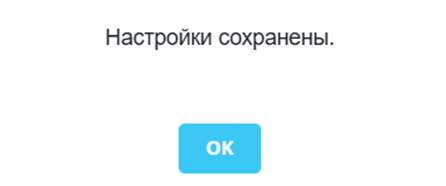
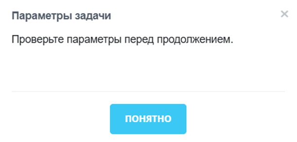
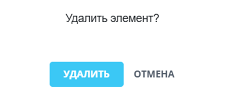
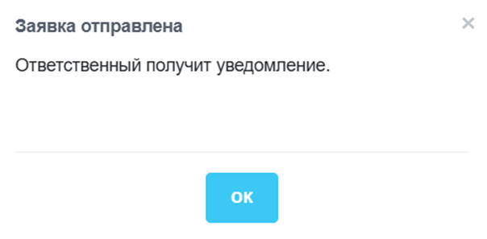
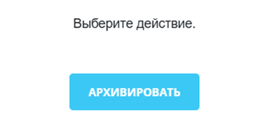

`ui.dialogs.messagebox` — модальное окно для сообщения, подтверждения действия или выбора ответа.

Компонент подходит для сценариев, где разработчику нужно показать короткий текст и обработать нажатие на кнопку `OK`, `Отмена`, `Да` или `Нет`.

В расширении доступны класс `MessageBox` и объект `MessageBoxButtons`.

`MessageBox` создает окно и задает заголовок, текст, размеры и обработчики кнопок.

`MessageBoxButtons` содержит наборы стандартных кнопок для информационного сообщения, подтверждения и выбора ответа.

## Подключить расширение

Если вы подключаете компонент из PHP, загрузите расширение `ui.dialogs.messagebox`.

```php
\Bitrix\Main\UI\Extension::load('ui.dialogs.messagebox');
```

Если вы работаете в модульном JavaScript, импортируйте `MessageBox` и `MessageBoxButtons` из `ui.dialogs.messagebox`.

```js
import { MessageBox, MessageBoxButtons } from 'ui.dialogs.messagebox';
```

## Показать сообщение

`MessageBox.alert()` открывает окно с одной кнопкой `OK`.  В первый аргумент передайте строку или DOM-узел, обработчик кнопки `OK` укажите следующим аргументом.

```js
import { MessageBox } from 'ui.dialogs.messagebox';

MessageBox.alert('Настройки сохранены.');
```

{width=446px height=186px}

Если заголовок не нужен, используйте порядок аргументов:

```js
MessageBox.alert(message, onOk, okCaption);
```

Если нужен заголовок, передайте его вторым аргументом:

```js
MessageBox.alert(message, title, onOk, okCaption);
```

Аргументы метода:

-  `message` — обязательный аргумент. Сообщение в виде строки или DOM-узла.

-  `title` — заголовок окна. Не передавайте аргумент, если заголовок не нужен.

-  `onOk` — обработчик кнопки `OK`.

-  `okCaption` — текст кнопки `OK`.

```js
import { MessageBox } from 'ui.dialogs.messagebox';

MessageBox.alert(
	'Проверьте параметры перед продолжением.',
	'Параметры задачи',
	() => true,
	'Понятно',
);
```

{width=611px height=293px}

Метод возвращает экземпляр `MessageBox`. Используйте его, если после открытия нужно закрыть окно из внешнего кода или получить доступ к методам экземпляра.

## Запросить подтверждение

`MessageBox.confirm()` открывает окно с кнопками `OK` и `Отмена`. В первый аргумент передайте строку или DOM-узел, обработчики кнопок `OK` и `Отмена` укажите следующими аргументами.

Метод подходит для удаления, отмены действия или другого сценария, где пользователь должен подтвердить операцию.

```js
import { MessageBox } from 'ui.dialogs.messagebox';

MessageBox.confirm(
	'Удалить элемент?',
	(messageBox) => {
		return BX.ajax.runAction('example.Item.delete', {
			data: {
				id: 42,
			},
		});
	},
	'Удалить',
);
```

{width=450px height=193px}

Если заголовок не нужен, используйте порядок аргументов:

```js
MessageBox.confirm(message, onOk, okCaption, onCancel, cancelCaption, useAirDesign);
```

Если нужен заголовок, передайте его вторым аргументом:

```js
MessageBox.confirm(message, title, onOk, okCaption, onCancel, cancelCaption, useAirDesign);
```

Аргументы метода:

-  `message` — обязательный аргумент. Сообщение в виде строки или DOM-узла.

-  `title` — заголовок окна. Не передавайте аргумент, если заголовок не нужен.

-  `onOk` — обработчик кнопки `OK`.

-  `okCaption` — текст кнопки `OK`.

-  `onCancel` — обработчик кнопки `Отмена`.

-  `cancelCaption` — текст кнопки `Отмена`.

-  `useAirDesign` — включает оформление Air Design для окна и кнопок.

```js
import { MessageBox } from 'ui.dialogs.messagebox';

MessageBox.confirm(
	'Отменить изменения в форме?',
	'Несохраненные данные',
	() => true,
	'Отменить изменения',
	() => false,
	'Вернуться',
	true,
);
```

`MessageBox.confirm()` возвращает экземпляр `MessageBox`, как и `MessageBox.alert()`.

## Создать окно с настройками

`MessageBox.show(options)` создает окно по объекту настроек и сразу показывает его. Метод используйте, когда нужен один вызов без дальнейшей работы с экземпляром.

```js
import { MessageBox } from 'ui.dialogs.messagebox';

MessageBox.show({
	title: 'Заявка отправлена',
	message: 'Ответственный получит уведомление.',
	modal: true,
	buttons: BX.UI.Dialogs.MessageBoxButtons.OK,
});
```

{width=604px height=297px}

`MessageBox.show(options)` не возвращает экземпляр окна.

Если после открытия нужно вызвать `close()`, `setMessage()`, `setTitle()` или изменить кнопки, создайте экземпляр `MessageBox` и вызовите `show()`.

```js
import { MessageBox } from 'ui.dialogs.messagebox';

const messageBox = new MessageBox({
	title: 'Удалить контакт',
	message: 'Контакт будет удален из адресной книги.',
	buttons: BX.UI.Dialogs.MessageBoxButtons.OK_CANCEL,
	okCaption: 'Удалить',
	cancelCaption: 'Отмена',
	onOk: () => {
		messageBox.close();
		return false;
	},
});

messageBox.show();
```

Метод `MessageBox.create(options)` создает экземпляр без показа окна. Используйте его как альтернативу конструктору, если нужно создать экземпляр через статический метод.

После создания вызовите `show()`.

## Передать параметры

Конструктор `MessageBox` и метод `MessageBox.show()` принимают объект `options`. Все параметры `options` необязательные. Без сообщения `message` окно откроется без содержимого.



Компонент не применит значение с неверным типом данных. Возможные типы значений указаны в таблице ниже. Например, `message` должен быть строкой или DOM-узлом, `title` — строкой, а `minWidth`, `minHeight` и `maxWidth` — числами.



#|
|| **Параметр** | **Тип данных** | **Описание** ||
|| `message` | `string`, `Element`, `Node` | Содержимое окна. Передайте короткий текст или DOM-узел. По умолчанию `null`. ||
|| `title` | `string` | Заголовок окна. Если заголовок передан, компонент включает увеличенный размер кнопок и показывает кнопку закрытия в заголовке, если `popupOptions.closeIcon` не задан явно. По умолчанию `null`. ||
|| `buttons` | `string`, `Array` | Набор кнопок из `MessageBoxButtons` или массив готовых кнопок `BX.UI.Button`. По умолчанию `[]`. ||
|| `modal` | `boolean` | Затемнение страницы под окном. Передайте `false`, чтобы открыть окно без затемнения. По умолчанию `true`. ||
|| `popupOptions` | `object` | Дополнительные настройки окна. Используйте их для параметров контейнера, например `zIndex` или `closeByEsc`. По умолчанию `{}`. Имеет приоритет над внутренними настройками окна. ||
|| `minWidth` | `number` | Минимальная ширина окна в пикселях. По умолчанию `300`. При увеличенном размере кнопок — `400`. ||
|| `minHeight` | `number` | Минимальная высота окна в пикселях. По умолчанию `130`. При увеличенном размере кнопок — `200`. ||
|| `maxWidth` | `number` | Максимальная ширина окна в пикселях. По умолчанию `400`. При увеличенном размере кнопок — `420`. ||
|| `cacheable` | `boolean` | Режим кеширования окна. Передайте `true`, если окно должно сохранять созданную разметку между открытиями. По умолчанию `false`. ||
|| `mediumButtonSize` | `boolean` | Размер кнопок. Если параметр не передан и есть `title`, используется увеличенный размер. Если `title` не передан, увеличенный размер не включается. ||
|| `useAirDesign` | `boolean` | Включает вариант оформления Air Design для окна и кнопок. По умолчанию `false`. ||
|| `okCaption` | `string` | Текст кнопки `OK`. По умолчанию `OK`. ||
|| `cancelCaption` | `string` | Текст кнопки `Отмена`. По умолчанию `Отмена`. ||
|| `yesCaption` | `string` | Текст кнопки `Да`. По умолчанию `Да`. ||
|| `noCaption` | `string` | Текст кнопки `Нет`. По умолчанию `Нет`. ||
|#


## Выбрать кнопки

В `buttons` передайте строковое значение из `MessageBoxButtons`. Компонент создаст кнопки с локализованными подписями.

#|
|| **Значение** | **Кнопки в окне** | **Когда использовать** ||
|| `BX.UI.Dialogs.MessageBoxButtons.OK` | `OK` | Сообщение, которое нужно закрыть одной кнопкой. ||
|| `BX.UI.Dialogs.MessageBoxButtons.CANCEL` | `Отмена` | Действие можно только отменить. ||
|| `BX.UI.Dialogs.MessageBoxButtons.YES` | `Да` | Подтверждение с одной положительной кнопкой. ||
|| `BX.UI.Dialogs.MessageBoxButtons.NO` | `Нет` | Ответ с одной отрицательной кнопкой. ||
|| `BX.UI.Dialogs.MessageBoxButtons.OK_CANCEL` | `OK`, `Отмена` | Подтверждение действия с возможностью отмены. ||
|| `BX.UI.Dialogs.MessageBoxButtons.YES_NO` | `Да`, `Нет` | Выбор между положительным и отрицательным ответом. ||
|| `BX.UI.Dialogs.MessageBoxButtons.YES_CANCEL` | `Да`, `Отмена` | Подтверждение с отменой без отрицательного ответа. ||
|| `BX.UI.Dialogs.MessageBoxButtons.YES_NO_CANCEL` | `Да`, `Нет`, `Отмена` | Выбор ответа с отдельной отменой сценария. ||
|| `BX.UI.Dialogs.MessageBoxButtons.NONE` | нет кнопок | Окно без стандартных кнопок. ||
|#


Если выбран `MessageBoxButtons.NONE`, в окне нет стандартных кнопок. Обработчики `onOk`, `onCancel`, `onYes` и `onNo` не сработают при нажатии на стандартную кнопку.

Если стандартного набора недостаточно, передайте массив кнопок `BX.UI.Button`.

```js
import { MessageBox } from 'ui.dialogs.messagebox';

const messageBox = new MessageBox({
	message: 'Выберите действие.',
	buttons: [
		new BX.UI.Button({
			text: 'Архивировать',
			color: BX.UI.Button.Color.PRIMARY,
			events: {
				click: () => messageBox.close(),
			},
		}),
	],
});

messageBox.show();
```

{width=450px height=207px}

## Обработать нажатие на кнопку

Для `new MessageBox` и `MessageBox.show` обработчики задаются в объекте параметров. Укажите обработчик для кнопки, на нажатие которой нужно отреагировать:

-  `onOk` — обработчик кнопки `OK`,

-  `onCancel` — обработчик кнопки `Отмена`,

-  `onYes` — обработчик кнопки `Да`,

-  `onNo` — обработчик кнопки `Нет`.

По умолчанию значение каждого параметра — `null`.

Обработчик получает три аргумента: экземпляр `MessageBox`, кнопку и событие нажатия.

```js
import { MessageBox } from 'ui.dialogs.messagebox';

const messageBox = new MessageBox({
	message: 'Удалить элемент?',
	buttons: BX.UI.Dialogs.MessageBoxButtons.OK_CANCEL,
	onOk: (box, button, event) => {
		return BX.ajax.runAction('example.Item.delete', {
			data: {
				id: 42,
			},
		});
	},
	onCancel: () => true,
});

messageBox.show();
```

Поведение кнопки зависит от результата обработчика:

-  если обработчик не задан, окно закрывается,

-  если обработчик возвращает `true`, окно закрывается,

-  если обработчик возвращает `false`, окно остается открытым,

-  если обработчик возвращает `Promise` или `BX.Promise`, кнопка переходит в состояние ожидания.

Если асинхронная операция завершится успешно, окно закроется. Если операция завершится с ошибкой, окно останется открытым.

На время выполнения обработчика кнопка блокируется. Это защищает сценарий от повторного нажатия до завершения текущего действия.

## Изменить окно после создания

Экземпляр `MessageBox` хранит состояние окна. После создания измените сообщение, заголовок, кнопки и подписи стандартных кнопок.

```js
import { MessageBox } from 'ui.dialogs.messagebox';

const messageBox = new MessageBox({
	message: 'Идет проверка данных.',
	buttons: BX.UI.Dialogs.MessageBoxButtons.OK,
});

messageBox.show();
messageBox.setTitle('Готово');
messageBox.setMessage('Данные проверены.');
messageBox.setOkCaption('Закрыть');
// Подписи остальных кнопок меняют `setCancelCaption()`, `setYesCaption()` и `setNoCaption()`.
```

Для закрытия окна вызовите `close()`.

```js
messageBox.close();
```

Создавайте экземпляр `MessageBox`, когда после открытия нужно управлять окном из кода. Для одноразового сообщения или подтверждения достаточно `MessageBox.alert()`, `MessageBox.confirm()` или `MessageBox.show(options)`.