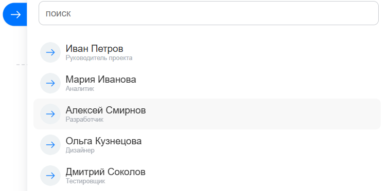
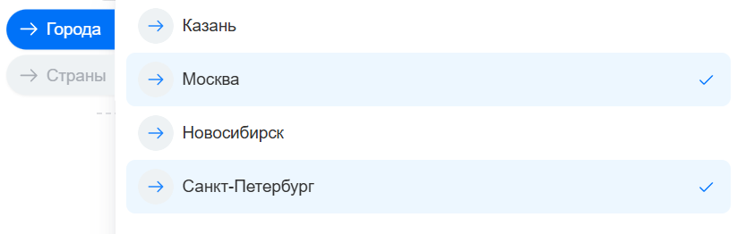
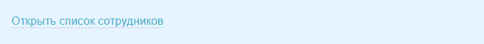

`Dialog` создает всплывающее окно со списком элементов. Элементы можно передать сразу в `items` или загрузить с сервера через типы объектов из `entities`.

Диалог подходит для кнопок «Выбрать», полей поиска и действий в формах, где пользователь должен выбрать один или несколько объектов.

В диалоге можно включить поиск, создать элемент из поисковой строки, показать недавние элементы и добавить футер со ссылками или собственной разметкой.

В примерах ниже предполагается, что класс `Dialog` импортирован из `ui.entity-selector`, а `targetNode` — существующий DOM-элемент. Полный пример подключения расширения есть в [обзоре раздела](./index.md#подключить-расширение).

## Создать диалог с локальными элементами

Используйте локальные элементы, когда список небольшой и уже известен на странице.

```js
import { Dialog } from 'ui.entity-selector';

const button = document.getElementById('responsible-button');

if (button)
{
    const dialog = new Dialog({
        id: 'responsible-dialog',
        targetNode: button,
        context: 'MY_MODULE_RESPONSIBLE',
        multiple: false,
        enableSearch: true,
        dropdownMode: true,
        tabs: [
            {
                id: 'users',
                title: 'Сотрудники',
            },
        ],
        items: [
            {
                id: 1,
                entityId: 'user',
                title: 'Иван Петров',
                subtitle: 'Руководитель проекта',
                tabs: 'users',
            },
            {
                id: 2,
                entityId: 'user',
                title: 'Мария Иванова',
                subtitle: 'Аналитик',
                tabs: 'users',
            },
        ],
        events: {
            'Item:onSelect': (event) => {
                const { item } = event.getData();

                console.log(item.getEntityId(), item.getId());
            },
        },
    });

    button.addEventListener('click', () => {
        dialog.show();
    });
}
```

После клика по кнопке откроется диалог с вкладкой «Сотрудники». При выборе элемента обработчик получит тип объекта через `item.getEntityId()` и идентификатор через `item.getId()`.

{width=754px height=372px}

Связанные методы: [Dialog.show(), Dialog.getSelectedItems()](#js-dialog), [Item.getEntityId(), Item.getId()](#js-item).

## Добавить элементы

Каждый элемент идентифицируется парой `entityId` и `id`.

- `entityId` — строковый идентификатор типа объекта: например, `user`, `department`, `project` или собственный тип объекта модуля.
- `id` — числовой или строковый идентификатор элемента внутри этого типа.

Один диалог может показывать элементы разных типов объектов. Например, элемент с `entityId: 'user'` и `id: 1` не конфликтует с элементом `entityId: 'project'` и `id: 1`.

```js
const dialog = new Dialog({
    targetNode: button,
    tabs: [
        {
            id: 'main',
            title: 'Элементы',
        },
    ],
    items: [
        {
            id: 1,
            entityId: 'project',
            title: 'Проект внедрения',
            tabs: 'main',
        },
        {
            id: 1,
            entityId: 'user',
            title: 'Иван Петров',
            tabs: 'main',
        },
        {
            id: 'USD',
            entityId: 'currency',
            title: 'Доллар США',
            tabs: 'main',
        },
    ],
    showAvatars: false,
    dropdownMode: true,
});

dialog.show();
```

В примере локальные элементы разных типов объектов передаются в `items`.

Если элементы известны на странице, передайте их в `items` или добавьте после создания диалога методом `addItem()`.

Если элементы нужно получать с сервера, настройте типы объектов в `entities` и используйте провайдер данных. Пример есть в разделе [Загрузить элементы с сервера](#загрузить-элементы-с-сервера).

Связанные методы: [Dialog.addItem(), Dialog.getItem(), Dialog.getItems(), Dialog.getEntityItems()](#js-dialog), [Item.getId(), Item.getEntityId(), Item.getEntityType()](#js-item).

## Работать с DOM-узлами элементов

`Item` хранит данные элемента, а `ItemNode` представляет его DOM-узел в конкретной вкладке или на конкретном уровне дерева.

Несколько DOM-узлов нужны, когда один и тот же элемент показывается на разных вкладках или в разных ветках древовидного списка.

Обычно к `ItemNode` обращаются для работы с деревом, фокусом, раскрытием дочерних элементов или собственным отображением узла.

Данные для отображения можно задать в параметрах элемента или в параметрах конкретного узла. Если параметры заданы только у элемента, все его DOM-узлы используют одно и то же название, подзаголовок, аватар и другие визуальные данные.

Связанные методы: [Item.createNode(), Item.getNodes(), Item.removeNode()](#js-item), [ItemNode.getItem(), ItemNode.getTab(), ItemNode.getChildren(), ItemNode.loadChildren()](#js-itemnode).

## Использовать вкладки

Вкладки группируют элементы в диалоге. Элемент попадает на вкладку, если в его параметре `tabs` указан идентификатор вкладки.

```js
const dialog = new Dialog({
    targetNode: button,
    dropdownMode: true,
    tabs: [
        {
            id: 'cities',
            title: 'Города',
            itemOrder: {
                title: 'asc',
            },
        },
        {
            id: 'countries',
            title: 'Страны',
        },
    ],
    items: [
        {
            id: 1,
            entityId: 'city',
            title: 'Москва',
            tabs: 'cities',
        },
        {
            id: 1,
            entityId: 'country',
            title: 'Россия',
            tabs: 'countries',
        },
    ],
});
```

Диалог открывается с активной вкладкой «Города». Так как `multiple` по умолчанию `true`, пользователь может отметить галочкой несколько элементов подряд.

{width=832px height=262px}

Если элемент не привязан к вкладке, он не появится в обычном списке вкладки, но может участвовать в поиске, если для него включен `searchable`.

Диалог создает две системные вкладки:

- `recents` — вкладка недавних элементов. Видима по умолчанию, но в режиме `dropdownMode` создается скрытой.
- `search` — вкладка результатов поиска. Скрыта, пока пользователь не ввел поисковую строку.

Если на вкладке нет элементов, диалог показывает заглушку. Настройте ее в параметрах вкладки: передайте текст или класс заглушки в `stub`, а дополнительные параметры — в `stubOptions`.

```js
const dialog = new Dialog({
    targetNode: button,
    tabs: [
        {
            id: 'projects',
            title: 'Проекты',
            stub: true,
            stubOptions: {
                title: 'Проекты не найдены',
                subtitle: 'Измените поисковую строку или создайте новый проект',
            },
        },
    ],
});
```

Связанные методы: [Dialog.addTab(), Dialog.getTab(), Dialog.getRecentTab(), Dialog.getSearchTab(), Dialog.selectTab()](#js-dialog), [Tab.getRootNode(), Tab.getItemMaxDepth(), Tab.setStub()](#js-tab).

## Настроить типы объектов

Тип объекта соответствует настройке `entities` и классу `Entity` в API. Он объединяет элементы с общими параметрами загрузки, поиска и отображения.

В `entities` передайте `id` типа объекта и параметры, которые нужны для сценария. По `id` сервер находит зарегистрированный PHP-провайдер, если диалог загружает или ищет элементы на сервере.



Все параметры типа объекта, включая `dynamicLoad`, `dynamicSearch`, `searchCacheLimits` и `itemOptions`, описаны в разделе [EntityOptions](#entityoptions).



```js
const dialog = new Dialog({
    targetNode: button,
    entities: [
        {
            id: 'project',
            dynamicLoad: true,
            dynamicSearch: true,
            itemOptions: {
                default: {
                    avatar: '/upload/project-default.svg',
                },
            },
        },
    ],
});
```

В примере тип объекта `project` использует серверную загрузку и поиск, а параметр `itemOptions.default.avatar` задает аватар по умолчанию для элементов этого типа.

Связанные методы: [Entity.getId(), Entity.getOptions(), Entity.hasDynamicLoad(), Entity.hasDynamicSearch()](#js-entity).

## Загрузить элементы с сервера

Для динамической загрузки передайте тип объекта в `entities`. Сервер найдет PHP-провайдер по идентификатору типа объекта.

```js
const dialog = new Dialog({
    targetNode: button,
    enableSearch: true,
    context: 'MY_MODULE_USERS',
    entities: [
        {
            id: 'user',
        },
        {
            id: 'department',
        },
    ],
});
```

Динамическую загрузку настройте по типу объекта:

- для стандартного типа объекта используйте настройки из статьи [Стандартные провайдеры](./standard-providers.md);
- если нужно явно зафиксировать загрузку в конкретном диалоге, передайте `dynamicLoad: true` в `entities`;
- для типа объекта своего модуля зарегистрируйте провайдер данных и передайте `dynamicLoad: true`.

Выберите провайдер по типу объекта:

- для пользователей, отделов, проектов, чатов и чат-ботов используйте [стандартные провайдеры](./standard-providers.md);
- для собственного типа объекта зарегистрируйте [провайдер данных](./data-providers.md).

Если элементы не загружаются, проверьте:

- `entities[].id` совпадает с `entityId` зарегистрированного провайдера;
- модуль, который регистрирует провайдер, установлен;
- метод `isAvailable()` провайдера возвращает `true` для текущего пользователя;
- для серверного поиска включен `dynamicSearch`;
- ошибки загрузки обрабатываются через `onLoadError`, `Entity:onError` или `Entity:{entityId}:onError` из раздела [События Dialog](#events-dialog).

## Настроить историю недавних элементов

Недавние элементы — это история выбора пользователя для конкретного сценария. Диалог показывает такие элементы на системной вкладке `recents`.

`context` — строковый ключ сценария. Компонент использует его, чтобы разделять историю выбора для разных форм и действий.

Для каждой формы задавайте отдельное значение, например `MY_MODULE_RESPONSIBLE` и `MY_MODULE_OBSERVERS`. Если `context` не передан, выбранный элемент не попадет в историю этого сценария.

Недавние элементы делятся на два набора:

- локальный набор относится к текущему `context`; провайдер получает его через `getRecentItems()`;
- глобальный набор объединяет другие контексты, в которых пользователь выбирал элементы тех же типов объектов; провайдер получает его через `getGlobalRecentItems()`.

`recentItemsLimit` задает, сколько недавних элементов вернуть. Сервер не возвращает больше `50` элементов.

`clearUnavailableItems` используйте, если провайдер может вернуть элементы, которые текущий пользователь больше не должен видеть. При загрузке диалога такие элементы удаляются из недавних для текущего контекста.

```js
const dialog = new Dialog({
    targetNode: button,
    context: 'MY_MODULE_RESPONSIBLE',
    recentItemsLimit: 20,
    clearUnavailableItems: true,
    entities: [
        {
            id: 'user',
            dynamicLoad: true,
        },
    ],
});
```

В примере диалог хранит историю выбора для сценария `MY_MODULE_RESPONSIBLE` и запрашивает не больше `20` недавних элементов. Если провайдер пометит элемент как недоступный, диалог удалит его из недавних для этого контекста.

Связанные методы PHP-диалога и провайдера описаны в статье [Провайдеры данных](./data-providers.md#methods).

## Настроить поиск

Параметр `enableSearch: true` включает строку поиска. По умолчанию клиентский поиск выполняется по заголовку и подзаголовку элемента.



Параметры строки поиска, включая `enableSearch` и `searchOptions`, описаны в разделе [DialogOptions](#dialogoptions).



Для серверного поиска укажите `dynamicSearch: true` в настройках типа объекта и реализуйте метод `doSearch()` в провайдере.

```js
const dialog = new Dialog({
    targetNode: button,
    enableSearch: true,
    entities: [
        {
            id: 'project',
            dynamicLoad: true,
            dynamicSearch: true,
        },
    ],
});
```

Параметр `dynamicSearch` работает только вместе с доступным PHP-провайдером. Если провайдер не зарегистрирован или недоступен текущему пользователю, серверный поиск не вернет элементы.

Связанные методы: [Dialog.search(), Dialog.clearSearch(), Dialog.focusSearch()](#js-dialog), [Entity.hasDynamicSearch(), Entity.getSearchFields(), Entity.getSearchCacheLimits()](#js-entity). Методы `SearchQuery` описаны в статье [Провайдеры данных](./data-providers.md#searchquery).

## Настроить кеширование поиска

Диалог кеширует поисковые запросы, если запрос можно кешировать и для него не нужен серверный поиск. При следующем уточнении уже загруженной строки диалог не отправляет повторный AJAX-запрос.

Провайдер может отключить кеширование конкретного серверного ответа методом `$searchQuery->setCacheable(false)`. Используйте это, если результат поиска неполный и при уточнении строки нужно снова обратиться к серверу.

Параметр `searchCacheLimits` в настройках типа объекта задает регулярные выражения для поисковых строк, которые не нужно кешировать.

```js
const dialog = new Dialog({
    targetNode: button,
    enableSearch: true,
    entities: [
        {
            id: 'project',
            dynamicSearch: true,
            searchCacheLimits: [
                '^\\d{1,3}$',
            ],
        },
    ],
});
```

```php
use Bitrix\UI\EntitySelector\Dialog;
use Bitrix\UI\EntitySelector\SearchQuery;

public function doSearch(SearchQuery $searchQuery, Dialog $dialog): void
{
    if (mb_strlen($searchQuery->getQuery()) < 3)
    {
        $searchQuery->setCacheable(false);
    }
}
```

В JavaScript-примере диалог не кеширует короткие числовые запросы, которые совпадают с регулярным выражением.

В PHP-примере провайдер отключает кеширование ответа, если поисковая строка короче трех символов.

Связанные методы: [Entity.getSearchCacheLimits(), Entity.setSearchCacheLimits()](#js-entity). Методы `SearchQuery` описаны в статье [Провайдеры данных](./data-providers.md#searchquery).

## Создать элемент из поиска

Чтобы разрешить создание элемента из поисковой строки, включите `searchOptions.allowCreateItem`. Само создание элемента реализует внешний код в обработчике события `Search:onItemCreateAsync`.

```js
const dialog = new Dialog({
    targetNode: button,
    enableSearch: true,
    searchOptions: {
        allowCreateItem: true,
        footerOptions: {
            label: 'Создать проект:',
        },
    },
    events: {
        'Search:onItemCreateAsync': (event) => {
            return new Promise((resolve) => {
                const { searchQuery } = event.getData();
                const dialog = event.getTarget();

                const item = dialog.addItem({
                    id: Date.now(),
                    entityId: 'project',
                    title: searchQuery.getQuery(),
                });

                if (item)
                {
                    item.select();
                }

                resolve();
            });
        },
    },
});
```

В примере `Date.now()` создает временный локальный идентификатор. Если элемент должен сохраниться на сервере, сначала создайте запись во внешнем коде и передайте в `id` постоянный идентификатор этой записи.

## Добавить футер

`footer` добавляет футер диалога. В него можно передать HTML-строку, DOM-узел, массив DOM-узлов или класс футера.

Строку с HTML передавайте только для доверенной статической разметки. Если футер содержит пользовательские данные или обработчики событий, создавайте DOM-узел через `Tag.render` или используйте класс футера.

Выберите способ по задаче:

- HTML-строка — для статической разметки;
- DOM-узел — для разметки с обработчиками событий;
- массив DOM-узлов — для нескольких независимых элементов;
- `TabOptions.footer` — для футера отдельной вкладки;
- `DefaultFooter` — для стандартного контейнера с собственным содержимым;
- `BaseFooter` — для полностью своей разметки футера.

### HTML-строка

Этот способ подходит, если футер содержит только статическую разметку.

```js
const dialog = new Dialog({
    targetNode: button,
    footer: `
        <a href="/company/" class="ui-selector-footer-link ui-selector-footer-link-add">
            Открыть список сотрудников
        </a>
    `,
});
```

### DOM-узел

DOM-узел используйте, если нужно добавить обработчик события или собрать футер через `Tag.render`.

```js
import { Tag } from 'main.core';

const dialog = new Dialog({
    targetNode: button,
    footer: Tag.render`
        <span class="ui-selector-footer-link" onclick="${() => openInviteSlider()}">
            Пригласить сотрудника
        </span>
    `,
});
```

### Массив DOM-узлов

Массив DOM-узлов используйте, если футер состоит из нескольких независимых элементов.

```js
import { Tag } from 'main.core';

const dialog = new Dialog({
    targetNode: button,
    footer: [
        Tag.render`
            <span class="ui-selector-footer-link" onclick="${() => openInviteSlider()}">
                Пригласить сотрудника
            </span>
        `,
        Tag.render`
            <span class="ui-selector-footer-conjunction">
                или
            </span>
        `,
        Tag.render`
            <span class="ui-selector-footer-link" onclick="${() => openGuestInviteSlider()}">
                пригласить гостя
            </span>
        `,
    ],
});
```

### Футер вкладки

Футер можно задать для отдельной вкладки. Если у вкладки задан свой футер, диалог показывает его, когда вкладка активна.

```js
const dialog = new Dialog({
    targetNode: button,
    tabs: [
        {
            id: 'users',
            title: 'Сотрудники',
            footer: '<span class="ui-selector-footer-link">Выберите сотрудника</span>',
        },
    ],
});
```

### Класс на основе DefaultFooter

Класс на основе `DefaultFooter` используйте, если нужно оставить стандартный контейнер футера и переопределить только содержимое.

```js
import { Tag } from 'main.core';
import { DefaultFooter } from 'ui.entity-selector';

class InviteFooter extends DefaultFooter
{
    getContent()
    {
        return this.cache.remember('content', () => {
            const label = this.getOption('label', 'Пригласить');

            return Tag.render`
                <span class="ui-selector-footer-link" onclick="${() => openInviteSlider()}">
                    ${label}
                </span>
            `;
        });
    }
}

const dialog = new Dialog({
    targetNode: button,
    footer: InviteFooter,
    footerOptions: {
        label: 'Пригласить сотрудника',
    },
});
```

### Класс на основе BaseFooter

Класс на основе `BaseFooter` используйте, если футеру нужна полностью своя разметка.

```js
import { Tag } from 'main.core';
import { BaseFooter } from 'ui.entity-selector';

class CustomFooter extends BaseFooter
{
    render()
    {
        return this.cache.remember('content', () => {
            const label = this.getOption('label', 'Действие');

            return Tag.render`
                <div class="my-module-selector-footer">
                    <button type="button" onclick="${() => runFooterAction()}">
                        ${label}
                    </button>
                </div>
            `;
        });
    }
}

const dialog = new Dialog({
    targetNode: button,
    footer: CustomFooter,
    footerOptions: {
        label: 'Создать элемент',
    },
});
```

Футер появляется внизу диалога, под списком элементов.

{width=689px height=64px}

Общий футер диалога можно скрыть для вкладки через `showDefaultFooter: false`.

Связанные методы: [Dialog.getFooter(), Dialog.setFooter(), Dialog.getActiveFooter()](#js-dialog), [Tab.getFooter(), Tab.setFooter(), Tab.disableDefaultFooter()](#js-tab), [BaseFooter.render() и DefaultFooter.getContent()](#js-basefooter).

<a id="constructor"></a>

## Конструктор Dialog

Конструктор создает экземпляр окна выбора на странице. После создания экземпляр можно открыть методом `show()`, связать с `TagSelector`, изменить методами класса или подписать на события.

`new Dialog(dialogOptions)` принимает объект настроек `dialogOptions`. В нем передайте DOM-узел привязки, локальные элементы или типы объектов для серверной загрузки.

Пример создания диалога с локальными элементами есть в разделе [Создать диалог с локальными элементами](#создать-диалог-с-локальными-элементами).

<a id="constructor-options"></a>

## Параметры конструктора

В конструктор `Dialog` передается объект `DialogOptions`. Внутри него используются вложенные структуры для поиска, элементов, типов объектов и вкладок.

<a id="dialogoptions"></a>

### DialogOptions

`DialogOptions` описывает окно выбора, источники элементов, режим выбора и поведение всплывающего окна.

**Источник данных**

| Параметр | Тип | Описание |
| --- | --- | --- |
| `items` | `ItemOptions[]` | Добавляет локальные элементы без загрузки с сервера |
| `selectedItems` | `ItemOptions[]` | Выбранные элементы, которые уже переданы на странице |
| `preselectedItems` | `ItemId[]` | Пары `[entityId, id]`, которые нужно загрузить как заранее выбранные элементы |
| `undeselectedItems` | `ItemId[]` | Пары `[entityId, id]`, с которых нельзя снять выбор |
| `tabs` | `TabOptions[]` | Создает вкладки диалога |
| `entities` | `EntityOptions[]` | Подключает типы объектов для загрузки элементов и поиска |

`ItemId` — пара `[entityId, id]`. В `entityId` передайте идентификатор типа объекта, в `id` — идентификатор элемента внутри этого типа.

**Поведение выбора**

| Параметр | Тип | Описание |
| --- | --- | --- |
| `multiple` | `boolean` | Разрешает множественный выбор. По умолчанию `true` |
| `hideOnSelect` | `boolean` | Закрывает диалог после выбора элемента |
| `hideOnDeselect` | `boolean` | Закрывает диалог после снятия выбора |
| `addTagOnSelect` | `boolean` | Добавляет тег при выборе элемента в связанном `TagSelector` |
| `clearSearchOnSelect` | `boolean` | Очищает поисковую строку после выбора. По умолчанию `true` |

**Поиск и загрузка**

| Параметр | Тип | Описание |
| --- | --- | --- |
| `enableSearch` | `boolean` | Включает строку поиска. По умолчанию `false` |
| `preload` | `boolean` | Загружает данные сразу при создании диалога. По умолчанию `false` |
| `searchOptions` | `SearchOptions` | Настраивает поисковую строку и создание элемента из поиска |
| `searchTabOptions` | `TabOptions` | Настраивает системную вкладку поиска |
| `recentTabOptions` | `TabOptions` | Настраивает системную вкладку недавних элементов |

```js
const dialog = new Dialog({
    targetNode: button,
    enableSearch: true,
    searchTabOptions: {
        stubOptions: {
            title: 'Ничего не найдено',
            subtitle: 'Измените поисковую строку',
        },
    },
    recentTabOptions: {
        title: 'Последние выбранные',
        itemMaxDepth: 1,
    },
});
```

**Всплывающее окно**

| Параметр | Тип | Описание |
| --- | --- | --- |
| `targetNode` | `HTMLElement` | DOM-элемент, рядом с которым открывается диалог |
| `dropdownMode` | `boolean` | Показывает диалог как выпадающий список. По умолчанию `false` |
| `autoHide` | `boolean` | Закрывает диалог при клике вне окна. По умолчанию `true` |
| `autoHideHandler` | `Function` | Проверяет, нужно ли закрыть диалог при внешнем клике |
| `hideByEsc` | `boolean` | Закрывает диалог по клавише Esc. По умолчанию `true` |
| `offsetTop` | `number` | Смещение окна по вертикали. По умолчанию `5` |
| `offsetLeft` | `number` | Смещение окна по горизонтали. По умолчанию `0` |
| `width` | `number` | Ширина диалога. По умолчанию `565` |
| `height` | `number` | Высота диалога. По умолчанию `420` |
| `cacheable` | `boolean` | Сохраняет созданное всплывающее окно для повторного открытия. По умолчанию `true` |
| `focusOnFirst` | `boolean` | Переводит фокус на первый элемент при открытии. По умолчанию `true` |
| `offsetAnimation` | `boolean` | Включает анимацию смещения. По умолчанию `true` |
| `popupOptions` | `Object` | Передает часть параметров всплывающего окна из `main.popup` |

**Заголовок, футер и вид**

| Параметр | Тип | Описание |
| --- | --- | --- |
| `header` | `string`, `HTMLElement`, `HTMLElement[]` или `Function` | Содержимое заголовка диалога |
| `headerOptions` | `Object` | Параметры заголовка |
| `footer` | `string`, `HTMLElement`, `HTMLElement[]` или `Function` | Содержимое футера диалога |
| `footerOptions` | `Object` | Параметры футера |
| `showAvatars` | `boolean` | Показывает аватары элементов. По умолчанию `true` |
| `compactView` | `boolean` | Включает компактное отображение элементов. По умолчанию `false` |
| `alwaysShowLabels` | `boolean` | Показывает подписи вкладок постоянно. По умолчанию `false` |

**Недавние элементы**

| Параметр | Тип | Описание |
| --- | --- | --- |
| `context` | `string` | Строковый ключ сценария для истории недавних элементов |
| `recentItemsLimit` | `number` | Количество недавних элементов. На сервере ограничено значением `50` |
| `clearUnavailableItems` | `boolean` | Очищает недоступные элементы из недавних для текущего контекста. По умолчанию `false` |

**Связь с TagSelector и служебные параметры**

| Параметр | Тип | Описание |
| --- | --- | --- |
| `id` | `string` | Идентификатор диалога. По нему экземпляр можно получить через `Dialog.getById(id)` |
| `tagSelector` | `TagSelector` | Связанный селектор тегов |
| `tagSelectorOptions` | `TagSelectorOptions` | Параметры селектора тегов, который создается вместе с диалогом |
| `events` | `Object` | Обработчики событий диалога |
| `customData` | `Object` | Дополнительные данные сценария, которые нужно хранить вместе с диалогом |



`popupOptions` принимает только параметры:

- `overlay`;
- `bindOptions`;
- `targetContainer`;
- `zIndexOptions`;
- `events`;
- `animation`;
- `className`;
- `focusTrap`.

Базовое поведение всплывающих окон описано в статье [Всплывающие окна и меню main.popup](../main-popup.md).



<a id="searchoptions"></a>

### SearchOptions

`SearchOptions` описывает настройки поисковой строки диалога.

| Параметр | Тип | Описание |
| --- | --- | --- |
| `allowCreateItem` | `boolean` | Разрешает создать элемент из поисковой строки через событие `Search:onItemCreateAsync`. По умолчанию `false` |
| `footerOptions` | `Object` | Передает параметры футеру поисковой вкладки. Стандартный футер использует `label` как текст перед ссылкой создания элемента |

<a id="itemoptions"></a>

### ItemOptions

`ItemOptions` описывает элемент диалога. Параметры `id` и `entityId` обязательны.

| Параметр | Тип | Описание |
| --- | --- | --- |
| `id` | `number` или `string` | Идентификатор элемента внутри типа объекта |
| `entityId` | `string` | Идентификатор типа объекта. Значение приводится к нижнему регистру |
| `entityType` | `string` | Тип элемента внутри объекта. По умолчанию `default` |
| `title` | `string` или `TextNodeOptions` | Основной текст элемента |
| `subtitle` | `string` или `TextNodeOptions` | Дополнительный текст |
| `supertitle` | `string` или `TextNodeOptions` | Текст над заголовком |
| `caption` | `string` или `TextNodeOptions` | Подпись элемента |
| `captionOptions` | `CaptionOptions` | Параметры подписи |
| `avatar` | `string` | Путь к изображению |
| `avatarOptions` | `AvatarOptions` | Параметры аватара |
| `textColor` | `string` | Цвет текста |
| `link` | `string` | Ссылка элемента. В ссылке можно использовать `#id#` и `#element_id#` |
| `linkTitle` | `string` или `TextNodeOptions` | Текст ссылки |
| `badges` | `ItemBadgeOptions[]` | Бейджи элемента |
| `badgesOptions` | `BadgesOptions` | Общие параметры бейджей |
| `tagOptions` | `Object` | Параметры тега для этого элемента |
| `tabs` | `string` или `string[]` | Вкладки, на которых нужно показать элемент |
| `searchable` | `boolean` | Включает элемент в клиентский поиск. По умолчанию `true` |
| `saveable` | `boolean` | Разрешает сохранять элемент в недавних. По умолчанию `true` |
| `deselectable` | `boolean` | Разрешает снять выбор с элемента. По умолчанию `true` |
| `selected` | `boolean` | Отмечает элемент выбранным при создании. По умолчанию `false` |
| `hidden` | `boolean` | Скрывает элемент. По умолчанию `false` |
| `locked` | `boolean` | Блокирует элемент. По умолчанию `false` |
| `children` | `ItemOptions[]` | Дочерние элементы |
| `nodeOptions` | `ItemNodeOptions` | Параметры DOM-узла элемента |
| `customData` | `Object` | Дополнительные данные сценария |
| `contextSort` | `number` | Сортировка элемента в текущем контексте |
| `globalSort` | `number` | Сортировка элемента в глобальном контексте |
| `sort` | `number` | Пользовательское поле сортировки |

<a id="entityoptions"></a>

### EntityOptions

`EntityOptions` описывает тип объекта. Для стандартных типов используйте их `id`. Для типа объекта своего модуля зарегистрируйте PHP-провайдер.

| Параметр | Тип | Описание |
| --- | --- | --- |
| `id` | `string` | Идентификатор типа объекта |
| `options` | `Object` | Параметры, которые получит PHP-провайдер в конструкторе |
| `itemOptions` | `Object` | Общие параметры `ItemOptions` для элементов этого типа объекта |
| `tagOptions` | `Object` | Общие параметры тегов этого типа объекта в `TagSelector` |
| `badgeOptions` | `Object[]` | Общие параметры бейджей для элементов этого типа объекта |
| `filters` | `Object[]` | Фильтры, которые провайдер может использовать при загрузке и поиске элементов |
| `searchable` | `boolean` | Включает тип объекта в поиск. По умолчанию `true` |
| `searchFields` | `Object[]` | Поля элемента, которые участвуют в клиентском поиске |
| `searchCacheLimits` | `string[]` | Регулярные выражения для поисковых строк, которые не нужно кешировать |
| `dynamicLoad` | `boolean` | Разрешает загружать элементы типа объекта с сервера. По умолчанию `false` |
| `dynamicSearch` | `boolean` | Разрешает искать элементы типа объекта на сервере. По умолчанию `false` |
| `dynamicSearchMatchMode` | `'all'` или `'exact'` | Режим сопоставления при динамическом поиске. По умолчанию `exact` |
| `substituteEntityId` | `string` | Идентификатор типа объекта-замены для провайдера |
| `fillRecentItems` | `boolean` | Разрешает провайдеру заполнять недавние элементы. По умолчанию `true` |

`filters` принимает массив объектов вида `{ id, options }`. В `id` передайте идентификатор зарегистрированного фильтра, в `options` — параметры, которые получит PHP-класс фильтра.

По умолчанию клиентский поиск использует поля `title` и `subtitle`. Параметр `searchFields` добавляет поля для индексации. Чтобы исключить системное поле из поиска, передайте поле с тем же `name`, `system: true` и `searchable: false`.

```js
const dialog = new Dialog({
    targetNode: button,
    enableSearch: true,
    entities: [
        {
            id: 'project',
            searchFields: [
                { name: 'code', type: 'string' },
                { name: 'title', system: true, searchable: false },
            ],
        },
    ],
});
```

`dynamicLoad` и `dynamicSearch` работают только для типа объекта, у которого зарегистрирован доступный PHP-провайдер.

<a id="taboptions"></a>

### TabOptions

`TabOptions` описывает вкладку диалога.

| Параметр | Тип | Описание |
| --- | --- | --- |
| `id` | `string` | Идентификатор вкладки |
| `title` | `string` или `TextNodeOptions` | Название вкладки |
| `visible` | `boolean` | Показывает вкладку. По умолчанию `true` |
| `itemMaxDepth` | `number` | Максимальная глубина вложенных элементов. По умолчанию `5` |
| `itemOrder` | `Object` | Порядок элементов на вкладке |
| `icon` | `string` или `Object` | Иконка вкладки. По умолчанию используется системная иконка-стрелка вправо |
| `textColor` | `string` или `Object` | Цвет текста |
| `bgColor` | `string` или `Object` | Цвет фона |
| `stub` | `boolean`, `string` или `Function` | Заглушка вкладки |
| `stubOptions` | `Object` | Параметры заглушки |
| `header` | `Object`, `Function`, `HTMLElement` или `string` | Заголовок вкладки |
| `headerOptions` | `Object` | Параметры заголовка |
| `showDefaultHeader` | `boolean` | Показывает стандартный заголовок. По умолчанию `true` |
| `footer` | `Object`, `Function`, `HTMLElement` или `string` | Футер вкладки |
| `footerOptions` | `Object` | Параметры футера |
| `showDefaultFooter` | `boolean` | Показывает стандартный футер. По умолчанию `true` |
| `showAvatars` | `boolean` | Показывает аватары элементов на вкладке |

`itemOrder` принимает объект, где ключ — поле элемента, а значение — направление сортировки `asc` или `desc`. Например: `{ title: 'asc' }`.

<a id="classes-dialog"></a>

## JS-классы Dialog

| Класс | Что делает |
| --- | --- |
| `Dialog` | Управляет окном выбора, элементами, вкладками, поиском и выбранными значениями |
| `Item` | Представляет элемент диалога |
| `ItemNode` | Представляет DOM-узел элемента в конкретной вкладке или ветке дерева |
| `Tab` | Представляет вкладку диалога |
| `Entity` | Представляет тип объекта для загрузки, поиска и общих настроек элементов |
| `ItemBadge` | Представляет бейдж элемента |
| `TextNode` | Хранит текстовое или HTML-представление надписей |
| `BaseStub` | Базовый класс заглушки вкладки |
| `DefaultStub` | Стандартная заглушка вкладки. Наследует `BaseStub` |
| `BaseHeader` | Базовый класс заголовка диалога или вкладки |
| `DefaultHeader` | Стандартный заголовок диалога или вкладки. Наследует `BaseHeader` |
| `BaseFooter` | Базовый класс футера диалога или вкладки |
| `DefaultFooter` | Стандартный футер диалога или вкладки. Наследует `BaseFooter` |

<a id="js-dialog"></a>

### Dialog

**Статические методы**

| Метод | Что делает |
| --- | --- |
| `Dialog.getById(id)` | Возвращает диалог, зарегистрированный с этим `id`, или `null` |
| `Dialog.getInstances()` | Возвращает массив всех диалогов, созданных на странице |

**Управление окном**

| Метод | Что делает |
| --- | --- |
| `show()` | Загружает данные через `load()` и показывает диалог |
| `hide()` | Закрывает диалог |
| `destroy()` | Закрывает диалог, удаляет его из внутреннего реестра и освобождает связанные ресурсы |
| `isOpen()` | Возвращает `true`, если диалог создан и показан |
| `isRendered()` | Возвращает `true`, если содержимое диалога уже отрисовано |
| `adjustPosition()` | Пересчитывает позицию диалога относительно `targetNode` |
| `freeze()` | Блокирует автоскрытие, закрытие по Esc и клавиатурную навигацию |
| `unfreeze()` | Разблокирует автоскрытие, закрытие по Esc и клавиатурную навигацию |
| `isFrozen()` | Возвращает `true`, если диалог заблокирован |
| `getPopup()` | Возвращает экземпляр всплывающего окна `main.popup` |

```js
const dialog = Dialog.getById('project-dialog');

if (dialog && dialog.isOpen())
{
    dialog.hide();
}
```

**Загрузка данных**

| Метод | Что делает |
| --- | --- |
| `load()` | Загружает типы объектов и элементы с сервера, если диалог требует динамической загрузки |
| `isLoaded()` | Возвращает `true`, если загрузка завершилась |
| `isLoading()` | Возвращает `true`, если загрузка еще идет |
| `hasDynamicLoad()` | Возвращает `true`, если хотя бы один тип объекта использует динамическую загрузку |
| `hasDynamicSearch()` | Возвращает `true`, если хотя бы один тип объекта использует серверный поиск |
| `hasRecentItems()` | Делает запрос на сервер и возвращает `Promise`, который резолвится `true`, если у диалога есть недавние элементы |

**Элементы**

| Метод | Что делает |
| --- | --- |
| `addItem(options)` | Создает элемент и регистрирует его в диалоге. Возвращает `Item` |
| `removeItem(item)` | Удаляет элемент из диалога |
| `removeItems()` | Удаляет все элементы диалога |
| `getItem(item)` | Возвращает элемент по паре `[entityId, id]`, экземпляру `Item` или объекту `{ id, entityId }` |
| `getItems()` | Возвращает все элементы диалога |
| `getEntityItems(entityId)` | Возвращает элементы одного типа объекта |
| `getSelectedItems()` | Возвращает выбранные элементы |
| `deselectAll()` | Снимает выбор со всех выбранных элементов |

```js
const item = dialog.addItem({
    id: 7,
    entityId: 'project',
    title: 'Поддержка сайта',
});

item.select();
console.log(dialog.getSelectedItems());
```

**Поиск**

| Метод | Что делает |
| --- | --- |
| `search(query)` | Запускает поиск по строке `query`. Если строка пустая, возвращает диалог к первой вкладке |
| `clearSearch()` | Очищает поле поиска |
| `focusSearch()` | Переводит фокус в поле поиска |

**Вкладки**

| Метод | Что делает |
| --- | --- |
| `addTab(tab)` | Регистрирует вкладку в диалоге. Возвращает `Tab` |
| `getTabs()` | Возвращает все вкладки диалога |
| `getTab(id)` | Возвращает вкладку по `id` |
| `getRecentTab()` | Возвращает системную вкладку недавних элементов |
| `getSearchTab()` | Возвращает вкладку поиска |
| `getActiveTab()` | Возвращает текущую активную вкладку |
| `selectTab(id)` | Переключает диалог на вкладку с указанным `id` |
| `selectFirstTab(onlyVisible)` | Переключает диалог на первую вкладку |
| `selectLastTab(onlyVisible)` | Переключает диалог на последнюю вкладку |
| `getNextTab(onlyVisible)` | Возвращает следующую вкладку рядом с активной |
| `getPreviousTab(onlyVisible)` | Возвращает предыдущую вкладку рядом с активной |
| `removeTab(id)` | Удаляет вкладку и ее содержимое |
| `expandLabels(animate)` | Разворачивает подписи вкладок |
| `collapseLabels(animate)` | Сворачивает подписи вкладок |

**Типы объектов**

| Метод | Что делает |
| --- | --- |
| `addEntity(entity)` | Регистрирует тип объекта в диалоге. Возвращает `Entity` |
| `getEntity(id)` | Возвращает тип объекта по `id` |
| `hasEntity(id)` | Проверяет наличие типа объекта по `id` |
| `getEntities()` | Возвращает все зарегистрированные типы объектов |
| `removeEntity(id)` | Удаляет тип объекта вместе с его элементами |
| `removeEntityItems(id)` | Удаляет только элементы указанного типа объекта, не удаляя сам тип объекта |

**Заголовок и футер**

| Метод | Что делает |
| --- | --- |
| `getHeader()` | Возвращает заголовок диалога |
| `setHeader(content, options)` | Задает заголовок диалога |
| `getActiveHeader()` | Возвращает заголовок, который показывается для текущей активной вкладки |
| `getFooter()` | Возвращает футер диалога |
| `setFooter(content, options)` | Задает футер диалога |
| `getActiveFooter()` | Возвращает футер, который показывается для текущей активной вкладки |

**Недавние и заранее выбранные элементы**

| Метод | Что делает |
| --- | --- |
| `setPreselectedItems(itemIds)` | Задает список заранее выбранных элементов |
| `getPreselectedItems()` | Возвращает список заранее выбранных элементов |
| `setUndeselectedItems(itemIds)` | Задает список элементов, с которых нельзя снять выбор |
| `setRecentItemsLimit(limit)` | Задает лимит недавних элементов |
| `getRecentItemsLimit()` | Возвращает лимит недавних элементов |
| `shouldClearUnavailableItems()` | Возвращает `true`, если недоступные элементы удаляются из недавних для текущего контекста |
| `saveRecentItem(item)` | Сохраняет элемент как недавний для текущего контекста |

**Связь с TagSelector**

| Метод | Что делает |
| --- | --- |
| `getTagSelector()` | Возвращает связанный `TagSelector` |
| `setTagSelector(tagSelector)` | Задает связанный `TagSelector` |
| `getTagSelectorMode()` | Возвращает режим связи: `INSIDE`, `OUTSIDE` или `null` |
| `isTagSelectorInside()` | Возвращает `true`, если `TagSelector` находится внутри диалога |
| `isTagSelectorOutside()` | Возвращает `true`, если `TagSelector` находится вне диалога |
| `getTagSelectorQuery()` | Возвращает текущий текст в поле связанного `TagSelector` |

**Внешний вид и поведение**

| Метод | Что делает |
| --- | --- |
| `isMultiple()` | Возвращает `true`, если разрешен множественный выбор |
| `setTargetNode(node)` | Задает DOM-элемент привязки диалога |
| `getTargetNode()` | Возвращает DOM-элемент привязки диалога |
| `setShowAvatars(flag)` | Управляет показом аватаров элементов |
| `shouldShowAvatars()` | Возвращает `true`, если аватары элементов нужно показывать |
| `isCompactView()` | Возвращает `true`, если включен компактный режим |
| `setAutoHide(flag)` | Управляет автоматическим закрытием при клике вне окна |
| `isAutoHide()` | Возвращает `true`, если включено автоматическое закрытие при клике вне окна |
| `setAutoHideHandler(handler)` | Задает функцию, которая решает, закрывать ли диалог при внешнем клике |
| `setHideByEsc(flag)` | Управляет закрытием по клавише Esc |
| `shouldHideByEsc()` | Возвращает `true`, если диалог закрывается по клавише Esc |
| `setHideOnSelect(flag)` | Управляет закрытием после выбора элемента |
| `shouldHideOnSelect()` | Возвращает `true`, если диалог закрывается после выбора элемента |
| `setHideOnDeselect(flag)` | Управляет закрытием после снятия выбора |
| `shouldHideOnDeselect()` | Возвращает `true`, если диалог закрывается после снятия выбора |
| `setClearSearchOnSelect(flag)` | Управляет очисткой поля поиска после выбора |
| `shouldClearSearchOnSelect()` | Возвращает `true`, если поле поиска очищается после выбора |
| `setAddTagOnSelect(flag)` | Управляет добавлением тега в связанный `TagSelector` при выборе |
| `shouldAddTagOnSelect()` | Возвращает `true`, если тег добавляется в связанный `TagSelector` при выборе |
| `getWidth()` | Возвращает ширину диалога |
| `setWidth(width)` | Задает ширину диалога |
| `getHeight()` | Возвращает высоту диалога |
| `setHeight(height)` | Задает высоту диалога и возвращает `Promise` |
| `getOffsetLeft()` | Возвращает смещение по горизонтали |
| `setOffsetLeft(offset)` | Задает смещение по горизонтали |
| `getOffsetTop()` | Возвращает смещение по вертикали |
| `setOffsetTop(offset)` | Задает смещение по вертикали |
| `setOffsetAnimation(flag)` | Включает или выключает анимацию смещения |
| `getZindex()` | Возвращает текущий z-index всплывающего окна |
| `isCacheable()` | Возвращает `true`, если диалог можно использовать повторно |
| `setCacheable(flag)` | Управляет повторным использованием созданного диалога |
| `shouldFocusOnFirst()` | Возвращает `true`, если при открытии фокус переводится на первый элемент |
| `setFocusOnFirst(flag)` | Управляет переводом фокуса на первый элемент при открытии |
| `focusOnFirstNode()` | Переводит фокус на первый элемент активной вкладки. Возвращает узел, на который переведен фокус |
| `getFocusedNode()` | Возвращает элемент в фокусе |
| `clearNodeFocus()` | Снимает фокус с элемента |
| `isDropdownMode()` | Возвращает `true`, если диалог показывается как выпадающий список |

**Служебные данные**

| Метод | Что делает |
| --- | --- |
| `getId()` | Возвращает идентификатор диалога |
| `getContext()` | Возвращает контекст диалога |
| `setCustomData(property, value)` | Задает пользовательские данные диалога |
| `getCustomData(property)` | Возвращает пользовательские данные диалога |
| `setOptions(dialogOptions)` | Применяет к диалогу новые параметры |
| `showLoader()` | Показывает индикатор загрузки |
| `hideLoader()` | Скрывает индикатор загрузки |
| `destroyLoader()` | Удаляет индикатор загрузки |
| `getContainer()` | Возвращает DOM-контейнер диалога |
| `getTabsContainer()` | Возвращает DOM-контейнер вкладок |
| `getTabContentsContainer()` | Возвращает DOM-контейнер содержимого вкладок |
| `getLabelsContainer()` | Возвращает DOM-контейнер подписей вкладок |
| `getHeaderContainer()` | Возвращает DOM-контейнер заголовка |
| `getFooterContainer()` | Возвращает DOM-контейнер футера |

<a id="js-item"></a>

### Item

`new Item(itemOptions)` создает элемент. Параметры `id` и `entityId` обязательны, иначе конструктор выбрасывает исключение.

| Метод | Что делает |
| --- | --- |
| `getId()` | Возвращает идентификатор элемента |
| `getEntityId()` | Возвращает идентификатор типа объекта |
| `getEntityType()` | Возвращает тип элемента внутри объекта |
| `getEntity()` | Возвращает тип объекта `Entity`, к которому относится элемент |
| `getDialog()` | Возвращает диалог, к которому привязан элемент |
| `getTitle()` | Возвращает заголовок элемента |
| `setTitle(title)` | Задает заголовок элемента |
| `getSubtitle()` | Возвращает подзаголовок |
| `setSubtitle(subtitle)` | Задает подзаголовок |
| `getSupertitle()` | Возвращает текст над заголовком |
| `setSupertitle(supertitle)` | Задает текст над заголовком |
| `getCaption()` | Возвращает подпись элемента |
| `setCaption(caption)` | Задает подпись элемента |
| `getAvatar()` | Возвращает путь к аватару |
| `setAvatar(avatar)` | Задает путь к аватару |
| `getTextColor()` | Возвращает цвет текста |
| `setTextColor(color)` | Задает цвет текста |
| `getLink()` | Возвращает ссылку элемента |
| `setLink(link)` | Задает ссылку элемента |
| `getBadges()` | Возвращает бейджи элемента |
| `setBadges(badges)` | Задает бейджи элемента |
| `select(selectOptions)` | Выбирает элемент |
| `deselect(deselectOptions)` | Снимает выбор с элемента |
| `isSelected()` | Возвращает `true`, если элемент выбран |
| `lock()` | Блокирует элемент |
| `unlock()` | Разблокирует элемент |
| `isLocked()` | Возвращает `true`, если элемент заблокирован |
| `setDeselectable(flag)` | Управляет возможностью снять выбор с элемента |
| `isDeselectable()` | Возвращает `true`, если с элемента можно снять выбор |
| `setSearchable(flag)` | Управляет участием элемента в поиске |
| `isSearchable()` | Возвращает `true`, если элемент участвует в поиске |
| `setSaveable(flag)` | Управляет сохранением элемента в недавних |
| `isSaveable()` | Возвращает `true`, если элемент сохраняется в недавних |
| `setHidden(flag)` | Управляет видимостью элемента |
| `isHidden()` | Возвращает `true`, если элемент скрыт |
| `setContextSort(sort)` | Задает сортировку в текущем контексте |
| `getContextSort()` | Возвращает сортировку в текущем контексте |
| `setGlobalSort(sort)` | Задает глобальную сортировку |
| `getGlobalSort()` | Возвращает глобальную сортировку |
| `setSort(sort)` | Задает пользовательскую сортировку |
| `getSort()` | Возвращает пользовательскую сортировку |
| `createNode(nodeOptions)` | Создает DOM-узел элемента |
| `removeNode(node)` | Удаляет DOM-узел элемента |
| `getNodes()` | Возвращает DOM-узлы элемента |
| `getCustomData()` | Возвращает пользовательские данные элемента |
| `setCustomData(property, value)` | Задает пользовательские данные элемента |
| `createTag()` | Создает набор параметров для тега в `TagSelector` |

<a id="js-itemnode"></a>

### ItemNode

`ItemNode` представляет DOM-узел элемента в конкретной вкладке или ветке дерева. Диалог создает узлы автоматически.

| Метод | Что делает |
| --- | --- |
| `getItem()` | Возвращает элемент узла. Для корневого узла вкладки возвращает `null` |
| `getTab()` | Возвращает вкладку узла |
| `getParentNode()` | Возвращает родительский узел |
| `getChildren()` | Возвращает дочерние узлы |
| `hasChildren()` | Возвращает `true`, если у узла есть дочерние узлы |
| `getFirstChild()` | Возвращает первый дочерний узел |
| `getLastChild()` | Возвращает последний дочерний узел |
| `getNextSibling()` | Возвращает следующий соседний узел |
| `getPreviousSibling()` | Возвращает предыдущий соседний узел |
| `isRoot()` | Возвращает `true`, если узел корневой |
| `getDepthLevel()` | Возвращает глубину в дереве |
| `isOpen()` | Возвращает `true`, если узел раскрыт |
| `setOpen(flag)` | Управляет раскрытием узла |
| `expand()` | Раскрывает узел |
| `collapse()` | Сворачивает узел |
| `isDynamic()` | Возвращает `true`, если узел использует динамическую загрузку |
| `setDynamic(flag)` | Управляет динамической загрузкой дочерних элементов |
| `isLoaded()` | Возвращает `true`, если дочерние элементы загружены |
| `loadChildren()` | Загружает дочерние элементы |
| `select()` | Визуально выбирает узел |
| `deselect()` | Снимает визуальный выбор с узла |
| `focus()` | Переводит фокус на узел |
| `unfocus()` | Снимает фокус с узла |
| `isFocused()` | Возвращает `true`, если узел в фокусе |
| `click()` | Обрабатывает клик по узлу |
| `setHidden(flag)` | Управляет видимостью узла |
| `isHidden()` | Возвращает `true`, если узел скрыт |
| `lock()` | Визуально блокирует узел |
| `unlock()` | Визуально разблокирует узел |
| `scrollIntoView()` | Прокручивает список к узлу |
| `getTitle()` | Возвращает заголовок узла |
| `setTitle(title)` | Задает заголовок узла |
| `getAvatar()` | Возвращает аватар узла |
| `setAvatar(avatar)` | Задает аватар узла |
| `getLink()` | Возвращает ссылку узла |
| `setLink(link)` | Задает ссылку узла |
| `setHighlights(highlights)` | Задает фрагменты для подсветки найденного текста |
| `getHighlights()` | Возвращает фрагменты для подсветки найденного текста |
| `highlight()` | Применяет подсветку найденного текста |

<a id="js-tab"></a>

### Tab

`new Tab(dialog, tabOptions)` создает вкладку. Параметр `id` обязателен.

| Метод | Что делает |
| --- | --- |
| `getId()` | Возвращает идентификатор вкладки |
| `getDialog()` | Возвращает диалог вкладки |
| `getRootNode()` | Возвращает корневой узел дерева элементов вкладки |
| `setTitle(title)` | Задает название вкладки |
| `getTitle()` | Возвращает название вкладки |
| `setIcon(icon)` | Задает иконку вкладки для состояния |
| `getIcon(state)` | Возвращает иконку вкладки для состояния |
| `setBgColor(color)` | Задает цвет фона вкладки |
| `getBgColor(state)` | Возвращает цвет фона вкладки для состояния |
| `setTextColor(color)` | Задает цвет текста вкладки |
| `getTextColor(state)` | Возвращает цвет текста вкладки для состояния |
| `setItemMaxDepth(depth)` | Задает максимальную глубину вложенности |
| `getItemMaxDepth()` | Возвращает максимальную глубину вложенности |
| `getStub()` | Возвращает заглушку вкладки |
| `setStub(stub, stubOptions)` | Задает заглушку вкладки |
| `getHeader()` | Возвращает заголовок вкладки |
| `setHeader(content, options)` | Задает заголовок вкладки |
| `canShowDefaultHeader()` | Возвращает `true`, если можно показать стандартный заголовок |
| `enableDefaultHeader()` | Включает показ стандартного заголовка |
| `disableDefaultHeader()` | Отключает показ стандартного заголовка |
| `getFooter()` | Возвращает футер вкладки |
| `setFooter(content, options)` | Задает футер вкладки |
| `canShowDefaultFooter()` | Возвращает `true`, если можно показать стандартный футер |
| `enableDefaultFooter()` | Включает показ стандартного футера |
| `disableDefaultFooter()` | Отключает показ стандартного футера |
| `isVisible()` | Возвращает `true`, если вкладка видима |
| `setVisible(flag)` | Управляет видимостью вкладки |
| `select()` | Выбирает вкладку |
| `deselect()` | Снимает выбор вкладки |
| `isSelected()` | Возвращает `true`, если вкладка выбрана |
| `hover()` | Включает состояние наведения |
| `unhover()` | Снимает состояние наведения |
| `isHovered()` | Возвращает `true`, если вкладка в состоянии наведения |
| `lock()` | Блокирует вкладку |
| `unlock()` | Разблокирует вкладку |
| `isLocked()` | Возвращает `true`, если вкладка заблокирована |
| `setShowAvatars(flag)` | Управляет показом аватаров на вкладке |
| `shouldShowAvatars()` | Возвращает `true`, если на вкладке нужно показывать аватары |
| `isRendered()` | Возвращает `true`, если вкладка отрисована |

<a id="js-entity"></a>

### Entity

`new Entity(entityOptions)` создает тип объекта. Параметр `id` обязателен.

| Метод | Что делает |
| --- | --- |
| `getId()` | Возвращает идентификатор типа объекта |
| `getOptions()` | Возвращает параметры, которые получит PHP-провайдер |
| `getItemOptions()` | Возвращает общие параметры элементов этого типа объекта |
| `getItemOption(option, entityType)` | Возвращает общий параметр элемента этого типа объекта |
| `getTagOptions()` | Возвращает общие параметры тегов этого типа объекта |
| `getTagOption(option, entityType)` | Возвращает общий параметр тега этого типа объекта |
| `getBadges(item)` | Возвращает бейджи для элемента |
| `Entity.getItemOption(entityId, option, entityType)` | Возвращает общий параметр элемента без создания экземпляра |
| `Entity.getTagOption(entityId, option, entityType)` | Возвращает общий параметр тега без создания экземпляра |
| `isSearchable()` | Возвращает `true`, если тип объекта участвует в поиске |
| `setSearchable(flag)` | Управляет участием типа объекта в поиске |
| `getSearchFields()` | Возвращает поля клиентского поиска |
| `setSearchFields(searchFields)` | Задает поля клиентского поиска |
| `setSearchCacheLimits(limits)` | Задает ограничения кеша поиска |
| `getSearchCacheLimits()` | Возвращает ограничения кеша поиска |
| `hasDynamicLoad()` | Возвращает `true`, если включена серверная загрузка элементов |
| `setDynamicLoad(flag)` | Управляет серверной загрузкой элементов |
| `hasDynamicSearch()` | Возвращает `true`, если включен серверный поиск |
| `setDynamicSearch(flag)` | Управляет серверным поиском |
| `getDynamicSearchMatchMode()` | Возвращает режим сопоставления при серверном поиске |
| `setDynamicSearchMatchMode(mode)` | Задает режим сопоставления при серверном поиске |
| `getFilters()` | Возвращает фильтры типа объекта |
| `addFilter(filterOptions)` | Добавляет фильтр типа объекта |
| `addFilters(filtersOptions)` | Добавляет массив фильтров типа объекта |
| `getFilter(id)` | Возвращает фильтр типа объекта по идентификатору |
| `getSubstituteEntityId()` | Возвращает идентификатор типа объекта-замены для провайдера |
| `shouldFillRecentItems()` | Возвращает `true`, если провайдер может заполнять недавние элементы |

### ItemBadge

`new ItemBadge(badgeOptions)` создает бейдж элемента.

| Метод | Что делает |
| --- | --- |
| `getTitle()` | Возвращает текст бейджа |
| `setTitle(title)` | Задает текст бейджа |
| `getTextColor()` | Возвращает цвет текста |
| `setTextColor(color)` | Задает цвет текста |
| `getBgColor()` | Возвращает цвет фона |
| `setBgColor(color)` | Задает цвет фона |
| `getBorder()` | Возвращает CSS-значение рамки |
| `setBorder(border)` | Задает CSS-значение рамки |
| `renderTo(target)` | Отрисовывает бейдж внутри DOM-элемента |

### TextNode

`new TextNode(options)` создает текстовый узел. Класс используют `Item`, `ItemNode` и `ItemBadge` для полей `title`, `subtitle`, `caption` и похожих параметров.

| Метод | Что делает |
| --- | --- |
| `getText()` | Возвращает текст узла |
| `getType()` | Возвращает тип содержимого: `TEXT`, `HTML` или `null` |
| `isNullable()` | Возвращает `true`, если текст не задан |
| `renderTo(element)` | Вставляет текст в DOM-элемент как текст или HTML |
| `toString()` | Возвращает текст узла или пустую строку |

### BaseStub

`new BaseStub(tab, options)` создает базовую заглушку вкладки. Метод `render()` нужно переопределить в наследнике.

| Метод | Что делает |
| --- | --- |
| `render()` | Строит содержимое заглушки. Базовая реализация выбрасывает исключение |
| `getTab()` | Возвращает вкладку заглушки |
| `isAutoShow()` | Возвращает `true`, если заглушка показывается автоматически при пустом списке |
| `show()` | Показывает заглушку |
| `hide()` | Скрывает заглушку |
| `getOptions()` | Возвращает параметры заглушки |
| `getOption(option, defaultValue)` | Возвращает параметр заглушки |

### DefaultStub

`DefaultStub` наследует `BaseStub` и строит стандартную заглушку вкладки. Используйте его, если нужно изменить текст, иконку или стрелку стандартной заглушки через `stubOptions`.

| Параметр `stubOptions` | Что делает |
| --- | --- |
| `title` | Задает заголовок заглушки. Если параметр не задан, используется заголовок вкладки |
| `subtitle` | Задает подзаголовок заглушки |
| `icon` | Задает иконку заглушки. Если параметр не задан, используется иконка вкладки |
| `iconOpacity` | Задает прозрачность иконки от `0` до `100` |
| `arrow` | Показывает стрелку к активному футеру, если у диалога или вкладки есть футер |

```js
const dialog = new Dialog({
    targetNode: button,
    tabs: [
        {
            id: 'projects',
            title: 'Проекты',
            stub: true,
            stubOptions: {
                title: 'Проекты не найдены',
                subtitle: 'Создайте проект или измените фильтр',
                arrow: true,
            },
            footer: '<span class="ui-selector-footer-link ui-selector-footer-link-add">Создать проект</span>',
        },
    ],
});
```

### BaseHeader

`new BaseHeader(context, options)` создает базовый заголовок. В `context` передайте `Dialog` или `Tab`. Метод `render()` нужно переопределить в наследнике.

| Метод | Что делает |
| --- | --- |
| `getDialog()` | Возвращает диалог заголовка |
| `getTab()` | Возвращает вкладку заголовка или `null`, если заголовок общий для диалога |
| `show()` | Показывает заголовок |
| `hide()` | Скрывает заголовок |
| `getOptions()` | Возвращает параметры заголовка |
| `getOption(option, defaultValue)` | Возвращает параметр заголовка |
| `getContainer()` | Возвращает DOM-контейнер заголовка |
| `render()` | Строит содержимое заголовка. Базовая реализация выбрасывает исключение |

### DefaultHeader

`DefaultHeader` наследует `BaseHeader` и реализует стандартный контейнер заголовка.

| Метод | Что делает |
| --- | --- |
| `render()` | Строит DOM заголовка и вставляет содержимое |
| `getContent()` | Возвращает содержимое заголовка |
| `setContent(content)` | Задает содержимое заголовка |

```js
import { DefaultHeader } from 'ui.entity-selector';

class ProjectHeader extends DefaultHeader
{
    getContent()
    {
        return this.getOption('title', 'Выберите проект');
    }
}

const dialog = new Dialog({
    targetNode: button,
    header: ProjectHeader,
    headerOptions: {
        title: 'Проекты',
    },
});
```

<a id="js-basefooter"></a>

### BaseFooter

`new BaseFooter(context, options)` создает базовый футер. В `context` передайте `Dialog` или `Tab`.

| Метод | Что делает |
| --- | --- |
| `getDialog()` | Возвращает диалог футера |
| `getTab()` | Возвращает вкладку футера или `null`, если футер общий для диалога |
| `show()` | Показывает футер |
| `hide()` | Скрывает футер |
| `getOptions()` | Возвращает параметры футера |
| `getOption(option, defaultValue)` | Возвращает параметр футера |
| `getContainer()` | Возвращает DOM-контейнер футера |
| `render()` | Строит содержимое футера. Базовая реализация выбрасывает исключение |

### DefaultFooter

`DefaultFooter` наследует `BaseFooter` и реализует стандартный контейнер футера.

| Метод | Что делает |
| --- | --- |
| `render()` | Строит DOM футера и вставляет содержимое |
| `getContent()` | Возвращает содержимое футера |
| `setContent(content)` | Задает содержимое футера |

<a id="events-dialog"></a>

## События Dialog

Передайте обработчики в параметр `events`. События приходят через объект `BaseEvent`, данные доступны через `event.getData()`.

События с префиксом `onBefore...` можно отменять через `event.preventDefault()`. Обработчик `Search:onItemCreateAsync` должен вернуть `Promise`, если создание элемента выполняется асинхронно.

```js
const dialog = new Dialog({
    targetNode: button,
    events: {
        'Item:onBeforeDeselect': (event) => {
            const { item } = event.getData();

            if (!item.isDeselectable())
            {
                event.preventDefault();
            }
        },
        'Item:onSelect': (event) => {
            const { item } = event.getData();

            console.log(item.getEntityId(), item.getId());
        },
    },
});
```

| Событие | Данные события | Когда происходит |
| --- | --- | --- |
| `onBeforeSearch` | `query` | При запуске поиска, до выполнения поиска |
| `onSearch` | `query` | При запуске поиска |
| `Search:onItemCreateAsync` | `searchQuery` | При создании элемента из поисковой строки |
| `onLoad` | Нет | При успешной загрузке данных |
| `onLoadError` | `error` | При ошибке загрузки |
| `onShow` | Нет | При открытии диалога |
| `onFirstShow` | Нет | При первом открытии диалога |
| `onHide` | Нет | При закрытии диалога |
| `onDestroy` | Нет | При уничтожении диалога |
| `Item:onBeforeSelect` | `item`, `node` | При выборе элемента, до подтверждения |
| `Item:onSelect` | `item`, `node` | При выборе элемента |
| `Item:onBeforeDeselect` | `item`, `node` | При снятии выбора, до подтверждения |
| `Item:onDeselect` | `item`, `node` | При снятии выбора |
| `Item:onBeforeLock` | `item` | При блокировке элемента, до подтверждения |
| `Item:onLock` | `item` | При блокировке элемента |
| `Item:onBeforeUnlock` | `item` | При разблокировке элемента, до подтверждения |
| `Item:onUnlock` | `item` | При разблокировке элемента |
| `ItemNode:onFocus` | `node` | При получении фокуса узлом элемента |
| `ItemNode:onUnfocus` | `node` | При снятии фокуса с узла элемента |
| `ItemNode:onLinkClick` | `node`, `event` | При клике по ссылке элемента |
| `Tab:onSelect` | `tab` | При выборе вкладки |
| `Tab:onDeselect` | `tab` | При снятии выбора с вкладки |
| `SearchTab:onLoad` | `searchTab` | При загрузке вкладки поиска |
| `Entity:onError` | `errors` | При ошибках типов объектов |
| `Entity:{entityId}:onError` | `errors` | При ошибках конкретного типа объекта |



```js
const dialog = new Dialog({
    targetNode: button,
    enableSearch: true,
    searchOptions: {
        allowCreateItem: true,
        footerOptions: {
            label: 'Создать проект:',
        },
    },
    events: {
        'Search:onItemCreateAsync': (event) => {
            return new Promise((resolve) => {
                const { searchQuery } = event.getData();
                const dialog = event.getTarget();

                const item = dialog.addItem({
                    id: Date.now(),
                    entityId: 'project',
                    title: searchQuery.getQuery(),
                    tabs: 'projects',
                });

                if (item)
                {
                    item.select();
                }

                dialog.selectTab('projects');
                resolve();
            });
        },
    },
});
```


