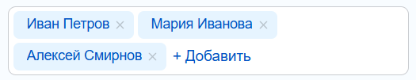

`TagSelector` показывает выбранные элементы в виде тегов. Виджет можно использовать отдельно или связать с `Dialog`, чтобы пользователь выбирал элементы из диалога.

TagSelector подходит для множественного выбора участников, наблюдателей и связанных объектов, где выбранные значения должны оставаться видимыми в форме.

Параметры селектора описаны в разделе [TagSelectorOptions](#tagselectoroptions), настройки связанного диалога — в статьях [Dialog](./dialog.md) и [DialogOptions](./dialog.md#dialogoptions).

## Создать TagSelector

Передайте контейнер в `renderTo()`. Начальные теги можно задать в `items`.

```js
import { TagSelector } from 'ui.entity-selector';

const container = document.getElementById('observers-selector');

if (container)
{
    const selector = new TagSelector({
        multiple: true,
        addButtonCaption: 'Добавить',
        items: [
            {
                id: 1,
                entityId: 'user',
                title: 'Иван Петров',
                deselectable: false,
            },
        ],
        events: {
            onBeforeTagRemove: (event) => {
                const { tag } = event.getData();

                if (!tag.isDeselectable())
                {
                    event.preventDefault();
                }
            },
        },
    });

    selector.renderTo(container);
}
```

Каждый тег показывает заголовок элемента и кнопку удаления. Так как `multiple: true`, пользователь может добавить несколько тегов подряд через кнопку «Добавить».

{width=525px height=101px}

На изображении показан `TagSelector` с одним выбранным тегом и кнопкой добавления.

Тег, как и элемент диалога, определяется парой `entityId` и `id`. В примере тег нельзя удалить, потому что у элемента задано `deselectable: false`, а обработчик `onBeforeTagRemove` отменяет удаление через `event.preventDefault()`.

## Связать TagSelector с Dialog

Если передать `dialogOptions`, `TagSelector` создаст связанный `Dialog`. При выборе элемента в диалоге тег добавится в поле, а при удалении тега выбор снимется в диалоге.

```js
import { TagSelector } from 'ui.entity-selector';

const container = document.getElementById('observers-selector');

if (container)
{
    const selector = new TagSelector({
        multiple: true,
        addButtonCaption: 'Выбрать',
        dialogOptions: {
            targetNode: container,
            context: 'MY_MODULE_OBSERVERS',
            enableSearch: true,
            entities: [
                {
                    id: 'user',
                    dynamicLoad: true,
                    dynamicSearch: true,
                },
            ],
            preselectedItems: [
                ['user', 1],
            ],
            events: {
                'Item:onDeselect': (event) => {
                    const { item } = event.getData();

                    console.log(item.getEntityId(), item.getId());
                },
            },
        },
    });

    selector.renderTo(container);
}
```

Передавайте в `dialogOptions.targetNode` реальный DOM-элемент. `TagSelector` отрисовывается в контейнер, а диалог использует тот же элемент как точку привязки.

Для стандартных типов объектов используйте `entityId` из статьи [Стандартные провайдеры](./standard-providers.md). Для собственного типа объекта зарегистрируйте [провайдер данных](./data-providers.md), чтобы `dynamicLoad`, `dynamicSearch` и `preselectedItems` могли получить данные с сервера.

## Передать выбранные элементы

Для локальных данных используйте `items` в `TagSelector` или `selectedItems` в `Dialog`.

| Что нужно сделать | Где передать | Что передавать |
| --- | --- | --- |
| Показать готовые локальные теги | `TagSelector.items` | Объекты с `id`, `entityId`, `title` и параметрами тега |
| Открыть диалог с локально выбранными элементами | `Dialog.selectedItems` внутри `dialogOptions` | Полные локальные элементы `ItemOptions` |
| Загрузить выбранные элементы с сервера | `dialogOptions.preselectedItems` | Пары `[entityId, id]`, которые обработает провайдер |

```js
const selector = new TagSelector({
    items: [
        {
            id: 1,
            entityId: 'user',
            title: 'Иван Петров',
        },
    ],
});
```

Если данные выбранных элементов должен вернуть провайдер, передайте идентификаторы в `dialogOptions.preselectedItems`.

```js
const selector = new TagSelector({
    dialogOptions: {
        targetNode: container,
        entities: [
            {
                id: 'user',
                dynamicLoad: true,
            },
        ],
        preselectedItems: [
            ['user', 1],
            ['user', 2],
        ],
    },
});
```

`preselectedItems` содержит пары `[entityId, id]`. Провайдер вернет данные элементов в методе `getPreselectedItems()` или `getItems()`. Связь `preselectedItems` с PHP-провайдером описана в статье [Провайдеры данных](./data-providers.md#js-php).

## Настроить ввод

`showTextBox` показывает текстовое поле. В обработчиках `onInput`, `onEnter` и `onMetaEnter` можно обработать ввод и создать теги программно.

```js
const selector = new TagSelector({
    showTextBox: true,
    placeholder: 'Введите название',
    events: {
        onEnter: (event) => {
            const selector = event.getTarget();
            const title = selector.getTextBoxValue().trim();

            if (title !== '')
            {
                selector.addTag({
                    id: Date.now(),
                    entityId: 'manual',
                    title,
                });

                selector.clearTextBox();
            }
        },
    },
});
```

В примере `Date.now()` создает временный локальный идентификатор, а `clearTextBox()` очищает поле после добавления тега. Если тег связан с серверным объектом, используйте постоянный `id` этого объекта.

## Ограничить доступность селектора

Если `readonly: true`, пользователь не сможет изменить выбранные теги. Если `locked: true`, селектор блокирует интерактивность.

| Параметр | Что блокирует | Когда использовать |
| --- | --- | --- |
| `readonly` | Изменение выбранных тегов | Когда форму нужно показать без редактирования выбора |
| `locked` | Интерактивность селектора | Когда нужно временно заблокировать поле на время внешнего действия |
| `deselectable` | Удаление конкретного тега или всех тегов по умолчанию | Когда часть выбранных значений должна остаться в форме |

<a id="constructor"></a>

## Конструктор TagSelector

Конструктор создает экземпляр поля с тегами. После создания отрисуйте экземпляр в DOM методом `renderTo()`.

`new TagSelector(selectorOptions)` принимает объект настроек `selectorOptions`. В нем передайте начальные теги, параметры отображения, обработчики событий и настройки связанного диалога.

Пример создания поля с тегами есть в разделе [Создать TagSelector](#создать-tagselector).

<a id="constructor-options"></a>

## Параметры конструктора

В конструктор `TagSelector` передается объект `TagSelectorOptions`. Для начальных тегов внутри него используется структура `TagItemOptions`.

<a id="tagselectoroptions"></a>

### TagSelectorOptions

`TagSelectorOptions` описывает поле с тегами и связь с диалогом.

Все параметры `TagSelectorOptions` необязательны. Для выбора тегов через диалог передайте `dialogOptions`. Для локальных начальных тегов используйте `items`. Если параметр не указан и для него не описано значение по умолчанию, селектор использует стандартное поведение.

| Параметр | Тип | Описание |
| --- | --- | --- |
| `id` | `string` | Идентификатор селектора |
| `items` | `TagItemOptions[]` | Начальные теги |
| `dialogOptions` | `DialogOptions` | Параметры связанного `Dialog` |
| `multiple` | `boolean` | Разрешает несколько тегов. По умолчанию `true` |
| `readonly` | `boolean` | Запрещает изменение выбранных тегов. По умолчанию `false` |
| `locked` | `boolean` | Блокирует интерактивность селектора. По умолчанию `false` |
| `deselectable` | `boolean` | Разрешает удалять теги. По умолчанию `true` |
| `showAddButton` | `boolean` | Показывает кнопку добавления. По умолчанию `true` |
| `showCreateButton` | `boolean` | Показывает кнопку создания. По умолчанию `false` |
| `showTextBox` | `boolean` | Показывает текстовое поле. По умолчанию `false` |
| `addButtonCaption` | `string` | Текст кнопки добавления |
| `addButtonCaptionMore` | `string` | Текст кнопки добавления, когда в селекторе уже есть теги |
| `createButtonCaption` | `string` | Текст кнопки создания |
| `placeholder` | `string` | Текст в пустом текстовом поле. По умолчанию пустая строка |
| `maxHeight` | `number` | Максимальная высота селектора |
| `textBoxAutoHide` | `boolean` | Скрывает текстовое поле, когда оно не используется |
| `textBoxWidth` | `string` или `number` | Ширина текстового поля |
| `tagAvatar` | `string` | Аватар тега по умолчанию |
| `tagAvatarOptions` | `AvatarOptions` | Параметры аватара тега |
| `tagMaxWidth` | `number` | Максимальная ширина тега |
| `tagTextColor` | `string` | Цвет текста тега |
| `tagBgColor` | `string` | Цвет фона тега |
| `tagFontWeight` | `string` | Насыщенность шрифта тега |
| `tagClickable` | `boolean` | Делает тег кликабельным |
| `events` | `Object` | Обработчики событий селектора |

<a id="tagitemoptions"></a>

### TagItemOptions

`TagItemOptions` описывает один тег в `TagSelector`. Параметры `id` и `entityId` обязательны.

Остальные параметры `TagItemOptions` необязательные. Если не передать `title`, тег не получит текст для отображения. Если не передать параметры внешнего вида, селектор использует настройки тега по умолчанию из `TagSelectorOptions`.

| Параметр | Тип | Описание |
| --- | --- | --- |
| `id` | `string`, `number` | Идентификатор тега внутри типа объекта |
| `entityId` | `string` | Идентификатор типа объекта. Конструктор требует непустую строку |
| `entityType` | `string` | Тип элемента внутри объекта. По умолчанию `default` |
| `title` | `string` или `TextNodeOptions` | Текст тега |
| `avatar` | `string` | Путь к аватару |
| `avatarOptions` | `AvatarOptions` | Параметры аватара |
| `textColor` | `string` | Цвет текста |
| `bgColor` | `string` | Цвет фона |
| `fontWeight` | `string` | Насыщенность шрифта |
| `link` | `string` | Ссылка тега |
| `onclick` | `Function` | Обработчик клика по тегу |
| `clickable` | `boolean` | Делает тег кликабельным |
| `maxWidth` | `number` | Максимальная ширина тега |
| `deselectable` | `boolean` | Разрешает удалить тег |
| `animate` | `boolean` | Включает анимацию появления тега |
| `customData` | `Object` | Дополнительные данные сценария |

<a id="classes-tagselector"></a>

## JS-классы TagSelector

| Класс | Что делает |
| --- | --- |
| `TagSelector` | Управляет полем с тегами, текстовым вводом, кнопками и связанным диалогом |
| `TagItem` | Представляет один тег внутри `TagSelector` |

<a id="js-tagselector"></a>

### TagSelector

В таблицах ниже аргументы методов указаны в скобках. `node` — DOM-элемент для отрисовки, `dialog` — экземпляр `Dialog`, `tagOptions` — объект `TagItemOptions`, `item` — экземпляр `TagItem` или объект `{ id, entityId }`, `animate` — флаг анимации удаления. Методы `get*` возвращают текущее значение, методы `set*` изменяют настройку селектора.

**Отображение и связь с Dialog**

| Метод | Что делает |
| --- | --- |
| `renderTo(node)` | Отрисовывает селектор внутри DOM-элемента |
| `isRendered()` | Возвращает `true`, если селектор уже отрисован |
| `getDialog()` | Возвращает связанный диалог |
| `setDialog(dialog)` | Задает связанный диалог |

```js
const selector = new TagSelector({
    dialogOptions: {
        targetNode: container,
        entities: [
            {
                id: 'user',
                dynamicLoad: true,
            },
        ],
    },
});

selector.renderTo(container);
```

**Теги**

| Метод | Что делает |
| --- | --- |
| `getTags()` | Возвращает все теги селектора |
| `getTag(tagItem)` | Возвращает тег по экземпляру `TagItem` или по объекту `{ id, entityId }` |
| `addTag(tagOptions)` | Добавляет тег в селектор |
| `removeTag(item, animate)` | Удаляет тег из селектора |
| `removeTags()` | Удаляет все теги |
| `updateTags()` | Перерисовывает теги и пересчитывает высоту селектора |

```js
selector.addTag({
    id: 2,
    entityId: 'user',
    title: 'Мария Иванова',
});

selector.removeTag({
    id: 1,
    entityId: 'user',
});
```

**Состояние и поведение**

| Метод | Что делает |
| --- | --- |
| `isMultiple()` | Возвращает `true`, если разрешено несколько тегов |
| `setReadonly(flag)` | Управляет режимом только для чтения |
| `isReadonly()` | Возвращает `true`, если включен режим только для чтения |
| `setLocked(flag)` | Управляет блокировкой ввода |
| `lock()` | Блокирует ввод |
| `unlock()` | Разблокирует ввод |
| `isLocked()` | Возвращает `true`, если ввод заблокирован |
| `setDeselectable(flag)` | Управляет возможностью удалять теги по умолчанию |
| `isDeselectable()` | Возвращает `true`, если теги можно удалять по умолчанию |

**Текстовое поле**

| Метод | Что делает |
| --- | --- |
| `getTextBox()` | Возвращает DOM-элемент текстового поля |
| `getTextBoxValue()` | Возвращает текущее значение текстового поля |
| `clearTextBox()` | Очищает текстовое поле |
| `showTextBox()` | Показывает текстовое поле |
| `hideTextBox()` | Скрывает текстовое поле |
| `focusTextBox()` | Переводит фокус в текстовое поле |
| `setTextBoxAutoHide(autoHide)` | Включает или выключает автоскрытие текстового поля |
| `getTextBoxWidth()` | Возвращает ширину текстового поля |
| `setTextBoxWidth(width)` | Задает ширину текстового поля |
| `getPlaceholder()` | Возвращает текст в пустом текстовом поле |
| `setPlaceholder(text)` | Задает текст в пустом текстовом поле |

```js
const selector = new TagSelector({
    showTextBox: true,
    events: {
        onEnter: (event) => {
            const selector = event.getTarget();
            const title = selector.getTextBoxValue().trim();

            if (title !== '')
            {
                selector.addTag({
                    id: Date.now(),
                    entityId: 'manual',
                    title,
                });

                selector.clearTextBox();
            }
        },
    },
});
```

**Кнопки**

| Метод | Что делает |
| --- | --- |
| `getAddButton()` | Возвращает DOM-элемент кнопки добавления |
| `getAddButtonLink()` | Возвращает DOM-элемент ссылки кнопки добавления |
| `getAddButtonCaption()` | Возвращает текст кнопки добавления |
| `setAddButtonCaption(caption)` | Задает текст кнопки добавления |
| `getAddButtonCaptionMore()` | Возвращает текст кнопки добавления, когда есть теги |
| `setAddButtonCaptionMore(caption)` | Задает текст кнопки добавления, когда есть теги |
| `toggleAddButtonCaption()` | Переключает текущий текст кнопки добавления |
| `getActualButtonCaption()` | Возвращает текущий текст кнопки добавления |
| `showAddButton()` | Показывает кнопку добавления |
| `hideAddButton()` | Скрывает кнопку добавления |
| `getCreateButton()` | Возвращает DOM-элемент кнопки создания |
| `showCreateButton()` | Показывает кнопку создания |
| `hideCreateButton()` | Скрывает кнопку создания |
| `getCreateButtonCaption()` | Возвращает текст кнопки создания |
| `setCreateButtonCaption(caption)` | Задает текст кнопки создания |

**Оформление тегов по умолчанию**

| Метод | Что делает |
| --- | --- |
| `getTagAvatar()` | Возвращает аватар тега по умолчанию |
| `setTagAvatar(avatar)` | Задает аватар тега по умолчанию |
| `getTagAvatarOptions()` | Возвращает параметры аватара тега по умолчанию |
| `getTagAvatarOption(option)` | Возвращает один параметр аватара тега по умолчанию |
| `setTagAvatarOption(option, value)` | Задает один параметр аватара тега по умолчанию |
| `setTagAvatarOptions(options)` | Задает параметры аватара тега по умолчанию |
| `getTagMaxWidth()` | Возвращает максимальную ширину тега по умолчанию |
| `setTagMaxWidth(width)` | Задает максимальную ширину тега по умолчанию |
| `getTagTextColor()` | Возвращает цвет текста тега по умолчанию |
| `setTagTextColor(color)` | Задает цвет текста тега по умолчанию |
| `getTagBgColor()` | Возвращает цвет фона тега по умолчанию |
| `setTagBgColor(color)` | Задает цвет фона тега по умолчанию |
| `getTagFontWeight()` | Возвращает насыщенность шрифта тега по умолчанию |
| `setTagFontWeight(weight)` | Задает насыщенность шрифта тега по умолчанию |
| `getTagClickable()` | Возвращает кликабельность тегов по умолчанию |
| `setTagClickable(flag)` | Задает кликабельность тегов по умолчанию |
| `getMaxHeight()` | Возвращает максимальную высоту селектора |
| `getMinHeight()` | Возвращает минимальную высоту селектора |
| `setMaxHeight(height)` | Задает максимальную высоту селектора |

<a id="js-tagitem"></a>

### TagItem

`new TagItem(itemOptions)` создает тег. Обычно теги создает `TagSelector.addTag()`.

| Метод | Что делает |
| --- | --- |
| `getId()` | Возвращает идентификатор тега |
| `getEntityId()` | Возвращает идентификатор типа объекта |
| `getEntityType()` | Возвращает тип тега внутри объекта |
| `getSelector()` | Возвращает родительский `TagSelector` |
| `getTitle()` | Возвращает текст тега |
| `setTitle(title)` | Задает текст тега |
| `getAvatar()` | Возвращает аватар тега |
| `setAvatar(avatar)` | Задает аватар тега |
| `getAvatarOption(option)` | Возвращает параметр аватара |
| `setAvatarOption(option, value)` | Задает параметр аватара |
| `setAvatarOptions(options)` | Задает параметры аватара |
| `getTextColor()` | Возвращает цвет текста |
| `setTextColor(color)` | Задает цвет текста |
| `getBgColor()` | Возвращает цвет фона |
| `setBgColor(color)` | Задает цвет фона |
| `getFontWeight()` | Возвращает насыщенность шрифта |
| `setFontWeight(weight)` | Задает насыщенность шрифта |
| `getMaxWidth()` | Возвращает максимальную ширину |
| `setMaxWidth(width)` | Задает максимальную ширину |
| `setDeselectable(flag)` | Управляет возможностью удалить тег |
| `isDeselectable()` | Возвращает `true`, если тег можно удалить |
| `setClickable(flag)` | Управляет кликабельностью тега |
| `isClickable()` | Возвращает `true`, если тег кликабелен |
| `getLink()` | Возвращает ссылку тега |
| `getOnclick()` | Возвращает обработчик клика по тегу |
| `getCustomData()` | Возвращает пользовательские данные тега |
| `render()` | Перерисовывает тег в DOM |
| `remove(animate)` | Удаляет тег. Возвращает `Promise` |
| `show()` | Анимирует появление тега. Возвращает `Promise` |
| `getContainer()` | Возвращает DOM-элемент тега |
| `getContentContainer()` | Возвращает DOM-элемент содержимого тега |
| `getAvatarContainer()` | Возвращает DOM-элемент аватара |
| `getTitleContainer()` | Возвращает DOM-элемент текста тега |
| `getRemoveIcon()` | Возвращает DOM-элемент иконки удаления |
| `isRendered()` | Возвращает `true`, если тег отрисован |

<a id="events-tagselector"></a>

## События TagSelector

Передайте обработчики в параметр `events`. События приходят через объект `BaseEvent`, данные доступны через `event.getData()`.

События `onBeforeTagAdd` и `onBeforeTagRemove` можно отменять через `event.preventDefault()`. Остальные события используйте для реакции на действие, а не для отмены. В данных `tag` и `item` передаются объекты `TagItem`, `event` — DOM-событие исходного действия.

```js
const selector = new TagSelector({
    events: {
        onBeforeTagRemove: (event) => {
            const { tag } = event.getData();

            if (!tag.isDeselectable())
            {
                event.preventDefault();
            }
        },
        onAddButtonClick: () => {
            selector.getDialog()?.show();
        },
    },
});
```

| Событие | Данные события | Когда происходит |
| --- | --- | --- |
| `onBeforeTagAdd` | `tag` | При добавлении тега, до подтверждения |
| `onTagAdd` | `tag` | При добавлении тега |
| `onAfterTagAdd` | `tag` | При завершении добавления тега |
| `onBeforeTagRemove` | `tag` | При удалении тега, до подтверждения |
| `onTagRemove` | `tag` | При удалении тега |
| `onAfterTagRemove` | `tag` | При завершении удаления тега |
| `TagItem:onClick` | `item` | При клике по тегу |
| `onContainerClick` | `event` | При клике по контейнеру селектора |
| `onInput` | `event` | При вводе текста |
| `onBlur` | `event` | При потере фокуса текстовым полем |
| `onKeyUp` | `event` | При отпускании клавиши |
| `onEnter` | `event` | При нажатии Enter |
| `onMetaEnter` | `event` | При нажатии Enter с Meta или Ctrl |
| `onKeyDown` | `event` | При нажатии клавиши |
| `onAddButtonClick` | `event` | При клике по кнопке добавления |
| `onCreateButtonClick` | `event` | При клике по кнопке создания |



```js
const selector = new TagSelector({
    multiple: true,
    addButtonCaption: 'Выбрать',
    dialogOptions: {
        targetNode: container,
        context: 'MY_MODULE_OBSERVERS',
        enableSearch: true,
        entities: [
            {
                id: 'user',
                dynamicLoad: true,
                dynamicSearch: true,
            },
        ],
        preselectedItems: [
            ['user', 1],
        ],
    },
});

selector.renderTo(container);
```


