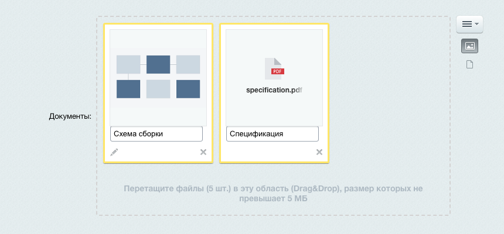

Класс `\Bitrix\Main\UI\FileInput` строит поле выбора файлов для формы. Поле показывает уже сохраненные файлы миниатюрами, принимает новые файлы перетаскиванием и подставляет в форму скрытые поля со значениями.

Оформление поля рассчитано на административный раздел: класс использует административные стили и диалог выбора файла на сайте.

Класс отвечает за интерфейс поля и за состав полей формы. Сохранять файл в файловое хранилище и записывать идентификатор в свои данные должен код, который обрабатывает отправленную форму.

Для формы в публичной части подходит компонент `bitrix:main.file.input`: он сохраняет файл сам и возвращает в форму готовый идентификатор. Вызов компонента описан в статье [Загрузка файлов Uploader](./uploader.md#вывести-поле-загрузки).

## Вывести поле

Метод `createInstance()` создает объект по массиву настроек, метод `show()` возвращает готовый HTML поля. Настройка `name` задает имя поля формы, настройка `id` — идентификатор поля на странице.

**Пример.** Поле показывает один уже сохраненный файл с идентификатором `145` и не принимает новые файлы.

```php
<?php

use Bitrix\Main\UI\FileInput;

echo FileInput::createInstance([
    'name' => 'DOCUMENT_FILE',
    'id' => 'document_file',
    'maxCount' => 1,
])->show(145);
```

Метод `show()` подключает JavaScript-расширение поля сам, поэтому вызывать `\CJSCore::Init()` перед ним не нужно.

Тот же объект создает и обычный конструктор `new FileInput($settings)`: метод `createInstance()` вызывает его и возвращает результат.

Класс строит идентификатор HTML-блока из настройки `id`: приводит значение к нижнему регистру, заменяет все символы, кроме латинских букв и цифр, на подчеркивание и добавляет префикс `bx_file_`. Без настройки `id` класс берет для этого значение `name`. Два поля с одинаковым именем на одной странице получат одинаковый идентификатор, поэтому задавайте `id` каждому полю явно.

Класс принимает, но не использует настройку `thumbSize`, второй аргумент метода `createInstance()` и второй аргумент метода `show()`. На результат они не влияют.

## Разрешить загрузку файлов

Настройка `upload` со значением `true` включает загрузку новых файлов: в меню поля появляется пункт загрузки с компьютера, а область поля принимает перетаскивание. Без этой настройки поле показывает только уже сохраненные файлы и сообщает пользователю, что загрузка запрещена.

При включенной загрузке класс подписывает параметры приема методом `\Bitrix\Main\UI\FileInputReceiver::sign()` и передает подпись в браузер. Файлы уходят на служебную страницу `/bitrix/tools/upload.php`, которая собирает приемник по подписи и сохраняет файл во временный каталог. Своего кода на сервере такая загрузка не требует.

Настройка `uploadType` задает, что поле подставит в форму после загрузки.

-  `path` — массив с данными временного файла. Значение по умолчанию.

-  `hash` — одна строка с идентификатором загрузки.

Оба значения описывают только новые файлы. Уже сохраненный файл приходит в форму своим идентификатором в файловом хранилище.

**Пример.** Поле принимает новые файлы и подставляет в форму данные временного файла.

```php
<?php

use Bitrix\Main\UI\FileInput;

echo FileInput::createInstance([
    'name' => 'DOCUMENT_FILE',
    'id' => 'document_file',
    'upload' => true,
    'uploadType' => 'path',
])->show();
```

## Ограничить типы, размер и число файлов

Четыре настройки задают, какие файлы поле принимает.

#|
|| **Настройка** | **Описание** ||
|| `allowUpload` | Тип разрешенных файлов. Значение задают константой класса. По умолчанию `UPLOAD_ANY_FILES` ||
|| `allowUploadExt` | Список разрешенных расширений через запятую. Работает вместе с `allowUpload` в режиме списка расширений. По умолчанию пустая строка ||
|| `maxCount` | Предельное число файлов в поле. По умолчанию `0` — без ограничения ||
|| `maxSize` | Предельный размер одного файла в байтах. По умолчанию `0` — без ограничения ||
|#

Константы класса задают тип разрешенных файлов.

-  `FileInput::UPLOAD_ANY_FILES` — любые файлы.

-  `FileInput::UPLOAD_IMAGES` — только изображения.

-  `FileInput::UPLOAD_EXTENTION_LIST` — только файлы с расширением из `allowUploadExt`.

Значение вне этого списка класс заменяет на `UPLOAD_ANY_FILES`. Так же он поступает, если выбран режим списка расширений, а сам список пуст.

**Пример.** Поле принимает до трех файлов с расширением `pdf` или `docx`, каждый не больше 5 Мб.

```php
<?php

use Bitrix\Main\UI\FileInput;

echo FileInput::createInstance([
    'name' => 'DOCUMENT_FILE[n#IND#]',
    'id' => 'document_file',
    'upload' => true,
    'allowUpload' => FileInput::UPLOAD_EXTENTION_LIST,
    'allowUploadExt' => 'pdf,docx',
    'maxCount' => 3,
    'maxSize' => 5 * 1024 * 1024,
])->show();
```

Условия загрузки поле выводит под областью перетаскивания: разрешенные расширения, предельное число файлов и предельный размер. Файл, который не прошел проверку, поле помечает и показывает текст ошибки под именем файла.



Настройки `maxCount` и `maxSize` проверяет только браузер. В подпись, с которой поле отправляет файлы, попадают лишь тип приема, `allowUpload` и `allowUploadExt`, поэтому число и размер файлов на сервере не проверяются. Если предел важен, проверьте его своим кодом при обработке формы.



Тип файла приемник проверяет и на сервере — вместе с остальными [ограничениями загрузки](./uploader.md#ограничить-размер-и-типы-файлов).

## Добавить источники файлов

Кроме компьютера пользователя поле принимает файлы из медиабиблиотеки, из структуры файлов сайта и из облачного хранилища. Каждый источник добавляет свой пункт в меню поля и включается отдельной настройкой.

#|
|| **Настройка** | **Описание** ||
|| `medialib` | Разрешает выбрать файл из медиабиблиотеки. Работает при установленном модуле `fileman`, включенной медиабиблиотеке в его настройках и праве `medialib_view_collection` у пользователя. По умолчанию `false` ||
|| `fileDialog` | Разрешает выбрать файл из структуры файлов сайта. Работает при праве `fileman_view_file_structure` у пользователя. По умолчанию `false` ||
|| `cloud` | Разрешает выбрать файл из облачного хранилища. Работает при установленном модуле `clouds`, хотя бы одном активном бакете и праве `clouds_browse` у пользователя. По умолчанию `false` ||
|#

Условия класс проверяет сам и выключает источник, если хотя бы одно из них не выполнено. Сообщения об этом пользователь не увидит: пункт в меню поля не появится.

**Пример.** Поле принимает одно изображение с компьютера, из медиабиблиотеки, из структуры файлов сайта и из облачного хранилища.

```php
<?php

use Bitrix\Main\UI\FileInput;

echo FileInput::createInstance([
    'name' => 'DOCUMENT_PREVIEW',
    'id' => 'document_preview',
    'upload' => true,
    'allowUpload' => FileInput::UPLOAD_IMAGES,
    'maxCount' => 1,
    'medialib' => true,
    'fileDialog' => true,
    'cloud' => true,
])->show();
```

Вместе с медиабиблиотекой и структурой сайта в меню появляется пункт для ввода пути к файлу вручную. Отдельной настройки у него нет: он включается, если включен хотя бы один из этих двух источников.

{width=860px height=370px}

Файл из медиабиблиотеки, из структуры сайта и из облака браузер отправляет ссылкой, а не содержимым: сам файл забирает сервер. Прием файла по ссылке описан в статье [Загрузка файлов Uploader](./uploader.md#загрузить-файл-по-ссылке).

## Показать уже сохраненные файлы

Метод `show()` принимает значения, которые нужно показать в поле.

-  Одно значение — идентификатор файла в файловом хранилище или массив с ключом `tmp_name`. Класс связывает его с именем из настройки `name`.

-  Массив вида «имя поля формы — значение» — по одному элементу на файл.

Если файла с таким идентификатором в файловом хранилище нет, поле не выводит для него ничего.

Для нескольких файлов задайте `name` шаблоном с фрагментом `#IND#`: вместо этого фрагмента браузер подставляет порядковый номер нового файла, начиная с нуля.

Ключи переданного массива задают имена уже сохраненных файлов, поэтому стройте их так, чтобы они не совпали с именами новых файлов. В административных формах продукта ключ содержит идентификатор сохраненного значения, а шаблон `#IND#` дает имена вида `[n0]` и `[n1]`.

**Пример.** Поле показывает два сохраненных файла, а первый добавленный файл получает имя `DOCUMENT_FILE[n0]`.

```php
<?php

use Bitrix\Main\UI\FileInput;

echo FileInput::createInstance([
    'name' => 'DOCUMENT_FILE[n#IND#]',
    'id' => 'document_file',
    'upload' => true,
])->show([
    'DOCUMENT_FILE[145]' => 145,
    'DOCUMENT_FILE[146]' => 146,
]);
```

Для изображения поле показывает уменьшенную копию, для остальных файлов — значок с расширением и имя файла. Если изображение хранится в облаке и локальной копии на диске нет, класс `\Bitrix\Main\UI\FileInputUnclouder` строит для превью подписанную ссылку на `/bitrix/tools/upload.php`, а страница отдает файл из облака.

{width=860px height=400px}

## Настроить действия с файлом

Описание, удаление, редактирование изображения и сортировку включают отдельные настройки.

#|
|| **Настройка** | **Описание** ||
|| `description` | Показывает текстовое поле с описанием рядом с каждым файлом. По умолчанию `true` ||
|| `delete` | Показывает кнопку удаления у файла и пункт очистки поля в меню. По умолчанию `true` ||
|| `edit` | Показывает кнопку редактора изображения. По умолчанию `true` ||
|| `allowSort` | Разрешает менять порядок файлов перетаскиванием. Значение `N` перетаскивание отключает. По умолчанию `Y` ||
|#

Кнопка у файла и двойной щелчок по миниатюре открывают редактор изображения. Редактор кадрирует и масштабирует изображение прямо в браузере, а измененный файл отправляет на сервер заново.

Настройка `edit` со значением `false` убирает не только кнопку редактора, но и поле описания: описание относится к тем же элементам управления файлом.

Еще два пункта меню переключает сам пользователь — кадрирование изображений и закрепление поля описания. Выбор сохраняется в настройках пользователя и переносится на другие поля. Пункт про описание появляется, только когда включены `edit` и `description`.

**Пример.** Поле показывает сохраненные файлы без описаний, редактора и перетаскивания. Кнопка удаления остается.

```php
<?php

use Bitrix\Main\UI\FileInput;

echo FileInput::createInstance([
    'name' => 'DOCUMENT_FILE[n#IND#]',
    'id' => 'document_file',
    'description' => false,
    'edit' => false,
    'delete' => true,
    'allowSort' => 'N',
])->show([
    'DOCUMENT_FILE[145]' => 145,
]);
```

## Сохранить файлы из формы

Отправленная форма приносит на сервер три вида полей: значение файла, отметку об удалении и описание.

#|
|| **Что пришло в запросе** | **Значение** ||
|| Имя поля файла | Идентификатор уже сохраненного файла либо данные нового файла. Для нового файла при `uploadType` со значением `path` это массив с ключами `name`, `type`, `tmp_name`, `size` и `error`, а при значении `hash` — идентификатор загрузки ||
|| Имя поля с суффиксом `_del` | Значение `Y`, если пользователь удалил файл в поле. Прежнее значение при этом приходит как обычно ||
|| Имя поля с суффиксом `_descr` | Описание файла, если поле описания включено ||
|#

Класс подставляет суффикс перед первой квадратной скобкой имени. Поле `DOCUMENT_FILE[n0]` дает `DOCUMENT_FILE_del[n0]` и `DOCUMENT_FILE_descr[n0]`.

Ключ `tmp_name` содержит путь от временного каталога загрузки, а метод `\CFile::SaveFile()` принимает полный путь на диске. Корень временного каталога возвращает метод `\CTempFile::GetAbsoluteRoot()`.

Статический метод `prepareFile()` для этого не подходит: он возвращает переданный массив без изменений и путь не преобразует. Собирайте полный путь и проверяйте его своим кодом.

**Пример.** Код сохраняет новый файл в файловое хранилище, удаляет прежний файл по отметке пользователя и оставляет идентификатор без изменений, если файл не менялся.

```php
<?php

use Bitrix\Main\Context;

$request = Context::getCurrent()->getRequest();
$value = $request->getPost('DOCUMENT_FILE');
$fileId = 0;

if ($request->getPost('DOCUMENT_FILE_del') === 'Y')
{
    \CFile::Delete((int)$value);
}
elseif (is_array($value))
{
    $tempRoot = \CTempFile::GetAbsoluteRoot();
    $path = realpath($tempRoot . $value['tmp_name']);

    if ($path !== false && str_starts_with($path, $tempRoot . '/'))
    {
        $value['tmp_name'] = $path;
        $value['description'] = (string)$request->getPost('DOCUMENT_FILE_descr');
        $fileId = (int)\CFile::SaveFile($value, 'main');
    }
}
else
{
    $fileId = (int)$value;
}
```

Проверка пути обязательна: значение `tmp_name` приходит из формы, то есть от браузера. Функция `realpath()` разворачивает путь, а сравнение с корнем временного каталога отсекает файлы за его пределами.

Продукт очищает временный каталог по расписанию, поэтому сохраняйте файл в файловое хранилище в том же запросе, в котором обрабатываете форму.

## Связанные материалы

-  [Загрузка файлов Uploader](./uploader.md) — прием файлов на сервере, события загрузки, копии изображения и коды ошибок.

-  [Работа с изображениями](../advanced/images.md) — изменение размеров и обработка изображения после сохранения.

-  [Поля форм ui.forms](./ui-forms.md) — оформление поля выбора файла и области перетаскивания.

-  [Компоненты](../framework/components.md) — вызов компонента и передача параметров.
