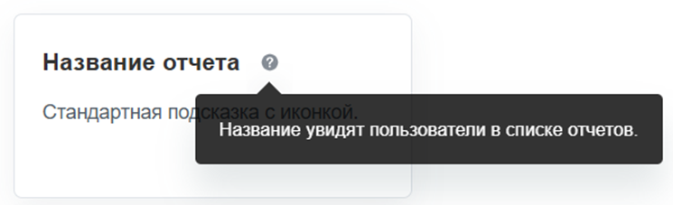

`UI.Hint` — это компонент для коротких пояснений в интерфейсе. Подсказка открывается при наведении на элемент и скрывается, когда курсор уходит с него.

В Bitrix Framework за подсказки отвечает расширение `ui.hint`. Оно добавляет глобальный менеджер `BX.UI.Hint`.

Для статической разметки передайте текст в атрибуте `data-hint`. Для динамически созданной разметки дополнительно вызовите `BX.UI.Hint.init()`.

Для Vue 3 доступны два отдельных расширения. Директива `hint` из `ui.vue3.directives.hint` подходит для существующего элемента. Компонент `Hint` из `ui.vue3.components.hint` выводит стандартную иконку подсказки.

{width=745px height=227px}

## Подключить расширение

Если вы подключаете компонент из PHP, загрузите расширение `ui.hint`.

```php
\Bitrix\Main\UI\Extension::load('ui.hint');
```

## Добавить подсказку в разметку

Чтобы добавить стандартную подсказку с иконкой, передайте текст в атрибуте `data-hint` и добавьте класс `ui-hint`.

```html
<span
    class="ui-hint"
    data-hint="Укажите название, которое увидят пользователи."
></span>
```

Менеджер автоматически инициализирует элементы с классом `ui-hint` при загрузке страницы. Подсказка появится при наведении на элемент.

## Настроить подсказку

Дополнительные атрибуты меняют содержимое, положение и поведение подсказки.

-  `data-hint` — текст подсказки. По умолчанию специальные символы HTML экранируются.

-  `data-hint-html` — разрешает HTML-разметку в значении `data-hint`. Используйте только для доверенного содержимого.

-  `data-hint-no-icon` — не добавляет стандартную иконку подсказки. Используйте атрибут, если подсказка должна открываться при наведении на готовый элемент интерфейса.

-  `data-hint-center` — выравнивает подсказку относительно центра элемента.

-  `data-hint-interactivity` — не закрывает подсказку при переходе курсора с элемента внутрь подсказки.

-  `data-hint-size` — размер стандартной иконки подсказки. Допустимые значения: `l` и `xl`. Без атрибута используется базовый размер.

-  `data-hint-icon` — имя иконки из набора `ui.icon-set`, которой заменяется стандартная иконка подсказки.

-  `data-hint-outline` — выводит контурную иконку вопроса вместо стандартной иконки подсказки.

```html
<a
    class="ui-hint"
    href="/reports/"
    data-hint="<b>Отчеты.</b><br>Перейти к списку отчетов."
    data-hint-html
    data-hint-no-icon
>
    Отчеты
</a>
```

## Инициализировать динамическую разметку

Метод `BX.UI.Hint.init(context)` находит элементы с атрибутом `data-hint` внутри переданного DOM-узла и инициализирует подсказки. Используйте его после добавления новой разметки на страницу.

```javascript
import { Dom, Tag } from 'main.core';

const container = document.getElementById('settings-container');

Dom.append(
	Tag.render`<span data-hint="Настройка применяется к новым задачам."></span>`,
	container,
);

BX.UI.Hint.init(container);
```

Для динамической разметки класс `ui-hint` не обязателен: метод `init()` ищет элементы по атрибуту `data-hint`.

Если нужен готовый DOM-узел со стандартной иконкой, создайте его через `BX.UI.Hint.createNode(text)`.

```javascript
import { Dom } from 'main.core';

const hintNode = BX.UI.Hint.createNode('Настройка применяется после сохранения формы.');

Dom.append(hintNode, document.getElementById('settings-title'));
```

## Создать отдельный менеджер

Метод `BX.UI.Hint.createInstance(options)` создает отдельный менеджер подсказок. Используйте его, если стандартные атрибуты или оформление не подходят для конкретного блока интерфейса.

```javascript
const hintManager = BX.UI.Hint.createInstance({
    attributeName: 'data-settings-hint',
    className: 'settings-hint',
    classNameIcon: 'settings-hint-icon',
});

hintManager.init(document.getElementById('settings-container'));
```

Передайте параметры менеджера в объекте `options`.

#|
|| **Параметр** | **Тип** | **Описание** ||
|| `id` | `string` | Идентификатор всплывающего окна подсказки. ||
|| `attributeName` | `string` | Имя атрибута с текстом подсказки. По умолчанию `data-hint`. ||
|| `attributeInitName` | `string` | Имя атрибута, которым отмечается инициализированный элемент. По умолчанию `data-hint-init`. ||
|| `className` | `string` | Класс элементов подсказки. По умолчанию `ui-hint`. ||
|| `classNameIcon` | `string` | Класс стандартной иконки. По умолчанию `ui-hint-icon`. ||
|| `content` | `Element` | DOM-узел для содержимого всплывающего окна. ||
|| `popup` | `BX.PopupWindow` | Готовый экземпляр всплывающего окна. ||
|| `popupParameters` | `object` | Дополнительные параметры компонента `main.popup`, которые передаются во всплывающее окно подсказки. ||
|#


Если `content` не является DOM-узлом или `popup` не является экземпляром `BX.PopupWindow`, метод вызовет ошибку.

Подробнее о параметрах `main.popup` читайте в статье [Всплывающие окна и меню main.popup](./main-popup.md).

## Использовать директиву Vue 3

Для подсказки на готовом элементе Vue 3 используйте директиву `hint` из расширения `ui.vue3.directives.hint`.

```js
import { hint } from 'ui.vue3.directives.hint';

export const ExampleComponent = {
    directives: {
        hint,
    },
    template: `
        <span v-hint="{ text: 'Настройка применяется после сохранения.' }">
            Наведите курсор
        </span>
    `,
};
```

В директиву можно передать строку, объект с параметрами или функцию, которая возвращает параметры подсказки.

#|
|| **Параметр** | **Тип** | **Описание** ||
|| `text` | `string` | Текст подсказки. HTML-символы экранируются. ||
|| `html` | `string` | HTML-разметка подсказки. Используйте только для доверенного содержимого. ||
|| `position` | `string` | Положение подсказки. Передайте `top`, чтобы показать ее над элементом. По умолчанию подсказка выводится под элементом. ||
|| `popupOptions` | `object` | Дополнительные параметры компонента `main.popup`, которые передаются во всплывающее окно подсказки. ||
|| `timeout` | `number` | Задержка перед показом подсказки в миллисекундах. По умолчанию `0`. ||
|| `interactivity` | `boolean` | Разрешает перевести курсор внутрь подсказки, например для перехода по ссылке. По умолчанию `false`. ||
|#


Пример интерактивной подсказки с HTML-разметкой. Используйте `html` только для текста без пользовательского ввода, чтобы не вставить на страницу непроверенный HTML.

```js
import { hint } from 'ui.vue3.directives.hint';

export const ExampleComponent = {
    directives: {
        hint,
    },
    template: `
        <span
            v-hint="{
                html: 'Подробнее в <a href=&quot;/help/&quot;>справке</a>.',
                position: 'top',
                timeout: 300,
                interactivity: true,
            }"
        >
            Подробнее
        </span>
    `,
};
```

Если нужны задержка перед показом через `timeout`, интерактивность через `interactivity` или подсказка на существующем элементе интерфейса, используйте директиву `hint`.

## Использовать компонент Vue 3

Для стандартной иконки подсказки используйте компонент `Hint` из расширения `ui.vue3.components.hint`.

Компонент принимает параметры `text`, `html`, `position`, `size`, `outline`, `icon`, `iconName` и `popupOptions`. 

По умолчанию `text` и `html` — пустые строки, `position` — `bottom`, `size` и `iconName` — `null`, `outline` — `false`, `icon` — `true`, `popupOptions` — пустой объект.

```js
import { Hint } from 'ui.vue3.components.hint';

export const ExampleComponent = {
    components: {
        Hint,
    },
    template: `
        <Hint
            text="Настройка применяется после сохранения."
            position="top"
        />
    `,
};
```



Подробнее о работе с Vue 3 в Bitrix Framework читайте в статье [Vue.js](../advanced/vue.md).


