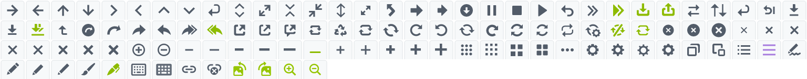
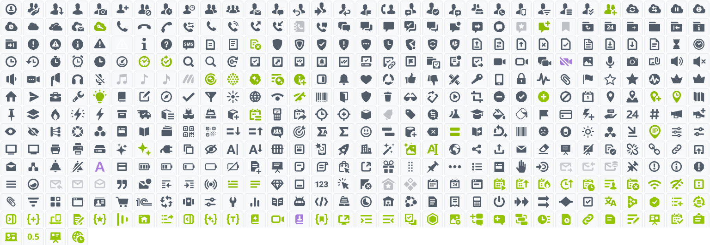
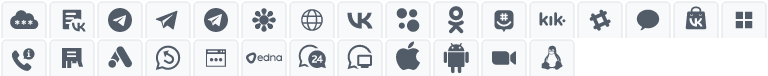
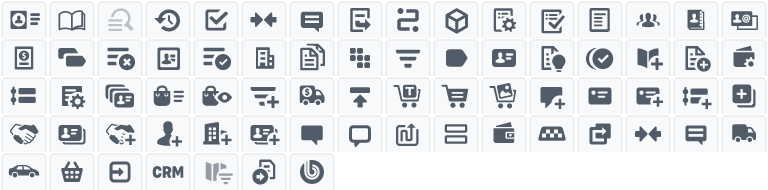
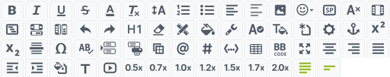
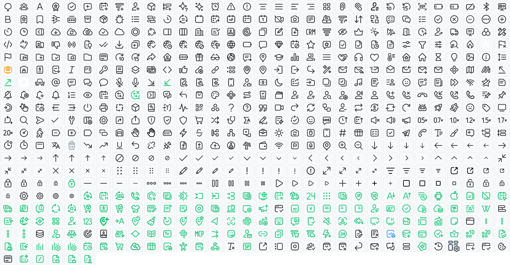
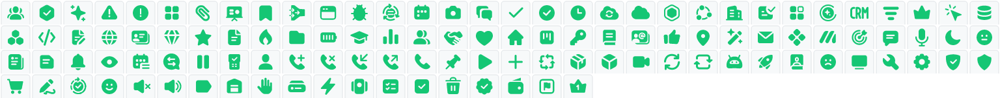
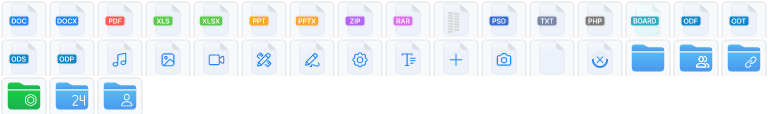
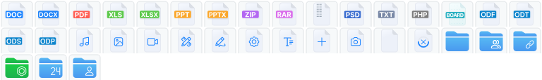
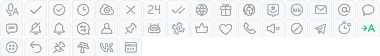

`ui.icon-set` — это библиотека иконок для интерфейсов Bitrix Framework.

Выберите способ вывода иконки по сценарию:

-  `Icon` из `ui.icon-set.api.core` — когда иконку нужно создать из обычного JavaScript, добавить DOM-узел в интерфейс, задать размер, цвет или режим наведения.

-  `BIcon` из `ui.icon-set.api.vue` — когда иконку нужно вывести в Vue-шаблоне и настроить через свойства.

-  HTML-элемент с CSS-классами — когда иконка не требует управления из JavaScript.

Иконки разделены на наборы по назначению и стилю. Для отображения набора нужно подключить соответствующее CSS-расширение с классами и стилями, например `ui.icon-set.outline` для `Outline`.

## Подключить JavaScript-расширение

Если вы подключаете иконки из PHP, загрузите `ui.icon-set.api.core` и CSS-расширение с нужным набором иконок.

```php
\Bitrix\Main\UI\Extension::load([
    'ui.icon-set.api.core',
    'ui.icon-set.outline',
]);
```

Если вы работаете в модульном JavaScript, импортируйте класс `Icon`, объект с именами иконок и CSS-расширение для их отображения.

```js
import { Icon, Outline } from 'ui.icon-set.api.core';
import 'ui.icon-set.outline';
```

Без CSS-расширения с нужным набором иконка не отобразится.

### Создать иконку

Чтобы создать иконку:

1. Импортируйте `Icon` и объект с именами иконок.

2. Создайте экземпляр `Icon` и передайте имя иконки в параметр `icon`.

3. Получите DOM-узел через `render()`.

4. Добавьте полученный узел на страницу.

```js
import { Icon, Outline } from 'ui.icon-set.api.core';
import 'ui.icon-set.outline';

const icon = new Icon({
    icon: Outline.CHECK_L,
    size: 24,
    color: '#2fc6f6',
});

document.getElementById('icon-container').append(icon.render());
```

Метод `render()` возвращает DOM-узел иконки. Если нужно сразу вывести иконку в контейнер, используйте `renderTo(node)`.

```js
import { Icon, Outline } from 'ui.icon-set.api.core';
import 'ui.icon-set.outline';

const icon = new Icon({
    icon: Outline.TRASHCAN,
    size: 20,
});

icon.renderTo(document.getElementById('icon-container'));
```

### Передать параметры

Конструктор `Icon` принимает объект с параметрами иконки.

-  `icon` — обязательное имя иконки. Передавайте значение из экспортируемого набора, например `Outline.CHECK_L`, `Main.PERSON` или `Actions.PENCIL_DRAW`. Список наборов смотрите в разделе [Выбрать набор иконок](#choose-icons-set).

-  `size` — размер иконки в пикселях. Если параметр не передан или передано значение меньше либо равно `0`, используется базовый размер набора: `24px`.

-  `color` — цвет иконки. Можно передать значение дизайн-токена или любой CSS-цвет, например `var(--ui-color-base-70)` или `#525c69`.

-  `hoverMode` — режим изменения цвета при наведении и нажатии. Доступны значения `IconHoverMode.DEFAULT` и `IconHoverMode.ALT`.

-  `responsive` — режим, в котором иконка занимает размер родительского контейнера.

```js
import { Icon, IconHoverMode, Main } from 'ui.icon-set.api.core';
import 'ui.icon-set.main';

const icon = new Icon({
    icon: Main.SEARCH_1,
    size: 32,
    color: 'var(--ui-color-base-60)',
    hoverMode: IconHoverMode.DEFAULT,
});
```

### Выбрать набор иконок {#choose-icons-set}

`ui.icon-set.api.core` экспортирует несколько объектов с именами иконок.

#|
|| **Экспорт** | **CSS-расширение** | **Когда использовать** ||
|| `Actions` | `ui.icon-set.actions` | Действия интерфейса: стрелки, обновление, редактирование, воспроизведение ||
|| `Main` | `ui.icon-set.main` | Основные продуктовые иконки: пользователи, файлы, коммуникации, CRM, задачи ||
|| `Social` | `ui.icon-set.social` | Социальные сети и внешние каналы ||
|| `ContactCenter` | `ui.icon-set.contact-center` | Иконки контакт-центра ||
|| `CRM` | `ui.icon-set.crm` | CRM-объекты и сценарии ||
|| `Editor` | `ui.icon-set.editor` | Действия текстового редактора ||
|| `Animated` | `ui.icon-set.animated` | Анимированные индикаторы ||
|| `Outline` | `ui.icon-set.outline` | Контурные иконки ||
|| `Solid` | `ui.icon-set.solid` | Залитые иконки ||
|| `Disk` | `ui.icon-set.disk` | Цветные иконки типов файлов Диска ||
|| `DiskCompact` | `ui.icon-set.disk` | Компактные цветные иконки типов файлов Диска ||
|| `SmallOutline` | `ui.icon-set.small-outline` | Малые контурные иконки ||
|#


Импортируйте конкретный объект с именами иконок, если заранее знаете, из какого набора берете иконку.

```js
import { Icon, Actions, Disk } from 'ui.icon-set.api.core';
import 'ui.icon-set.actions';
import 'ui.icon-set.disk';

const editIcon = new Icon({
    icon: Actions.PENCIL_DRAW,
});

const pdfIcon = new Icon({
    icon: Disk.PDF,
});
```

У иконок `Disk` и `DiskCompact` фиксированные цвета. Параметр `color` для них не применяется.

### Изменить цвет и поведение

После создания иконки можно изменить цвет, режим наведения и адаптивный размер.

-  `setColor(color)` — меняет цвет иконки.

-  `setHoverMode(hoverMode)` — включает режим наведения. Доступны значения `IconHoverMode.DEFAULT` и `IconHoverMode.ALT`.

-  `setResponsive(responsive)` — переключает адаптивный размер от родительского контейнера.

Методы изменения применяются к уже созданному DOM-узлу. Сначала вызовите `render()` или `renderTo()`, затем меняйте параметры.

```js
import { Icon, IconHoverMode, Outline } from 'ui.icon-set.api.core';
import 'ui.icon-set.outline';

const icon = new Icon({
    icon: Outline.SETTINGS,
    size: 24,
});

document.getElementById('icon-container').append(icon.render());

icon.setColor('var(--ui-color-accent-main-primary)');
icon.setHoverMode(IconHoverMode.ALT);
```

Если вызвать методы изменения до `render()` или `renderTo()`, у экземпляра еще нет элемента на странице.

### Проверить параметры

Для предварительной проверки параметров используйте статические методы `Icon`.

-  `Icon.validateParams(params)` возвращает `null`, если параметры проходят проверку, или строку с текстом ошибки.

-  `Icon.isValid(params)` возвращает `true`, если `validateParams()` вернул `null`.

```js
import { Icon, Outline } from 'ui.icon-set.api.core';

const params = {
    icon: Outline.CHECK_L,
    size: 20,
};

if (Icon.isValid(params))
{
    const icon = new Icon(params);
}
```

Используйте эти методы, если параметры формируются динамически и перед созданием иконки нужно проверить их корректность.

## Использовать Vue-компонент BIcon

Если вы подключаете Vue-компонент из PHP, загрузите `ui.icon-set.api.vue` и CSS-расширение с нужным набором. В примере используется набор `Outline`, поэтому подключается `ui.icon-set.outline`.

```php
\Bitrix\Main\UI\Extension::load([
    'ui.icon-set.api.vue',
    'ui.icon-set.outline',
]);
```

Если вы работаете в модульном JavaScript, импортируйте `BIcon`, объект с именами иконок и CSS-расширение для их отображения.

```js
import { BIcon, Outline } from 'ui.icon-set.api.vue';
import 'ui.icon-set.outline';
```

Основные экспорты `ui.icon-set.api.vue`:

#|
|| **Экспорт** | **Описание** ||
|| `BIcon` | Vue-компонент для вывода иконки ||
|| `Actions` | Объект с именами иконок действий интерфейса ||
|| `Main` | Объект с именами основных продуктовых иконок ||
|| `Social` | Объект с именами иконок социальных сетей и внешних каналов ||
|| `ContactCenter` | Объект с именами иконок контакт-центра ||
|| `CRM` | Объект с именами CRM-иконок ||
|| `Editor` | Объект с именами иконок текстового редактора ||
|| `Animated` | Объект с именами анимированных индикаторов ||
|| `Outline` | Объект с именами контурных иконок ||
|| `Solid` | Объект с именами залитых иконок ||
|| `Disk` | Объект с именами цветных иконок типов файлов Диска ||
|| `DiskCompact` | Объект с именами компактных цветных иконок типов файлов Диска ||
|| `SmallOutline` | Объект с именами малых контурных иконок ||
|#


Передайте в `name` значение из набора иконок.

```js
import { BIcon, Outline } from 'ui.icon-set.api.vue';
import 'ui.icon-set.outline';

export const ExampleComponent = {
    components: {
        BIcon,
    },
    setup()
    {
        return {
            Outline,
        };
    },
    template: `
        <BIcon
            :name="Outline.CHECK_L"
            :size="24"
            color="var(--ui-color-base-70)"
        />
    `,
};
```

`BIcon` принимает свойства:

#|
|| **Свойство** | **Тип** | **По умолчанию** | **Описание** ||
|| `name` | `String` | Нет | Обязательное имя иконки. Передавайте значение из `Actions`, `Main`, `Social`, `ContactCenter`, `CRM`, `Editor`, `Animated`, `Outline`, `Solid`, `Disk`, `DiskCompact` или `SmallOutline` ||
|| `size` | `Number` | `null` | Размер иконки в пикселях. Не используется, если `responsive` равен `true` ||
|| `color` | `String` | `null` | Цвет иконки. Передавайте CSS-цвет или дизайн-токен, например `var(--ui-color-base-70)` ||
|| `hoverable` | `Boolean` | `false` | Включает основной режим изменения цвета при наведении ||
|| `hoverableAlt` | `Boolean` | `false` | Включает альтернативный режим изменения цвета при наведении. Если `hoverable` тоже равен `true`, применяется основной режим ||
|| `responsive` | `Boolean` | `false` | Растягивает иконку до размера родительского контейнера ||
|#


`ui.icon-set.api.vue` реэкспортирует наборы из `ui.icon-set.api.core`. Для `BIcon` используйте те же CSS-расширения с иконками, что и для класса `Icon`.

`BIcon` настраивается через свойства. Компонент не описывает события и слоты.



Подробнее о работе с Vue в Bitrix Framework читайте в статье [Vue.js](../advanced/vue.md).



## Вывести иконку через HTML

Если иконка не требует управления из JavaScript, можно вывести ее обычным DOM-элементом. Подключите CSS-расширение с нужным набором и добавьте классы `ui-icon-set` и `--<имя иконки>`.

Значение из объекта с именами иконок совпадает с CSS-модификатором без начального `--`.

```html
<div class="ui-icon-set --check-l"></div>
```

Размер и цвет задаются через CSS-переменные.

```html
<div
    class="ui-icon-set --o-person"
    style="--ui-icon-set__icon-size: 32px; --ui-icon-set__icon-color: var(--ui-color-base-70);"
></div>
```

Базовый размер иконки — `24px`, базовый цвет — `var(--ui-color-base-90)`.

## Список иконок



{width=768px height=76px}

#|
|| **Значение** | **CSS-класс** ||
|| Actions.ARROW_RIGHT | arrow-right ||
|| Actions.ARROW_LEFT | arrow-left ||
|| Actions.ARROW_TOP | arrow-top ||
|| Actions.ARROW_DOWN | arrow-down ||
|| Actions.CHEVRON_RIGHT | chevron-right ||
|| Actions.CHEVRON_LEFT | chevron-left ||
|| Actions.CHEVRON_UP | chevron-up ||
|| Actions.CHEVRON_DOWN | chevron-down ||
|| Actions.LEFT_SEMICIRCULAR_ANTICLOCKWISE_ARROW_2 | left-semicircular-anticlockwise-arrow-2 ||
|| Actions.EXPAND_1 | expand-1 ||
|| Actions.EXPAND_DIAGONAL | expand-diagonal ||
|| Actions.COLLAPSE | collapse ||
|| Actions.COLLAPSE_DIAGONAL | collapse-diagonal ||
|| Actions.AGENDA_GAP | agenda-gap ||
|| Actions.EXPAND_TO_FULL_SCREEN | expand-to-full-screen ||
|| Actions.CURVED_ARROW_LEFT | curved-arrow-left ||
|| Actions.FORWARD | forward ||
|| Actions.FORWARD_2 | forward-2 ||
|| Actions.ARROW_DOWNLOAD | arrow-download ||
|| Actions.PAUSE | pause ||
|| Actions.STOP | stop ||
|| Actions.PLAY | play ||
|| Actions.LEFT_SEMICIRCULAR_ANTICLOCKWISE_ARROW_1 | left-semicircular-anticlockwise-arrow-1 ||
|| Actions.DOUBLE_SHEVRONS_RIGHT | double-shevrons-right ||
|| Actions.NEXT | next ||
|| Actions.DOWNLOAD_3 | download-3 ||
|| Actions.UPLOAD | upload ||
|| Actions.SWAP | swap ||
|| Actions.SORT | sort ||
|| Actions.LEFT_SEMICIRCULAR_ANTICLOCKWISE_ARROW_3 | left-semicircular-anticlockwise-arrow-3 ||
|| Actions.LEFT_SEMICIRCULAR_ANTICLOCKWISE_ARROW_4 | left-semicircular-anticlockwise-arrow-4 ||
|| Actions.DOWNLOAD | download ||
|| Actions.DOWNLOAD_2 | download-2 ||
|| Actions.DOWNLOAD_DOUBLE | download-double ||
|| Actions.ARROW_TOP_2 | arrow-top-2 ||
|| Actions.CONVERSION_1 | conversion-1 ||
|| Actions.CONVERSION_2 | conversion-2 ||
|| Actions.FORWARD_3 | forward-3 ||
|| Actions.REPLY | reply ||
|| Actions.FORWARD_2_1 | forward-2-1 ||
|| Actions.REPLAY_ALL | replay-all ||
|| Actions.OPEN_IN_50 | open-in-50 ||
|| Actions.OPEN_IN_40 | open-in-40 ||
|| Actions.OPEN_IN_30 | open-in-30 ||
|| Actions.REFRESH_1 | refresh-1 ||
|| Actions.REFRESH_2 | refresh-2 ||
|| Actions.REFRESH_3 | refresh-3 ||
|| Actions.REFRESH_4 | refresh-4 ||
|| Actions.REDO_1 | redo-1 ||
|| Actions.UNDO_1 | undo-1 ||
|| Actions.REFRESH_5 | refresh-5 ||
|| Actions.REDO_2 | redo-2 ||
|| Actions.REFRESH_6 | refresh-6 ||
|| Actions.REFRESH_7 | refresh-7 ||
|| Actions.REFRESH_8 | refresh-8 ||
|| Actions.SYNC_SETTINGS | sync-settings ||
|| Actions.REFRESH_CLOSED | refresh-closed ||
|| Actions.REFRESH_10 | refresh-10 ||
|| Actions.CROSS_CIRCLE_50 | cross-circle-50 ||
|| Actions.CROSS_CIRCLE_60 | cross-circle-60 ||
|| Actions.CROSS_CIRCLE_70 | cross-circle-70 ||
|| Actions.CROSS_20 | cross-20 ||
|| Actions.CROSS_25 | cross-25 ||
|| Actions.CROSS_30 | cross-30 ||
|| Actions.CROSS_40 | cross-40 ||
|| Actions.CROSS_45 | cross-45 ||
|| Actions.CROSS_50 | cross-50 ||
|| Actions.CROSS_55 | cross-55 ||
|| Actions.CROSS_60 | cross-60 ||
|| Actions.PLUS_IN_CIRCLE | plus-in-circle ||
|| Actions.MINUS_IN_CIRCLE | minus-in-circle ||
|| Actions.MINUS_20 | minus-20 ||
|| Actions.MINUS_30 | minus-30 ||
|| Actions.MINUS_40 | minus-40 ||
|| Actions.MINUS_50 | minus-50 ||
|| Actions.MINUS_60 | minus-60 ||
|| Actions.LINE | line ||
|| Actions.PLUS_20 | plus-20 ||
|| Actions.PLUS_30 | plus-30 ||
|| Actions.PLUS_40 | plus-40 ||
|| Actions.PLUS_50 | plus-50 ||
|| Actions.PLUS_60 | plus-60 ||
|| Actions.MORE_9_CUBES | more-9-cubes ||
|| Actions.MORE_9_CUBES_2 | more-9-cubes-2 ||
|| Actions.CUBES_4_1 | 4-cubes-1 ||
|| Actions.CUBES_4_2 | 4-cubes-2 ||
|| Actions.MORE | more ||
|| Actions.SETTINGS_1 | settings-1 ||
|| Actions.SETTINGS_2 | settings-2 ||
|| Actions.SETTINGS_3 | settings-3 ||
|| Actions.SETTINGS_4 | settings-4 ||
|| Actions.COPY_PLATES | copy-plates ||
|| Actions.PLATES | plates ||
|| Actions.NUMERABLE_LIST | numerable-list ||
|| Actions.LINES | lines ||
|| Actions.PENCIL_DRAW | pencil-draw ||
|| Actions.PENCIL_60 | pencil-60 ||
|| Actions.PENCIL_50 | pencil-50 ||
|| Actions.PENCIL_40 | pencil-40 ||
|| Actions.BRUSH | brush ||
|| Actions.PEN | pen ||
|| Actions.KEYBOARD | keyboard ||
|| Actions.KEYBOARD_2 | keyboard-2 ||
|| Actions.CONNECTION | connection ||
|| Actions.DISCONNECTION | disconnection ||
|| Actions.IMAGE_ROTATE_LEFT | image-rotate-left ||
|| Actions.IMAGE_ROTATE_RIGHT | image-rotate-right ||
|| Actions.ZOOM_IN | zoom-in ||
|| Actions.ZOOM_OUT | zoom-out ||
|#





{width=768px height=266px}

#|
|| **Значение** | **CSS-класс** ||
|| Main.PERSON_LOCATION | person-location ||
|| Main.PERSONS_HAND | persons-hand ||
|| Main.PERSON_ARROW_DOWN | person-arrow-down ||
|| Main.PERSON | person ||
|| Main.PERSON_CAMERA | person-camera ||
|| Main.PERSON_PLUS | person-plus ||
|| Main.PERSONS_DENY | persons-deny ||
|| Main.PERSON_CLOCK | person-clock ||
|| Main.PERSON_CLOCK_2 | person-clock-2 ||
|| Main.PERSONS_2 | persons-2 ||
|| Main.PERSONS_3 | persons-3 ||
|| Main.PERSON_LETTER | person-letter ||
|| Main.PERSON_MESSAGE | person-message ||
|| Main.PERSON_ARROW_LEFT_1 | person-arrow-left-1 ||
|| Main.PERSON_ARROW_RIGHT | person-arrow-right ||
|| Main.PERSON_ARROW_LEFT_2 | person-arrow-left-2 ||
|| Main.PERSON_FLAG | person-flag ||
|| Main.PERSON_HANDSET | person-handset ||
|| Main.PERSON_MESSAGE_ARROW_1 | person-message-arrow-1 ||
|| Main.PERSON_CHECK | person-check ||
|| Main.PERSON_MESSAGE_ARROW_2 | person-message-arrow-2 ||
|| Main.PERSONS_STORAGE | persons-storage ||
|| Main.PERSON_CALL | person-call ||
|| Main.PERSON_PHONE | person-phone ||
|| Main.PERSON_DESCENDING | person-descending ||
|| Main.PERSON_3_STICKS | person-3-sticks ||
|| Main.PERSON_2_CHECKS | person-2-checks ||
|| Main.PERSON_PLUS_3 | person-plus-3 ||
|| Main.CLOUD_SYNC | cloud-sync ||
|| Main.CLOUD_TRANSFER_DATA | cloud-transfer-data ||
|| Main.CLOUD_PAUSE | cloud-pause ||
|| Main.CLOUD_ERROR | cloud-error ||
|| Main.CLOUD_CLOCK | cloud-clock ||
|| Main.CLOUD_EMPTY | cloud-empty ||
|| Main.CLOUD_CLOUD | cloud-cloud ||
|| Main.CLOUD_LETTER_POST | cloud-letter-post ||
|| Main.CLOUD_SSO | cloud-sso ||
|| Main.TELEPHONY_HANDSET_1 | telephony-handset-1 ||
|| Main.TELEPHONY_HANDSET_2 | telephony-handset-2 ||
|| Main.TELEPHONY_HANDSET_3 | telephony-handset-3 ||
|| Main.TELEPHONY_HANDSET_4 | telephony-handset-4 ||
|| Main.TELEPHONY_HANDSET_5 | telephony-handset-5 ||
|| Main.TELEPHONY_HANDSET_6 | telephony-handset-6 ||
|| Main.OUTGOING_CALL | outgoing-call ||
|| Main.INCOMING_CALL | incoming-call ||
|| Main.TELEPHONY_PHONEBOOK | telephony-phonebook ||
|| Main.CALL_CHAT | call-chat ||
|| Main.CHATS_1 | chats-1 ||
|| Main.CHATS_2 | chats-2 ||
|| Main.CHAT_MESSAGE | chat-message ||
|| Main.CHATS_WITH_CHECK | chats-with-check ||
|| Main.CHATS_3 | chats-3 ||
|| Main.MESSAGE_CHAT_WITH_POINT | message-chat-with-point ||
|| Main.MESSAGE_CHAT_WITH_ARROW | message-chat-with-arrow ||
|| Main.CHAT_BUTTON | chat-button ||
|| Main.FEEDBACK | feedback ||
|| Main.ADD_CHAT | add-chat ||
|| Main.BOOKMARK_1 | bookmark-1 ||
|| Main.FOLDER_CURVED_ARROW | folder-curved-arrow ||
|| Main.FOLDER_24 | folder-24 ||
|| Main.FOLDER_PLUS | folder-plus ||
|| Main.FOLDER_EMPTY | folder-empty ||
|| Main.FOLDER_LEFT_ARROW | folder-left-arrow ||
|| Main.FOLDER_INFO | folder-info ||
|| Main.FOLDER_RIGHT_ARROW | folder-right-arrow ||
|| Main.NOTE_CIRCLE | note-circle ||
|| Main.WARNING_CIRCLE | warning-circle ||
|| Main.INFO_CIRCLE | info-circle ||
|| Main.WARNING | warning ||
|| Main.WARNING_ALARM | warning-alarm ||
|| Main.INFO | info ||
|| Main.HELP | help ||
|| Main.SMS | sms ||
|| Main.FILE | file ||
|| Main.LIST | list ||
|| Main.BLACK_LIST | black-list ||
|| Main.SHIELD_2_PLAIN | shield-2-plain ||
|| Main.SHIELD_2_CONTOUR | shield-2-contour ||
|| Main.SHIELD_2_CHECKED | shield-2-checked ||
|| Main.SHIELD_2_ATTENTION | shield-2-attention ||
|| Main.SHIELD_2_MENU | shield-2-menu ||
|| Main.SHIELD_2_TIME | shield-2-time ||
|| Main.SHIELD_2_DEFENDED | shield-2-defended ||
|| Main.SHIELD_2_UPDATE | shield-2-update ||
|| Main.SHIELD_2_CORE_PROBLEM | shield-2-core-problem ||
|| Main.FILE_UPLOAD | file-upload ||
|| Main.FILE_SYNC | file-sync ||
|| Main.FILE_ARROW_TOP | file-arrow-top ||
|| Main.FILE_DELETE | file-delete ||
|| Main.FILE_CHECK | file-check ||
|| Main.FILE_2 | file-2 ||
|| Main.FILE_DOWNLOAD | file-download ||
|| Main.FILE_ARROW_DOWN | file-arrow-down ||
|| Main.FILE_3 | file-3 ||
|| Main.HOURGLASS_SANDGLASS | hourglass-sandglass ||
|| Main.CLOCK_1 | clock-1 ||
|| Main.CLOCK_2 | clock-2 ||
|| Main.CLOCK_WITH_ARROW | clock-with-arrow ||
|| Main.STOPWATCH | stopwatch ||
|| Main.ALARM | alarm ||
|| Main.BLACK_CLOCK | black-clock ||
|| Main.SPEED_METER | speed-meter ||
|| Main.WATCH | watch ||
|| Main.SMART_PROCESS | smart-process ||
|| Main.SEARCH_1 | search-1 ||
|| Main.SEARCH_2 | search-2 ||
|| Main.RESTORE_PASSWORD | restore-password ||
|| Main.TASKS | tasks ||
|| Main.WINDOW_ARROW | window-arrow ||
|| Main.WINDOW_DOUBLE_CHECK_1 | window-double-check-1 ||
|| Main.WINDOW_RING | window-ring ||
|| Main.WINDOW_DOUBLE_CHECK_2 | window-double-check-2 ||
|| Main.WINDOW_CHECK_PENCIL | window-check-pencil ||
|| Main.WINDOW_CHECK_LINK | window-check-link ||
|| Main.WINDOW_FLAG | window-flag ||
|| Main.WINDOW_CHECK_WITH_FOLDER | window-check-with-folder ||
|| Main.WINDOW_WITH_POINT | window-with-point ||
|| Main.WINDOW_CHECK_ARROW | window-check-arrow ||
|| Main.VIDEO_1 | video-1 ||
|| Main.VIDEO_3 | video-3 ||
|| Main.VIDEO_AND_CHAT | video-and-chat ||
|| Main.NO_VIDEO | no-video ||
|| Main.PICTURE | picture ||
|| Main.MICROPHONE_ON | microphone-on ||
|| Main.CAMERA | camera ||
|| Main.ATTACH_PICTURE | attach-picture ||
|| Main.SOUND_ON | sound-on ||
|| Main.SOUND_OFF | sound-off ||
|| Main.SOUND_2 | sound-2 ||
|| Main.VIDEO_2 | video-2 ||
|| Main.SPEAKERPHONE | speakerphone ||
|| Main.HEADSET | headset ||
|| Main.MICROPHONE_OFF | microphone-off ||
|| Main.MUSIC_NOTE_2 | music-note-2 ||
|| Main.MUSIC_NOTE_3 | music-note-3 ||
|| Main.MUSIC_NOTE_1 | music-note-1 ||
|| Main.MARKET_1 | market-1 ||
|| Main.COPILOT_AI | copilot-ai ||
|| Main.COPILOT_AI_1 | copilot-ai-1 ||
|| Main.COPILOT_AI_2 | copilot-ai-2 ||
|| Main.LIST_AI | list-ai ||
|| Main.INFO_CIRCLE_PLUS | info-circle-plus ||
|| Main.SCREEN_BLACK_WHITE | screen-black-white ||
|| Main.BELL_1 | bell-1 ||
|| Main.HEART | heart ||
|| Main.SYNC_CIRCLE | sync-circle ||
|| Main.LIKE | like ||
|| Main.DISLIKE | dislike ||
|| Main.RULER_AND_PENCIL | ruler-and-pencil ||
|| Main.KEY | key ||
|| Main.MOBILE_2 | mobile-2 ||
|| Main.LOCK | lock ||
|| Main.PULSE | pulse ||
|| Main.ATTACH | attach ||
|| Main.FLAG_2 | flag-2 ||
|| Main.FAVORITE_0 | favorite-0 ||
|| Main.FAVORITE_1 | favorite-1 ||
|| Main.PULSE_CIRCLE | pulse-circle ||
|| Main.CROWN_2 | crown-2 ||
|| Main.CROWN_1 | crown-1 ||
|| Main.HOME | home ||
|| Main.SEND | send ||
|| Main.SUITCASE | suitcase ||
|| Main.SPANNER | spanner ||
|| Main.IDEA_LAMP | idea-lamp ||
|| Main.BOOK_CLOSED | book-closed ||
|| Main.EDIT_PENCIL | edit-pencil ||
|| Main.COMPASS | compass ||
|| Main.CHECK | check ||
|| Main.FUNNEL | funnel ||
|| Main.BRIGHTNESS | brightness ||
|| Main.EARTH_LANGUAGE | earth-language ||
|| Main.OBSERVER | observer ||
|| Main.OBSERVER_CLOSED | observer-closed ||
|| Main.BARCODE_1 | barcode-1 ||
|| Main.DOOR_OPENED | door-opened ||
|| Main.SHIELD | shield ||
|| Main.TRASH_BIN | trash-bin ||
|| Main.SUNGLASSES | sunglasses ||
|| Main.DEVICE_ROTATE | device-rotate ||
|| Main.PLAY_CIRCLE | play-circle ||
|| Main.CUT | cut ||
|| Main.CIRCLE_MINUS | circle-minus ||
|| Main.CIRCLE_CHECK | circle-check ||
|| Main.CIRCLE_PLUS | circle-plus ||
|| Main.UNAVAILABLE | unavailable ||
|| Main.CALENDAR_2 | calendar-2 ||
|| Main.LOCATION_1 | location-1 ||
|| Main.LOCATION_2 | location-2 ||
|| Main.LOCATION_PLUS | location-plus ||
|| Main.TIME_PICKER | time-picker ||
|| Main.MAP | map ||
|| Main.PIN_2 | pin-2 ||
|| Main.DOUBLE_RHOMBUS | double-rhombus ||
|| Main.FIRE | fire ||
|| Main.LIGHT_BOLD_SPARKLE | light-bold-sparkle ||
|| Main.LIGHT_BOLD | light-bold ||
|| Main.BOX | box ||
|| Main.DELIVERY_1 | delivery-1 ||
|| Main.DELIVERY_2 | delivery-2 ||
|| Main.CUBES_3 | cubes-3 ||
|| Main.DRAWER | drawer ||
|| Main.CUBE_PLUS | cube-plus ||
|| Main.CALENDAR_SLOTS | calendar-slots ||
|| Main.PAYMENT_TERMINAL | payment-terminal ||
|| Main.CALENDAR_SHARING | calendar-sharing ||
|| Main.TARGET_TIMER | target-timer ||
|| Main.TARGET | target ||
|| Main.MARKET_2 | market-2 ||
|| Main.BELL | bell ||
|| Main.SALE_TAG | sale-tag ||
|| Main.OPEN_LINES | open-lines ||
|| Main.CHEMISTRY | chemistry ||
|| Main.GRADUATION_CAP | graduation-cap ||
|| Main.PAINT_1 | paint-1 ||
|| Main.PAINT_2 | paint-2 ||
|| Main.FLAG_1 | flag-1 ||
|| Main.CREDIT_DEBIT_CARD | credit-debit-card ||
|| Main.LIGHTNING_PLUS | lightning-plus ||
|| Main.DONATION | donation ||
|| Main.B_24 | b-24 ||
|| Main.TAG | tag ||
|| Main.SPEAKER_MOUTHPIECE | speaker-mouthpiece ||
|| Main.SPEAKER_MOUTHPIECE_PLUS | speaker-mouthpiece-plus ||
|| Main.OPENED_EYE | opened-eye ||
|| Main.CROSSED_EYE | crossed-eye ||
|| Main.LINKS_3 | links-3 ||
|| Main.IMPLEMENTATION_REQUEST | implementation-request ||
|| Main.GROUP | group ||
|| Main.DOCUMENT_STREAM | document-stream ||
|| Main.BOOK_OPEN_1 | book-open-1 ||
|| Main.FOLDERS | folders ||
|| Main.QR_CODE_1 | qr-code-1 ||
|| Main.QR_CODE_2 | qr-code-2 ||
|| Main.DESCENDING_SORT | descending-sort ||
|| Main.ASCENDING_SORT | ascending-sort ||
|| Main.CHATS_PERSONS | chats-persons ||
|| Main.MARKETING | marketing ||
|| Main.SIGMA_SUMM_A | sigma-summ-a ||
|| Main.SIGMA_SUMM | sigma-summ ||
|| Main.SMILE | smile ||
|| Main.GANTT_GRAPHS | gantt-graphs ||
|| Main.FILTER_PLUS | filter-plus ||
|| Main.BACKSPACE | backspace ||
|| Main.ELEMENTS | elements ||
|| Main.BOOK_OPENED_WITH_ARROW | book-opened-with-arrow ||
|| Main.DOUBLE_ARROW_COUNTER_CLOCKWISE_SCRUM | double-arrow-counter-clockwise-scrum ||
|| Main.BARCODE | barcode ||
|| Main.SAD_BOLD_EMOJI | sad-bold-emoji ||
|| Main.BRIGHTNESS_BOLD_EMOJI | brightness-bold-emoji ||
|| Main.SUN | sun ||
|| Main.FILIAL_NETWORK | filial-network ||
|| Main.ARROW_LINE | arrow-line ||
|| Main.IP | ip ||
|| Main.FILTER_1 | filter-1 ||
|| Main.FILTER_2 | filter-2 ||
|| Main.SCREEN_1 | screen-1 ||
|| Main.SCREEN_2 | screen-2 ||
|| Main.PRINT_1 | print-1 ||
|| Main.PRINT_2 | print-2 ||
|| Main.DISK | disk ||
|| Main.SHINING | shining ||
|| Main.SHINING_2 | shining-2 ||
|| Main.PLUG | plug ||
|| Main.PASTE | paste ||
|| Main.CROSSED_EYE_2 | crossed-eye-2 ||
|| Main.FILTER_BY_NAME | filter-by-name ||
|| Main.DESCENDING_SORT_NAMES | descending-sort-names ||
|| Main.TABLE | table ||
|| Main.FEED | feed ||
|| Main.MOBILE_WITH_STAR | mobile-with-star ||
|| Main.ROCKET | rocket ||
|| Main.CITY | city ||
|| Main.MAGIC_WAND | magic-wand ||
|| Main.MAGIC_IMAGE | magic-image ||
|| Main.AI | ai ||
|| Main.EARTH | earth ||
|| Main.SHARE_1 | share-1 ||
|| Main.SHARE_2 | share-2 ||
|| Main.MAIL | mail ||
|| Main.ERASER | eraser ||
|| Main.DEMONSTRATION_ON_1 | demonstration-on-1 ||
|| Main.DEMONSTRATION_OFF | demonstration-off ||
|| Main.FILE_CHECK_1 | file-check-1 ||
|| Main.DELETE_HYPERLINK | delete-hyperlink ||
|| Main.INSERT_HYPERLINK | insert-hyperlink ||
|| Main.LINK_3 | link-3 ||
|| Main.SCREEN_ARROW | screen-arrow ||
|| Main.OPENED_LETTER_MAIL | opened-letter-mail ||
|| Main.SITEMAP | sitemap ||
|| Main.NOTIFICATIONS_ON | notifications-on ||
|| Main.NOTIFICATIONS_OFF | notifications-off ||
|| Main.A_LETTER | a-letter ||
|| Main.TOPIC | topic ||
|| Main.FULL_BATTERY | full-battery ||
|| Main.BATTERY_2_STICKS | battery-2-sticks ||
|| Main.BATTERY_1_STICK | battery-1-stick ||
|| Main.LOW_BATTERY | low-battery ||
|| Main.DEAD_BATTERY | dead-battery ||
|| Main.DOCUMENT_PLUS | document-plus ||
|| Main.DEMONSTRATION_ON_2 | demonstration-on-2 ||
|| Main.RECEIPT_1 | receipt-1 ||
|| Main.RECEIPT_2 | receipt-2 ||
|| Main.CART_WITH_CURSOR | cart-with-cursor ||
|| Main.EXPAND | expand ||
|| Main.GIFT | gift ||
|| Main.MORE_POINTS | more-points ||
|| Main.PIN_1 | pin-1 ||
|| Main.MORE_INFORMATION | more-information ||
|| Main.MARKERS | markers ||
|| Main.FEED_BOLD | feed-bold ||
|| Main.STOP_HAND | stop-hand ||
|| Main.TARGET_1 | target-1 ||
|| Main.MAIL_OUT | mail-out ||
|| Main.MAIL_IN | mail-in ||
|| Main.MAIL_MONEY | mail-money ||
|| Main.UNPIN | unpin ||
|| Main.ATTENTION_I_CIRCLE | attention-i-circle ||
|| Main.INFO_1 | info-1 ||
|| Main.ATTENTION_I_BLACK | attention-i-black ||
|| Main.MENU | menu ||
|| Main.WAVES | waves ||
|| Main.MAIL_REPLY | mail-reply ||
|| Main.MAIL_2 | mail-2 ||
|| Main.MAIL_READ | mail-read ||
|| Main.QUOTE | quote ||
|| Main.NEW_MESSAGE_MAIL | new-message-mail ||
|| Main.INDENT | indent ||
|| Main.OUTDENT | outdent ||
|| Main.DISTRIBUTION | distribution ||
|| Main.MENU_POINT | menu-point ||
|| Main.LINES_TEXT | lines-text ||
|| Main.DIAMOND | diamond ||
|| Main.BOTTOM | bottom ||
|| Main.NUMBERS_123 | numbers-123 ||
|| Main.CURSOR_CLICK | cursor-click ||
|| Main.FLAG_WITH_CROSS | flag-with-cross ||
|| Main.TEMP_1 | temp-1 ||
|| Main.TEMP_2 | temp-2 ||
|| Main.CALENDAR_1 | calendar-1 ||
|| Main.CALENDAR_24 | calendar-24 ||
|| Main.WINDOW | window ||
|| Main.PLANNING | planning ||
|| Main.SORT_CALENDAR | sort-calendar ||
|| Main.CALENDAR_DEADLINE | calendar-deadline ||
|| Main.SORT_ACTIVITY | sort-activity ||
|| Main.PLANNING_2 | planning-2 ||
|| Main.MY_PLAN | my-plan ||
|| Main.CALENDAR_OFF | calendar-off ||
|| Main.SIGNAL_WIFI | signal-wifi ||
|| Main.SIGNAL_WIFI_OFF | signal-wifi-off ||
|| Main.IMG_FORMAT | img-format ||
|| Main.ATTACH_2 | attach-2 ||
|| Main.CRM | crm ||
|| Main.APPS | apps ||
|| Main.TEMPLATES | templates ||
|| Main.HR_AUTOMATION | hr-automation ||
|| Main.SITES_STORES | sites-stores ||
|| Main.C1 | 1c ||
|| Main.REFRESH | refresh ||
|| Main.SUBSCRIPTION | subscription ||
|| Main.SETTINGS | settings ||
|| Main.SERVICES | services ||
|| Main.GRAPHS_DIAGRAM | graphs-diagram ||
|| Main.OPEN_BOOK | open-book ||
|| Main.ROBOT | robot ||
|| Main.DEVELOPER_RESOURCES | developer-resources ||
|| Main.CASH_TERMINAL | cash-terminal ||
|| Main.CLOCK_BLACK_WHITE | clock-black-white ||
|| Main.INVENTORY_MANAGEMENT | inventory-management ||
|| Main.COLLABORATION | collaboration ||
|| Main.DOCUMENT | document ||
|| Main.CHECK_RECEIPT | check-receipt ||
|| Main.CALCULATOR | calculator ||
|| Main.SWITCH | switch ||
|| Main.SEQUENTIAL_QUEUE | sequential-queue ||
|| Main.PARALLEL_QUEUE | parallel-queue ||
|| Main.CONDITION | condition ||
|| Main.COMPLETE | complete ||
|| Main.TRANSLATION | translation ||
|| Main.TORRENT | torrent ||
|| Main.ACTIVITY | activity ||
|| Main.ADD_TO_CHECKLIST | add-to-checklist ||
|| Main.BP | bp ||
|| Main.CLOSE_CHAT | close-chat ||
|| Main.CREATE_PROMPT | create-prompt ||
|| Main.DEVICES | devices ||
|| Main.DOCUMENT_SIGN | document-sign ||
|| Main.FAVOURITE_PROMPT | favourite-prompt ||
|| Main.LINES_VERTICAL | lines-vertical ||
|| Main.MAIN | main ||
|| Main.MOVE_TO_CHECKLIST | move-to-checklist ||
|| Main.OPEN_CHAT | open-chat ||
|| Main.PROMPT | prompt ||
|| Main.PROMPT_VAR | prompt-var ||
|| Main.PROMPTS_LIBRARY | prompts-library ||
|| Main.RECORD_VIDEO | record-video ||
|| Main.ROLES_LIBRARY | roles-library ||
|| Main.SAVE_PROMPT | save-prompt ||
|| Main.SCREEN_SHARE | screen-share ||
|| Main.SUB_POINT | sub-point ||
|| Main.UNSUB_POINT | unsub-point ||
|| Main.SUB_TASK | subtask ||
|| Main.COLLAB | collab ||
|| Main.NO_PICTURE | no-picture ||
|| Main.THREAD | thread ||
|| Main.THREAD_SINGLE | thread-single ||
|| Main.BUSINESS_PROCESS_1 | business-process-1 ||
|| Main.WAITING_POINTS | waiting-points ||
|| Main.WAITING_LIST | waiting-list ||
|| Main.LINK_BOLD | link-bold ||
|| Main.NOTE | note ||
|| Main.EDIT_MENU | edit-menu ||
|| Main.DEMONSTRATION_GRAPHICS | demonstration-graphics ||
|| Main.CALENDAR_CHECK | calendar-check ||
|| Main.SIGN | sign ||
|| Main.FLIPCHART | flipchart ||
|| Main.NUMBERS_05 | numbers-05 ||
|| Main.DEMONSTRATION_GRAPHICS_2 | demonstration-graphics-2 ||
|| Main.EARTH_TIME | earth-time ||
|#





{width=384px height=38px}

#|
|| **Значение** | **CSS-класс** ||
|| Social.CLOUD_SIFRE | cloud-sifre ||
|| Social.VK_LISTS | vk-lists ||
|| Social.TELEGRAM_IN_CIRCLE_1 | telegram-in-circle-1 ||
|| Social.TELEGRAM | telegram ||
|| Social.TELEGRAM_IN_CIRCLE | telegram-in-circle ||
|| Social.SNOWFLAKE | snowflake ||
|| Social.GLOBE | globe ||
|| Social.VK | vk ||
|| Social.AVITO | avito ||
|| Social.ODNOKLASSNIKI | odnoklassniki ||
|| Social.SHAPE_1 | shape-1 ||
|| Social.KIK | kik ||
|| Social.SLACK | slack ||
|| Social.MESSENGER | messenger ||
|| Social.VK_SHOP | vk-shop ||
|| Social.WINDOWS | windows ||
|| Social.CALL_INFOMATION | call-infomation ||
|| Social.EVERNOTE | evernote ||
|| Social.GOOGLE_ADS | google-ads ||
|| Social.SHAPE | shape ||
|| Social.WINDOW_SCREEN | window-screen ||
|| Social.EDNA | edna ||
|| Social.CHATS_24 | chats-24 ||
|| Social.CHATS_COMPUTER | chats-computer ||
|| Social.APPLE_AND_IOS | apple-and-ios ||
|| Social.ANDROID | android ||
|| Social.ZOOM | zoom ||
|| Social.LINUX | linux ||
|#





{width=384px height=19px}

#|
|| **Значение** | **CSS-класс** ||
|| ContactCenter.DIAL_5 | dial-5 ||
|| ContactCenter.DIAL_10 | dial-10 ||
|| ContactCenter.CALL_FORWARDING | call-forwarding ||
|| ContactCenter.MOBILE_STORE | mobile-store ||
|| ContactCenter.MAIL_SENT | mail-sent ||
|| ContactCenter.INCOMING_CALL_SOUND_ON | incoming-call-sound-on ||
|| ContactCenter.SEND_ATTACH_FILE | send-attach-file ||
|#





{width=384px height=95px}

#|
|| **Значение** | **CSS-класс** ||
|| CRM.SEND_CONTACT | send-contact ||
|| CRM.BOOK_OPEN | book-open ||
|| CRM.CRM_SEARCH | crm-search ||
|| CRM.REFRESH_9 | refresh-9 ||
|| CRM.CHECK_IN_BOX | check-in-box ||
|| CRM.ARROWS_MEET | arrows-meet ||
|| CRM.CHAT_LINE | chat-line ||
|| CRM.COMMERCIAL_OFFER | commercial-offer ||
|| CRM.FUNNELS | funnels ||
|| CRM.ITEM | item ||
|| CRM.PROPOSAL_SETTINGS | proposal-settings ||
|| CRM.PROPOSAL_DONE | proposal-done ||
|| CRM.PROPOSAL | proposal ||
|| CRM.CRM_GROUP | crm-group ||
|| CRM.CONTACT | contact ||
|| CRM.LEAD | lead ||
|| CRM.INVOICE | invoice ||
|| CRM.STAGES | stages ||
|| CRM.EXCLUSION_LIST | exclusion-list ||
|| CRM.OPEN_CHANNELS | open-channels ||
|| CRM.APPROVED_LIST | approved-list crm-checked_1 ||
|| CRM.COMPANY | company ||
|| CRM.COPY_FILE | copy-file ||
|| CRM.GIRD | gird ||
|| CRM.FUNNEL_2 | funnel-2 ||
|| CRM.STAGE | stage ||
|| CRM.CUSTOMER_CARD | customer-card ||
|| CRM.SMART_ACTIVITIES | smart-activities ||
|| CRM.CHOOSE | choose ||
|| CRM.ADD_FROM_ADRESSBOOK | add-from-adressbook ||
|| CRM.ADD_FILE | add-file ||
|| CRM.RECEIVE_PAYMENT_SETTINGS | receive-payment-settings ||
|| CRM.TIMELINE | timeline ||
|| CRM.FORM_SETTINGS | form-settings ||
|| CRM.CUSTOMER_CARDS | customer-cards ||
|| CRM.SHOP_LIST | shop-list ||
|| CRM.SHOP_SEEN | shop-seen ||
|| CRM.ADD_FROM_CRM | add-from-crm ||
|| CRM.PAYMENT_AND_DELIVERY | payment-and-delivery ||
|| CRM.SMART_SORT | smart-sort ||
|| CRM.CART_TEXT | cart-text ||
|| CRM.CART | cart ||
|| CRM.CART_IMAGE | cart-image ||
|| CRM.COMMENT_PLUS | comment-plus ||
|| CRM.DEAL_1 | deal-1 ||
|| CRM.DEAL_PLUS_1 | deal-plus-1 ||
|| CRM.TIMELINE_PLUS | timeline-plus ||
|| CRM.PLUS_BASED_ON | plus-based-on ||
|| CRM.DEAL | deal ||
|| CRM.CUSTOMER_CARD_1 | customer-card-1 ||
|| CRM.DEAL_PLUS | deal-plus ||
|| CRM.PERSON_PLUS_2 | person-plus-2 ||
|| CRM.CITY_PLUS | city-plus ||
|| CRM.CUSTOMER_CARD_PLUS | customer-card-plus ||
|| CRM.CHAT_1 | chat-1 ||
|| CRM.DIALOGUE_1 | dialogue-1 ||
|| CRM.BUSINESS_PROCESS | business-process ||
|| CRM.FORM | form ||
|| CRM.WALLET | wallet ||
|| CRM.TAXI | taxi ||
|| CRM.INTERCONNECTION | interconnection ||
|| CRM.REDUCE | reduce ||
|| CRM.DIALOGUE | dialogue ||
|| CRM.DELIVERY_CAR | delivery-car ||
|| CRM.CAR | car ||
|| CRM.CRM_PAYMENT | crm-payment ||
|| CRM.INSERT | insert ||
|| CRM.CRM_LETTERS | crm-letters ||
|| CRM.CRM_MAP | crm-map ||
|| CRM.SEND_FILE | send-file ||
|| CRM.BITRIX_1C | bitrix-1c ||
|#





{width=384px height=76px}

#|
|| **Значение** | **CSS-класс** ||
|| Editor.BOLD | bold ||
|| Editor.ITALIC | italic ||
|| Editor.UNDERLINE | underline ||
|| Editor.STRIKETHROUGH | strikethrough ||
|| Editor.TEXT_COLOR | text-color ||
|| Editor.REMOVE_FORMATTING | remove-formatting ||
|| Editor.FONT_SIZE | font-size ||
|| Editor.NUMBERED_LIST | numbered-list ||
|| Editor.BULLETED_LIST | bulleted-list ||
|| Editor.LEFT_ALIGN | left-align ||
|| Editor.TEXT_AMOUNT | text-amount ||
|| Editor.INCERT_IMAGE | incert-image ||
|| Editor.INSERT_EMOJI | insert-emoji ||
|| Editor.INSERT_SPOILER | insert-spoiler ||
|| Editor.REMOVE_FONTSIZE | remove-fontsize ||
|| Editor.VIEWMODE_WYSIWYG | viewmode-wysiwyg ||
|| Editor.VIEWMODE_CODE | viewmode-code ||
|| Editor.VIEWMODE_SPLIT_HOR | viewmode-split-hor ||
|| Editor.VIEWMODE_SPLIT_VER | viewmode-split-ver ||
|| Editor.UNDO | undo ||
|| Editor.REDO | redo ||
|| Editor.HEADER | header ||
|| Editor.ERASER | eraser ||
|| Editor.RULER_AND_PENCIL | ruler-and-pencil ||
|| Editor.PAINT_BUCKET | paint-bucket ||
|| Editor.SERVICE | service ||
|| Editor.TEXT_CHECK | text-check ||
|| Editor.PAINT_BUCKET_FORMATTING | paint-bucket-formatting ||
|| Editor.NEW_FILE | new-file ||
|| Editor.SETTINGS_5 | settings-5 ||
|| Editor.ANCHOR | anchor ||
|| Editor.SUPERSCRIPT | superscript ||
|| Editor.SUBSCRIPT | subscript ||
|| Editor.HR | hr ||
|| Editor.SPECIAL_CHARACTERS | special-characters ||
|| Editor.CHECK_GRAMMAR | check-grammar ||
|| Editor.BREAKS | breaks ||
|| Editor.PRINT | print ||
|| Editor.UNION | union ||
|| Editor.MENTION | mention ||
|| Editor.ADD_TAG | add-tag ||
|| Editor.ENCLOSE_TEXT_IN_CODE_TAG | enclose-text-in-code-tag ||
|| Editor.TABLE_EDITOR | table-editor ||
|| Editor.BB_CODE_MODE | bb-code-mode ||
|| Editor.FULL_SCREEN | full-screen ||
|| Editor.CENTER_ALIGN | center-align ||
|| Editor.RIGHT_LIGN | right-align ||
|| Editor.JUSTIFY | justify ||
|| Editor.DECREASE_INDENT | decrease-indent ||
|| Editor.INCREASE_INDENT | increase-indent ||
|| Editor.PARAGRAPH_BACKGROUND_COLOUR | paragraph-background-colour ||
|| Editor.FORMATTING | formatting ||
|| Editor.INSERT_VIDEO | insert-video ||
|| Editor.SPEED_0_5 | speed-0-5 ||
|| Editor.SPEED_0_7 | speed-0-7 ||
|| Editor.SPEED_1_0 | speed-1-0 ||
|| Editor.SPEED_1_2 | speed-1-2 ||
|| Editor.SPEED_1_5 | speed-1-5 ||
|| Editor.SPEED_1_7 | speed-1-7 ||
|| Editor.SPEED_2_0 | speed-2-0 ||
|| Editor.MAKE_LONGER | make-longer ||
|| Editor.MAKE_SHORTER | make-shorter ||
|#





{width=384px height=19px}

#|
|| **Значение** | **CSS-класс** ||
|| Animated.LOADER_CLOCK | loader-clock ||
|| Animated.LOADER_WAIT | loader-wait ||
|#





{width=768px height=399px}

#|
|| **Значение** | **CSS-класс** ||
|| Outline.DOUBLE_GIS | o-double-gis ||
|| Outline.THREE_PERSONS | o-three-persons ||
|| Outline.A_LETTER | o-a-letter ||
|| Outline.ACHIEVEMENT | o-achievement ||
|| Outline.ACTIVITY | o-activity ||
|| Outline.ADD_CHAT | o-add-chat ||
|| Outline.ADD_EVENT | o-add-event ||
|| Outline.ADD_FUNNEL | o-add-funnel ||
|| Outline.ADD_PERSON | o-add-person ||
|| Outline.ADD_PRODUCT | o-add-product ||
|| Outline.ADD_TIMELINE | o-add-timeline ||
|| Outline.AI_STARS_QUESTION | o-ai-stars-question ||
|| Outline.AI_STARS | o-ai-stars ||
|| Outline.ALARM | o-alarm ||
|| Outline.ALERT_ACCENT | o-alert-accent ||
|| Outline.ALERT | o-alert ||
|| Outline.ALIGN_CENTER | o-align-center ||
|| Outline.ALIGN_JUSTIFY | o-align-justify ||
|| Outline.ALIGN_LEFT | o-align-left ||
|| Outline.ALIGN_RIGHT | o-align-right ||
|| Outline.APPS | o-apps ||
|| Outline.ATTACH_2 | o-attach-2 ||
|| Outline.ATTACH | o-attach ||
|| Outline.AUTOFILL | o-autofill ||
|| Outline.BACK_10 | o-back-10 ||
|| Outline.BACK_15 | o-back-15 ||
|| Outline.BARCODE | o-barcode ||
|| Outline.BATTERY_1_STICK | o-battery-1-stick ||
|| Outline.BATTERY_2_STICKS | o-battery-2-sticks ||
|| Outline.BATTERY_NO_CHARGE | o-battery-no-charge ||
|| Outline.BLUETOOTH | o-bluetooth ||
|| Outline.BOARD | o-board ||
|| Outline.BOLD | o-bold ||
|| Outline.BOOKMARK_2 | o-bookmark-2 ||
|| Outline.BOOKMARK | o-bookmark ||
|| Outline.BOTTLENECK | o-bottleneck ||
|| Outline.BOTTOM_MENU | o-bottom-menu ||
|| Outline.BOX_WITH_LID | o-box-with-lid ||
|| Outline.BOX | o-box ||
|| Outline.BUG | o-bug ||
|| Outline.BULLETED_LIST | o-bulleted-list ||
|| Outline.BUSINES_PROCESS_STAGES | o-busines-process-stages ||
|| Outline.BUSINESS_PROCESS_PROGRESS | o-business-process-progress ||
|| Outline.BUSINESS_PROCESS | o-business-process ||
|| Outline.CALENDAR_EMPTY | o-calendar-empty ||
|| Outline.CALENDAR_SHARE | o-calendar-share ||
|| Outline.CALENDAR_WITH_CHECKS | o-calendar-with-checks ||
|| Outline.CALENDAR_WITH_SLOTS | o-calendar-with-slots ||
|| Outline.CALENDAR | o-calendar ||
|| Outline.CAMERA_OFF | o-camera-off ||
|| Outline.CAMERA | o-camera ||
|| Outline.CARD | o-card ||
|| Outline.CASH_TERMINAL | o-cash-terminal ||
|| Outline.CHANGE_FUNNEL | o-change-funnel ||
|| Outline.CHANGE_ORDER_2 | o-change-order-2 ||
|| Outline.CHANGE_ORDER | o-change-order ||
|| Outline.CHAT_LIST | o-chat-list ||
|| Outline.CHATS | o-chats ||
|| Outline.CHECK_LIST | o-check-list ||
|| Outline.CIRCLE_CHECK | o-circle-check ||
|| Outline.CIRCLE_CROSS | o-circle-cross ||
|| Outline.CIRCLE_MINUS | o-circle-minus ||
|| Outline.CIRCLE_MORE | o-circle-more ||
|| Outline.CIRCLE_PLUS | o-circle-plus ||
|| Outline.CLOCK_BACK | o-clock-back ||
|| Outline.CLOCK | o-clock ||
|| Outline.CLOSE_CHAT | o-close-chat ||
|| Outline.CLOUD_DOWNLOAD | o-cloud-download ||
|| Outline.CLOUD_SYNC | o-cloud-sync ||
|| Outline.CLOUD_TIME | o-cloud-time ||
|| Outline.CLOUD_WITH_CHECK | o-cloud-with-check ||
|| Outline.CLOUD | o-cloud ||
|| Outline.COLLAB | o-collab ||
|| Outline.COLLABORATION | o-collaboration ||
|| Outline.COLUMNS_SIDEBAR_PENDING | o-columns-sidebar-pending ||
|| Outline.COLUMNS | o-columns ||
|| Outline.COMPANY | o-company ||
|| Outline.COMPLETE_TASK_LIST | o-complete-task-list ||
|| Outline.CONTACT | o-contact ||
|| Outline.COPILOT | o-copilot ||
|| Outline.COPY | o-copy ||
|| Outline.CREATE_CHAT | o-create-chat ||
|| Outline.CREATE_FILE | o-create-file ||
|| Outline.CRM_LETTERS | o-crm-letters ||
|| Outline.CRM | o-crm ||
|| Outline.CROSSED_EYE | o-crossed-eye ||
|| Outline.CROWN | o-crown ||
|| Outline.CURSOR_CLICK | o-cursor-click ||
|| Outline.CURSORS_STRIKE | o-cursors-strike ||
|| Outline.DAY_OFF | o-day-off ||
|| Outline.DELAY | o-delay ||
|| Outline.DELEGATE | o-delegate ||
|| Outline.DELIVERY | o-delivery ||
|| Outline.DEMONSTRATION_ON | o-demonstration-on ||
|| Outline.DEPARTMENT | o-department ||
|| Outline.DESIGN | o-design ||
|| Outline.DEVELOPER_RESOURCES | o-developer-resources ||
|| Outline.DEVICE_ROTATE | o-device-rotate ||
|| Outline.DISK_SHARED | o-disk-shared ||
|| Outline.DISLIKE | o-dislike ||
|| Outline.DISTRIBUTION | o-distribution ||
|| Outline.DOCUMENT_UPDATE | o-document-update ||
|| Outline.DOUBLE_CHECK | o-double-check ||
|| Outline.DOWNLOAD | o-download ||
|| Outline.DUPLICATE | o-duplicate ||
|| Outline.EARTH_WITH_CHECK | o-earth-with-check ||
|| Outline.EARTH_WITH_CLOCK | o-earth-with-clock ||
|| Outline.EARTH_WITH_CROSS | o-earth-with-cross ||
|| Outline.EARTH_WITH_STOP | o-earth-with-stop ||
|| Outline.EARTH_WITH_TREE | o-earth-with-tree ||
|| Outline.EARTH | o-earth ||
|| Outline.EMPTY_BATTERY | o-empty-battery ||
|| Outline.EMPTY_MESSAGE | o-empty-message ||
|| Outline.ENTERPRISE | o-enterprise ||
|| Outline.EXPERT_MODE | o-expert-mode ||
|| Outline.FAVORITE | o-favorite ||
|| Outline.FEEDBACK | o-feedback ||
|| Outline.FILE_WITH_CHECK_2 | o-file-with-check-2 ||
|| Outline.FILE_WITH_CHECK | o-file-with-check ||
|| Outline.FILE_WITH_CLOCK | o-file-with-clock ||
|| Outline.FILE | o-file ||
|| Outline.FILTER_2_LINES | o-filter-2-lines ||
|| Outline.FILTER_FUNNEL | o-filter-funnel ||
|| Outline.FILTER | o-filter ||
|| Outline.FIND_FILTERS | o-find-filters ||
|| Outline.FIRE | o-fire ||
|| Outline.FIRE_SOLID | o-fire-solid ||
|| Outline.FLAG_WITH_CROSS | o-flag-with-cross ||
|| Outline.FLAG | o-flag ||
|| Outline.FOLDER_24 | o-folder-24 ||
|| Outline.FOLDER_PLUS | o-folder-plus ||
|| Outline.FOLDER_SUCCESS | o-folder-success ||
|| Outline.FOLDER_WITH_CARD | o-folder-with-card ||
|| Outline.FOLDER | o-folder ||
|| Outline.FORM | o-form ||
|| Outline.FORWARD_10 | o-forward-10 ||
|| Outline.FORWARD_15 | o-forward-15 ||
|| Outline.FORWARD | o-forward ||
|| Outline.FREELANCE | o-freelance ||
|| Outline.FULL_BATTERY | o-full-battery ||
|| Outline.GIFT | o-gift ||
|| Outline.GLASSES | o-glasses ||
|| Outline.GLOBE_EXTRANET | o-globe-extranet ||
|| Outline.GO_TO_MESSAGE | o-go-to-message ||
|| Outline.GOOGLE_MAPS | o-google-maps ||
|| Outline.GRADUATION_CAP | o-graduation-cap ||
|| Outline.GRAPHS_DIAGRAM | o-graphs-diagram ||
|| Outline.GROUP | o-group ||
|| Outline.HAMBURGER_MENU | o-hamburger-menu ||
|| Outline.HANDSHAKE | o-handshake ||
|| Outline.HEADSET | o-headset ||
|| Outline.HEART | o-heart ||
|| Outline.HIGH_TEMPERATURE | o-high-temperature ||
|| Outline.HOME_STAR | o-home-star ||
|| Outline.HOME | o-home ||
|| Outline.HOURGLASS | o-hourglass ||
|| Outline.IDEA_LAMP | o-idea-lamp ||
|| Outline.IMAGE | o-image ||
|| Outline.INFO_CIRCLE | o-info-circle ||
|| Outline.INTERVAL | o-interval ||
|| Outline.INTRANET | o-intranet ||
|| Outline.INVENTORY_MANAGEMENT | o-inventory-management ||
|| Outline.INVOICE | o-invoice ||
|| Outline.ISSUE_INVOICE | o-issue-invoice ||
|| Outline.ITALIC | o-italic ||
|| Outline.KANBAN | o-kanban ||
|| Outline.KEY | o-key ||
|| Outline.KNOWLEDGE_BASE | o-knowledge-base ||
|| Outline.LAYERS | o-layers ||
|| Outline.LEAD | o-lead ||
|| Outline.LEFT_RIGHT | o-left-right ||
|| Outline.LIKE | o-like ||
|| Outline.LINK_SETTINGS | o-link-settings ||
|| Outline.LINK | o-link ||
|| Outline.LINKS_LIST | o-links-list ||
|| Outline.LOCATION_TIME | o-location-time ||
|| Outline.LOCATION | o-location ||
|| Outline.LOG_IN | o-log-in ||
|| Outline.LOG_OUT | o-log-out ||
|| Outline.LOWER_RIGHT_ARROW | o-lower-right-arrow ||
|| Outline.MAGIC_WAND | o-magic-wand ||
|| Outline.MAIL_COUNTER | o-mail-counter ||
|| Outline.MAIL_FORWARD | o-mail-forward ||
|| Outline.MAIL_IN_PROGRESS | o-mail-in-progress ||
|| Outline.MAIL_OPEN | o-mail-open ||
|| Outline.MAIL_RETURN | o-mail-return ||
|| Outline.MAIL_SEND | o-mail-send ||
|| Outline.MAIL | o-mail ||
|| Outline.MAIN_TOOL | o-main-tool ||
|| Outline.MAP | o-map ||
|| Outline.MARKET | o-market ||
|| Outline.MAXIMIZE | o-maximize ||
|| Outline.MAXIMIZE_2 | o-maximize-2 ||
|| Outline.MAX | o-max ||
|| Outline.MEETING_POINT | o-meeting-point ||
|| Outline.MENTION | o-mention ||
|| Outline.MESSAGE | o-message ||
|| Outline.MESSAGES | o-messages ||
|| Outline.MESSENGER | o-messenger ||
|| Outline.MICROPHONE_OFF | o-microphone-off ||
|| Outline.MICROPHONE_ON | o-microphone-on ||
|| Outline.MINIMIZE | o-minimize ||
|| Outline.MINIMIZE_2 | o-minimize-2 ||
|| Outline.MOBILE_CONSTRUCTOR | o-mobile-constructor ||
|| Outline.MOBILE_SERVICE | o-mobile-service ||
|| Outline.MOBILE_STARS | o-mobile-stars ||
|| Outline.MOBILE | o-mobile ||
|| Outline.MODERATOR | o-moderator ||
|| Outline.MONEY | o-money ||
|| Outline.MOON | o-moon ||
|| Outline.MOVE_TO_CHECKLIST | o-move-to-checklist ||
|| Outline.MOVE_TO | o-move-to ||
|| Outline.MULTICHOICE_OFF | o-multichoice-off ||
|| Outline.MULTICHOICE_ON | o-multichoice-on ||
|| Outline.MUSIC | o-music ||
|| Outline.MY_DEALS | o-my-deals ||
|| Outline.MY_PLAN | o-my-plan ||
|| Outline.NEUTRAL | o-neutral ||
|| Outline.NEW_MESSAGE | o-new-message ||
|| Outline.NEWSFEED | o-newsfeed ||
|| Outline.NEXT | o-next ||
|| Outline.NO_WIFI | o-no-wifi ||
|| Outline.NON_FAVORITE | o-non-favorite ||
|| Outline.NOTE | o-note ||
|| Outline.NOTIFICATION_OFF | o-notification-off ||
|| Outline.NOTIFICATION_SETTINGS | o-notification-settings ||
|| Outline.NOTIFICATION_WITH_CROSS | o-notification-with-cross ||
|| Outline.NOTIFICATION | o-notification ||
|| Outline.NUMBERED_LIST | o-numbered-list ||
|| Outline.OBSERVER | o-observer ||
|| Outline.ONLINE_BOOKING | o-online-booking ||
|| Outline.OPEN_CHANNELS | o-open-channels ||
|| Outline.OPEN_CHANNELS_CROSS | o-open-channels-cross ||
|| Outline.OPEN_CHAT | o-open-chat ||
|| Outline.CHATS_WITH_CHECK | o-chats-with-check ||
|| Outline.REPLY | o-reply ||
|| Outline.PACKAGE | o-package ||
|| Outline.PALETTE | o-palette ||
|| Outline.PARTNER_NFC | o-partner-nfc ||
|| Outline.PATH | o-path ||
|| Outline.PAYMENT_TERMINAL | o-payment-terminal ||
|| Outline.PAYMENT | o-payment ||
|| Outline.PERSON_CHECKS | o-person-checks ||
|| Outline.PERSON_DESCENDING | o-person-descending ||
|| Outline.PERSON_SEARCH | o-person-search ||
|| Outline.PERSON_SETTINGS | o-person-settings ||
|| Outline.PERSON_SPEAK | o-person-speak ||
|| Outline.PERSON | o-person ||
|| Outline.PHONE_ADD | o-phone-add ||
|| Outline.PHONE_BROKEN | o-phone-broken ||
|| Outline.PHONE_DOWN | o-phone-down ||
|| Outline.PHONE_IN | o-phone-in ||
|| Outline.PHONE_OUT | o-phone-out ||
|| Outline.PHONE_UP | o-phone-up ||
|| Outline.PIN_LIST | o-pin-list ||
|| Outline.PIN | o-pin ||
|| Outline.PING | o-ping ||
|| Outline.PITCH_ZOOM | o-pitch-zoom ||
|| Outline.PLANNING | o-planning ||
|| Outline.POINT_LEFT | o-point-left ||
|| Outline.POINT_RIGHT | o-point-right ||
|| Outline.POWER | o-power ||
|| Outline.PRINTER | o-printer ||
|| Outline.PROCESSES | o-processes ||
|| Outline.PRODUCT | o-product ||
|| Outline.PROMPT_LIBRARY | o-prompt-library ||
|| Outline.PROMPT_VAR | o-prompt-var ||
|| Outline.PULSE | o-pulse ||
|| Outline.QR_CODE | o-qr-code ||
|| Outline.QUANTITY | o-quantity ||
|| Outline.QUESTION_L | o-question-l ||
|| Outline.QUESTION | o-question ||
|| Outline.QUOTE | o-quote ||
|| Outline.RECORD_VIDEO | o-record-video ||
|| Outline.REDO | o-redo ||
|| Outline.REFRESH | o-refresh ||
|| Outline.RELATED_TASKS | o-related-tasks ||
|| Outline.REMOVE_PERSON | o-remove-person ||
|| Outline.REPEAT_CYCLE | o-repeat-cycle ||
|| Outline.REPEAT_SALES | o-repeat-sales ||
|| Outline.REPEAT | o-repeat ||
|| Outline.RESUME | o-resume ||
|| Outline.ROBOT | o-robot ||
|| Outline.ROCKET | o-rocket ||
|| Outline.RUNNING_MAN | o-running-man ||
|| Outline.SAD | o-sad ||
|| Outline.SALE_TAG | o-sale-tag ||
|| Outline.SCREEN | o-screen ||
|| Outline.SCRUM | o-scrum ||
|| Outline.SEARCH | o-search ||
|| Outline.SEND | o-send ||
|| Outline.SENDED | o-sended ||
|| Outline.SERVICES | o-services ||
|| Outline.SET_COLUMNS | o-set-columns ||
|| Outline.SETTINGS | o-settings ||
|| Outline.SHARE_TASK | o-share-task ||
|| Outline.SHARE | o-share ||
|| Outline.SHIELD_ATTENTION | o-shield-attention ||
|| Outline.SHIELD_CHECKED | o-shield-checked ||
|| Outline.SHIELD | o-shield ||
|| Outline.SHOPPING_CART | o-shopping-cart ||
|| Outline.SHUFFLE | o-shuffle ||
|| Outline.SICK | o-sick ||
|| Outline.SIGMA_SUMM | o-sigma-summ ||
|| Outline.SIGN | o-sign ||
|| Outline.SMART_ACTIVITY | o-smart-activity ||
|| Outline.SMART_PROCESS | o-smart-process ||
|| Outline.SMILE | o-smile ||
|| Outline.SMS | o-sms ||
|| Outline.SORT_ACTIVITY | o-sort-activity ||
|| Outline.SORT_CALENDAR | o-sort-calendar ||
|| Outline.SOUND_OFF | o-sound-off ||
|| Outline.SOUND_ON | o-sound-on ||
|| Outline.SPEAKER | o-speaker ||
|| Outline.SPEED_0_5 | o-speed-0_5 ||
|| Outline.SPEED_0_7 | o-speed-0_7 ||
|| Outline.SPEED_1 | o-speed-1 ||
|| Outline.SPEED_1_2 | o-speed-1_2 ||
|| Outline.SPEED_1_5 | o-speed-1_5 ||
|| Outline.SPEED_1_7 | o-speed-1_7 ||
|| Outline.SPEED_2 | o-speed-2 ||
|| Outline.SPEED_METER | o-speed-meter ||
|| Outline.SPORT_MARATHON | o-sport-marathon ||
|| Outline.STAGE_MINUS | o-stage-minus ||
|| Outline.STAGE_PLUS | o-stage-plus ||
|| Outline.STAGE | o-stage ||
|| Outline.STAGES | o-stages ||
|| Outline.STOCK | o-stock ||
|| Outline.STOP_HAND_CROSSED | o-stop-hand-crossed ||
|| Outline.STOP_HAND | o-stop-hand ||
|| Outline.STORAGE | o-storage ||
|| Outline.STRESS | o-stress ||
|| Outline.STRIKETHROUGH | o-strikethrough ||
|| Outline.STRUCTURE_HORIZONTAL | o-structure-horizontal ||
|| Outline.STRUCTURE_VERTICAL | o-structure-vertical ||
|| Outline.SUBTASK | o-subtask ||
|| Outline.SUITCASE | o-suitcase ||
|| Outline.SUN | o-sun ||
|| Outline.SWITCH_CAMERA | o-switch-camera ||
|| Outline.SWITCHER | o-switcher ||
|| Outline.TABLET | o-tablet ||
|| Outline.TAG | o-tag ||
|| Outline.TARIFF_SCANER | o-tariff-scaner ||
|| Outline.TASK_LIST | o-task-list ||
|| Outline.TASK | o-task ||
|| Outline.TELEGRAM | o-telegram ||
|| Outline.TELEPHONY | o-telephony ||
|| Outline.TEXT | o-text ||
|| Outline.THEME | o-theme ||
|| Outline.THREAD_SINGLE | o-thread-single ||
|| Outline.THREAD | o-thread ||
|| Outline.TIMELINE | o-timeline ||
|| Outline.TIMER_DOT | o-timer-dot ||
|| Outline.TIMER | o-timer ||
|| Outline.TOPIC | o-topic ||
|| Outline.TRANSLATION | o-translation ||
|| Outline.TRASHCAN | o-trashcan ||
|| Outline.TREND_DOWN | o-trend-down ||
|| Outline.TREND_UP | o-trend-up ||
|| Outline.UNDERLINE | o-underline ||
|| Outline.UNDO | o-undo ||
|| Outline.UNLINK | o-unlink ||
|| Outline.UNPIN | o-unpin ||
|| Outline.UPLOAD_DOCUMENT | o-upload-document ||
|| Outline.UPLOAD_FILE | o-upload-file ||
|| Outline.UPLOAD | o-upload ||
|| Outline.USER_MASK | o-user-mask ||
|| Outline.VACATION | o-vacation ||
|| Outline.WALLET | o-wallet ||
|| Outline.WIFI | o-wifi ||
|| Outline.WINDOW_FLAG | o-window-flag ||
|| Outline.WINDOW_RING | o-window-ring ||
|| Outline.YANDEX_MAPS | o-yandex-maps ||
|| Outline.ZOOM_IN | o-zoom-in ||
|| Outline.ZOOM_OUT | o-zoom-out ||
|| Outline.ARROW_DOWN_L | arrow-down-l ||
|| Outline.ARROW_DOWN_M | arrow-down-m ||
|| Outline.ARROW_DOWN_S | arrow-down-s ||
|| Outline.ARROW_DOWN_XS | arrow-down-xs ||
|| Outline.ARROW_LEFT_L | arrow-left-l ||
|| Outline.ARROW_LEFT_M | arrow-left-m ||
|| Outline.ARROW_LEFT_S | arrow-left-s ||
|| Outline.ARROW_LEFT_XS | arrow-left-xs ||
|| Outline.ARROW_RIGHT_L | arrow-right-l ||
|| Outline.ARROW_RIGHT_M | arrow-right-m ||
|| Outline.ARROW_RIGHT_S | arrow-right-s ||
|| Outline.ARROW_RIGHT_XS | arrow-right-xs ||
|| Outline.ARROW_TOP_L | arrow-top-l ||
|| Outline.ARROW_TOP_M | arrow-top-m ||
|| Outline.ARROW_TOP_S | arrow-top-s ||
|| Outline.ARROW_TOP_XS | arrow-top-xs ||
|| Outline.BAN_L | ban-l ||
|| Outline.BAN_M | ban-m ||
|| Outline.BAN_S | ban-s ||
|| Outline.BAN_XS | ban-xs ||
|| Outline.CHECK_L | check-l ||
|| Outline.CHECK_M | check-m ||
|| Outline.CHECK_S | check-s ||
|| Outline.CHECK_XS | check-xs ||
|| Outline.CHEVRON_DOWN_L | chevron-down-l ||
|| Outline.CHEVRON_DOWN_M | chevron-down-m ||
|| Outline.CHEVRON_DOWN_S | chevron-down-s ||
|| Outline.CHEVRON_DOWN_XS | chevron-down-xs ||
|| Outline.CHEVRON_LEFT_L | chevron-left-l ||
|| Outline.CHEVRON_LEFT_M | chevron-left-m ||
|| Outline.CHEVRON_LEFT_S | chevron-left-s ||
|| Outline.CHEVRON_LEFT_XS | chevron-left-xs ||
|| Outline.CHEVRON_RIGHT_L | chevron-right-l ||
|| Outline.CHEVRON_RIGHT_M | chevron-right-m ||
|| Outline.CHEVRON_RIGHT_S | chevron-right-s ||
|| Outline.CHEVRON_RIGHT_XS | chevron-right-xs ||
|| Outline.CHEVRON_TOP_L | chevron-top-l ||
|| Outline.CHEVRON_TOP_M | chevron-top-m ||
|| Outline.CHEVRON_TOP_S | chevron-top-s ||
|| Outline.CHEVRON_TOP_XS | chevron-top-xs ||
|| Outline.COLLAPSE_L | collapse-l ||
|| Outline.COLLAPSE_M | collapse-m ||
|| Outline.COLLAPSE_S | collapse-s ||
|| Outline.COLLAPSE_XS | collapse-xs ||
|| Outline.CROSS_L | cross-l ||
|| Outline.CROSS_M | cross-m ||
|| Outline.CROSS_S | cross-s ||
|| Outline.CROSS_XS | cross-xs ||
|| Outline.DRAG_L | drag-l ||
|| Outline.DRAG_M | drag-m ||
|| Outline.DRAG_S | drag-s ||
|| Outline.DRAG_XS | drag-xs ||
|| Outline.EDIT_L | edit-l ||
|| Outline.EDIT_M | edit-m ||
|| Outline.EDIT_S | edit-s ||
|| Outline.EDIT_XS | edit-xs ||
|| Outline.EXCLAMATION_L | exclamation-l ||
|| Outline.EXCLAMATION_M | exclamation-m ||
|| Outline.EXCLAMATION_S | exclamation-s ||
|| Outline.EXCLAMATION_XS | exclamation-xs ||
|| Outline.EXCLAMATION_CIRCLE | o-exclamation-circle ||
|| Outline.EXPAND_L | expand-l ||
|| Outline.EXPAND_M | expand-m ||
|| Outline.EXPAND_S | expand-s ||
|| Outline.EXPAND_XS | expand-xs ||
|| Outline.FILTER_2_L | filter-2-l ||
|| Outline.FILTER_2_M | filter-2-m ||
|| Outline.FILTER_2_S | filter-2-s ||
|| Outline.FILTER_2_XS | filter-2-xs ||
|| Outline.GO_TO_L | go-to-l ||
|| Outline.GO_TO_M | go-to-m ||
|| Outline.GO_TO_S | go-to-s ||
|| Outline.GO_TO_XS | go-to-xs ||
|| Outline.LOCK_L | lock-l ||
|| Outline.LOCK_M | lock-m ||
|| Outline.LOCK_S | lock-s ||
|| Outline.LOCK_XS | lock-xs ||
|| Outline.LOCK_2 | lock-2 ||
|| Outline.MINUS_L | minus-l ||
|| Outline.MINUS_M | minus-m ||
|| Outline.MINUS_S | minus-s ||
|| Outline.MINUS_XS | minus-xs ||
|| Outline.MORE_L | more-l ||
|| Outline.MORE_M | more-m ||
|| Outline.MORE_S | more-s ||
|| Outline.MORE_XS | more-xs ||
|| Outline.PAUSE_L | pause-l ||
|| Outline.PAUSE_M | pause-m ||
|| Outline.PAUSE_S | pause-s ||
|| Outline.PAUSE_XS | pause-xs ||
|| Outline.PLAY_L | play-l ||
|| Outline.PLAY_M | play-m ||
|| Outline.PLAY_S | play-s ||
|| Outline.PLAY_XS | play-xs ||
|| Outline.PLUS_L | plus-l ||
|| Outline.PLUS_M | plus-m ||
|| Outline.PLUS_S | plus-s ||
|| Outline.PLUS_XS | plus-xs ||
|| Outline.STOP_L | stop-l ||
|| Outline.STOP_M | stop-m ||
|| Outline.STOP_S | stop-s ||
|| Outline.STOP_XS | stop-xs ||
|| Outline.UNLOCK_L | unlock-l ||
|| Outline.UNLOCK_M | unlock-m ||
|| Outline.UNLOCK_S | unlock-s ||
|| Outline.UNLOCK_XS | unlock-xs ||
|| Outline.SETTINGS_L | settings-l ||
|| Outline.SETTINGS_M | settings-m ||
|| Outline.SETTINGS_S | settings-s ||
|| Outline.SETTINGS_XS | settings-xs ||
|| Outline.AI_PROCESS | ai-process ||
|| Outline.AUTO_SELECTION | auto-selection ||
|| Outline.BUSINESS_PROCESS_MONEY | business-process-money ||
|| Outline.CALL_BACK | call-back ||
|| Outline.COLLAB_ADD | collab-add ||
|| Outline.CONTACT_DETAILS | contact-details ||
|| Outline.CONTRAST | contrast ||
|| Outline.CRM_FIELD_EXCEPT | crm-field-except ||
|| Outline.CRM_FIELD_LINKED | crm-field-linked ||
|| Outline.CRM_FIELD_SIMPLE | crm-field-simple ||
|| Outline.CUSTOMIZATION | customization ||
|| Outline.DDOS_ATTACK | ddos-attack ||
|| Outline.DELETE_EVENT | delete-event ||
|| Outline.DELIVERY_WITH_ITEM | delivery-with-item ||
|| Outline.DIGITS_24 | digits-24 ||
|| Outline.DOTS | dots ||
|| Outline.FEEDBACK_FORM | feedback-form ||
|| Outline.IP_ADDRESS | ip-address ||
|| Outline.IP_ADDRESS_CROSSED | ip-address-crossed ||
|| Outline.LETTER_SORT_DOWN | letter-sort-down ||
|| Outline.LETTER_SORT_UP | letter-sort-up ||
|| Outline.LIST_AI | list-ai ||
|| Outline.LOGO_ANDROID | logo-android ||
|| Outline.LOGO_APPLE | logo-apple ||
|| Outline.MULTI_PAGE_FORM | multi-page-form ||
|| Outline.NO_SCREENSHOT | no-screenshot ||
|| Outline.ONLINE_EVENTS | online-events ||
|| Outline.PAYMENT_AND_DELIVERY | o-payment-and-delivery ||
|| Outline.PERSONAL_FORM | personal-form ||
|| Outline.PRIVATE_MESSAGE | private-message ||
|| Outline.PROCESS | process ||
|| Outline.PROCESS_STOP | process-stop ||
|| Outline.PRODUCTS_CUBE | products-cube ||
|| Outline.PRODUCTS_PAYMENT | products-payment ||
|| Outline.PRODUCTS_PHOTO | products-photo ||
|| Outline.PRODUCTS_SHIRT | products-shirt ||
|| Outline.PRODUCTS_QUICK_CRM_FILL | products-quick-crm-fill ||
|| Outline.RECEIPT | receipt ||
|| Outline.RECEIPT_NOTE | receipt-note ||
|| Outline.RECORD_ON | record-on ||
|| Outline.REGISTRATION_ON_SITE | registration-on-site ||
|| Outline.SCREEN_PHONE | screen-phone ||
|| Outline.SERVER_SETTINGS | server-settings ||
|| Outline.SPEAKER_ADD | speaker-add ||
|| Outline.TEMPLATE_TASK | template-task ||
|| Outline.TEXT_FORMAT_BOTTOM | text-format-bottom ||
|| Outline.TEXT_FORMAT_CANCEL | text-format-cancel ||
|| Outline.TEXT_FORMAT_TOP | text-format-top ||
|| Outline.TEXT_FORMAT_TOP_LEFT | text-format-top-left ||
|| Outline.TEXT_FORMAT_TOP_RIGHT | text-format-top-right ||
|| Outline.TRAINEE | trainee ||
|| Outline.USER_PROFILE | user-profile ||
|| Outline.VERIFICATION | verification ||
|| Outline.VIRTUAL_SERVER | virtual-server ||
|| Outline.VIRTUAL_STORAGE | virtual-storage ||
|| Outline.VK_LEAD_FORM | vk-lead-form ||
|| Outline.WATERMARK | watermark ||
|| Outline.WIKI | wiki ||
|| Outline.POLL | poll ||
|| Outline.ACTION_REQUIRED | action-required ||
|| Outline.AI_INTERNET_SEARCH | ai-internet-search ||
|| Outline.AI_REFLECTION | ai-reflection ||
|| Outline.CONTACT_CENTER | contact-center ||
|| Outline.DELETE_PERSON | delete-person ||
|| Outline.DIGITS_123 | digits123 ||
|| Outline.LOCATION_PLUS | o-location-plus ||
|| Outline.TRANSCRIPTION | transcription ||
|| Outline.AUTO_CHECK_IN | auto-check-in ||
|| Outline.BROOM | broom ||
|| Outline.CHECK_DEFERRED | check-deferred ||
|| Outline.CHECK_IN_CANCEL | check-in-cancel ||
|| Outline.CHECK_IN_NEGATIVE | check-in-negative ||
|| Outline.COMPASS | compass ||
|| Outline.FACE_IDENT | face-ident ||
|| Outline.FINGERPRINT | fingerprint ||
|| Outline.GRAPHS_SETTINGS | graphs-settings ||
|| Outline.KEYBOARD | o-keyboard ||
|| Outline.MEDIA_MESSAGE | media-message ||
|| Outline.MOBILE_SELECTED | mobile-selected ||
|| Outline.NO_COMPASS | no-compass ||
|| Outline.PERSON_DETECT | person-detect ||
|| Outline.REPLY_ALL | reply-all ||
|| Outline.SCREEN_SELECTED | screen-selected ||
|| Outline.SCREEN_SHARE_PAUSE | screen-share-pause ||
|| Outline.SIGN_DEFAULT | sign-default ||
|| Outline.SIZE_W_L | size-w-l ||
|| Outline.STATISTICS_ARROW | statistics-arrow ||
|| Outline.STICKER | sticker ||
|| Outline.BROWSER | browser ||
|| Outline.MORE_VERTICAL_XS | more-vertical-xs ||
|| Outline.MORE_VERTICAL_S | more-vertical-s ||
|| Outline.MORE_VERTICAL_M | more-vertical-m ||
|| Outline.MORE_VERTICAL_L | more-vertical-l ||
|| Outline.DATABASE | o-database ||
|| Outline.CLIENT_CHAT | o-client-chat ||
|| Outline.LEGAL_PROCESSES | o-legal-processes ||
|| Outline.MARKETING | o-marketing ||
|| Outline.ROLES_LIBRARY | o-roles-library ||
|| Outline.AI_ROBOT | o-ai-robot ||
|| Outline.CONDITION | o-condition ||
|| Outline.DATA_READING | o-data-reading ||
|| Outline.FRAME_CREATE | o-frame-create ||
|| Outline.MCP | o-mcp ||
|| Outline.MCP_LETTERS | o-mcp-letters ||
|| Outline.MERGE | o-merge ||
|| Outline.STICKER_SMILE | o-sticker-smile ||
|| Outline.CLIENT_LETTER | o-client-letter ||
|| Outline.CONNECTION | o-connection ||
|| Outline.COPIED | o-copied ||
|| Outline.CRM_ONLINE_STORE | o-crm-online-store ||
|| Outline.CRM_PAYMENT_AND_DELIVERY | o-crm-payment-and-delivery ||
|| Outline.LIGHTNING_PLUS | o-lightning-plus ||
|| Outline.UNC_1 | o-unc-1 ||
|| Outline.DOCUMENT_SIGN | o-document-sign ||
|| Outline.BLACK_LIST | o-black-list ||
|| Outline.IMPORTANT_TASK | o-important-task ||
|| Outline.ADD_DATABASE | o-add-database ||
|| Outline.BANK_CARD | o-bank-card ||
|| Outline.CIRCLECHECK_FORWARD | o-circlecheck-forward ||
|| Outline.CROWN_1 | o-crown-1 ||
|| Outline.DIAL_10 | o-dial-10 ||
|| Outline.DIAL_20 | o-dial-20 ||
|| Outline.DOCUMENT_LINK | o-document-link ||
|| Outline.DOCUMENT_PRINT | o-document-print ||
|| Outline.LIST_AI_2 | o-list-ai-2 ||
|| Outline.PARTS_RECORD | o-parts-record ||
|| Outline.PARTS_RECORD_PLAY | o-parts-record-play ||
|| Outline.PARTS_RECORD_STOP | o-parts-record-stop ||
|| Outline.PLANNING_2 | o-planning-2 ||
|| Outline.SEEN_ITEMS | o-seen-items ||
|| Outline.SHOP_ORDER | o-shop-order ||
|| Outline.SSO | o-sso ||
|| Outline.TABLE | o-table ||
|| Outline.TASK_FIRE | o-task-fire ||
|| Outline.UNIVERSAL_ACCESS | o-universal-access ||
|| Outline.VISITED_ITEMS | o-visited-items ||
|| Outline.WEBHOOK | o-webhook ||
|| Outline.TEXT_FORMAT_RESET | o-text-format-reset ||
|| Outline.SPOILER | o-spoiler ||
|| Outline.OPEN_NEW | o-open-new ||
|| Outline.LIST_VIEWER | o-list-viewer ||
|| Outline.VIDEO_RECORD_2 | o-video-record-2 ||
|| Outline.THREE_PERSONS_CHECK | o-three-persons-check ||
|| Outline.PACKAGE_RECEIVE | o-package-receive ||
|| Outline.PACKAGE_CANCEL | o-package-cancel ||
|| Outline.LOWER_LEFT_ARROW | o-lower-left-arrow ||
|| Outline.MAIL_PLUS | o-mail-plus ||
|| Outline.MESSAGES_MULTI | o-messages-multi ||
|| Outline.CRM_FORM | o-crm-form ||
|| Outline.BITRIX_GPT | bitrix-gpt ||
|| Outline.RECENT_ITEMS | o-recent-items ||
|| Outline.SET_KANBAN | o-set-kanban ||
|| Outline.TEMPLATE_PLUS | o-template-plus ||
|| Outline.O_TEMPLATE_TASK | o-template-task ||
|| Outline.COOKIES | o-cookies ||
|| Outline.PAGES | o-pages ||
|| Outline.VIBECODE_CATALOG | o-vibecode-catalog ||
|| Outline.COMMANDS | o-commands ||
|| Outline.FILE_WITH_CALENDAR | o-file-with-calendar ||
|| Outline.FILE_WITH_CROWN | o-file-with-crown ||
|| Outline.FILE_WITH_PERSON | o-file-with-person ||
|#





{width=768px height=76px}

#|
|| **Значение** | **CSS-класс** ||
|| Solid.THREE_PERSONS | s-3-persons ||
|| Solid.ACTIVITY | s-activity ||
|| Solid.AI_STARS | s-ai-stars ||
|| Solid.ALERT_ACCENT | s-alert-accent ||
|| Solid.ALERT | s-alert ||
|| Solid.APPS | s-apps ||
|| Solid.ATTACH | s-attach ||
|| Solid.BOARD | s-board ||
|| Solid.BOOKMARK | s-bookmark ||
|| Solid.BOTTLENECK | s-bottleneck ||
|| Solid.BROWSER | s-browser ||
|| Solid.BUG | s-bug ||
|| Solid.BUSINESS_PROCESS | s-business-process ||
|| Solid.CALENDAR_WITH_SLOTS | s-calendar-with-slots ||
|| Solid.CAMERA | s-camera ||
|| Solid.CHATS | s-chats ||
|| Solid.CHECK | s-check ||
|| Solid.CIRCLE_CHECK | s-circle-check ||
|| Solid.CLOCK | s-clock ||
|| Solid.CLOUD_SYNC | s-cloud-sync ||
|| Solid.CLOUD | s-cloud ||
|| Solid.COLLAB | s-collab ||
|| Solid.COLLABORATION | s-collaboration ||
|| Solid.COMPANY | s-company ||
|| Solid.COMPLETE_TASK_LIST | s-complete-task-list ||
|| Solid.CONTACT_CENTER | s-contact-center ||
|| Solid.COPILOT | s-copilot ||
|| Solid.CRM_LETTERS | s-crm-letters ||
|| Solid.CRM | s-crm ||
|| Solid.CROWN | s-crown ||
|| Solid.CURSOR_CLICK | s-cursor-click ||
|| Solid.DATABASE | s-database ||
|| Solid.DEPARTMENT | s-department ||
|| Solid.DEVELOPER_RESOURCES | s-developer-resources ||
|| Solid.DOCUMENT_SIGN | s-document-sign ||
|| Solid.EARTH | s-earth ||
|| Solid.EMPLOYEE | s-employee ||
|| Solid.ENTERPRISE | s-enterprise ||
|| Solid.FAVORITE | s-favorite ||
|| Solid.FILE | s-file ||
|| Solid.FIRE | s-fire ||
|| Solid.FOLDER | s-folder ||
|| Solid.FULL_BATTERY | s-full-battery ||
|| Solid.GRADUATION_CAP | s-graduation-cap ||
|| Solid.GRAPHS_DIAGRAM | s-graphs-diagram ||
|| Solid.GROUP | s-group ||
|| Solid.HANDSHAKE | s-handshake ||
|| Solid.HEART | s-heart ||
|| Solid.HOME | s-home ||
|| Solid.KANBAN | s-kanban ||
|| Solid.KEY | s-key ||
|| Solid.KNOWLEDGE_BASE | s-knowledge-base ||
|| Solid.LEAD | s-lead ||
|| Solid.LIKE | s-like ||
|| Solid.LOCATION | s-location ||
|| Solid.MAGIC_WAND | s-magic-wand ||
|| Solid.MAIL | s-mail ||
|| Solid.MAIN_TOOL | s-main-tool ||
|| Solid.MARKET | s-market ||
|| Solid.MARKETING | s-marketing ||
|| Solid.MESSAGE | s-message ||
|| Solid.MICROPHONE_ON | s-microphone-on ||
|| Solid.MOON | s-moon ||
|| Solid.NEUTRAL | s-neutral ||
|| Solid.NEWSFEED | s-newsfeed ||
|| Solid.NOTE | s-note ||
|| Solid.NOTIFICATION | s-notification ||
|| Solid.OBSERVER | s-observer ||
|| Solid.ONLINE_BOOKING | s-online-booking ||
|| Solid.OPEN_CHANNELS | s-open-channels ||
|| Solid.PAUSE | s-pause ||
|| Solid.PAYMENT_TERMINAL | s-payment-terminal ||
|| Solid.PERSON | s-person ||
|| Solid.PHONE_ADD | s-phone-add ||
|| Solid.PHONE_BROKEN | s-phone-broken ||
|| Solid.PHONE_IN | s-phone-in ||
|| Solid.PHONE_OUT | s-phone-out ||
|| Solid.PHONE_UP | s-phone-up ||
|| Solid.PIN | s-pin ||
|| Solid.PLAY | s-play ||
|| Solid.PLUS | s-plus ||
|| Solid.PROCESSES | s-processes ||
|| Solid.PRODUCT_WRAPPED | s-product-wrapped ||
|| Solid.PRODUCT | s-product ||
|| Solid.RECORD_VIDEO | s-record-video ||
|| Solid.REFRESH | s-refresh ||
|| Solid.REPEAT | s-repeat ||
|| Solid.ROBOT | s-robot ||
|| Solid.ROCKET | s-rocket ||
|| Solid.ROLES_LIBRARY | s-roles-library ||
|| Solid.SAD | s-sad ||
|| Solid.SCREEN | s-screen ||
|| Solid.SERVICE | s-service ||
|| Solid.SETTINGS | s-settings ||
|| Solid.SHIELD_CHECKED | s-shield-checked ||
|| Solid.SHIELD | s-shield ||
|| Solid.SHOPPING_CART | s-shopping-cart ||
|| Solid.SIGN | s-sign ||
|| Solid.SMART_PROCESS | s-smart-process ||
|| Solid.SMILE | s-smile ||
|| Solid.SOUND_OFF | s-sound-off ||
|| Solid.SOUND_ON | s-sound-on ||
|| Solid.STAGE | s-stage ||
|| Solid.STOCK | s-stock ||
|| Solid.STOP_HAND | s-stop-hand ||
|| Solid.STORAGE | s-storage ||
|| Solid.STRESS | s-stress ||
|| Solid.SUBSCRIPTION | s-subscription ||
|| Solid.TASK_LIST | s-task-list ||
|| Solid.TASK | s-task ||
|| Solid.TRASHCAN | s-trashcan ||
|| Solid.VERIFICATION | s-verification ||
|| Solid.WALLET | s-wallet ||
|| Solid.WINDOW_FLAG | s-window-flag ||
|| Solid.CROWN_1 | s-crown-1 ||
|#





{width=384px height=57px}

#|
|| **Значение** | **CSS-класс** ||
|| Disk.DOC | doc ||
|| Disk.DOCX | docx ||
|| Disk.PDF | pdf ||
|| Disk.XLS | xls ||
|| Disk.XLSX | xlsx ||
|| Disk.PPT | ppt ||
|| Disk.PPTX | pptx ||
|| Disk.ZIP | zip ||
|| Disk.RAR | rar ||
|| Disk.ARCHIVE | archive ||
|| Disk.PSD | psd ||
|| Disk.TXT | txt ||
|| Disk.PHP | php ||
|| Disk.BOARD | board ||
|| Disk.ODF | odf ||
|| Disk.ODT | odt ||
|| Disk.ODS | ods ||
|| Disk.ODP | odp ||
|| Disk.AUDIO | audio ||
|| Disk.IMAGE | image ||
|| Disk.VIDEO | video ||
|| Disk.COMPLEX_GRAPHIC | complex-graphic ||
|| Disk.SIGN | sign ||
|| Disk.SCRIPTS | scripts ||
|| Disk.TEXT | text ||
|| Disk.ADD | add ||
|| Disk.PHOTO | photo ||
|| Disk.EMPTY | empty ||
|| Disk.LOADING | loading ||
|| Disk.FOLDER | folder ||
|| Disk.FOLDER_GROUP | folder-group ||
|| Disk.FOLDER_SHARED | folder-shared ||
|| Disk.FOLDER_COLLAB | folder-collab ||
|| Disk.FOLDER_24 | folder-24 ||
|| Disk.FOLDER_PERSON | folder-person ||
|#





{width=384px height=57px}

#|
|| **Значение** | **CSS-класс** ||
|| DiskCompact.DOC | doc-compact ||
|| DiskCompact.DOCX | docx-compact ||
|| DiskCompact.PDF | pdf-compact ||
|| DiskCompact.XLS | xls-compact ||
|| DiskCompact.XLSX | xlsx-compact ||
|| DiskCompact.PPT | ppt-compact ||
|| DiskCompact.PPTX | pptx-compact ||
|| DiskCompact.ZIP | zip-compact ||
|| DiskCompact.RAR | rar-compact ||
|| DiskCompact.ARCHIVE | archive-compact ||
|| DiskCompact.PSD | psd-compact ||
|| DiskCompact.TXT | txt-compact ||
|| DiskCompact.PHP | php-compact ||
|| DiskCompact.BOARD | board-compact ||
|| DiskCompact.ODF | odf-compact ||
|| DiskCompact.ODT | odt-compact ||
|| DiskCompact.ODS | ods-compact ||
|| DiskCompact.ODP | odp-compact ||
|| DiskCompact.AUDIO | audio-compact ||
|| DiskCompact.IMAGE | image-compact ||
|| DiskCompact.VIDEO | video-compact ||
|| DiskCompact.COMPLEX_GRAPHIC | complex-graphic-compact ||
|| DiskCompact.SIGN | sign-compact ||
|| DiskCompact.SCRIPTS | scripts-compact ||
|| DiskCompact.TEXT | text-compact ||
|| DiskCompact.ADD | add-compact ||
|| DiskCompact.PHOTO | photo-compact ||
|| DiskCompact.EMPTY | empty-compact ||
|| DiskCompact.LOADING | loading-compact ||
|| DiskCompact.FOLDER | folder-compact ||
|| DiskCompact.FOLDER_GROUP | folder-group-compact ||
|| DiskCompact.FOLDER_SHARED | folder-shared-compact ||
|| DiskCompact.FOLDER_COLLAB | folder-collab-compact ||
|| DiskCompact.FOLDER_24 | folder-24-compact ||
|| DiskCompact.FOLDER_PERSON | folder-person-compact ||
|#





{width=384px height=57px}

#|
|| **Значение** | **CSS-класс** ||
|| SmallOutline.AUDIO_TO_SCRIPT | so-audio-to-script ||
|| SmallOutline.CHECK | so-check ||
|| SmallOutline.CIRCLE_CHECK | so-circle-check ||
|| SmallOutline.CLOCK | so-clock ||
|| SmallOutline.CLOUD_TIME | so-cloud-time ||
|| SmallOutline.CROSS | so-cross ||
|| SmallOutline.DIGITS_24 | so-digits-24 ||
|| SmallOutline.DOUBLE_CHECK | so-double-check ||
|| SmallOutline.EARTH | so-earth ||
|| SmallOutline.GIFT | so-gift ||
|| SmallOutline.GLOBE_EXTRANET | so-globe-extranet ||
|| SmallOutline.GROUPME | so-groupme ||
|| SmallOutline.KIK | so-kik ||
|| SmallOutline.MAIL | so-mail ||
|| SmallOutline.MENTION | so-mention ||
|| SmallOutline.MESSAGE_2 | so-message-2 ||
|| SmallOutline.MESSAGE | so-message ||
|| SmallOutline.NOTIFICATION_OFF | so-notification-off ||
|| SmallOutline.NOTIFICATION | so-notification ||
|| SmallOutline.OPEN_CHANNELS | so-open-channels ||
|| SmallOutline.PERSON | so-person ||
|| SmallOutline.PIN | so-pin ||
|| SmallOutline.ROBOT | so-robot ||
|| SmallOutline.SLACK | so-slack ||
|| SmallOutline.SMALL_CROWN | so-small-crown ||
|| SmallOutline.SMALL_HEART | so-small-heart ||
|| SmallOutline.SMALL_PHONE_UP | so-small-phone-up ||
|| SmallOutline.SOUND_OFF | so-sound-off ||
|| SmallOutline.STOP | so-stop ||
|| SmallOutline.TELEGRAM | so-telegram ||
|| SmallOutline.TIMER_DOT | so-timer-dot ||
|| SmallOutline.TRANSCRIPTION | so-transcription ||
|| SmallOutline.TWILLIO | so-twillio ||
|| SmallOutline.UNDO | so-undo ||
|| SmallOutline.UNPIN | so-unpin ||
|| SmallOutline.VACATION | so-vacation ||
|| SmallOutline.VK | so-vk ||
|| SmallOutline.WINDOW_SCREEN | so-window-screen ||
|#


