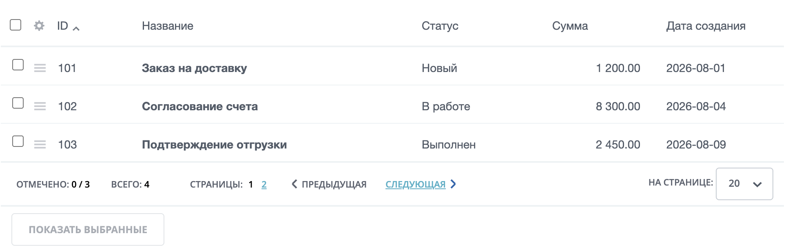
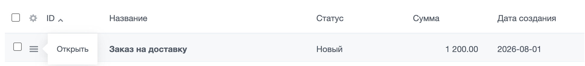

`main.ui.grid` выводит данные в виде интерактивной таблицы. Компонент подходит для списков элементов, отчетов и административных интерфейсов, где нужны колонки, сортировка, постраничная навигация, действия строк и групповые операции.

Компонент отвечает за интерфейс таблицы и пользовательские настройки колонок. Данные, сортировку, фильтрацию и права готовит серверный код страницы. Если на странице есть [фильтр `main.ui.filter`](./main-ui-filter.md), используйте общий идентификатор грида и фильтра.

## Вывести таблицу

Минимальный вызов требует `GRID_ID` и `COLUMNS`. Если строк пока нет, передайте пустой массив `ROWS`.

```php
<?php

$gridId = 'orders_grid';

$columns = [
    [
        'id' => 'ID',
        'name' => 'ID',
        'sort' => 'ID',
        'default' => true,
    ],
    [
        'id' => 'TITLE',
        'name' => 'Название',
        'sort' => 'TITLE',
        'default' => true,
    ],
];

$rows = [
    [
        'id' => 1,
        'data' => [
            'ID' => 1,
            'TITLE' => 'Заказ на доставку',
        ],
    ],
];

$APPLICATION->IncludeComponent(
    'bitrix:main.ui.grid',
    '',
    [
        'GRID_ID' => $gridId,
        'COLUMNS' => $columns,
        'ROWS' => $rows,
        'AJAX_MODE' => 'Y',
        'AJAX_OPTION_JUMP' => 'N',
        'AJAX_OPTION_HISTORY' => 'N',
    ]
);
```

{width=768px height=76px}

Основные параметры:

| Параметр | Тип | Описание |
|---|---|---|
| `GRID_ID` | `string` | Обязательный строковый идентификатор таблицы. По нему компонент хранит настройки колонок и состояние грида |
| `COLUMNS` | `array` | Обязательный массив колонок. Для совместимости компонент также принимает `HEADERS`, но в новом коде используйте `COLUMNS` |
| `ROWS` | `array` | Массив строк. Если не передать массив, компонент подготовит пустой набор строк |
| `SORT` | `array` | Текущая сортировка в формате `['FIELD' => 'asc']` или `['FIELD' => 'desc']` |
| `NAV_OBJECT` | `Bitrix\Main\UI\PageNavigation` | Объект постраничной навигации |
| `TOTAL_ROWS_COUNT` | `int` | Общее количество записей |
| `AJAX_MODE`, `AJAX_OPTION_JUMP`, `AJAX_OPTION_STYLE`, `AJAX_OPTION_HISTORY` | `string` | Параметры AJAX-обновления компонента |

Компонент не получает данные из базы сам. Подготовьте строки, фильтр, сортировку и лимит до вызова `IncludeComponent()`.

## Описать колонки

Каждая колонка — массив с обязательным `id`. Заголовок задается в `name`.

```php
<?php

$column = [
    'id' => 'STATUS',
    'name' => 'Статус',
    'sort' => 'STATUS',
    'default' => true,
    'width' => 160,
    'align' => 'left',
];
```

Основные ключи колонки:

| Ключ | Тип | Описание |
|---|---|---|
| `id` | `string` | Обязательный идентификатор колонки. Он должен совпадать с ключом значения в `ROWS[].data`, если колонка выводит обычное поле |
| `name` | `string` | Заголовок колонки |
| `type` | `string` | Тип колонки для серверного слоя `Bitrix\Main\Grid\Column\Column`. Если тип не передан, используется текстовый тип |
| `sort` | `string` | Поле сортировки. По нему компонент связывает заголовок с направлением сортировки |
| `first_order` | `string` | Первое направление сортировки: `asc` или `desc` |
| `default` | `bool` | `true` показывает колонку по умолчанию |
| `width` | `int` | Ширина колонки в пикселях |
| `align` | `string` | Выравнивание содержимого. Поддерживаются значения `left`, `center`, `right` и `justify` |
| `showname` | `bool` | `false` скрывает текст заголовка |
| `resizeable` | `bool` | `false` запрещает менять ширину колонки |
| `sticked` | `bool` | Закрепляет колонку, если включен режим закрепленных колонок |
| `prevent_default` | `bool` | Отменяет стандартное выделение строки при клике по ячейке |
| `editable` | `array` или `bool` | Параметры инлайн-редактирования или `true` для стандартной настройки по типу колонки |
| `color` | `string` | CSS-цвет или CSS-класс цвета для оформления колонки |
| `hint`, `hintHtml`, `hintInteractivity` | `string` или `bool` | Параметры подсказки в заголовке |

Чтобы закрепить колонку, включите `ALLOW_STICKED_COLUMNS` в параметрах компонента и задайте `sticked` только тем колонкам, которые должны оставаться слева при горизонтальной прокрутке.

Не используйте внутренние CSS-классы шаблона грида для оформления страницы. Для внешнего вида задавайте параметры компонента или собственные CSS-классы.

## Описать строки

Строка содержит идентификатор и данные для колонок. Значения из `data` выводятся по ключам колонок.

```php
<?php

$row = [
    'id' => 42,
    'data' => [
        'ID' => 42,
        'TITLE' => 'Заказ на доставку',
        'STATUS' => 'Новый',
    ],
];
```

Основные ключи строки:

| Ключ | Тип | Описание |
|---|---|---|
| `id` | `int` или `string` | Обязательный идентификатор строки. Он нужен для выбора, действий и обновления строки |
| `data` | `array` | Обязательные исходные значения строки |
| `columns` | `array` | Подготовленное содержимое ячеек. Используйте этот ключ, если в ячейке нужен HTML или форматирование, отличное от значения в `data` |
| `actions` | `array` | Пункты меню строки |
| `editable` | `bool` | Разрешает редактировать строку, если инлайн-редактирование включено для грида и колонок |
| `editableColumns` | `array` | Список колонок, которые можно редактировать в этой строке |
| `attrs` | `array` | HTML-атрибуты строки |
| `columnClasses` | `array` | CSS-классы отдельных ячеек |

Если в `columns` выводится HTML, экранируйте пользовательские данные до передачи в компонент.

```php
<?php

use Bitrix\Main\Text\HtmlFilter;

$row = [
    'id' => 42,
    'data' => [
        'TITLE' => $title,
    ],
    'columns' => [
        'TITLE' => '<strong>' . HtmlFilter::encode($title) . '</strong>',
    ],
];
```

## Добавить сортировку

Чтобы колонка стала сортируемой, передайте ей ключ `sort` и включите `ALLOW_SORT`. Текущее направление сортировки передайте в `SORT`.

Если передан `ROW_LAYOUT`, компонент отключает сортировку колонок и строк.

```php
<?php

use Bitrix\Main\Grid\Options;

$gridOptions = new Options($gridId);
$sorting = $gridOptions->getSorting([
    'sort' => [
        'ID' => 'desc',
    ],
    'vars' => [
        'by' => 'by',
        'order' => 'order',
    ],
]);

$sort = $sorting['sort'];
```

Полученный `$sort` примените к выборке данных, а затем передайте в компонент.

```php
<?php

$APPLICATION->IncludeComponent(
    'bitrix:main.ui.grid',
    '',
    [
        'GRID_ID' => $gridId,
        'COLUMNS' => $columns,
        'ROWS' => $rows,
        'SORT' => $sort,
        'ALLOW_SORT' => true,
    ]
);
```

Компонент показывает состояние сортировки в заголовке, но данные должны прийти уже отсортированными. Если источник данных — ORM, передайте `$sort` в параметр `order` метода `getList()`.

## Добавить пагинацию

Для постраничной навигации подготовьте объект `Bitrix\Main\UI\PageNavigation`, задайте количество записей и передайте объект в `NAV_OBJECT`.

```php
<?php

use Bitrix\Main\Grid\Options;
use Bitrix\Main\UI\PageNavigation;

$gridOptions = new Options($gridId);
$navParams = $gridOptions->getNavParams([
    'nPageSize' => 20,
]);

$nav = new PageNavigation('orders');
$nav->allowAllRecords(false)
    ->setPageSize((int)$navParams['nPageSize'])
    ->initFromUri()
;

$nav->setRecordCount($totalCount);

$APPLICATION->IncludeComponent(
    'bitrix:main.ui.grid',
    '',
    [
        'GRID_ID' => $gridId,
        'COLUMNS' => $columns,
        'ROWS' => $rows,
        'NAV_OBJECT' => $nav,
        'TOTAL_ROWS_COUNT' => $totalCount,
        'SHOW_PAGINATION' => true,
        'SHOW_TOTAL_COUNTER' => true,
        'PAGE_SIZES' => [
            ['NAME' => '10', 'VALUE' => '10'],
            ['NAME' => '20', 'VALUE' => '20'],
            ['NAME' => '50', 'VALUE' => '50'],
        ],
        'SHOW_PAGESIZE' => true,
    ]
);
```

Примените к выборке значения `$nav->getLimit()` и `$nav->getOffset()`. Компонент выводит навигацию, но не ограничивает исходные данные сам.

## Добавить действия

Меню строки задается в ключе `actions`. Пункт меню может содержать текст, ссылку `href`, JavaScript-обработчик `onclick` или вложенные пункты.

```php
<?php

$row = [
    'id' => 42,
    'data' => [
        'ID' => 42,
        'TITLE' => 'Заказ на доставку',
    ],
    'actions' => [
        [
            'text' => 'Открыть',
            'onclick' => 'BX.SidePanel.Instance.open("/orders/42/");',
        ],
    ],
];
```

{width=768px height=76px}

Групповая панель задается параметром `ACTION_PANEL`. Чтобы пользователь мог выбрать строки и увидеть панель, передайте параметры `SHOW_ROW_CHECKBOXES`, `SHOW_ACTION_PANEL` и `SHOW_SELECTED_COUNTER` со значением `true`.

```php
<?php

$actionPanel = [
    'GROUPS' => [
        [
            'ITEMS' => [
                [
                    'TYPE' => 'BUTTON',
                    'TEXT' => 'Удалить',
                    'ONCHANGE' => [
                        [
                            'ACTION' => 'CALLBACK',
                            'DATA' => [
                                [
                                    'JS' => 'BX.UI.Notification.Center.notify({content: "Действие запущено"});',
                                ],
                            ],
                        ],
                    ],
                ],
            ],
        ],
    ],
];

$APPLICATION->IncludeComponent(
    'bitrix:main.ui.grid',
    '',
    [
        'GRID_ID' => $gridId,
        'COLUMNS' => $columns,
        'ROWS' => $rows,
        'ACTION_PANEL' => $actionPanel,
        'SHOW_ACTION_PANEL' => true,
        'SHOW_ROW_CHECKBOXES' => true,
        'SHOW_SELECTED_COUNTER' => true,
    ]
);
```

Обработчики действий строки и групповых операций должны проверять права и состояние записей на сервере. Кнопка или пункт меню только запускают действие из интерфейса.

## Связать с фильтром

Используйте один идентификатор для фильтра и грида. Сначала получите значения фильтра, затем выберите строки с учетом условий и передайте эти строки в грид.

В примере функции `getOrders()` и `prepareGridRows()` обозначают код вашего проекта. Замените их на свой ORM-запрос и сборщик строк.

Функция `getOrders()` должна вернуть элементы с учетом фильтра и сортировки. Функция `prepareGridRows()` должна преобразовать элементы в массив `ROWS`.

```php
<?php

use Bitrix\Main\UI\Filter\Options as FilterOptions;
use Bitrix\Main\Grid\Options as GridOptions;

$gridId = 'orders_grid';
$filterFields = [
    ['id' => 'FIND', 'name' => 'Поиск'],
    ['id' => 'STATUS', 'name' => 'Статус', 'type' => 'list'],
];

$filterOptions = new FilterOptions($gridId);
$filter = $filterOptions->getFilter($filterFields);

$ormFilter = [];
if (!empty($filter['FIND']))
{
    $ormFilter['%TITLE'] = $filter['FIND'];
}
if (!empty($filter['STATUS']))
{
    $ormFilter['=STATUS'] = $filter['STATUS'];
}

$gridOptions = new GridOptions($gridId);
$sorting = $gridOptions->getSorting([
    'sort' => [
        'ID' => 'desc',
    ],
]);

$items = getOrders($ormFilter, $sorting['sort']);
$rows = prepareGridRows($items);

$APPLICATION->IncludeComponent(
    'bitrix:main.ui.filter',
    '',
    [
        'FILTER_ID' => $gridId,
        'GRID_ID' => $gridId,
        'FILTER' => $filterFields,
        'ENABLE_LABEL' => true,
    ]
);

$APPLICATION->IncludeComponent(
    'bitrix:main.ui.grid',
    '',
    [
        'GRID_ID' => $gridId,
        'COLUMNS' => $columns,
        'ROWS' => $rows,
        'SORT' => $sorting['sort'],
        'AJAX_MODE' => 'Y',
        'AJAX_OPTION_JUMP' => 'N',
        'AJAX_OPTION_HISTORY' => 'N',
    ]
);
```

В этом примере фильтр и грид используют один `GRID_ID`. После применения фильтра компонент обновляет связанную таблицу, а серверный код страницы каждый раз получает значения фильтра, применяет их к выборке и готовит новый набор строк.

## Использовать серверный слой Grid

Для сложных списков используйте серверный слой `Bitrix\Main\Grid`, если в модуле уже есть класс грида и провайдеры данных. Класс `Bitrix\Main\Grid\Component\ComponentParams` преобразует объект грида в параметры компонента.

В примере `$grid` — экземпляр класса вашего модуля, который наследует `Bitrix\Main\Grid\Grid` и описывает колонки, строки, фильтр, пагинацию и действия.

```php
<?php

use Bitrix\Main\Grid\Component\ComponentParams;

$grid->processRequest();
$grid->getPagination()->setRecordCount($totalCount);
$grid->setRawRows($items);

$APPLICATION->IncludeComponent(
    'bitrix:main.ui.grid',
    '',
    ComponentParams::get($grid)
);
```

`ComponentParams::get()` подготавливает для компонента `GRID_ID`, `ROWS`, `COLUMNS`, параметры пагинации, панель действий, сортировку, AJAX-настройки и меню настроек грида. Этот способ подходит, когда в модуле уже есть свой класс грида, провайдер колонок и сборщик строк.
