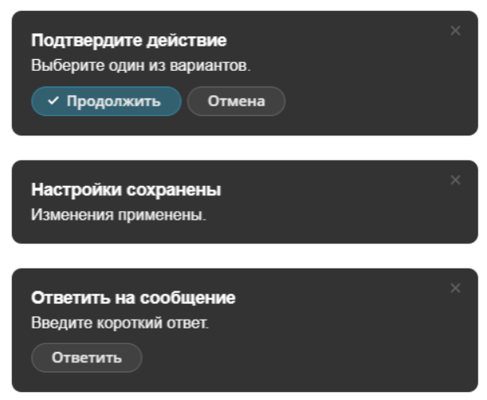

Менеджер уведомлений — это компонент для показа коротких сообщений вне основного сценария страницы: результата операции, нового события или действия, которое требует внимания.

Расширение `ui.notification-manager` само определяет, где показать уведомление: внутри страницы, в браузере или в десктопном приложении.

Для локального уведомления вызовите `Notifier.notify()` в JavaScript. Если сообщение нужно вывести именно внутри страницы, используйте `Notifier.notifyViaBrowserProvider()`.

Чтобы отправить уведомление пользователю с сервера, создайте объект `Bitrix\UI\NotificationManager\Notification` и передайте его в `Bitrix\UI\NotificationManager\Notifier::notify()`.

{width=619px height=508px}

## Подключить расширение

Если вы подключаете компонент из PHP, загрузите расширение `ui.notification-manager`.

```php
\Bitrix\Main\UI\Extension::load('ui.notification-manager');
```

Если вы работаете в модульном JavaScript, импортируйте объект `Notifier`.

```js
import { Notifier } from 'ui.notification-manager';
```

## Показать уведомление

Метод `Notifier.notify(options)` показывает уведомление. Передайте идентификатор уведомления в `id` и текст сообщения в `text`.

```js
import { Notifier } from 'ui.notification-manager';

Notifier.notify({
    id: 'task-deadline-update-error',
    text: 'Не удалось сохранить срок задачи.',
});
```

Метод не возвращает результат.

## Показать уведомление внутри страницы

Метод `Notifier.notifyViaBrowserProvider(options)` принудительно выводит уведомление внутри страницы. Используйте его для сообщений, которые должны оставаться частью текущего интерфейса независимо от окружения пользователя.

```js
import { Notifier } from 'ui.notification-manager';

Notifier.notifyViaBrowserProvider({
    id: 'booking-save-error',
    title: 'Бронирование не сохранено',
    text: 'Проверьте обязательные поля.',
});
```

Уведомление внутри страницы закрывается автоматически через шесть секунд. Пользователь также может закрыть его вручную.

Если пользователь раскрыл поле быстрого ответа, автозакрытие отключается.

## Передать параметры

Методы `Notifier.notify()` и `Notifier.notifyViaBrowserProvider()` принимают объект с параметрами уведомления.

#|
|| **Параметр** | **Тип** | **Описание** ||
|| `id` | `string` | Обязательный идентификатор уведомления. Используется в событиях, чтобы определить уведомление. Пустая строка вызывает ошибку. ||
|| `category` | `string` | Категория уведомления. По умолчанию пустая строка. ||
|| `title` | `string` | Заголовок уведомления. По умолчанию пустая строка. ||
|| `text` | `string` | Основной текст уведомления. По умолчанию пустая строка. ||
|| `icon` | `string` | URL изображения в уведомлении. По умолчанию пустая строка. ||
|| `inputPlaceholderText` | `string` | Текст-подсказка для поля быстрого ответа. Если не передать параметр, поле не выводится. ||
|| `button1Text` | `string` | Текст первой кнопки действия. Если не передать параметр, кнопка не выводится. ||
|| `button2Text` | `string` | Текст второй кнопки действия. Если не передать параметр, кнопка не выводится. ||
|#


Если передать непустой `inputPlaceholderText`, уведомление покажет поле быстрого ответа. Значения `button1Text` и `button2Text` в этом случае не используются.

Если кнопки или поле быстрого ответа должны появиться именно внутри страницы, используйте `Notifier.notifyViaBrowserProvider()`.

## Обработать события

Метод `Notifier.subscribe(eventName, handler)` подписывает обработчик на события уведомлений. Если передать неподдерживаемое имя события, метод вызовет ошибку.

**Событие** `action`**.** Вызывается при клике по кнопке или отправке быстрого ответа. В `event.getData()` передает:

-  `id` — идентификатор уведомления,

-  `action` — код действия,

-  `userInput` — текст быстрого ответа, если пользователь его отправил.

Для кнопок событие `action` возвращает код `button_1` или `button_2`.

Для быстрого ответа обработчик получает текст в `userInput`. Код действия зависит от того, где показано уведомление, поэтому проверяйте наличие `userInput`, а не значение `action`.

```js
import { Notifier } from 'ui.notification-manager';

Notifier.subscribe('action', (event) => {
    const { id, action, userInput } = event.getData();

    if (userInput)
    {
        console.log(`Ответ для уведомления ${id}: ${userInput}`);
        return;
    }

    console.log(`Выбрано действие ${action} для уведомления ${id}`);
});

Notifier.notifyViaBrowserProvider({
    id: 'document-approval',
    title: 'Документ ожидает решения',
    button1Text: 'Согласовать',
    button2Text: 'Отклонить',
});
```

**Событие** `click`**.** Вызывается при клике по уведомлению. В `event.getData()` передает:

-  `id` — идентификатор уведомления.

```js
import { Notifier } from 'ui.notification-manager';

Notifier.subscribe('click', (event) => {
    const { id } = event.getData();

    console.log(`Пользователь нажал на уведомление ${id}`);
});
```

**Событие** `close`**.** Вызывается при закрытии уведомления. В `event.getData()` передает:

-  `id` — идентификатор уведомления,

-  `reason` — причина закрытия.

Событие `close` возвращает причину `closed_by_user`, если пользователь закрыл уведомление, или `expired`, если уведомление закрылось автоматически.

```js
import { Notifier } from 'ui.notification-manager';

Notifier.subscribe('close', (event) => {
    const { id, reason } = event.getData();

    console.log(`Уведомление ${id} закрыто: ${reason}`);
});
```

## Отправить уведомление с сервера

Используйте серверную отправку, когда событие возникает не на открытой странице пользователя. Например:

-  сформирован отчет,

-  изменен статус задачи,

-  завершена фоновая обработка файла.

Для отправки создайте объект `Bitrix\UI\NotificationManager\Notification` и вызовите `Bitrix\UI\NotificationManager\Notifier::notify()`.

В первый аргумент `Notifier::notify()` передайте идентификатор пользователя, который должен получить сообщение.

Во второй аргумент `Notifier::notify()` передайте объект `Notification`.

Передайте в конструктор `Notification` все параметры. Для необязательных значений используйте пустые строки.

Для серверной отправки должны выполняться условия:

-  Модуль `pull` должен быть подключен. Без него `Notifier::notify()` возвращает `false`.

-  На клиенте пользователя должно быть загружено расширение `ui.notification-manager`. Оно получает событие Pull и показывает уведомление.

```php
use Bitrix\UI\NotificationManager\Notification;
use Bitrix\UI\NotificationManager\Notifier;

$userId = 123;

$notification = new Notification([
    'id' => 'report-ready',
    'category' => 'reports',
    'title' => 'Отчет готов',
    'text' => 'Откройте раздел отчетов, чтобы скачать файл.',
    'icon' => '',
    'inputPlaceholderText' => '',
    'button1Text' => '',
    'button2Text' => '',
]);

$isSent = Notifier::notify($userId, $notification);
```