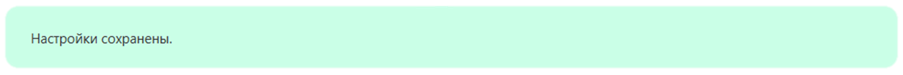
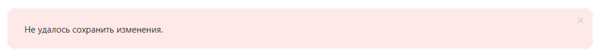
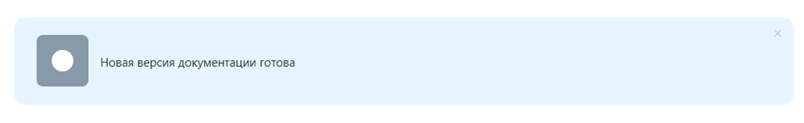

Системный алерт — это блок для уведомлений, предупреждений и ошибок в интерфейсе. В него можно передать короткий текст или готовый DOM-узел. Компонент оформляет сообщение по правилам дизайн-системы: задает фон и рамку, может показать изображение слева и кнопку закрытия.

В Bitrix Framework за системный алерт отвечает расширение `ui.system.alert`. Оно экспортирует класс `BX.UI.System.Alert.Alert`, объект `AlertDesign` и Vue-компонент.

## Подключить расширение

Если вы подключаете компонент из PHP, загрузите расширение `ui.system.alert`.

```php
\Bitrix\Main\UI\Extension::load('ui.system.alert');
```

Если вы работаете в модульном JavaScript, импортируйте класс и константы из `ui.system.alert`.

```js
import { Alert, AlertDesign } from 'ui.system.alert';
```

## Создать алерт

Чтобы создать алерт, выполните основные действия:

1. Создайте экземпляр `Alert`.

2. Передайте текст или DOM-узел в параметр `content`.

3. Получите DOM-узел через `render()`.

4. Добавьте полученный узел на страницу.

```js
import { Alert, AlertDesign } from 'ui.system.alert';

const alert = new Alert({
    design: AlertDesign.tintedSuccess,
    content: 'Настройки сохранены.',
});

document.getElementById('alert-container').append(alert.render());
```

{width=1232px height=103px}

Содержимым может быть не только строка, но и готовый DOM-элемент.

```js
import { Alert, AlertDesign } from 'ui.system.alert';

const content = document.createElement('div');
content.textContent = 'Проверьте обязательные поля.';

const alert = new Alert({
    design: AlertDesign.tintedWarning,
    content,
});

document.getElementById('alert-container').append(alert.render());
```

## Передать параметры

Конструктор `Alert` принимает объект с параметрами.

-  `design` — вариант оформления. По умолчанию компонент использует `AlertDesign.tinted`.

-  `hasCloseButton` — кнопка закрытия. Передайте `true`, чтобы показать кнопку.

-  `leftImage` — URL изображения слева. По умолчанию `null`. Если передать пустую строку или `null`, изображение не выводится.

-  `content` — содержимое алерта. Можно передать строку или DOM-узел. Если параметр не передан, компонент хранит `null`.

   Если передать DOM-узел, компонент очистит контейнер и вставит этот узел внутрь блока `.ui-system-alert__content`. Если передать `null`, компонент очистит контейнер без вставки нового содержимого.

-  `events.closeButtonClick` — обработчик клика по кнопке закрытия. По умолчанию `null`.

### Добавить кнопку закрытия

Чтобы добавить кнопку закрытия и обработать клик по ней, передайте `hasCloseButton: true` и обработчик в `events.closeButtonClick`.

Компонент сам не удаляет алерт по клику, а только вызывает обработчик закрытия. Чтобы удалить алерт при закрытии, вызовите `destroy()` в `events.closeButtonClick` или в обработчике, заданном через `onClose`.

```js
import { Alert, AlertDesign } from 'ui.system.alert';

const alert = new Alert({
    design: AlertDesign.tintedAlert,
    content: 'Не удалось сохранить изменения.',
    hasCloseButton: true,
    events: {
        closeButtonClick: () => {
            alert.destroy();
        },
    },
});

document.getElementById('alert-container').append(alert.render());
```

{width=1253px height=114px}

### Добавить изображение

Чтобы показать изображение слева, передайте URL в `leftImage`.

```js
import { Alert, AlertDesign } from 'ui.system.alert';

const alert = new Alert({
    design: AlertDesign.tinted,
    content: 'Новая версия документации готова.',
    leftImage: '/images/alert-illustration.svg',
});

document.getElementById('alert-container').append(alert.render());
```

{width=1262px height=194px}

## Выбрать оформление

Оформление компонента задается значениями из `AlertDesign`.

-  `AlertDesign.tinted` — синий нейтральный алерт для информационных сообщений.

-  `AlertDesign.tintedSuccess` — зеленый алерт для сообщений об успешном действии.

-  `AlertDesign.tintedWarning` — желтый алерт для предупреждений, которые требуют внимания.

-  `AlertDesign.tintedAlert` — красный алерт для ошибок и критичных сообщений.

## Управлять компонентом

Используйте публичные свойства и методы `Alert`, чтобы управлять состоянием компонента.

-  `render()` возвращает корневой DOM-узел алерта. Повторный вызов возвращает тот же узел.

-  `destroy()` удаляет DOM-узел алерта и отвязывает обработчик кнопки закрытия.

-  `content` позволяет прочитать или заменить содержимое после создания компонента.

-  `design` позволяет прочитать или заменить вариант оформления.

-  `leftImage` позволяет прочитать или заменить URL изображения слева.

-  `hasCloseButton` позволяет показать или скрыть кнопку закрытия.

-  `onClose` позволяет прочитать или заменить обработчик кнопки закрытия.

-  `container` возвращает корневой DOM-узел алерта или `null`, если компонент еще не отрисован.

## Использовать Vue-компонент

Расширение экспортирует Vue-версию через пространство `Vue`. Компонент принимает `design`, `hasCloseButton`, `leftImage` и генерирует событие `closeButtonClick`.

```js
import { Vue, AlertDesign } from 'ui.system.alert';

export const ExampleComponent = {
    components: {
        SystemAlert: Vue.Alert,
    },
    data()
    {
        return {
            AlertDesign,
        };
    },
    methods: {
        handleClose()
        {
            // Обработайте закрытие алерта.
        },
    },
};
```

Используйте зарегистрированный `SystemAlert` в шаблоне.

```js
import { AlertDesign } from 'ui.system.alert';
import { Alert } from 'ui.system.alert.vue';

export const ExampleComponent = {
    components: {
        Alert,
    },
    data()
    {
        return {
            AlertDesign,
        };
    },
    methods: {
        handleClose()
        {
            // Обработайте закрытие алерта.
        },
    },
    template: `
        <Alert
            :design="AlertDesign.tintedWarning"
            :hasCloseButton="true"
            @closeButtonClick="handleClose"
        >
            Проверьте обязательные поля.
        </Alert>
    `,
};
```



Подробнее о работе с Vue в Bitrix Framework читайте в статье [Vue.js](../advanced/vue.md).


