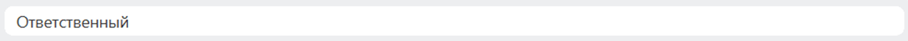
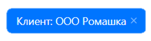
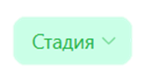
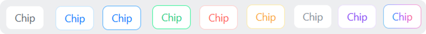
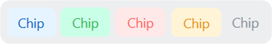
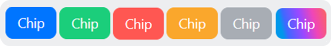
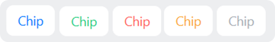
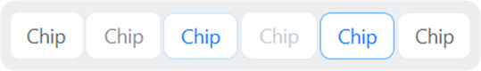
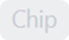

Системный чип — это компактный элемент интерфейса для короткой текстовой метки, выбранного значения или действия.

Чип используют для выбранного значения в фильтре, статуса, участника, категории или действия в ограниченном пространстве.

Основное содержимое чипа — текст, иконка из `ui.icon-set.api.core` или изображение. Дополнительные элементы — иконка очистки, стрелка выпадающего списка и значок блокировки.

В Bitrix Framework за системный чип отвечает расширение `ui.system.chip`. Для Vue используйте отдельное расширение `ui.system.chip.vue`.

## Подключить расширение

Если вы подключаете компонент из PHP, загрузите расширение `ui.system.chip`.

```php
\Bitrix\Main\UI\Extension::load('ui.system.chip');
```

Если вы работаете в модульном JavaScript, импортируйте класс и константы из `ui.system.chip`.

```js
import { Chip, ChipDesign, ChipSize } from 'ui.system.chip';
```

## Создать чип

Чтобы создать чип, выполните основные действия:

1. Создайте экземпляр `Chip`.

2. Передайте текст в параметр `text`.

3. Получите DOM-узел через `render()`.

4. Добавьте полученный узел на страницу.

```js
import { Chip, ChipDesign, ChipSize } from 'ui.system.chip';

const chip = new Chip({
    text: 'Ответственный',
    size: ChipSize.Md,
    design: ChipDesign.Outline,
});

document.getElementById('chip-container').append(chip.render());
```

{width=1234px height=57px}

Повторный вызов `render()` возвращает тот же DOM-узел. Если нужно удалить чип со страницы и отвязать его обработчики, вызовите `destroy()`.

## Передать параметры

Передайте в конструктор `Chip` объект с параметрами, чтобы задать содержимое, оформление и поведение чипа.

### Содержимое и внешний вид

-  `size` — размер чипа. По умолчанию используется `ChipSize.Lg`.

-  `design` — вариант оформления. По умолчанию используется `ChipDesign.Outline`. Выбор значений описан в разделе [Выбрать оформление](#выбрать-оформление).

-  `icon` — иконка из `ui.icon-set.api.core`. Используйте ее, чтобы показать тип значения или действие без дополнительного текста.

-  `iconColor` — цвет иконки. Передайте значение, если иконка должна отличаться от цвета выбранного оформления.

-  `iconBackground` — фон области иконки. Используйте его, когда иконку нужно визуально отделить от текста.

-  `image` — изображение слева от текста. Передайте объект с `src` и `alt`, чтобы показать аватар или пользовательское изображение вместо иконки.

-  `text` — текст чипа. Передайте короткое название значения, фильтра, статуса или действия. По умолчанию пустая строка.

-  `rounded` — скругление до до овальной формы. При `true` компонент использует максимальное скругление.

-  `collapsed` — свернутый режим, в котором текст визуально скрыт. Используйте его, когда нужно оставить только иконку или изображение.

По умолчанию `rounded` и `collapsed` выключены: `false`.

### Правая часть и поведение

-  `withClear` — иконка очистки справа. Используйте ее для выбранных значений, очистка которых обрабатывается через `onClear`.

-  `dropdown` — стрелка выпадающего списка справа. Используйте ее, если по клику на чип вы открываете меню или список вариантов.

-  `dropdownActive` — активное состояние стрелки выпадающего списка. Передайте `true`, когда связанное меню открыто: стрелка повернется на 180 градусов.

-  `lock` — значок блокировки справа. Используйте его, чтобы показать ограничение доступа или недоступность изменения.

-  `compact` — ограничение ширины по содержимому. Оставьте `true`, если ширина чипа должна зависеть от содержимого. Передайте `false`, чтобы не ограничивать ширину чипа только содержимым.

-  `trimmable` — обрезка длинного текста. Включайте его, если текст может не поместиться в доступную ширину.

По умолчанию `withClear`, `dropdown`, `dropdownActive`, `lock` и `trimmable` выключены: `false`, а `compact` включен: `true`.

### Обработчики

-  `onClick` — обработчик выбора или открытия действия по чипу. Вызывается при клике по чипу и при нажатии `Enter`, если фокус находится на чипе и не нажаты `Ctrl` или `Cmd`.

-  `onClear` — обработчик очистки выбранного значения. Клик по иконке очистки не всплывает до обработчика `onClick`.

Параметр `lock` и оформление `ChipDesign.Disabled` не блокируют обработчики клика. Если чип не должен реагировать на действия пользователя, не передавайте `onClick` или проверяйте доступность в своем обработчике.

## Добавить иконку или изображение

Чтобы добавить иконку и задать ей отдельные цвета, передайте `icon`, `iconColor` и `iconBackground`.

```js
import { Chip, ChipDesign } from 'ui.system.chip';
import { Outline } from 'ui.icon-set.api.core';

const chip = new Chip({
    text: 'Отменено',
    design: ChipDesign.Tinted,
    icon: Outline.CROSS_M,
    iconColor: '#c21b16',
    iconBackground: '#fde8e8',
});
```

{width=209px height=77px}

Изображение используйте, когда слева нужен аватар или готовое изображение. Если переданы `image` и `icon`, компонент покажет изображение вместо иконки.

```js
import { Chip } from 'ui.system.chip';

const chip = new Chip({
    text: 'Иван Иванов',
    image: {
        src: '/upload/avatar.png',
        alt: 'Иван Иванов',
    },
});
```

## Добавить очистку и выпадающий список

Иконка очистки появляется при `withClear: true`. Компонент сам не удаляет чип и не очищает выбранное значение: он только вызывает обработчик `onClear`.

```js
import { Chip, ChipDesign } from 'ui.system.chip';

const chip = new Chip({
    text: 'Клиент: ООО Ромашка',
    design: ChipDesign.Filled,
    withClear: true,
    onClear: () => {
        chip.destroy();
    },
});

document.getElementById('chip-container').append(chip.render());
```

{width=312px height=86px}

Стрелка выпадающего списка появляется при `dropdown: true`. Используйте `dropdownActive`, если нужно показать открытое состояние меню.

```js
import { Chip, ChipDesign } from 'ui.system.chip';

const chip = new Chip({
    text: 'Стадия',
    design: ChipDesign.TintedSuccess,
    dropdown: true,
    onClick: () => {
        chip.setDropdownActive(!chip.isDropdownActive());
    },
});

document.getElementById('chip-container').append(chip.render());
```

{width=157px height=84px}

Режимы `dropdown` и `withClear` можно включить одновременно.

## Выбрать размер

Размер задается значениями из `ChipSize`.

-  `ChipSize.Lg` — большой чип, значение по умолчанию.

-  `ChipSize.Md` — средний чип.

-  `ChipSize.Sm` — маленький чип.

-  `ChipSize.Xs` — самый маленький чип.

Используйте `ChipSize.Md`, `ChipSize.Sm` или `ChipSize.Xs` для плотных списков и панелей.

## Выбрать оформление

Оформление задается значениями из `ChipDesign`. Семейство определяет визуальный слой чипа: контур, светлую подложку, плотную заливку или тень. Суффикс меняет цветовую схему текста, фона и границы.

### Контур

{width=840px height=68px}

| Значение                      | Описание                                                        |
|-------------------------------|-----------------------------------------------------------------|
| `ChipDesign.Outline`          | Базовый контурный чип с нейтральным текстом и светлой границей. |
| `ChipDesign.OutlineAccent`    | Контурный чип с основным акцентным цветом.                      |
| `ChipDesign.OutlineAccent2`   | Контурный чип со вторым акцентным вариантом палитры.            |
| `ChipDesign.OutlineSuccess`   | Контурный чип в палитре успешного состояния.                    |
| `ChipDesign.OutlineAlert`     | Контурный чип в палитре ошибки или критичного состояния.        |
| `ChipDesign.OutlineWarning`   | Контурный чип в палитре предупреждения.                         |
| `ChipDesign.OutlineNoAccent`  | Контурный чип без акцентного цвета.                             |
| `ChipDesign.OutlineCopilot`   | Контурный чип с палитрой Copilot.                               |
| `ChipDesign.OutlineBitrixGpt` | Контурный чип со специальным градиентным оформлением BitrixGPT. |

### Светлая заливка

{width=455px height=75px}

| Значение                    | Описание                                                            |
|-----------------------------|---------------------------------------------------------------------|
| `ChipDesign.Tinted`         | Чип со светлой акцентной подложкой и цветным текстом.               |
| `ChipDesign.TintedSuccess`  | Чип со светлой подложкой в палитре успешного состояния.             |
| `ChipDesign.TintedAlert`    | Чип со светлой подложкой в палитре ошибки или критичного состояния. |
| `ChipDesign.TintedWarning`  | Чип со светлой подложкой в палитре предупреждения.                  |
| `ChipDesign.TintedNoAccent` | Чип со светлой нейтральной подложкой без акцентного цвета.          |

### Плотная заливка

{width=670px height=95px}

| Значение                     | Описание                                                          |
|------------------------------|-------------------------------------------------------------------|
| `ChipDesign.Filled`          | Чип с плотной акцентной заливкой и светлым текстом.               |
| `ChipDesign.FilledSuccess`   | Чип с плотной заливкой в палитре успешного состояния.             |
| `ChipDesign.FilledAlert`     | Чип с плотной заливкой в палитре ошибки или критичного состояния. |
| `ChipDesign.FilledWarning`   | Чип с плотной заливкой в палитре предупреждения.                  |
| `ChipDesign.FilledNoAccent`  | Чип с плотной нейтральной заливкой без акцентного цвета.          |
| `ChipDesign.FilledBitrixGpt` | Чип с плотной градиентной заливкой BitrixGPT.                     |

### Инвертированная заливка

{width=471px height=73px}

| Значение                            | Описание                                                                |
|-------------------------------------|-------------------------------------------------------------------------|
| `ChipDesign.FilledInverted`         | Инвертированный вариант плотной заливки: светлый фон и акцентный текст. |
| `ChipDesign.FilledSuccessInverted`  | Инвертированный чип в палитре успешного состояния.                      |
| `ChipDesign.FilledAlertInverted`    | Инвертированный чип в палитре ошибки или критичного состояния.          |
| `ChipDesign.FilledWarningInverted`  | Инвертированный чип в палитре предупреждения.                           |
| `ChipDesign.FilledNoAccentInverted` | Инвертированный чип в нейтральной палитре без акцентного цвета.         |

### Тень

{width=539px height=80px}

| Значение                          | Описание                                                     |
|-----------------------------------|--------------------------------------------------------------|
| `ChipDesign.Shadow`               | Чип со светлым фоном и тенью.                                |
| `ChipDesign.ShadowNoAccent`       | Чип с тенью в нейтральной палитре без акцентного цвета.      |
| `ChipDesign.ShadowAccent`         | Чип с тенью и акцентным цветом.                              |
| `ChipDesign.ShadowDisabled`       | Чип с тенью в визуально неактивном состоянии.                |
| `ChipDesign.ShadowOutlineAccent2` | Чип с тенью и контуром во втором акцентном варианте палитры. |
| `ChipDesign.ShadowOutline`        | Чип с тенью и нейтральным контуром.                          |

### Неактивное оформление

{width=86px height=50px}

| Значение              | Описание                                                             |
|-----------------------|----------------------------------------------------------------------|
| `ChipDesign.Disabled` | Визуально неактивный чип. Оформление не отключает обработчики клика. |

## Управлять компонентом

После создания чипа используйте методы, чтобы изменить состояние или получить текущие значения. В методы передают значения тех же типов, что и в одноименные параметры конструктора.

-  Получить DOM-узел — `render()` возвращает корневой DOM-узел чипа. Повторный вызов возвращает тот же узел.

-  Удалить чип — `destroy()` удаляет корневой DOM-узел и отвязывает обработчики. Используйте метод, если чип больше не нужен на странице.

-  Проверить отрисовку — `getWrapper()` возвращает корневой DOM-узел или `null`, если чип еще не отрисован.

-  Изменить размер и оформление — `setSize(size)` меняет размер, `setDesign(design)` меняет оформление.

-  Изменить текст — `setText(text)` заменяет текст без пересоздания чипа.

-  Изменить иконку — `setIcon(icon)`, `setIconColor(color)`, `setIconBackground(background)` меняют иконку, ее цвет и фон.

-  Изменить изображение — `setImage(image)` заменяет изображение слева.

-  Изменить форму — `setRounded(rounded)` управляет скруглением, `setCollapsed(collapsed)` — свернутым режимом.

-  Изменить ширину текста — `setCompact(compact)` управляет шириной по содержимому, `setTrimmable(trimmable)` — обрезкой длинного текста.

-  Изменить правую часть — `setWithClear(withClear)` показывает или скрывает иконку очистки, `setLock(lock)` — значок блокировки.

-  Изменить выпадающий список — `setDropdown(dropdown)` показывает или скрывает стрелку, `setDropdownActive(active)` меняет состояние стрелки.

-  Заменить обработчики — `setOnClick(callback)` и `setOnClear(callback)` меняют обработчики клика и очистки без пересоздания чипа.

-  Прочитать основные параметры — `getSize()`, `getDesign()`, `getImage()`, `getText()` возвращают размер, оформление, изображение и текст.

-  Прочитать параметры иконки — `getIcon()`, `getIconColor()`, `getIconBackground()` возвращают иконку, ее цвет и фон.

-  Проверить форму и ширину — `isRounded()`, `isCollapsed()`, `isCompact()`, `isTrimmable()` возвращают состояния этих режимов.

-  Проверить правую часть — `isWithClear()`, `isDropdown()`, `isDropdownActive()`, `isLock()` возвращают состояния очистки, стрелки и блокировки.

Например, после создания чипа можно изменить текст, оформление и правую иконку.

```js
import { Chip, ChipDesign } from 'ui.system.chip';

const chip = new Chip({
    text: 'В работе',
});

chip.setText('Готово');
chip.setDesign(ChipDesign.TintedSuccess);
chip.setWithClear(true);
```

Метод `Chip.getByNode(node)` возвращает экземпляр `Chip` по DOM-узлу чипа или вложенному узлу. Если узел не относится к чипу или передан не DOM-узел, метод возвращает `null`.

```js
import { Chip } from 'ui.system.chip';

document.addEventListener('click', (event) => {
    if (!(event.target instanceof HTMLElement))
    {
        return;
    }

    const chip = Chip.getByNode(event.target);

    if (chip)
    {
        console.log(chip.getText());
    }
});
```

## Использовать Vue-компонент

Vue-компонент доступен в расширении `ui.system.chip.vue`. Он принимает те же параметры, что и JS-компонент, кроме `dropdownActive`. Обработчики передаются через события `click` и `clear`.

Событие `clear` возникает только при клике по иконке очистки.

Vue-компонент не поворачивает стрелку по состоянию. Если нужен поворот, добавьте внешний класс и CSS или используйте JS-компонент с `dropdownActive`.

```js
import { Chip, ChipDesign, ChipSize } from 'ui.system.chip.vue';

export const ExampleComponent = {
    components: {
        Chip,
    },
    data()
    {
        return {
            ChipDesign,
            ChipSize,
            selected: true,
        };
    },
    methods: {
        handleClear()
        {
            this.selected = false;
        },
    },
    template: `
        <Chip
            v-if="selected"
            :size="ChipSize.Md"
            :design="ChipDesign.Outline"
            text="Клиент: ООО Ромашка"
            :withClear="true"
            @clear="handleClear"
        />
    `,
};
```



Подробнее о работе с Vue в Bitrix Framework читайте в статье [Vue.js](../advanced/vue.md).


