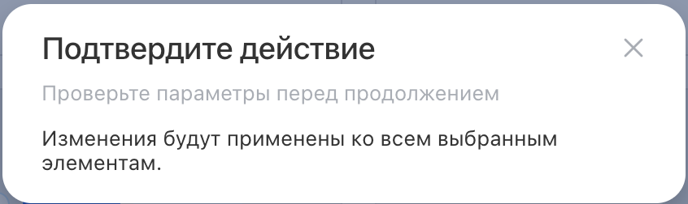
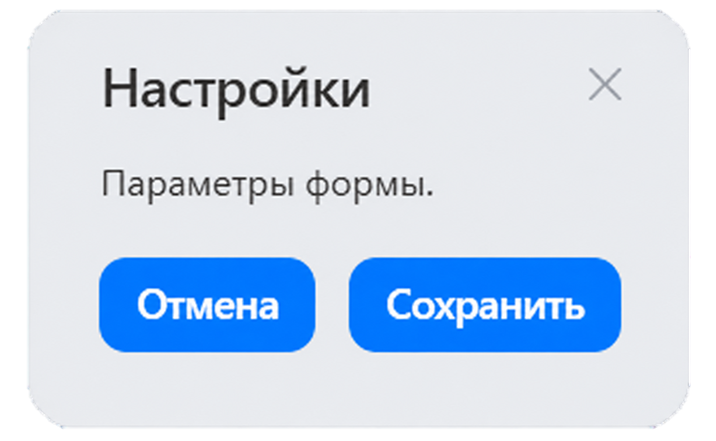
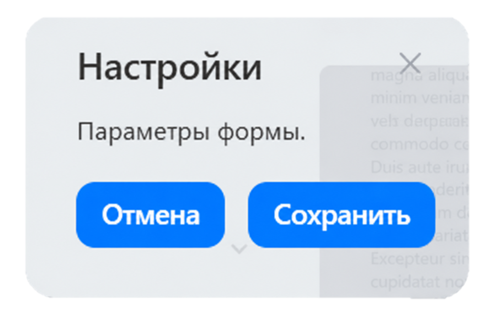

Системный диалог — это модальное окно для сценариев, где нужно показать пользователю отдельный шаг работы: подтверждение действия, форму, настройки или результат операции.

Компонент задает структуру диалога по правилам дизайн-системы: заголовок и подзаголовок, область содержимого, нижнюю панель с кнопками, фон, затемнение страницы и поведение закрытия.

В Bitrix Framework за системный диалог отвечает расширение `ui.system.dialog`. Оно экспортирует класс `Dialog` и объект `DialogBackground`.

## Подключить расширение

Если вы подключаете компонент из PHP, загрузите расширение `ui.system.dialog`.

```php
\Bitrix\Main\UI\Extension::load('ui.system.dialog');
```

Если вы работаете в модульном JavaScript, импортируйте нужные экспорты из `ui.system.dialog`.

```js
import { Dialog, DialogBackground } from 'ui.system.dialog';
```

## Показать диалог

Чтобы открыть диалог, создайте экземпляр `Dialog`, передайте DOM-узел в `content` и вызовите `show()`.

```js
import { Dialog } from 'ui.system.dialog';

const content = document.createElement('div');
content.textContent = 'Изменения будут применены ко всем выбранным элементам.';

const dialog = new Dialog({
    title: 'Подтвердите действие',
    subtitle: 'Проверьте параметры перед продолжением',
    content,
    width: 420,
    hasOverlay: true,
});

dialog.show();
```

{width=423px height=126px}

Метод `Dialog.show(options)` создает и сразу открывает диалог. Используйте его, если после открытия не нужно менять заголовок, содержимое или кнопки через экземпляр `Dialog`.

```js
import { Dialog } from 'ui.system.dialog';

const content = document.createElement('div');
content.textContent = 'Настройки сохранены.';

Dialog.show({
    title: 'Готово',
    content,
});
```

## Передать параметры

Конструктор `Dialog` принимает объект с параметрами содержимого, оформления и поведения диалога.

-  `content` — DOM-узел с содержимым диалога. Компонент выводит его в основной области окна. Обязательный параметр.

-  `title` — заголовок диалога. Если не передать `title` и `subtitle`, шапка диалога скрывается.

-  `subtitle` — подзаголовок под `title`. Используйте его для короткого уточнения контекста, а не для основного содержимого.

-  `width` — фиксированная ширина окна в пикселях. Если параметр не передан, ширина не задается компонентом.

-  `hasCloseButton` — кнопка закрытия в правой части шапки. Клик по кнопке закрывает диалог.

-  `leftButtons`, `centerButtons`, `rightButtons` — массивы кнопок для нижней панели.

-  `hasHorizontalPadding` — горизонтальные отступы области содержимого. Передайте `false`, если содержимое должно занимать всю ширину диалога.

-  `hasVerticalPadding` — вертикальные отступы области содержимого. Передайте `false`, если отступы задает внутренний компонент.

-  `hasOverlay` — затемнение страницы под диалогом.

-  `disableScrolling` — блокировка прокрутки страницы на время показа диалога.

-  `closeByEsc` — закрытие по клавише `Esc`.

-  `closeByClickOutside` — закрытие по клику вне диалога.

-  `background` — фон диалога. Значения доступны в `DialogBackground`.

-  `events` — обработчики событий диалога.

По умолчанию `hasCloseButton`, `hasHorizontalPadding`, `hasVerticalPadding`, `closeByEsc` и `closeByClickOutside` равны `true`, а `hasOverlay` и `disableScrolling` — `false`.

## Добавить кнопки

Кнопки передаются в одну из трех зон нижней панели: `leftButtons`, `centerButtons` или `rightButtons`. Диалог не создает кнопки сам, а только выводит переданные объекты с методом `render()`.

```js
import { Dialog } from 'ui.system.dialog';
import { Button, AirButtonStyle } from 'ui.buttons';

// Создайте DOM-узел для основной области диалога.
const content = document.createElement('div');
content.textContent = 'Отменить действие будет нельзя.';

// Подготовьте кнопки, которые нужно вывести в нижней панели.
const cancelButton = new Button({
    text: 'Отмена',
    useAirDesign: true,
    onclick: () => dialog.hide(),
});

const deleteButton = new Button({
    text: 'Удалить',
    style: AirButtonStyle.FILLED_ALERT,
    useAirDesign: true,
    onclick: () => {
        // Выполните удаление и закройте диалог.
        dialog.hide();
    },
});

const dialog = new Dialog({
    title: 'Удалить элемент',
    content,
    width: 420,
    hasOverlay: true,
    // Передайте кнопки в правую зону нижней панели.
    rightButtons: [
        {
            render: () => deleteButton.render(),
        },
        {
            render: () => cancelButton.render(),
        },
    ],
});

dialog.show();
```

Если ни в одну зону не переданы кнопки, нижняя панель не занимает место в диалоге.

## Настроить закрытие

По умолчанию диалог закрывается по кнопке в шапке, клавише `Esc` и клику вне окна. Эти сценарии можно отключить отдельно.

```js
import { Dialog } from 'ui.system.dialog';

const content = document.createElement('div');
content.textContent = 'Форма содержит несохраненные данные.';

const dialog = new Dialog({
    title: 'Заполните обязательные поля',
    content,
    hasCloseButton: false,
    closeByEsc: false,
    closeByClickOutside: false,
    hasOverlay: true,
});

dialog.show();
```

## Выбрать фон

Фон задается параметром `background`.

-  `DialogBackground.default` — основной фон диалога. Используется по умолчанию.

-  `DialogBackground.vibrant` — вариант фона с размытием для диалога поверх затемненной страницы.

```js
import { Dialog, DialogBackground } from 'ui.system.dialog';

const content = document.createElement('div');
content.textContent = 'Параметры формы.';

const dialog = new Dialog({
    title: 'Настройки',
    content,
    background: DialogBackground.vibrant,
    hasOverlay: true,
});

dialog.show();
```

{width=268px height=165px}

{width=265px height=170px}

## Обработать события

Передайте обработчики в `events`, если нужно синхронизировать состояние страницы с открытием или закрытием диалога.

-  `onShow` — вызывается при показе диалога.

-  `onAfterShow` — вызывается после показа диалога.

-  `onHide` — вызывается при закрытии диалога.

-  `onAfterHide` — вызывается после закрытия диалога.

```js
import { Dialog } from 'ui.system.dialog';

const content = document.createElement('div');
content.textContent = 'Выберите формат файла.';

const dialog = new Dialog({
    title: 'Экспорт',
    content,
    events: {
        onShow: () => {
            console.log('Диалог открыт');
        },
        onAfterHide: () => {
            console.log('Диалог закрыт');
        },
    },
});

dialog.show();
```

## Управлять диалогом

После создания экземпляра используйте методы `Dialog`, чтобы открыть, закрыть или обновить уже созданный диалог.

-  `show()` — открывает диалог.

-  `hide()` — закрывает диалог.

-  `setTitle(title)` — меняет заголовок. Если диалог уже открыт, заголовок обновляется сразу.

-  `setSubtitle(subtitle)` — меняет подзаголовок.

-  `setContent(content)` — заменяет DOM-узел в области содержимого.

-  `setLeftButtons(buttons)` — заменяет кнопки слева.

-  `setCenterButtons(buttons)` — заменяет кнопки по центру.

-  `setRightButtons(buttons)` — заменяет кнопки справа.

```js
import { Dialog } from 'ui.system.dialog';

const content = document.createElement('div');
content.textContent = 'Подождите, идет подготовка данных.';

const dialog = new Dialog({
    title: 'Загрузка',
    content,
    hasOverlay: true,
});

dialog.show();

const result = document.createElement('div');
result.textContent = 'Данные подготовлены.';

dialog.setTitle('Готово');
dialog.setContent(result);
```
