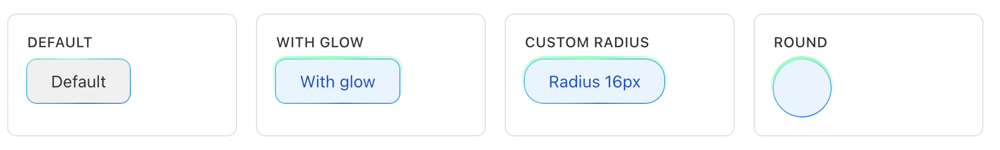

Системный хайлайтер — это CSS-обводка для временного выделения элемента интерфейса. Расширение добавляет анимированную градиентную рамку и при необходимости внешнее свечение.

Хайлайтер используют, когда нужно привлечь внимание к уже существующему блоку: новому элементу, результату действия, важному состоянию или области, с которой пользователь должен продолжить работу.

Расширение `ui.system.highlighter` работает через CSS-классы и CSS-переменные на DOM-элементе.

{width=1688px height=254px}

## Подключить расширение

Если вы подключаете стили из PHP, загрузите расширение `ui.system.highlighter`.

```php
\Bitrix\Main\UI\Extension::load('ui.system.highlighter');
```

Если хайлайтер нужен внутри собственного расширения, добавьте `import 'ui.system.highlighter';` .

После подключения добавьте класс `ui-highlighter` к элементу, который нужно выделить.

```html
<div class="task-card ui-highlighter">
    Новая задача
</div>
```

Для корректного отображения рамки задайте выделяемому элементу  `position: relative`.

```css
.task-card {
    position: relative;
    border-radius: 12px;
}
```

## Добавить свечение

Чтобы добавить внешнее свечение, передайте класс `--with-glow`.

```html
<div class="task-card ui-highlighter --with-glow">
    Новая задача
</div>
```

После завершения цикла анимации свечение плавно скрывается. Рамка остается на элементе.

Если у элемента или его родителя задан `overflow: hidden`, внешнее свечение может обрезаться. Учитывайте это для карточек, строк таблиц и элементов внутри прокручиваемых контейнеров.

## Выбрать оформление

Цветовая схема задается модификаторами.

-  Без модификатора — синяя рамка с зеленым переходом. Используется как базовое выделение.

-  `--success` — зеленая рамка с зеленым переходом. Подходит для успешного состояния или завершенного действия.

-  `--alert` — оранжевая рамка с желтым переходом. Подходит для предупреждения или состояния, которое требует внимания.

```html
<div class="task-card ui-highlighter --success --with-glow">
    Задача выполнена
</div>

<div class="task-card ui-highlighter --alert --with-glow">
    Проверьте срок задачи
</div>
```

## Настроить толщину рамки и свечения

Толщину рамки можно задать готовыми классами.

-  `--border-md` — рамка `1px`.

-  `--border-lg` — рамка `2px`.

Толщину свечения задают классы `--glow-md` и `--glow-lg`. Эти классы работают только вместе с `--with-glow`.

-  `--glow-md` — свечение `1px`.

-  `--glow-lg` — свечение `2px`.

```html
<div class="task-card ui-highlighter --with-glow --border-lg --glow-lg">
    Важное изменение
</div>
```

## Задать собственные значения

Хайлайтер поддерживает CSS-переменные. Передайте их в стиле элемента или в отдельном CSS-классе на том же элементе.

-  `--ui-highlighter-radius` — радиус скругления рамки. Значение по умолчанию — `29px`.

-  `--ui-highlighter-border-size` — толщина рамки. Значение по умолчанию — `1px`.

-  `--ui-highlighter-glow-size` — толщина свечения. Значение по умолчанию — `2px`.

-  `--ui-highlighter-animation-duration` — длительность одного оборота градиента. Значение по умолчанию — `5s`.

-  `--ui-highlighter-iteration-count` — количество оборотов градиента. Значение по умолчанию — `2`.

```html
<div class="pipeline-stage ui-highlighter --with-glow">
    Стадия изменена
</div>
```

```css
.pipeline-stage {
    position: relative;
    border-radius: 8px;
    --ui-highlighter-radius: 8px;
    --ui-highlighter-border-size: 2px;
    --ui-highlighter-glow-size: 4px;
    --ui-highlighter-animation-duration: 3s;
    --ui-highlighter-iteration-count: 3;
}
```

Задайте для `--ui-highlighter-radius` то же значение, что и для `border-radius` элемента. Так рамка повторит форму блока и не будет выглядеть отдельной от него.

## Ограничения компонента

Хайлайтер отвечает только за визуальное выделение. Он не добавляет и не удаляет классы, не меняет содержимое элемента и не обрабатывает клики.

Если выделение нужно показать после действия, добавьте классы в своем коде. Когда выделение больше не нужно, удалите эти классы.

В примере после изменения задачи компонент добавляет хайлайтер к карточке, а затем снимает выделение.

```javascript
import { Dom } from 'main.core';

const taskCard = document.querySelector('.task-card');

if (taskCard)
{
    // Показать выделение после действия.
    Dom.addClass(taskCard, ['ui-highlighter', '--with-glow', '--success']);

    setTimeout(() => {
        // Убрать выделение, когда оно больше не нужно.
        Dom.removeClass(taskCard, ['ui-highlighter', '--with-glow', '--success']);
    }, 12000);
}
```
