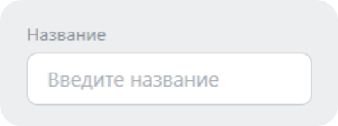
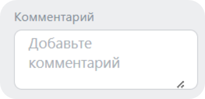
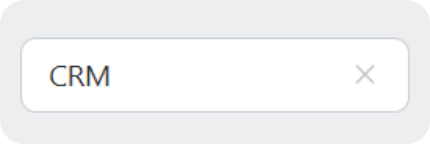
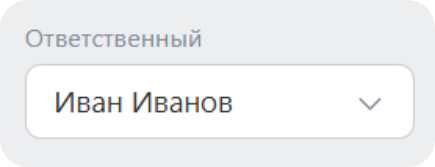
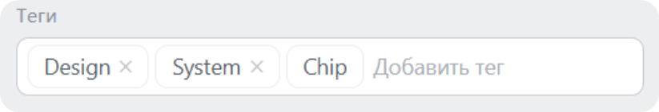
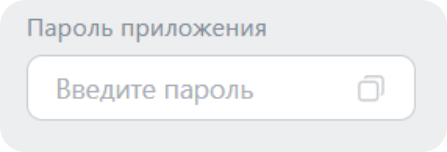

Системное поле ввода — это компонент для текстового значения. Он показывает подпись, поле `<input>` или `<textarea>` и состояние ошибки. Компонент поддерживает служебные элементы справа: поиск, очистку, раскрытие списка, копирование и переключатель видимости пароля.

Компонент используют, когда поле нужно оформить по правилам дизайн-системы и поддержать типовые состояния: активное, отключенное, с ошибкой, с выбранными значениями в виде чипов или в режиме кликабельного селектора.

В Bitrix Framework за системное поле ввода отвечает расширение `ui.system.input`. Оно экспортирует классы `Input` и `PasswordInput`, объекты `InputSize` и `InputDesign`, а также Vue-компоненты.

## Подключить расширение

Если вы подключаете компонент из PHP, загрузите расширение `ui.system.input`.

```php
\Bitrix\Main\UI\Extension::load('ui.system.input');
```

Если вы работаете в модульном JavaScript, импортируйте нужные классы и константы из `ui.system.input`.

```js
import { Input, InputSize, InputDesign } from 'ui.system.input';
```

## Создать поле

Чтобы создать поле, выполните основные действия:

1. Создайте экземпляр `Input`.

2. Передайте параметры поля: начальное значение `value`, подпись `label` и подсказку `placeholder`, если они нужны.

3. Получите DOM-узел через `render()`.

4. Добавьте полученный узел на страницу.

```js
import { Input, InputSize, InputDesign } from 'ui.system.input';

const input = new Input({
    label: 'Название',
    placeholder: 'Введите название',
    value: 'Новая сделка',
    onInput: () => {
        console.log(input.getValue());
    },
});

document.getElementById('input-container').append(input.render());
```

{width=477px height=179px}

## Передать параметры

Конструктор `Input` принимает объект с параметрами, которые задают содержимое, оформление и поведение поля.

### Значение и текст

-  `value` — начальное значение поля.

-  `label` — подпись над полем.

-  `placeholder` — подсказка внутри пустого поля.

-  `labelInline` — встроенная подпись на границе поля. Передайте `true`, если подпись должна визуально находиться внутри верхней линии поля.

-  `type` — тип HTML-поля. По умолчанию `text`. При значении `password` компонент добавляет кнопку показа и скрытия пароля.

-  `error` — текст ошибки. Если строка не пустая и поле не отключено, компонент показывает ошибку и переводит рамку в состояние ошибки.

-  `required` — маркер обязательного поля. При `true` рядом с подписью появляется звездочка. Компонент только показывает маркер и не выполняет валидацию.

Если параметры `value`, `label` и `placeholder` не переданы, компонент использует пустую строку.

### Размер и оформление

-  `size` — размер поля. По умолчанию используется `InputSize.Lg`.

-  `design` — вариант оформления. По умолчанию используется `InputDesign.Grey`.

-  `center` — выравнивание текста и подписи по центру.

-  `stretched` — растягивание поля в flex-контейнере через `flex: 1`.

-  `active` — активное состояние. При `true` поле получает активную рамку. Если поле не находится в режиме `clickable`, компонент также устанавливает фокус после вызова `render()`.

Доступные размеры:

-  `InputSize.Lg` — значение `l`, размер по умолчанию.

-  `InputSize.Md` — значение `m`.

-  `InputSize.Sm` — значение `s`.

Доступные варианты оформления:

-  `InputDesign.Primary` — значение `primary`.

-  `InputDesign.Grey` — значение `grey`, используется по умолчанию.

-  `InputDesign.LightGrey` — значение `light-grey`.

-  `InputDesign.Disabled` — значение `disabled`. Поле получает атрибут `disabled`, ошибка скрывается, чипы внутри поля переводятся в отключенное оформление.

-  `InputDesign.Naked` — значение `naked`. Поле отображается без рамки и фона.

### Иконки и действия

-  `icon` — иконка слева из `ui.icon-set.api.core`. Передавайте имя иконки, например значение из `Outline`.

-  `withSearch` — иконка поиска справа.

-  `withClear` — иконка очистки справа.

-  `dropdown` — стрелка раскрытия списка справа. Компонент только показывает иконку, открытие меню нужно реализовать в своем обработчике.

-  `copyable` — кнопка копирования справа. При клике компонент копирует текущее значение в буфер обмена и показывает подсказку `Скопировано`.

-  `clickable` — режим кликабельного контейнера. В этом режиме поле не принимает фокус: компонент снимает фокус с `<input>` и вызывает обработчик `onClick`. Используйте режим для селекторов, где поле выглядит как `<input>`, но открывает внешний список.

### Многострочный режим

Если `rowsQuantity` больше `1`, компонент создает `<textarea>` вместо `<input>`.

-  `rowsQuantity` — количество строк `<textarea>`. По умолчанию `1`.

-  `resize` — значение CSS-свойства `resize` для `<textarea>`. Доступны `none`, `both`, `horizontal`, `vertical`. По умолчанию `both`.

```js
import { Input } from 'ui.system.input';

const comment = new Input({
    label: 'Комментарий',
    placeholder: 'Добавьте комментарий',
    rowsQuantity: 5,
    resize: 'vertical',
});

document.getElementById('comment-container').append(comment.render());
```

{width=411px height=199px}

## Добавить очистку

Передайте `withClear: true`, чтобы показать иконку очистки. В JS-классе компонент сам очищает поле и затем вызывает обработчик `onClear`.

```js
import { Input } from 'ui.system.input';

const input = new Input({
    value: 'CRM',
    withClear: true,
    onClear: () => {
        console.log('Значение очищено');
    },
});
```

{width=430px height=144px}

Обработчик `onInput` при очистке через иконку не вызывается: компонент вызывает `setValue('')`, а не событие пользовательского ввода.

## Использовать поле как селектор

Режим `clickable` подходит для поля, которое открывает меню, диалог или другой внешний выбор значения. При попытке сфокусировать поле компонент снимает фокус и вызывает `onClick`.

```js
import { Input } from 'ui.system.input';

const selector = new Input({
    label: 'Ответственный',
    value: 'Иван Иванов',
    clickable: true,
    dropdown: true,
    onClick: () => {
        // Откройте список пользователей.
    },
});

document.getElementById('selector-container').append(selector.render());
```

{width=435px height=167px}

Стрелка `dropdown` не открывает список сама. Она только показывает, что у поля есть связанный сценарий выбора.

## Добавить чипы

Передайте массив `chips`, чтобы показать выбранные значения внутри поля. Каждый элемент массива передается в компонент `Chip` из расширения `ui.system.chip`.

Параметры чипов описаны в статье [Системный чип](./system-chip.md).

```js
import { Input, InputSize } from 'ui.system.input';

const input = new Input({
    size: InputSize.Md,
    label: 'Теги',
    placeholder: 'Добавить тег',
    chips: [
        { text: 'Design', withClear: true },
        { text: 'System', withClear: true },
        { text: 'Chip' },
    ],
    onChipClick: (chipOptions) => {
        console.log('Клик по чипу', chipOptions.text);
    },
    onChipClear: (chipOptions) => {
        console.log('Очистить чип', chipOptions.text);
    },
});

document.getElementById('tags-container').append(input.render());
```

{width=823px height=141px}

Размер чипов подбирается автоматически по размеру поля.

В отключенном поле чипы также отображаются как недоступные.

## Использовать поле пароля

Для поля пароля можно передать `type: 'password'` в `Input` или использовать класс `PasswordInput`. В обоих случаях компонент добавляет кнопку показа и скрытия значения.

```js
import { PasswordInput, InputSize } from 'ui.system.input';

const password = new PasswordInput({
    label: 'Пароль приложения',
    placeholder: 'Введите пароль',
    size: InputSize.Md,
    copyable: true,
});

document.getElementById('password-container').append(password.render());
```

{width=447px height=152px}

Кнопка копирования появляется только при `copyable: true`. Если значение пустое, компонент вызывает обработчик копирования, но не пытается записать пустую строку в буфер обмена.

Компонент  копирует значение и показывает подсказку «Скопировано».

## Управлять компонентом

Используйте методы `Input`, чтобы читать и менять состояние после вызова `render()`.

### Основные методы

-  `render()` возвращает корневой DOM-узел поля. Повторный вызов возвращает тот же DOM-узел.

-  `destroy()` удаляет поле со страницы.

-  `focus()` устанавливает фокус в поле, если компонент не находится в режиме `clickable`.

-  `blur()` снимает фокус.

### Изменить текст и оформление

-  `setValue(value)` и `getValue()` меняют и возвращают значение.

-  `setLabel(value)` и `getLabel()` меняют и возвращают подпись.

-  `setPlaceholder(value)` и `getPlaceholder()` меняют и возвращают подсказку `placeholder`.

-  `setType(value)` и `getType()` меняют и возвращают тип поля.

-  `setError(value)` и `getError()` меняют и возвращают текст ошибки.

-  `setSize(value)` и `getSize()` меняют и возвращают размер.

-  `setDesign(value)` и `getDesign()` меняют и возвращают оформление.

-  `setIcon(value)` и `getIcon()` меняют и возвращают левую иконку.

-  `setLabelInline(value)` и `isLabelInline()` включают или отключают встроенную подпись.

-  `setRequired(value)` и `isRequired()` показывают или скрывают маркер обязательного поля.

### Изменить служебные элементы

-  `setWithSearch(value)` и `getWithSearch()` показывают или скрывают иконку поиска.

-  `setWithClear(value)` и `getWithClear()` показывают или скрывают иконку очистки.

-  `setDropdown(value)` и `isDropdown()` показывают или скрывают стрелку раскрытия списка.

-  `setCopyable(value)` и `isCopyable()` показывают или скрывают кнопку копирования.

### Работать с чипами

-  `addChip(chipOptions)` добавляет чип и перерисовывает список чипов.

-  `removeChip(chipOptions)` удаляет чип по тому же объекту настроек, который был добавлен в список.

-  `removeChips()` удаляет все чипы.

## Обработать события

Передайте обработчики в параметры конструктора.

-  `onClick` — клик по контейнеру поля.

-  `onFocus` — получение фокуса полем.

-  `onBlur` — потеря фокуса полем.

-  `onInput` — ввод значения пользователем.

-  `onClear` — клик по иконке очистки.

-  `onCopy` — клик по кнопке копирования.

-  `onChipClick` — клик по чипу внутри поля. Обработчик получает настройки чипа и событие клика.

-  `onChipClear` — клик по очистке чипа. Обработчик получает настройки чипа и событие клика.

## Использовать Vue-компоненты

Vue-компоненты доступны через пространство `Vue` расширения `ui.system.input` и через отдельное расширение `ui.system.input.vue`.

Vue-версия системного поля ввода `BInput` генерирует событие `update:modelValue`, когда пользователь меняет значение поля. Событие нужно для работы директивы `v-model`, которая связывает значение поля с переменной родительского компонента. Родительский компонент получает новое значение и обновляет связанную переменную.

```js
import { BInput, InputSize, InputDesign } from 'ui.system.input.vue';

export const ExampleComponent = {
    components: {
        BInput,
    },
    setup() {
        return {
            InputSize,
            InputDesign,
        };
    },
    data() {
        return {
            value: '',
        };
    },
    template: `
        <BInput
            v-model="value"
            label="Название"
            placeholder="Введите название"
            :size="InputSize.Lg"
            :design="InputDesign.Grey"
            withClear
            @clear="value = ''"
        />
    `,
};
```

Для остальных действий `BInput` генерирует события `click`, `focus`, `blur`, `input`, `clear`, `chipClick` и `chipClear`.

В JS-компоненте клик по кнопке копирования можно обработать через `onCopy`. В `BInput` события `copy` нет: если включить `copyable`, Vue-компонент сам скопирует значение при клике по кнопке.

Очистка в `BInput` работает иначе, чем в JS-классе. Клик по иконке генерирует только событие `clear`, поэтому значение `modelValue` нужно очистить в обработчике.

Чтобы поставить курсор в поле из кода, задайте `ref` — ссылку на компонент в шаблоне. У `BInput` через `ref` доступен только метод `focus()`.

Значение, оформление, подпись, ошибку и служебные элементы передавайте через свойства компонента и `v-model`.

`PasswordField` — Vue-компонент для пароля. Он показывает кнопку показа и скрытия значения и принимает `v-model`.

```js
import { PasswordField } from 'ui.system.input.vue';

export const ExampleComponent = {
    components: {
        PasswordField,
    },
    data()
    {
        return {
            password: '',
        };
    },
    template: `
        <PasswordField
            v-model="password"
            label="Пароль приложения"
            :copyable="true"
        />
    `,
};
```



Подробнее о работе с Vue в Bitrix Framework читайте в статье [Vue.js](../advanced/vue.md).


