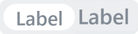

Системная метка — это компактный компонент для короткого статуса, признака или категории. Метка выводит текст в скругленном контейнере и поддерживает три размера, цветовые стили, рамку и режим иконки.

Компонент используют в интерфейсах, где нужно показать состояние объекта рядом с названием, строкой списка, карточкой или элементом формы. Если метка должна запускать действие по клику, обработчик нужно добавить на внешний контейнер или выбрать другой интерактивный компонент.

В Bitrix Framework за системную метку отвечает расширение `ui.system.label`. Оно экспортирует класс `Label`, объекты `LabelSize`, `LabelStyle`, `LabelIcon` и Vue-компонент.

## Подключить расширение

Если вы подключаете компонент из PHP, загрузите расширение `ui.system.label`.

```php
\Bitrix\Main\UI\Extension::load('ui.system.label');
```

Если вы работаете в модульном JavaScript, импортируйте нужные классы и константы из `ui.system.label`.

```js
import { Label, LabelSize, LabelStyle, LabelIcon } from 'ui.system.label';
```

## Создать метку

Чтобы создать метку, выполните основные действия:

1. Создайте экземпляр `Label`.

2. Передайте текст `value`, размер `size` и стиль `style`.

3. Получите DOM-узел через `render()`.

4. Добавьте полученный узел на страницу.

```js
import { Label, LabelSize, LabelStyle } from 'ui.system.label';

const label = new Label({
    value: 'Новый',
    size: LabelSize.MD,
    style: LabelStyle.TINTED_SUCCESS,
});

document.getElementById('label-container').append(label.render());
```

{width=121px height=52px}

## Передать параметры

Конструктор `Label` принимает объект с параметрами, которые задают текст, размер и оформление метки.

-  `value` — строка с текстом метки. Если параметр не передан, используется пустая строка.

-  `size` — размер метки, значение из `LabelSize`. По умолчанию используется `LabelSize.MD`.

-  `style` — цветовой стиль метки, значение из `LabelStyle`. По умолчанию используется `LabelStyle.FILLED`.

-  `border` — логическое значение для рамки внутри метки.

-  `icon` — иконка, значение из `LabelIcon`.

## Выбрать размер

Размер определяет высоту метки, горизонтальные отступы и размер текста.

-  `LabelSize.MD` — значение `md`.

-  `LabelSize.SM` — значение `sm`.

-  `LabelSize.XS` — значение `xs`.

```js
import { Label, LabelSize } from 'ui.system.label';

const label = new Label({
    value: 'CRM',
    size: LabelSize.SM,
});
```

## Выбрать стиль

Стиль задает фон и цвет содержимого. Используйте константы `LabelStyle`, а не строковые значения: компонент поддерживает только значения из этого объекта. Ниже приведены основные стили.

### Заполненные стили

Заполненные стили используют плотный цветной фон.

{width=700px height=58px}

-  `LabelStyle.FILLED_EXTRA` — акцентная метка.

-  `LabelStyle.FILLED` — основная метка. Используется по умолчанию.

-  `LabelStyle.FILLED_ALERT` — метка для ошибки или критического статуса.

-  `LabelStyle.FILLED_WARNING` — метка для предупреждения.

-  `LabelStyle.FILLED_SUCCESS` — метка для успешного статуса.

-  `LabelStyle.FILLED_NO_ACCENT` — метка без акцента.

### Инвертированные стили

Инвертированные стили меняют местами основной цвет фона и текста.

{width=582px height=50px}

-  `LabelStyle.FILLED_INVERTED` — основная метка.

-  `LabelStyle.FILLED_ALERT_INVERTED` — метка для ошибки или критического статуса.

-  `LabelStyle.FILLED_WARNING_INVERTED` — метка для предупреждения.

-  `LabelStyle.FILLED_SUCCESS_INVERTED` — метка для успешного статуса.

-  `LabelStyle.FILLED_NO_ACCENT_INVERTED` — метка без акцента.

### Тонированные стили

Тонированные стили используют мягкий фон.

{width=452px height=50px}

-  `LabelStyle.TINTED` — основная метка.

-  `LabelStyle.TINTED_SUCCESS` — метка для успешного статуса.

-  `LabelStyle.TINTED_WARNING` — метка для предупреждения.

-  `LabelStyle.TINTED_NO_ACCENT` — метка без акцента.

### Дополнительные стили

{width=202px height=50px}

-  `LabelStyle.COLLAB` — стиль для коллабораций.

-  `LabelStyle.OUTLINE_NO_ACCENT` — менее акцентная метка в контурном оформлении.

## Добавить рамку

Передайте `border: true`, чтобы добавить внутреннюю рамку.

```js
import { Label, LabelStyle } from 'ui.system.label';

const label = new Label({
    value: 'Черновик',
    style: LabelStyle.TINTED_NO_ACCENT,
    border: true,
});
```

{width=266px height=72px}

## Показать иконку

Передайте `icon`, чтобы вывести метку как квадратную иконку. В этом режиме метка показывает только иконку.

```js
import { Label, LabelIcon, LabelStyle } from 'ui.system.label';

const label = new Label({
    style: LabelStyle.FILLED_SUCCESS,
    icon: LabelIcon.CHECK,
});
```

{width=380px height=59px}

Доступные иконки:

-  `LabelIcon.NONE` — без иконки, пустое значение.

-  `LabelIcon.CHECK` — галочка, значение `check`.

-  `LabelIcon.ATTENTION` — предупреждение, значение `attention`.

-  `LabelIcon.CROSS` — крестик, значение `cross`.

-  `LabelIcon.QUESTION` — вопрос, значение `question`.

-  `LabelIcon.CHECK_STROKE` — контурная галочка, значение `checkStroke`.

-  `LabelIcon.CROSS_STROKE` — контурный крестик, значение `crossStroke`.

-  `LabelIcon.PROCESS_STROKE` — контурный индикатор процесса, значение `processStroke`.

## Управлять компонентом

Используйте методы `Label`, чтобы изменить уже созданную метку после вызова `render()`.

-  `render()` создает и возвращает корневой DOM-узел метки.

-  `destroy()` удаляет текущий DOM-узел метки со страницы.

-  `setValue(value)` и `getValue()` меняют и возвращают текст метки.

-  `setSize(size)` и `getSize()` меняют и возвращают размер.

-  `setStyle(style)` и `getStyle()` меняют и возвращают стиль.

-  `setBordered(flag)` показывает или скрывает рамку. По умолчанию `flag` равен `true`.

-  `setIcon(icon)` меняет иконку. Чтобы вернуться к текстовому режиму, передайте `LabelIcon.NONE` или пустое значение.

```js
import { Label, LabelStyle, LabelIcon } from 'ui.system.label';

const label = new Label({
    value: 'В обработке',
});

document.getElementById('label-container').append(label.render());

label.setStyle(LabelStyle.TINTED_WARNING);
label.setIcon(LabelIcon.PROCESS_STROKE);
label.setValue('Проверяется');
```

Методы `setSize()` и `setStyle()` применяют только значения из `LabelSize` и `LabelStyle`. Если передать другое значение, текущее оформление не изменится.

Вызывайте `setIcon()` после `render()`: метод меняет отображение уже созданной метки.

## Использовать Vue-компонент

Vue-компонент доступен через пространство `Vue` расширения `ui.system.label`. Отдельное расширение `ui.system.label.vue` подключает тот же Vue-компонент и зависит от `ui.system.label`.

```javascript
import { LabelSize, LabelStyle, LabelIcon } from 'ui.system.label';
import { Label as UiLabel } from 'ui.system.label.vue';

export const ExampleComponent = {
    components: {
        UiLabel,
    },
    setup() {
        return {
            LabelSize,
            LabelStyle,
            LabelIcon,
        };
    },
    template: `
        <UiLabel
            value="Готово"
            :size="LabelSize.MD"
            :style="LabelStyle.TINTED_SUCCESS"
            :icon="LabelIcon.CHECK"
            bordered
        />
    `,
};
```

Свойства Vue-компонента соответствуют параметрам `Label`.

Для рамки используйте `bordered`.

При изменении свойств компонент обновляет уже созданную метку.



Подробнее о работе с Vue в Bitrix Framework читайте в статье [Vue.js](../advanced/vue.md).


