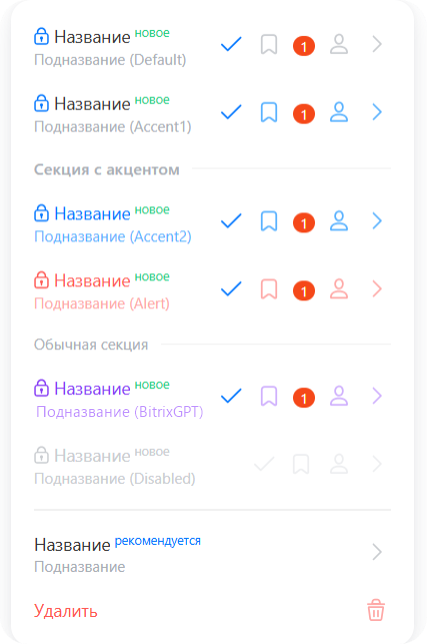

Системное меню — это всплывающий список пунктов, который открывается рядом с кнопкой или другим элементом страницы. В меню можно добавить секции, заголовок с иконкой и вложенные меню. Пункты поддерживают счетчики, дополнительные иконки и разные варианты оформления.

Компонент используют для контекстных действий над объектом или выбора одного варианта из короткого списка. Меню закрывается по клику вне области, по `Esc` и после клика по пункту, если это не переопределено в параметрах.

В Bitrix Framework за системное меню отвечает расширение `ui.system.menu`. В нем доступны класс `Menu` и константы для оформления пунктов, секций и заголовка. Для Vue-компонента используется отдельное расширение `ui.system.menu.vue`.

## Подключить расширение

Если вы подключаете класс `Menu` из PHP, загрузите расширение `ui.system.menu`.

```php
\Bitrix\Main\UI\Extension::load('ui.system.menu');
```

Если вы работаете в модульном JavaScript, импортируйте класс и константы из `ui.system.menu`.

```js
import { Menu, MenuItemDesign } from 'ui.system.menu';
```

Для иконок в пунктах меню используйте значения из `ui.icon-set.api.core`.

```js
import { Outline } from 'ui.icon-set.api.core';
```

## Создать меню

Чтобы создать меню, выполните основные действия:

1. Создайте экземпляр `Menu`.

2. Передайте массив `items` с пунктами меню.

3. Вызовите `show(bindElement)`, чтобы открыть меню рядом с элементом страницы.

```js
import { Menu, MenuItemDesign } from 'ui.system.menu';

const button = document.getElementById('actions-button');

const menu = new Menu({
    items: [
        {
            id: 'edit',
            title: 'Редактировать',
            onClick: () => {
                console.log('Редактировать объект');
            },
        },
        {
            id: 'delete',
            title: 'Удалить',
            design: MenuItemDesign.Alert,
            onClick: () => {
                console.log('Удалить объект');
            },
        },
    ],
});

menu.show(button);
```

## Передать параметры меню

Конструктор `Menu` принимает объект с параметрами меню. Если вызвать `show()` без аргумента, компонент откроет меню рядом с `bindElement`.

`bindElement` — это DOM-элемент, рядом с которым нужно открыть меню. Обычно его получают из страницы через `document.getElementById()` или из Vue-шаблона через `ref`.

-  `items` — массив пунктов меню.

-  `sections` — массив секций. Секция группирует пункты по значению `sectionCode`.

-  `richHeader` — крупный заголовок в верхней части меню. Объект может содержать `design`, `title`, `subtitle`, `icon` и `onClick`.

-  `closeOnItemClick` — закрывать меню после клика по пункту без вложенного меню. По умолчанию `true`.

## Настроить пункт меню

Пункт меню задается объектом внутри массива `items`.

-  `id` — идентификатор пункта. Используется, чтобы отличать пункты при обновлении списка.

-  `title` — основной текст пункта.

-  `subtitle` — дополнительный текст под названием.

-  `onClick` — обработчик клика по пункту.

-  `design` — оформление пункта, значение из `MenuItemDesign`.

-  `sectionCode` — код секции, в которой нужно вывести пункт.

-  `icon` — иконка справа, например значение из `Outline`.

-  `svg` — SVG-элемент справа. Используется вместо `icon`, если `icon` не передан.

-  `badgeText` — короткий текстовый бейдж рядом с названием. Объект содержит `title` и необязательный `color`.

-  `isSelected` — состояние выбора. Значение `true` показывает галочку, `false` оставляет место под галочку пустым.

-  `isLocked` — значок замка перед названием.

-  `counter` — параметры счетчика из `ui.cnt`. Объект передается в компонент `Counter`. Для простого счетчика передайте `value`.

-  `extraIcon` — дополнительная иконка справа. Объект содержит `icon`, `onClick` и `isSelected`.

-  `subMenu` — параметры вложенного меню. Объект принимает те же параметры, что и `Menu`.

-  `closeOnSubItemClick` — закрывать родительское меню после клика по пункту вложенного меню. По умолчанию `true`.

-  `uiButtonOptions` — параметры кнопки из `ui.buttons`. Объект передается в компонент `Button`. Для простого пункта-кнопки передайте `text` и `onclick`.

```js
import { Menu, MenuItemDesign, MenuSectionDesign } from 'ui.system.menu';
import { Outline } from 'ui.icon-set.api.core';

const targetElement = document.getElementById('menu-button');

const createItem = ({ id, subtitle, design, extraIconSelected = true }) => ({
    id,
    title: 'Название',
    subtitle,
    design,
    badgeText: {
        title: 'новое',
    },
    isLocked: true,
    isSelected: true,
    extraIcon: {
        icon: Outline.CHEVRON_RIGHT_L,
        isSelected: extraIconSelected,
    },
    counter: {
        value: 1,
    },
    icon: Outline.PERSON,
});

const menu = new Menu({
    sections: [
        {
            code: 'accent',
            title: 'Секция с акцентом',
            design: MenuSectionDesign.Accent,
        },
        {
            code: 'default',
            title: 'Обычная секция',
        },
    ],
    items: [
        createItem({
            id: 'default',
            subtitle: 'Подназвание (Default)',
            extraIconSelected: false,
        }),
        createItem({
            id: 'accent-1',
            subtitle: 'Подназвание (Accent1)',
            design: MenuItemDesign.Accent1,
        }),
        createItem({
            id: 'accent-2',
            subtitle: 'Подназвание (Accent2)',
            design: MenuItemDesign.Accent2,
        }),
        createItem({
            id: 'alert',
            subtitle: 'Подназвание (Alert)',
            design: MenuItemDesign.Alert,
        }),
        createItem({
            id: 'bitrix-gpt',
            subtitle: 'Подназвание (BitrixGPT)',
            design: MenuItemDesign.Copilot,
        }),
        createItem({
            id: 'disabled',
            subtitle: 'Подназвание (Disabled)',
            design: MenuItemDesign.Disabled,
            extraIconSelected: false,
        }),
        {
            id: 'recommended',
            title: 'Название',
            subtitle: 'Подназвание',
            badgeText: {
                title: 'рекомендуется',
                color: '#0B66FF',
            },
        },
        {
            id: 'delete',
            title: 'Удалить',
            icon: Outline.TRASHCAN,
            design: MenuItemDesign.Alert,
        },
    ],
});

menu.show(targetElement);
```

{width=427px height=644px}

## Выбрать оформление пункта

Оформление меняет цвет текста и служебных иконок пункта. Используйте константы `MenuItemDesign`, а не строковые значения.

-  `MenuItemDesign.Default` — обычный пункт без цветового акцента: темный текст и нейтральные служебные иконки. Используется для нейтральных действий.

-  `MenuItemDesign.Accent1` — окрашивает служебные иконки в основной акцентный цвет, но оставляет текст нейтральным. Подходит для действия, которое нужно выделить без усиления текста.

-  `MenuItemDesign.Accent2` — окрашивает текст и служебные иконки в основной акцентный цвет. Подходит для основного или рекомендуемого действия в меню.

-  `MenuItemDesign.Alert` — окрашивает текст и служебные иконки в красный цвет. Используется для опасного или критичного действия, например удаления.

-  `MenuItemDesign.Copilot` — окрашивает текст и служебные иконки в цвета BitrixGPT. Используйте для действий, связанных с BitrixGPT.

-  `MenuItemDesign.Disabled` — окрашивает текст и служебные иконки в приглушенный серый цвет, чтобы показать недоступный пункт.

`MenuItemDesign.Disabled` меняет оформление пункта и не открывает вложенное меню при наведении. Этот режим не отменяет обработчик `onClick`. Если пункт не должен выполнять действие, не передавайте ему обработчик или обработайте блокировку в своем коде.

## Добавить секции

Секции помогают разделить пункты по группам. У секции должен быть `code`, а у пункта — такой же `sectionCode`.

```js
import { Menu, MenuSectionDesign } from 'ui.system.menu';

const menu = new Menu({
    sections: [
        {
            code: 'main',
            title: 'Основные действия',
            design: MenuSectionDesign.Accent,
        },
        {
            code: 'service',
            title: 'Служебные действия',
        },
    ],
    items: [
        {
            id: 'open',
            sectionCode: 'main',
            title: 'Открыть',
            onClick: () => {},
        },
        {
            id: 'copy-link',
            sectionCode: 'service',
            title: 'Скопировать ссылку',
            onClick: () => {},
        },
    ],
});
```

Пункты без `sectionCode` выводятся до секций. Если секция указана, но в ней нет пунктов, компонент ее не выводит.

Доступные варианты оформления секции:

-  `MenuSectionDesign.Default` — обычный заголовок секции: небольшой серый текст и разделитель.

-  `MenuSectionDesign.Accent` — акцентный заголовок секции: текст крупнее и плотнее, разделитель остается нейтральным.

## Добавить заголовок меню

Параметр `richHeader` добавляет верхний блок с крупной иконкой, заголовком, подзаголовком и необязательной иконкой справа.

```js
import { Menu, MenuRichHeaderDesign } from 'ui.system.menu';
import { Outline } from 'ui.icon-set.api.core';

const menu = new Menu({
    richHeader: {
        design: MenuRichHeaderDesign.Copilot,
        title: 'BitrixGPT',
        subtitle: 'Помощник',
        icon: Outline.CHEVRON_RIGHT_L,
        onClick: () => {
            console.log('Открыть раздел BitrixGPT');
        },
    },
    items: [
        {
            id: 'create-text',
            title: 'Создать текст',
            onClick: () => {},
        },
    ],
});
```

Доступные варианты оформления:

-  `MenuRichHeaderDesign.Default` — обычный заголовок с мягким синим фоном, синей иконкой и акцентным цветом текста.

-  `MenuRichHeaderDesign.Copilot` — заголовок в цветах BitrixGPT: фиолетовый фон, фиолетовая иконка и акцентный цвет текста. Используйте для сценариев BitrixGPT.

Если `subtitle`, `icon` или `onClick` не переданы, соответствующая часть заголовка не используется.

## Добавить вложенное меню

Чтобы открыть вложенное меню при наведении, передайте в пункт параметр `subMenu`.

```js
import { Menu } from 'ui.system.menu';

const menu = new Menu({
    items: [
        {
            id: 'move',
            title: 'Переместить',
            subMenu: {
                items: [
                    {
                        id: 'move-to-active',
                        title: 'В активные',
                        onClick: () => {},
                    },
                    {
                        id: 'move-to-archive',
                        title: 'В архив',
                        onClick: () => {},
                    },
                ],
            },
        },
    ],
});
```

Если у пункта есть `subMenu`, клик по нему не закрывает родительское меню — параметр `closeOnItemClick` его не затрагивает. Закрытие при клике по пункту вложенного меню управляется отдельным параметром `closeOnSubItemClick` у родительского пункта.

## Добавить дополнительную иконку

Клик по `extraIcon` вызывает только обработчик этой иконки и не вызывает `onClick` основного пункта.

```js
import { Menu } from 'ui.system.menu';
import { Outline } from 'ui.icon-set.api.core';

const menu = new Menu({
    items: [
        {
            id: 'filter',
            title: 'Фильтр',
            extraIcon: {
                icon: Outline.CHEVRON_RIGHT_L,
                isSelected: true,
                onClick: () => {
                    console.log('Настроить фильтр');
                },
            },
            onClick: () => {
                console.log('Выбрать фильтр');
            },
        },
    ],
});
```

По умолчанию дополнительная иконка появляется при наведении на пункт. Чтобы показывать ее постоянно, передайте `extraIcon.isSelected: true`.

## Использовать кнопку как пункт меню

Если нужно встроить кнопку из `ui.buttons`, передайте параметры кнопки в `uiButtonOptions`.

В этом режиме компонент не использует стандартные параметры пункта `title`, `subtitle`, `icon`, `counter` и `onClick`.

Параметры кнопки задают текст и обработчик клика.

```js
import { Menu } from 'ui.system.menu';

const menu = new Menu({
    items: [
        {
            id: 'create',
            uiButtonOptions: {
                text: 'Создать',
                onclick: () => {
                    console.log('Создать объект');
                },
            },
        },
    ],
});
```

## Управлять меню

Используйте методы `Menu`, чтобы обновлять пункты и закрывать уже созданное меню.

-  `show(bindElement)` — показывает меню рядом с переданным элементом или рядом с `bindElement` из параметров.

-  `close()` — закрывает текущее меню.

-  `destroy()` — удаляет меню и вложенные меню. Чтобы снова показать меню после `destroy()`, создайте новый экземпляр `Menu`.

-  `updateItems(itemsOptions)` — заменяет список пунктов в уже созданном меню.

```js
import { Menu } from 'ui.system.menu';

const menu = new Menu({
    closeOnItemClick: false,
    items: [
        {
            id: 'draft',
            title: 'Черновик',
            isSelected: true,
            onClick: () => {},
        },
    ],
});

menu.show(document.getElementById('status-button'));

menu.updateItems([
    {
        id: 'published',
        title: 'Опубликовано',
        isSelected: true,
        onClick: () => {},
    },
]);
```

## Использовать Vue-компонент

В расширении `ui.system.menu.vue` доступен Vue-компонент `BMenu`. Он принимает `options` с теми же параметрами, что и класс `Menu`.

Когда меню закрывается, `BMenu` вызывает событие `close`.

Если Vue-компонент используется на странице, загрузите расширение `ui.system.menu.vue` из PHP.

```php
\Bitrix\Main\UI\Extension::load('ui.system.menu.vue');
```

В модульном JavaScript импортируйте компонент `BMenu`.

```js
import { BMenu } from 'ui.system.menu.vue';

export const ActionsMenu = {
    components: { BMenu },
    data()
    {
        return {
            isMenuShown: false,
        };
    },
    computed: {
        menuOptions()
        {
            return {
                bindElement: this.$refs.actionsButton,
                items: [
                    {
                        id: 'edit',
                        title: 'Редактировать',
                        onClick: () => {},
                    },
                ],
            };
        },
    },
    template: `
        <button ref="actionsButton" @click="isMenuShown = true">
            Действия
        </button>
        <BMenu
            v-if="isMenuShown"
            :options="menuOptions"
            @close="isMenuShown = false"
        />
    `,
};
```



Подробнее о работе с Vue в Bitrix Framework читайте в статье [Vue.js](../advanced/vue.md).


