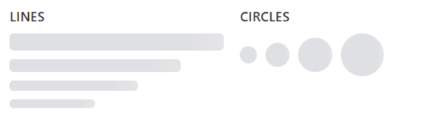

Скелетон загрузки — это визуальная заглушка для области интерфейса, в которой данные еще не готовы к показу. Компонент выводит анимированную линию или круг и помогает сохранить структуру страницы во время загрузки списка, карточки или аватара.

В Bitrix Framework за скелетон отвечает расширение `ui.system.skeleton`. В нем доступны функции `Line`, `Circle` и `renderSkeleton`. Для Vue-компонентов используется отдельное расширение `ui.system.skeleton.vue`.

{width=389px height=422,5px}

## Подключить расширение

Если вы подключаете компонент из PHP, загрузите расширение `ui.system.skeleton`.

```php
\Bitrix\Main\UI\Extension::load('ui.system.skeleton');
```

Если вы работаете в модульном JavaScript, импортируйте функции из `ui.system.skeleton`.

```js
import { Line, Circle, renderSkeleton } from 'ui.system.skeleton';
```

## Создать скелетон

Функция `Line(width, height, radius)` создает линию скелетона. Функция `Circle(size)` создает круглый скелетон.

{width=618px height=175px}

```js
import { Line, Circle } from 'ui.system.skeleton';

const container = document.getElementById('profile-placeholder');

container.append(
    Circle(40),
    Line(180, 14, 8),
    Line(120, 12, 8),
);
```

Элементы, созданные через `Line()` и `Circle()`, можно сразу добавить в контейнер или заменить ими загружаемый блок.

## Настроить линию

Передайте в `Line()` размеры скелетона:

-  `width` — ширина скелетона в пикселях. Если параметр не передан или равен `null`, линия занимает `100%` ширины контейнера.

-  `height` — высота скелетона в пикселях. По умолчанию используется `12px`.

-  `radius` — радиус скругления в пикселях. По умолчанию используется `8px`.

```js
import { Line } from 'ui.system.skeleton';

const titleSkeleton = Line(240, 18, 6);
```

Чтобы оставить значение по умолчанию для одного из параметров, передайте `null`. Например, `Line(null, 16, 8)` создаст линию со стандартной шириной.

## Настроить круг

Передайте в `Circle(size)` размер круга в пикселях.

```js
import { Circle } from 'ui.system.skeleton';

const avatarSkeleton = Circle(48);
```

По умолчанию используется размер `18px`.

## Убрать скелетон после загрузки

Скелетон не хранит состояние загрузки и не заменяет данные автоматически. После получения данных удалите созданные узлы или замените контейнер содержимым.

```js
import { Line } from 'ui.system.skeleton';

const container = document.getElementById('task-title');
const skeleton = Line(200, 16, 8);

container.append(skeleton);

fetch('/local/ajax/task-title.php')
    .then((response) => response.text())
    .then((title) => {
        skeleton.remove();
        container.textContent = title;
    });
```

## Отрисовать скелетон из шаблона

Функция `renderSkeleton(path, root)` асинхронно загружает HTML-шаблон по адресу `path` и вставляет его в контейнер `root`. В `path` передайте путь к HTML-шаблону, доступный браузеру. `Promise` можно не обрабатывать, если дальнейший код не зависит от завершения отрисовки.

```javascript
import { renderSkeleton } from 'ui.system.skeleton';

const root = document.getElementById('deal-card-skeleton');

renderSkeleton('/local/js/deal-card-skeleton.html?v=1', root);
```

В шаблоне можно использовать записи `Line()` и `Circle()`. При загрузке шаблона компонент заменит их на HTML соответствующих скелетонов.

```html
<div class="row">
    Circle(40)
    <div>
        Line(180, 14, 8)
        Line(120, 12, 8)
    </div>
</div>
<style>
    .row {
        display: flex;
        align-items: center;
        gap: 12px;
        padding: 16px;
    }
</style>
```

Для каждого шаблона используйте отдельный контейнер. Не вызывайте `renderSkeleton()` повторно для элемента, в который скелетон уже отрисован.

HTML-шаблон кешируется браузером и в памяти приложения до перезагрузки страницы. После правок шаблона добавляйте к пути версию, чтобы сбросить кеш: `renderSkeleton('/local/js/deal-card-skeleton.html?v=2', root);`.

Стили скелетона прописывайте в `<style>` внутри HTML-шаблона. Компонент отрисовывает содержимое в изолированной области, поэтому CSS основной страницы туда не доходит.

## Подставить сохраненные данные

В HTML-шаблоне можно указать ключ в фигурных скобках, например `{dealTitle}`. При отрисовке `renderSkeleton()` заменит такую запись значением из `localStorage` модуля `main.core`. Сохраните значение через `localStorage.set()` до вызова `renderSkeleton()`:


```javascript
import { localStorage } from 'main.core';

localStorage.set('dealTitle', 'Сделка №42');
```

```html
<div class="deal-card-skeleton">
    <div class="deal-card-skeleton__title">{dealTitle}</div>
    Line(180, 12, 8)
</div>
```

Такой способ подходит для короткого текста, который нужно показать рядом со скелетоном до загрузки актуальных данных.

## Использовать во Vue

В расширении `ui.system.skeleton.vue` доступны компоненты `BLine` и `BCircle`. Компонент `BCircle` также доступен под именем `Circle`.

```js
import { BLine, BCircle } from 'ui.system.skeleton.vue';

export const UserCardPlaceholder = {
    components: {
        BLine,
        BCircle,
    },
    template: `
        <div class="user-card-placeholder">
            <BCircle :size="40"/>
            <div class="user-card-placeholder__content">
                <BLine :width="180" :height="14" :radius="8"/>
                <BLine :width="120" :height="12" :radius="8"/>
            </div>
        </div>
    `,
};
```

`BLine` принимает свойства `width`, `height` и `radius`. Переданные значения применяются в пикселях. Если `width` не передан, линия занимает `100%` ширины контейнера.

`BCircle` принимает свойство `size` в пикселях. По умолчанию используется `18px`.



Подробнее о работе с Vue в Bitrix Framework читайте в статье [Vue.js](../advanced/vue.md).


