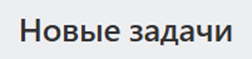
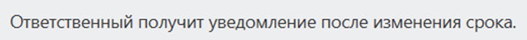
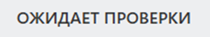

Типографика задает единый вид заголовков и текстовых фрагментов в интерфейсе. Компонент используют, когда нужно вывести название блока, подпись, описание или короткий текст в одной из стандартных типографических шкал.

В Bitrix Framework за типографику отвечает расширение `ui.system.typography`. В нем доступны классы `Headline` и `Text`. Для Vue-компонентов используется отдельное расширение `ui.system.typography.vue`.

## Подключить расширение

Если вы подключаете компонент из PHP, загрузите расширение `ui.system.typography`.

```php
\Bitrix\Main\UI\Extension::load('ui.system.typography');
```

Если вы работаете в модульном JavaScript, импортируйте классы из `ui.system.typography`.

```js
import { Headline, Text } from 'ui.system.typography';
```

## Создать заголовок

Класс `Headline` создает DOM-элемент для заголовка. Передайте в `render()` текст и объект с параметрами отображения.

```js
import { Headline } from 'ui.system.typography';

const title = Headline.render('Новые задачи', {
    size: 'lg',
    tag: 'h2',
});

document.getElementById('title-container').append(title);
```

{width=252px height=59px}

`Headline.render(text, options)` возвращает `HTMLElement`. В `options.size` передайте строку с размером заголовка. Для `Headline` параметр `size` обязателен. Если тег не передан, компонент создаст элемент `div`.

Текст из первого аргумента добавляется как текстовое содержимое элемента. Не передавайте в `text` HTML-разметку: компонент выведет ее как обычный текст.

## Создать текст

Класс `Text` создает DOM-элемент для обычного текста: подписи, описания, значения или короткого сообщения.

```js
import { Text } from 'ui.system.typography';

const description = Text.render('Ответственный получит уведомление после изменения срока.', {
    size: 'sm',
    tag: 'p',
});

document.getElementById('description-container').append(description);
```

{width=650px height=50px}

`Text.render(text, options)` возвращает `HTMLElement`. В `options.size` можно передать строку с размером текста. Для `Text` параметр `size` необязателен: если размер не передан, используется `md`. Если тег не передан, компонент создаст элемент `span`.

## Передать параметры

Параметры `Headline` и `Text` задают размер, тег и дополнительные правила отображения текста.

-  `size` — строка с размером заголовка или текста. Для `Headline` доступны значения `xl`, `lg`, `md`, `sm`, `xs`. Для `Text` доступны значения `2xl`, `xl`, `lg`, `md`, `sm`, `xs`, `2xs`, `3xs`, `4xs`.

-  `tag` — строка с HTML-тегом создаваемого элемента.

-  `accent` — логическое значение. Если передать `true`, компонент использует более насыщенное начертание.

-  `align` — строка с выравниванием текста. Доступны значения `left`, `center`, `right`, `justify`.

-  `transform` — строка с преобразованием регистра. Доступны значения `uppercase`, `lowercase`, `capitalize`.

-  `wrap` — строка с поведением длинного текста. Доступны значения `truncate`, `break-words`, `break-all`.

-  `className` — дополнительный CSS-класс. Можно передать строку, массив строк или объект, где ключ — имя класса, а логическое значение определяет, нужно ли добавить класс.

```js
import { Text } from 'ui.system.typography';

const status = Text.render('ожидает проверки', {
    size: 'xs',
    accent: true,
    transform: 'uppercase',
    wrap: 'truncate',
    className: 'task-status',
});
```

{width=300px height=53px}

## Выбрать класс и размер

Выберите класс по роли текста. `Headline` подходит для заголовка блока или группы элементов.

```js
import { Headline } from 'ui.system.typography';

const pageTitle = Headline.render('Отчет по сделкам', {
    size: 'xl',
    tag: 'h1',
});

const sectionTitle = Headline.render('Активные сделки', {
    size: 'sm',
    tag: 'h3',
});
```

`Text` подходит для описания, подписи, значения или короткого сообщения.

```js
import { Text } from 'ui.system.typography';

const mainText = Text.render('Сделка ожидает согласования.', {
    size: 'md',
});

const caption = Text.render('Обновлено сегодня', {
    size: '3xs',
});
```

## Использовать Vue-компоненты

Vue-компоненты доступны в расширении `ui.system.typography.vue`. Базовые компоненты `Headline` и `Text` принимают параметры `size`, `tag`, `accent`, `align`, `transform`, `wrap` и `className`. Для базовых Vue-компонентов параметр `size` обязателен.

Если Vue-компоненты используются на странице, загрузите расширение `ui.system.typography.vue` из PHP.

```php
\Bitrix\Main\UI\Extension::load('ui.system.typography.vue');
```

В модульном JavaScript импортируйте нужные компоненты из `ui.system.typography.vue`.

```js
import { HeadlineLg, TextSm } from 'ui.system.typography.vue';

export const TaskSummary = {
    components: {
        HeadlineLg,
        TextSm,
    },
    template: `
        <section>
            <HeadlineLg tag="h2">Новые задачи</HeadlineLg>
            <TextSm tag="p" :accent="true">Проверьте задачи без ответственного.</TextSm>
        </section>
    `,
};
```

Готовые Vue-компоненты уже содержат размер:

-  для заголовков — `HeadlineXl`, `HeadlineLg`, `HeadlineMd`, `HeadlineSm`, `HeadlineXs`;

-  для текста — `Text2Xl`, `TextXl`, `TextLg`, `TextMd`, `TextSm`, `TextXs`, `Text2Xs`, `Text3Xs`, `Text4Xs`.

Если размер нужно выбирать динамически, используйте базовые компоненты `Headline` и `Text` и передайте свойство `size`.

```js
import { Text } from 'ui.system.typography.vue';

export const TaskStatus = {
    components: {
        Text,
    },
    props: {
        size: {
            type: String,
            default: 'xs',
        },
    },
    template: `
        <Text :size="size" transform="uppercase">в работе</Text>
    `,
};
```



Подробнее о работе с Vue в Bitrix Framework читайте в статье [Vue.js](../advanced/vue.md).


