`ui.buttons` — JavaScript-расширение Bitrix Framework для кнопок в интерфейсе. Оно создает одиночные кнопки `Button`, разделенные кнопки `SplitButton`, кнопки с меню, счетчиками, иконками и состояниями.

Используйте `ui.buttons`, когда нужно добавить действие в клиентский интерфейс или создать кнопку для другого UI-компонента.

JavaScript API создает и меняет кнопку в браузере. PHP-классы `Bitrix\UI\Buttons` формируют HTML-кнопку на сервере и добавляют данные для инициализации JavaScript-объекта.

## Выбрать API для создания кнопки

Используйте API, который соответствует месту формирования кнопки:

-  `Button` и `SplitButton` из `ui.buttons` — для модульного JavaScript, когда кнопку создает код в браузере.

-  `ui.vue3.components.button` — для Vue-приложений на `ui.vue3`.

-  `Bitrix\UI\Buttons` — для PHP-кода, когда HTML формирует сервер.



Кнопки `ui.buttons` можно передавать в [системный диалог](./system-dialog.md), [окно сообщения](./dialogs-messagebox.md) и [всплывающее окно или меню `main.popup`](./main-popup.md).



## Подключить расширение

Если вы подключаете кнопки из PHP, загрузите расширение `ui.buttons`.

```php
\Bitrix\Main\UI\Extension::load('ui.buttons');
```

Если вы работаете в модульном JavaScript, импортируйте нужные классы и значения из `ui.buttons`.

```js
import {
    Button,
    SplitButton,
    ButtonColor,
    ButtonIcon,
    ButtonSize,
    ButtonState,
    ButtonTag,
    AirButtonStyle,
} from 'ui.buttons';
```

## Создать кнопку

Класс `Button` создает одну кнопку. Передайте текст, оформление и обработчик клика, затем добавьте кнопку в DOM через `renderTo()`.

```js
import { Button, ButtonColor } from 'ui.buttons';

const container = document.getElementById('actions-container');

if (container)
{
    const saveButton = new Button({
        text: 'Сохранить',
        color: ButtonColor.PRIMARY,
        onclick: () => {
            console.log('Сохранение');
        },
    });

    saveButton.renderTo(container);
}
```

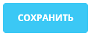{width=152px height=60px}

В JavaScript метод `render()` возвращает DOM-элемент кнопки. Используйте его, если компонент принимает готовый элемент.

```js
const buttonNode = saveButton.render();
```

## Передать параметры Button {#button-parameters}

Конструктор `Button` принимает объект параметров. Чтобы создать кнопку с текстом, передайте `text` и обработчик.

### Содержимое и поведение

#|
|| **Параметр** | **Тип данных** | **Описание** ||
|| `text` | `string` | Текст кнопки. Для `input`\-кнопок записывается в `value`, для остальных тегов — в текстовый контейнер. По умолчанию пустая строка. ||
|| `id` | `string` | Идентификатор кнопки внутри объекта `Button`. Метод `getId()` возвращает это значение. По умолчанию `null`. ||
|| `context` | `any` | Пользовательский контекст. Его можно сохранить в кнопке и получить через `getContext()`. По умолчанию `null`. ||
|| `disabled` | `boolean` | Отключает кнопку при создании. По умолчанию `false`. ||
|| `onclick` | `Function` | Обработчик клика. Получает объект кнопки и событие. По умолчанию не задан. ||
|| `events` | `object` | Обработчики DOM-событий. Ключ — имя события, значение — функция. По умолчанию пустой объект. ||
|| `menu` | `MenuOptions` | Параметры [меню из `main.popup`](./main-popup.md). Если передать пункты меню, кнопка откроет меню по клику. По умолчанию `null`. ||
|| `props` | `object` | HTML-атрибуты кнопки. Ключ — имя атрибута, значение — его значение. По умолчанию пустой объект. ||
|| `dataset` | `object` | `data-*`\-атрибуты кнопки. Ключ передается без префикса `data-`. Значение `null` удаляет атрибут. По умолчанию пустой объект. ||
|| `className` | `string` | Дополнительные CSS-классы кнопки. По умолчанию пустая строка. ||
|| `tag` | `ButtonTag` | HTML-тег кнопки: `BUTTON`, `LINK`, `SUBMIT`, `INPUT`, `DIV`. Если передан `link`, тег автоматически становится ссылкой. По умолчанию `BUTTON`. ||
|| `link` | `string` | Адрес для кнопки-ссылки. Значение работает только с тегом `ButtonTag.LINK`. По умолчанию пустая строка. ||
|| `dropdown` | `boolean` | Добавляет или отключает визуальный признак выпадающего меню. Если передано меню, признак включается автоматически. По умолчанию `false`. ||
|| `wide` | `boolean` | Растягивает кнопку по доступной ширине. По умолчанию `false`. ||
|#


### Оформление

#|
|| **Параметр** | **Тип данных** | **Описание** ||
|| `size` | `ButtonSize` | Размер кнопки. Значения доступны в `ButtonSize`: `EXTRA_LARGE`, `LARGE`, `MEDIUM`, `SMALL`, `EXTRA_SMALL`, `EXTRA_EXTRA_SMALL`. По умолчанию `null`. ||
|| `color` | `ButtonColor` | Цветовой вариант кнопки. Значения описаны в разделе [Цвет кнопки без Air Design](#color-without-air-design). По умолчанию `null`. ||
|| `icon` | `ButtonIcon` или строка | Иконка кнопки. Для стандартных иконок используйте `ButtonIcon`. Для иконок из расширения [`ui.icon-set.api.core`](./icons.md) передайте строковый идентификатор. По умолчанию `null`. ||
|| `collapsedIcon` | `ButtonIcon` | Иконка для свернутой кнопки. По умолчанию `null`. ||
|| `iconPosition` | `left`, `right` | Положение иконки относительно текста. По умолчанию `left`. ||
|| `state` | `ButtonState` | Задает [состояние кнопки](#button-states). По умолчанию `null`. ||
|| `maxWidth` | `number` | Максимальная ширина кнопки в пикселях. По умолчанию `null`. ||
|| `noCaps` | `boolean` | Отключает автоматическое преобразование текста в верхний регистр. По умолчанию `false`, для Air-кнопки — `true`. Air-кнопка всегда сохраняет регистр текста, даже если передать `noCaps: false`. ||
|| `round` | `boolean` | Делает кнопку круглой. По умолчанию `false`. ||
|| `dependOnTheme` | `boolean` | Включает оформление, зависящее от темы интерфейса. По умолчанию `false`. ||
|#


### Счетчики и Air Design

#|
|| **Параметр** | **Тип данных** | **Описание** ||
|| `counter` | `number`, `string` | Счетчик для кнопки без `Air Design`. Значения `0`, `'0'`, пустая строка, `null` и `false` удаляют счетчик. По умолчанию `null`. ||
|| `leftCounter`, `rightCounter` | `CounterOptions` | Левый или правый счетчик для Air-кнопки. Работает только с `useAirDesign: true`. По умолчанию `null`. ||
|| `useAirDesign` | `boolean` | Включает оформление `Air Design`. По умолчанию `false`. ||
|| `style` | `AirButtonStyle` | Стиль Air-кнопки. При включенном `Air Design` по умолчанию используется `FILLED`. Значения описаны в разделе [Стиль Air-кнопки](#air-button-style). ||
|| `removeLeftCorners`, `removeRightCorners` | `boolean` | Убирают левые или правые скругления у Air-кнопки, если передать `true`. По умолчанию `false`. ||
|#


Объекты `leftCounter` и `rightCounter` принимают параметры счетчика.

#|
|| **Параметр** | **Тип данных** | **Описание** ||
|| `value` | `number` | Значение счетчика. По умолчанию `0`. ||
|| `maxValue` | `number` | Максимальное отображаемое значение. По умолчанию `99`. ||
|| `style` | `ButtonCounterStyle` | Вариант оформления счетчика. Значения описаны в разделе [Стиль счетчика](#counter-style). По умолчанию `FILLED_ALERT`. ||
|| `color` | `ButtonCounterColor` | Цвет счетчика. Значения описаны в разделе [Цвет счетчика](#counter-color). По умолчанию `DANGER`. ||
|| `useSymbolPercent` | `boolean` | Добавляет знак процента к значению. По умолчанию `false`. ||
|#


Для кнопки-ссылки передайте `link`. Класс сам установит тег ссылки. Если вызвать `setLink()` у кнопки с другим тегом, JavaScript-класс выбросит ошибку.



Кнопки с тегами `ButtonTag.INPUT` и `ButtonTag.SUBMIT` не поддерживают иконку и счетчик. Для кнопки с иконкой или счетчиком используйте обычный `button` или ссылку.



```js
import { Button, ButtonColor } from 'ui.buttons';

const openButton = new Button({
    text: 'Открыть карточку',
    color: ButtonColor.LINK,
    link: '/crm/deal/details/42/',
});
```

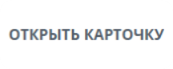{width=216px height=86px}

## Использовать Air Design

Air Design включается параметром `useAirDesign: true`. Для Air-кнопок используйте `style` из `AirButtonStyle`, а счетчики задавайте через `leftCounter` или `rightCounter`.

```js
import { Button, AirButtonStyle, ButtonCounterStyle } from 'ui.buttons';

const button = new Button({
    text: 'Согласовать',
    useAirDesign: true,
    style: AirButtonStyle.FILLED_SUCCESS,
    rightCounter: {
        value: 3,
        style: ButtonCounterStyle.FILLED_SUCCESS_INVERTED,
    },
    onclick: () => {
        console.log('Согласование');
    },
});
```

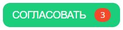{width=211px height=52px}



`style` не меняет кнопку без `useAirDesign: true`. Если вызвать `setStyle()` у кнопки без `Air Design`, стиль не применится.



Для кнопок без `Air Design` используйте `color`, `size`, `icon`, `state` и `counter`.

## Выбрать оформление и состояние

### Цвет кнопки без Air Design {#color-without-air-design}

Для кнопки без `Air Design` используйте `ButtonColor`.

#|
|| **Значение** | **Описание** ||
|| `PRIMARY` | Основная голубая кнопка с заливкой. ||
|| `PRIMARY_DARK` | Темный вариант основной голубой кнопки. ||
|| `PRIMARY_BORDER` | Основная кнопка без заливки, с цветной рамкой. ||
|| `SUCCESS` | Зеленая кнопка с заливкой для сохранения, создания или подтверждения. ||
|| `SUCCESS_DARK` | Темный вариант зеленой кнопки. ||
|| `SUCCESS_LIGHT` | Светлый вариант зеленой кнопки. ||
|| `DANGER` | Красная кнопка с заливкой для удаления и других критичных действий. ||
|| `DANGER_DARK` | Темный вариант красной кнопки. ||
|| `DANGER_LIGHT` | Светлый вариант красной кнопки. ||
|| `SECONDARY` | Голубая кнопка с менее контрастной заливкой для вторичного действия. ||
|| `SECONDARY_LIGHT` | Светлый вариант вторичной голубой кнопки. ||
|| `WARNING_LIGHT` | Светлая желтая кнопка для предупреждения. ||
|| `LINK` | Кнопка без заливки и рамки, оформленная как текстовое действие. ||
|| `LIGHT` | Нейтральная кнопка без заливки и рамки. ||
|| `LIGHT_BORDER` | Нейтральная кнопка без заливки, с серой рамкой. ||
|| `BASE_LIGHT` | Нейтральная кнопка со светло-серой заливкой. ||
|| `AI` | Фиолетовая кнопка для AI-сценариев. ||
|| `COLLAB` | Зеленая кнопка для сценариев совместной работы. ||
|| `CURTAIN_PRIMARY` | Основная голубая кнопка с контрастной рамкой для выезжающей панели. ||
|| `CURTAIN_WARNING` | Полупрозрачная кнопка с белым текстом и рамкой для выезжающей панели. ||
|#


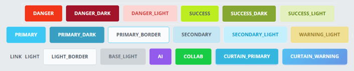{width=705px height=143px}

### Стиль Air-кнопки {#air-button-style}

Для Air-кнопки используйте `AirButtonStyle`.

#|
|| **Значение** | **Описание** ||
|| `FILLED` | Основной стиль с плотной заливкой. Используется по умолчанию. ||
|| `FILLED_SUCCESS` | Плотная заливка для успешного действия. ||
|| `FILLED_ALERT` | Плотная заливка для критичного действия. ||
|| `FILLED_COPILOT` | Плотная заливка для сценариев ВitrixGPT. ||
|| `FILLED_BOOST` | Акцентная градиентная заливка. ||
|| `TINTED` | Светлая заливка для вторичного действия. ||
|| `TINTED_ALERT` | Светлая заливка для критичного действия или предупреждения. ||
|| `OUTLINE` | Контурный стиль с основным акцентом. ||
|| `OUTLINE_ACCENT_1` | Контурный стиль с первым акцентным вариантом оформления. ||
|| `OUTLINE_ACCENT_2` | Контурный стиль со вторым акцентным вариантом оформления. ||
|| `OUTLINE_NO_ACCENT` | Нейтральный контурный стиль без акцентного цвета. ||
|| `PLAIN` | Стиль без заливки и видимой рамки. ||
|| `PLAIN_ACCENT` | Стиль без заливки с акцентным цветом содержимого. ||
|| `PLAIN_NO_ACCENT` | Нейтральный стиль без заливки и акцентного цвета. ||
|| `SELECTION` | Стиль для кнопки в сценарии выбора. ||
|#


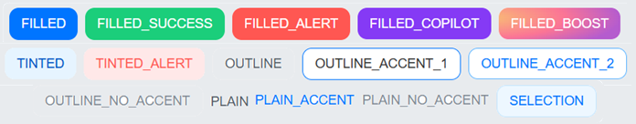{width=696px height=136px}

### Цвет счетчика {#counter-color}

Цвет счетчика задается значением `ButtonCounterColor`.

#|
|| **Значение** | **Описание** ||
|| `DANGER` | Красный цвет для ошибок, просроченных элементов и критичных значений. ||
|| `WARNING` | Желтый цвет для предупреждений и значений, которые требуют внимания. ||
|| `SUCCESS` | Зеленый цвет для успешных состояний и завершенных действий. ||
|| `PRIMARY` | Основной акцентный цвет интерфейса. ||
|| `GRAY` | Серый нейтральный цвет для второстепенной информации. ||
|| `LIGHT` | Светлый нейтральный цвет для темного или насыщенного фона. ||
|| `WHITE` | Белый цвет для контрастного отображения на темном фоне. ||
|| `DARK` | Темный цвет для светлого фона. ||
|| `THEME` | Цвет, который зависит от текущей темы интерфейса. ||
|#


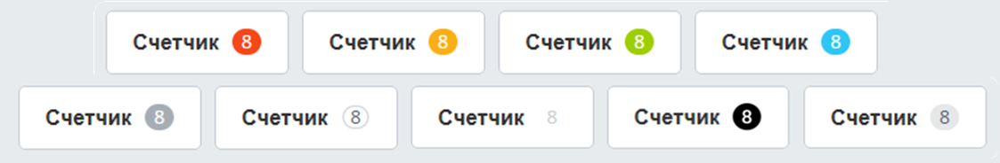{width=1123px height=184px}

### Стиль счетчика {#counter-style}

Стиль определяет сочетание фона, текста и границы счетчика.

#|
|| **Значение** | **Описание** ||
|| `FILLED_EXTRA` | Плотная градиентная заливка с белым текстом. ||
|| `FILLED` | Плотная заливка в основной палитре. ||
|| `FILLED_INVERTED` | Инвертированный вариант основной заливки: цвета фона и текста меняются местами. ||
|| `FILLED_ALERT` | Плотная заливка для ошибки или критичного значения. Значение по умолчанию для счетчика кнопки. ||
|| `FILLED_ALERT_INVERTED` | Инвертированный вариант оформления ошибки. ||
|| `FILLED_WARNING` | Плотная заливка для предупреждения. ||
|| `FILLED_SUCCESS` | Плотная заливка для успешного состояния. ||
|| `FILLED_SUCCESS_INVERTED` | Инвертированный вариант успешного состояния. ||
|| `FILLED_NO_ACCENT` | Плотная нейтральная заливка без акцентного цвета. ||
|| `FILLED_NO_ACCENT_INVERTED` | Инвертированная нейтральная заливка. ||
|| `TINTED_NO_ACCENT` | Светлая нейтральная подложка без акцентного цвета. ||
|| `OUTLINE_NO_ACCENT` | Нейтральное контурное оформление без плотной заливки. ||
|#


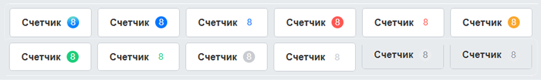{width=923px height=139px}

### Состояния Button {#button-states}

Состояние обычной кнопки задается значением `ButtonState`.

#|
|| **Значение** | **Описание** ||
|| `HOVER` | Состояние при наведении указателя на кнопку. ||
|| `ACTIVE` | Активное состояние. Например, кнопка меню переходит в него, пока меню открыто. ||
|| `DISABLED` | Неактивное состояние. Для включения и отключения кнопки используйте метод `setDisabled()`. ||
|| `CLOCKING` | Состояние выполнения с индикатором времени. Для управления состоянием используйте метод `setClocking()`. ||
|| `WAITING` | Состояние ожидания выполнения операции. Для управления состоянием используйте метод `setWaiting()`. ||
|| `AI_WAITING` | Состояние ожидания выполнения AI-операции. ||
|#


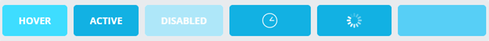{width=1212px height=103px}

### Состояния SplitButton {#split-button-states}

Состояние разделенной кнопки задается значением `SplitButtonState`. Общее состояние применяется ко всей кнопке, состояние с префиксом `MAIN_` — к основной части, с префиксом `MENU_` — к части меню.

#|
|| **Значение** | **Описание** ||
|| `HOVER` | Состояние наведения для всей разделенной кнопки. ||
|| `MAIN_HOVER` | Состояние наведения для основной части. ||
|| `MENU_HOVER` | Состояние наведения для части меню. ||
|| `ACTIVE` | Активное состояние всей разделенной кнопки. ||
|| `MAIN_ACTIVE` | Активное состояние основной части. ||
|| `MENU_ACTIVE` | Активное состояние части меню. ||
|| `DISABLED` | Неактивное состояние всей разделенной кнопки. ||
|| `MAIN_DISABLED` | Неактивное состояние основной части. ||
|| `MENU_DISABLED` | Неактивное состояние части меню. ||
|| `CLOCKING` | Состояние выполнения с индикатором времени для всей кнопки. ||
|| `WAITING` | Состояние ожидания выполнения операции для всей кнопки. ||
|| `AI_WAITING` | Состояние ожидания выполнения AI-операции для всей кнопки. ||
|#


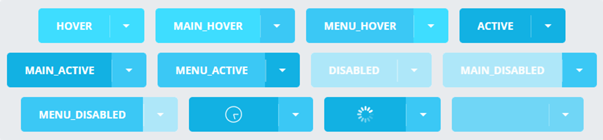{width=1351px height=316px}

Дополнительные параметры оформления:

-  `ButtonSize` задает размер кнопки: `EXTRA_LARGE`, `LARGE`, `MEDIUM`, `SMALL`, `EXTRA_SMALL` или `EXTRA_EXTRA_SMALL`.

-  `ButtonTag` задает тег: `BUTTON`, `LINK`, `SUBMIT`, `INPUT` или `DIV`. Значение `SPAN` экспортируется, но в текущей реализации не создает отдельный тег `span`.

-  `ButtonIcon` содержит стандартные иконки для действий, статусов, навигации, связи, файлов и бизнес-процессов. Строковый идентификатор добавляет иконку из расширения `ui.icon-set.api.core`. Полный набор описан в статье [Иконки](./icons.md).

## Добавить меню

Параметр `menu` принимает настройки [меню из `main.popup`](./main-popup.md). Если в `menu.items` есть пункты, кнопка открывает меню по клику и переводит себя в активное состояние на время показа меню. Метод [`getMenuWindow()`](#menu-and-events) возвращает объект `Menu`, если нужно управлять созданным меню напрямую.

```js
import { Button, ButtonColor } from 'ui.buttons';

const actionsButton = new Button({
    text: 'Действия',
    color: ButtonColor.LIGHT_BORDER,
    menu: {
        items: [
            {
                id: 'edit',
                text: 'Редактировать',
                onclick: () => {
                    console.log('Редактировать');
                },
            },
            {
                id: 'delete',
                text: 'Удалить',
                onclick: () => {
                    console.log('Удалить');
                },
            },
        ],
    },
});

const container = document.getElementById('actions-container');
if (container)
{
    actionsButton.renderTo(container);
}
```

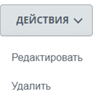{width=183px height=209px}

## Управлять кнопкой после создания

После создания экземпляра используйте методы `Button`, чтобы менять текст, оформление, состояние и обработчики.

### Отрисовка

#|
|| **Метод** | **Что делает** ||
|| `render()` | Возвращает DOM-элемент кнопки. ||
|| `renderTo(node)` | Добавляет DOM-элемент кнопки в переданный контейнер и возвращает этот элемент. ||
|| `getContainer()` | Возвращает DOM-элемент кнопки. ||
|#


### Текст, оформление и состояние

#|
|| **Метод** | **Что делает** ||
|| `setText(text)` | Меняет текст кнопки. ||
|| `getText()` | Возвращает текущий текст кнопки. ||
|| `setColor(color)` | Меняет [цвет кнопки без Air Design](#color-without-air-design). ||
|| `getColor()` | Возвращает текущее значение из `ButtonColor` или `null`. ||
|| `setSize(size)` | Меняет значение из `ButtonSize`. ||
|| `getSize()` | Возвращает текущее значение из `ButtonSize` или `null`. ||
|| `setIcon(icon, iconPosition)` | Меняет иконку. `iconPosition` принимает `left` или `right`. ||
|| `setCollapsedIcon(icon)` | Задает иконку для свернутой кнопки. ||
|| `getIcon()` | Возвращает текущую иконку или `null`. ||
|| `setState(state)` | Устанавливает [состояние кнопки](#button-states) или очищает его, если передать `null`. ||
|| `getState()` | Возвращает текущее [состояние кнопки](#button-states) или `null`. ||
|| `setActive(flag)` | Включает или выключает активное состояние. ||
|| `isActive()` | Возвращает `true`, если кнопка активна. ||
|| `setHovered(flag)` | Включает или выключает состояние наведения. ||
|| `isHover()` | Возвращает `true`, если кнопка находится в состоянии наведения. ||
|| `setDisabled(flag)` | Отключает или включает кнопку. ||
|| `isDisabled()` | Возвращает `true`, если кнопка отключена. ||
|| `setWaiting(flag)` | Включает или выключает состояние ожидания и блокирует кнопку. ||
|| `isWaiting()` | Возвращает `true`, если кнопка находится в состоянии ожидания. ||
|| `setClocking(flag)` | Включает или выключает состояние с индикатором времени и блокирует кнопку. ||
|| `isClocking()` | Возвращает `true`, если кнопка находится в состоянии `CLOCKING`. ||
|| `setNoCaps(flag)` | Включает или выключает режим без верхнего регистра. ||
|| `isNoCaps()` | Возвращает `true`, если включен режим без верхнего регистра. ||
|| `setRound(flag)` | Включает или выключает круглую форму кнопки. ||
|| `isRound()` | Возвращает `true`, если кнопка круглая. ||
|| `setDropdown(flag)` | Включает или выключает визуальный признак выпадающего меню. ||
|| `isDropdown()` | Возвращает `true`, если у кнопки включен признак выпадающего меню. ||
|| `setCollapsed(flag)` | Сворачивает кнопку до компактного вида или возвращает обычный вид. ||
|| `isCollapsed()` | Возвращает `true`, если кнопка свернута. ||
|| `setWide(flag)` | Включает или выключает растягивание кнопки по ширине. ||
|| `isWide()` | Возвращает `true`, если кнопка растянута по ширине. ||
|| `setDependOnTheme(flag)` | Включает или выключает оформление, зависящее от темы интерфейса. ||
|#


### Ссылки и размеры

#|
|| **Метод** | **Что делает** ||
|| `setLink(link)` | Устанавливает адрес ссылки. Метод работает только для кнопки с тегом `ButtonTag.LINK`. ||
|| `getLink()` | Возвращает адрес ссылки. ||
|| `setMaxWidth(maxWidth)` | Задает максимальную ширину кнопки в пикселях. ||
|| `getMaxWidth()` | Возвращает максимальную ширину или `null`. ||
|#


### Счетчики и Air Design

#|
|| **Метод** | **Что делает** ||
|| `setCounter(counter)` | Меняет счетчик кнопки без `Air Design`. ||
|| `getCounter()` | Возвращает значение счетчика или `null`. ||
|| `setLeftCounter(options)` | Создает или удаляет левый счетчик Air-кнопки. ||
|| `getLeftCounter()` | Возвращает объект левого счетчика. ||
|| `setRightCounter(options)` | Создает или удаляет правый счетчик Air-кнопки. ||
|| `getRightCounter()` | Возвращает объект правого счетчика. ||
|| `setAirDesign(flag)` | Включает или выключает `Air Design`. ||
|| `hasAirDesign()` | Возвращает `true`, если `Air Design` включен. ||
|| `setStyle(style)` | Устанавливает [стиль Air-кнопки](#air-button-style). ||
|| `getStyle()` | Возвращает текущий стиль Air-кнопки. ||
|| `setLeftCorners(flag)` | Показывает или убирает левые скругления Air-кнопки. ||
|| `setRightCorners(flag)` | Показывает или убирает правые скругления Air-кнопки. ||
|#


### Меню и события {#menu-and-events}

#|
|| **Метод** | **Что делает** ||
|| `getMenuWindow()` | Возвращает объект меню `Menu` или `null`. ||
|| `bindEvent(eventName, fn)` | Добавляет обработчик DOM-события. ||
|| `unbindEvent(eventName)` | Удаляет обработчик DOM-события. ||
|| `bindEvents(events)` | Добавляет обработчики из объекта, где ключ — имя DOM-события. ||
|| `unbindEvents(eventNames)` | Удаляет обработчики событий из массива имен. ||
|#


### Атрибуты и дополнительные данные

#|
|| **Метод** | **Что делает** ||
|| `setProps(props)` | Добавляет или меняет HTML-атрибуты. ||
|| `getProps()` | Возвращает HTML-атрибуты без `class`, `type` и `data-*`. ||
|| `setDataSet(dataset)` | Добавляет, меняет или удаляет `data-*`\-атрибуты. ||
|| `getDataSet()` | Возвращает `dataset` DOM-элемента. ||
|| `addClass(className)` | Добавляет CSS-класс. ||
|| `removeClass(className)` | Удаляет CSS-класс. ||
|| `getTag()` | Возвращает значение тега из `ButtonTag`. ||
|| `setId(id)` | Задает идентификатор кнопки. ||
|| `getId()` | Возвращает идентификатор, переданный в `id`. ||
|| `setContext(context)` | Сохраняет пользовательский контекст в объекте кнопки. ||
|| `getContext()` | Возвращает сохраненный пользовательский контекст. ||
|| `startShimmer()` | Добавляет эффект перелива. ||
|| `stopShimmer()` | Удаляет эффект перелива. ||
|#


```js
import { Button, ButtonColor, ButtonState } from 'ui.buttons';

const button = new Button({
    text: 'Экспорт',
    color: ButtonColor.PRIMARY,
});

button.setWaiting(true);

BX.ajax.runAction('example.Export.start')
    .then(() => {
        button.setWaiting(false);
        button.setText('Файл готов');
        button.setState(ButtonState.ACTIVE);
    })
    .catch(() => {
        button.setWaiting(false);
    })
;
```

## Создать разделенную кнопку

`SplitButton` создает кнопку из двух частей: основной кнопки и кнопки меню. Основная часть выполняет главное действие, а правая часть открывает меню.

```js
import {
    SplitButton,
    ButtonColor,
    SplitSubButtonType,
} from 'ui.buttons';

const splitButton = new SplitButton({
    text: 'Создать',
    color: ButtonColor.PRIMARY,
    menuTarget: SplitSubButtonType.MENU,
    mainButton: {
        onclick: () => {
            console.log('Создать объект');
        },
    },
    menu: {
        items: [
            {
                id: 'create-task',
                text: 'Создать задачу',
                onclick: () => {
                    console.log('Создать задачу');
                },
            },
            {
                id: 'create-event',
                text: 'Создать событие',
                onclick: () => {
                    console.log('Создать событие');
                },
            },
        ],
    },
});

const container = document.getElementById('create-container');
if (container)
{
    splitButton.renderTo(container);
}
```

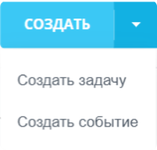{width=221px height=211px}

`SplitButton` принимает параметры `Button`, кроме `tag`, `round` и `ButtonState`. Для него используйте [состояния `SplitButton`](#split-button-states).

#|
|| **Параметр** | **Тип данных** | **Описание** ||
|| `mainButton` | `object` | Параметры основной части. Можно передать `onclick`, `events`, `link`, `disabled`, `props`, `dataset` и `className`. По умолчанию пустой объект. ||
|| `menuButton` | `object` | Параметры правой части, которая открывает меню. Принимает тот же набор параметров, что и `mainButton`. По умолчанию пустой объект. ||
|| `menuTarget` | `SplitSubButtonType` | Определяет элемент привязки меню. `MAIN` привязывает меню ко всей разделенной кнопке, `MENU` — к правой части. По умолчанию `MAIN`. ||
|| `switcher` | `true`, `object` | Заменяет правую кнопку переключателем. Объект принимает параметры из `ui.switcher`; размер и `Air Design` компонент определяет по разделенной кнопке. По умолчанию не задан. ||
|| `state` | `SplitButtonState` | Задает [состояние всей кнопки или отдельной части](#split-button-states). По умолчанию `null`. ||
|#


Если передать `switcher: true` или объект настроек переключателя, вместо кнопки меню будет создана часть с переключателем. Получить переключатель можно через `getSwitcher()`.

Методы `SplitButton` работают с контейнером разделенной кнопки, основной кнопкой и кнопкой меню.

#|
|| **Метод** | **Что делает** ||
|| `getMainButton()` | Возвращает основную часть кнопки. ||
|| `getMenuButton()` | Возвращает часть, которая открывает меню. ||
|| `getSwitcherButton()` | Возвращает часть с переключателем, если она создана. ||
|| `getSwitcher()` | Возвращает объект переключателя или `null`. ||
|| `getMenuTarget()` | Возвращает часть кнопки, к которой привязано меню. ||
|| `setText(text)` | Меняет текст основной части. ||
|| `getText()` | Возвращает текст основной части. ||
|| `setCounter(counter)` | Меняет счетчик основной части. ||
|| `getCounter()` | Возвращает счетчик основной части или `null`. ||
|| `setLeftCounter(options)` | Создает или удаляет левый счетчик основной части Air-кнопки. ||
|| `setRightCounter(options)` | Создает или удаляет правый счетчик основной части Air-кнопки. ||
|| `setLink(link)` | Устанавливает ссылку для основной части. ||
|| `getLink()` | Возвращает ссылку основной части. ||
|| `setState(state)` | Устанавливает [состояние разделенной кнопки](#split-button-states). ||
|| `setDisabled(flag)` | Отключает или включает обе части кнопки. ||
|#


## Использовать готовые кнопки

Расширение экспортирует классы с локализованным текстом и базовым оформлением. Все они принимают параметры `Button`, которыми можно переопределить значения по умолчанию. Назначение цветов описано в разделе [Цвет кнопки без Air Design](#color-without-air-design).

#|
|| **Класс** | **Значения по умолчанию** ||
|| `AddButton` | Текст «Добавить», цвет `SUCCESS`. ||
|| `ApplyButton` | Текст «Применить», цвет `LIGHT_BORDER`. ||
|| `CancelButton` | Текст «Отменить», цвет `LINK`. ||
|| `CloseButton` | Текст «Закрыть», цвет `LINK`. ||
|| `CreateButton` | Текст «Создать», цвет `SUCCESS`. ||
|| `SaveButton` | Текст «Сохранить», цвет `SUCCESS`. ||
|| `SendButton` | Текст «Отправить», цвет `SUCCESS`. ||
|| `SettingsButton` | Иконка `SETTING`, цвет `LIGHT_BORDER`, без признака выпадающего меню. ||
|#


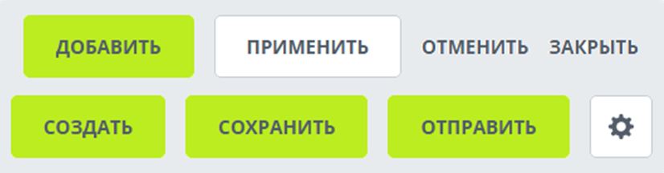{width=826px height=216px}

Для разделенных кнопок доступны `AddSplitButton`, `ApplySplitButton`, `CancelSplitButton`, `CloseSplitButton`, `CreateSplitButton`, `SaveSplitButton` и `SendSplitButton`. Они используют те же тексты и цвета, что и одноименные одиночные кнопки.

```js
import { SaveButton } from 'ui.buttons';

const button = new SaveButton({
    onclick: () => {
        console.log('Сохранение');
    },
});

const container = document.getElementById('actions-container');
if (container)
{
    button.renderTo(container);
}
```

## Использовать Vue-компонент

Расширение `ui.vue3.components.button` экспортирует Vue-компонент `Button`. Компонент создает Air-кнопку на основе класса `Button` из `ui.buttons`, поэтому использует те же размеры, [состояния](#button-states), [стили Air-кнопки](#air-button-style) и наборы иконок.

Если вы подключаете Vue-компонент из PHP, загрузите расширение `ui.vue3.components.button`.

```php
\Bitrix\Main\UI\Extension::load('ui.vue3.components.button');
```

В модульном JavaScript импортируйте компонент и нужные значения из этого расширения.

```js
import {
    Button,
    AirButtonStyle,
    ButtonIcon,
    ButtonSize,
} from 'ui.vue3.components.button';
```

### Передать свойства и обработать клик

Основные свойства Vue-компонента соответствуют параметрам `Button`.

#|
|| **Свойство** | **Тип данных** | **Описание** ||
|| `id` | `string` | Задает HTML-атрибут `id`. Если `idKey` не передан, это же значение становится внутренним идентификатором объекта `Button`. По умолчанию пустая строка. ||
|| `idKey` | `string` | Задает внутренний идентификатор объекта `Button` отдельно от HTML-атрибута `id`. По умолчанию пустая строка. ||
|| `class` | `string` | Добавляет CSS-классы кнопки при создании компонента. По умолчанию \`\`. ||
|| `text` | `string` | Задает текст кнопки. По умолчанию пустая строка. ||
|| `link` | `string` | Создает кнопку-ссылку с указанным адресом. По умолчанию пустая строка. ||
|| `size` | `ButtonSize` | Задает размер кнопки. По умолчанию \`\`. ||
|| `state` | `ButtonState` | Задает [состояние кнопки](#button-states). По умолчанию \`\`. ||
|| `style` | `AirButtonStyle` | Задает [стиль Air-кнопки](#air-button-style). По умолчанию `null`, при этом используется `FILLED`. ||
|| `disabled` | `boolean` | Отключает кнопку. По умолчанию `false`. ||
|| `loading` | `boolean` | Показывает состояние ожидания и блокирует кнопку. По умолчанию `false`. ||
|| `type` | `string` | Задает HTML-атрибут `type`. Допустимые значения: `button`, `submit`, `reset`. По умолчанию `button`. ||
|| `leftIcon` | `ButtonIcon` или строка | Добавляет иконку слева. Можно передать значение из `ButtonIcon` или наборов `Set` и `Outline` расширения [`ui.icon-set.api.core`](./icons.md). По умолчанию `null`. ||
|| `collapsedIcon` | `ButtonIcon` | Задает стандартную иконку для свернутой кнопки. По умолчанию `null`. ||
|| `leftCounterValue`, `rightCounterValue` | `number` | Задают значения счетчиков слева и справа. Положительное значение показывает счетчик, `0` удаляет его. По умолчанию `0`. ||
|| `dropdown` | `boolean` | Добавляет визуальный признак выпадающего меню. Компонент не создает меню. По умолчанию `false`. ||
|| `wide` | `boolean` | Растягивает кнопку по доступной ширине. По умолчанию `false`. ||
|| `collapsed` | `boolean` | Сворачивает кнопку до компактного вида. По умолчанию `false`. ||
|| `noCaps` | `boolean` | Управляет преобразованием текста в верхний регистр. По умолчанию `true`. ||
|| `removeLeftCorners`, `removeRightCorners` | `boolean` | Убирают скругления с соответствующей стороны. По умолчанию `false`. ||
|| `shimmer` | `boolean` | Включает или выключает эффект перелива. По умолчанию `false`. ||
|| `dataset` | `object` | Добавляет `data-*`\-атрибуты к кнопке. По умолчанию пустой объект. ||
|#


Компонент генерирует событие `click` без аргументов.

Компонент обновляет кнопку при изменении свойств:

-  содержимое и состояние — `text`, `state`, `disabled`, `loading`, `leftIcon`, `collapsedIcon` и значения счетчиков;

-  оформление — `size`, `style`, `dropdown`, `wide`, `collapsed`, `noCaps`, `removeLeftCorners`, `removeRightCorners`, `shimmer` и `type`.

Свойства `id`, `idKey`, `class`, `link` и `dataset` применяются только при создании кнопки.

Vue-компонент всегда включает `Air Design`. Для основного оформления используйте `AirButtonStyle`, а не `ButtonColor`. Расширение также экспортирует `ButtonColor`, `ButtonIcon`, `ButtonState`, `ButtonTag` и `ButtonCounterColor`.

```js
import {
    Button,
    AirButtonStyle,
    ButtonSize,
} from 'ui.vue3.components.button';

export const SaveButton = {
    components: {
        Button,
    },
    setup(): Object
    {
        return {
            AirButtonStyle,
            ButtonSize,
        };
    },
    data(): Object
    {
        return {
            isLoading: false,
        };
    },
    methods: {
        handleClick()
        {
            this.isLoading = true;
        },
    },
    template: `
        <Button
            text="Сохранить"
            :style="AirButtonStyle.FILLED"
            :size="ButtonSize.MEDIUM"
            :loading="isLoading"
            :rightCounterValue="3"
            @click="handleClick"
        />
    `,
};
```

После завершения асинхронной операции присвойте `isLoading` значение `false`, чтобы выключить состояние ожидания.



Подробнее о регистрации и запуске Vue-приложения читайте в статье [Vue.js](../advanced/vue.md).



## Использовать PHP-классы

PHP-классы `Bitrix\UI\Buttons` нужны, когда кнопку формирует серверный код. Метод `render()` возвращает HTML и по умолчанию добавляет JavaScript-инициализацию через `ButtonManager.createFromNode()`.

Класс `Bitrix\UI\Buttons\Button` по умолчанию создает кнопку с цветом `Color::SUCCESS`. Передайте `color`, если нужен другой вариант оформления.

Основные параметры совпадают с [параметрами `Button`](#button-parameters). PHP-классы дополнительно принимают настройки серверной разметки.

#|
|| **Параметр** | **Описание** ||
|| `air` | Включает `Air Design`, если определена константа `AIR_SITE_TEMPLATE`. По умолчанию `false`. ||
|| `counterStyle` | Задает [стиль счетчика](#counter-style) из `Bitrix\UI\Counter\CounterStyle`. По умолчанию `null`. ||
|| `target` | Задает `target` для кнопки-ссылки: `_blank`, `_self`, `_parent` или `_top`. По умолчанию не задан. ||
|| `click` | Альтернативное имя обработчика клика. Принимает те же значения, что и `onclick`. По умолчанию не задан. ||
|| `className` | Добавляет CSS-классы из строки, разделенной пробелами. По умолчанию пустая строка. ||
|| `classList` | Добавляет CSS-классы из массива. По умолчанию пустой массив. ||
|| `styles` | Добавляет встроенные стили из массива. По умолчанию пустой массив. ||
|#


Для обработчиков используйте `JsCode`, если нужно передать готовый JavaScript-код, или `JsHandler`, если обработчик уже объявлен как JavaScript-функция.

В PHP доступны готовые классы `AddButton`, `ApplyButton`, `CancelButton`, `CloseButton`, `CreateButton`, `SaveButton`, `SendButton` и `SettingsButton`. Для всех перечисленных классов, кроме `SettingsButton`, есть разделенные варианты в пространстве имен `Bitrix\UI\Buttons\Split`.

```php
use Bitrix\UI\Buttons\Button;
use Bitrix\UI\Buttons\Color;
use Bitrix\UI\Buttons\JsCode;
use Bitrix\UI\Buttons\Size;

\Bitrix\Main\UI\Extension::load('ui.buttons');

$button = new Button([
    'text' => 'Сохранить',
    'color' => Color::PRIMARY,
    'size' => Size::MEDIUM,
    'onclick' => new JsCode("console.log('Сохранение');"),
]);

$button->setUniqId('uibtn-example');

echo $button->render();
```

Если нужно получить JavaScript-объект кнопки, которую уже отрисовал PHP-класс, используйте `ButtonManager.createFromNode(node)` или `ButtonManager.createByUniqId(id)`.

```js
import { ButtonManager } from 'ui.buttons';

const button = ButtonManager.createByUniqId('uibtn-example');

if (button)
{
    button.setWaiting(true);
}
```

Кнопку можно настроить цепочкой методов.

```php
use Bitrix\UI\Buttons\Button;
use Bitrix\UI\Buttons\Color;

\Bitrix\Main\UI\Extension::load('ui.buttons');

$button =
    (new Button())
        ->setText('Подождите')
        ->setColor(Color::LIGHT_BORDER)
        ->setWaiting()
;

echo $button->render();
```

Для разделенной кнопки используйте `Bitrix\UI\Buttons\Split\Button`.

```php
use Bitrix\UI\Buttons\JsCode;
use Bitrix\UI\Buttons\Split\Button as SplitButton;
use Bitrix\UI\Buttons\Split\Type;

\Bitrix\Main\UI\Extension::load('ui.buttons');

$button = new SplitButton([
    'text' => 'Создать',
    'mainButton' => [
        'onclick' => new JsCode("console.log('Создать объект');"),
    ],
    'menuTarget' => Type::MENU,
    'menu' => [
        'items' => [
            [
                'id' => 'create-task',
                'text' => 'Создать задачу',
                'onclick' => new JsCode("console.log('Создать задачу');"),
            ],
        ],
    ],
]);

echo $button->render();
```

В PHP-классах для `Air Design` используется параметр `'air' => true` или метод `setAirDesign()`. Метод включает Air-оформление только если в окружении определена константа `AIR_SITE_TEMPLATE`.