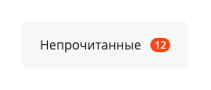
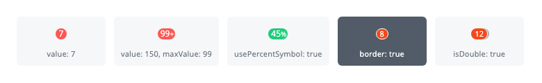
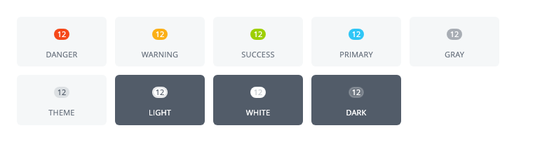
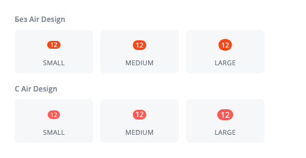
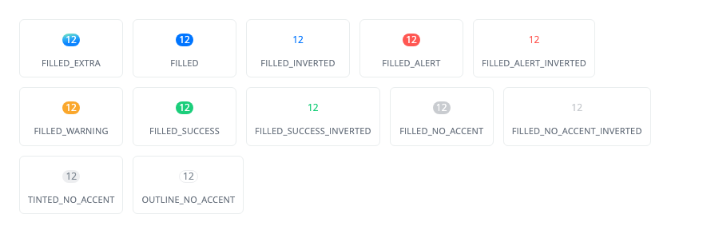

`ui.counter` — расширение Bitrix Framework для счетчика: небольшой овальной метки с числом.

Счетчик показывает количество непрочитанных сообщений, новых задач или незакрытых дел. Разместите его рядом с пунктом меню, вкладкой, кнопкой или названием группы.

JavaScript-класс `Counter` создает и меняет счетчик в браузере. PHP-класс `Bitrix\UI\Counter\Counter` формирует готовый HTML на сервере.

## Выбрать API для создания счетчика

Используйте API, который соответствует месту формирования счетчика:

-  `Counter` из `ui.cnt` — для модульного JavaScript, когда счетчик создает код в браузере.

-  `ui.vue3.components.counter` — для Vue-приложений на `ui.vue3`.

-  `Bitrix\UI\Counter\Counter` — для PHP-кода, когда HTML формирует сервер.

У кнопки свой счетчик: его задают параметры самой кнопки. Для такого сценария используйте [кнопки ui.buttons](./ui-buttons.md).

## Подключить расширение

Если вы выводите счетчик из PHP, загрузите расширение `ui.counter`.

```php
\Bitrix\Main\UI\Extension::load('ui.counter');
```

Расширение `ui.counter` не содержит своего кода: оно подключает расширение `ui.cnt`. Короткое имя `ui.cnt` защищает файлы от блокировки браузерными расширениями, а имя `ui.counter` остается для совместимости.

Если вы работаете в модульном JavaScript, импортируйте класс и наборы значений из `ui.cnt`.

```js
import { Counter, CounterColor, CounterSize, CounterStyle } from 'ui.cnt';
```

После загрузки расширения те же имена доступны глобально: `BX.UI.Counter`, `BX.UI.CounterColor`, `BX.UI.CounterSize` и `BX.UI.CounterStyle`. Наборы значений доступны и как свойства класса: `Counter.Color`, `Counter.Size` и `Counter.Style`.

## Создать счетчик в JavaScript

Чтобы создать счетчик, выполните основные действия:

1. Создайте экземпляр `Counter`.

2. Передайте число в параметр `value`.

3. Разместите счетчик на странице методом `renderTo()`.

**Пример.** Красный счетчик с числом 12 появляется в блоке с идентификатором `counter-container`.

```js
import { Counter, CounterColor, CounterSize } from 'ui.cnt';

const counter = new Counter({
    value: 12,
    color: CounterColor.DANGER,
    size: CounterSize.MEDIUM,
});

counter.renderTo(document.getElementById('counter-container'));
```

{width=233px height=100px}

Метод `renderTo()` добавляет счетчик в конец переданного узла и возвращает DOM-узел счетчика. Если аргумент не DOM-узел, метод возвращает `null` и ничего не размещает.

Метод `render()` возвращает DOM-узел счетчика, но не размещает его на странице. Используйте его, когда узел нужно вставить самостоятельно. Повторные вызовы `render()`, `renderTo()` и `getContainer()` возвращают один и тот же узел.

## Передать параметры

Передайте в конструктор `Counter` объект с параметрами, чтобы задать число, оформление и поведение счетчика.

### Число и предельное значение

-  `value` — число счетчика. Передавайте неотрицательное число: конструктор выводит отрицательное значение как есть, и к нулю его приводят только методы `update()` и `setValue()`. По умолчанию `0`.

-  `maxValue` — предельное число. Если `value` больше, счетчик показывает `maxValue` со знаком `+`, например `99+`. По умолчанию `99`.

-  `usePercentSymbol` — знак процента после числа. При `true` счетчик выводит `value` целиком и не ограничивает его по `maxValue`. По умолчанию `false`.

### Оформление

-  `color` — цвет счетчика. Значения описаны в разделе [Цвет счетчика](#counter-color). По умолчанию `CounterColor.PRIMARY`.

-  `size` — размер счетчика. Значения описаны в разделе [Размер счетчика](#counter-size). По умолчанию `CounterSize.MEDIUM`.

-  `useAirDesign` — оформление Air Design. По умолчанию `false`.

-  `style` — вариант оформления Air Design. Значения описаны в разделе [Стиль Air Design](#counter-style). По умолчанию `CounterStyle.FILLED`.

-  `border` — светлая рамка вокруг счетчика. Она отделяет счетчик от цветной подложки. По умолчанию `false`.



Цвет и стиль не работают вместе. С `useAirDesign: true` фон счетчика задает `style`, а `color` на него не влияет. Без Air Design работает `color`, а `style` не применяется.



### Двойной счетчик

-  `isDouble` — вторая подложка, сдвинутая вправо за основным счетчиком. По умолчанию `false`.

-  `secondaryColor` — цвет второй подложки. Значение берется из `CounterColor` и действует только с `isDouble: true`. По умолчанию `CounterColor.PRIMARY`.

{width=780px height=120px}

### Поведение и размещение

-  `animate` — анимация при смене числа. Описана в разделе [Анимировать изменение числа](#animate). По умолчанию `false`.

-  `hideIfZero` — скрытие счетчика при нулевом значении. Работает только с `useAirDesign: true`. По умолчанию `false`.

-  `node` — готовый DOM-узел под счетчик. Класс очищает узел, задает ему классы счетчика и размещает содержимое внутри. Без этого параметра класс создает новый узел.

-  `id` — значение атрибута `id` у узла счетчика. По умолчанию атрибут не задается.

## Выбрать цвет, размер и стиль

Оформление счетчика собирается из трех наборов значений. Цвет и стиль отвечают за заливку и относятся к разным режимам, размер работает в обоих.

### Цвет счетчика {#counter-color}

Цвет счетчика задает значение `CounterColor`. Оно действует, когда Air Design выключен.

#|
|| **Значение** | **Описание** ||
|| `DANGER` | Красный цвет для ошибок, просроченных элементов и критичных значений ||
|| `WARNING` | Желтый цвет для предупреждений и значений, которые требуют внимания ||
|| `SUCCESS` | Зеленый цвет для успешных состояний и завершенных действий ||
|| `PRIMARY` | Основной акцентный цвет интерфейса ||
|| `GRAY` | Серый нейтральный цвет для второстепенной информации ||
|| `LIGHT` | Белая заливка с серой обводкой и темным текстом ||
|| `WHITE` | Белая заливка со светло-серым текстом ||
|| `DARK` | Полупрозрачная светлая подложка для темного фона ||
|| `THEME` | Цвет, который зависит от текущей темы интерфейса ||
|#

{width=780px height=203px}

Значения `LIGHT`, `WHITE` и `DARK` рассчитаны на темный фон, поэтому на иллюстрации они показаны на темной подложке.

### Размер счетчика {#counter-size}

Размер счетчика задает значение `CounterSize`. Оно определяет высоту счетчика и размер шрифта.

#|
|| **Значение** | **Высота без Air Design** | **Высота с Air Design** ||
|| `SMALL` | 13 px | 14 px ||
|| `MEDIUM` | 16 px | 16 px ||
|| `LARGE` | 19 px | 18 px ||
|#

{width=500px height=259px}

### Стиль Air Design {#counter-style}

Стиль определяет сочетание фона, текста и границы счетчика в режиме Air Design. Значения дает набор `CounterStyle`.

#|
|| **Значение** | **Описание** ||
|| `FILLED_EXTRA` | Плотная градиентная заливка с белым текстом ||
|| `FILLED` | Плотная заливка в основной палитре. Значение по умолчанию в JavaScript ||
|| `FILLED_INVERTED` | Инвертированный вариант основной заливки: цвета фона и текста меняются местами ||
|| `FILLED_ALERT` | Плотная заливка для ошибки или критичного значения. Значение по умолчанию в PHP ||
|| `FILLED_ALERT_INVERTED` | Инвертированный вариант оформления ошибки ||
|| `FILLED_WARNING` | Плотная заливка для предупреждения ||
|| `FILLED_SUCCESS` | Плотная заливка для успешного состояния ||
|| `FILLED_SUCCESS_INVERTED` | Инвертированный вариант успешного состояния ||
|| `FILLED_NO_ACCENT` | Плотная нейтральная заливка без акцентного цвета ||
|| `FILLED_NO_ACCENT_INVERTED` | Инвертированная нейтральная заливка ||
|| `TINTED_NO_ACCENT` | Светлая нейтральная подложка без акцентного цвета ||
|| `OUTLINE_NO_ACCENT` | Нейтральное контурное оформление без плотной заливки ||
|#

{width=880px height=293px}

**Пример.** Счетчик в режиме Air Design скрывается, пока число равно нулю, и показывает заливку предупреждения, когда значение приходит с сервера.

```js
import { Counter, CounterSize, CounterStyle } from 'ui.cnt';

const counter = new Counter({
    useAirDesign: true,
    style: CounterStyle.FILLED_WARNING,
    size: CounterSize.SMALL,
    value: 0,
    hideIfZero: true,
});

counter.renderTo(document.getElementById('counter-container'));
counter.update(5);
```

## Изменить счетчик после создания

Методы класса `Counter` меняют число и оформление уже созданного счетчика. Вызывайте их после того, как счетчик размещен на странице.

#|
|| **Метод** | **Описание** ||
|| `update(value)` | Меняет число и перерисовывает счетчик ||
|| `setValue(value)` | Записывает число в объект и в атрибут `data-value` узла. Текст на странице остается прежним ||
|| `getValue()` | Возвращает показанное значение: число или строку вида `99+`, если число превысило `maxValue` ||
|| `getRealValue()` | Возвращает исходное число без ограничения по `maxValue` ||
|| `setMaxValue(value)` | Меняет предельное число. Отрицательное значение приводит к нулю ||
|| `getMaxValue()` | Возвращает предельное число ||
|| `setColor(color)` | Меняет цвет счетчика ||
|| `setSize(size)` | Меняет размер счетчика ||
|| `setStyle(style)` | Меняет стиль. Класс применяет его к узлу только при включенном Air Design ||
|| `setAirDesign(flag)` | Включает или выключает Air Design ||
|| `setBorder(border)` | Добавляет или убирает рамку. Принимает только логическое значение ||
|| `isBorder()` | Сообщает, включена ли рамка ||
|| `setAnimate(animate)` | Включает или выключает анимацию смены числа ||
|| `getId()` | Возвращает идентификатор счетчика ||
|| `getContainer()` | Возвращает DOM-узел счетчика и создает его при первом вызове ||
|#

**Пример.** Счетчик непрочитанных сообщений увеличивается на единицу по текущему значению.

```js
counter.update(counter.getRealValue() + 1);
```

### Анимировать изменение числа {#animate}

Передайте `animate: true`, чтобы счетчик менял число с анимацией. Класс подбирает анимацию по направлению изменения: одну для роста значения, другую для уменьшения. Если текущее число уже достигло `maxValue`, класс меняет его без анимации.

Анимация меняет порядок обновления. Метод `update()` возвращает управление сразу, число в узле меняется через 250 мс после вызова, а класс анимации снимается через 500 мс. Если вы читаете текст узла сразу после вызова, вы получите прежнее число.



Анимация не работает вместе с Air Design. Если передать `animate: true` и `useAirDesign: true`, метод `update()` не изменит счетчик. Для Air Design оставьте `animate` выключенным.



**Пример.** Счетчик с анимацией показывает число 3 через 250 мс после вызова `update()`.

```js
import { Counter, CounterColor } from 'ui.cnt';

const counter = new Counter({
    value: 1,
    color: CounterColor.DANGER,
    animate: true,
});

counter.renderTo(document.getElementById('counter-container'));
counter.update(3);
```

### Показать и скрыть счетчик

Метод `hide()` скрывает счетчик анимацией исчезновения, метод `show()` возвращает его анимацией появления. Оба метода меняют только видимость: узел остается на странице, а число сохраняется.

**Пример.** Счетчик исчезает на время запроса и возвращается с новым числом.

```js
counter.hide();

// после ответа сервера
counter.update(12);
counter.show();
```

### Удалить счетчик

Метод `destroy()` удаляет узел счетчика со страницы и очищает свойства объекта. После вызова объект использовать нельзя: создайте новый экземпляр `Counter`.

## Создать счетчик в PHP

PHP-класс `Bitrix\UI\Counter\Counter` формирует HTML счетчика на сервере. Параметры передайте в конструктор именованными аргументами. После создания они не меняются: все свойства класса объявлены как `readonly`. Метод `render()` возвращает готовую HTML-строку.

Значения для параметров дают перечисления `CounterColor`, `CounterSize` и `CounterStyle` из пространства имен `Bitrix\UI\Counter`. Наборы значений совпадают с JavaScript.

#|
|| **Параметр** | **Тип данных** | **Описание** ||
|| `useAirDesign` | `bool` | Включает оформление Air Design. По умолчанию `false` ||
|| `style` | `CounterStyle` | Вариант оформления Air Design. По умолчанию `CounterStyle::FILLED_ALERT` ||
|| `value` | `int` | Число счетчика. Отрицательное значение класс выводит как есть, к нулю не приводит. По умолчанию `0` ||
|| `maxValue` | `int` | Предельное число. Если `value` больше, счетчик показывает `maxValue` со знаком `+`. По умолчанию `99` ||
|| `color` | `CounterColor` | Цвет счетчика. По умолчанию `CounterColor::PRIMARY` ||
|| `secondaryColor` | `CounterColor` | Цвет второй подложки. Действует только с `isDouble: true`. По умолчанию `CounterColor::PRIMARY` ||
|| `border` | `bool` | Добавляет светлую рамку вокруг счетчика. По умолчанию `false` ||
|| `size` | `CounterSize` | Размер счетчика. По умолчанию `CounterSize::MEDIUM` ||
|| `isDouble` | `bool` | Добавляет вторую подложку за основным счетчиком. По умолчанию `false` ||
|| `usePercentSymbol` | `bool` | Добавляет знак процента после числа и снимает ограничение по `maxValue`. По умолчанию `false` ||
|| `id` | `string` | Значение атрибута `id` у узла счетчика. По умолчанию пустая строка ||
|| `hideIfZero` | `bool` | Скрывает счетчик при нулевом значении. Работает только с `useAirDesign: true`. По умолчанию `false` ||
|#

В PHP нет параметров `animate` и `node`: анимацию и размещение в готовом узле поддерживает только JavaScript-класс.



Расширение `ui.counter` нужно подключить отдельно вызовом `Extension::load()`. Метод `render()` возвращает только разметку. Без расширения браузер не получит стили, и счетчик отобразится как обычный текст.



**Пример.** Счетчик документов выводится в шаблоне рядом с пунктом меню и скрывается, пока документов нет.

```php
use Bitrix\UI\Counter\Counter;
use Bitrix\UI\Counter\CounterSize;
use Bitrix\UI\Counter\CounterStyle;

\Bitrix\Main\UI\Extension::load('ui.counter');

$counter = new Counter(
    useAirDesign: true,
    style: CounterStyle::FILLED_ALERT,
    value: 7,
    size: CounterSize::SMALL,
    id: 'documents-counter',
    hideIfZero: true,
);

echo $counter->render();
```

## Обновить серверный счетчик из JavaScript

Статический метод `Counter.updateCounterNodeValue()` меняет число у счетчика, который пришел с сервера. Метод принимает узел счетчика и новое число, собирает объект `Counter` по классам узла и перерисовывает содержимое. Так счетчик получает новое число после ответа сервера, без перезагрузки страницы.

Статический метод `Counter.initFromCounterNode()` создает объект `Counter` по готовому узлу и возвращает его. Используйте метод, когда серверному счетчику нужно не только новое число, но и другое оформление. Если у узла нет класса `ui-counter`, метод возвращает `null`.



Оба метода читают из узла только оформление Air Design, стиль, цвет, размер, число и скрытие при нуле. Предельное число, знак процента, рамка и вторая подложка в разметке не сохраняются и возвращаются к значениям по умолчанию. Если счетчик использует эти параметры, задайте их заново в JavaScript.



**Пример.** Счетчик документов, отрисованный в PHP, получает новое число после ответа сервера.

```js
import { Counter } from 'ui.cnt';

Counter.updateCounterNodeValue(document.getElementById('documents-counter'), 3);
```

## Создать счетчик во Vue-приложении

Расширение `ui.vue3.components.counter` экспортирует Vue-компонент `Counter` с именем `BCounter`. Компонент создает счетчик на основе класса `Counter` из `ui.cnt` и всегда включает Air Design, поэтому использует те же [размеры](#counter-size) и [стили](#counter-style).

Если вы подключаете компонент из PHP, загрузите расширение `ui.vue3.components.counter`.

```php
\Bitrix\Main\UI\Extension::load('ui.vue3.components.counter');
```

В модульном JavaScript импортируйте компонент из этого расширения, а значения для свойств — из `ui.cnt`.

```js
import { Counter } from 'ui.vue3.components.counter';
import { CounterSize, CounterStyle } from 'ui.cnt';
```

Свойства компонента соответствуют параметрам класса.

#|
|| **Свойство** | **Тип данных** | **Описание** ||
|| `value` | `Number` | Число счетчика. По умолчанию `0` ||
|| `maxValue` | `Number` | Предельное число. По умолчанию `99` ||
|| `style` | `String` | Вариант оформления из `CounterStyle`. По умолчанию `CounterStyle.FILLED_ALERT` ||
|| `size` | `String` | Размер из `CounterSize`. По умолчанию `CounterSize.MEDIUM` ||
|| `border` | `Boolean` | Добавляет светлую рамку вокруг счетчика. По умолчанию `false` ||
|| `percent` | `Boolean` | Добавляет знак процента после числа. По умолчанию `false` ||
|#

Компонент следит за свойствами `value`, `style`, `size`, `maxValue` и `border` и обновляет счетчик при их изменении. Свойство `percent` компонент читает один раз при создании, поэтому менять его после отрисовки нельзя.

Свойств `color`, `isDouble` и `hideIfZero` у компонента нет. Если они нужны, создавайте счетчик классом `Counter` из `ui.cnt`.

Наборы `CounterStyle` и `CounterSize` — константы, а не данные компонента. Верните их из `setup()`, чтобы обратиться к ним в шаблоне.

**Пример.** Компонент показывает долю выполненных задач в процентах.

```js
import { Counter } from 'ui.vue3.components.counter';
import { CounterSize, CounterStyle } from 'ui.cnt';

export const TaskProgress = {
    name: 'TaskProgress',
    components: {
        Counter,
    },
    props: {
        donePercent: {
            type: Number,
            default: 0,
        },
    },
    setup()
    {
        return {
            CounterSize,
            CounterStyle,
        };
    },
    template: `
        <Counter
            :value="donePercent"
            :size="CounterSize.LARGE"
            :style="CounterStyle.FILLED_SUCCESS"
            percent
        />
    `,
};
```

## Связанные материалы

-  [Кнопки ui.buttons](./ui-buttons.md) — счетчик внутри кнопки.

-  [Каталог объектов ui.entity-catalog](./ui-entity-catalog.md) — счетчик на группе каталога.

-  [Расширения](../framework/extensions.md) — подключение JavaScript-расширений Bitrix Framework.
