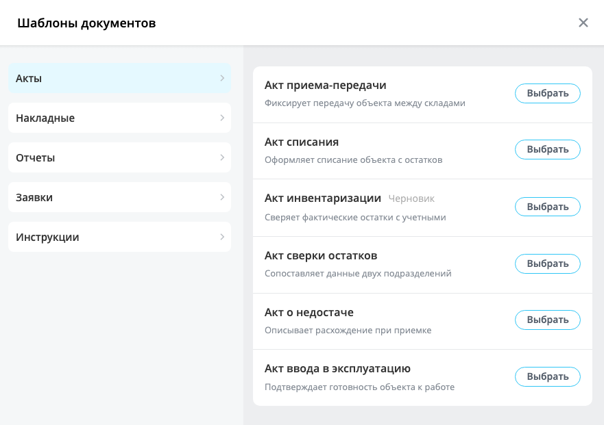

Каталог объектов показывает всплывающее окно с двумя колонками: слева список групп, справа карточки элементов выбранной группы. У каждой карточки есть заголовок, описание и кнопка действия.

Каталог применяют там, где пользователь выбирает один объект из большого набора: шаблон документа, робота для автоматизации, роль помощника. Группы и описания помогают сориентироваться, когда элементов много и по одному названию их не различить.

Расширение только отрисовывает переданные данные и сообщает о действиях пользователя. Запросы к серверу оно не отправляет: обработчики нажатий пишет разработчик.

В Bitrix Framework за каталог объектов отвечает расширение `ui.entity-catalog`. Оно экспортирует класс и два вспомогательных объекта:

-  `EntityCatalog` — сам каталог: хранит группы и элементы, создает окно и перерисовывает содержимое.

-  `Stubs` — готовые заглушки для пустых состояний.

-  `States` — доступ к состоянию каталога: текущая группа, строка поиска, признак примененных фильтров.

{width=881px height=621px}

## Подключить расширение

Если вы подключаете каталог из PHP, загрузите расширение `ui.entity-catalog`.

```php
\Bitrix\Main\UI\Extension::load('ui.entity-catalog');
```

Вместе с расширением подключаются его зависимости: `main.core`, `main.core.events`, `main.popup`, `ui.advice`, `ui.cnt`, `ui.feedback.form`, `ui.forms`, `ui.icons`, `ui.vue3`, `ui.vue3.components.counter`, `ui.vue3.components.hint` и `ui.vue3.pinia`. Загружать их отдельно не нужно.

Если вы работаете в модульном JavaScript, импортируйте класс `EntityCatalog` из `ui.entity-catalog`.

```js
import { EntityCatalog } from 'ui.entity-catalog';
```

Вне модульного JavaScript класс доступен как `BX.UI.EntityCatalog`, а вспомогательные объекты — как `BX.UI.Stubs` и `BX.UI.States`.

Когда каталог нужен не сразу, а по нажатию кнопки, загрузите расширение методом `Runtime.loadExtension()`. Он возвращает промис с экспортами расширения.

**Пример.** Расширение загружается в момент открытия каталога, а не вместе со страницей.

```js
import { Runtime } from 'main.core';

const { EntityCatalog } = await Runtime.loadExtension('ui.entity-catalog');
```

Серверной части у расширения нет: ни класса, ни компонента. Группы и элементы разработчик готовит сам и передает в JavaScript.

## Собрать каталог объектов

Чтобы показать каталог, выполните основные действия:

1. Создайте экземпляр `EntityCatalog`. Передайте группы в параметре `groups`, а элементы — в параметре `items`.

2. Свяжите элементы с группами. Каждый элемент перечисляет идентификаторы своих групп в поле `groupIds`.

3. Вызовите метод `show()`. Он собирает содержимое каталога и показывает окно.

**Пример.** Каталог шаблонов документов открывается с двумя группами и тремя шаблонами. Группа «Акты» выбрана заранее, поэтому пользователь сразу видит ее содержимое.

```js
import { EntityCatalog } from 'ui.entity-catalog';

const catalog = new EntityCatalog({
    title: 'Шаблоны документов',
    groups: [
        { id: 'acts', name: 'Акты', selected: true },
        { id: 'invoices', name: 'Накладные' },
    ],
    items: [
        {
            id: 'act-transfer',
            title: 'Акт приема-передачи',
            description: 'Фиксирует передачу объекта между складами',
            groupIds: ['acts'],
        },
        {
            id: 'act-writeoff',
            title: 'Акт списания',
            description: 'Оформляет списание объекта с остатков',
            groupIds: ['acts'],
        },
        {
            id: 'invoice-internal',
            title: 'Внутренняя накладная',
            description: 'Перемещение между подразделениями',
            groupIds: ['invoices'],
        },
    ],
});

catalog.show();
```

Поле `selected` в примере избавляет пользователя от лишнего шага. Без него каталог откроется с пустой правой колонкой и будет ждать, пока пользователь выберет группу сам.

Метод `show()` каждый раз собирает содержимое заново по текущим группам и элементам, поэтому между вызовами их можно менять.

## Передать параметры

Все параметры конструктора необязательны, кроме самого объекта параметров: без него конструктор завершится ошибкой. Если параметр не передан, каталог использует значение по умолчанию.

```ts
type EntityCatalogOptions = {
    groups?: Array;
    items?: Array;
    canDeselectGroups?: boolean;
    showEmptyGroups?: boolean;
    showSearch?: boolean;
    filterOptions?: Object;
    popupOptions?: PopupOptions;
    title?: string;
    customTitleBar?: string | Element;
    slots?: Object;
    customComponents?: Object;
    events?: Object;
};
```

#|
|| **Параметр** | **Тип** | **Описание** ||
|| `groups` | `Array` | Задает группы каталога. Принимает как плоский список групп, так и массив блоков. По умолчанию пустой массив ||
|| `items` | `Array` | Задает элементы каталога. Каталог показывает те из них, чье поле `groupIds` содержит идентификатор выбранной группы. По умолчанию пустой массив ||
|| `canDeselectGroups` | `boolean` | Задает поле `deselectable` сразу всем группам и перебивает их собственные значения. Со значением `false` повторное нажатие не снимает выбор группы. По умолчанию значение не задано, и каждая группа решает сама ||
|| `showEmptyGroups` | `boolean` | Показывает группы, для которых не передано ни одного элемента. Со значением `false` каталог скрывает такие группы, кроме заголовочных. По умолчанию `false` ||
|| `showSearch` | `boolean` | Добавляет в шапку окна поле поиска по элементам. По умолчанию `false` ||
|| `filterOptions` | `Object` | Задает фильтры объектом с полями `filterItems` и `multiple`. По умолчанию фильтров нет ||
|| `popupOptions` | `PopupOptions` | Задает настройки окна. Каталог накладывает их поверх своих значений по умолчанию ||
|| `title` | `string` | Задает заголовок окна. Каталог экранирует значение перед выводом. По умолчанию пустая строка ||
|| `customTitleBar` | `string` \| `Element` | Задает свой заголовок вместо простого текста: строка разбирается как разметка, DOM-узел вставляется как есть. Отменяет действие параметра `title`. По умолчанию значение не задано ||
|| `slots` | `Object` | Задает свою разметку для частей каталога. Ключ — константа слота, значение — строка шаблона. По умолчанию пустой объект ||
|| `customComponents` | `Object` | Регистрирует компоненты, которые используются в шаблонах слотов. По умолчанию пустой объект ||
|| `events` | `Object` | Задает обработчики событий каталога. Ключ — имя события, значение — функция. По умолчанию обработчиков нет ||
|#

## Описать группу

Каждую группу задают объектом данных, а каталог выводит группы списком в левой колонке. Идентификатор группы он сопоставляет с полем `groupIds` элементов и показывает справа подходящие карточки.

#|
|| **Поле** | **Тип** | **Описание** ||
|| `id` | `number` \| `string` | Задает идентификатор группы. Каталог сравнивает его со значениями из поля `groupIds` элементов строго, поэтому типы в обоих полях должны совпадать ||
|| `name` | `string` | Задает название группы. Каталог показывает его в списке групп ||
|| `icon` | `string` | Задает значок группы разметкой, например тегом `svg`. Каталог вставляет значение как HTML, поэтому не передавайте в это поле данные пользователя. По умолчанию значок не показывается ||
|| `tags` | `Array` | Каталог это поле не читает. Теги для поиска задают у элемента ||
|| `adviceTitle` | `string` | Задает текст подсказки над списком элементов. Каталог показывает подсказку, только когда группа выбрана и поиск не идет. По умолчанию подсказки нет ||
|| `adviceAvatar` | `string` | Задает адрес картинки рядом с текстом подсказки. По умолчанию каталог берет свою картинку ||
|| `customData` | `Object` | Хранит произвольные данные группы. Из них каталог читает поле `counterValue` для счетчика. По умолчанию пустой объект ||
|| `deselectable` | `boolean` | Разрешает снять выбор группы повторным нажатием. По умолчанию `true` ||
|| `selected` | `boolean` | Помечает группу выбранной при открытии каталога. Каталог берет первую такую группу и показывает ее содержимое сразу. По умолчанию `false` ||
|| `disabled` | `boolean` | Меняет оформление группы на неактивное. Нажатие при этом работает: чтобы запретить выбор, не передавайте такую группу в каталог. По умолчанию `false` ||
|| `compare` | `Function` | Задает порядок элементов внутри группы. Каталог передает функцию в сортировку массива, поэтому она принимает два элемента и возвращает число. По умолчанию порядок совпадает с порядком в параметре `items` ||
|| `isHeaderGroup` | `boolean` | Выносит группу в отдельный список над основными группами. По умолчанию `false` ||
|#

**Пример.** Значок группы задан встроенным тегом `svg`.

```js
const group = {
    id: 'acts',
    name: 'Акты',
    icon: '<svg width="20" height="20" viewBox="0 0 20 20"><circle cx="10" cy="10" r="8" fill="#2fc6f6"/></svg>',
};
```

Подсказку над списком элементов каталог рисует расширением `ui.advice` — это блок с текстом и аватаром рядом. Достаточно заполнить поле `adviceTitle`.

## Описать элемент

Карточка в правой колонке — это и есть то, что выбирает пользователь. Каталог собирает ее из полей объекта данных.

#|
|| **Поле** | **Тип** | **Описание** ||
|| `id` | `number` \| `string` | Задает идентификатор элемента. По нему метод `updateItemById()` находит элемент для обновления ||
|| `title` | `string` | Задает заголовок карточки. По этому полю каталог ищет элементы ||
|| `subtitle` | `string` | Задает короткую метку рядом с заголовком. По умолчанию метки нет ||
|| `groupIds` | `Array` | Задает группы, в которых показывается элемент. Один элемент может принадлежать нескольким группам ||
|| `description` | `string` | Задает описание под заголовком. По нему каталог тоже ищет элементы ||
|| `tags` | `Array` | Задает теги для поиска. Каталог сравнивает тег со строкой запроса целиком, без поиска по части слова. По умолчанию тегов нет ||
|| `button` | `Object` | Задает кнопку карточки. Без этого поля каталог все равно рисует кнопку, но нажатие на нее ничего не делает ||
|| `customData` | `Object` | Хранит произвольные данные элемента. Из них каталог читает поле `topText` и показывает его строкой над заголовком. По умолчанию пустой объект ||
|#

Кнопку карточки описывают объектом из трех полей.

#|
|| **Поле `button`** | **Тип** | **Описание** ||
|| `text` | `string` | Задает надпись на кнопке. По умолчанию каталог подставляет «Добавить» ||
|| `action` | `Function` | Задает обработчик нажатия. Без него нажатие ничего не делает ||
|| `locked` | `boolean` | Рисует на кнопке значок замка. Нажатие при этом работает, поэтому проверку доступа выполняйте в обработчике. По умолчанию `false` ||
|#

## Обработать выбор элемента

О выборе элемента каталог не сообщает событием. Пользователь нажимает кнопку карточки, и каталог вызывает функцию из поля `button.action`.

Обработчик получает объект события с двумя полями: в поле `eventData` лежат данные элемента, в поле `originalEvent` — исходное событие нажатия. Каталог после нажатия не закрывается, поэтому закрывайте его сами вызовом `close()`.

**Пример.** Обработчик сохраняет выбранный шаблон и закрывает каталог. Элемент с признаком `locked` показывает сообщение о недоступности.

```js
const item = {
    id: 'act-writeoff',
    title: 'Акт списания',
    description: 'Оформляет списание объекта с остатков',
    groupIds: ['acts'],
    button: {
        text: 'Выбрать',
        locked: isTemplateLocked,
        action: (event) => {
            if (isTemplateLocked)
            {
                showLockedNotice();

                return;
            }

            applyTemplate(event.getData().eventData.id);
            catalog.close();
        },
    },
};
```

## Разбить группы на блоки

Параметр `groups` принимает не только плоский список. Массив блоков разводит группы по отдельным спискам, между которыми остается отступ.

**Пример.** Первый блок содержит действующие типы документов, второй отделяет от них архив.

```js
const catalog = new EntityCatalog({
    groups: [
        [
            { id: 'acts', name: 'Акты' },
            { id: 'invoices', name: 'Накладные' },
        ],
        [
            { id: 'archive', name: 'Архив' },
        ],
    ],
    items: documentTemplates,
});
```

Отдельно от блоков работает поле `isHeaderGroup`. Оно поднимает группу в верхний список над основными группами, и это происходит независимо от того, в каком блоке группа лежит. У заголовочных групп есть еще одно отличие: параметр `showEmptyGroups` на них не действует, и каталог показывает их даже без элементов.

Остальные группы без элементов каталог по умолчанию скрывает. Чтобы показывать все группы, передайте параметр `showEmptyGroups` со значением `true`.

## Показать счетчик на группе

Справа от названия группы каталог может показать цветную метку с числом. Значение он берет из поля `customData.counterValue` и выводит метку, только если это целое число больше нуля.

**Пример.** Группа «Недавние» открывается со счетчиком новых шаблонов.

```js
const group = {
    id: 'recent',
    name: 'Недавние',
    isHeaderGroup: true,
    customData: {
        counterValue: 3,
    },
};
```

Когда каталог уже открыт, меняйте счетчик методом `updateGroupCounter()`. Он принимает идентификатор группы и новое значение. Ноль скрывает метку.

```js
catalog.updateGroupCounter('recent', 0);
```

## Собрать группу «Недавние»

Готовой группы недавних элементов у каталога нет. Соберите ее как обычную группу: пометьте полем `isHeaderGroup`, храните идентификаторы последних выбранных элементов на своей стороне и добавляйте идентификатор группы в поле `groupIds` этих элементов.

Порядок внутри группы задает функция `compare`. Каталог передает ее в сортировку массива элементов.

**Пример.** Функция расставляет элементы по порядку, который хранится в карте недавних.

```js
const recentGroup = {
    id: 'recent',
    name: 'Недавние',
    isHeaderGroup: true,
    compare: (firstItem, secondItem) => {
        return (recentSort.get(firstItem.id) ?? 0) - (recentSort.get(secondItem.id) ?? 0);
    },
};
```



Параметры конструктора `recentGroupData` и `showRecentGroup` оставлены для совместимости со старым кодом. Они продолжают работать: каталог собирает из `recentGroupData` заголовочную группу и ставит ее первой. В новом коде используйте обычную группу с полем `isHeaderGroup` — она принимает те же поля и не зависит от отдельной ветки в конструкторе.



## Включить поиск

Параметр `showSearch` добавляет в шапку окна поле поиска. Пользователь нажимает на значок, поле раскрывается, и каталог ищет через 255 миллисекунд после последнего нажатия клавиши.

Поиск идет по всем элементам каталога, а не только по выбранной группе. Поэтому при вводе запроса каталог снимает выбор группы, а при выборе группы очищает поле поиска.

Совпадение каталог ищет по трем полям элемента.

#|
|| **Поле** | **Как сравнивается** ||
|| `title` | По части строки, без учета регистра ||
|| `description` | По части строки, без учета регистра ||
|| `tags` | Целиком: тег должен совпасть со строкой запроса полностью ||
|#

Если ничего не нашлось, каталог показывает готовую заглушку. Свой текст для нее задают слотом `SLOT_MAIN_CONTENT_SEARCH_NOT_FOUND`.

## Отфильтровать элементы

Кнопка фильтра появляется в шапке окна, когда задан хотя бы один вариант. По нажатию она открывает меню, где каждый вариант описан функцией проверки элемента.

Фильтры задают параметром `filterOptions`. Поле `filterItems` принимает список вариантов, поле `multiple` разрешает применять несколько вариантов сразу. Со значением `false` новый выбранный вариант отменяет предыдущий.

#|
|| **Поле варианта** | **Тип** | **Описание** ||
|| `id` | `string` | Задает идентификатор варианта. По нему каталог хранит примененные фильтры ||
|| `text` | `string` | Задает подпись пункта меню. Каталог экранирует значение перед выводом ||
|| `action` | `Function` | Проверяет элемент и возвращает `true`, если его нужно показать ||
|| `applied` | `boolean` | Применяет вариант сразу при открытии каталога ||
|#

**Пример.** Два варианта делят шаблоны на действующие и архивные, и одновременно работает только один.

```js
const catalog = new EntityCatalog({
    groups: documentGroups,
    items: documentTemplates,
    filterOptions: {
        multiple: false,
        filterItems: [
            {
                id: 'active',
                text: 'Действующие',
                action: (item) => item.customData?.archived === false,
                applied: true,
            },
            {
                id: 'archived',
                text: 'Архивные',
                action: (item) => item.customData?.archived === true,
                applied: false,
            },
        ],
    },
});
```

В меню фильтра каталог всегда добавляет пункт «Сброс фильтра». Он снимает все примененные варианты.

Фильтры работают вместе с поиском: каталог сначала отбирает элементы по строке запроса, затем применяет к результату функции фильтров.

## Настроить окно каталога

Окно каталога — это всплывающее окно расширения [main.popup](./main-popup.md). Параметр `popupOptions` принимает те же настройки и накладывает их поверх значений каталога.

#|
|| **Настройка** | **Значение по умолчанию** | **Что задает** ||
|| `width` и `minWidth` | `881` | Ширину окна в пикселях ||
|| `height` и `minHeight` | `621` | Высоту окна в пикселях ||
|| `contentBackground` | `#edeef0` | Цвет фона содержимого ||
|| `closeByEsc` | `true` | Закрытие окна клавишей Esc ||
|| `draggable` | `true` | Перетаскивание окна мышью ||
|| `autoHide` | `false` | Закрытие окна по нажатию вне его границ ||
|#

Размер окна каталог всегда разрешает менять мышью, а значения `minWidth` и `minHeight` не дают уменьшить его сверх заданного предела.

**Пример.** Настройка `overlay` включает затемнение под окном, а обработчик `onPopupClose` срабатывает при его закрытии.

```js
const catalog = new EntityCatalog({
    title: 'Шаблоны документов',
    groups: documentGroups,
    items: documentTemplates,
    popupOptions: {
        overlay: true,
        width: 900,
        events: {
            onPopupClose: () => {
                saveCatalogState();
            },
        },
    },
});
```

Заголовок окна задают параметром `title`. Если простого текста мало, передайте в параметре `customTitleBar` разметку строкой или готовый DOM-узел — он встанет вместо заголовка, а поле поиска, кнопка фильтра и кнопка закрытия останутся на своих местах.

Метод `getPopup()` возвращает объект окна. Через него подписываются на события окна и обращаются к его методам.

```js
catalog.getPopup().subscribe('onAfterShow', () => {
    sendOpenAnalytics();
});
```

## Расширить каталог своим кодом

Каталог собран на Vue 3 — библиотеке для сборки интерфейса из компонентов. Почти любую его часть можно заменить своей разметкой, а своему компоненту — дать доступ к состоянию каталога.

### Заменить части каталога своими компонентами

Части каталога заменяют через слоты. Параметр `slots` принимает объект, где ключ — константа класса `EntityCatalog`, а значение — строка с шаблоном Vue.

#|
|| **Константа** | **Какую часть заменяет** ||
|| `SLOT_GROUP_LIST_HEADER` | Область над списком групп ||
|| `SLOT_GROUP` | Группу в списке целиком ||
|| `SLOT_GROUP_LIST_FOOTER` | Область под списком групп ||
|| `SLOT_MAIN_CONTENT_HEADER` | Область над списком элементов ||
|| `SLOT_MAIN_CONTENT_FOOTER` | Область под списком элементов ||
|| `SLOT_MAIN_CONTENT_ITEM` | Карточку элемента целиком ||
|| `SLOT_MAIN_CONTENT_WELCOME_STUB` | Приветственную заглушку до первого выбора группы ||
|| `SLOT_MAIN_CONTENT_NO_SELECTED_GROUP_STUB` | Заглушку, когда группа не выбрана ||
|| `SLOT_MAIN_CONTENT_EMPTY_GROUP_STUB` | Заглушку пустой группы ||
|| `SLOT_MAIN_CONTENT_EMPTY_GROUP_STUB_TITLE` | Только текст заглушки пустой группы ||
|| `SLOT_MAIN_CONTENT_SEARCH_STUB` | Заглушку, когда поиск ничего не нашел ||
|| `SLOT_MAIN_CONTENT_SEARCH_NOT_FOUND` | Только текст заглушки поиска ||
|| `SLOT_MAIN_CONTENT_FILTERS_STUB` | Заглушку, когда фильтры скрыли все элементы ||
|| `SLOT_MAIN_CONTENT_FILTERS_STUB_TITLE` | Только текст заглушки фильтров ||
|#

Слот карточки получает данные элемента в переменной `itemSlotProps`, слот группы — данные группы и обработчик нажатия в переменной `groupSlotProps`. Если вы заменяете группу в списке целиком, повесьте на свою разметку `groupSlotProps.handleClick`: без него выбор группы работать не будет.

**Пример.** Группа в списке заменена своей разметкой, и нажатие по ней по-прежнему выбирает группу.

```js
slots: {
    [EntityCatalog.SLOT_GROUP]: `
        <li class="document-catalog__group" @click="groupSlotProps.handleClick">
            {{ groupSlotProps.groupData.name }}
        </li>
    `,
},
```

Свои компоненты регистрируют параметром `customComponents`. Каталог добавляет их в приложение, и после этого их можно вызывать в шаблонах слотов.

**Пример.** Карточка элемента заменена своим компонентом, которому передаются произвольные данные элемента.

```js
const catalog = new EntityCatalog({
    groups: documentGroups,
    items: documentTemplates,
    customComponents: {
        TemplatePreview,
    },
    slots: {
        [EntityCatalog.SLOT_MAIN_CONTENT_ITEM]: '<TemplatePreview :item="itemSlotProps.itemData" />',
        [EntityCatalog.SLOT_MAIN_CONTENT_HEADER]: '<div class="document-catalog__hint">Выберите шаблон документа</div>',
    },
});
```



Значение слота каталог подставляет в шаблон как разметку и выполняет ее. Не собирайте строку слота из данных, которые пришли от пользователя или с сервера: экранирования в этом месте нет. Передавайте такие данные через поле `customData` элемента и выводите их внутри своего компонента.



Кроме своих компонентов, в шаблонах слотов доступны два готовых инструмента. Компонент `Hint` рисует значок со всплывающей подсказкой: текст задают свойством `text`, сторону появления — свойством `position`. Директива `v-feedback` открывает форму обратной связи по нажатию и принимает параметры формы значением.

**Пример.** Под списком элементов встает значок подсказки, а всплывающий текст появляется сверху от него.

```js
slots: {
    [EntityCatalog.SLOT_MAIN_CONTENT_FOOTER]: '<Hint text="Шаблон подставится в новый документ" position="top" />',
},
```

Подробнее о работе с Vue в Bitrix Framework читайте в статье [Vue.js](../advanced/vue.md).

### Показать свою заглушку

Когда показать справа нечего, каталог выбирает одно из пяти состояний и отдает его слоту. Проверка идет сверху вниз, работает первое подходящее состояние.

#|
|| **Порядок** | **Состояние** | **Слот** | **Что видно без слота** ||
|| 1 | Группа не выбрана, и пользователь еще ни разу ее не выбирал | `SLOT_MAIN_CONTENT_WELCOME_STUB` | Ничего ||
|| 2 | Группа не выбрана, поиск не идет | `SLOT_MAIN_CONTENT_NO_SELECTED_GROUP_STUB` | Ничего ||
|| 3 | Фильтры скрыли все элементы группы | `SLOT_MAIN_CONTENT_FILTERS_STUB` | Рамка со значком и текстом из слота `SLOT_MAIN_CONTENT_FILTERS_STUB_TITLE` ||
|| 4 | Поиск идет, совпадений нет | `SLOT_MAIN_CONTENT_SEARCH_STUB` | Рамка со значком и текстом «По вашему запросу ничего не найдено» ||
|| 5 | Группа выбрана, но элементов в ней нет | `SLOT_MAIN_CONTENT_EMPTY_GROUP_STUB` | Рамка со значком без текста ||
|#

Первые два состояния своего оформления не имеют: пока вы не передали слот, правая колонка остается пустой.

Заглушку фильтров каталог показывает, только когда задан слот `SLOT_MAIN_CONTENT_FILTERS_STUB_TITLE`. Без него отработает следующее подходящее состояние.

Если менять нужно только текст, берите слоты, у которых в таблице слотов указано «Только текст». Каталог подставит значение в свою рамку со значком, и свой компонент не понадобится.

**Пример.** Пустая группа сообщает, что шаблонов этого типа еще нет.

```js
slots: {
    [EntityCatalog.SLOT_MAIN_CONTENT_EMPTY_GROUP_STUB_TITLE]: 'Шаблонов этого типа пока нет',
},
```

Когда заглушку собирают своим компонентом, ту же рамку со значком берут из объекта `Stubs`: он отдает ее компонентом `EmptyContent`.

### Читать состояние каталога

Свой компонент внутри слота не получает состояние каталога через параметры. Объект `States` отдает функцию `useGlobalState` — хранилище, из которого компонент читает текущее состояние.

#|
|| **Поле состояния** | **Тип** | **Что содержит** ||
|| `currentGroup` | `Object` | Данные выбранной группы. Содержит `null`, если группа не выбрана ||
|| `searchQuery` | `string` | Строку поиска в нижнем регистре. Содержит пустую строку, когда поиска нет ||
|| `searchApplied` | `boolean` | Признак того, что поиск идет ||
|| `filtersApplied` | `boolean` | Признак того, что применен хотя бы один фильтр ||
|| `shouldShowWelcomeStub` | `boolean` | Признак того, что приветственная заглушка еще не скрыта ||
|#

**Пример.** Заглушка пустой группы показывает разный текст для группы недавних и для остальных групп.

```js
import { Stubs, States } from 'ui.entity-catalog';
import { mapState } from 'ui.vue3.pinia';

export const EmptyTemplatesStub = {
    name: 'empty-templates-stub',
    components: {
        EmptyContent: Stubs.EmptyContent,
    },
    computed: {
        isRecentGroup()
        {
            return this.currentGroup?.id === 'recent';
        },
        ...mapState(States.useGlobalState, ['currentGroup']),
    },
    template: `
        <EmptyContent>
            <span v-if="isRecentGroup">Вы еще не выбирали шаблоны</span>
            <span v-else>Шаблонов этого типа пока нет</span>
        </EmptyContent>
    `,
};
```

Готовый компонент зарегистрируйте в параметре `customComponents` и вызовите в нужном слоте.

```js
const catalog = new EntityCatalog({
    groups: documentGroups,
    items: documentTemplates,
    customComponents: {
        EmptyTemplatesStub,
    },
    slots: {
        [EntityCatalog.SLOT_MAIN_CONTENT_EMPTY_GROUP_STUB]: '<EmptyTemplatesStub />',
    },
});
```

## Обновить данные каталога

Данные каталога меняют и после создания: элементы приходят с сервера, счетчики растут, состав групп зависит от действий пользователя. Методы изменения работают всегда, но перерисовывают открытый каталог по-разному.

#|
|| **Метод** | **Описание** ||
|| `setGroups(groups)` | Заменяет группы каталога и возвращает сам каталог. Если набор идентификаторов и их порядок не изменились, метод обновит только счетчики, а остальные поля групп останутся прежними ||
|| `setItems(items)` | Заменяет элементы каталога и возвращает сам каталог. Список открытой группы при этом не перерисовывается ||
|| `getItems()` | Возвращает массив элементов каталога ||
|| `updateItemById(id, patch)` | Меняет поля одного элемента и сразу перерисовывает его карточку. Если элемента с таким идентификатором нет, метод добавит новый. Возвращает сам каталог ||
|| `updateGroupCounter(groupId, counterValue)` | Меняет счетчик группы у открытого каталога и возвращает сам каталог. Ноль скрывает метку ||
|| `selectGroup(groupId)` | Выбирает группу и показывает ее элементы. Работает только у открытого каталога: до вызова `show()` метод ничего не делает. Возвращает сам каталог ||
|#

Самый надежный порядок — получить данные с сервера и только потом открыть каталог.

**Пример.** Каталог открывается, когда шаблоны уже загружены.

```js
loadTemplates().then((templates) => {
    catalog.setItems(templates);
    catalog.show();
});
```



Метод `setItems()` меняет данные каталога, но не перерисовывает список открытой группы: метод `getItems()` вернет новый набор, а на экране останется прежний. Новые элементы появятся, когда пользователь перейдет в другую группу или когда каталог откроют заново. Чтобы изменение было видно сразу, меняйте элементы поштучно методом `updateItemById()`.



**Пример.** Шаблон помечается архивным. Метод принимает идентификатор элемента и объект с новыми значениями полей.

```js
catalog.updateItemById('act-writeoff', {
    customData: { archived: true },
});
```

## Закрыть каталог

Метод `close()` закрывает окно и удаляет содержимое каталога. Метод `isShown()` сообщает, открыто ли окно сейчас.

Отдельных методов скрытия и уничтожения у каталога нет: метод `close()` выполняет обе задачи.



Метод `close()` удаляет объект окна вместе с подписками на его события. После закрытия метод `getPopup()` вернет новое окно, а обработчики, добавленные через `getPopup().subscribe()`, работать не будут. Подписывайтесь на события окна заново после каждого вызова `show()` или задавайте обработчики в параметре `popupOptions.events` — их каталог применяет при создании окна.



## Подписаться на события

Каталог бросает события через `EventEmitter` из расширения `main.core.events`. Пространство имен событий — `BX.UI.EntityCatalog`.

#|
|| **Событие** | **Когда срабатывает** | **Данные события** ||
|| `onItemsRendered` | После того, как каталог отрисовал новый набор элементов: при выборе группы, вводе запроса и применении фильтра | Нет ||
|#

Обработчики задают в параметре `events` конструктора.

```js
const catalog = new EntityCatalog({
    groups: documentGroups,
    items: documentTemplates,
    events: {
        onItemsRendered: () => {
            trackVisibleTemplates();
        },
    },
});
```

Тот же обработчик добавляют методом `subscribe()` уже созданному каталогу.

```js
catalog.subscribe('onItemsRendered', () => {
    trackVisibleTemplates();
});
```

Других событий у каталога нет. Выбор элемента обрабатывают функцией `button.action`, а выбранную группу читают из состояния каталога.

## Связанные материалы

-  [Всплывающие окна и меню main.popup](./main-popup.md) — окно каталога и меню фильтра.

-  [Диалог выбора объектов ui.entity-selector](./entity-selector/index.md) — выбор объектов через провайдеры данных.

-  [Vue.js](../advanced/vue.md) — компоненты и шаблоны для слотов каталога.

-  [Иконки](./icons.md) — наборы значков для поля `icon` группы.

-  [Расширения](../framework/extensions.md) — подключение JavaScript-расширений Bitrix Framework.
