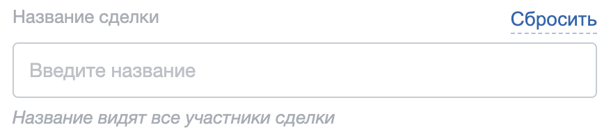
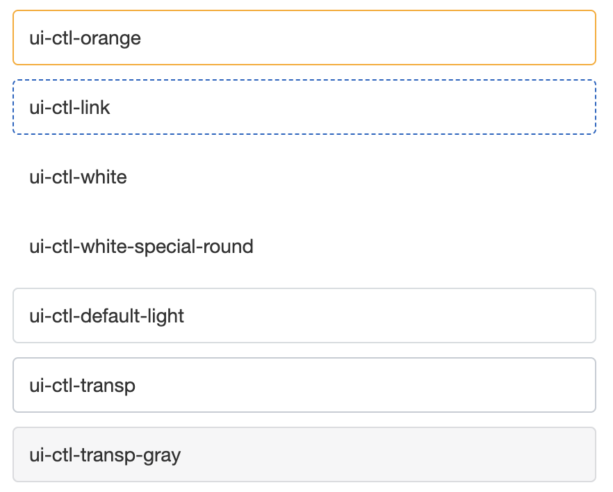
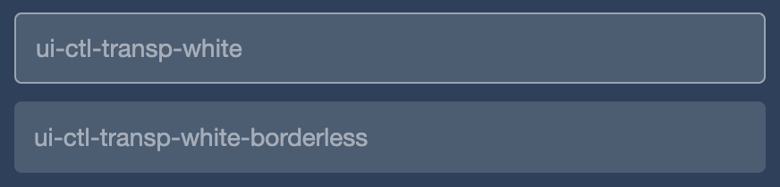
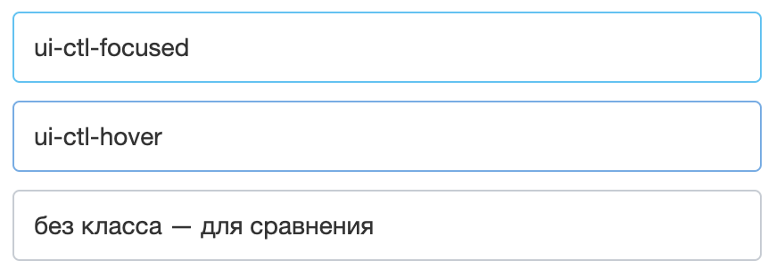
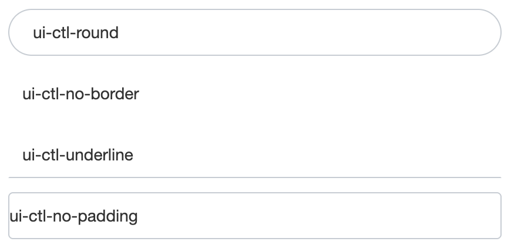
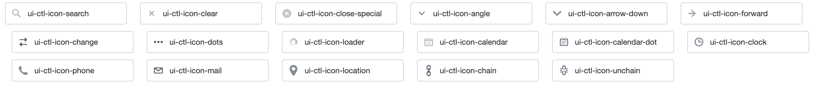
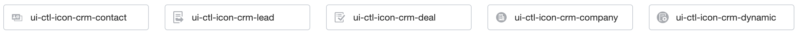

Расширение `ui.forms` оформляет поля ввода в интерфейсе Bitrix Framework: текстовые поля, списки, многострочные поля, поля даты и времени, выбор файла, флажки и переключатели.

Расширение состоит только из таблицы стилей. Разметку пишет разработчик: он размещает обычные теги `input`, `select` или `textarea`, оборачивает их в контейнер и добавляет классы семейства `ui-ctl`. Поведение поля — открытие календаря, очистку значения, проверку данных — тоже реализует разработчик.

Используйте `ui.forms`, когда форму формирует шаблон компонента, страница модуля или собственный HTML.

## Выбрать между ui.forms и системным полем ввода

Поле ввода в Bitrix Framework оформляют два расширения, и критерий выбора один — кто создает разметку.

Расширение `ui.forms` дает только классы и не задает структуру DOM. Поле остается обычной разметкой, поэтому его можно собрать в шаблоне и отдать с сервера.

Расширение [системного поля ввода](./system-input.md) создает разметку само. Возьмите его, если поле строит JavaScript и нужны готовые состояния и действия: подпись, текст ошибки, кнопка очистки, показ пароля, копирование значения.

## Подключить расширение

Если вы подключаете поля из PHP, загрузите расширение `ui.forms`.

```php
\Bitrix\Main\UI\Extension::load('ui.forms');
```

JavaScript-модуля у расширения нет, поэтому импортировать из `ui.forms` нечего.

Вместе с расширением подключаются его зависимости: дизайн-токены `ui.design-tokens` и шрифт `ui.fonts.opensans`. Загружать их отдельно не нужно.

Проверить подключение можно по внешнему виду поля: если поле выводится без рамки, отступов и заданной высоты, значит стили расширения на страницу не попали.

## Собрать поле

Поле состоит из двух частей. Класс `ui-ctl` задает обертку, которая отвечает за размер и положение поля. Класс `ui-ctl-element` задает элемент ввода, который получает рамку, фон и текст.

Минимальная разметка текстового поля выглядит так.

```html
<div class="ui-ctl">
    <input type="text" class="ui-ctl-element" placeholder="Название">
</div>
```

Без дополнительных классов поле получает ширину 320 пикселей и высоту 40 пикселей. При наведении и в фокусе рамка меняет цвет на синий. Два поля, которые идут подряд, разделяет отступ 12 пикселей.

Класс `ui-ctl-element` ставят на теги `input`, `select`, `textarea`, а также на `div` с атрибутом `contenteditable`. Размещайте элемент внутри обертки `ui-ctl`: правила размеров, иконок и состояний рассчитаны на эту пару. Остальные классы — размер, ширину, оформление, состояние и тип поля — ставят на обертку, а не на элемент ввода.

В коде платформы у текстового поля часто стоит дополнительный класс `ui-ctl-textbox`. Он отмечает тип поля, но правил для него в `ui.forms` нет — оформление задают только `ui-ctl` и `ui-ctl-element`.

### Добавить подпись и подсказку

Подпись, заголовок и текст под полем находятся вне обертки `ui-ctl`. Их размещает внешний контейнер, который выстраивает заголовок, поле и подсказку в колонку.

-  `ui-ctl-container` — внешний контейнер поля.

-  `ui-ctl-top` — строка над полем. Элементы строки расходятся по краям, поэтому в ней помещают и заголовок, и ссылку с действием.

-  `ui-ctl-title` — заголовок поля в верхней строке.

-  `ui-ctl-control` — элемент управления в верхней строке, например ссылка «Сбросить». Модификатор `--ui-ctl__link` делает его синей пунктирной ссылкой, модификатор `--ui-ctl__link-gray` — серой.

-  `ui-ctl-bottom` — подсказка под полем. Текст выводится курсивом.

-  `ui-ctl-label-text` — подпись, которую размещают внутри обертки `ui-ctl` рядом с элементом ввода.

Вместе эти классы дают поле с заголовком, действием и подсказкой.

```html
<div class="ui-ctl-container">
    <div class="ui-ctl-top">
        <div class="ui-ctl-title">Название сделки</div>
        <span class="ui-ctl-control --ui-ctl__link">Сбросить</span>
    </div>
    <div class="ui-ctl ui-ctl-w100">
        <input type="text" class="ui-ctl-element" placeholder="Введите название">
    </div>
    <div class="ui-ctl-bottom">Название видят все участники сделки</div>
</div>
```

{width=878px height=190px}

Заголовок и действие расходятся по краям верхней строки, а подсказка выводится под полем курсивом.

### Добавить метку на рамку поля

Класс `ui-ctl-tag` дает метку, которая ложится на верхнюю рамку поля у правого края. Метку размещают внутри обертки `ui-ctl`, а не в контейнере: расширение позиционирует ее относительно обертки. В коде платформы так подписывают поле в диалогах на одну строку, где для заголовка `ui-ctl-title` нет места.

Метка выводится синим прямоугольником с белым текстом в верхнем регистре. Цвет меняют два модификатора: `--tag_light-blue` дает светло-синий фон с темным текстом, `--tag_light` — почти белый фон с серым текстом. Клики метка не принимает и пропускает их к полю.

```html
<div class="ui-ctl ui-ctl-w100">
    <div class="ui-ctl-tag">Ссылка на изображение</div>
    <input type="text" class="ui-ctl-element" placeholder="https://">
</div>
```

С классом `ui-ctl-ext-before-icon` на обертке метка отступает от правого края дальше — на 50 пикселей вместо 12.

### Расположить поля

Обертка `ui-ctl` по умолчанию выстраивает содержимое в колонку и занимает всю доступную строку. Раскладку меняют отдельные классы.

-  `ui-ctl-row` — содержимое обертки идет в строку в том порядке, в котором оно записано в разметке. Подпись `ui-ctl-label-text` получает боковые отступы 10 пикселей. Два соседних поля с этим классом разделяет отступ сверху 12 пикселей.

-  `ui-ctl-column` — содержимое обертки идет в колонку.

-  `ui-ctl-inline` — поле встает в строку с соседними элементами и занимает ширину по содержимому. Соседние поля с этим классом разделяет отступ 10 пикселей.

-  `ui-ctl-block` — поле снова становится блочным. Класс возвращает `display: flex`, но ширину не восстанавливает: если до него стоял `ui-ctl-inline`, ширина по содержимому сохранится. Задайте ее классом ширины.

-  `ui-ctl-custom` — поле занимает ширину по содержимому без других изменений.

Отступы между несколькими полями задают на их общем контейнере, а не на самих полях. Класс `ui-ctl-spacing-right` добавляет отступ справа у всех вложенных полей, кроме последнего. Класс `ui-ctl-spacing-left` добавляет отступ слева у всех, кроме первого.

Отступ работает, когда поля лежат внутри такого контейнера.

```html
<div class="my-form-row ui-ctl-spacing-right">
    <div class="ui-ctl ui-ctl-w50">
        <input type="text" class="ui-ctl-element" placeholder="Номер документа">
    </div>
    <div class="ui-ctl ui-ctl-w50">
        <input type="text" class="ui-ctl-element" placeholder="Тип документа">
    </div>
</div>
```

Саму раскладку контейнера — строку, сетку или колонку — задает ваш класс, в примере это `my-form-row`. Расширение отвечает только за отступы между полями. Размер отступа меняют на контейнере через переменную `--ui-field-spacing`.

Если форме нужна готовая сетка из строк с подписями слева, ее задает отдельное расширение `ui.layout-form`. Оно зависит от `ui.forms` и добавляет классы строк, подписей и секций формы.

## Задать размер и ширину

Высота и ширина поля не связаны между собой: высоту выбирают из четырех фиксированных размеров, ширину — из набора долей строки.

### Высота

Класс высоты меняет и элемент ввода, и размер служебных областей с иконками.

-  `ui-ctl-lg` — 48 пикселей.

-  `ui-ctl-md` — 40 пикселей. Это высота по умолчанию, поэтому класс нужен только чтобы вернуть стандартный размер, если высота задана выше по дереву.

-  `ui-ctl-sm` — 32 пикселя.

-  `ui-ctl-xs` — 26 пикселей.

Если нужна нестандартная высота, задайте на обертке переменную `--ui-field-size` напрямую. Классы размера меняют именно ее.

### Ширина

Класс ширины задает и `width`, и `max-width`, поэтому перекрывает ширину по умолчанию.

-  `ui-ctl-w100` — вся доступная ширина. Отступ до предыдущего поля обнуляется.

-  `ui-ctl-w75`, `ui-ctl-w50`, `ui-ctl-w33`, `ui-ctl-w25`, `ui-ctl-w10` — доля доступной ширины: 75, 50, 33, 25 и 10 процентов.

-  `ui-ctl-wa` — ширина по содержимому, ограничение по максимальной ширине снимается.

-  `ui-ctl-wd` — стандартная ширина 320 пикселей. Класс возвращает исходное значение, если ширина переопределена.

Доли строки от `ui-ctl-w100` до `ui-ctl-w10` объявлены с `!important`, поэтому своим селектором без `!important` их не перебить. Если нужна другая ширина, задавайте ее на внешнем контейнере. Классы `ui-ctl-wa` и `ui-ctl-wd` объявлены без `!important` — их перебивает любой селектор той же или большей специфичности.

## Настроить оформление

Оформление меняют три группы классов: цвет рамки и фона, форма поля и отключенное состояние. Все они действуют на элемент ввода внутри обертки, поэтому его разметку менять не нужно.

### Цвет рамки и фона

Цветовые классы меняют рамку и фон, чтобы вписать поле в темный или цветной блок. Классы результата проверки `ui-ctl-success` и `ui-ctl-warning` описаны в разделе [Показать ошибку](#show-error).

#|
|| **Класс** | **Оформление** ||
|| `ui-ctl-orange` | Оранжевая рамка. Цвет подсказки под полем класс не меняет ||
|| `ui-ctl-link` | Синяя пунктирная рамка ||
|| `ui-ctl-white` | Белая рамка и белый фон. Поле сливается с белым блоком ||
|| `ui-ctl-white-special-round` | Белая рамка и сильное скругление углов ||
|| `ui-ctl-default-light` | Стандартная рамка и белый фон, оба с прозрачностью 70 процентов ||
|| `ui-ctl-transp` | Стандартная рамка и белый фон с прозрачностью 50 процентов ||
|| `ui-ctl-transp-white` | Белая полупрозрачная рамка, белый текст и полупрозрачная подсказка. Вариант для темного фона ||
|| `ui-ctl-transp-gray` | Серая полупрозрачная рамка и серый полупрозрачный фон ||
|| `ui-ctl-transp-white-borderless` | Полупрозрачный фон и белый текст без рамки. Вариант для темного фона ||
|#

{width=882px height=708px}

Два класса рассчитаны именно на темный фон: `ui-ctl-transp-white` оставляет полупрозрачную рамку, `ui-ctl-transp-white-borderless` убирает ее совсем.

{width=872px height=210px}

Отдельно стоят классы принудительного состояния. Класс `ui-ctl-focused` включает оформление фокуса, классы `ui-ctl-hover` и `ui-ctl-active` — оформление наведения. Их используют, когда курсор или фокус находятся не на самом поле, а на связанном с ним элементе.

{width=870px height=302px}

### Форма поля

Классы формы меняют скругление, рамку и внутренние отступы. Их можно сочетать с цветовыми классами.

-  `ui-ctl-round` — скругление на всю высоту поля и увеличенные боковые отступы.

-  `ui-ctl-no-border` — рамка и фон становятся прозрачными.

-  `ui-ctl-underline` — остается только нижняя граница, скругление снимается.

-  `ui-ctl-no-padding` — боковые внутренние отступы обнуляются. Текст начинается от края поля.

{width=870px height=422px}

### Отключенное и неактивное поле

Отключенное поле получает серый фон, серый текст и курсор `not-allowed`. Многострочное поле в этом состоянии нельзя растянуть.

Задать это оформление можно двумя способами:

-  Атрибут `disabled` у элемента ввода. Способ подходит, когда поле не должно принимать значение и не должно попасть в отправку формы.

-  Класс `ui-ctl-disabled` на обертке. Класс меняет только оформление: ввод он не запрещает и значение из формы не убирает. Способ подходит, когда недоступность зависит от состояния интерфейса, а поле остается рабочим.

Чтобы поле выглядело отключенным и при этом не принимало значение, задайте класс и атрибут вместе.

Класс `ui-ctl-inactive` задает то же состояние, но с другой рамкой и полупрозрачным серым фоном.

## Добавить иконку

Иконку размещают в отдельном элементе внутри обертки `ui-ctl`. Место элемента задает один класс, изображение — второй.

-  `ui-ctl-before` — иконка у левого края поля.

-  `ui-ctl-after` — иконка у правого края поля.

-  `ui-ctl-ext-before` и `ui-ctl-ext-after` — вторая иконка на той же стороне.

Одного класса положения недостаточно: иконка выводится поверх поля и перекрывает текст. Чтобы освободить для нее место, добавьте на обертку класс `ui-ctl-before-icon` или `ui-ctl-after-icon` — они увеличивают внутренний отступ поля со своей стороны. Для второй иконки добавьте `ui-ctl-ext-before-icon` или `ui-ctl-ext-after-icon`. Эти классы объявлены с `!important`, поэтому боковые отступы поля своим селектором не перебить.

Порядок двух иконок на одной стороне различается. Слева у края поля стоит `ui-ctl-before`, а `ui-ctl-ext-before` сдвигается внутрь. Справа наоборот: у края поля стоит `ui-ctl-ext-after`, а `ui-ctl-after` сдвигается внутрь.

Поле поиска с иконкой слева и кнопкой очистки справа собирают так.

```html
<div class="ui-ctl ui-ctl-before-icon ui-ctl-after-icon">
    <div class="ui-ctl-before ui-ctl-icon-search"></div>
    <input type="text" class="ui-ctl-element" placeholder="Поиск">
    <button type="button" class="ui-ctl-after ui-ctl-icon-clear"></button>
</div>
```

Иконка не принимает клики: по умолчанию она пропускает их к полю. Кликабельной иконку делают теги `button` и `a`, а также класс `ui-ctl-icon-btn` на любом теге.



Класс `ui-ctl-icon-clear` меняет курсор на указатель, но сам клики не включает. Разместите иконку очистки в теге `button` или `a`, иначе пользователь увидит указатель, а обработчик не сработает.



Расширение содержит готовый набор изображений.

#|
|| **Класс** | **Изображение** ||
|| `ui-ctl-icon-search` | Лупа. В левой позиции выводится с прозрачностью 50 процентов ||
|| `ui-ctl-icon-clear` | Крестик для очистки значения. При наведении прозрачность снимается ||
|| `ui-ctl-icon-close-special` | Крестик в круге ||
|| `ui-ctl-icon-angle` | Стрелка вниз для поля-списка ||
|| `ui-ctl-icon-arrow-down` | Стрелка вниз ||
|| `ui-ctl-icon-forward` | Стрелка вправо ||
|| `ui-ctl-icon-change` | Две встречные стрелки ||
|| `ui-ctl-icon-dots` | Три точки ||
|| `ui-ctl-icon-loader` | Вращающийся индикатор загрузки ||
|| `ui-ctl-icon-calendar` | Календарь ||
|| `ui-ctl-icon-calendar-dot` | Календарь с отмеченными датами ||
|| `ui-ctl-icon-clock` | Часы ||
|| `ui-ctl-icon-phone` | Телефон ||
|| `ui-ctl-icon-mail` | Конверт ||
|| `ui-ctl-icon-location` | Метка на карте ||
|| `ui-ctl-icon-chain` | Замкнутая цепь ||
|| `ui-ctl-icon-unchain` | Разорванная цепь ||
|#

{width=2936px height=310px}

Классы `ui-ctl-icon-angle` и `ui-ctl-icon-arrow-down` дают похожую стрелку вниз. В поле-списке платформа использует `ui-ctl-icon-angle`.

Пять классов выводят значки объектов CRM. Их используют в полях, которые ссылаются на элемент CRM.

#|
|| **Класс** | **Изображение** ||
|| `ui-ctl-icon-crm-contact` | Значок контакта ||
|| `ui-ctl-icon-crm-lead` | Значок лида ||
|| `ui-ctl-icon-crm-deal` | Значок сделки ||
|| `ui-ctl-icon-crm-company` | Значок компании ||
|| `ui-ctl-icon-crm-dynamic` | Значок элемента смарт-процесса ||
|#

{width=2416px height=106px}

Отдельный класс `ui-ctl-icon-border` рисует вертикальную линию у правого края поля. Его добавляют к элементу иконки, чтобы отделить служебную область от текста.

## Оформить типы полей

Для каждого типа поля расширение задает свою обертку. Она меняет высоту, ширину и внутреннюю раскладку, а элемент ввода остается обычным HTML-тегом.

### Список

Поле-список собирают из тега `select` и иконки со стрелкой. Стрелку выводит класс `ui-ctl-icon-angle`, а класс `ui-ctl-dropdown` на обертке отмечает поле как список. Собственных правил у `ui-ctl-dropdown` в `ui.forms` нет: класс нужен как метка типа, за которую цепляются стили модулей и компонентов.

```html
<div class="ui-ctl ui-ctl-after-icon ui-ctl-dropdown">
    <div class="ui-ctl-after ui-ctl-icon-angle"></div>
    <select class="ui-ctl-element">
        <option value="1">Новая</option>
        <option value="2">В работе</option>
    </select>
</div>
```

Если список нужно создать из JavaScript и открывать его собственным меню, используйте компонент [ui.select](./ui-select.md). Он строит поле на этих же классах.

### Множественный выбор

Класс `ui-ctl-multiple-select` рассчитан на тег `select` с атрибутом `multiple`. Обертка получает высоту в три стандартных размера поля, а список значений внутри прокручивается.

```html
<div class="ui-ctl ui-ctl-multiple-select ui-ctl-w100">
    <select class="ui-ctl-element" multiple>
        <option value="1">Звонок</option>
        <option value="2">Письмо</option>
        <option value="3">Встреча</option>
    </select>
</div>
```

Класс `ui-ctl-finer` задает поле, которое показывает выбранные значения метками. Элемент ввода в таком поле должен быть тегом `div`, а каждую метку внутри него оформляет класс `ui-ctl-option-selected`.

### Многострочное поле

Класс `ui-ctl-textarea` задает обертку для тега `textarea`. Обертка получает ширину 491 пиксель и высоту в три стандартных размера. С классом `ui-ctl-sm` ширина уменьшается до 292 пикселей.

Изменение размера пользователем ограничивают три класса:

-  `ui-ctl-no-resize` — размер менять нельзя.

-  `ui-ctl-resize-y` — размер меняется только по вертикали.

-  `ui-ctl-resize-x` — размер меняется только по горизонтали.

```html
<div class="ui-ctl ui-ctl-textarea ui-ctl-no-resize ui-ctl-w100">
    <textarea class="ui-ctl-element" placeholder="Комментарий"></textarea>
</div>
```

### Дата и время

Для даты и времени расширение задает три обертки с подобранной шириной: `ui-ctl-date` — под дату, `ui-ctl-time` — под время, `ui-ctl-datetime` — под дату со временем.

В полях даты и времени классы `ui-ctl-before-icon` и `ui-ctl-after-icon` дополнительно расширяют обертку на размер иконки. Поэтому иконка календаря не сокращает место под значение.

```html
<div class="ui-ctl ui-ctl-before-icon ui-ctl-datetime">
    <div class="ui-ctl-before ui-ctl-icon-calendar"></div>
    <input type="text" class="ui-ctl-element" value="02.09.2026 12:00">
</div>
```

Расширение не открывает календарь по клику: обработчик и сам календарь подключает разработчик.

### Выбор файла

Поля выбора файла собирают на теге `label`. Элемент ввода скрывается, а видимую часть рисует подпись `ui-ctl-label-text`. Клик по подписи открывает системный диалог выбора файла, потому что подпись и поле находятся в одном `label`.

Скрытый элемент выпадает из порядка обхода по Tab, поэтому клавиатурный доступ к такому полю нужно продумать отдельно.

-  `ui-ctl-file-link` — подпись выглядит как ссылка с пунктирным подчеркиванием.

-  `ui-ctl-file-btn` — подпись выглядит как кнопка. Скругление ее углов задает переменная `--ui-field-border-radius`.

-  `ui-ctl-file-drop` — область перетаскивания размером 640 на 300 пикселей с пунктирной рамкой. Внутри подписи можно вывести два тега: `span` с основной надписью и `small` с пояснением под ней.

```html
<label class="ui-ctl ui-ctl-file-btn">
    <input type="file" class="ui-ctl-element" name="document">
    <div class="ui-ctl-label-text">Выбрать файл</div>
</label>
```

Область `ui-ctl-file-drop` получает только оформление. Прием перетащенных файлов и события `dragover` и `drop` обрабатывает код формы.

### Флажок и переключатель

Флажок и переключатель тоже размещают в теге `label`. Классы `ui-ctl-checkbox` и `ui-ctl-radio` выстраивают элемент ввода и подпись в строку и оставляют стандартный вид флажка или переключателя.

```html
<label class="ui-ctl ui-ctl-checkbox">
    <input type="checkbox" class="ui-ctl-element" name="notify" value="Y">
    <span class="ui-ctl-label-text">Уведомить ответственного</span>
</label>
```

Классы `ui-ctl-checkbox-selector` и `ui-ctl-radio-selector` задают другой вариант: вместо флажка пользователь выбирает плитку. Стандартный элемент ввода скрывается, видимую плитку рисует вложенный элемент `ui-ctl-inner`, а отметку о выборе плитка получает в правом верхнем углу.

Внутри плитки размещают два элемента. Класс `ui-ctl-label-img` задает картинку и ее фиксированный размер: 22 пикселя у флажка и 21 на 20 пикселей у переключателя. Класс `ui-ctl-label-text` задает подпись.

```html
<label class="ui-ctl ui-ctl-radio-selector">
    <input type="radio" class="ui-ctl-element" name="color" value="red">
    <span class="ui-ctl-inner">
        <span class="ui-ctl-label-img" style="background-image: url(/upload/color-red.png)"></span>
        <span class="ui-ctl-label-text">Красный</span>
    </span>
</label>
```

Плитка показывает выбор двумя способами. Первый работает без JavaScript: отметка появляется, когда элемент ввода получает состояние `checked`. Второй нужен, когда выбор хранится в скрипте: добавьте на `label` класс `selected`.

Высота плитки флажка меняется классами размера, а плитка переключателя всегда занимает 32 пикселя. Класс `ui-ctl-lg` или `ui-ctl-xs` на переключателе высоту не изменит.



Плитка скрывает стандартный элемент ввода правилом `display: none`, поэтому он выпадает из порядка обхода по Tab. Если форма должна работать с клавиатуры, используйте варианты `ui-ctl-checkbox` и `ui-ctl-radio` — они оставляют стандартный элемент видимым.



### Составное поле

Класс `ui-ctl__combined-input` собирает поле, в которое рядом с вводом встают кнопки. Обертка выстраивает содержимое в строку и забирает рамку себе, а элемент ввода теряет свою рамку и скругление.

Из-за этого цветовые классы и классы `ui-ctl-warning` и `ui-ctl-success` в составном поле ставят на саму обертку `ui-ctl`: на внешнем контейнере они красят рамку элемента ввода, которой здесь уже нет. Если нужна и красная подсказка `ui-ctl-bottom`, оставьте `ui-ctl-warning` еще и на контейнере.

Порядок частей задает не разметка, а классы положения: `ui-ctl-before` встает слева от ввода, `ui-ctl-after` — справа.

Служебные элементы в составном поле размещают двумя способами.

-  `ui-ctl-icon` — одна иконка шириной 26 пикселей. В отличие от обычного поля, она стоит в потоке, а не поверх ввода, поэтому классы `ui-ctl-before-icon` и `ui-ctl-after-icon` не нужны.

-  `ui-ctl-icon__set` — группа из нескольких кнопок на одной стороне. Класс ставят вместе с `ui-ctl-before` или `ui-ctl-after`, и расширение отделяет группу от ввода вертикальной линией.

Иконка `ui-ctl-icon` в составном поле принимает клики. В обычном поле иконка их пропускает к элементу ввода, поэтому там кликабельность включают тегом `button` или классом `ui-ctl-icon-btn`.

В примере поле показывает ключ доступа, а группа справа собирает две кнопки — показать значение и скопировать его. Кнопки оформляет расширение [ui.buttons](./ui-buttons.md).

```html
<div class="ui-ctl ui-ctl__combined-input ui-ctl-w100">
    <div class="ui-ctl-icon__set ui-ctl-after">
        <button type="button" class="ui-btn ui-btn-link">Показать</button>
        <button type="button" class="ui-btn ui-btn-link">Копировать</button>
    </div>
    <input type="password" class="ui-ctl-element" value="secret">
</div>
```

## Показать ошибку {#show-error}

Ошибку показывают на трех уровнях: на самом поле, на его подписи и на внешнем контейнере.

-  Модификатор `--error` на элементе ввода делает его рамку красной. Модификатор ставят на тот же тег, что и класс `ui-ctl-element`.

-  Класс `ui-ctl-label-text-error` на подписи выводит ее красным.

-  Класс `ui-ctl-warning` на внешнем контейнере `ui-ctl-container` делает красной и рамку поля, и подсказку `ui-ctl-bottom`. Подсказка при этом теряет курсив, поэтому в ней выводят текст ошибки.

Класс `ui-ctl-warning` ставят именно на контейнер, а не на обертку `ui-ctl`: подсказка `ui-ctl-bottom` лежит вне обертки, поэтому на обертке класс покрасит только рамку поля.

Класс `ui-ctl-success` работает по тем же правилам, но задает зеленый цвет: рамка и подсказка показывают, что значение прошло проверку.

Поле с текстом ошибки под ним размечают так.

```html
<div class="ui-ctl-container ui-ctl-warning">
    <div class="ui-ctl-top">
        <div class="ui-ctl-title">Электронная почта</div>
    </div>
    <div class="ui-ctl ui-ctl-w100">
        <input type="text" class="ui-ctl-element --error" value="office@">
    </div>
    <div class="ui-ctl-bottom">Укажите адрес в формате name@example.com</div>
</div>
```

Классы ошибки добавляет и снимает код формы: проверку значения расширение не выполняет.

## Связанные материалы

-  [Системное поле ввода](./system-input.md) — текстовое поле новой дизайн-системы с готовыми состояниями и действиями.

-  [Выпадающий список ui.select](./ui-select.md) — компонент выбора одного значения, который строит поле на классах `ui.forms`.

-  [Диалог выбора объектов ui.entity-selector](./entity-selector/index.md) — выбор пользователей, подразделений и других объектов.

-  [Кнопки ui.buttons](./ui-buttons.md) — оформление кнопок рядом с полями формы.

-  [Расширения](../framework/extensions.md) — подключение расширений Bitrix Framework.
