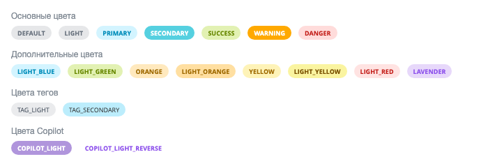

Метка — компактный элемент интерфейса: короткий текст в скругленном контейнере с цветной рамкой или заливкой. Метка показывает статус, категорию или признак объекта.

Метку размещают рядом с названием объекта, в строке списка, в карточке или на плитке.

В Bitrix Framework за метку отвечает расширение `ui.label`. Оно экспортирует класс `Label` и объекты с константами `LabelColor` и `LabelSize`.



Для новых интерфейсов используйте [Системную метку](./system-label.md) на расширении `ui.system.label`: она собрана в актуальном системном оформлении и дает Vue-компонент. Расширение `ui.label` выбирают, когда нужен цвет из `LabelColor`, метка-ссылка или индикатор статуса: у системной метки этих возможностей нет.



## Подключить расширение

Если вы подключаете метку из PHP, загрузите расширение `ui.label`.

```php
\Bitrix\Main\UI\Extension::load('ui.label');
```

Вместе с расширением подключаются его зависимости: `main.core`, `main.loader`, `ui.icon-set.api.core`, `ui.icon-set.main`, `ui.fonts.opensans` и `ui.design-tokens`. Загружать их отдельно не нужно.

Если метка нужна внутри своего расширения, добавьте `ui.label` в список зависимостей `rel` файла `config.php`. Состав файла описан в статье [Расширения](../framework/extensions.md).

Серверной части у расширения нет: ни класса, ни компонента. Метку создает JavaScript-код в браузере.

Если вы работаете в модульном JavaScript, импортируйте класс и константы из `ui.label`.

```js
import { Label, LabelColor, LabelSize } from 'ui.label';
```

Вне модульного JavaScript они доступны как `BX.UI.Label`, `BX.UI.LabelColor` и `BX.UI.LabelSize`. Те же наборы констант лежат в статических свойствах `Label.Color` и `Label.Size`, поэтому импортировать `LabelColor` и `LabelSize` отдельно не обязательно.

## Создать метку

Чтобы создать метку, выполните основные действия:

1. Создайте экземпляр `Label`.

2. Передайте текст `text`, цвет `color`, размер `size` и заливку `fill`.

3. Получите DOM-узел через `render()`.

4. Добавьте полученный узел на страницу.

**Пример.** Метка показывает состояние документа рядом с его названием. Контейнер `document-status` разработчик выводит в шаблоне страницы.

```js
import { Label, LabelColor, LabelSize } from 'ui.label';

const label = new Label({
    text: 'Черновик',
    color: LabelColor.DEFAULT,
    size: LabelSize.SM,
    fill: true,
});

document.getElementById('document-status').append(label.render());
```

Метод `render()` возвращает корневой DOM-узел метки. Класс создает узел один раз: повторный вызов `render()` отдает тот же элемент, а не новую метку.

Ширину метка берет по длине текста, но не выходит за ширину родителя. Текст, который не поместился, метка обрезает многоточием и на вторую строку не переносит.

## Передать параметры

Конструктор `Label` принимает объект с параметрами, которые задают текст, оформление и дополнительные элементы метки.

-  `text` — строка с текстом метки. Класс выводит значение как текст, поэтому HTML-теги в строке не обрабатываются.

-  `color` — цвет метки, значение из `LabelColor`. Без параметра метка использует серый цвет.

-  `size` — размер метки, значение из `LabelSize`.

-  `fill` — логическое значение: `true` заливает метку цветом.

-  `link` — строка с адресом ссылки.

-  `customClass` — строка со своим CSS-классом метки.

-  `status` — строка с индикатором статуса: `loading` или `check`.

-  `icon` — объект с обработчиками событий для иконки-крестика.

Обязательных параметров у конструктора нет, но сам объект с параметрами передать нужно: без него вызов завершится ошибкой.

Класс не проверяет цвет и размер ни в конструкторе, ни в сеттерах: значение параметра попадает в список CSS-классов метки как есть. Неизвестная строка оформление не изменит, поэтому передавайте константы, а не собственные значения.

## Выбрать цвет

Объект `LabelColor` содержит константы, которые задают фон, рамку и оформление текста метки. Оттенки соседних констант близкие, поэтому сравните их на одной странице, прежде чем выбрать.

{width=700px height=238px}

На снимке метки залиты цветом, а текстом в каждой метке стоит имя константы.

### Основные цвета

Основные цвета обозначают состояние объекта.

-  `LabelColor.DEFAULT` — серая метка для нейтрального признака.

-  `LabelColor.LIGHT` — серая метка. От `LabelColor.DEFAULT` отличается только оформлением при наведении на метку-ссылку.

-  `LabelColor.PRIMARY` — голубая метка для основного признака.

-  `LabelColor.SECONDARY` — бирюзовая метка для дополнительного признака.

-  `LabelColor.SUCCESS` — зеленая метка для успешного статуса.

-  `LabelColor.WARNING` — оранжевая метка для предупреждения.

-  `LabelColor.DANGER` — красная метка для ошибки или критического статуса.

### Дополнительные цвета

Дополнительные цвета расширяют палитру, когда основных цветов не хватает: например, когда нужно различить типы документов или приоритеты.

-  `LabelColor.LIGHT_BLUE` — голубая метка. Дает то же оформление, что `LabelColor.PRIMARY`.

-  `LabelColor.LIGHT_GREEN` — зеленая метка. Дает то же оформление, что `LabelColor.SUCCESS`.

-  `LabelColor.ORANGE` — оранжевая метка.

-  `LabelColor.LIGHT_ORANGE` — оранжевая метка другого оттенка.

-  `LabelColor.YELLOW` — желтая метка.

-  `LabelColor.LIGHT_YELLOW` — желтая метка другого оттенка.

-  `LabelColor.LIGHT_RED` — красная метка.

-  `LabelColor.LAVENDER` — лавандовая метка.

### Цвета тегов

Цвета тегов подходят для перечня тегов или ключевых слов рядом с объектом. В отличие от остальных цветов, текст в таких метках не полужирный.

-  `LabelColor.TAG_LIGHT` — светло-серая метка с темным текстом.

-  `LabelColor.TAG_SECONDARY` — голубая метка с темным текстом.

### Цвета Copilot

Цвета Copilot берут значения из оформления Copilot и меняются вместе с ним.

-  `LabelColor.COPILOT_LIGHT` — сиреневая метка.

-  `LabelColor.COPILOT_LIGHT_REVERSE` — метка с основным цветом фона интерфейса и сиреневым текстом.

## Выбрать размер

Объект `LabelSize` содержит три константы. Они задают высоту метки и радиус скругления.

-  `LabelSize.SM` — 18 пикселей.

-  `LabelSize.MD` — 20 пикселей.

-  `LabelSize.LG` — 25 пикселей.

Без параметра `size` метка получает высоту 20 пикселей — как у `LabelSize.MD`. Размер текста у всех трех значений одинаковый.

**Пример.** Метка в строке списка использует уменьшенный размер.

```js
import { Label, LabelColor, LabelSize } from 'ui.label';

const label = new Label({
    text: 'Акт',
    color: LabelColor.LIGHT_BLUE,
    size: LabelSize.SM,
});
```

## Залить метку цветом

Без параметра `fill` метка остается прозрачной: цвет уходит в рамку, а текст выводится темным. Передайте `fill: true`, чтобы залить метку цветом. Рамка при этом становится прозрачной.

**Пример.** Залитая метка показывает приоритет документа.

```js
import { Label, LabelColor, LabelSize } from 'ui.label';

const label = new Label({
    text: 'Высокий приоритет',
    color: LabelColor.WARNING,
    size: LabelSize.MD,
    fill: true,
});
```

## Сделать метку ссылкой

Параметр `link` задает адрес, и класс отрисовывает метку тегом `a`. При наведении под текстом метки появляется пунктирное подчеркивание.

**Пример.** Метка ведет на карточку документа.

```js
import { Label, LabelColor, LabelSize } from 'ui.label';

const label = new Label({
    text: 'Акт № 12',
    color: LabelColor.PRIMARY,
    size: LabelSize.SM,
    link: '/company/documents/detail/12/',
});
```



Класс выбирает тег один раз, когда собирает разметку метки. Метод `setLink()` у готовой метки меняет только значение свойства: тег и адрес в разметке остаются прежними. Передавайте адрес в конструктор.



## Показать индикатор статуса

Параметр `status` выводит слева от текста индикатор хода операции.

-  `loading` — вращающийся индикатор загрузки.

-  `check` — галочка из набора иконок [ui.icon-set](./icons.md).

Регистр значения роли не играет: `loading` и `LOADING` дают один результат.

**Пример.** Метка показывает индикатор загрузки, пока документ проводится, а затем выводит галочку. Функцию `conductDocument()` пишет разработчик: она отправляет запрос на сервер и возвращает `Promise`.

```js
import { Label, LabelColor, LabelSize } from 'ui.label';

const label = new Label({
    text: 'Проводится',
    color: LabelColor.LIGHT_BLUE,
    size: LabelSize.LG,
    fill: true,
    status: 'loading',
});

document.getElementById('document-status').append(label.render());

conductDocument().then(() => {
    label.setText('Проведен');
    label.setColor(LabelColor.SUCCESS);
    label.setStatus('check');
});
```

Чтобы убрать индикатор, передайте в `setStatus()` любое другое непустое значение. Пустая строка индикатор не снимает: метод оставит прежнее значение и выведет его заново.

## Добавить иконку действия

Параметр `icon` выводит справа от текста иконку-крестик и подписывает ее на события DOM. Ключи объекта — имена событий, значения — обработчики.

Крестик ничего не делает сам: удалить метку со страницы или снять фильтр должен обработчик.

Класс `Label` собственных событий не рассылает. Обработчики из параметра `icon` — единственная точка подписки, которую дает расширение.

**Пример.** Метка показывает выбранный тип документа, а нажатие на крестик убирает метку со страницы.

```js
import { Label, LabelColor, LabelSize } from 'ui.label';

const label = new Label({
    text: 'Тип документа: акт',
    color: LabelColor.LIGHT_BLUE,
    size: LabelSize.SM,
    fill: true,
    icon: {
        click: () => {
            label.getContainer().remove();
        },
    },
});

document.getElementById('document-filters').append(label.render());
```

## Задать свой CSS-класс

Параметр `customClass` подставляет в разметку метки произвольный CSS-класс. Он встает в общий список рядом с классами цвета, размера и заливки.

Своим классом задают оформление, которого нет среди констант, и правят верстку вокруг метки. Например, у метки есть собственный правый отступ в 10 пикселей: если он мешает, переопределите его.

Расширение задает заливку правилом из двух классов, поэтому одного своего класса для переопределения фона не хватит. Перечислите в правиле свой класс вместе с `ui-label`.

**Пример.** Метка получает собственный цвет фона, которого нет среди констант `LabelColor`.

```js
import { Label, LabelSize } from 'ui.label';

const label = new Label({
    text: 'Просрочен',
    size: LabelSize.SM,
    fill: true,
    customClass: 'document-status-overdue',
});
```

**Пример.** Правило перечисляет свой класс вместе с `ui-label` и меняет цвет фона залитой метки.

```css
.ui-label.document-status-overdue {
    background-color: var(--ui-color-palette-orange-50);
}
```



Метод `setCustomClass()` записывает класс в объект, но строку классов в разметке не пересобирает. Класс появится в разметке только после ближайшего вызова `setColor()`, `setSize()` или `setFill()`. Передавайте класс в конструктор.



## Изменить метку после создания

Сеттеры класса `Label` меняют уже выведенную на страницу метку, поэтому вызывать `render()` заново не нужно.

-  `setText(text)` — меняет текст метки. Пустую строку метод в разметку не выводит: на странице остается прежний текст, хотя `getText()` уже вернет пустую строку.

-  `setColor(color)` — меняет цвет метки.

-  `setSize(size)` — меняет размер метки.

-  `setFill(fill)` — включает и выключает заливку.

-  `setStatus(status)` — меняет индикатор статуса.

-  `setLink(link)` и `setCustomClass(customClass)` — записывают адрес ссылки и свой класс, но готовую разметку не меняют.

Парные методы `getText()`, `getColor()`, `getSize()`, `getFill()`, `getLink()` и `getCustomClass()` возвращают текущее состояние метки. Метод `getClassList()` возвращает строку CSS-классов, которую класс собрал из цвета, размера, заливки и своего класса.

Корневой DOM-узел метки возвращают два метода.

-  `render()` — применяет индикатор статуса и возвращает узел. Этот метод вызывают, когда метку выводят на страницу.

-  `getContainer()` — возвращает тот же узел, но индикатор статуса не применяет.

Метода, который удаляет метку со страницы, у класса нет. Получите корневой узел методом `getContainer()` и удалите его сами.

**Пример.** Метка меняет текст, цвет и заливку, когда документ отменяют.

```js
label.setText('Отменен');
label.setColor(LabelColor.DANGER);
label.setFill(true);
```

## Связанные материалы

-  [Системная метка](./system-label.md) — метка в актуальном системном оформлении.

-  [Системный чип](./system-chip.md) — компактный элемент для выбранного значения или действия.

-  [Иконки](./icons.md) — наборы иконок Bitrix Framework.

-  [Расширения](../framework/extensions.md) — подключение JavaScript-расширений Bitrix Framework.
