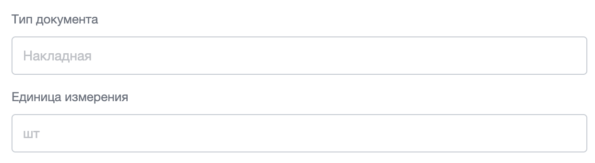
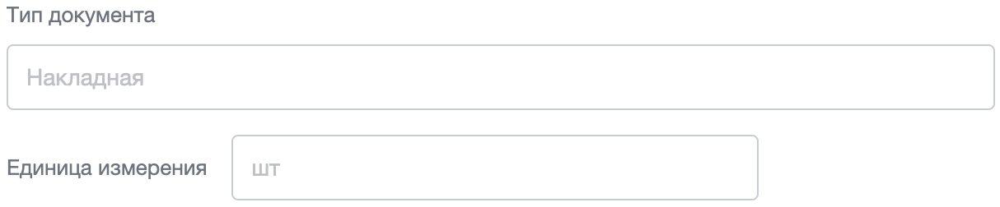
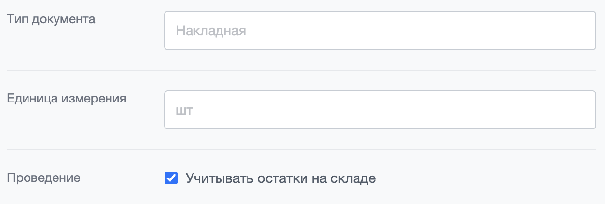
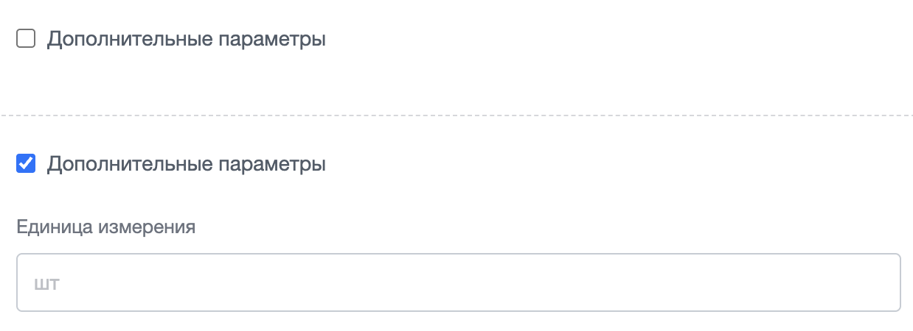

Расширение `ui.layout-form` задает каркас формы: строки, подписи, области значений и секции. Оформление строится на классах семейства `ui-form`.

Расширение почти целиком состоит из таблицы стилей. Разметку пишет разработчик: он размещает строки, подписи и поля, а затем добавляет к ним классы. Из JavaScript расширение выполняет одно действие — класс `LayoutForm` раскрывает и сворачивает блок формы по флажку.

Само поле ввода расширение не оформляет. Рамку, размер и состояние поля задает расширение [ui.forms](./ui-forms.md), которое входит в зависимости `ui.layout-form`. Проверку значений и отправку формы расширение тоже не выполняет.

Используйте `ui.layout-form`, когда форму собирает шаблон компонента или страница модуля. Расширение дает единый вид строк «подпись — значение».

{width=1240px height=340px}

## Подключить расширение

Если вы подключаете форму из PHP, загрузите [расширение](../framework/extensions.md) `ui.layout-form`.

```php
\Bitrix\Main\UI\Extension::load('ui.layout-form');
```

Вместе с расширением подключаются его зависимости: поля форм `ui.forms`, дизайн-токены `ui.design-tokens`, ядро `main.core` и события `main.core.events`. Расширение `ui.forms` дополнительно подключает шрифт `ui.fonts.opensans`. Загружать зависимости отдельно не нужно.

Для классов сетки JavaScript вызывать не нужно — стили работают сразу после подключения.

Проверить подключение можно по внешнему виду формы: если строки идут вплотную друг к другу, а подпись выводится обычным черным шрифтом, значит стили расширения на страницу не попали.

Класс для сворачиваемых блоков импортируют из `ui.layout-form`.

```js
import { LayoutForm } from 'ui.layout-form';
```

Вне модульного JavaScript класс доступен как `BX.UI.LayoutForm`.

## Собрать форму {#form-structure}

Сетку задают четыре класса.

#|
|| **Класс** | **Назначение** ||
|| `ui-form` | Контейнер формы. Задает внутренние отступы 20 пикселей по бокам и снизу, сверху отступа нет ||
|| `ui-form-row` | Строка формы. По умолчанию выстраивает содержимое в колонку: подпись сверху, значение снизу ||
|| `ui-form-label` | Подпись строки. Выводится серым шрифтом 13 пикселей и не сжимается ||
|| `ui-form-content` | Область значения. Занимает всю ширину строки ||
|#

Все правила расширения написаны на классах, поэтому теги вы выбираете сами: класс `ui-form` ставят и на `div`, и на тег `form`.

Минимальная разметка формы из двух строк выглядит так.

```html
<div class="ui-form">
    <div class="ui-form-row">
        <div class="ui-form-label">Тип документа</div>
        <div class="ui-form-content">
            <div class="ui-ctl ui-ctl-w100">
                <input type="text" class="ui-ctl-element" placeholder="Накладная">
            </div>
        </div>
    </div>
    <div class="ui-form-row">
        <div class="ui-form-label">Единица измерения</div>
        <div class="ui-form-content">
            <div class="ui-ctl ui-ctl-w100">
                <input type="text" class="ui-ctl-element" placeholder="шт">
            </div>
        </div>
    </div>
</div>
```

Строки формы разделяет отступ 15 пикселей, у последней строки его нет. Подпись отступает от значения на 10 пикселей. Две формы подряд разделяет отступ 20 пикселей.

Внутри формы расширение меняет отступы полей `ui.forms`.

-  У поля в строке расширение обнуляет нижний отступ.

-  Двум полям подряд расширение добавляет отступ сверху 10 пикселей. Боковой отступ 12 пикселей, который поля получают от `ui.forms`, при этом сохраняется.

-  Соседним переключателям `ui-ctl-radio` расширение обнуляет боковой отступ и задает отступ сверху 10 пикселей.

У формы, вложенной в область значения, расширение обнуляет все внутренние отступы.



Строка формы обрезает содержимое, которое выходит за ее границы: у нее задано правило `overflow: hidden`. Учитывайте это, если размещаете в строке широкую таблицу или блок с отрицательным отступом.



Классы `ui-form-*` и `ui-ctl-*` работают на разных уровнях и не конфликтуют: первые расставляют строки формы, вторые — содержимое внутри одного поля. Раскладку внутри поля описывает статья [Поля форм ui.forms](./ui-forms.md).

## Поставить подпись слева от поля {#row-line}

Модификаторы этого раздела меняют одну строку изнутри: значение встает справа от подписи, а не под ней. Их ставят к форме целиком или к отдельной строке.

Не путайте их с контейнером `ui-form-row-inline`, который ставит рядом друг с другом несколько строк формы. Его описывает раздел [Разместить несколько строк в один ряд](#row-inline).

#|
|| **Класс** | **Где ставят** | **Что делает** ||
|| `ui-form-line` | На контейнере `ui-form` | Ставит значение справа от подписи во всех строках формы ||
|| `ui-form-row-line` | На строке `ui-form-row` | Ставит значение справа от подписи только в этой строке ||
|| `ui-form-row-middle` | На строке `ui-form-row` | Выравнивает содержимое горизонтальной строки по центру по вертикали. Нужен в разделе [Собрать секцию формы](#form-section), где строки прижаты к верху ||
|| `ui-form-row-middle-input` | На строке `ui-form-row` | Задает подписи высоту 39 пикселей и центрирует ее текст по вертикали, чтобы подпись совпала с центром поля ||
|#

Модификатор `ui-form-line` ставят вторым классом к `ui-form` на том же элементе: `<div class="ui-form ui-form-line">`. Модификатор `ui-form-row-line` так же добавляют к `ui-form-row`.

В примере первая строка обычная, вторая с модификатором `ui-form-row-line`.

```html
<div class="ui-form">
    <div class="ui-form-row">
        <div class="ui-form-label">Тип документа</div>
        <div class="ui-form-content">
            <div class="ui-ctl ui-ctl-w100">
                <input type="text" class="ui-ctl-element" placeholder="Накладная">
            </div>
        </div>
    </div>
    <div class="ui-form-row ui-form-row-line">
        <div class="ui-form-label">Единица измерения</div>
        <div class="ui-form-content">
            <div class="ui-ctl">
                <input type="text" class="ui-ctl-element" placeholder="шт">
            </div>
        </div>
    </div>
</div>
```

{width=1214px height=252px}

В горизонтальной строке подпись отступает от значения на 15 пикселей. Соседним переключателям `ui-ctl-radio` строка задает боковой отступ 20 пикселей и убирает верхний.

## Собрать секцию формы {#form-section}

Секция — блок со светло-серым фоном, в котором строки разделены линиями. Класс `ui-form-section` ставят на контейнер формы рядом с классом `ui-form`.

Внутри секции строки формы меняются. Правила действуют на строки, вложенные в секцию напрямую.

-  Строки становятся горизонтальными, поэтому модификатор `ui-form-row-line` добавлять не нужно.

-  Каждая строка получает отступы 20 пикселей сверху и снизу, а также разделительную линию снизу. У последней строки линии нет.

-  Подпись получает фиксированную ширину 140 пикселей, поэтому колонка подписей выравнивается по всей секции.

-  Флажки и переключатели занимают ширину по содержимому.

-  Содержимое строки прижимается к верху. Чтобы выровнять его по центру, добавьте строке модификатор [`ui-form-row-middle`](#row-line).

Секцию из трех строк, последняя из которых содержит флажок, размечают так.

```html
<div class="ui-form ui-form-section">
    <div class="ui-form-row">
        <div class="ui-form-label">Тип документа</div>
        <div class="ui-form-content">
            <div class="ui-ctl ui-ctl-w100">
                <input type="text" class="ui-ctl-element" placeholder="Накладная">
            </div>
        </div>
    </div>
    <div class="ui-form-row">
        <div class="ui-form-label">Единица измерения</div>
        <div class="ui-form-content">
            <div class="ui-ctl ui-ctl-w100">
                <input type="text" class="ui-ctl-element" placeholder="шт">
            </div>
        </div>
    </div>
    <div class="ui-form-row">
        <div class="ui-form-label">Проведение</div>
        <div class="ui-form-content">
            <label class="ui-ctl ui-ctl-checkbox">
                <input type="checkbox" class="ui-ctl-element">
                <span class="ui-ctl-label-text">Учитывать остатки на складе</span>
            </label>
        </div>
    </div>
</div>
```

{width=1232px height=416px}



Скругление углов секции задает переменная `--ui-form-section-border-radius`. Ее значение приходит из таблицы дизайн-токенов Битрикс24, а не из расширения `ui.design-tokens`. Если форма выводится вне интерфейса Битрикс24, углы секции остаются прямыми — объявите переменную сами на `:root` или на контейнере секции.



## Выделить группу строк {#row-group}

Класс `ui-form-row-group` подсвечивает несколько строк внутри формы: добавляет полупрозрачный серый фон и внутренние отступы 15 пикселей сверху и снизу, 20 пикселей по бокам.

Класс ставят на отдельный контейнер: его размещают внутри `ui-form` и вкладывают в него строки `ui-form-row`. На саму строку класс не вешают.

В примере в группу вынесена одна строка формы.

```html
<div class="ui-form">
    <div class="ui-form-row">
        <div class="ui-form-label">Тип документа</div>
        <div class="ui-form-content">
            <div class="ui-ctl ui-ctl-w100">
                <input type="text" class="ui-ctl-element" placeholder="Накладная">
            </div>
        </div>
    </div>
    <div class="ui-form-row-group">
        <div class="ui-form-row">
            <div class="ui-form-label">Единица измерения</div>
            <div class="ui-form-content">
                <div class="ui-ctl ui-ctl-w100">
                    <input type="text" class="ui-ctl-element" placeholder="шт">
                </div>
            </div>
        </div>
    </div>
</div>
```

Группа и секция выглядят похоже, но решают разные задачи. Группа не меняет направление строк, не рисует разделительные линии и не задает ширину подписи — она только выделяет часть формы фоном.

## Разместить несколько строк в один ряд {#row-inline}

Модификаторы из раздела [Поставить подпись слева от поля](#row-line) ставят подпись рядом со значением внутри одной строки. Контейнер `ui-form-row-inline` решает другую задачу: он ставит рядом друг с другом несколько строк формы.

Класс ставят на отдельный контейнер: его размещают внутри `ui-form` и вкладывают в него строки `ui-form-row`. На саму строку класс не вешают.

Внутри контейнера строки меняются.

-  Строки встают в ряд, между ними появляется отступ 15 пикселей справа. У последней строки отступа нет.

-  Поля теряют фиксированную ширину и занимают место по содержимому.

-  Соседние поля в области значения разделяет отступ 10 пикселей, соседние флажки — 25 пикселей.

Ряд из двух строк размечают так.

```html
<div class="ui-form">
    <div class="ui-form-row-inline">
        <div class="ui-form-row">
            <div class="ui-form-label">Ширина</div>
            <div class="ui-form-content">
                <div class="ui-ctl">
                    <input type="text" class="ui-ctl-element" placeholder="мм">
                </div>
            </div>
        </div>
        <div class="ui-form-row">
            <div class="ui-form-label">Высота</div>
            <div class="ui-form-content">
                <div class="ui-ctl">
                    <input type="text" class="ui-ctl-element" placeholder="мм">
                </div>
            </div>
        </div>
    </div>
</div>
```

Два контейнера подряд разделяет отступ сверху 20 пикселей.

У контейнера два модификатора.

-  `ui-form-row-inline-wa` — строки перестают растягиваться и занимают ширину по содержимому.

-  `ui-form-row-inline-col` — строки ряда становятся горизонтальными, как с `ui-form-row-line`, но подпись отступает от значения на 10 пикселей вместо 15, а модификатор действует сразу на все строки ряда.

## Добавить ссылку и подсказку {#link-and-hint}

Класс `ui-form-link` ставят на ссылку рядом с полем. Ссылка перестает растягиваться и сжиматься, а после обертки `ui-ctl` получает отступ слева 15 пикселей.

В примере ссылка стоит справа от поля в [горизонтальной строке](#row-line).

```html
<div class="ui-form">
    <div class="ui-form-row ui-form-row-line">
        <div class="ui-form-label">Единица измерения</div>
        <div class="ui-form-content">
            <div class="ui-ctl">
                <input type="text" class="ui-ctl-element" placeholder="шт">
            </div>
            <a href="#" class="ui-form-link">Сбросить</a>
        </div>
    </div>
</div>
```

Класс отвечает только за положение ссылки. Цвет, подчеркивание и размер шрифта задайте своими правилами.

Подсказку [ui.hint](./hint.md) можно поставить прямо в подпись строки. В разметке вы пишете элемент с классом `ui-hint` и атрибутом `data-hint`, а иконку создает менеджер подсказок. Расширение `ui.layout-form` выравнивает готовую иконку по высоте текста подписи.

```html
<div class="ui-form-label">
    Единица измерения
    <span class="ui-hint" data-hint="Единица, в которой ведется учет остатков"></span>
</div>
```



Расширение `ui.hint` в зависимости `ui.layout-form` не входит. Подключите его отдельно, иначе подсказка не появится.



## Расположить кнопки формы {#buttons}

Внутри `ui-form` кнопки ведут себя не так, как на обычной странице. Строка формы по умолчанию выстраивает содержимое в колонку, поэтому кнопки встают друг под другом. Расширение подгоняет под это и отступы: у двух кнопок подряд оно обнуляет боковой отступ и добавляет отступ сверху 10 пикселей.

Правило действует на любой элемент с классом `ui-btn` — и на верстку в шаблоне, и на кнопки, которые создает класс `Button` из расширения [ui.buttons](./ui-buttons.md).

Чтобы вернуть кнопки в ряд, положите их в горизонтальную строку. В строке с модификатором `ui-form-row-line` соседние кнопки разделяет отступ 12 пикселей.

В примере вид кнопкам задают модификаторы `ui.buttons`: `ui-btn-primary` — основная кнопка, `ui-btn-link` — кнопка-ссылка. Отступами управляет только класс `ui-btn`.

```html
<div class="ui-form">
    <div class="ui-form-row ui-form-row-line">
        <button type="button" class="ui-btn ui-btn-primary">Сохранить</button>
        <button type="button" class="ui-btn ui-btn-link">Отменить</button>
    </div>
</div>
```

## Показать блок по флажку {#hidden-block}

Часть формы можно скрыть под флажком: пользователь отмечает флажок, и блок раскрывается. За это отвечает класс `LayoutForm`.

### Собрать разметку {#hidden-block-markup}

Разметка состоит из двух соседних элементов.

-  Управляющий элемент — элемент с атрибутом `data-form-row-hidden`. Внутри него лежит флажок с классом `ui-ctl-element` и типом `checkbox`. Обычно управляющим элементом служит подпись `ui-form-label`.

-  Скрываемый блок — следующий соседний элемент с классом `ui-form-row-hidden`.



Блок должен идти сразу за управляющим элементом: расширение берет следующий соседний элемент. Если блок вложен в управляющий элемент или между ними стоит другой элемент, раскрытие не сработает.



Блок «Дополнительные параметры» с одной скрытой строкой размечают так.

```html
<div class="ui-form" id="document-settings">
    <div class="ui-form-row">
        <div class="ui-form-label" data-form-row-hidden>
            <label class="ui-ctl ui-ctl-checkbox">
                <input type="checkbox" class="ui-ctl-element">
                <span class="ui-ctl-label-text">Дополнительные параметры</span>
            </label>
        </div>
        <div class="ui-form-row-hidden">
            <div class="ui-form-row">
                <div class="ui-form-label">Единица измерения</div>
                <div class="ui-form-content">
                    <div class="ui-ctl ui-ctl-w100">
                        <input type="text" class="ui-ctl-element" placeholder="шт">
                    </div>
                </div>
            </div>
        </div>
    </div>
</div>
```

{width=1238px height=450px}

Обработчик клика расширение вешает на весь управляющий элемент, поэтому блок переключает клик по любой его части — и по флажку, и по тексту рядом с ним.

Начальное состояние расширение берет из разметки. Если у флажка стоит атрибут `checked`, блок открыт сразу после создания объекта.

Управляющие элементы можно вкладывать друг в друга: скрываемый блок может содержать свой управляющий элемент со своим блоком.

При раскрытии расширение само добавляет блоку класс `ui-form-row-hidden-show` — в разметке его писать не нужно. Вместе с классом блок получает отступы 15 пикселей сверху и снизу, а переход занимает 0,15 секунды. После раскрытия высота блока не ограничена, поэтому содержимое можно менять и дальше.



Свернутый блок скрыт стилями, а не удален со страницы: поля внутри него остаются в разметке и уходят на сервер вместе с формой. Если значения свернутого блока отправлять не нужно, отключайте или очищайте поля сами.



### Включить переключение {#init}

Создайте объект `LayoutForm` и передайте ему контейнер формы — в примере разметки выше это узел с идентификатором `document-settings`.

```js
import { LayoutForm } from 'ui.layout-form';

const layoutForm = new LayoutForm({
    container: document.getElementById('document-settings'),
});
```

Параметр конструктора один, и он необязателен.

```ts
type LayoutOptions = {
    container?: HTMLElement;
};
```

#|
|| **Параметр** | **Тип** | **Описание** ||
|| `container` | `HTMLElement` | Задает узел, внутри которого расширение ищет управляющие элементы. По умолчанию `document.documentElement`, то есть объект обрабатывает всю страницу ||
|#

Передавайте контейнер формы, чтобы объект не обработал разметку соседних блоков страницы.

Вне модульного JavaScript тот же объект создают через глобальное имя класса. Оберните вызов в `BX.ready()`: объект должен создаваться после того, как разметка формы попала в DOM.

```js
BX.ready(function() {
    new BX.UI.LayoutForm({
        container: BX('document-settings')
    });
});
```

Объект ищет управляющие элементы один раз при создании. Разметку, которая появилась позже, объект не обработает — создайте для нее отдельный объект с ее контейнером.



Расширение выключает у флажка прием кликов и переставляет его само, отменяя стандартное действие тега `label`. Флажок меняется из кода, поэтому событие `change` у него не срабатывает: не назначайте флажку обработчик `change` и узнавайте новое состояние из события `onToggle`.





Внутри элемента с атрибутом `data-form-row-hidden` должен быть флажок: расширение обращается к найденному узлу без проверки. Управляющий элемент без флажка прерывает инициализацию с ошибкой, и остальные блоки контейнера тоже перестают работать.



Отдельного способа раскрыть или свернуть блок из кода расширение не описывает. Снять обработчики кликов после создания объекта нельзя, поэтому не создавайте второй объект для того же контейнера: расширение навесит второй обработчик, и один клик переключит блок дважды.

### Обработать переключение блока {#on-toggle}

Класс `LayoutForm` наследуется от класса `EventEmitter` из расширения `main.core.events` и вызывает одно событие в пространстве имен `BX.UI.LayoutForm`.

#|
|| **Событие** | **Данные события** | **Когда срабатывает** ||
|| `onToggle` | Объект с полем `checkbox` — узел флажка внутри управляющего элемента | При каждом клике по управляющему элементу — и при раскрытии, и при сворачивании ||
|#

Новое состояние блока читают из свойства `checked` этого флажка. В примерах ниже `setDocumentSettingsEnabled()` — функция страницы, а не метод расширения: она включает и выключает поля скрытого блока.

```js
layoutForm.subscribe('onToggle', (event) => {
    const { checkbox } = event.getData();

    // Пока блок свернут, поля из него не отправляем
    setDocumentSettingsEnabled(checkbox.checked);
});
```

Событие общее для всех управляющих элементов контейнера. Если блоков несколько, различайте их по узлу флажка из данных события.

Если обработчик находится вне кода, который создает объект, подпишитесь через `EventEmitter`. Полное имя события — `BX.UI.LayoutForm:onToggle`.

```js
import { EventEmitter } from 'main.core.events';

EventEmitter.subscribe('BX.UI.LayoutForm:onToggle', (event) => {
    const { checkbox } = event.getData();

    setDocumentSettingsEnabled(checkbox.checked);
});
```

Метод `unsubscribe('onToggle', handler)` отписывает обработчик от события. Передайте методу ту же функцию, которую передавали в `subscribe()`. Для глобальной подписки вызывайте `EventEmitter.unsubscribe()` и передавайте полное имя события.

Вне модульного JavaScript то же событие принимают через `BX.addCustomEvent` с полным именем. Обработчик получает тот же объект события, поэтому флажок в нем тоже читают методом `getData()`.

```js
BX.addCustomEvent('BX.UI.LayoutForm:onToggle', function(event) {
    var checkbox = event.getData().checkbox;

    setDocumentSettingsEnabled(checkbox.checked);
});
```

## Связанные материалы

-  [Поля форм ui.forms](./ui-forms.md) — классы `ui-ctl` для полей ввода внутри строк формы.

-  [Кнопки ui.buttons](./ui-buttons.md) — оформление кнопок формы.

-  [Подсказка](./hint.md) — иконка подсказки рядом с подписью строки.

-  [Выпадающий список ui.select](./ui-select.md) — список, который строится из JavaScript.

-  [Расширения](../framework/extensions.md) — подключение расширений Bitrix Framework.
