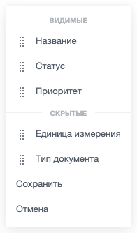

Настраиваемое меню — выпадающий список, в котором пользователь сам задает состав и порядок пунктов. Пункты разделены на две группы: «Видимые» и «Скрытые». Пользователь перетаскивает пункты между группами и внутри группы, а затем нажимает «Сохранить» или «Отмена».

Такое меню открывают рядом с кнопкой настройки панели или списка, когда пользователю нужно убрать лишние элементы и расставить остальные в нужном порядке.

Расширение показывает меню и возвращает выбор пользователя. Применить новый состав к интерфейсу и сохранить его — задача разработчика.

В Bitrix Framework за настраиваемое меню отвечает расширение `ui.menu-configurable` с единственным классом `Menu`.

## Подключить расширение

Если вы подключаете меню из PHP, загрузите расширение `ui.menu-configurable`.

```php
\Bitrix\Main\UI\Extension::load('ui.menu-configurable');
```

Вместе с расширением подключаются его зависимости: `main.core`, `main.core.events`, `main.popup` и `ui.draganddrop.draggable`. Загружать их отдельно не нужно.

Если меню нужно внутри своего расширения, добавьте `ui.menu-configurable` в список зависимостей `rel` файла `config.php`. Состав файла описан в статье [Расширения](../framework/extensions.md).

Серверной части у расширения нет: ни класса, ни компонента. Состав пунктов готовит разработчик в JavaScript.

Если вы работаете в модульном JavaScript, импортируйте класс `Menu` из `ui.menu-configurable`.

```js
import { Menu } from 'ui.menu-configurable';
```

Класс с именем `Menu` есть и в расширении [main.popup](./main-popup.md). Если в файле нужны оба класса, задайте псевдоним при импорте.

```js
import { Menu as MenuConfigurable } from 'ui.menu-configurable';
```

Вне модульного JavaScript класс доступен как `BX.UI.MenuConfigurable.Menu`.

Меню настройки нужно не на каждой странице. Когда расширение требуется только по нажатию кнопки, загрузите его методом `Runtime.loadExtension()`. Он возвращает промис с экспортами расширения, а в обычном скрипте страницы доступен как `BX.Runtime.loadExtension()`.

**Пример.** Расширение загружается в момент открытия меню, а не вместе со страницей. Кнопку `settingsButton` и массив пунктов `columnItems` готовит разработчик.

```js
import { Runtime } from 'main.core';

Runtime.loadExtension('ui.menu-configurable').then(({ Menu }) => {
    const menu = new Menu({
        id: 'document-columns-menu',
        bindElement: settingsButton,
        items: columnItems,
    });

    return menu.open();
});
```

## Открыть меню

Чтобы показать меню, выполните основные действия:

1. Создайте экземпляр `Menu` и передайте в параметрах массив пунктов `items`.

2. Укажите элемент привязки `bindElement` — кнопку или другой элемент страницы, рядом с которым откроется меню.

3. Вызовите метод `open()` и обработайте результат.

**Пример.** Кнопка открывает меню настройки колонок списка, а обработчик получает состав колонок после нажатия «Сохранить».

```js
import { Menu as MenuConfigurable } from 'ui.menu-configurable';

const settingsButton = document.getElementById('columns-settings');

const menu = new MenuConfigurable({
    id: 'document-columns-menu',
    bindElement: settingsButton,
    items: [
        {
            id: 'title',
            text: 'Название',
        },
        {
            id: 'status',
            text: 'Статус',
        },
        {
            id: 'priority',
            text: 'Приоритет',
            isHidden: true,
        },
    ],
});

settingsButton.addEventListener('click', () => {
    menu.open().then((result) => {
        if (result.isCanceled)
        {
            return;
        }

        console.log(result.items);
    });
});
```

Метод `open()` показывает меню рядом с `bindElement` из параметров конструктора. Чтобы открыть меню у другого элемента, передайте его в `open()`. Новая привязка действует до ближайшей пересборки меню: после сохранения и после закрытия меню снова открывается у элемента из конструктора.

## Передать параметры

Конструктор `Menu` принимает объект с параметрами меню.

-  `items` — массив пунктов меню. Параметр обязательный: без него меню не соберется.

-  `id` — идентификатор меню. Если не передать `id`, класс создаст служебный идентификатор со случайным числом. Значение должно быть уникальным на странице: `MenuManager` из `main.popup` хранит меню по идентификатору и для занятого значения вернет уже созданное меню.

-  `bindElement` — DOM-элемент, рядом с которым открывается меню. Тот же элемент можно передать позже в метод `open()`.

-  `maxVisibleItems` — максимальное число пунктов в группе «Видимые». Если параметр не передан или его значение не больше нуля, число видимых пунктов не ограничено.

-  `maxWidth` — максимальная ширина меню в пикселях. Значение должно быть числом: строку расширение не примет и оставит ширину по умолчанию.

Других параметров окна конструктор не принимает: в `main.popup` уходят только идентификатор, пункты, элемент привязки и `maxWidth`. Сдвиг, анимацию и остальные настройки `Popup` задать нельзя, доступа к самому окну у объекта тоже нет.

## Описать пункт меню

Пункт задается объектом внутри массива `items`.

-  `id` — идентификатор пункта. По нему расширение сопоставляет разметку с описанием пункта, когда собирает результат, поэтому идентификатор нужен каждому пункту.

-  `text` — текст пункта. HTML-теги в строке экранируются.

-  `html` — содержимое пункта: строка с разметкой или DOM-элемент. Если передан `html`, значение `text` не используется. Передавайте только доверенную разметку.

-  `isHidden` — значение `true` помещает пункт в группу «Скрытые». По умолчанию пункт попадает в группу «Видимые».



Из параметров пункта расширение передает в `main.popup` только `id`, `text` и `html`. Обработчик `onclick`, ссылка `href`, признак `disabled` и вложенное меню в разметку не попадут. В настраиваемом меню пользователь переставляет и скрывает пункты, но не выполняет действия над объектом.



**Пример.** Пункт с двухстрочным содержимым: название и пояснение под ним. Параметр `maxWidth` ограничивает ширину меню 600 пикселями, чтобы длинные подписи не растягивали окно.

```js
import { Tag, Text } from 'main.core';
import { Menu as MenuConfigurable } from 'ui.menu-configurable';

const menu = new MenuConfigurable({
    id: 'document-columns-menu',
    bindElement: document.getElementById('columns-settings'),
    maxWidth: 600,
    items: [
        {
            id: 'amount',
            html: Tag.render`
                <span>
                    <span>${Text.encode('Количество')}</span>
                    <span class="document-columns-item-subtitle">${Text.encode('в единицах измерения')}</span>
                </span>
            `,
        },
    ],
});
```

## Разделить пункты на видимые и скрытые

Меню собирается по одной схеме: заголовок «Видимые», видимые пункты, заголовок «Скрытые», скрытые пункты и две команды внизу — «Сохранить» и «Отмена». Заголовок «Скрытые» выводится, даже если скрытых пунктов нет. Надписи приходят из языковых файлов расширения и в параметрах не задаются.

{width=196px height=334px}

У каждого пункта из `items` слева от названия появляется иконка перетаскивания. Пользователь тянет пункт за нее и переносит в другую группу или на другое место внутри группы. Группа, в которой пункт оказался, задает его признак `isHidden` в результате. Кнопки «Сохранить» и «Отмена» пользователь не переставляет.

Когда пользователь отпускает перетаскиваемый пункт, расширение считает видимые пункты и переносит лишние в группу «Скрытые». Границу задает параметр `maxVisibleItems`.

**Пример.** Меню оставляет в группе «Видимые» не больше трех пунктов.

```js
import { Menu as MenuConfigurable } from 'ui.menu-configurable';

const menu = new MenuConfigurable({
    id: 'document-columns-menu',
    bindElement: document.getElementById('columns-settings'),
    maxVisibleItems: 3,
    items: [
        {
            id: 'title',
            text: 'Название',
        },
        {
            id: 'status',
            text: 'Статус',
        },
        {
            id: 'priority',
            text: 'Приоритет',
        },
        {
            id: 'unit',
            text: 'Единица измерения',
        },
    ],
});
```

Ограничение работает только при перетаскивании. Если в `items` передать больше видимых пунктов, чем разрешает `maxVisibleItems`, меню покажет их все.

Минимального числа видимых пунктов у расширения нет. Пользователь может перенести в «Скрытые» все пункты, поэтому проверяйте состав сами — например, в обработчике события `Save`.

## Получить результат выбора

Метод `open()` возвращает `Promise`, который выполняется в двух случаях.

-  Пользователь нажал «Сохранить». Результат — объект `{ items }`, где `items` содержит пункты в том порядке и с тем признаком `isHidden`, в котором их оставил пользователь. Расширение запоминает новый состав и собирает меню заново, поэтому окно закрывается.

-  Пользователь закрыл меню без сохранения: нажал «Отмена», клавишу `Esc` или кликнул вне меню. Результат — объект `{ isCanceled: true }`.

Промис не отклоняется: об отмене расширение сообщает результатом, а не ошибкой.

Проверяйте признак `isCanceled` до того, как читать `items`: при отмене массива в результате нет.

Повторный вызов `open()` до закрытия меню возвращает тот же `Promise`. Новый `Promise` создается при следующем открытии, после того как предыдущий выполнен.

В обработчике результата перестройте свой интерфейс и отправьте состав на сервер: между открытиями страницы расширение состав не хранит.

**Пример.** Обработчик перестраивает список колонок и отправляет новый состав на сервер.

```js
menu.open().then((result) => {
    if (result.isCanceled)
    {
        return;
    }

    renderColumns(result.items);

    BX.ajax.runAction('example.Document.saveColumns', {
        data: {
            columns: result.items.map((item) => {
                return {
                    id: item.id,
                    isHidden: item.isHidden,
                };
            }),
        },
    });
});
```

Метод `getItemsFromMenu()` возвращает состав пунктов в текущем состоянии, не дожидаясь нажатия «Сохранить». Признак `isHidden` метод рассчитывает по положению пункта относительно заголовка «Скрытые», а сами пункты возвращает копиями: правка полученного массива состав меню не меняет.

## Обработать события Save и Cancel

Класс `Menu` наследует `EventEmitter`, поэтому подключите обработчик методом `subscribe()`. Оба события приходят без данных: текущий состав пунктов читайте методом `getItemsFromMenu()`.

-  `Save` — при нажатии кнопки «Сохранить». Вызов `event.preventDefault()` в обработчике отменяет сохранение: расширение не обновит состав пунктов, не выполнит `Promise` и оставит меню открытым.

-  `Cancel` — при нажатии кнопки «Отмена». Вызов `event.preventDefault()` в обработчике оставляет меню открытым.

Других событий у расширения нет. Закрытие окна оно обрабатывает само, поэтому о закрытии сообщает только результат промиса из `open()`.

**Пример.** Обработчик запрещает сохранение, если в группе «Видимые» не осталось ни одного пункта.

```js
menu.subscribe('Save', (event) => {
    const visibleItems = menu.getItemsFromMenu().filter((item) => !item.isHidden);

    if (visibleItems.length === 0)
    {
        event.preventDefault();
    }
});
```

Полное имя событий для глобальной подписки через `EventEmitter` — `BX.UI.MenuConfigurable.Menu:Save` и `BX.UI.MenuConfigurable.Menu:Cancel`.

## Обновить состав пунктов и закрыть меню

Состав пунктов и открытое окно меняют два метода — `setItems()` и `close()`.

Меню, которое открывают несколько раз, создавайте один раз и обновляйте методом `setItems()`. Если объект создается заново на каждое открытие, не передавайте `id`: класс сгенерирует уникальное значение сам, и новое меню не получит из `MenuManager` пункты предыдущего.

Метод `setItems(items)` записывает новый массив пунктов и возвращает объект меню. Разметку он не перестраивает: меню собирается заново при создании объекта, после сохранения и при закрытии. Новый состав появится в меню после ближайшей пересборки.

**Пример.** Код заменяет состав пунктов и пересобирает меню, закрывая его.

```js
menu.setItems(updatedItems);
menu.close();
```

Метод `close()` скрывает меню, собирает его заново и выполняет `Promise` результатом `{ isCanceled: true }`. Пересборка возвращает пункты к сохраненному состоянию, поэтому перестановки, которые пользователь не сохранил, пропадают.

## Связанные материалы

-  [Всплывающие окна и меню main.popup](./main-popup.md) — базовое меню, на котором построено настраиваемое меню.

-  [Системное меню](./system-menu.md) — меню для выбора действия над объектом.

-  [Расширения](../framework/extensions.md) — подключение JavaScript-расширений Bitrix Framework.
