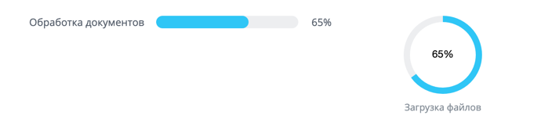
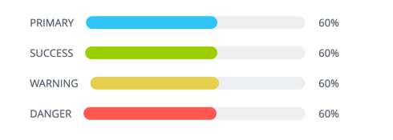
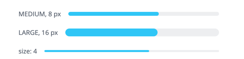
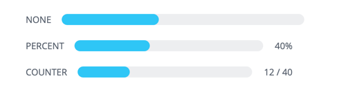
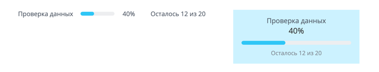
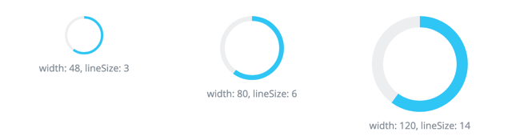
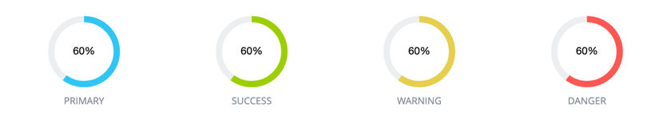
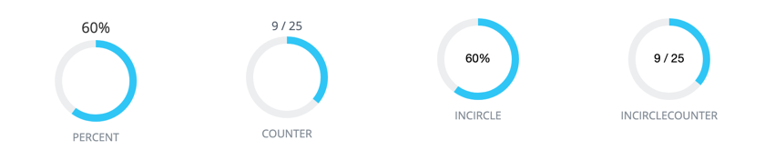

`ui.progressbar` и `ui.progressround` — расширения Bitrix Framework для индикаторов прогресса.

Индикатор показывает, какая часть длительной операции выполнена: сколько документов обработано, сколько файлов загружено, сколько шагов пройдено.

Каждое расширение дает свой JavaScript-класс. Класс собирает разметку индикатора в браузере и меняет ее после отрисовки:

-  `ProgressBar` из `ui.progressbar` — для горизонтальной полосы,

-  `ProgressRound` из `ui.progressround` — для кольца.

Серверного API у расширений нет: отрисовать индикатор на стороне PHP нельзя.

## Выбрать индикатор

Оба класса работают по одной схеме. Задайте текущее значение `value` и предельное `maxValue`, разместите индикатор на странице и после каждого шага операции передавайте новое значение в метод `update()`. Различаются форма и набор параметров оформления.

{width=690px height=175px}

| Что сравниваем | `ui.progressbar` | `ui.progressround` |
|----------------|------------------|--------------------|
| Форма | Горизонтальная полоса | Кольцо |
| Размер | Толщина полосы: два готовых значения или число пикселей | Диаметр кольца и толщина линии в пикселях |
| Место статуса | Только рядом с полосой | Рядом с кольцом или внутри него |
| Подпись как ссылка | Есть: подпись после полосы принимает обработчик клика | Нет |
| Вертикальная раскладка | Есть: подписи и статус встают над полосой и под ней | Всегда вертикальная |
| Состояние без известного объема работы | Бесконечное движение полосы | Вращение кольца |
| Оформление Air Design | Нет | Есть |

Полоса занимает всю ширину родительского блока, поэтому она подходит для формы, диалога или строки списка. Контейнер кольца тоже занимает всю ширину, но само кольцо остается квадратом заданного диаметра и выравнивается по центру контейнера.

Оба индикатора показывают долю выполненной работы и требуют числовых значений. Если данные еще не пришли и нужно занять место под будущее содержимое, используйте [скелетон загрузки](./system-skeleton.md).

Ни один из классов не добавляет ARIA-атрибуты: индикатор собран из обычных блоков и не сообщает скринридеру ни роль, ни текущее значение. Если индикатор нужен в доступном интерфейсе, получите его узел методом `getContainer()` и задайте атрибуты сами.

Событий классы не отправляют: узнать о смене значения снаружи нельзя. Единственный обработчик — `clickAfterCallback` у подписи после полосы, и у кольца его нет.

## Подключить расширение

Если вы выводите индикатор из PHP, загрузите нужное [расширение](../framework/extensions.md).

```php
\Bitrix\Main\UI\Extension::load('ui.progressbar');
```

Вместе с расширением подключаются его зависимости. У `ui.progressbar` это `main.core`, у `ui.progressround` — `main.core`, `ui.design-tokens.air`, `ui.fonts.opensans` и `ui.system.typography`. Загружать их отдельно не нужно.

В модульном JavaScript импортируйте класс из расширения.

```js
import { ProgressBar } from 'ui.progressbar';
import { ProgressRound, ProgressRoundColor, ProgressRoundStatus } from 'ui.progressround';
```

Расширение `ui.progressbar` экспортирует только класс `ProgressBar`. Наборы значений отдельными именами оно не отдает — они доступны как свойства класса:

-  `ProgressBar.Color` — цвет полосы, значения описаны в разделе [Цвет полосы](#progressbar-color),

-  `ProgressBar.Size` — толщина полосы, значения описаны в разделе [Толщина полосы](#progressbar-size),

-  `ProgressBar.Status` — тип статуса рядом с полосой, значения описаны в разделе [Статус полосы](#progressbar-status).

Расширение `ui.progressround` экспортирует и класс, и наборы значений. Свойство класса и отдельное имя ведут на один и тот же набор, поэтому берите любой вариант:

-  `ProgressRound.Color` или `ProgressRoundColor` — цвет кольца, значения описаны в разделе [Цвет кольца](#progressround-color),

-  `ProgressRound.Status` или `ProgressRoundStatus` — тип статуса кольца, значения описаны в разделе [Статус кольца](#progressround-status).

После загрузки расширений те же имена доступны глобально, без импорта:

-  `BX.UI.ProgressBar` — класс полосы вместе со своими наборами значений,

-  `BX.UI.ProgressRound` — класс кольца вместе со своими наборами значений,

-  `BX.UI.ProgressRoundColor` и `BX.UI.ProgressRoundStatus` — наборы значений кольца отдельными именами.



Свойство `BX.UI.Progressround` устарело. Оно ссылается на тот же класс и продолжает работать, но в новом коде используйте `BX.UI.ProgressRound` или импорт из `ui.progressround`.



## Создать линейный индикатор

Чтобы вывести полосу, выполните основные действия:

1. Создайте экземпляр `ProgressBar` и передайте в него текущее и предельное значение.

2. Разместите полосу на странице методом `renderTo()`.

3. После каждого шага операции передавайте новое значение в метод `update()`.

**Пример.** Полоса показывает, сколько документов из 40 обработано, и выводит счетчик справа. Она появляется в блоке с идентификатором `progress-container`.

```js
import { ProgressBar } from 'ui.progressbar';

const bar = new ProgressBar({
    value: 0,
    maxValue: 40,
    size: ProgressBar.Size.LARGE,
    statusType: ProgressBar.Status.COUNTER,
    textBefore: 'Обработка документов',
});

bar.renderTo(document.getElementById('progress-container'));
bar.update(12);
```

Метод `renderTo()` добавляет индикатор в конец переданного узла и возвращает DOM-узел индикатора. Если аргумент не DOM-узел, метод возвращает `null` и ничего не размещает.

Метод `getContainer()` возвращает DOM-узел индикатора и создает его при первом вызове. Используйте его, когда узел нужно вставить самостоятельно.

### Передать параметры полосе

Передайте в конструктор `ProgressBar` объект с параметрами. Значения задают заполнение, оформление, подписи и поведение полосы.

Заполнение:

-  `value` — текущее значение. Конструктор принимает только число, любое другое значение заменяет на `0`. По умолчанию `0`.

-  `maxValue` — предельное значение, которому соответствует полностью заполненная полоса. По умолчанию `100`.

Оформление:

-  `color` — цвет полосы. Значения описаны в разделе [Цвет полосы](#progressbar-color). По умолчанию `ProgressBar.Color.PRIMARY`.

-  `size` — толщина полосы. Значения описаны в разделе [Толщина полосы](#progressbar-size). По умолчанию `ProgressBar.Size.MEDIUM`.

-  `fill` — светлая подложка вокруг полосы в текущем цвете. По умолчанию `false`.

-  `column` — вертикальная раскладка. Описана в разделе [Вертикальная раскладка](#progressbar-column). По умолчанию `false`.

-  `colorBar` — собственный цвет полосы. Принимает любое значение CSS-цвета, например `#00a2e8`.

-  `colorTrack` — собственный цвет дорожки под полосой.

Статус и подписи:

-  `statusType` — что показывать рядом с полосой. Значения описаны в разделе [Статус полосы](#progressbar-status). По умолчанию `ProgressBar.Status.NONE`.

-  `textBefore` — подпись перед полосой.

-  `textAfter` — подпись после полосы.

-  `clickAfterCallback` — обработчик клика по подписи `textAfter`.

Поведение:

-  `infiniteLoading` — бесконечное движение полосы вместо доли выполнения. Описано в разделе [Показать работу неизвестного объема](#progressbar-infinite). По умолчанию `false`.

### Цвет полосы {#progressbar-color}

Цвет полосы задает значение `ProgressBar.Color`. Цвет меняет и саму полосу, и подложку, если включен параметр `fill`.

| Значение | Описание |
|----------|----------|
| `ProgressBar.Color.PRIMARY` | Синий акцентный цвет. Значение по умолчанию |
| `ProgressBar.Color.SUCCESS` | Зеленый цвет для успешно завершенной операции |
| `ProgressBar.Color.WARNING` | Желтый цвет для операции, которая требует внимания |
| `ProgressBar.Color.DANGER` | Красный цвет для операции, завершенной с ошибкой |
| `ProgressBar.Color.NONE` | Без цвета из набора: полоса и дорожка остаются в базовом оформлении. Класс подставляет это значение сам, когда задан `colorBar` или `colorTrack` |

{width=490px height=175px}

### Толщина полосы {#progressbar-size}

Толщину полосы задает значение `ProgressBar.Size` или число.

| Значение | Толщина |
|----------|---------|
| `ProgressBar.Size.MEDIUM` | 8 px. Значение по умолчанию |
| `ProgressBar.Size.LARGE` | 16 px |

Число в параметре `size` задает толщину в пикселях напрямую. Запись `size: 4` дает полосу толщиной 4 px.

{width=490px height=120px}

### Статус полосы {#progressbar-status}

Статус — число рядом с полосой. Тип статуса задает значение `ProgressBar.Status`.

| Значение | Описание |
|----------|----------|
| `ProgressBar.Status.NONE` | Без статуса. Значение по умолчанию |
| `ProgressBar.Status.PERCENT` | Доля выполнения в процентах, например `30%` |
| `ProgressBar.Status.COUNTER` | Счетчик вида `12 / 40` |

{width=490px height=140px}

Проценты класс округляет до целого и ограничивает сотней. В счетчике класс округляет оба числа и не показывает текущее значение больше предельного.



Тип статуса задавайте до того, как разместите полосу на странице: в конструкторе или вызовом `setStatusType()` перед `renderTo()`. Разметку статуса класс создает вместе с контейнером индикатора. Если сменить тип на `PERCENT` у размещенной полосы, следующий вызов `update()` завершится ошибкой. Если сменить его на `COUNTER`, счетчик появится без оформления.



### Добавить подписи к полосе

Подпись `textBefore` класс размещает перед полосой, подпись `textAfter` — после нее. Заданную подпись меняют методы `setTextBefore()` и `setTextAfter()`.



Обе подписи задавайте в конструкторе, даже если текст еще не известен. Класс размещает узлы подписей вместе с контейнером индикатора. Если подписи не было при создании, метод `setTextBefore()` или `setTextAfter()` создаст узел, но не поместит его в индикатор, и текст не появится на странице.



Подпись после полосы принимает обработчик клика. Передайте его в параметре `clickAfterCallback` вместе с текстом `textAfter`, чтобы подпись работала как ссылка. Метод `clearTextAfter()` удаляет подпись со страницы.

**Пример.** Подпись «Отменить» после полосы останавливает обработку: она удаляет саму себя и меняет подпись перед полосой.

```js
import { ProgressBar } from 'ui.progressbar';

const bar = new ProgressBar({
    maxValue: 40,
    statusType: ProgressBar.Status.PERCENT,
    textBefore: 'Обработка документов',
    textAfter: 'Отменить',
    clickAfterCallback: () => {
        bar.clearTextAfter();
        bar.setTextBefore('Обработка остановлена');
    },
});

bar.renderTo(document.getElementById('progress-container'));
```

### Вертикальная раскладка {#progressbar-column}

Параметр `column: true` разворачивает индикатор по вертикали. Подпись `textBefore` встает над полосой, проценты — под подписью, счетчик и подпись `textAfter` — под полосой.

Вертикальная раскладка подходит для узкого блока, где подписи не помещаются в одну строку с полосой. На иллюстрации слева обычная раскладка в строку, справа — вертикальная с подложкой `fill`.

{width=780px height=148px}

**Пример.** Индикатор в вертикальной раскладке выводит подпись, проценты и полосу друг под другом.

```js
import { ProgressBar } from 'ui.progressbar';

const bar = new ProgressBar({
    value: 8,
    maxValue: 20,
    column: true,
    fill: true,
    statusType: ProgressBar.Status.PERCENT,
    textBefore: 'Проверка данных',
});

bar.renderTo(document.getElementById('progress-container'));
```

### Задать собственные цвета полосы

Параметр `colorBar` красит полосу, параметр `colorTrack` — дорожку под ней. Оба параметра принимают любое значение CSS-цвета и работают без набора `ProgressBar.Color`.



Параметры `colorBar` и `colorTrack` отменяют цвет из набора и подложку. Класс подставляет значение `ProgressBar.Color.NONE` и снимает подложку, даже если передан `fill: true`. Если нужен и свой цвет, и фон вокруг полосы, задайте фон блоку-обертке средствами CSS.



**Пример.** Полоса и дорожка окрашены собственными цветами.

```js
import { ProgressBar } from 'ui.progressbar';

const bar = new ProgressBar({
    value: 30,
    maxValue: 100,
    colorBar: '#00a2e8',
    colorTrack: '#f0f2f5',
});

bar.renderTo(document.getElementById('progress-container'));
```

### Показать работу неизвестного объема {#progressbar-infinite}

Параметр `infiniteLoading: true` включает бесконечное движение полосы по дорожке. Используйте его, пока объем работы еще не известен: например, сервер готовит список документов и не сообщил их количество.

Ширину бегущей полосы класс считает по `value` и `maxValue`, как и для обычного индикатора. При нулевом значении ширина полосы равна нулю и движения не видно, поэтому задайте `value`: при `value: 30` и `maxValue: 100` по дорожке ездит полоса шириной 30 % дорожки.

Долю выполнения такой индикатор не показывает, поэтому оставьте статус `ProgressBar.Status.NONE`. Когда сервер сообщит объем работы, создайте обычный индикатор с точными значениями.

**Пример.** Полоса движется по дорожке, пока сервер готовит список документов.

```js
import { ProgressBar } from 'ui.progressbar';

const bar = new ProgressBar({
    value: 30,
    maxValue: 100,
    size: ProgressBar.Size.LARGE,
    infiniteLoading: true,
    textBefore: 'Подготовка списка',
});

bar.renderTo(document.getElementById('progress-container'));
```

### Методы линейного индикатора

Методы класса `ProgressBar` меняют значение и оформление уже созданной полосы.

| Метод | Описание |
|-------|----------|
| `update(value)` | Записывает значение, ограничивает его предельным и перерисовывает полосу |
| `setValue(value)` | Записывает значение в объект и ограничивает его предельным. Полосу не перерисовывает |
| `getValue()` | Возвращает текущее значение |
| `setMaxValue(value)` | Меняет предельное значение |
| `getMaxValue()` | Возвращает предельное значение |
| `finish()` | Заполняет полосу целиком: вызывает `update()` с предельным значением |
| `isFinish()` | Сообщает, достигло ли значение предельного |
| `setColor(color)` | Меняет цвет полосы на значение из набора `ProgressBar.Color` |
| `setColorBar(color)` | Задает собственный цвет полосы и снимает цвет из набора |
| `setColorTrack(color)` | Задает собственный цвет дорожки и снимает цвет из набора |
| `setSize(size)` | Меняет толщину полосы. Принимает значение из набора `ProgressBar.Size` или число пикселей. Число стирает собственные цвета, заданные через `colorBar` и `colorTrack` |
| `setFill(fill)` | Включает или выключает подложку вокруг полосы |
| `setColumn(column)` | Включает или выключает вертикальную раскладку |
| `setTextBefore(text)` | Меняет подпись перед полосой. Работает, если подпись задана в конструкторе |
| `setTextAfter(text)` | Меняет подпись после полосы. Работает, если подпись задана в конструкторе |
| `clearTextAfter()` | Удаляет подпись после полосы |
| `setClickAfterCallback(callback)` | Меняет обработчик клика по подписи после полосы |
| `setStatusType(type)` | Записывает тип статуса в объект. У размещенной полосы разметку статуса не меняет: тип задавайте до вызова `renderTo()` |
| `getStatusType()` | Возвращает тип статуса |
| `getStatusPercent()` | Возвращает долю выполнения: целое число от 0 до 100. Если предельное значение равно `0`, возвращает строку `0%` |
| `getStatusCounter()` | Возвращает строку счетчика вида `12 / 40` |
| `getContainer()` | Возвращает DOM-узел индикатора и создает его при первом вызове |
| `renderTo(node)` | Размещает индикатор в переданном узле |
| `destroy()` | Удаляет индикатор со страницы и очищает объект |

**Пример.** Полоса получает новое значение после каждого шага обработки.

```js
bar.update(bar.getValue() + 1);
```

## Создать круговой индикатор

Порядок работы с кольцом такой же, как с полосой: создайте объект, разместите его на странице и передавайте новое значение в метод `update()`.

**Пример.** Кольцо диаметром 64 px показывает долю загруженных файлов внутри круга. Оно появляется в блоке с идентификатором `progress-container`.

```js
import { ProgressRound } from 'ui.progressround';

const round = new ProgressRound({
    value: 0,
    maxValue: 25,
    width: 64,
    lineSize: 6,
    color: ProgressRound.Color.SUCCESS,
    statusType: ProgressRound.Status.INCIRCLE,
});

round.renderTo(document.getElementById('progress-container'));
round.update(9);
```

### Передать параметры кольцу

Передайте в конструктор `ProgressRound` объект с параметрами.

Заполнение:

-  `value` — текущее значение. Конструктор принимает только число, любое другое значение заменяет на `0`. По умолчанию `0`.

-  `maxValue` — предельное значение, которому соответствует замкнутое кольцо. По умолчанию `100`.

Размер:

-  `width` — диаметр кольца в пикселях. По умолчанию `100`.

-  `lineSize` — толщина линии в пикселях. По умолчанию `5`, а с параметром `useAirDesign: true` — `8`.

Оформление:

-  `color` — цвет кольца. Значения описаны в разделе [Цвет кольца](#progressround-color). По умолчанию `ProgressRound.Color.PRIMARY`.

-  `colorBar` — собственный цвет линии. Принимает любое значение CSS-цвета.

-  `colorTrack` — собственный цвет дорожки под линией.

-  `useAirDesign` — оформление Air Design. Описано в разделе [Оформление Air Design](#progressround-air). По умолчанию `false`.

Статус и подписи:

-  `statusType` — что показывать рядом с кольцом или внутри него. Значения описаны в разделе [Статус кольца](#progressround-status). По умолчанию `ProgressRound.Status.NONE`.

-  `textBefore` — подпись над кольцом.

-  `textAfter` — подпись под кольцом.

Поведение:

-  `rotation` — вращение кольца. Описано в разделе [Вращать кольцо](#progressround-rotation). По умолчанию `false`.

### Диаметр кольца и толщина линии

Диаметр задает параметр `width`, толщину линии — параметр `lineSize`. Класс рисует окружность внутри квадрата со стороной `width` и уменьшает радиус на половину толщины, чтобы линия не выходила за границы квадрата.

{width=660px height=175px}



Размер кольца задавайте в конструкторе. Методы `setWidth()` и `setLineSize()` меняют только свойства объекта: разметку кольца класс создает один раз, и на уже созданный индикатор новый размер не влияет.



Метод `setLineSize()` ограничивает толщину половиной диаметра. Конструктор такого ограничения не делает. Если передать в него `lineSize` больше половины `width`, кольцо превратится в сплошной круг, а при значении больше `width` браузер не нарисует окружность вовсе.

### Цвет кольца {#progressround-color}

Цвет линии задает значение `ProgressRound.Color`.

| Значение | Описание |
|----------|----------|
| `ProgressRound.Color.PRIMARY` | Синий акцентный цвет. Значение по умолчанию |
| `ProgressRound.Color.SUCCESS` | Зеленый цвет для успешно завершенной операции |
| `ProgressRound.Color.WARNING` | Желтый цвет для операции, которая требует внимания |
| `ProgressRound.Color.DANGER` | Красный цвет для операции, завершенной с ошибкой |
| `ProgressRound.Color.DEFAULT` | Базовый синий цвет линии. По виду не отличается от `PRIMARY` |

{width=840px height=160px}

Дорожка под линией всегда серая. Метод `setFill(true)` красит ее в оттенок текущего цвета из набора. Параметр `fill` конструктор не читает, поэтому включить оттенок можно только методом.

Параметры `colorBar` и `colorTrack` задают собственные цвета линии и дорожки. Собственный цвет дорожки класс применяет сразу, вызывать `setFill()` дополнительно не нужно. Цвет из набора `ProgressRound.Color` при этом сохраняется: кольцо не сбрасывает его, в отличие от полосы.

**Пример.** Кольцо с белой линией на прозрачной дорожке показывает позицию воспроизведения видео.

```js
import { ProgressRound } from 'ui.progressround';

const round = new ProgressRound({
    value: 0,
    maxValue: 180,
    width: 80,
    lineSize: 2,
    colorBar: '#ffffff',
    colorTrack: 'rgba(0, 0, 0, 0)',
});

round.renderTo(document.getElementById('progress-container'));
```

### Статус кольца {#progressround-status}

Кольцо показывает статус над собой или в центре круга. Тип статуса задает значение `ProgressRound.Status`.

| Значение | Описание |
|----------|----------|
| `ProgressRound.Status.NONE` | Без статуса. Значение по умолчанию |
| `ProgressRound.Status.PERCENT` | Доля выполнения в процентах над кольцом |
| `ProgressRound.Status.COUNTER` | Счетчик вида `9 / 25` над кольцом |
| `ProgressRound.Status.INCIRCLE` | Доля выполнения в процентах в центре кольца |
| `ProgressRound.Status.INCIRCLECOUNTER` | Счетчик вида `9 / 25` в центре кольца |

{width=840px height=165px}

Проценты класс округляет до целого и ограничивает сотней. В счетчике класс округляет оба числа и не показывает текущее значение больше предельного.



Тип статуса задавайте до того, как разместите кольцо на странице: в конструкторе или вызовом `setStatusType()` перед `renderTo()`. Разметку статуса класс создает вместе с контейнером индикатора. Если сменить тип у размещенного кольца, число появится без оформления: над кольцом вместо центра круга и без нужного шрифта.



Блок статуса внутри кольца ограничен шириной круга, поэтому подбирайте диаметр под длину числа.

### Вращать кольцо {#progressround-rotation}

Параметр `rotation: true` вращает кольцо вокруг центра. Вращение показывает, что операция идет, даже когда значение долго не меняется: например, браузер отправил файл и ждет ответа сервера.

Вращение идет, пока значение не достигнет предельного. Класс снимает анимацию после вызова `update()` с `maxValue` или метода `finish()`.

**Пример.** Кольцо вращается и одновременно показывает долю загруженного файла.

```js
import { ProgressRound } from 'ui.progressround';

const round = new ProgressRound({
    value: 0,
    maxValue: 100,
    width: 45,
    lineSize: 3,
    rotation: true,
    color: ProgressRound.Color.SUCCESS,
});

round.renderTo(document.getElementById('progress-container'));
round.update(40);
```

### Оформление Air Design {#progressround-air}

Параметр `useAirDesign: true` включает оформление Air Design. Линия кольца получает градиентную заливку и скругленные концы, дорожка — градиент и внутреннюю тень, а статус и подписи набираются шрифтами расширения [ui.system.typography](./typography.md). Толщина линии по умолчанию вырастает с 5 px до 8 px.

Градиент класс подбирает по цвету из набора `ProgressRound.Color`: значения `SUCCESS`, `WARNING` и `DANGER` дают свой градиент, значения `PRIMARY` и `DEFAULT` — основной.

Расширение `ui.progressround` подключает токены Air Design самостоятельно, поэтому отдельно загружать их не нужно. Метод `isAirDesign()` сообщает, включено ли оформление Air Design у объекта.



Параметры `colorBar` и `colorTrack` в режиме Air Design не действуют. Линию и дорожку красит градиент, и собственный цвет он перекрывает. Оттенок кольца выбирайте значением `color` из набора `ProgressRound.Color`.



**Пример.** Кольцо в оформлении Air Design показывает долю выполненных задач в центре круга.

```js
import { ProgressRound } from 'ui.progressround';

const round = new ProgressRound({
    value: 0,
    maxValue: 12,
    width: 120,
    useAirDesign: true,
    statusType: ProgressRound.Status.INCIRCLE,
    textAfter: 'Задачи выполнены',
});

round.renderTo(document.getElementById('progress-container'));
round.update(7);
```

### Методы кругового индикатора

Методы класса `ProgressRound` меняют значение и оформление уже созданного кольца.

| Метод | Описание |
|-------|----------|
| `update(value)` | Записывает значение, ограничивает его предельным и перерисовывает кольцо |
| `setValue(value)` | Записывает значение в объект и ограничивает его предельным. Кольцо не перерисовывает |
| `getValue()` | Возвращает текущее значение |
| `setMaxValue(value)` | Меняет предельное значение |
| `getMaxValue()` | Возвращает предельное значение |
| `finish()` | Замыкает кольцо: вызывает `update()` с предельным значением |
| `isFinish()` | Сообщает, достигло ли значение предельного |
| `setWidth(value)` | Записывает диаметр в объект. Размер уже созданного кольца не меняет |
| `getWidth()` | Возвращает диаметр кольца |
| `setLineSize(value)` | Записывает толщину линии в объект и ограничивает ее половиной диаметра. Толщину уже созданного кольца не меняет |
| `getLineSize()` | Возвращает толщину линии |
| `setColor(color)` | Меняет цвет кольца на значение из набора `ProgressRound.Color` |
| `setColorBar(color)` | Задает собственный цвет линии |
| `setColorTrack(color)` | Задает собственный цвет дорожки. Вызывать `setFill()` дополнительно не нужно |
| `setFill(fill)` | Красит дорожку в оттенок текущего цвета или возвращает ей серый цвет |
| `setRotation(rotation)` | Включает или выключает вращение |
| `setTextBefore(text)` | Меняет подпись над кольцом. Работает, если подпись задана в конструкторе |
| `setTextAfter(text)` | Меняет подпись под кольцом. Работает, если подпись задана в конструкторе |
| `setStatusType(type)` | Записывает тип статуса в объект. У размещенного кольца разметку статуса не меняет: тип задавайте до вызова `renderTo()` |
| `getStatusType()` | Возвращает тип статуса |
| `getStatusPercent()` | Возвращает долю выполнения строкой вида `30%` |
| `getStatusCounter()` | Возвращает строку счетчика вида `9 / 25` |
| `isAirDesign()` | Сообщает, включено ли оформление Air Design |
| `getContainer()` | Возвращает DOM-узел индикатора и создает его при первом вызове |
| `renderTo(node)` | Размещает индикатор в переданном узле |
| `destroy()` | Удаляет индикатор со страницы и очищает объект |

## Завершить и удалить индикатор

Метод `finish()` доводит индикатор до предельного значения: он вызывает `update()` с `maxValue`. Метод `isFinish()` возвращает `true` сразу после того, как значение достигло предела.

Через 300 мс класс добавляет контейнеру признак завершения. Кольцо с вращением в этот момент останавливается, а вид полосы не меняется: оформить завершенную полосу можно своими стилями.

**Пример.** Индикатор заполняется целиком, когда сервер сообщил об окончании обработки.

```js
bar.finish();
```

Метод `destroy()` удаляет узел индикатора со страницы и очищает свойства объекта. После вызова объект использовать нельзя: создайте новый экземпляр класса.

## Связанные материалы

-  [Пошаговое выполнение ui.stepprocessing](./ui-stepprocessing.md) — готовый диалог с индикатором для длительной серверной операции.

-  [Загрузка файлов Uploader](./uploader.md) — прием файлов от браузера, долю загрузки которых показывает индикатор.

-  [Скелетон загрузки](./system-skeleton.md) — заглушка вместо содержимого, пока данные не пришли.

-  [Расширения](../framework/extensions.md) — подключение JavaScript-расширений Bitrix Framework.
