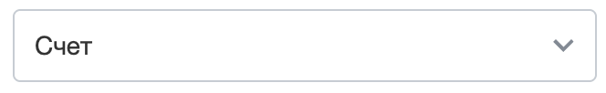
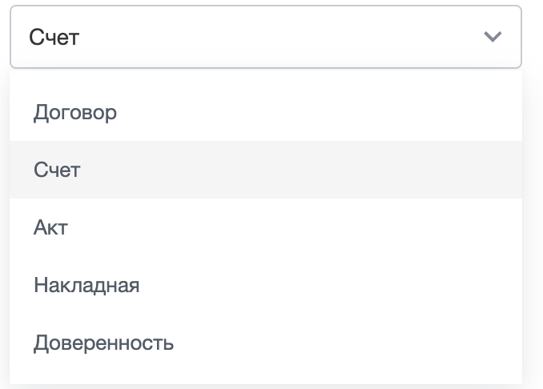
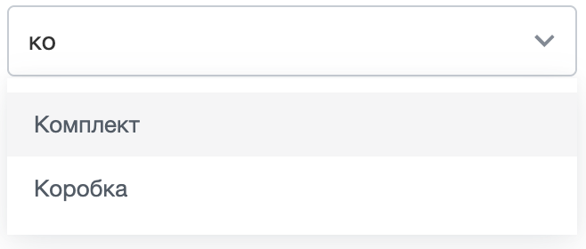
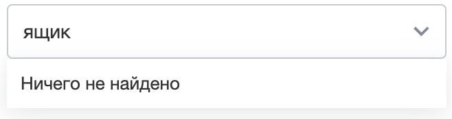

Выпадающий список — это поле с одним выбранным значением из заранее заданного набора вариантов. Компонент рисует поле в оформлении дизайн-системы и возвращает выбранное значение.

Список подходит для короткого фиксированного набора вариантов: должность сотрудника, режим отображения, тип документа, единица измерения. Варианты задают в коде при создании списка.

Компонент не загружает данные с сервера и не поддерживает множественный выбор. Для таких сценариев используйте расширение [ui.entity-selector](./entity-selector/index.md).

В Bitrix Framework за выпадающий список отвечает расширение `ui.select`. Оно экспортирует класс `Select` и строит список поверх меню из расширения [main.popup](./main-popup.md).

{width=664px height=102px}

## Подключить расширение

Если вы подключаете компонент из PHP, загрузите расширения `ui.select` и `ui.forms`.

```php
\Bitrix\Main\UI\Extension::load([
    'ui.select',
    'ui.forms',
]);
```



Расширение [ui.forms](./ui-forms.md) не входит в зависимости `ui.select` — подключайте его отдельно. Оно содержит классы `ui-ctl`, на которых построен контейнер списка. Если `ui.forms` не подключен, список отрисуется без оформления.



Если вы работаете в модульном JavaScript, импортируйте класс `Select` из `ui.select`.

```js
import { Select } from 'ui.select';
```

Вне модульного JavaScript класс доступен как `BX.Ui.Select`. Учитывайте регистр: пространство имен расширения — `BX.Ui`, а не `BX.UI`.

## Создать список

Чтобы показать список на странице, выполните основные действия:

1. Создайте экземпляр `Select` и передайте массив вариантов в параметре `options`.

2. Задайте начальное значение в параметре `value` или подсказку в параметре `placeholder`.

3. Вызовите метод `renderTo(target)` и передайте DOM-узел, в котором нужно показать список.

```js
import { Select } from 'ui.select';

const select = new Select({
    options: [
        { label: 'Договор', value: 'contract' },
        { label: 'Счет', value: 'invoice' },
        { label: 'Акт', value: 'act' },
        { label: 'Накладная', value: 'waybill' },
        { label: 'Доверенность', value: 'proxy' },
    ],
    value: 'invoice',
});

select.renderTo(document.getElementById('document-type'));
```

{width=678px height=486px}

Вариант из параметра `value` компонент показывает в поле и подсвечивает в открытом списке.

Пользователь видит одно поле варианта, а код получает другое.

-  `label` — подпись, которую компонент показывает пользователю в поле ввода и в списке.

-  `value` — значение, которое компонент возвращает как результат выбора.

Метод `renderTo(target)` отрисовывает список в переданном DOM-узле и возвращает этот узел. Перед вставкой он очищает содержимое узла, поэтому передавайте пустой контейнер, а не блок с готовой разметкой.

Если в `target` передан не DOM-узел, метод возвращает `null`, ничего не отрисовывает и не вызывает ошибку. Проверяйте, что контейнер найден, до вызова `renderTo(target)`.

Метода `destroy()` у компонента нет. Чтобы освободить ресурсы после удаления контейнера из DOM, очистите ссылку на экземпляр `Select`.

## Передать параметры

Все параметры конструктора необязательны. Если параметр не передан, компонент использует значение по умолчанию.

```ts
type SelectOption = {
    label: string;
    value: string;
};

type SelectOptions = {
    options?: SelectOption[];
    value?: string;
    placeholder?: string;
    isSearchable?: boolean;
    containerClassname?: string;
    popupParams?: PopupOptions;
};
```

#|
|| **Параметр** | **Тип** | **Описание** ||
|| `options` | `SelectOption[]` | Задает варианты списка. Если передан не массив, список остается пустым. По умолчанию пустой массив ||
|| `value` | `string` | Задает значение выбранного варианта при создании списка. Если варианта с таким значением нет, компонент оставляет выбор пустым. По умолчанию выбора нет ||
|| `placeholder` | `string` | Задает подсказку в поле, пока вариант не выбран. По умолчанию пустая строка ||
|| `isSearchable` | `boolean` | Включает поиск по вариантам. По умолчанию `false` ||
|| `containerClassname` | `string` | Добавляет свой CSS-класс контейнеру списка. Используйте его, чтобы задать ширину поля или отступы. По умолчанию пустая строка ||
|| `popupParams` | `PopupOptions` | Переопределяет параметры всплывающего окна списка. Состав объекта описан в статье [Всплывающие окна и меню main.popup](./main-popup.md). По умолчанию пустой объект ||
|#

Если массив `options` пуст, компонент показывает вместо списка окно с сообщением о пустом результате. Когда варианты приходят с сервера, создавайте список после того, как данные загружены.

Чтобы обновить набор вариантов, создайте новый экземпляр `Select` и вызовите `renderTo(target)` для того же контейнера. Метода для замены `options` у компонента нет.

## Включить поиск по вариантам

Передайте `isSearchable: true`, если вариантов много и по ним нужен поиск.

```js
import { Select } from 'ui.select';

const select = new Select({
    // Массив объектов SelectOption с полями label и value
    options: units,
    placeholder: 'Начните вводить название',
    isSearchable: true,
});

select.renderTo(document.getElementById('unit'));
```

{width=658px height=280px}

Поиск работает по четырем правилам.

-  Компонент отбирает варианты из массива `options` по началу подписи без учета регистра. Запрос `дог` найдет вариант `Договор`, но не найдет вариант `Типовой договор`.

-  Если под запрос не подошел ни один вариант, компонент закрывает список и показывает окно с сообщением «Ничего не найдено». Как только запрос снова совпадает хотя бы с одним вариантом, компонент открывает список заново.

-  При закрытии списка компонент сбрасывает поисковый запрос и возвращает в поле подпись выбранного варианта, поэтому незавершенный поиск не меняет текущее значение.

-  Ввод в поле доступен только пока открыт список или окно с сообщением о пустом результате. В остальное время компонент держит поле в режиме `readonly`, а при `isSearchable: false` — постоянно.

{width=658px height=174px}

## Получить и изменить выбранное значение

Компонент хранит выбранный вариант внутри экземпляра. За чтение и изменение выбора отвечают три метода.

-  `getValue()` — возвращает строку со значением выбранного варианта, а если вариант не выбран — пустую строку.

-  `setValue(value)` — выбирает вариант с указанным значением, подставляет его подпись в поле и вызывает событие `update`.

-  `getInput()` — возвращает DOM-узел `<input>` внутри контейнера. Используйте его, чтобы задать полю свои атрибуты.

Метод `setValue(value)` с неизвестным значением сбрасывает выбор, но не меняет текст в поле и не вызывает событие. Передавайте в него только те значения, которые есть в `options`.

Компонент не создает элемент `<select>` и скрытое поле формы. Отправляйте значение сами: прочитайте его методом `getValue()` или задайте атрибут `name` узлу из `getInput()`.

В примере обработчик кнопки читает значение списка перед отправкой формы и возвращает выбор к варианту по умолчанию.

```js
import { Select } from 'ui.select';

const select = new Select({
    options: [
        { label: 'Договор', value: 'contract' },
        { label: 'Счет', value: 'invoice' },
    ],
    value: 'contract',
});

select.renderTo(document.getElementById('document-type'));

document.getElementById('save').addEventListener('click', () => {
    // Без выбранного варианта форму не отправляем
    const documentType = select.getValue();

    if (documentType === '')
    {
        return;
    }

    sendForm({ documentType });
    select.setValue('contract');
});
```

## Обработать выбор значения

Класс `Select` наследует `EventEmitter` из расширения `main.core.events` и вызывает одно событие в пространстве имен `BX.UI.Select`.

#|
|| **Событие** | **Данные события** | **Когда срабатывает** ||
|| `update` | Значение `value` выбранного варианта | При закрытии списка с выбранным вариантом, а также при вызове `setValue()` с известным значением ||
|#

В обработчик приходит объект `BaseEvent`, метод `getData()` возвращает значение выбранного варианта.

```js
import { Select } from 'ui.select';

const select = new Select({
    options: documentTypes,
});

select.subscribe('update', (event) => {
    const documentType = event.getData();

    loadTemplates(documentType);
});

select.renderTo(document.getElementById('document-type'));
```

Компонент запоминает выбранный вариант в момент клика по пункту, а подставляет его в поле и вызывает событие только после закрытия списка.

Пока вариант выбран, событие приходит на каждое закрытие — в том числе когда пользователь открыл список и закрыл его, не меняя выбор. Если обработчик отправляет запрос или перестраивает интерфейс, сравнивайте новое значение с предыдущим.

```js
// Список select создан в предыдущем примере
let currentValue = select.getValue();

select.subscribe('update', (event) => {
    const value = event.getData();

    if (value === currentValue)
    {
        return;
    }

    currentValue = value;
    loadTemplates(value);
});
```

Если обработчик находится вне кода, который создает список, подпишитесь на событие через `EventEmitter`. Полное имя события — `BX.UI.Select:update`.

Метод `getTarget()` возвращает экземпляр `Select`, в котором произошел выбор. Так один обработчик различает несколько списков на странице.

```js
import { EventEmitter } from 'main.core.events';

EventEmitter.subscribe('BX.UI.Select:update', (event) => {
    const select = event.getTarget();

    console.log(select.getValue(), event.getData());
});
```

Метод `unsubscribe('update', handler)` отписывает обработчик от события. Передайте методу ту же функцию, которую передавали в `subscribe()`.

## Управлять открытием списка

Список открывается сам, когда пользователь ставит фокус в поле или кликает по нему, и закрывается, когда поле теряет фокус. Из кода состоянием списка управляют три метода.

-  `showMenu()` — открывает список. При первом вызове метод создает меню, а при следующих переиспользует его.

-  `hideMenu()` — закрывает список и подставляет в поле подпись выбранного варианта.

-  `isMenuShown()` — возвращает `true`, если список открыт.

```js
document.getElementById('choose-type').addEventListener('click', () => {
    if (select.isMenuShown())
    {
        select.hideMenu();
    }
    else
    {
        select.showMenu();
    }
});
```

## Использовать клавиатуру

Пока фокус находится в поле, компонент обрабатывает клавиши навигации и выбора.

#|
|| **Клавиша** | **Действие** ||
|| `Space` | Открывает закрытый список. Если список уже открыт и включен поиск, пробел попадает в поле как обычный символ ||
|| `ArrowDown`, `ArrowUp` | Переводят подсветку на следующий или предыдущий вариант и прокручивают список к нему ||
|| `Enter` | Выбирает подсвеченный вариант и закрывает список ||
|| `Esc` | Закрывает список. Подсветка вариантов на выбор не влияет, поэтому значение остается прежним ||
|#

Клавиша `Esc` не отменяет уже сделанный клик: если пользователь щелкнул по пункту, компонент запомнил вариант и подставит его при закрытии списка.

## Настроить всплывающее окно списка

Параметр `popupParams` принимает объект [PopupOptions](./main-popup.md). Компонент передает его двум окнам: списку вариантов и окну с сообщением о пустом результате. Используйте параметр, чтобы изменить положение окна, добавить свой класс или ограничить высоту.

Ширину в `popupParams` не задавайте. Компонент открывает список по ширине поля и замеряет ее при первом открытии. Задавайте ширину контейнеру через `containerClassname`.

```js
import { Select } from 'ui.select';

const select = new Select({
    options: documentTypes,
    popupParams: {
        offsetTop: 4,
        maxHeight: 240,
        className: 'my-document-type-popup',
    },
});
```

Значения из `popupParams` перекрывают собственные настройки компонента, включая привязку окна к полю. Передавайте только те параметры, которые действительно нужно изменить.

Компонент сохраняет обработчик `events.onAfterClose` из `popupParams` и вызывает его последним — после того, как сам отреагирует на закрытие. Вызов происходит один раз, когда закрыты и список, и окно с сообщением о пустом результате. Если одно из окон еще открыто, компонент обработчик не вызывает.

Остальные обработчики из `events` компонент передает всплывающему окну без изменений.

## Задать свои стили

Компонент сам расставляет классы на контейнере и в меню. Пишите свои правила поверх них, когда нужно изменить оформление поля или пунктов списка.

Компонент собирает контейнер из четырех классов и добавляет к ним значение `containerClassname`.

-  `ui-select` — класс самого компонента.

-  `ui-ctl`, `ui-ctl-after-icon`, `ui-ctl-dropdown` — классы поля-списка из расширения [ui.forms](./ui-forms.md).

Пока открыт список или окно с сообщением о пустом результате, контейнер получает модификатор `--open`. По нему компонент переворачивает стрелку в поле.

Компонент открывает меню списка с классом `select-menu-popup`. Значение `className` из `popupParams` этот класс заменяет, поэтому передавайте его, только если готовы отказаться от стандартного оформления меню.

Пункт списка получает классы `ui-select__menu-item` и `menu-popup-no-icon`, а подсвеченный пункт — еще и `menu-popup-item-open`.

В примере правило делает подписи пунктов полужирными во всех списках страницы.

```css
.select-menu-popup .ui-select__menu-item {
    font-weight: 600;
}
```

## Связанные материалы

-  [Диалог выбора объектов ui.entity-selector](./entity-selector/index.md) — выбор пользователей, подразделений и других объектов с провайдерами данных и множественным выбором.

-  [Поля форм ui.forms](./ui-forms.md) — классы `ui-ctl` для оформления полей ввода, включая контейнер выпадающего списка.

-  [Системное поле ввода](./system-input.md) — текстовое поле в системном оформлении и режим кликабельного селектора.

-  [Всплывающие окна и меню main.popup](./main-popup.md) — параметры `PopupOptions` и класс `Menu`, на которых построен список.

-  [Системный чип](./system-chip.md) — компактный элемент для показа выбранного значения.

-  [Расширения](../framework/extensions.md) — подключение JavaScript-расширений Bitrix Framework.
